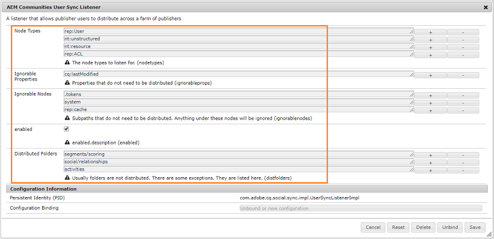

# コミュニティのユーザーの同期 {#communities-user-synchronization}

## はじめに {#introduction}

Adobe Experience Manager(AEM)Communities のパブリッシュ環境から（設定されている権限に応じて）、 *サイト訪問者* ～になるかもしれない *メンバー*、作成 *ユーザーグループ*&#x200B;を編集します。 *メンバープロファイル* .

*ユーザーデータ* は、 *ユーザー*, *ユーザープロファイル*、および *ユーザーグループ*.

*メンバー* ～を参照する *ユーザー* オーサー環境に登録されたユーザーとは異なり、パブリッシュ環境に登録されていました。

ユーザーデータに関する詳細は、 [ユーザーとユーザーグループの管理](/help/communities/users.md).

## パブリッシュファーム間でのユーザーの同期 {#synchronizing-users-across-a-publish-farm}

設計上、パブリッシュ環境で作成されたユーザーデータは、オーサー環境には表示されません。

オーサー環境で作成されたほとんどのユーザーデータは、オーサー環境にとどまることを目的としており、パブリッシュインスタンスに同期もレプリケートもされません。

次の場合に [トポロジ](/help/communities/topologies.md) は [パブリッシュファーム](/help/sites-deploying/recommended-deploys.md#tarmk-farm)を使用する場合、1 つのパブリッシュインスタンスでおこなわれた登録と変更は、他のパブリッシュインスタンスと同期する必要があります。 メンバーは、任意のパブリッシュノードにログインしてデータを表示できる必要があります。

ユーザーの同期が有効になっている場合、ユーザーデータはファーム内のパブリッシュインスタンス間で自動的に同期されます。

### ユーザー同期の設定手順 {#user-sync-setup-instructions}

パブリッシュファーム間で同期を有効にする手順について詳しくは、 [ユーザーの同期](/help/sites-administering/sync.md).

## バックグラウンドでのユーザー同期 {#user-sync-in-the-background}


* **vlt パッケージ**

  これは、パブリッシャーでおこなわれたすべての変更の zip ファイルで、パブリッシャー間で配布する必要があります。 パブリッシャー上で変更を行うと、変更イベントリスナーによって選択されたイベントが生成されます。 これにより、すべての変更を含む vlt パッケージが作成されます。

* **配布パッケージ**

  Sling の配布情報が含まれます。 コンテンツを配布する必要がある場所と最後に配布された日時に関する情報です。

## 各種操作の結果 {#what-happens-when}

### コミュニティサイトコンソールからサイトを発行 {#publish-site-from-communities-sites-console}

オーサー環境で、コミュニティサイトが [コミュニティサイトコンソール](/help/communities/sites-console.md)に設定した場合、 [複製](/help/sites-deploying/configuring.md#replication-reverse-replication-and-replication-agents) 関連するページと Sling が、動的に作成されたコミュニティユーザーグループを、そのメンバーシップも含めて配布します。

### ユーザーがパブリッシュ環境で作成または編集されたプロファイル {#user-is-created-or-edits-profile-on-publish}

デザインにより、パブリッシュ環境で作成されたユーザーとプロファイル（自己登録、ソーシャルログイン、LDAP 認証など）は、オーサー環境には表示されません。

トポロジーが[パブリッシュファーム](/help/communities/topologies.md)であり、ユーザー同期が正しく設定されると、Sling 配布を使用して&#x200B;*ユーザー*&#x200B;と&#x200B;*ユーザープロファイル*&#x200B;がパブリッシュファーム間で同期されます。

### 新しいコミュニティグループがパブリッシュで作成されました {#new-community-group-is-created-on-publish}

パブリッシュインスタンスから開始したコミュニティグループの作成ですが、新しいサイトページと新しいユーザーグループが作成されます。これは、実際にはオーサーインスタンス上で発生します。

プロセスの一環として、新しいサイトページがすべてのパブリッシュインスタンスにレプリケートされます。 動的に作成されるコミュニティユーザーグループとそのメンバーシップは、 Sling をすべてのパブリッシュインスタンスに配布します。

### セキュリティコンソールを使用してユーザーやユーザーグループが作成される場合 {#users-or-user-groups-are-created-using-security-console}

設計上、パブリッシュ環境で作成されたユーザーデータは、オーサー環境にも反対にも表示されません。

次の場合に [ユーザー管理とセキュリティ](/help/sites-administering/security.md) コンソールは、パブリッシュ環境で新しいユーザーを追加するために使用され、必要に応じて、ユーザー同期は新しいユーザーとそのグループメンバーシップを他のパブリッシュインスタンスと同期します。 ユーザー同期により、セキュリティコンソールによって作成されたユーザーグループも同期されます。

### ユーザーが投稿時にコンテンツを投稿 {#user-posts-content-on-publish}

ユーザー生成コンテンツ (UGC) の場合、パブリッシュインスタンスに入力されたデータには、 [設定済み SRP](/help/communities/srp-config.md).

## ベストプラクティス {#bestpractices}

デフォルトでは、ユーザー同期は **無効**. ユーザー同期を有効にするには、変更が必要です *既存* OSGi 設定。 ユーザー同期を有効にした結果、新しい設定が追加されることはありません。

ユーザー同期では、作成者にユーザーデータが作成されていない場合でも、ユーザーデータの配布を管理する際には作成者環境が必要です。

**前提条件**

1. ）1 つのパブリッシャーでユーザーおよびユーザーグループが既に作成されている場合は、ユーザー同期を設定して有効にする前に、ユーザーデータをすべてのパブリッシャーと[手動で同期](/help/sites-administering/sync.md#manually-syncing-users-and-user-groups)することをお勧めします。

   ユーザー同期を有効にすると、新しく作成されたユーザーとグループのみが同期されます。

1. 最新のコードがインストールされていることを確認します。

   * [AEM プラットフォームの更新](https://helpx.adobe.com/jp/experience-manager/kb/aem62-available-hotfixes.html)
   * [AEM Communities の更新](/help/communities/deploy-communities.md#latestfeaturepack)

AEM Communitiesでユーザーの同期を有効にするには、次の設定が必要です。 Sling コンテンツの配布が失敗するのを防ぐために、これらの設定が正しいことを確認します。

### Apache Sling Distribution Agent - Sync Agents Factory {#apache-sling-distribution-agent-sync-agents-factory}

この設定は、パブリッシャー全体で同期されるコンテンツを取得します。 設定はオーサーインスタンス上にあります。 作成者は、そこに存在するすべての公開者と、すべての情報を同期する場所を追跡する必要があります。

この設定のデフォルト値は、1 つのパブリッシュインスタンス用です。 ユーザー同期は、パブリッシュファームなど、複数のパブリッシュインスタンスを同期する場合に便利なので、追加のパブリッシュインスタンスを設定に追加する必要があります。

**コンテンツはどのように同期されますか？**

オーサーインスタンスが、パブリッシャーのエクスポーターエンドポイントに ping を発行します。 特定の発行者 (n) でユーザーが作成または更新されるたびに、作成者は、書き出しエンドポイントおよび [コンテンツをプッシュ](/help/communities/sync.md#main-pars-image-1413756164) を他のパブリッシャー（n-1、つまりコンテンツの取得元とは別のパブリッシャー）に送信する場合。

Apache Sling 同期エージェントを設定するには：

1. AEMオーサーインスタンスでの管理者権限でログインします。
1. 次にアクセス： [Web コンソール](/help/sites-deploying/configuring-osgi.md). 例： [https://localhost:4502/system/console/configMgr](https://localhost:4502/system/console/configMgr).
1. 場所 **Apache Sling Distribution Agent - Sync Agents Factory**.

   * 編集用に開く既存の設定を選択します（鉛筆アイコン）。

     名前を確認： **socialpubsync.**

   * 「**有効**」チェックボックスを選択します。
   * 選択 **複数のキューを使用します。**
   * 指定 **エクスポーターエンドポイント** および **インポーターエンドポイント** （エクスポーターおよびインポーターエンドポイントをさらに追加できます）。

     これらのエンドポイントは、コンテンツの取得元と、コンテンツのプッシュ先を定義します。 作成者は、指定されたエクスポーターエンドポイントからコンテンツを取得し、そのコンテンツを（コンテンツの取得元の発行者以外の）発行者にプッシュします。

   

### AdobeGranite 配布 — 暗号化パスワードトランスポート秘密鍵プロバイダー {#adobe-granite-distribution-encrypted-password-transport-secret-provider}

作成者は、作成者から発行へのユーザーデータの同期権限を持つ、認証済みユーザーを識別できます。

The [認証済みユーザーが作成されました](/help/sites-administering/sync.md#createauthuser) すべてのパブリッシュインスタンスでは、パブリッシャーはオーサーとの接続とオーサーでの Sling 配布の設定をおこなうことができます。 この承認済みユーザーは、すべての要件を満たしています [ACL](/help/sites-administering/sync.md#howtoaddacl).

パブリッシャーにデータをインストールする場合、またはパブリッシャーからデータを取得する場合は常に、この設定で設定された資格情報（ユーザー名とパスワード）を使用してパブリッシャーに接続します。

認証済みユーザーを使用してオーサーとパブリッシャーを接続するには：

1. AEMオーサーインスタンスでの管理者権限でログインします。
1. 次にアクセス： [Web コンソール](/help/sites-deploying/configuring-osgi.md).

   例： [https://localhost:4502/system/console/configMgr](https://localhost:4502/system/console/configMgr).
1. 場所 **AdobeGranite 配布 — 暗号化されたパスワードトランスポート秘密鍵プロバイダー。**
1. 編集用に開く既存の設定を選択します（鉛筆アイコン）。

   プロパティを検証 **socialpubsync** - **publishUser.**

1. ユーザー名とパスワードを [認証済みユーザー](/help/sites-administering/sync.md#createauthorizeduser).

   例： **usersync - admin**


### Apache Sling Distribution Agent - Queue Agents Factory {#apache-sling-distribution-agent-queue-agents-factory}

この設定は、パブリッシャー間で同期するデータを設定するために使用します。 で指定したパスでデータが作成/更新されたとき **許可されたルート**&#x200B;を指定した場合、「var/community/distribution/diff」がアクティブ化され、作成されたレプリケーターがパブリッシャーからデータを取得して、他のパブリッシャーにインストールします。

同期するデータ（ノードパス）を設定するには、次の手順に従います。

1. パブリッシュインスタンス上で管理者権限でログインします。
1. 次にアクセス： [Web コンソール](/help/sites-deploying/configuring-osgi.md).

   例： [https://localhost:4503/system/console/configMgr](https://localhost:4503/system/console/configMgr).

1. 場所 **Apache Sling Distribution Agent - Queue Agents Factory**.
1. 編集用に開く既存の設定を選択します（鉛筆アイコン）。

   名前を検証： **socialpubsync -reverse**

1. を選択します。 **有効** チェックボックスをオンにして保存します。
1. レプリケート先のノードパスを指定します。 **許可されたルート**.
1. 各に対して繰り返し **公開** インスタンス。

   

### AdobeGranite 配布 — 差分監視者ファクトリー {#adobe-granite-distribution-diff-observer-factory}

この設定は、パブリッシャー間でグループメンバーシップを同期します。
あるパブリッシャーでグループのメンバーシップを変更しても、他のパブリッシャーのメンバーシップが更新されない場合は、 **ref : members** が **プロパティ名を参照**.

メンバーの同期を確実に行うには、次の手順に従います。

1. パブリッシュインスタンス上で管理者権限でログインします。
1. 次にアクセス： [Web コンソール](/help/sites-deploying/configuring-osgi.md).

   例： [https://localhost:4503/system/console/configMgr](https://localhost:4503/system/console/configMgr).

1. 場所 **AdobeGranite 配布 — 差分監視者ファクトリー**.
1. 編集用に開く既存の設定を選択します（鉛筆アイコン）。

   検証 **エージェント名：socialpubsync -reverse**.

1. 「**有効**」チェックボックスを選択します。
1. 指定 **rep:members** 次のプロパティ名の説明： **プロパティ名を参照**、をクリックして保存します。

   

### Apache Sling 配布トリガー — 予定トリガーファクトリ {#apache-sling-distribution-trigger-scheduled-triggers-factory}

この設定を使用すると、（作成者が変更を取り込んで発行者に送信する）ポーリング間隔を設定して、発行者間で変更を同期できます。

作成者は、30 秒ごと（デフォルト）に発行者をポーリングします。 フォルダーにパッケージが存在する場合 `/var/sling/distribution/packages/  socialpubsync -  vlt /shared`その後、それらのパッケージを取得し、他のパブリッシャーにインストールします。

ポーリング間隔を変更するには：

1. AEMオーサーインスタンスでの管理者権限でログインします。
1. 次にアクセス： [Web コンソール](/help/sites-deploying/configuring-osgi.md)例： [https://localhost:4502/system/console/configMgr](https://localhost:4502/system/console/configMgr)
1. 場所 **Apache Sling 配布トリガー — 予定トリガーファクトリ**

   * 編集用に開く既存の設定を選択します（鉛筆アイコン）。

     検証 **socialpubsync -scheduled-トリガー**

   * 間隔（秒）を目的の間隔に設定し、保存します。

   

### AEM Communities User Sync Listener {#aem-communities-user-sync-listener}

Sling 配布で、サブスクリプションとフォローに不一致がある問題については、 **AEM Communities User Sync Listener** 設定は次のように設定されます。

* NodeTypes
* IgnorableProperties
* IgnorableNodes
* DistributedFolders

購読、フォロー、および通知を同期するには

各AEMパブリッシュインスタンスで、次の手順を実行します。

1. 管理者権限でログインします。
1. 次にアクセス： [Web コンソール](/help/sites-deploying/configuring-osgi.md). 例： [https://localhost:4503/system/console/configMgr](https://localhost:4503/system/console/configMgr).
1. 場所 **AEM Communities User Sync Listener**.
1. 編集用に開く既存の設定を選択します（鉛筆アイコン）

   名前を検証： **socialpubsync -scheduled-トリガー**

1. 次の設定を行います。 **NodeTypes**:

   `rep:User`

   `nt:unstructured`

   `nt:resource`

   `rep:ACL`

   `sling:Folder`

   `sling:OrderedFolder`

   このプロパティで指定されたノードタイプが同期され、通知情報（ブログと設定が続く）が異なる発行者間で同期されます。

1. 同期するすべてのフォルダーを追加 **DistributedFolders**. 例：

   `segments/scoring`

   `social/relationships`

   `activities`

1. を設定します。 **ignorablenodes** 移動先：

   `.tokens`

   `system`

   `rep:cache` （スティッキーセッションが使用されるので、このノードを別の発行者に同期する必要はありません）。

   

### 一意の Sling ID {#unique-sling-id}

AEMオーサーインスタンスは、Sling ID を使用して、データの送信先と、パッケージを送り返す（または送り返す）必要のあるパブリッシャーを特定します。

パブリッシュファーム内のすべてのパブリッシャーが一意の Sling ID を持っていることを確認します。 Sling ID がパブリッシュファーム内の複数のパブリッシュインスタンスに対して同じである場合、ユーザーの同期は失敗します。 作成者は、パッケージの取得元とインストール先を知らないので、

パブリッシュファーム内のパブリッシャーの一意の Sling ID を、各パブリッシュインスタンスで確実に使用するには、次の手順を実行します。

1. 参照先 [https://_host:port_/system/console/status-slingsettings](https://localhost:4503/system/console/status-slingsettings).
1. の値を確認します。 **Sling ID**.

   

   あるパブリッシュインスタンスの Sling ID が他のパブリッシュインスタンスの Sling ID と一致する場合は、次のようにします。

1. 一致する Sling ID を持つパブリッシュインスタンスの 1 つを停止します。
1. Adobe Analytics の `crx-quickstart/launchpad/felix` ディレクトリ、という名前のファイルを検索して削除します。 *sling.id.file.*

   例えば、Linux システムの場合は、次のようになります。

   `rm -i $(find . -type f -name sling.id.file)`

   例えば、Windows システムの場合、次のようになります。

   Windows エクスプローラーを使用して、以下を検索します。 `sling.id.file`

1. パブリッシュインスタンスを起動します。 起動時に、新しい Sling ID が割り当てられます。
1. を検証します。 **Sling ID** が一意になりました。

すべてのパブリッシュインスタンスの Sling ID が一意になるまでこの手順を繰り返します。

### Vault Package Builder Factory {#vault-package-builder-factory}

更新を正しく同期するには、ユーザ同期用に Vault パッケージビルダーを変更する必要があります。
In `/home/users`, a `*/rep:cache` ノードが作成されます。 ノードのプリンシパル名に対してクエリを実行すると、このキャッシュが直接使用できることを確認するために使用されるキャッシュです。

次の場合にユーザーの同期が停止する可能性がある： `rep :cache` ノードはパブリッシャー間で同期されます。

パブリッシャー間で更新が正しく同期されるようにするには、各AEMパブリッシュインスタンスで次の手順を実行します。

1. 次にアクセス： [Web コンソール](/help/sites-deploying/configuring-osgi.md)

   例： [https://localhost:4503/system/console/configMgr](https://localhost:4503/system/console/configMgr).
1. 次を見つけます。 **Apache Sling 配布パッケージ — Vault Package Builder Factory**

   ビルダー名：socialpubsync-vlt。

1. 編集アイコンを選択します。
1. 2 つのパッケージノードフィルターを追加します。
   * `/home/users|-.*/.tokens`
   * `/home/users|-.*/rep:cache`
1. ポリシーの処理
   * 既存の rep :policy ノードを新しいノードで上書きするには、3 つ目のパッケージフィルタを追加します。 `/home/users|+.*/rep:policy`
   * ポリシーの配布を防ぐには、次のように設定します。 `Acl Handling: IGNORE`

   

## AEM Communitiesでの Sling 配布のトラブルシューティング {#troubleshoot-sling-distribution-in-aem-communities}

Sling 配布が失敗した場合は、次のデバッグ手順を試してください。

1. **次を確認 [不適切に追加された設定](/help/sites-administering/sync.md#improperconfig)**

   複数の設定を追加または編集しないようにします。代わりに、既存のデフォルト設定を編集する必要があります。
1. **設定を確認**

   すべての [設定](/help/communities/sync.md#bestpractices) がAEMオーサーインスタンスで適切に設定されているかどうかを確認します。詳しくは、 [ベストプラクティス](/help/communities/sync.md#main-pars-header-863110628).

1. **認証済みユーザー権限の確認**

   パッケージが正しくインストールされていない場合は、 [認証済みユーザー](/help/sites-administering/sync.md#createauthuser) 最初のパブリッシュインスタンスで作成されたが、正しい ACL を持っている。

   これを検証するには、 [認証済みユーザーが作成されました](/help/sites-administering/sync.md#createauthuser) 変更する [AdobeGranite 配布 — 暗号化パスワードトランスポート秘密鍵プロバイダー](/help/sites-administering/sync.md#adobegraniteencpasswrd) オーサーインスタンスの設定で、管理者ユーザーの資格情報を使用します。 次に、パッケージを再度インストールしてみてください。 ユーザー同期が管理者の資格情報で正常に機能する場合は、作成された公開ユーザーに適切な ACL がなかったことを意味します。

1. **差分監視者ファクトリ設定を確認**

   特定のノードのみがパブリッシュファーム全体で同期されない（例えば、グループメンバーが同期されない）場合は、 [AdobeGranite 配布 — 差分監視者ファクトリー](/help/sites-administering/sync.md#diffobserver) 設定が有効になっており、 **rep: members** が **プロパティ名を参照**.

1. **AEM Communities User Sync Listener 設定を確認します。** 作成したユーザーが同期されているものの、サブスクリプションとフォローが機能しない場合は、AEM Communities User Sync Listener の設定に次の事項が含まれていることを確認します。

   * ノードタイプ — に設定 **rep:User, nt:unstructured**, **nt:resource**, **rep:ACL**, **sling:Folder**、および **sling:OrderedFolder**.
   * 無視可能なノード — に設定 **.tokens**, **システム**、および **rep :cache**.
   * [ 配布フォルダ ]：配布するフォルダに設定します。

1. **パブリッシュインスタンスでのユーザー作成時に生成されたログを確認する**

   上記の設定が適切に設定されているにもかかわらず、ユーザー同期が機能していない場合は、ユーザーの作成時に生成されるログを確認します。

   次のように、ログの順序が同じかどうかを確認します。

   ```shell
   15.05.2016 18:33:01.523 *INFO* [sling-oak-observation-7422] com.adobe.cq.social.sync.impl.PublisherSyncServiceImpl Handing these paths to the distribution subsystem: [/home/users/C, /home/users/C/Cw-5avWqilmqsNn5hCvK]
   15.05.2016 18:33:01.523 *INFO* [sling-oak-observation-7422] org.apache.sling.distribution.agent.impl.SimpleDistributionAgent [agent][socialpubsync-reverse] REQUEST-START DSTRQ2: ADD paths=[/home/users/C, /home/users/C/Cw-5avWqilmqsNn5hCvK], user=communities-user-admin
   15.05.2016 18:33:01.523 *INFO* [sling-oak-observation-7431] com.adobe.cq.social.sync.impl.PublisherSyncServiceImpl Handing these paths to the distribution subsystem: [/home/users/C/Cw-5avWqilmqsNn5hCvK, /home/users/C/Cw-5avWqilmqsNn5hCvK/profile, /home/users/C/Cw-5avWqilmqsNn5hCvK/rep:policy]
   15.05.2016 18:33:01.523 *INFO* [sling-oak-observation-7431] org.apache.sling.distribution.agent.impl.SimpleDistributionAgent [agent][socialpubsync-reverse] REQUEST-START DSTRQ3: ADD paths=[/home/users/C/Cw-5avWqilmqsNn5hCvK, /home/users/C/Cw-5avWqilmqsNn5hCvK/profile, /home/users/C/Cw-5avWqilmqsNn5hCvK/rep:policy], user=communities-user-admin
   15.05.2016 18:33:01.757 *INFO* [sling-oak-observation-7431] org.apache.jackrabbit.vault.packaging.impl.JcrPackageDefinitionImpl unwrapping package sling/distribution:socialpubsync-vlt_1463337181554_ebb27ad9-a861-4405-9342-d64c916654e2:0.0.1
   15.05.2016 18:33:01.820 *INFO* [sling-oak-observation-7422] org.apache.jackrabbit.vault.packaging.impl.JcrPackageDefinitionImpl unwrapping package sling/distribution:socialpubsync-vlt_1463337181554_58811273-5861-48fe-95d2-4aff367b99c3:0.0.1
   15.05.2016 18:33:02.023 *INFO* [sling-oak-observation-7430] com.adobe.cq.social.sync.impl.PublisherSyncServiceImpl Handing these paths to the distribution subsystem: [/home/users/C/Cw-5avWqilmqsNn5hCvK/profile]
   15.05.2016 18:33:02.023 *INFO* [sling-oak-observation-7430] org.apache.sling.distribution.agent.impl.SimpleDistributionAgent [agent][socialpubsync-reverse] REQUEST-START DSTRQ4: ADD paths=[/home/users/C/Cw-5avWqilmqsNn5hCvK/profile], user=communities-user-admin
   15.05.2016 18:33:02.273 *INFO* [sling-oak-observation-7430] org.apache.jackrabbit.vault.packaging.impl.JcrPackageDefinitionImpl unwrapping package sling/distribution:socialpubsync-vlt_1463337182039_f34f4fa6-10b9-42eb-8740-4da9d4d38f99:0.0.1
   ```

デバッグするには：

1. ユーザーの同期を無効にします。
1. AEMオーサーインスタンスで、管理者権限でログインします。

   1. 次にアクセス： [Web コンソール](/help/sites-deploying/configuring-osgi.md). 例： [https://localhost:4502/system/console/configMgr](https://localhost:4502/system/console/configMgr).
   1. 設定を見つけます。 **Apache Sling Distribution Agent - Sync Agents Factory**.
   1. 選択を解除すると、 **有効** 」チェックボックスをオンにします。

      オーサーインスタンス（エクスポーターおよびインポーター）のエンドポイントでユーザー同期を無効にすると、オーサーインスタンスが静的になります。 The **vlt** 作成者はパッケージに対して ping を送信したり取得したりしません。

      パブリッシュインスタンスでユーザーが作成された場合、 **vlt** パッケージは次の場所に作成されます。 */var/sling/distribution/packages/ socialpubsync - vlt /data* ノード。 作成者がこれらのパッケージを別のサービスにプッシュした場合も同様です。 このデータをダウンロードして抽出し、他のサービスにプッシュされるすべてのプロパティを確認できます。

1. 投稿者に移動し、投稿者でユーザーを作成します。 その結果、イベントが作成されます。
1. 次を確認します。 [ログの順序](/help/communities/sync.md#troubleshoot-sling-distribution-in-aem-communities) ユーザーの作成時に作成されました。
1. 次の条件を満たしているかどうかを確認します。 **vlt** パッケージの作成日： **/var/sling/distribution/packages/socialpubsync-vlt/data**.
1. 次に、AEMオーサーインスタンスでユーザー同期を有効にします。
1. パブリッシャーで、のエクスポーターまたはインポーターエンドポイントを変更します。 **Apache Sling Distribution Agent - Sync Agents Factory**.
パッケージデータをダウンロードおよび抽出して、他のパブリッシャーにプッシュされるすべてのプロパティと、どのデータが失われたかを確認できます。
