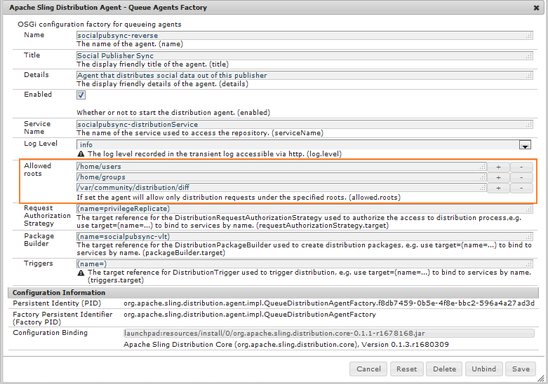

# コミュニティのユーザーの同期 {#communities-user-synchronization}

## 概要 {#introduction}

In AEM Communities, from the publish environment (depending on permissions configured), *site visitors* may become *members*, create *user groups*, and edit their *member profile* .

*ユーザーデータ* (User data *)とは、ユーザー、ユーザー*&#x200B;プロファイル *、ユーザーグ* ループを指しま **&#x200B;す。

メンバーという用語は、オーサー環境で登録されたユーザーではなく、パブリッシュ環境で登録されたユーザーを指します。****

ユーザーデータについて詳しくは、[ユーザーとユーザーグループの管理](/help/communities/users.md)を参照してください。

## パブリッシュファーム間のユーザーの同期 {#synchronizing-users-across-a-publish-farm}

仕様上、パブリッシュ環境で作成されたデータは、オーサー環境では表示されません。

オーサー環境で作成されたほとんどのユーザーデータは、オーサー環境に残されたままとなり、パブリッシュインスタンスには同期もレプリケートもされません。

When the [topology](/help/communities/topologies.md) is a [publish farm](/help/sites-deploying/recommended-deploys.md#tarmk-farm), registration  and  modifications made on one publish instance need to be synchronized with other publish instances. メンバーはログインして、任意の発行ノードでデータを表示できる必要があります。

ユーザーの同期を有効にすると、ファーム内のパブリッシュインスタンス間でユーザーデータが自動的に同期されます。

### ユーザーの同期のセットアップ手順 {#user-sync-setup-instructions}

発行ファーム全体で同期を有効にする手順の詳細については、次を参照してください。

* [ユーザーの同期](/help/sites-administering/sync.md)

## バックグラウンドでのユーザー同期 {#user-sync-in-the-background}


* **vltパッケージ**

   これは、発行者に対して行われたすべての変更のzipファイルで、発行者に配布する必要があります。 パブリッシャの変更により、変更イベントリスナによって選択されるイベントが生成されます。 これにより、すべての変更を含むvltパッケージが作成されます。

* **配布パッケージ**

   Slingの配布情報が含まれます。 これは、コンテンツの配布が必要な場所と、最後に配布された日時に関する情報です。

## What Happens When ... {#what-happens-when}

### コミュニティのサイトコンソールでのサイトの公開 {#publish-site-from-communities-sites-console}

オーサー環境で、コミュニティサイトを[コミュニティサイトコンソール](/help/communities/sites-console.md)から公開すると、関連するページが[レプリケート](/help/sites-deploying/configuring.md#replication-reverse-replication-and-replication-agents)されます。また、Sling によって、動的に作成されたコミュニティユーザーグループ（メンバーシップを含む）が配信されます。

### パブリッシュ環境でのユーザーの作成またはプロファイルの編集 {#user-is-created-or-edits-profile-on-publish}

仕様上、パブリッシュ環境で（自己登録、ソーシャルログイン、LDAP 認証などで）作成されたユーザーやプロファイルはオーサー環境では表示されません。

When the topology is a [publish farm](/help/communities/topologies.md) and user sync has been correctly configured, the *user* and *user profile* is synchronized across the publish farm using Sling distribution.

### パブリッシュ環境での新しいコミュニティグループの作成 {#new-community-group-is-created-on-publish}

発行インスタンスから開始されましたが、新しいサイトページと新しいユーザーグループを生成するコミュニティグループの作成は、実際には作成者インスタンスで行われます。

このプロセスの一環として、新しいサイトページがすべてのパブリッシュインスタンスにレプリケートされます。動的に作成されたコミュニティユーザーグループとそのメンバーシップは、すべての発行インスタンスに配布されるSlingです。

### セキュリティコンソールでのユーザーまたはユーザーグループの作成 {#users-or-user-groups-are-created-using-security-console}

仕様上、パブリッシュ環境で作成されたユーザーデータは、オーサー環境では表示されません。その反対も同様です。

[ユーザー管理およびセキュリティ](/help/sites-administering/security.md)コンソールを使用してパブリッシュ環境で新しいユーザーを追加すると、ユーザーの同期機能により、新しいユーザーとそのグループメンバーシップがその他のパブリッシュインスタンスに同期されます（必要な場合）。また、ユーザー同期は、セキュリティコンソールを通じて作成されたユーザーグループを同期します。

### ユーザーによるパブリッシュ環境でのコンテンツの投稿 {#user-posts-content-on-publish}

ユーザー生成コンテンツ（UGC）に関しては、パブリッシュインスタンスで入力されたデータへのアクセスは、[設定済みの SRP](/help/communities/srp-config.md) を通じておこなわれます。

## ベストプラクティス {#bestpractices}

デフォルトでは、ユーザー同期は&#x200B;**無効**&#x200B;になっています。ユーザー同期を有効にするには、OSGi の既存の&#x200B;**&#x200B;設定を変更する必要があります。ユーザー同期を有効にした結果、新しい設定が追加されることはありません。

ユーザー同期では、オーサー環境で作成されていないユーザーデータでもその配布の管理はオーサー環境に依存します。

**前提条件**

1. If users and user groups have already been created on one publisher, it is recommended to [manually sync](/help/sites-administering/sync.md#manually-syncing-users-and-user-groups) the user data to all publishers prior to configuring and enabling user sync.

   ユーザー同期を有効にすると、新規に作成されたユーザーおよびグループのみが同期されるようになります。

1. 最新のコードがインストールされていることを確認します。

   * [AEM プラットフォームの更新](https://helpx.adobe.com/jp/experience-manager/kb/aem62-available-hotfixes.html)
   * [AEM Communities の更新](/help/communities/deploy-communities.md#latestfeaturepack)

AEM Communitiesでユーザーの同期を有効にするには、次の設定が必要です。 Slingコンテンツの配信に失敗しないように、これらの設定が正しいことを確認します。

### Apache Sling Distribution Agent - Sync Agents Factory {#apache-sling-distribution-agent-sync-agents-factory}

この設定は、発行者間で同期されるコンテンツを取得します。 設定は作成者インスタンスで行われます。 作成者は、そこに存在するすべての発行者と、すべての情報をどこで同期するかを追跡する必要があります。

設定のデフォルト値は、単一の発行インスタンス用です。 ユーザー同期は、複数の発行インスタンス（例えば、発行ファーム）を同期するのに役立つので、追加の発行インスタンスを設定に追加する必要があります。

**コンテンツの同期方法**

発行者インスタンスは、発行者のエクスポーターエンドポイントにpingを送信します。 特定の発行者(n)でユーザーが作成または更新されるたびに、作成者はエクスポーターエンドポイントからコンテンツを取得し、そのコンテンツを他の発行者 [(コンテンツの取得元とは別の発行者](/help/communities/sync.md#main-pars-image-1413756164) )にプッシュします。

Apache Sling同期エージェントの設定：

1. AEM作成者インスタンスの管理者権限でログインします。
1. Access the [Web Console](https://helpx.adobe.com/experience-manager/6-4/help/sites-deploying/configuring-osgi.html). For example, [https://localhost:4502/system/console/configMgr](https://localhost:4502/system/console/configMgr).
1. Locate **Apache Sling Distribution Agent - Sync Agents Factory**.

   * 編集用に開く既存の設定（鉛筆アイコン）を選択します。

      名前の確認：socialpubsyncを参照し **てください。**

   * Select the **Enabled** checkbox.
   * 「 **Use Multiple queues」を選択します。**
   * 「エクスポー **ターエンドポイント** 」と「インポ **ーターエンドポイント** 」を指定します（エクスポーターエンドポイントとインポーターエンドポイントをさらに追加できます）。

      これらのエンドポイントは、コンテンツの取得元と、コンテンツのプッシュ先を定義します。 「作成者」は、指定したエクスポーターエンドポイントからコンテンツを取得し、コンテンツを（コンテンツの取得元の発行者以外の）発行者にプッシュします。
   

### Adobe Granite Distribution - Encrypted Password Transport Secret Provider {#adobe-granite-distribution-encrypted-password-transport-secret-provider}

これにより、作成者は、発行するユーザーデータを同期する権限を持つ、承認されたユーザーを識別できます。

すべての [発行インスタンスで](/help/sites-administering/sync.md#createauthuser) 、許可されたユーザーが作成者と接続し、発行者のSling配布を設定するのに役立ちます。 この権限を持つユーザーは、必要なACLをすべて持っ [ています](/help/sites-administering/sync.md#howtoaddacl)。

発行者にデータをインストールしたり、発行者からデータを取り込んだりする場合は、この設定で設定された資格情報（ユーザー名とパスワード）を使用して発行者と接続します。

承認されたユーザーを使用して発行者に作成者を接続するには：

1. AEM作成者インスタンスの管理者権限でログインします。
1. Access the [Web Console](/help/sites-deploying/configuring-osgi.md).

   For example, [https://localhost:4502/system/console/configMgr](https://localhost:4502/system/console/configMgr).
1. Locate **Adobe Granite Distribution - Encrypted Password Transport Secret Provider.**
1. 編集用に開く既存の設定（鉛筆アイコン）を選択します。

   socialpubsyncプロパテ **ィ** - **publishUserを確認します。**

1. ユーザー名とパスワードを認証済みユーザー [に設定しま](/help/sites-administering/sync.md#createauthorizeduser)す。

   例： **usersync - admin**


### Apache Sling Distribution Agent - Queue Agents Factory {#apache-sling-distribution-agent-queue-agents-factory}

この設定は、発行者間で同期するデータを設定するために使用します。 許可されたルートで指定されたパスでデータが作成/更新されると ****、「var/community/distribution/diff」がアクティブ化され、作成されたレプリケーターはパブリッシャーからデータを取得し、他のパブリッシャーにインストールします。

同期するデータ（ノードパス）を設定するには：

1. 作成者インスタンスの管理者権限でログインします。
1. Access the [Web Console](https://helpx.adobe.com/experience-manager/6-4/help/sites-deploying/configuring-osgi.html).

   For example, [https://localhost:4503/system/console/configMgr](https://localhost:4503/system/console/configMgr).

1. Locate **Apache Sling Distribution Agent - Queue Agents Factory**.
1. 編集用に開く既存の設定（鉛筆アイコン）を選択します。

   名前の確認：socialpubsync **-reverse**

1. 「 **Enabled** 」チェック・ボックスを選択し、保存します。
1. 許可されたルートに複製するノードパスを指 **定します**。
1. Repeat for each **publish** instance.

   

### Adobe Granite Distribution - Diff Observer Factory {#adobe-granite-distribution-diff-observer-factory}

この設定は、複数の発行者間でグループのメンバーシップを同期します。
あるパブリッシャーのグループのメンバーシップを変更しても、他のパブリッシャーのメンバーシップが更新されない場合は、 **ref** :membersがルックされたプロパティ名に追加され **ていることを確認します**。

メンバーの同期を確実に行うには：

1. AEM作成者インスタンスの管理者権限でログインします。
1. Access the [Web Console](https://helpx.adobe.com/experience-manager/6-4/help/sites-deploying/configuring-osgi.html).

   For example, [https://localhost:4503/system/console/configMgr](https://localhost:4503/system/console/configMgr).

1. Locate **Adobe Granite Distribution - Diff Observer Factory**.
1. 編集用に開く既存の設定（鉛筆アイコン）を選択します。

   エージェント **名の確認：socialpubsync -reverse**.

1. Select the **Enabled** checkbox.
1. 検索プ **ロパティ名のpropertyNameの説明とし** てrep:members ****、[保存]を指定します。

   

### Apache Sling Distribution Trigger - Scheduled Triggers Factory {#apache-sling-distribution-trigger-scheduled-triggers-factory}

この設定を使用すると、（発行者が署名され、変更が発行者によって取り込まれた後の）ポーリング間隔を設定して、発行者間で変更を同期できます。

作成者は、30秒（デフォルト）ごとに投稿者に対してポーリングを行います。 フォルダーにパッケージが存在する場合は、そ `/var/sling/distribution/packages/  socialpubsync -  vlt /shared`れらのパッケージが取得され、他の発行者にインストールされます。

ポーリング間隔を変更するには：

1. AEM作成者インスタンスの管理者権限でログインします。
1. Webコンソ [ールにアクセス](/help/sites-deploying/configuring-osgi.md)(例： [https://localhost:4502/system/console/configMgr)](https://localhost:4502/system/console/configMgr)
1. Locate **Apache Sling Distribution Trigger - Scheduled Triggers Factory**

   * 編集用に開く既存の設定（鉛筆アイコン）を選択します。

      socialpubsync - **scheduled-triggerの確認**

   * 「間隔（秒）」を目的の間隔に設定し、保存します。
   

### AEM Communities User Sync Listener {#aem-communities-user-sync-listener}

Sling配布で購読に相違があり、その後に続く問題については、 **AEM CommunitiesのUser Sync Listener設定で次のプロパティが設定されているかどうかを確認してください** 。

* NodeTypes
* IgnorableProperties
* IgnorableNodes
* DistributedFolders

購読、フォロー、通知を同期するには

各AEM発行インスタンスで、次の操作を行います。

1. 管理者権限でサインインします。
1. Access the [Web Console](/help/sites-deploying/configuring-osgi.md). For example, [https://localhost:4503/system/console/configMgr](https://localhost:4503/system/console/configMgr).
1. Locate **AEM Communities User Sync Listener**.
1. 編集用に開く既存の設定を選択します（鉛筆アイコン）。

   名前の確認：socialpubsync **-scheduled-trigger**

1. 次のNodeTypesを設定 **します**。

   `rep:User`

   `nt:unstructured`

   `nt:resource`

   `rep:ACL`

   `sling:Folder`

   `sling:OrderedFolder`

   このプロパティで指定されたノードタイプが同期され、通知情報（ブログおよび設定が実行される）が異なる発行者間で同期されます。

1. DistributedFolders追加内で同期するすべてのフォ **ルダ**。 以下に例を示します。

   `segments/scoring`

   `social/relationships`

   `activities`

1. 無視ノードを **次に設定** :

   `.tokens`

   `system`

   `rep:cache` （スティッキーセッションを使用するので、このノードを別の発行者と同期する必要はありません）。

   

### 一意の Sling ID{#unique-sling-id} の節を参照してください 

AEM作成者インスタンスは、Sling IDを使用して、データの送信元と、パッケージの返送先（または送り返す必要のない発行者）を識別します。

発行ファーム内のすべての発行者が一意のSling IDを持っていることを確認します。 Sling IDが、発行ファームの複数の発行インスタンスで同じである場合、ユーザーの同期は失敗します。 作成者は、パッケージの取り込み元とインストール先を知りません。

発行ファーム内の発行者のSling IDを各発行インスタンスで一意にするには、次の手順を実行します。

1. Browse to [https://_host:port_/system/console/status-slingsettings](https://localhost:4503/system/console/status-slingsettings).
1. Check the value of **Sling ID**.

   

   あるパブリッシュインスタンスの Sling ID が他のパブリッシュインスタンスの Sling ID と一致する場合は、次のようにします。

1. 一致するSling IDを持つ発行インスタンスの1つを停止します。
1. ディレクトリ `crx-quickstart/launchpad/felix` 内で、sling.id.fileという名前のファイルを検索して削除 *します。*

   例えば、Linuxシステムでは：

   `rm -i $(find . -type f -name sling.id.file)`

   例えば、Windowsシステムの場合は、次のようになります。

   Windowsエクスプローラーを使用して、 `sling.id.file`

1. 発行インスタンスを起動します。起動時に、新しいSling IDが割り当てられます。
1. Validate that the **Sling ID** is now unique.

すべてのパブリッシュインスタンスの Sling ID が一意になるまでこの手順を繰り返します。

### Vault Package Builder Factory {#vault-package-builder-factory}

更新を正しく同期するには、Vaultパッケージビルダを変更してユーザ同期を行う必要があります。
では、 `/home/users`ノードが `*/rep:cache` 作成されます。 ノードのプリンシパル名にクエリした場合、このキャッシュを直接使用できることを確認するために使用されるキャッシュです。

ノードが発行者間で同期されると、ユ `rep :cache` ーザーの同期が停止する場合があります。

アップデートが発行者間で適切に同期されるようにするには、各AEM発行インスタンスで次の手順を実行します。

1. Access the [Web Console](/help/sites-deploying/configuring-osgi.md)

   For example, [https://localhost:4503/system/console/configMgr](https://localhost:4503/system/console/configMgr).
1. Locate the **Apache Sling Distribution Packaging - Vault Package Builder Factory**

   ビルダー名：socialpubsync-vlt.

1. 編集アイコンを選択します。
1. 2つ追加のパッケージノードフィルター:
   * `/home/users|-.*/.tokens`
   * `/home/users|-.*/rep:cache`
1. ポリシー処理
   * To overwrite existing rep :policy nodes with new ones, add a third Package Filter: `/home/users|+.*/rep:policy`
   * To prevent policies from being distributed, set: `Acl Handling: IGNORE`
   

## AEM CommunitiesでのSlingの配布のトラブルシューティング {#troubleshoot-sling-distribution-in-aem-communities}

Slingの配布に失敗した場合は、次のデバッグ手順を試してみてください。

1. **不適切に追加された[設定を確認します。](/help/sites-administering/sync.md#improperconfig)**

   複数の設定を追加または編集しないでください。既存のデフォルト設定を編集する必要があります。
1. **設定の確認**

   「ベストプラクティス [」で](/help/communities/sync.md#bestpractices) 、AEM作成者インスタンスにすべての設定が適切に設定されていることを [確認します](/help/communities/sync.md#main-pars-header-863110628)。

1. **認証されたユーザー権限の確認**

   パッケージが正しくインストールされていない場合は、最初の発行インスタ [ンスで作成された](/help/sites-administering/sync.md#createauthuser) 、認証されたユーザーが正しいACLを持っていることを確認します。

   これを検証するには、作成した認証済みユ [ーザーの代わりに](/help/sites-administering/sync.md#createauthuser) 、作成者インスタンスの [](/help/sites-administering/sync.md#adobegraniteencpasswrd) Adobe Granite Distribution - Encrypted Password Transport Secret Provider設定を、管理者ユーザーの資格情報を使用するように変更します。 次に、パッケージのインストールを再試行します。 ユーザーの同期が管理者の資格情報で正常に機能する場合は、作成された発行ユーザーに適切なACLがなかったことを意味します。

1. **相違オブザーバーファクトリの設定の確認**

   特定のノードのみがパブリッシュファーム全体で同期されない場合（例えば、グループメンバーが同期されない場合）、 [Adobe Granite Distribution - Diff Observer Factoryの設定が有効で、](/help/sites-administering/sync.md#diffobserver)**rep:メンバー** は、ルックプロパティ **の名前で設定されます**。

1. **AEM Communitiesのユーザー同期リスナー設定を確認します。** 作成したユーザーが同期されているが、購読および次のユーザーが機能していない場合は、AEM CommunitiesのUser Sync Listener設定に次の設定が含まれていることを確認します。

   * ノードタイプ — **rep:User, nt unstructured**, **nt resource**, **:ACL**:rep:ACL, **folder folderFolder, and Ling****** Loodered Folder Folder Ordered Folder Folder Palledに設定します。
   * 無視可能なノード — .tokens **、** system **、** rep :cacheに **設定します**。
   * 配布フォルダ：配布するフォルダに設定します。

1. **発行インスタンスでのユーザー作成時に生成されたログの確認**

   上記の設定が適切に設定されているにもかかわらず、ユーザーの同期が機能していない場合は、ユーザーの作成時に生成されたログを確認します。

   次の手順で、ログの順序が同じかどうかを確認します。

   ```shell
   15.05.2016 18:33:01.523 *INFO* [sling-oak-observation-7422] com.adobe.cq.social.sync.impl.PublisherSyncServiceImpl Handing these paths to the distribution subsystem: [/home/users/C, /home/users/C/Cw-5avWqilmqsNn5hCvK]
   15.05.2016 18:33:01.523 *INFO* [sling-oak-observation-7422] org.apache.sling.distribution.agent.impl.SimpleDistributionAgent [agent][socialpubsync-reverse] REQUEST-START DSTRQ2: ADD paths=[/home/users/C, /home/users/C/Cw-5avWqilmqsNn5hCvK], user=communities-user-admin
   15.05.2016 18:33:01.523 *INFO* [sling-oak-observation-7431] com.adobe.cq.social.sync.impl.PublisherSyncServiceImpl Handing these paths to the distribution subsystem: [/home/users/C/Cw-5avWqilmqsNn5hCvK, /home/users/C/Cw-5avWqilmqsNn5hCvK/profile, /home/users/C/Cw-5avWqilmqsNn5hCvK/rep:policy]
   15.05.2016 18:33:01.523 *INFO* [sling-oak-observation-7431] org.apache.sling.distribution.agent.impl.SimpleDistributionAgent [agent][socialpubsync-reverse] REQUEST-START DSTRQ3: ADD paths=[/home/users/C/Cw-5avWqilmqsNn5hCvK, /home/users/C/Cw-5avWqilmqsNn5hCvK/profile, /home/users/C/Cw-5avWqilmqsNn5hCvK/rep:policy], user=communities-user-admin
   15.05.2016 18:33:01.757 *INFO* [sling-oak-observation-7431] org.apache.jackrabbit.vault.packaging.impl.JcrPackageDefinitionImpl unwrapping package sling/distribution:socialpubsync-vlt_1463337181554_ebb27ad9-a861-4405-9342-d64c916654e2:0.0.1
   15.05.2016 18:33:01.820 *INFO* [sling-oak-observation-7422] org.apache.jackrabbit.vault.packaging.impl.JcrPackageDefinitionImpl unwrapping package sling/distribution:socialpubsync-vlt_1463337181554_58811273-5861-48fe-95d2-4aff367b99c3:0.0.1
   15.05.2016 18:33:02.023 *INFO* [sling-oak-observation-7430] com.adobe.cq.social.sync.impl.PublisherSyncServiceImpl Handing these paths to the distribution subsystem: [/home/users/C/Cw-5avWqilmqsNn5hCvK/profile]
   15.05.2016 18:33:02.023 *INFO* [sling-oak-observation-7430] org.apache.sling.distribution.agent.impl.SimpleDistributionAgent [agent][socialpubsync-reverse] REQUEST-START DSTRQ4: ADD paths=[/home/users/C/Cw-5avWqilmqsNn5hCvK/profile], user=communities-user-admin
   15.05.2016 18:33:02.273 *INFO* [sling-oak-observation-7430] org.apache.jackrabbit.vault.packaging.impl.JcrPackageDefinitionImpl unwrapping package sling/distribution:socialpubsync-vlt_1463337182039_f34f4fa6-10b9-42eb-8740-4da9d4d38f99:0.0.1
   ```

デバッグするには：

1. ユーザー同期を無効にします。
1. AEM作成者インスタンスで、管理者権限でサインインします。

   1. Access the [Web Console](/help/sites-deploying/configuring-osgi.md). For example, [https://localhost:4502/system/console/configMgr](https://localhost:4502/system/console/configMgr).
   1. Locate the configuration **Apache Sling Distribution Agent - Sync Agents Factory**.
   1. 「有効」チェック **ボックスの** 選択を解除します。

      作成者インスタンスでのユーザー同期を無効にすると、（エクスポーターおよびインポーター）エンドポイントが無効になり、作成者インスタンスは静的になります。 vltパッ **ケージは** 、作成者によってpingまたは取得されません。

      現在は、ユーザーが発行インスタンスで作成された場合、 **vlt**** パッケージは/var/sling/distribution/packages/ socialpubsync - vlt /data nodeに作成されます。 作成者が他のサービスにこのパッケージをプッシュした場合。 このデータをダウンロードして抽出し、すべてのプロパティが他のサービスにプッシュされているかどうかを確認できます。

1. 投稿者に移動し、投稿でユーザーを作成します。 その結果、イベントが作成されます。
1. ユーザーの作 [成時に作成された](/help/communities/sync.md#troubleshoot-sling-distribution-in-aem-communities)、ログの順序を確認します。
1. **vlt** パッケージが/var/sling/distribution/packages/socialpubsync-vlt/dataに作成されているかどうかを確認します ****。
1. 次に、AEMオーサーインスタンスでユーザー同期を有効にします。
1. 発行者で、 **Apache Sling Distribution Agent - Sync Agents Factoryのエクスポーターまたはインポーターエンドポイントを変更します**。
パッケージデータをダウンロードして抽出し、他の発行者にすべてのプロパティがプッシュされ、どのデータが失われたかを確認できます。
