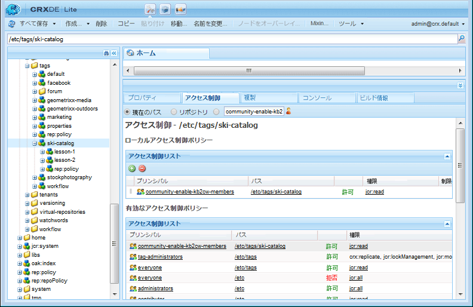
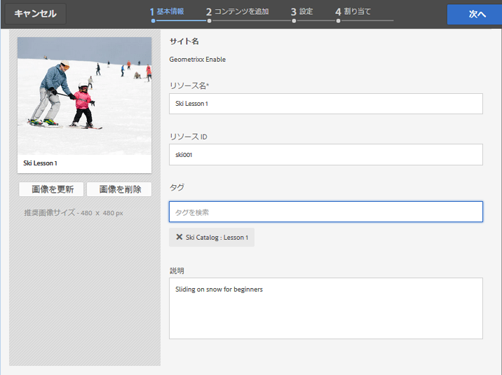
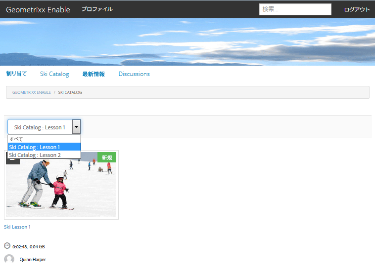

# イネーブルメントリソースのタグ付け {#tagging-enablement-resources}

## 概要 {#overview}

イネーブルメントリソースのタグ付けにより、メンバーが[カタログ](functions.md#catalog-function)を参照したときにリソースや学習パスのフィルタリングが可能になります。

基本的には、

* [タグ名前空間の作成](../../help/sites-administering/tags.md#creating-a-namespace) 各カタログ

   * [タグ権限の設定](../../help/sites-administering/tags.md#setting-tag-permissions)
   * コミュニティメンバーのみ（閉じられたコミュニティ）

      * の読み取りアクセスを許可 [コミュニティサイトのメンバーグループ](users.md#publish-group-roles)
   * サイト訪問者の場合は、サインインしているか、匿名（オープンコミュニティ）かを問わず、

      * の読み取りアクセスを許可 `Everyone` グループ
   * [タグを公開](../../help/sites-administering/tags.md#publishing-tags)

* [コミュニティサイトのタグの範囲を定義する](sites-console.md#tagging)

   * [サイトの構造に存在するカタログを設定する](functions.md#catalog-function)

      * カタログインスタンスにタグを追加して、UI フィルターに表示されるタグのリストを制御できます。
      * 追加可能 [プリフィルター](catalog-developer-essentials.md#pre-filters)、カタログに含まれるリソースを制限します。

* [コミュニティサイトを公開](sites-console.md#publishing-the-site)
* [イネーブルメントリソースへのタグの適用](resources.md#create-a-resource) したがって、それらは、分類的にフィルタリングされるかもしれない
* [イネーブルメントリソースを公開する](resources.md#publish)

## コミュニティサイトタグ {#community-site-tags}

コミュニティサイトを作成または編集するときに、[タグ付け設定](sites-console.md#tagging)で既存のタグ名前空間のサブセットを選択することで、そのサイトの機能で使用可能なタグの範囲を設定します。

タグはコミュニティサイトに対していつでも作成または追加できますが、データベースの設計と同じように、あらかじめ分類を策定しておくことを推奨します。[タグの使用](../../help/sites-authoring/tags.md)を参照してください。

既存のコミュニティサイトに後からタグを追加する場合は、サイトの構造内のカタログ機能に新しいタグを追加する前に、編集を保存する必要があります。

コミュニティサイトでは、サイトを公開してタグを公開した後、コミュニティのメンバーに対する読み取りアクセスを有効にする必要があります。[タグ権限の設定](../../help/sites-administering/tags.md#setting-tag-permissions)を参照してください。

管理者がに読み取り権限を適用すると、CRXDE では次のように表示されます。 `/etc/tags/ski-catalog` グループの `Community Enable Members`.

## カタログのタグ名前空間 {#catalog-tag-namespaces}

カタログ機能は、自身を定義するためにタグを使用します。コミュニティサイトでカタログ機能を設定する際、選択するタグ名前空間のセットは、コミュニティサイトで設定されたタグ名前空間の範囲によって定義されます。

カタログ機能には、カタログのフィルター UI に表示されるタグを定義するタグ設定が含まれています。「すべての名前空間」の設定は、コミュニティサイトで選択したタグ名前空間の範囲を指します。

## イネーブルメントリソースへのタグの適用 {#applying-tags-to-enablement-resources}

イネーブルメントリソースと学習パスは、 `Show in Catalog` がオンになっている。 リソースと学習パスにタグを追加すると、特定のカタログに事前にフィルタリングしたり、カタログ UI でフィルタリングしたりできます。

イネーブルメントリソースと学習パスを特定のカタログに制限するには、 [プリフィルター](catalog-developer-essentials.md#pre-filters).

カタログ UI を使用すると、訪問者は、そのカタログに表示されているリソースや学習パスのリストにタグフィルターを適用できるようになります。

イネーブルメントリソースにタグを適用する管理者は、より高度な分類を可能にするサブタグを選択するために、カタログに関連付けられているタグ名前空間に加えて、分類についても理解している必要があります。

例えば、 `ski-catalog` 名前空間が作成され、次の名前のカタログに設定されました： `Ski Catalog`という 2 つの子タグを持つ場合があります。 `lesson-1` および `lesson-2`.

この場合は、以下のいずれかのタグが付けられたイネーブルメントリソースが、

* ski-catalog:lesson-1
* ski-catalog:lesson-2

イネーブルメントリソースの公開後に `Ski Catalog` に表示されます。

## パブリッシュ環境でのカタログの表示 {#viewing-catalog-on-publish}

オーサー環境ですべてをセットアップして公開したら、パブリッシュ環境で、カタログを使用してイネーブルメントリソースを検索してみることができます。

タグ名前空間がドロップダウンメニューに表示されない場合は、パブリッシュ環境で権限が適切に設定されているかを確認してください。

タグ名前空間を追加しても見つからない場合は、タグとサイトが再公開されているかを確認してください。

カタログ表示時にタグを選択してもイネーブルメントリソースが表示されない場合は、カタログの名前空間のタグがイネーブルメントリソースに適用されているかを確認してください。

