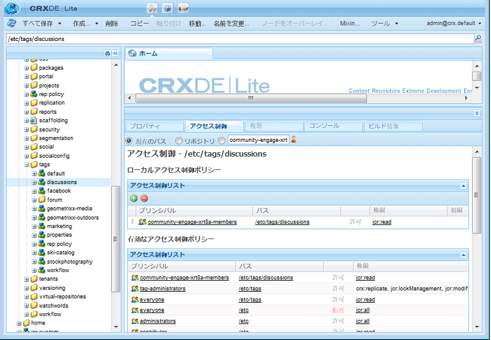

# ユーザー生成コンテンツのタグ付け {#tagging-user-generated-content}

## 概要 {#overview}

ユーザー生成コンテンツ（UGC）のタグ付けは、コミュニティメンバーが他のメンバーによるコンテンツの検索を支援するための手段です。

通常、タグは作成者と管理者によってオーサー環境で適用されます。UGCのタグ付けは、UGCタグが公開環境のコミュニティメンバーによって適用されるという点で異なります。

タグ名前空間と分類は、どちらで適用する場合も同じです。

## Communities の機能 {#communities-features}

タグ付けを許可するように設定できるAEM Communitiesの機能は次のとおりです。

* [ブログ](blog-feature.md)
* [カレンダー](calendar.md)
* [ファイルライブラリ](file-library.md)
* [フォーラム](forum.md#configuretheaddedforum)
* [Q＆A](working-with-qna.md)

## タグの管理 {#administering-tags}

See [Administering Tags](../../help/sites-administering/tags.md#tagging-console) for creating and managing tag namespaces and taxonomies.

開発者向けの情報については、[タグの重要事項](tag.md)を参照してください。

タグを使用した UGC 検索を容易にするために Social タグクラウドコンポーネントをページに追加するには、[Social タグクラウドの使用](tagcloud.md)を参照してください。

### タグ権限 {#tag-permissions}

デフォルトの権限では、パブリッシュ環境の全員がタグ名前空間を読み取れない設定になっています。

タグはパブリッシュ環境で UGC に適用されるので、適用するタグをコミュニティメンバーが選択できるようにするには、コミュニティメンバーに読み取り権限を付与にする必要があります。

[タグ権限の設定](../../help/sites-administering/tags.md#setting-tag-permissions)を参照してください。

The following is how it appears in CRXDE when an administrator applies read permissions to `/etc/tag/discussions` for the group `Community Engage Members`.

