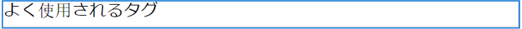
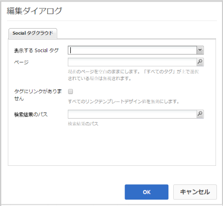
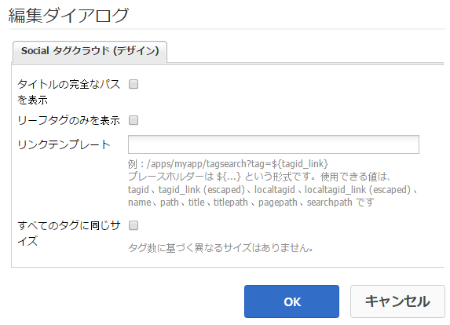

# Social タグクラウドの使用 {#using-social-tag-cloud}

## 概要 {#introduction}

The `Social Tag Cloud` component highlights tags applied by community members when posting content. これは、トレンドトピックを識別し、サイト訪問者がタグ付けされたコンテンツをすばやく見つけられるようにする手段です。

現在のトレンドを識別するもう 1 つの手段については、「[アクティビティのトレンド](trends.md)」を参照してください。

This page documents the `Social Tag Cloud` component dialog settings and describes the user experience.

開発者向けの詳細な情報は、[タグの重要事項](tag.md)を参照してください。

See [Administering Tags](../../help/sites-administering/tags.md) for information about creating and managing tags, as well as to which content tags have been applied.

## Social タグクラウドの追加 {#adding-a-social-tag-cloud}

作成者モードでページに `Social Tag Cloud` コンポーネントを追加するには、コンポーネントブラウザーを使用してタグクラウドを表示するページを探し `Communities / Social Tag Cloud` 、ドラッグして配置します。

For necessary information, visit [Communities Components Basics](basics.md).

[必要なクライアント側ライブラリが含まれる場合](tag.md#essentials-for-client-side) 、次のようにコンポー `Social Tag Cloud` ネントが表示されます。

## Social タグクラウドの設定 {#configuring-social-tag-cloud}

Select the placed `Social Tag Cloud` component to access and select the `Configure` icon which opens the edit dialog.

Under the **[!UICONTROL Social Tag Cloud]** tab, specify which tags to display and, if the tags are active links, the location of the page for search results:

* **[!UICONTROL 表示する Social タグ]**&#x200B;表示する UGC タグを指定します。プルダウン・オプションは次のとおりです。

   * `From page and child pages`
   * `All tags`

   デフォルト値は `From page and child pages`です。ここで、「page」は下の **「** Page」設定を指します。

* **[!UICONTROL ページ]**

   (Required if not `All tags)` The path to the UGC for a page. デフォルトは、空白の場合に現在のページになります。

* **[!UICONTROL タグにリンクがありません]**

   選択すると、タグはプレーンテキストとしてタグクラウドに表示されます。 選択しない場合、タグはアクティブリンクとして表示され、タグが適用されるすべてのコンテンツが検索されます。 Default is unchecked and requires the **[!UICONTROL Search Result Path]** to be set.

* **[!UICONTROL 検索結果のパス]**

   The path to a page on which a `Search Result` component has been placed, configured to reference UGC which includes the UGC path specified by the **Page** setting.

## Social タグクラウドの表示を変更する {#change-display-of-social-tag-cloud}

To edit the display of the **Social Tag Cloud**, enter [Design Mode](../../help/sites-authoring/default-components-designmode.md) and double click on the placed `Social Tag Cloud` component to open a dialog with an additional tab.

Using the **[!UICONTROL Social Tag Cloud (Design)]** tab, specify how tags are displayed. タグは、単純なタグ、デフォルトの名前空間内の単一の単語、または階層的な分類のいずれかです。

* **[!UICONTROL タイトルの完全なパスを表示]**

   オンの場合、適用した各タグの親タグと名前空間のタイトルが表示されます。

   次に例を示します。

   * チェック: `Geometrixx Media: Gadgets / Cars`
   * 未チェック: `Cars`

   シンプルなタグの場合は、表示に違いは現れません。

   初期設定はオフです。

* **[!UICONTROL リーフタグのみを表示]**

   オンにすると、他のタグを含まない、適用されたタグのみが表示されます。

   例えば、次のタグIDを指定すると、

   `Geometrixx Media: Gadgets / Cars`

   適用できるタグは3つあります。

   `Geometrixx Media (the namespace)`, `Gadgets`, および `Cars`

   * Checked: Only `Cars` will display, if applied.
   * Unchecked: `Geometrixx Media` and `Gadgets`as well as `Cars` will display, if applied.

   シンプルなタグはリーフタグです。

   初期設定はオフです。

* **[!UICONTROL リンクテンプレート]**

   コンポーネント編集ダイアログでリンクが有効になっている場合、タグクラウド内のリンクの表示に使用される、デフォルト以外のテンプレート。

* **[!UICONTROL すべてのタグに同じサイズ]**

   このオプションを選択すると、タグクラウド内のすべての単語に同じスタイルが適用されます。 選択しない場合、単語のスタイルは使用方法に応じて異なります。 初期設定はオフです。

## 追加情報 {#additional-information}

More information may be found on the [Tag Essentials](tag.md) page for developers.

See [Tagging User Generated Content](tag-ugc.md) (UGC) for information about creating and managing tags.
