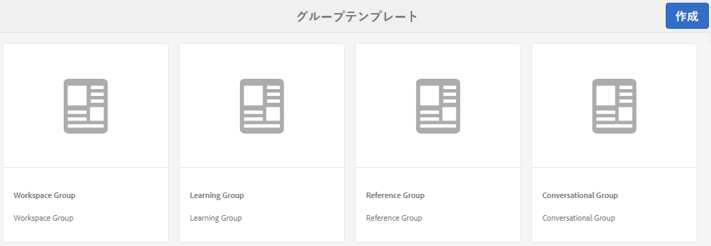
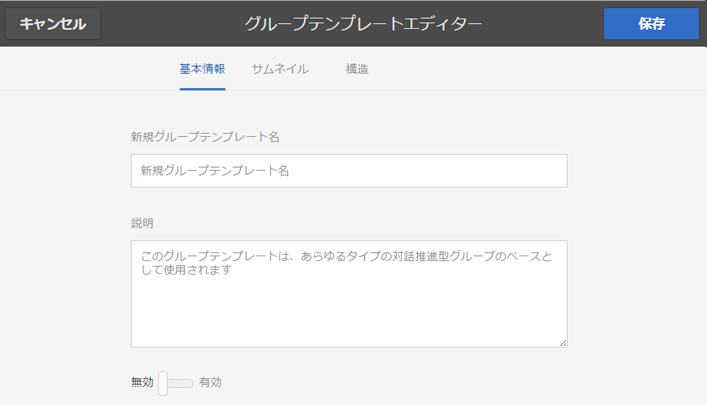
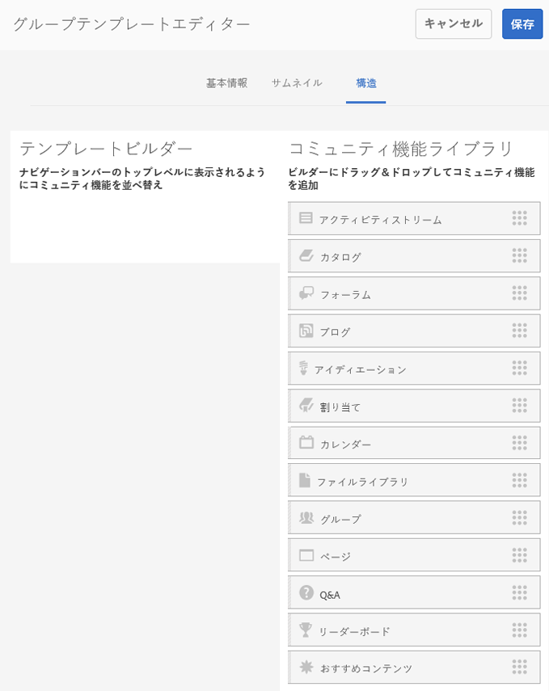
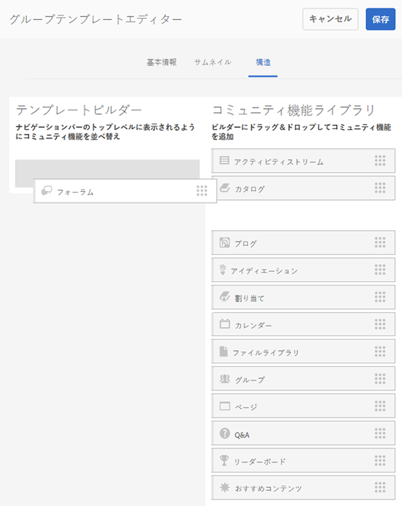

# グループテンプレート {#group-templates}

グループテンプレートコンソールは、[サイトテンプレート](/help/communities/sites.md)コンソールに似ています。 どちらも、コミュニティサイトを形成する、事前に配線されたページと機能のセットの設計図です。 異なる点は、サイトテンプレートはメインコミュニティ用、グループテンプレートはコミュニティグループ用、つまりメインコミュニティ内にネストされたサブコミュニティ用です。

[Groups関数](/help/communities/functions.md#groups-function)を含めることで、コミュニティグループをサイトテンプレートに組み込む（これはテンプレート内の最初の機能でも唯一の機能でもない）。

Communities [機能パック 1](/help/communities/deploy-communities.md#latestfeaturepack) 以降、グループテンプレート内にグループ機能を含めることにより、グループをネストできるようになりました。

新しいコミュニティグループを作成するアクションが実行されると、そのグループのテンプレート（構造）が選択されます。 選択項目は、サイトまたはグループテンプレートに追加したときにGroups機能がどのように設定されたかによって異なります。

>[!NOTE]
>
>[コミュニティサイト](/help/communities/sites-console.md)、[コミュニティサイトテンプレート](/help/communities/sites.md)、[コミュニティグループテンプレート](/help/communities/tools-groups.md)、[コミュニティ機能](/help/communities/functions.md)の作成用コンソールは、作成者環境でのみ使用できます。

## Group Templates Console {#group-templates-console}

AEM Author環境のグループテンプレートコンソールにアクセスするには：

* **ツールを選択 |コミュニティ |グローバルナビゲーションからのグループテンプレート**。

このコンソールには、[コミュニティサイト](/help/communities/sites-console.md)を作成できるテンプレートが表示され、新しいグループテンプレートを作成できます。

## Create Group Template {#create-group-template}

新しいグループテンプレートの作成を開始するには、`Create`を選択します。

するとサイトエディターパネルに移動します。パネルには以下の 3 つのサブパネルがあります。

### 基本情報 {#basic-info}

基本情報パネルでは、名前、説明およびテンプレートを有効にするか無効にするかを設定します。

* **新規グループテンプレート名**

   テンプレート名ID。

* **説明**

   テンプレートの説明。

* **無効/有効**

   テンプレートが参照可能かどうかを制御するトグルスイッチ。

#### サムネール  {#thumbnail}

（オプション）画像をアップロードアイコンを選択すると、コミュニティサイトの作成者に対して、名前と説明と共にサムネールが表示されます。

#### 構造 {#structure}

>[!CAUTION]
>
>AEM 6.1 Communities FP4 以前のバージョンを使用している場合は、グループテンプレートにグループ機能を追加しないでください。
>
>ネストされたグループの機能を使用できるのは、Communities [FP1](/help/communities/communities.md#latestfeaturepack) 以降です。
>
>テンプレート内の 1 番目の機能または唯一の機能としてグループ機能を追加することはまだできません。

コミュニティ機能を追加するには、右側から左側にドラッグします。サイトメニューのリンクは追加した順番で表示されます。スタイルは、サイトの作成時にテンプレートに適用されます。

例えば、フォーラムが必要な場合は、フォーラム機能をライブラリからテンプレートビルダーにドラッグ＆ドロップします。これにより、フォーラム設定ダイアログが開きます。 設定ダイアログの詳細については、[関数コンソール](/help/communities/functions.md)を参照してください。

このテンプレートに基づいて、サブコミュニティサイト（グループ）に必要なその他のコミュニティ機能を引き続きドラッグ&amp;ドロップします。

必要なすべての関数がテンプレートビルダー領域に配置され、設定されたら、右上隅の「**保存**」を選択します。

## グループテンプレートを編集 {#edit-group-template}

メインの[グループテンプレートコンソール](#group-templates-console)でコミュニティグループを表示しているときに、既存のサイトテンプレートを選択して編集できます。

グループテンプレートを編集しても、そのテンプレートを基に作成された既存のコミュニティサイトに影響が及ぶことはありません。その代わりに、直接[コミュニティサイトの構造を編集](/help/communities/sites-console.md#modify-structure)することができます。

このプロセスでは、[グループテンプレートの作成](#create-group-template)と同じパネルを使用します。
