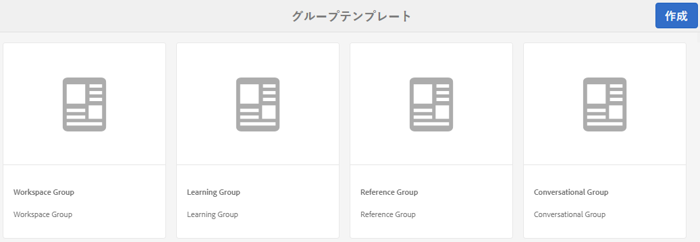
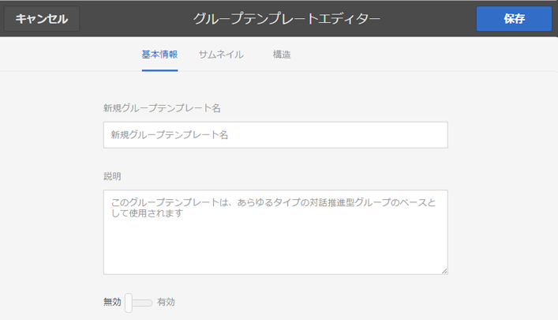
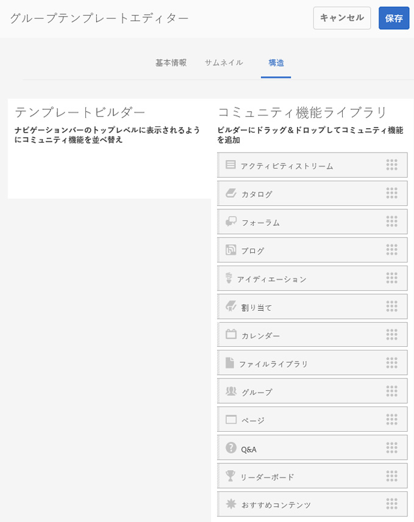
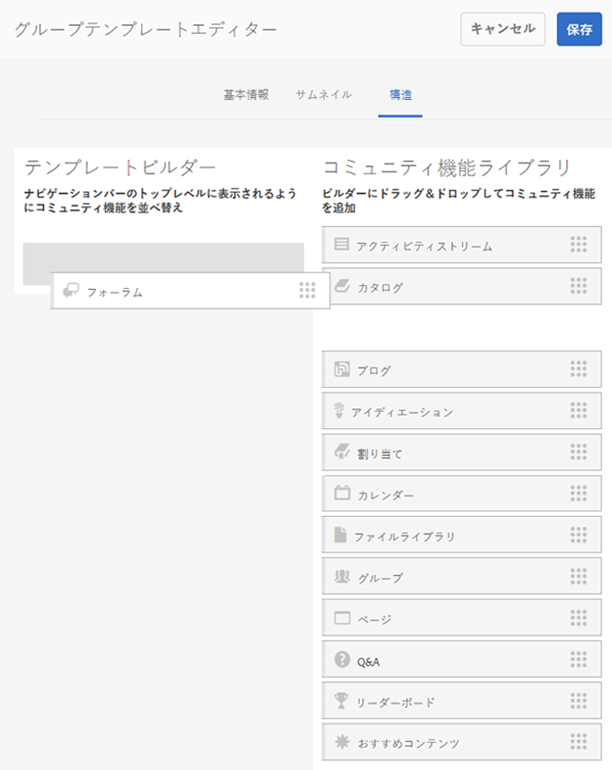

# グループテンプレート {#group-templates}

グループテンプレートコンソールは、[ サイトテンプレート ](/help/communities/sites.md) コンソールに似ています。 どちらも、コミュニティサイトを形成する、事前に有線で接続されたページと機能のセットの設計図です。 違いは、サイトテンプレートがメインコミュニティ用であり、グループテンプレートがコミュニティグループ（メインコミュニティ内にネストされたサブコミュニティ）用であることです。

コミュニティグループは、[Groups関数](/help/communities/functions.md#groups-function)を含めることで、サイトテンプレートに組み込まれます（これは、テンプレートの最初の関数でも唯一の関数でもありません）。

コミュニティ [機能パック 1](/help/communities/deploy-communities.md#latestfeaturepack)の時点では、グループ テンプレート内にグループ関数を含めることで、グループをネストできます。

コミュニティグループを作成するアクションが実行されると、グループのテンプレート（構造）が選択されます。 選択は、サイトまたはグループテンプレートに追加したときにグループ関数がどのように設定されたかによって異なります。

>[!NOTE]
>
>[ コミュニティサイト ](/help/communities/sites-console.md)、[ コミュニティサイトテンプレート ](/help/communities/sites.md)、[ コミュニティグループテンプレート ](/help/communities/tools-groups.md)、[ コミュニティ関数](/help/communities/functions.md)の作成用コンソールは、オーサー環境でのみ使用できます。

## グループテンプレートコンソール {#group-templates-console}

AEM オーサー環境でグループテンプレートコンソールにアクセスするには：

* グローバルナビゲーションから&#x200B;**ツール | コミュニティ | グループテンプレート、**&#x200B;を選択します。

このコンソールには、[ コミュニティサイト ](/help/communities/sites-console.md)を作成できるテンプレートが表示され、新しいグループテンプレートを作成できます。

## グループテンプレートを作成 {#create-group-template}

グループテンプレートの作成を開始するには、`Create`を選択します。

サイトエディターパネルが表示されます。このパネルには、次の3つのサブパネルがあります。

### 基本情報 {#basic-info}

基本情報パネルでは、名前、説明、およびテンプレートが有効か無効かを設定します。

* **新しいグループ テンプレート名**

  テンプレート名ID。

* **説明**

  テンプレートの説明。

* **無効/有効**

  テンプレートが参照可能かどうかを制御するトグルスイッチ。

#### サムネイル {#thumbnail}

（オプション）画像をアップロードアイコンを選択して、コミュニティサイトの作成者に名前と説明と共にサムネールを表示します。

#### 構造 {#structure}

>[!CAUTION]
>
>AEM 6.1 Communities FP4以前を使用している場合は、グループテンプレートにグループ関数を追加しないでください。
>
>コミュニティ [FP1](/help/communities/communities.md#latestfeaturepack)の時点で、ネストされたグループ機能を利用できます。
>
>テンプレートの最初または唯一の関数としてグループ関数を追加することはできません。

コミュニティ機能を追加するには、サイトメニューリンクが表示される順序で、右側から左側にドラッグします。 スタイルは、サイトの作成中にテンプレートに適用されます。

例えば、フォーラムが必要な場合は、ライブラリからフォーラム関数をドラッグし、テンプレートビルダーの下にドロップします。 これにより、フォーラム設定ダイアログが開きます。 設定ダイアログについて詳しくは、[関数コンソール ](/help/communities/functions.md)を参照してください。

このテンプレートに基づいて、サブコミュニティサイト（グループ）に必要なその他のコミュニティ機能をドラッグ&amp;ドロップし続けます。

必要なすべての関数がテンプレートビルダー領域にドロップされ、設定されたら、右上隅の「**保存**」を選択します。

## グループテンプレートを編集 {#edit-group-template}

メインの[ グループテンプレートコンソール ](#group-templates-console)でコミュニティグループを表示する場合、既存のグループテンプレートを編集用に選択できます。

グループテンプレートを編集しても、テンプレートから作成済みのコミュニティサイトには影響しません。 代わりに、コミュニティサイト ](/help/communities/sites-console.md#modify-structure)の構造を直接[編集できます。

このプロセスは、[ グループテンプレートの作成](#create-group-template)と同じパネルを提供します。
