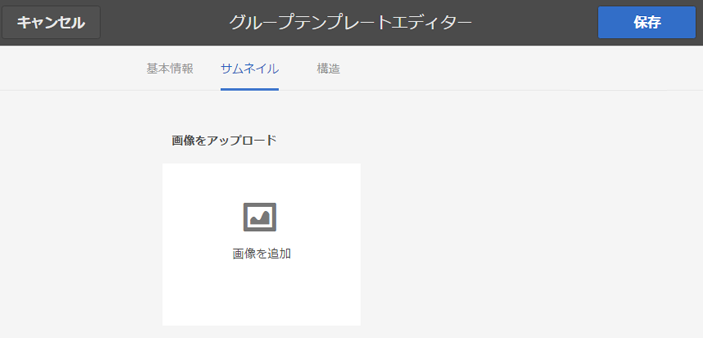

# グループテンプレート {#group-templates}

グループテンプレート コンソールは、[&#x200B; サイトテンプレート &#x200B;](/help/communities/sites.md) コンソールに似ています。 どちらも、コミュニティサイトを形成する、事前定義済みの一連のページおよび機能のブループリントです。 違いは、サイトテンプレートがメインコミュニティ用であり、グループテンプレートがコミュニティグループ（メインコミュニティ内にネストされたサブコミュニティ）用である点です。

[Groups 関数 &#x200B;](/help/communities/functions.md#groups-function) （テンプレートの最初の関数でも唯一の関数でもない場合があります）を含めることで、コミュニティグループをサイトテンプレートに組み込みます。

Communities [&#x200B; 機能パック 1](/help/communities/deploy-communities.md#latestfeaturepack) の時点では、グループテンプレート内に Groups 関数を含めることで、グループをネストできます。

コミュニティグループを作成するアクションが実行された瞬間に、グループのテンプレート（構造）が選択されます。 選択は、サイトまたはグループ テンプレートに追加したときに Groups 関数がどのように構成されたかによって異なります。

>[!NOTE]
>
>[&#x200B; コミュニティサイト &#x200B;](/help/communities/sites-console.md)、[&#x200B; コミュニティサイトテンプレート &#x200B;](/help/communities/sites.md)、[&#x200B; コミュニティグループテンプレート &#x200B;](/help/communities/tools-groups.md)、および [&#x200B; コミュニティ機能 &#x200B;](/help/communities/functions.md) の作成用のコンソールは、オーサー環境でのみ使用されます。

## グループテンプレートコンソール {#group-templates-console}

AEM オーサー環境でグループテンプレートコンソールにアクセスするには：

* **ツールを選択 | コミュニティ | グループテンプレート，** グローバルナビゲーションから。

このコンソールには、[&#x200B; コミュニティサイト &#x200B;](/help/communities/sites-console.md) を作成できるテンプレートが表示され、新しいグループテンプレートを作成できます。

## グループテンプレートを作成 {#create-group-template}

グループテンプレートの作成を開始するには、「`Create`」を選択します。

これにより、3 つのサブパネルを含むサイトエディターパネルが表示されます。

### 基本情報 {#basic-info}

基本情報パネルで、名前、説明、テンプレートが有効か無効かが設定されます。

* **新規グループテンプレート名**

  テンプレート名 ID。

* **説明**

  テンプレートの説明。

* **無効/有効**

  テンプレートを参照可能にするかどうかを制御する切り替えスイッチ。

#### サムネール {#thumbnail}

（オプション）「画像をアップロード」アイコンを選択して、コミュニティサイトの作成者に名前と説明と共にサムネールを表示します。

#### 構造 {#structure}

>[!CAUTION]
>
>AEM 6.1 Communities FP4 以前を使用している場合は、グループテンプレートに groups 関数を追加しないでください。
>
>ネストされたグループ機能は、Communities [FP1](/help/communities/communities.md#latestfeaturepack) 以降で使用できます。
>
>Groups 関数をテンプレートの最初の関数または唯一の関数として追加することは、まだ許可されていません。

コミュニティ機能を追加するには、サイト メニューのリンクが表示される順序で右から左にドラッグします。 スタイルは、サイトの作成中にテンプレートに適用されます。

例えば、フォーラムが必要な場合は、フォーラム関数をライブラリからドラッグして、テンプレートビルダーの下にドロップします。 その結果、「フォーラム設定」ダイアログが開きます。 設定ダイアログについて詳しくは、[&#x200B; 関数コンソール &#x200B;](/help/communities/functions.md) を参照してください。

このテンプレートをベースとするサブコミュニティサイト（グループ）に必要なその他のコミュニティ機能を引き続きドラッグ&amp;ドロップします。

必要な関数をすべてテンプレートビルダー領域にドロップして設定したら、右上隅の「**保存**」を選択します。

## グループテンプレートの編集 {#edit-group-template}

メインの [&#x200B; グループテンプレートコンソール &#x200B;](#group-templates-console) でコミュニティグループを表示すると、既存のグループテンプレートを選択して編集することができます。

グループテンプレートを編集しても、そのテンプレートから既に作成されたコミュニティサイトには影響しません。 代わりに、コミュニティサイトの構造を直接 [&#x200B; 編集 &#x200B;](/help/communities/sites-console.md#modify-structure) することができます。

このプロセスでは、[&#x200B; グループテンプレートの作成 &#x200B;](#create-group-template) と同じパネルが提供されます。
