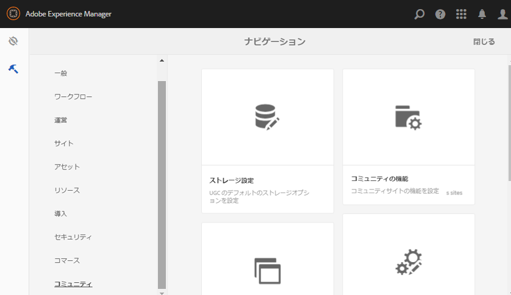

# コミュニティツール {#communities-tools}

Communitiesツールコンソールにアクセスするには、作成者インスタンスにログインします。

* From global navigation: **[!UICONTROL Tools]** > **[!UICONTROL Communities]**.

   

* [サイトテンプレート](sites.md) — コンソール。サイトテンプレートの作成と管理を行います。

* [グループテンプレート](tools-groups.md) — コンソール。グループテンプレートの作成と管理を行います。

* [コミュニティ機能](functions.md) — コンソール。コミュニティ機能の作成と管理を行います。

* [ストレージの設定](srp-config.md) — コンソールを参照して [ください](working-with-srp.md)。

* [コンポーネントガイド](components-guide.md) — インタラクティブサイトを開き、SCFコンポーネントの動作や設定方法、カスタマイズ方法を実験できるようにします。

* [バッジ](badges.md) — コンソールで、ス [コアリングルールおよびバッジルールに使用するカスタムバッジを追加できます。](implementing-scoring.md)

