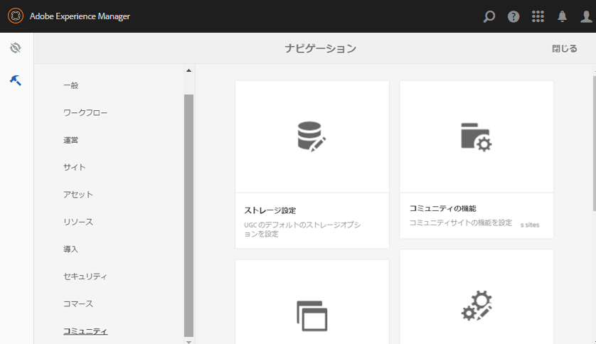

# コミュニティツール {#communities-tools}

Communities ツールコンソールにアクセスするには、オーサーインスタンスにログインします。

* グローバルナビゲーションから：**[!UICONTROL ツール]** > **[!UICONTROL コミュニティ]**。

  

* [ サイトテンプレート ](sites.md) - サイトテンプレートの作成と管理用のコンソール。

* [ グループテンプレート ](tools-groups.md) - グループテンプレートの作成と管理のためのコンソール。

* [ コミュニティ関数](functions.md) - コミュニティ関数の作成と管理のためのコンソール。

* [ ストレージ設定](srp-config.md) - [ デフォルト SRP](working-with-srp.md)の設定と選択のためのコンソール。

* [ コンポーネントガイド ](components-guide.md) - SCF コンポーネントの動作と、それらの設定方法またはカスタマイズ方法を試すことができるインタラクティブサイトを開きます。

* [ バッジ ](badges.md) - カスタムバッジを[ スコアリングおよびバッジルール ](implementing-scoring.md)で使用するために追加できるコンソール
