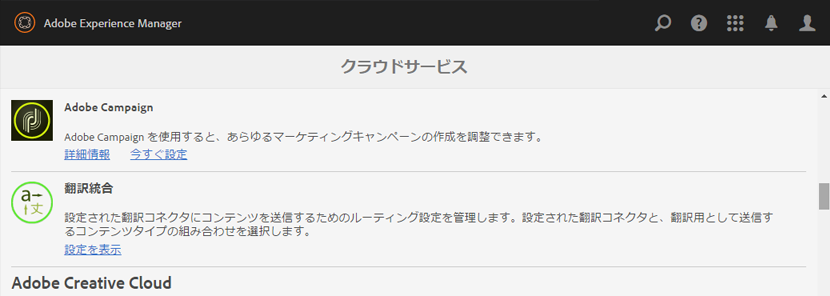
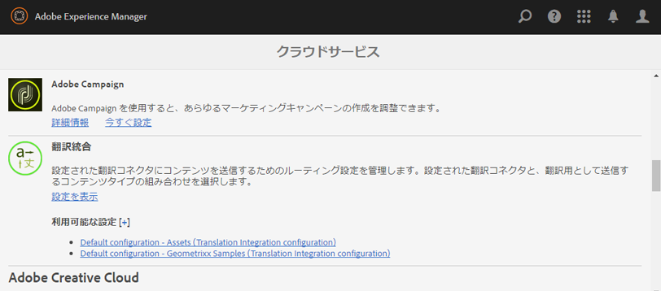
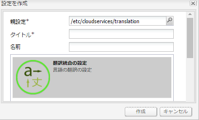
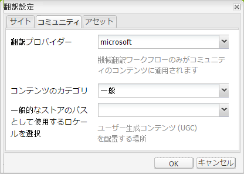
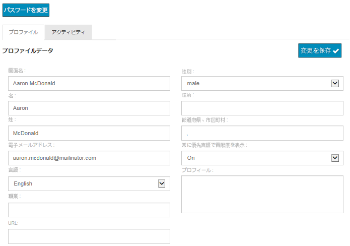

# ユーザー生成コンテンツの翻訳 {#translating-user-generated-content}

AEM Communities の翻訳機能は、[ソーシャルコンポーネントフレームワーク（SCF）](scf.md)を使用することで、[ページコンテンツの翻訳](../../help/sites-administering/translation.md)という概念を、コミュニティサイトに投稿されたユーザー生成コンテンツ（UGC）にまで拡張します。

UGC を翻訳することにより、言語の障壁が取り除かれ、サイト訪問者とメンバーがグローバルなコミュニティを体験できます。

例えば以下のような場合が考えられます。：

* フランスのメンバーは、フランス語でレシピを多国籍料理のウェブサイトのコミュニティフォーラムに投稿している。
* 日本の別の会員は、翻訳機能を使って、フランス語から日本語へレシピを翻訳する。
* 日本語でレシピを読んだ後、日本の会員は日本語でコメントを投稿します。
* フランスのメンバーは、翻訳機能を使用して日本語のコメントをフランス語に翻訳します。
* グローバルなコミュニケーション。

## 概要 {#overview}

この節では、特に翻訳サービスと UGC の連動について説明します。AEM を [翻訳サービスプロバイダー](../../help/sites-administering/translation.md#connectingtoatranslationserviceprovider)に接続する方法と、[翻訳統合フレームワーク](../../help/sites-administering/tc-tic.md)を設定して翻訳サービスを Web サイトに統合する方法については既に知っているものとして説明を進めます。

翻訳サービスプロバイダーがサイトに関連付けられているときは、そのサイトの各言語コピーで、SCF コンポーネントを通じて投稿された UGC（コメントなど）のスレッドが独自に保持されます。

翻訳サービスプロバイダーに加えて翻訳フレームワークが設定されているときは、サイトの各言語コピーが UGC の 1 つのスレッドを共有できるので、言語コピー間のグローバルな情報通信を実現できます。Instead of a discussion thread segregated by language, the configured [global shared store](#global-translation-of-ugc) enables the entire thread to be visible regardless from which language copy it is being viewed. さらに、地域別など、グローバル参加者の論理的なグループに対して異なるグローバル共有ストアを指定する場合は、複数の翻訳統合設定を設定できます。

## デフォルトの翻訳サービス {#the-default-translation-service}

AEM Communities ships with a [trial license](../../help/sites-administering/tc-msconf.md#microsoft-translator-trial-license) for a [default translation service](../../help/sites-administering/tc-msconf.md) enabled for several languages.

When [creating a community site](sites-console.md), the default translation service is enabled when `Allow Machine Translation` is checked from the [TRANSLATION](sites-console.md#translation) sub-panel.

>[!CAUTION]
>
>デフォルトの翻訳サービスは、デモ目的でのみ提供されています。
>
>実稼動システムでは、ライセンスを取得した翻訳サービスが必要です。If not licensed, the default translation service should be [turned off](../../help/sites-administering/tc-msconf.md#microsoft-translator-trial-license-geometrixx-outdoors).

## UGC のグローバル翻訳 {#global-translation-of-ugc}

Web サイトに[複数の言語コピー](../../help/sites-administering/tc-prep.md)がある場合、デフォルトの翻訳サービスでは、あるサイトで入力された UGC が別のサイトで入力された UGC と関連している可能性は認識されません。その UGC が本質的に同じコンポーネント（そのコンポーネントを含んでいるページの言語コピー）で生成された場合でも同様です。

これは、「いくつかのグループがそれぞれ別のグループの人のコメントは気にせずに会話している状況」と、「1 つの大きなグループに属する全員が同じ会話に参加している状況」の違いに似ています。

「1 つのグループでの会話」が必要な場合は、複数の言語コピーを持つ Web サイト全体のグローバル翻訳を有効にして、どの言語コピーからでもスレッド全体を見られるようにする必要があります。

例えば、基本となるサイトにフォーラムを設け、いくつかの言語コピーを作成し、グローバル翻訳を有効にした場合は、ある言語コピーで作成されたフォーラムに投稿されたトピックは、すべての言語コピーで表示されます。これは返信の場合でも同様で、どの言語コピーから返信が入力されたかは関係ありません。その結果、トピックのコピー元の言語に関係なく、トピックと返信のスレッド全体が表示されます。

>[!CAUTION]
>
>グローバル翻訳を設定する前に存在していた UGC は表示されなくなります。
>
>While the UGC is still in the [common store](working-with-srp.md), it is located under the language-specific UGC location, while new content, added after global translation was configured, is being retrieved from the global shared store location.
>
>言語別のコンテンツをグローバル共有ストアに移動または統合する移行ツールはありません。

### 翻訳統合の設定 {#translation-integration-configuration}

新しい翻訳統合を作成するには、以下の手順を実行します。この操作により、オーサーインスタンスで翻訳サービスコネクターと Web サイトが統合されます。

* 管理者としてサインイン
* From the [main menu](http://localhost:4502/)
* 「**[!UICONTROL ツール]**」を選択します
* Select **[!UICONTROL Operations]**
* Select **[!UICONTROL Cloud]**
* Select **[!UICONTROL Cloud Services]**
* Scroll down to **[!UICONTROL Translation Integration]**

   

* Select **[!UICONTROL Show Configurations]**

   

* Select `[+]` icon next to **[!UICONTROL Available Configurations]** to create a new configuration

#### 設定を作成ダイアログ {#create-configuration-dialog}

* **[!UICONTROL 親設定]**

   （必須）通常はデフォルトのままにします。 デフォルトは `/etc/cloudservices/translation` です。

* **[!UICONTROL タイトル]**

   （必須）選択した表示タイトルを入力します。 デフォルト値はありません。

* **[!UICONTROL 名前]**

   （オプション）設定の名前を入力します。 初期設定はタイトルをベースにしたノード名です。

* 「**[!UICONTROL 作成]**」を選択します。

#### 翻訳設定ダイアログ {#translation-config-dialog}

For detailed instructions visit [Creating a Translation Integration Configuration](../../help/sites-administering/tc-tic.md#creating-a-translation-integration-configuration)

* **[!UICONTROL 「サイト]** 」タブ：はデフォルトのままにできます。

* **[!UICONTROL コミュニティ]**&#x200B;タブ：
   * **[!UICONTROL 翻訳プロバイダー]**&#x200B;ドロップダウンリストから翻訳プロバイダーを選択します。初期設定は です。 
`microsoft`、体験版サービス。

   * **[!UICONTROL コンテンツのカテゴリ]**&#x200B;翻訳対象のコンテンツを説明するカテゴリを選択します。初期設定は です。 
`General.`

   * **[!UICONTROL 一般的なストアのパスとして使用するロケールを選択]**（オプション）UGC を格納するためのロケールを選択すると、すべての言語コピーからの投稿が 1 つのグローバルな会話に表示されます。By convention, choose the locale for the [base language](sites-console.md#translation) for the website. を選択 `No Common Store` すると、グローバル翻訳が無効になります。 デフォルトでは、グローバル翻訳は無効です。

* **[!UICONTROL 「アセット]** 」タブ：はデフォルトのままにできます。
* 「**[!UICONTROL OK]**」を選択します。

#### アクティベーション {#activation}

新しい翻訳統合クラウドサービスは、パブリッシュ環境に対してアクティベートする必要があります。Webサイトに関連付けられている場合、まだアクティブ化されていないと、関連付けられているページが公開されるときに、アクティベーションワークフローはこのクラウドサービス設定の公開を促します。

## 翻訳設定の管理 {#managing-translation-settings}

>[!NOTE]
>
>**設定言語**
>
>投稿が設定言語と異なるかどうかを検出するために、サイト訪問者の設定言語を確定する必要があります。
>
>設定言語とは、サイト訪問者がサインインして言語設定を指定したときに、ユーザープロファイルに登録される言語の設定です。
>
>サイト訪問者が匿名の場合、または言語設定を自分のプロファイルに登録していない場合は、ページテンプレートのベース言語が設定言語になります。

### ユーザーによる設定 {#user-preference}

#### ユーザープロファイル {#user-profile}

どのコミュニティサイトにも、メンバー用のユーザープロファイルがあります。サインインしたメンバーはこのプロファイルを編集して、自分の情報をコミュニティに公開したり、自分用の設定を保存したりできます。

こうした設定の 1 つに、コミュニティコンテンツを常に指定の言語で表示するかどうかのオプションがあります。デフォルトでは、この設定は設定されておらず、デフォルトではシステム設定になります。 ユーザーはこの設定を「オン」または「オフ」に変更して、システム設定を上書きできます。

ページが自動的にユーザーの設定言語に翻訳される場合も、元のテキストを表示したり、翻訳を改善したりするための UI を使用できます。

### コミュニティサイトの設定 {#community-site-setting}

コミュニティサイトを作成すると、翻訳オプションを有効化して設定できます。コンテンツの匿名サイトの訪問者に対しては、表示設定が有効になりますが、プロファイル設定によって上書きされます。
