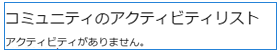
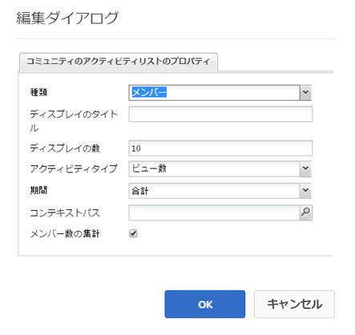
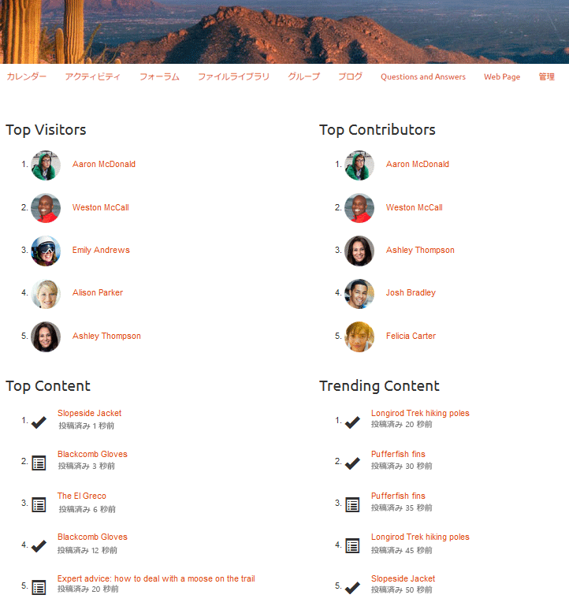

# アクティビティのトレンド {#activity-trends}

## 概要 {#introduction}

`Community Activity List`コンポーネントは、メンバー別の投稿および表示に関するトレンド情報と、コンテンツの投稿および表示を追加する機能を提供します。

このドキュメントでは、次の内容を説明します。

* `Community Activity List`コンポーネントを[コミュニティサイト](/help/communities/overview.md#community-sites)に追加します。

* `Community Activity List`コンポーネントの構成設定です。

### 要件 {#requirement}

`Community Activity List`のデータは、Adobe Analyticsがコミュニティサイトに対してライセンスを取得し、設定されている場合にのみ利用できます。

[コミュニティ機能のための Analytics の設定](/help/communities/analytics.md)を参照してください。

### コミュニティのアクティビティリストをページに追加  {#adding-a-community-activity-list-to-a-page}

作成者モードで`Community Activity List`コンポーネントをページに追加するには、コンポーネントを見つけます

* `Communities / Community Activity List`

コンポーネントを探し、ページ上の位置にドラッグします。

必要な情報については、[Communities Components Basics](/help/communities/basics.md)を参照してください。

コミュニティサイトのページに初めて配置されたとき、コンポーネントは次のように表示されます。

### コミュニティのアクティビティリストの設定  {#configuring-community-activity-list}

アクセスする配置済みの`Community Activity List`コンポーネントを選択し、編集ダイアログを開く`Configure`アイコンを選択します。

「**コメント**」タブでは、アップロードしたファイルに対するコメントを表示するかどうかと、その方法を指定します。

* **型**

   コミュニティメンバーに関するデータを表示するか、ユーザー生成コンテンツ(UGC)を表示するかを指定します。

   次から選択：

   * `Members`
   * `Content`

   デフォルトは `Members` です。

* **表示タイトル**

   データの上に表示する説明的なタイトル（`Trending Content`など）。
初期設定では、タイトルはありません。

* **表示数**

   リストする項目数。
初期設定は 10 です。

* **アクティビティタイプ**

   次のいずれかを選択します。

   * `Views`（ページ訪問数）
   * `Posts`（UGCの作成）
   * `Follows`
   * `Likes`

   初期設定は「ビュー」です。

* **期間**

   次のいずれかを選択します。

   * `Last 24 hours`
   * `Last 7 days`
   * `Last 30 days`
   * `Last 90 days`
   * `This year (since Jan 1st)`
   * `Total`

   デフォルトは `Total` です。

* **コンテキストパス**

   特定のブログなど、サイトのサブセットに対するアクティビティのスコープを設定する機能を提供します。
初期設定は、コミュニティサイト全体です。

* **メンバー数の集計**

   選択解除する（オフにする）と、最上位レベルの投稿のみがカウントされます。 例えば、コンテキストがルートページ（デフォルト）の場合、`Posts`の`Activity Type`は、ルートページにコンテンツを投稿できないので、アクティビティを表示しません。 オンにすると、すべての下位のページがカウントに含まれます。初期設定はオンです。

### 4 つのコンポーネントがあるページの例 {#example-page-with-components}

**上位の訪問者**&#x200B;の設定：タイプ = メンバー、アクティビティタイプ = ビュー

**Top** Contributorsconfig:タイプ=メンバー、アクティビティタイプ=投稿

**Top** Contentconfig:Type = Content、アクティビティタイプ=表示、

**トレンド** の内容：タイプ=コンテンツ、アクティビティタイプ=投稿

