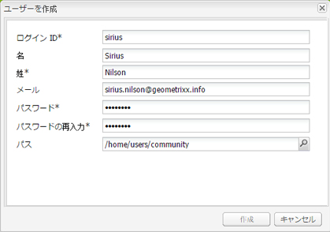
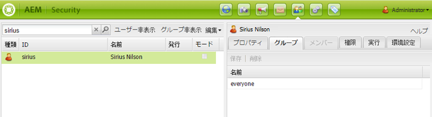
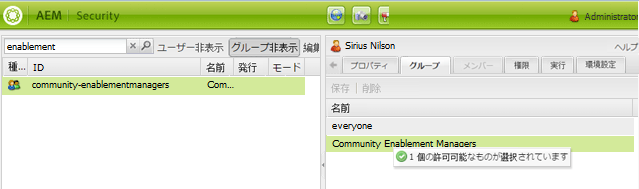

# ユーザーとユーザーグループの管理 {#managing-users-and-user-groups}

## 概要 {#overview}

AEM Communitiesでは、公開環境で、プロファイルを自己登録して編集できます。 適切な権限を与えると、次のことも可能です。

* コミュニティサイト内にサブコミュニティを作成します（[コミュニティグループ](creating-groups.md)を参照）。

* [モデレ](moderation.md) ートユーザー生成コンテンツ(UGC)。

* [有効化リソース](resources.md)の連絡先にしてください。

* ブログ、カレンダー、QnA、フォーラムのエントリを作成するには、[権限](#privileged-members-group)が必要です。

パブリッシュ環境で登録されたユーザーは、オーサー環境の&#x200B;*ユーザー*&#x200B;と区別するために、通常は&#x200B;*コミュニティメンバー（メンバー）*&#x200B;と呼ばれます。

メンバーに権限を付与するには、そのメンバーを、オーサー環境でコミュニティサイトを[作成](sites-console.md)または[変更](sites-console.md#modifying-site-properties)したときに動的に作成される[メンバー（ユーザー）グループ](#publish-group-roles)に割り当てます。作成者環境から作業している場合、メンバーは[トンネルサービス](#tunnel-service)を使用して発行環境から表示されます。

設計上、発行環境で作成されたメンバーとメンバーグループは、作成者環境に表示されません。 作成者環境で作成されたユーザーとユーザーグループは、同様に、作成者環境に残ります。

オーサー環境のユーザーとパブリッシュ環境のメンバーが同じユーザーのリストを基にしている場合も（同じ LDAP ディレクトリから同期される場合など）、それらのユーザーは、オーサー環境とパブリッシュ環境の両方で同じ権限とグループメンバーシップを持つ同一のユーザーとは見なされません。必要に応じて、メンバーとユーザーの役割は、発行時と作成者時に別々に確立する必要があります。

[発行ファーム](topologies.md)の場合、ある発行インスタンスに対する登録と変更は、他の発行インスタンスと同期して、同じユーザーデータにアクセスできるようにする必要があります。 詳しくは、[ユーザー同期](sync.md)を参照してください。[次の場合に起こることを説明する節が含まれています。](sync.md#what-happens-when)。

### 貢献度の制限 {#contribution-limits}

スパムから保護するために、メンバーによるコンテンツの投稿頻度を制限できます。また、新規会員の寄付を自動的に制限することも可能である。

詳しくは、[メンバーの貢献度の制限](limits.md)を参照してください。

### 動的に作成されるユーザーグループ  {#dynamically-created-user-groups}

コミュニティサイトを作成すると、オーサー環境（[オーサーグループの役割](#author-group-roles)を参照）かパブリッシュ環境（[パブリッシュグループの役割](#publish-group-roles)を参照）のどちらかで、コミュニティサイトを管理するために必要な各種管理機能の適切な権限と一意の ID（uid）を持った新しいユーザーグループが動的に作成されます。

グループの名前は、[コミュニティサイトを作成](sites-console.md#step13asitetemplate)するときに指定した名前から生成されます。一意のIDを使用すると、同じサーバ上の同じ名前のコミュニティサイトとコミュニティグループの名前の競合を回避できます。

例えば、「We.Retail Engage」というタイトルのサイトに「*engage*」というサイト名を付けた場合、作成されるユーザーグループのうち 1 つは次のようになります。

* コミュニティ&#x200B;*メンバーの関与*

## オーサー環境 {#author-environment}

### トンネルサービス {#tunnel-service}

作成者環境を使用してサイト](sites-console.md)を作成、[サイトのプロパティを変更](sites-console.md#modifying-site-properties)、[コミュニティメンバーとメンバーグループを管理](members.md)する場合は、公開環境に登録されたユーザーとユーザーグループにアクセスする必要があります。[

トンネルサービスは、作成者の複製エージェントを使用してこのアクセスを提供します。

* 詳しくは、デプロイメントページの[設定手順](deploy-communities.md#tunnel-service-on-author)を参照してください。

[Communitiesのメンバーとグループコンソール](members.md)は、公開環境にのみ登録されたユーザー（メンバー）とユーザーグループ（メンバーグループ）を管理する唯一の目的です。

オーサー環境で登録されたユーザーとユーザーグループを管理するには、[セキュリティコンソール](../../help/sites-administering/security.md)を使用します。

### Author Group Roles {#author-group-roles}

| メンバーが所属するグループ | 主な役割 |
|---|---|
| 管理者 | 管理者グループは、コミュニティ管理者のすべての権限を持つシステム管理者と、コミュニティ管理者グループを管理する権限で構成されます。 |
| コミュニティ管理者 | コミュニティ管理者グループは、自動的にすべてのコミュニティサイトと、そのサイトで作成されたすべてのコミュニティグループのメンバーになります。コミュニティ管理者グループの初期メンバーは、管理者グループです。オーサー環境で、コミュニティ管理者はコミュニティサイトの作成、サイトの管理、メンバーの管理（メンバーのコミュニティの使用を禁止することが可能）およびコンテンツのモデレートを実行できます。 |
| コミュニティ&lt;*サイト名*> Sitecontentmanager | コミュニティサイトコンテンツマネージャーは、従来の AEM オーサリング、コンテンツ作成およびコミュニティサイトのページの変更を実行できます。 |
| コミュニティイネーブルメントマネージャー | コミュニティイネーブルメントマネージャーグループは、コミュニティサイトのイネーブルメントマネージャーグループの管理者の割り当てに使用できるユーザーで構成されます。 |
| コミュニティ&lt;*サイト名* > Siteenablementmanagers | コミュニティサイト有効化マネージャーグループは、コミュニティサイトの有効化[リソース](resources.md)の管理に割り当てられたユーザーで構成されます。 |
| なし | 匿名のサイト訪問者はオーサー環境にアクセスできません。 |

### システム管理者  {#system-administrators}

管理者グループのメンバーは、オーサー環境とパブリッシュ環境の両方で AEM のインストールの初期設定を実行できるシステム管理者です。

デモおよび開発の目的で、管理者グループには、ユーザーIDが&#x200B;*admin*、パスワードが&#x200B;*admin*&#x200B;のメンバーが存在します。

実稼動環境では、デフォルトの管理者グループを修正する必要があります。

[セキュリティチェックリスト](../../help/sites-administering/security-checklist.md)に従っているかを確認してください。

## パブリッシュ環境 {#publish-environment}

### メンバーになる {#becoming-a-member}

公開環境では、コミュニティサイトの[設定](sites-console.md#user-management)に応じて、サイト訪問者がコミュニティのメンバーになる場合があります。

* コミュニティサイトがプライベート（非公開）の場合：
   * 招待で
   * 管理者の操作による

* コミュニティサイトが公開（開いている）場合：
   * 自己登録
   * FacebookおよびTwitterにソーシャルログインする

>[!NOTE]
>
>サイト訪問者が 1 つのオープンコミュニティサイトに登録すると、その訪問者は自動的に、同じパブリッシュ環境上の他のオープンコミュニティサイトのメンバーになります。

### パブリッシュグループの役割  {#publish-group-roles}

| メンバーが所属するグループ | 主な役割 |
|---|---|
| コミュニティ&lt;*サイト名*>のメンバー | コミュニティサイトメンバーは、登録済みのユーザーです。ログイン、プロファイルの変更、オープンコミュニティグループへの参加、コミュニティへのコンテンツの投稿、他のメンバーへのメッセージの送信、サイトのアクティビティに従うことができます。 |
| コミュニティ&lt;*サイト名*>モデレーター | コミュニティサイトモデレーターは、モデレートコンソールを使用した UGC の一括モデレートや、コンテンツが投稿されたページでのコンテキスト内モデレートを実行できる、信頼されているコミュニティメンバーです。 |
| コミュニティ&lt;*サイト名*> &lt;*グループ名*>メンバー | コミュニティグループメンバーは、オープンコミュニティグループに参加したコミュニティメンバーか、クローズドコミュニティグループに招待されたコミュニティメンバーのどちらかです。このメンバーは、サイト内のそのコミュニティグループのメンバーの能力を持ちます。 |
| コミュニティ&lt;*サイト名*>グループ管理者 | コミュニティサイトグループ管理者は、コミュニティサイト内のサブコミュニティ（グループ）を作成および管理する権限を持った、信頼されているコミュニティメンバーです。コンテキスト内モデレートを提供する機能が含まれます。 |
| 権限を持つメンバーのセキュリティグループ&#x200B;** | コンテンツ作成を制限するために、手動で作成および保守されるユーザーグループです。[権限を持つメンバーグループ](#privileged-members-group)を参照してください。 |
| なし | サイトを発見した匿名のサイト訪問者は、匿名アクセスが許可されているコミュニティサイトを表示および検索できます。コンテンツに参加して投稿するには、ユーザーが自己登録（許可されている場合）を行い、コミュニティのメンバーになる必要があります。 |

### パブリッシュグループの役割へのメンバーの割り当て {#assigning-members-to-publish-group-roles}

作成者環境でコミュニティサイト](sites-console.md)を作成する場合、または[サイトのプロパティを変更する場合、](sites-console.md#modifying-site-properties)メンバーには、発行環境で実行される様々な役割（モデレーター、グループ管理者、リソース連絡先、特権メンバーなど）が割り当てられます。[

[トンネル](sync.md#accessingpublishusersfromauthor) サービスを有効にすると、割り当ての選択肢が、作成者のユーザーではなく、発行時にメンバーから表示されます。

選択したメンバーは自動的に[適切なグループ](#publish-group-roles)に割り当てられ、コミュニティサイトが（再）公開されると、そのメンバーシップが含まれます。

### Privileged Members Group {#privileged-members-group}

権限を持つメンバーのセキュリティグループの目的は、特定のコミュニティ機能のコンテンツの作成を、権限を持つコミュニティサイトの一部のメンバーだけに限定することです。

権限を持つメンバーグループは、[コミュニティグループコンソール](members.md)を使用して作成および管理します。

権限を持つメンバーグループを作成し、さらに[トンネルサービスを有効](sync.md#accessingpublishusersfromauthor)にしたら、既存のコミュニティサイトの構造を[変更](sites-console.md#modify-structure)してコミュニティ機能の設定を編集し、「権限を持つメンバーを許可」をオンにし、作成済みのグループを追加できます。

以下のコミュニティ機能では、権限を持つメンバーグループを 1 つ以上指定できます。

* [ブログ機能](functions.md#blog-function)  — 新しい記事の作成を制限します。
* [カレンダー機能](functions.md#calendar-function)  — 新しいイベントの作成を制限します。
* [フォーラム機能](functions.md#forum-function)  — 新しいトピックの作成を制限します。
* [QnA関数](functions.md#qna-function)  — 新しい質問の作成を制限します。

コミュニティ機能にセキュリティ制限がない（権限を持つメンバーグループが割り当てられていない）場合は、すべてのコミュニティサイトメンバーが、その機能のコンテンツ（記事、イベント、トピック、質問）を作成できます。

>[!NOTE]
>
>あるコミュニティサイトで、権限を持つメンバーグループにユーザーを追加しても、そのユーザーが同じコミュニティサイトのメンバーでもある場合は、そのユーザーに対して作成権限が与えられるだけです。

## コミュニティメンバーの作成  {#creating-community-members}

### リポジトリの場所 {#repository-location}

特定の機能を正しく動作させるためには、適切な権限を持つユーザーとユーザーグループを作成する必要があります。

`/home/users/community`にメンバを作成すると、メンバのプロファイルに読み取り権限を与える適切なACLを継承します。

同様に、カスタムコミュニティユーザーグループ（特権メンバーグループなど）は、`/home/groups/community`に作成する必要があります。

[コミュニティメンバーコンソールとグループコンソール](members.md)を使用すると、ユーザーとグループがそれぞれのパスに作成されます。

カスタムパスを指定するには、[https://&lt;server>:&lt;port>/useradmin](http://localhost:4503/useradmin)でアクセス可能な、従来のセキュリティUIを使用する必要があります。

カスタムメンバーパスの読み取り権限を与えるには、すべての発行インスタンスで、`/home/users/community`と同様のACLを設定します。

```xml
<allow
  jcr:primaryType="rep:GrantACE"
  rep:principalName="everyone"
  rep:privileges="{Name}[jcr:read]" >
  <rep:restrictions
    jcr:primaryType="rep:Restrictions"
    rep:glob="*/profile*" />
</allow>
```

すべての発行インスタンスで、カスタムメンバーグループのパス（/home/groups/mycompanyなど）に適切な権限を与えるには、`/home/groups/community`と類似したACLを設定します。

```xml
<allow
  jcr:primaryType="rep:GrantACE"
  rep:principalName="community-administrators"
  rep:privileges="{Name}[jcr:read]"  />
```

### コンソール {#consoles}

オーサー環境でのみ使用できる、以下の 4 つの独立したコンソールがあります。

| console | ツール／セキュリティ／ユーザー | ツール／セキュリティ／グループ | コミュニティ／メンバー | コミュニティ／グループ |
|----------|-----------------------|------------------------|------------------------------------------------------------|------------------------------------------------------------|
| 管理対象 | オーサー環境のユーザー | オーサー環境のユーザーグループ | パブリッシュ環境のメンバー | パブリッシュ環境のメンバーグループ |
| 必須 | 管理者権限 | 管理者権限 | 管理者権限、トンネルサービス、ユーザーの同期（パブリッシュファームの場合） | 管理者権限、トンネルサービス、ユーザーの同期（パブリッシュファームの場合） |

### コミュニティイネーブルメントマネージャーの役割 {#community-enablement-manager-role}

[イネーブルメントコミュニティ](overview.md#enablement-community)では、メンバーごとに関連するコストが発生することから、通常は、サイト訪問者による自己登録機能は許可されません。有効化学者とリソースは、作成者のサイト作成](sites-console.md#enablement)中に`enablement manager` [の[役割](#author-group-roles)を割り当てられたユーザーによって管理されます（グループ`Community <site-name> Siteenablementmanagers`のメンバーとして追加されます）。 `enablement manager`は、[学習リソース](resources.md)を作成者のコミュニティメンバーに割り当てる役割も果たします。

特定のコミュニティサイトの`enablement manager`として選択できるのは、グローバル`Community Enablement Managers`グループのメンバーであるユーザーだけです。

`Community Site Enablement Manager`のロールを割り当てられる可能性のあるユーザーを作成するには、従来のUIセキュリティコンソールを使用してパスを指定します。

オーサーインスタンスの場合：

1. 管理者権限でログインし、従来のUIセキュリティコンソールを参照します。

   例：[http://localhost:4502/useradmin](http://localhost:4502/useradmin)

2. 「Edit」メニューから、「**[!UICONTROL Create User]**」を選択します。
3. `Create User`ダイアログに入力します。
   * パスは`/home/users/community`でなければなりません。
4. 「**[!UICONTROL 作成]**」を選択します。

   

* 左側のペインで、新しく作成されたユーザーを検索し、右側のペインに表示するように選択します。

   

左側のウィンドウで、

1. 検索ボックスをオフにし、「**[!UICONTROL ユーザーを非表示]**」を選択します。
2. `community-enablementmanagers`を見つけて、右側のウィンドウに表示される新しいユーザーの&#x200B;**[!UICONTROL グループ]**&#x200B;タブにドラッグします。

   

### コミュニティ管理者の役割 {#community-administrators-role}

[オーサーグループの役割](#author-group-roles)の表に示したとおり、コミュニティ管理者グループのメンバーは、コミュニティサイトの作成、サイトの管理、メンバーの管理（メンバーのコミュニティの使用を禁止できる）、コンテンツのモデレートをおこなうことができます。

[イネーブルメントマネージャ](#communitysiteenablementmanagerrole)の役割にユーザーを作成して割り当てるのと同じ手順に従いますが、ユーザーの「グループ」タブにc `ommunity-administrators`グループを追加します。

### LDAP の統合 {#ldap-integration}

AEM は、ユーザーの認証およびユーザーアカウントの作成で LDAP の使用をサポートします。これについて詳しくは、[AEM 6](../../help/sites-administering/ldap-config.md)でのLDAPの設定を参照してください。

コミュニティメンバーおよびメンバーグループ固有の設定の詳細の一部を次に示します。

1. AEM発行インスタンスごとにLDAPを設定します。
2. [LDAP IDプロバイダー](../../help/sites-administering/ldap-config.md#configuring-the-ldap-identity-provider)

   * 特別な指示なし

3. [同期ハンドラー](../../help/sites-administering/ldap-config.md#configuring-the-synchronization-handler)

   * 次のプロパティを設定します。

      * **[!UICONTROL User auto membership]**: `community-<site name>-<uid>-members`
      * **[!UICONTROL User Path Prefix]**: `/community`
      * **[!UICONTROL Group Path Prefix]**:  `/community`

4. [外部ログインモジュール](../../help/sites-administering/ldap-config.md#the-external-login-module)

   * 特別な指示はありません。

この結果、ユーザはコミュニティサイトのメンバーグループに自動的に割り当てられ、リポジトリの場所は`/home/users/community`と`/home/groups/community`になり、互いのプロファイルを見るための適切な権限を継承します。

* `User auto membership`値は、プロファイルの`givenName`（表示名）ではなく、`rep:authorizableId`プロパティにする必要があります。

## AEM インスタンス間のユーザーの同期 {#synchronizing-users-among-aem-instances}

[パブリッシュファーム](topologies.md)を使用する場合は、まず 1 つのインスタンスにユーザーを読み込みます。続いて[ユーザーの同期を有効](sync.md)にし、ユーザーを Sling で他のパブリッシュインスタンスに配信することによって、各パブリッシュインスタンスで各ユーザーのパスが同じになるようにします。

ユーザーグループを読み込む場合、各パブリッシュインスタンスでユーザーグループのパスが同じになるようにするには、1 つのインスタンスに読み込んでから、エクスポート用の[パッケージを作成](../../help/sites-administering/package-manager.md#creating-a-new-package)し、そのパッケージを他のすべてのパブリッシュインスタンスにインストールします。

現在は、ユーザーの同期を実行すると、ユーザーグループの&#x200B;*メンバーシップ*&#x200B;だけが同期されます。ユーザーの同期によるユーザーグループの同期は、今後のリリースで搭載されます。

## コミュニティグループについて {#about-community-groups}

グループに関しては、以下の 2 種類のトピックがあります。

* **[コミュニティグループ](overview.md#communitygroups)**

   コミュニティグループは、コミュニティグループの作成をサポートするコミュニティサイト用に発行環境で作成できるサブコミュニティです。 コミュニティグループを作成すると、Webサイトに追加されるページ数が増え、親コミュニティサイトと同様の方法で管理されます。 詳しくは、開発者向けの[コミュニティグループエッセンシャル](essentials-groups.md)および作成者向けの[コミュニティグループ](creating-groups.md)を参照してください。

* **[メンバーグループ](../../help/sites-administering/security.md)**

   メンバーグループは、メンバーが属することのできるグループで、グループコンソールを通じて管理されます。 このページに関するディスカッションの多くは、メンバーグループに費やされています。 コミュニティサイト用に自動的に作成されるメンバーグループは、*`Community`*&#x200B;のプレフィックスが付いている場合、コミュニティグループと呼ばれることがあるので、ディスカッションのコンテキストを考慮する必要があります。
