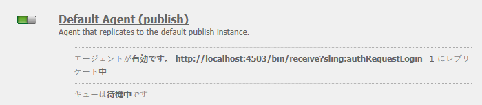

# Communities のデプロイ{#deploying-communities}

## 前提条件 {#prerequisites}

* [AEM 6.5 プラットフォーム](/help/sites-deploying/deploy.md)

* AEM Communities のライセンス

* オプションのライセンス：

   * [Adobe Analytics for Communities の機能](/help/communities/analytics.md)
   * [MongoDB for MSRP](/help/communities/msrp.md)
   * [Adobe Cloud for ASRP](/help/communities/asrp.md)

## インストールチェックリスト {#installation-checklist}

**[AEM](/help/sites-deploying/deploy.md#what-is-aem)**&#x200B;プラットフォームの場合：

* 最新の[AEM 6.5アップデート](#aem64updates)をインストールします。

* デフォルトのポート(4502、4503)を使用しない場合は、[レプリケーションエージェント](#replication-agents-on-author)を設定します。
* [暗号鍵のレプリケート](#replicate-the-crypto-key)
* グローバル化をサポートする場合、[自動翻訳](/help/sites-administering/translation.md)を設定します。
（開発用のサンプル設定が用意されています）。

**コミュニティ [機能の場合](/help/communities/overview.md)**:

* [パブリッシュファーム](/help/sites-deploying/recommended-deploys.md#tarmk-farm)をデプロイする場合、[プライマリパブリッシャー](#primary-publisher)を識別します。

* [トンネルサービスを有効にする](#tunnel-service-on-author)
* [ソーシャルログインの有効化](/help/communities/social-login.md#adobe-granite-oauth-authentication-handler)
* [Adobe Analytics の設定](/help/communities/analytics.md)
* [デフォルトの電子メールサービス](/help/communities/email.md)を設定する
* [共有UGCストレージ](/help/communities/working-with-srp.md)(**SRP**)の選択を指定します。

   * MongoDB SRP [(MSRP)](/help/communities/msrp.md)の場合

      * [MongoDBのインストールと設定](/help/communities/msrp.md#mongodb-configuration)
      * [Solrの設定](/help/communities/solr.md)
      * [MSRP の選択](/help/communities/srp-config.md)
   * リレーショナルデータベースSRP [(DSRP)](/help/communities/dsrp.md)の場合

      * [MySQL用JDBCドライバーのインストール](#jdbc-driver-for-mysql)
      * [DSRP用MySQLのインストールと設定](/help/communities/dsrp-mysql.md)
      * [Solrの設定](/help/communities/solr.md)
      * [DSRP の選択](/help/communities/srp-config.md)
   * AdobeSRP [(ASRP)](/help/communities/asrp.md)の場合

      * プロビジョニングについては、アカウント担当者にお問い合わせください。
      * [ASRP の選択](/help/communities/srp-config.md)
   * JCR SRP [(JSRP)](/help/communities/jsrp.md)の場合

      * 共有UGCストアではありません。

         * UGC のレプリケーションなし.
         * UGCは、UGCが入力されたAEMインスタンスまたはクラスター上でのみ表示されます。
      * デフォルトはJSRPです。

   イネーブルメント機能&#x200B;**[用](/help/communities/overview.md#enablement-community)**

   * [FFmpegのインストールと設定](/help/communities/ffmpeg.md)
   * [MySQL用JDBCドライバーのインストール](#jdbc-driver-for-mysql)
   * [AEM Communities SCORM-Engineのインストール](#scorm-package)
   * [イネーブルメント用のMySQLのインストールと設定](/help/communities/mysql.md)


## 最新リリース {#latest-releases}

AEM 6.5 Communities GAにはCommunitiesパッケージが含まれています。 AEM 6.5 [Communities](/help/release-notes/release-notes.md#experiencemanagercommunities) のアップデートについて詳しくは、[AEM 6.5 リリースノート](/help/release-notes/release-notes.md#communities-release-notes.html)を参照してください。

### AEM 6.5 のアップデート {#aem-updates}

AEM 6.4 以降、Communities のアップデートは、AEM 累積修正パックおよびサービスパックの一部として提供されています。

AEM 6.5の最新の更新については、 [Adobe Experience Manager 6.4累積修正パックおよびサービスパック](https://experienceleague.adobe.com/docs/experience-manager-release-information/aem-release-updates/aem-releases-updates.html?lang=ja)を参照してください。

### バージョン履歴 {#version-history}

AEM 6.4 以降、AEM Communities 機能およびホットフィックスは、AEM Communities 累積修正パックおよびサービスパックの一部として提供されます。したがって、独立した機能パックは提供されません。

### MySQL 用 JDBC ドライバー {#jdbc-driver-for-mysql}

以下の 2 つの Communities 機能で MySQL データベースを使用しています。

* [イネーブルメント](/help/communities/enablement.md)の場合：SCORMアクティビティと学習者の記録
* [DSRP](/help/communities/dsrp.md)の場合：ユーザー生成コンテンツ(UGC)の保存

MySQL コネクタを別途入手し、インストールする必要があります。

必要な手順は次のとおりです。

1. [https://dev.mysql.com/downloads/connector/j/](https://dev.mysql.com/downloads/connector/j/)からZIPアーカイブをダウンロードします。

   * バージョンは5.1.38以降である必要があります

1. 抽出 `mysql-connector-java-&lt;version&gt;-bin.jar (bundle) from the archive`
1. Webコンソールを使用してバンドルをインストールし、起動します。

   * 例： https://localhost:4502/system/console/bundles
   *  **`Install/Update`**
   * ダウンロードした ZIP アーカイブから抽出したバンドルを参照し、選択します。
   * *MySQLcom.mysql.jdbc*&#x200B;用のOracleCorporationのJDBCドライバがアクティブであることを確認し、アクティブでない場合は起動します（またはログを確認します）。

1. JDBCの設定後に既存のデプロイメントにインストールする場合は、WebコンソールからJDBC設定を再保存して、JDBCを新しいコネクタに再バインドします。

   * 例： https://localhost:4502/system/console/configMgr
   * `Day Commons JDBC Connections Pool`設定を探し、「 」を選択して設定を開きます。
   *  `Save`.

1. すべてのオーサーインスタンスとパブリッシュインスタンスで、手順3と4を繰り返します。

バンドルのインストールに関する詳細は、[Webコンソール](/help/sites-deploying/web-console.md#bundles)ページを参照してください。

#### 例：インストール済みの MySQL コネクタバンドル {#example-installed-mysql-connector-bundle}


### SCORM パッケージ {#scorm-package}

Shareable Content Object Reference Model（SCORM）は、e ラーニングの標準規格と仕様をまとめた参照モデルです。SCORM では、コンテンツを転送可能な ZIP ファイルにパッケージ化する方法も定義されています。

AEM Communities SCORM エンジンは[イネーブルメント](/help/communities/overview.md#enablement-community)機能で必要になります。AEM 6.5 CommunitiesでサポートされるSCORMパッケージ：

* [cq-social-scorm-package、バージョン2.3.7(](https://www.adobeaemcloud.com/content/marketplace/marketplaceProxy.html?packagePath=/content/companies/public/adobe/packages/cq650/social/scorm/cq-social-scorm-pkg) SCORM 2017.1 [](https://rusticisoftware.com/blog/scorm-engine-2017-released/) エンジンを含む)。

**SCORMパッケージをインストールするには**

1. パッケージ共有から[cq-social-scorm-package, version 2.3.7](https://www.adobeaemcloud.com/content/marketplace/marketplaceProxy.html?packagePath=/content/companies/public/adobe/packages/cq650/social/scorm/cq-social-scorm-pkg)をインストールします。
1. cqインスタンスから`/libs/social/config/scorm/database_scormengine_data.sql`をダウンロードし、mysqlサーバーで実行して、アップグレードされたscormEngineDBスキーマを作成します。
1. パブリッシャーの`https://<hostname>:<port>/system/console/configMgr`からCSRFフィルターのExcluded Pathsプロパティに`/content/communities/scorm/RecordResults`を追加します。

#### SCORM ロギング {#scorm-logging}

インストールすると、すべてのイネーブルメントアクティビティがシステムコンソールに詳細にロギングされます。

必要に応じて、`RusticiSoftware.*`パッケージのログレベルをWARNに設定できます。

ログの操作については、[監査レコードとログファイルの操作](/help/sites-deploying/monitoring-and-maintaining.md#working-with-audit-records-and-log-files)を参照してください。

### AEM の高度な MLS {#aem-advanced-mls}

SRP コレクション（MSRP または DSRP）で高度な多言語検索（MLS）をサポートするには、カスタムスキーマと Solr 設定に加えて、新しい Solr プラグインが必要です。必要な項目はすべて、ダウンロード可能なzipファイルにパッケージ化されます。

高度な MLS のダウンロード（「phasetwo」ともいう）は、アドビのリポジトリから入手できます。

* [AEM-SOLR-MLS-phasetwo](https://repo.adobe.com/nexus/content/repositories/releases/com/adobe/tat/AEM-SOLR-MLS-phasetwo/1.2.40/)

   * バージョン1.2.40（2016年4月7日）
   * AEM-SOLR-MLS-phasetwo-1.2.40.zipをダウンロードします。

詳細とインストール情報については、SRPのSolr設定](/help/communities/solr.md)を参照してください。[

### パッケージ共有へのリンクについて {#about-links-to-package-share}

**Adobe AEM クラウドでのパッケージの表示**

このページのパッケージへのリンクは、`adobeaemcloud.com`上で共有をパッケージ化するので、AEMの実行インスタンスを必要としません。 パッケージは表示可能ですが、「`Install`」ボタンは、Adobeがホストするサイトにパッケージをインストールするためのものです。 ローカルのAEMインスタンスにインストールする場合は、`Install`を選択するとエラーが発生します。

**ローカルの AEM インスタンスにインストールする方法**

`adobeaemcloud.com`に表示されるパッケージをローカルのAEMインスタンスにインストールするには、まずパッケージをローカルディスクにダウンロードする必要があります。

* 「**アセット**」タブを選択します。
* **ディスク**&#x200B;にダウンロードを選択します

ローカルのAEMインスタンスで、パッケージマネージャー(例：[https://localhost:4502/crx/packmgr/](https://localhost:4502/crx/packmgr/))を使用して、ローカルのAEMパッケージリポジトリにアップロードします。

または、ローカルのAEMインスタンスからパッケージ共有を使用してパッケージにアクセスする(例えば、[https://localhost:4502/crx/packageshare/](https://localhost:4502/crx/packageshare/))と、`Download`ボタンは、ローカルのAEMインスタンスのパッケージリポジトリにダウンロードされます。

ローカルのAEMインスタンスのパッケージリポジトリに移動したら、パッケージマネージャーを使用してパッケージをインストールします。

詳しくは、[パッケージの使い方](/help/sites-administering/package-manager.md#package-share)を参照してください。

## 推奨されるデプロイメント {#recommended-deployments}

AEM Communitiesでは、共通ストアはユーザー生成コンテンツ(UGC)の格納に使用され、多くの場合、[ストレージリソースプロバイダー(SRP)](/help/communities/working-with-srp.md)と呼ばれます。 推奨されるデプロイメントは、共通ストア用のSRPオプションの選択に重点を置いています。

この共通ストアは、パブリッシュ環境でのUGCのモデレートと分析をサポートし、UGCの[レプリケーション](/help/communities/sync.md)を不要にします。

* [コミュニティコンテンツストア](/help/communities/working-with-srp.md)：AEM communities の SRP ストレージオプションについて説明します。

* [推奨されるトポロジ](/help/communities/topologies.md)：使用例や SRP オプションに応じて使用するトポロジについて説明します。

## アップグレード {#upgrading}

以前のバージョンの AEM から AEM 6.5 プラットフォームにアップグレードするときは、[AEM 6.5 へのアップグレード](/help/sites-deploying/upgrade.md)をお読みください。

プラットフォームのアップグレードについてだけでなく、[AEM Communities 6.5 へのアップグレード](/help/communities/upgrade.md)もお読みいただき、Communities の変更について学習してください。

## 設定 {#configurations}

### プライマリパブリッシャー  {#primary-publisher}

選択したデプロイメントが[パブリッシュファーム](/help/communities/topologies.md#tarmk-publish-farm)の場合、**通知**&#x200B;や&#x200B;**Adobe Analytics**&#x200B;に依存する機能など、すべてのインスタンスで発生しないアクティビティの場合、1つのAEMパブリッシュインスタンスを&#x200B;**`primary publisher`**&#x200B;として識別する必要があります。

デフォルトでは、 `AEM Communities Publisher Configuration` OSGi設定では&#x200B;**`Primary Publisher`**&#x200B;チェックボックスがオンになっており、パブリッシュファーム内のすべてのパブリッシュインスタンスがプライマリとして自己識別されます。

したがって、**すべてのセカンダリパブリッシュインスタンスの設定を編集**&#x200B;して、**`Primary Publisher`**&#x200B;チェックボックスをオフにする必要があります。


パブリッシュファーム内の他のすべての（セカンダリ）パブリッシュインスタンスについて、以下をおこないます。

* 管理者権限でログイン
* [Webコンソール](/help/sites-deploying/configuring-osgi.md)にアクセスします。

   * 例： [https://localhost:4503/system/console/configMgr](https://localhost:4503/system/console/configMgr)

* `AEM Communities Publisher Configuration`
* 編集アイコンを選択します。
* 「**プライマリパブリッシャー**」チェックボックスをオフにします。
* 「**保存**」を選択します。

### オーサー環境でのレプリケーションエージェント {#replication-agents-on-author}

レプリケーションは、パブリッシュ環境で作成されたサイトコンテンツ（コミュニティグループなど）に使用され、[トンネルサービス](#tunnel-service-on-author)を使用してオーサー環境のメンバーとメンバーグループを管理します。

プライマリパブリッシャーの場合は、 [レプリケーションエージェント設定](/help/sites-deploying/replication.md)でパブリッシュサーバーと承認済みユーザーが正しく識別されていることを確認します。 デフォルトの許可されたユーザー`admin`には、適切な権限が既に割り当てられています（`Communities Administrators`のメンバーです）。

他のユーザーが適切な権限を持つには、そのユーザーを`administrators`ユーザーグループ（`Communities Administrators`のメンバーも含む）にメンバーとして追加する必要があります。

オーサー環境には 2 つのレプリケーションエージェントがあり、正しく設定するにはトランスポート設定が必要です。

* オーサー環境のレプリケーションコンソールにアクセスする

   * グローバルナビゲーションから：**ツール、導入、レプリケーション、作成者のエージェント**

* 両方のエージェントで同じ手順を実行します。

   * **デフォルトエージェント（publish）**
   * **リバースレプリケーションエージェント（publish reverse）**

      1. エージェントを選択します。
      1. **edit**&#x200B;を選択します。
      1. 「**トランスポート**」タブを選択します。
      1. ポート`4503`以外の場合は、**URI**&#x200B;を編集して正しいポートを指定します。

      1. ユーザー`admin`でない場合は、**User**&#x200B;と&#x200B;**Password**&#x200B;を編集して、`administrators`ユーザーグループのメンバーを指定します。

以下の画像は、ポートを 4503 から 6103 に変更した結果を示しています。

#### デフォルトエージェント（publish）  {#default-agent-publish}



#### リバースレプリケーションエージェント（publish reverse）{#reverse-replication-agent-publish-reverse}


### オーサー環境のトンネルサービス {#tunnel-service-on-author}

オーサー環境を使用して[サイト](/help/communities/sites-console.md)、[サイトのプロパティを変更](/help/communities/sites-console.md#modifying-site-properties)または[コミュニティメンバーを管理](/help/communities/members.md)する場合は、オーサー環境に登録されたユーザーではなく、パブリッシュ環境に登録されたメンバー（ユーザー）にアクセスする必要があります。

トンネルサービスは、オーサー環境のレプリケーションエージェントを使用してこのアクセスを提供します。

トンネルサービスを有効にするには：

* **author**&#x200B;で、管理者権限でログインします。
* パブリッシャーがlocalhost:4503でない場合、またはトランスポートユーザーが`admin`でない場合、
次に、[レプリケーションエージェント](#replication-agents-on-author)を設定します。

* [Webコンソール](/help/sites-deploying/configuring-osgi.md)にアクセスします。

   * 例： [https://localhost:4502/system/console/configMgr](https://localhost:4502/system/console/configMgr)

* `AEM Communities Publish Tunnel Service`
* 編集アイコンを選択します。
* 「**有効**」チェックボックスをオンにします
* 「**Save**」を選択します。


### 暗号鍵のレプリケーション  {#replicate-the-crypto-key}

AEM Communities には、すべての AEM サーバーインスタンスで同じ暗号鍵を使用する必要がある機能が 2 つあります。[Analytics](/help/communities/analytics.md)と[ASRP](/help/communities/asrp.md)です。

AEM 6.3以降では、重要な資料はファイルシステムに保存され、リポジトリには保存されません。

オーサー環境から他のすべてのインスタンスに鍵の素材をコピーするには、以下の操作をおこなう必要があります。

* コピーする主要な資料を含むAEMインスタンス（通常はオーサーインスタンス）にアクセスします

   * ローカルファイルシステム内の`com.adobe.granite.crypto.file`バンドルを探します。

      例：

      * `<author-aem-install-dir>/crx-quickstart/launchpad/felix/bundle21`
      * `bundle.info`ファイルはバンドルを識別します
   * データフォルダーに移動します。
例：

      * `<author-aem-install-dir>/crx-quickstart/launchpad/felix/bundle21/data`
   * hmacファイルとプライマリノードファイルをコピーします。


* 各ターゲットAEMインスタンス

   * データフォルダーに移動します。
例：

      * `<publish-aem-install-dir>/crx-quickstart/launchpad/felix/bundle21/data`
   * 前にコピーした2つのファイルを貼り付けます。
   * ターゲットAEMインスタンスが現在実行中の場合は、[Granite Cryptoバンドル](#refresh-the-granite-crypto-bundle)を更新する必要があります。


>[!CAUTION]
>
>既に暗号鍵に基づいて別のセキュリティ機能が設定されている場合、暗号鍵のレプリケーションをおこなうと設定が破損する可能性があります。サポートが必要な場合は、[カスタマーケア](https://helpx.adobe.com/jp/marketing-cloud/contact-support.html)にお問い合わせください。

#### リポジトリのレプリケーション {#repository-replication}

AEM 6.2以前と同様に、主要なマテリアルをリポジトリに保存する場合は、各AEMインスタンスの初回起動時に（初期リポジトリを作成する）次のシステムプロパティを指定することで、保持できます。

* `-Dcom.adobe.granite.crypto.file.disable=true`

>[!NOTE]
>
>オーサー](#replication-agents-on-author)上の[レプリケーションエージェントが正しく設定されていることを確認することが重要です。

リポジトリに鍵の素材が格納されるので、オーサー環境から他のインスタンスへ暗号鍵をレプリケーションする方法は次のようになります。

[CRXDE Lite](/help/sites-developing/developing-with-crxde-lite.md) を使用して、次の手順を実行します。

* [https://&lt;server>:&lt;port>/crx/de](https://localhost:4502/crx/de)を参照します。
*  `/etc/key`
* `Replication`タブを開く
*  `Replicate`

* [Granite 暗号バンドルを更新します。](#refresh-the-granite-crypto-bundle)


#### Granite 暗号バンドルの更新 {#refresh-the-granite-crypto-bundle}

* 各パブリッシュインスタンスで、[Webコンソール](/help/sites-deploying/configuring-osgi.md)にアクセスします。

   * 例えば、[https://&lt;server>:&lt;port>/system/console/bundles](https://localhost:4503/system/console/bundles)のようになります。

* `Adobe Granite Crypto Support`バンドル(com.adobe.granite.crypto)を探します
* **更新**&#x200B;を選択します。


* しばらくすると、**成功**ダイアログが表示されます。
   `Operation completed successfully.`

### Apache HTTP サーバー {#apache-http-server}

Apache HTTP サーバーを使用する場合は、すべての関連エントリで正しいサーバー名を使用していることを確認してください。

特に、`RedirectMatch`では`localhost`ではなく、正しいサーバー名を使用するように注意してください。

#### httpd.conf のサンプル {#httpd-conf-sample}

```shell
<IfModule alias_module>
     # XAMPP does not have a favicon; this prevents any 404 errors which may arise.
     Redirect 404 /favicon.ico
     <Location /favicon.ico>
         ErrorDocument 404 "No favicon"
     </Location>

    # Return from "Sign Out" generates response header directing you to "/", generating a 404 error
    # The RedirectMatch resolves it correctly when modified for the target Community Site :
    RedirectMatch ^/$ https://[server name]/content/sites/engage/en.html
 ...
 </IfModule>
```

### Dispatcher {#dispatcher}

Dispatcher を使用する場合は、次の説明を参照してください。

* AEM [Dispatcher](https://helpx.adobe.com/experience-manager/dispatcher/using/dispatcher.html)ドキュメント
* [Dispatcher のインストール](https://helpx.adobe.com/experience-manager/dispatcher/using/dispatcher-install.html)
* [Communities 用の Dispatcher の設定](/help/communities/dispatcher.md)
* [既知の問題](/help/communities/troubleshooting.md#dispatcher-refetch-fails)

## 関連するコミュニティドキュメント {#related-communities-documentation}

* コミュニティサイトの作成、コミュニティサイトテンプレートの設定、コミュニティコンテンツのモデレート、メンバーの管理およびメッセージングの設定については、[コミュニティサイトの管理](/help/communities/administer-landing.md)を参照してください。

* ソーシャルコンポーネントフレームワーク(SCF)とコミュニティのコンポーネントと機能のカスタマイズについては、 [コミュニティの開発](/help/communities/communities.md)を参照してください。

* コミュニティコンポーネントを使用してオーサリングおよび設定する方法については、 [コミュニティコンポーネントのオーサリング](/help/communities/author-communities.md)を参照してください。

