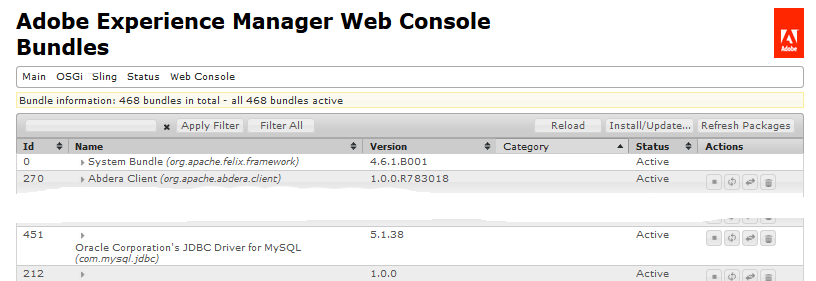
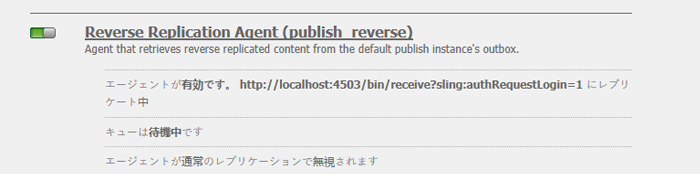
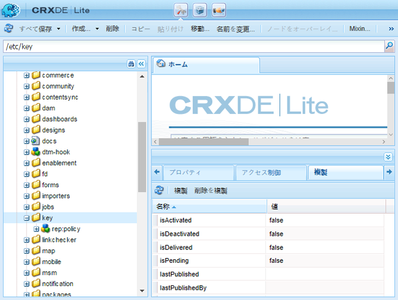

# Communities のデプロイ{#deploying-communities}

## 前提条件 {#prerequisites}

* [AEM 6.5 Platform](/help/sites-deploying/deploy.md)

* AEM Communities ライセンス

* オプション ライセンス：

   * [Adobe Analytics for Communities の機能](/help/communities/analytics.md)
   * [MongoDB for MSRP](/help/communities/msrp.md)
   * [ASRP のAdobeクラウド](/help/communities/asrp.md)

## インストールチェックリスト {#installation-checklist}

**[AEM プラットフォームの場合](/help/sites-deploying/deploy.md#what-is-aem)**:

* 最新の [AEM 6.5 アップデート ](#aem64updates) をインストールします。

* デフォルトポート（4502、4503）を使用しない場合は、[ レプリケーションエージェントを設定 ](#replication-agents-on-author) します。
* [暗号キーをレプリケート](#replicate-the-crypto-key)
* グローバル化をサポートする場合 [ 自動翻訳を設定 ](/help/sites-administering/translation.md)
（サンプル設定は開発用に提供）。

**[Communities 機能](/help/communities/overview.md)**:

* [ パブリッシュファーム ](/help/sites-deploying/recommended-deploys.md#tarmk-farm) をデプロイする場合は、[ プライマリパブリッシャーを特定 ](#primary-publisher)

* [トンネルサービスを有効にする](#tunnel-service-on-author)
* [ソーシャルログインを有効にする](/help/communities/social-login.md#adobe-granite-oauth-authentication-handler)
* [Adobe Analytics の設定](/help/communities/analytics.md)
* [ デフォルトのメールサービス ](/help/communities/email.md) を設定します
* [ 共有 UGC ストレージ ](/help/communities/working-with-srp.md) （**SRP**）の選択肢の特定

   * MongoDB SRP [ （MSRP） ](/help/communities/msrp.md) の場合

      * [MongoDB のインストールと設定](/help/communities/msrp.md#mongodb-configuration)
      * [Solr の設定](/help/communities/solr.md)
      * [MSRP を選択](/help/communities/srp-config.md)

   * リレーショナルデータベース SRP [ （DSRP）の場合 ](/help/communities/dsrp.md)

      * [MySQL 用の JDBC ドライバーのインストール](#jdbc-driver-for-mysql)
      * [DSRP 用の MySQL のインストールと設定](/help/communities/dsrp-mysql.md)
      * [Solr の設定](/help/communities/solr.md)
      * [DSRP を選択](/help/communities/srp-config.md)

   * Adobe SRP [ （ASRP） ](/help/communities/asrp.md) の場合

      * プロビジョニングについては、アカウント担当者にお問い合わせください。
      * [ASRP の選択](/help/communities/srp-config.md)

   * JCR SRP [ （JSRP） ](/help/communities/jsrp.md) の場合

      * 共有 UGC （ユーザー生成コンテンツ）ストアではありません：

         * UGC はレプリケートされません。
         * UGC は、入力されたAEM インスタンスまたはクラスターでのみ表示されます。

      * デフォルトは JSRP です


## 最新リリース {#latest-releases}

AEM 6.5 Communities GA には、Communities パッケージが含まれています。 AEM 6.5 [Communities](/help/release-notes/release-notes.md#experiencemanagercommunities) のアップデートについて詳しくは、[AEM 6.5 リリースノート ](/help/release-notes/release-notes.md#communities-release-notes.html) を参照してください。

### AEM 6.5 のアップデート {#aem-updates}

AEM 6.4 以降、Communities のアップデートは、AEM累積修正パックおよびサービスパックの一部として提供されます。

AEM 6.5 の最新の更新については、[Adobe Experience Manager 6.4 累積修正パックおよびサービスパック ](https://helpx.adobe.com/jp/experience-manager/aem-releases-updates.html) を参照してください。

### バージョン履歴 {#version-history}

AEM 6.4 以降と同様、AEM Communitiesの機能およびホットフィックスは、AEM Communities累積修正パックおよびサービスパックの一部です。 したがって、個別の機能パックはありません。

### MySQL 用 JDBC ドライバー {#jdbc-driver-for-mysql}

Communities の 1 つの機能は、MySQL データベースを使用します。

* [DSRP](/help/communities/dsrp.md) の場合：UGC の保存

MySQL コネクタを個別に取得してインストールする必要があります。

必要な手順は次のとおりです。

1. [https://dev.mysql.com/downloads/connector/j/](https://dev.mysql.com/downloads/connector/j/) から ZIP アーカイブをダウンロードします

   * バージョンは 5.1.38 以上である必要があります

1. `mysql-connector-java-&lt;version&gt;-bin.jar (bundle) from the archive` を抽出
1. Web コンソールを使用して、バンドルをインストールして起動します。

   * 例：https://localhost:4502/system/console/bundles
   * **`Install/Update`** を選択します。
   * 参照…して、ダウンロードした ZIP アーカイブから抽出したバンドルを選択します
   * *Oracle公社の MySQLcom.mysql.jdbc* 用の JDBC ドライバーがアクティブであることを確認し、アクティブでない場合は起動します（または、ログを確認します）

1. JDBC を設定した後で既存のデプロイメントにをインストールする場合は、Web コンソールで JDBC 設定を再度保存して、新しいコネクタに JDBC を再バインドします。

   * 例：https://localhost:4502/system/console/configMgr
   * 設定 `Day Commons JDBC Connections Pool` 見つけ、選択して設定を開きます。
   * `Save` を選択します。

1. 手順 3 と 4 を、すべてのオーサーインスタンスとパブリッシュインスタンスで繰り返します。

バンドルのインストールについて詳しくは、[Web コンソール ](/help/sites-deploying/web-console.md#bundles) ページを参照してください。

#### 例：インストールされている MySQL コネクタバンドル {#example-installed-mysql-connector-bundle}



### AEMの高度な MLS {#aem-advanced-mls}

SRP コレクション（MSRP または DSRP）が詳細多言語検索（MLS）をサポートするには、カスタムスキーマと Solr 設定に加えて、新しい Solr プラグインが必要です。 必要な項目はすべて、ダウンロード可能な zip ファイルにパッケージ化されます。

高度な MLS ダウンロード（「phasetwo」とも呼ばれます）は、次のAdobeリポジトリから入手できます。

* [AEM-SOLR-MLS-phasetwo](https://repo1.maven.org/maven2/com/adobe/tat/AEM-SOLR-MLS-phasetwo/1.2.40/)

   * バージョン 1.2.40、2016 年 4 月 6 日（Pt）
   * AEM-SOLR-MLS-phasetwo-1.2.40.zip のダウンロード

詳細およびインストール情報については、SRP の [Solr 設定 ](/help/communities/solr.md) を参照してください。

### Package Share へのリンクについて {#about-links-to-package-share}

Adobe **AEM Cloud に表示されるパッケージ**

このページのパッケージへのリンクは、`adobeaemcloud.com` の Package Share の場合と同様に、AEMの実行中のインスタンスを必要としません。 パッケージが表示可能な間は、`Install` のボタンをクリックすると、パッケージをAdobeでホストされるサイトにインストールできます。 ローカルのAEM インスタンスにをインストールしようとすると、`Install` を選択するとエラーが発生します。

**ローカル AEM インスタンスにをインストールする方法**

`adobeaemcloud.com` に表示されるパッケージをローカル AEM インスタンスにインストールするには、まずパッケージをローカルディスクにダウンロードする必要があります。

* 「**Assets**」タブを選択します
* **ディスクにダウンロード** を選択します

ローカル AEM インスタンスで、パッケージマネージャー（[https://localhost:4502/crx/packmgr/](https://localhost:4502/crx/packmgr/) など）を使用して、ローカルのAEM パッケージリポジトリにアップロードします。

または、ローカル AEM インスタンスからパッケージ共有を使用してパッケージにアクセスすると（[https://localhost:4502/crx/packageshare/](https://localhost:4502/crx/packageshare/) など）、「`Download`」ボタンがローカル AEM インスタンスのパッケージリポジトリにダウンロードされます。

ローカル AEM インスタンスのパッケージリポジトリに移動したら、パッケージマネージャーを使用してパッケージをインストールします。

詳しくは、[ パッケージの使用方法 ](/help/sites-administering/package-manager.md#package-share) を参照してください。

## 推奨されるデプロイメント {#recommended-deployments}

AEM Communitiesでは、共通ストアを使用して UGC が保存され、多くの場合、[ ストレージリソースプロバイダー（SRP） ](/help/communities/working-with-srp.md) と呼ばれます。 推奨されるデプロイメントは、共通ストアの SRP オプションの選択に重点を置いています。

共通ストアは、パブリッシュ環境での UGC のモデレートと分析をサポートすると同時に、UGC の [ レプリケーション ](/help/communities/sync.md) を不要にします。

* [ コミュニティコンテンツストア ](/help/communities/working-with-srp.md):AEM Communitiesの SRP ストレージオプションについて説明します

* [ 推奨トポロジ ](/help/communities/topologies.md)：ユースケースと SRP の選択に応じて使用するトポロジについて説明します

## アップグレード {#upgrading}

以前のバージョンのAEMからAEM 6.5 プラットフォームにアップグレードする場合は、[AEM 6.5 へのアップグレード ](/help/sites-deploying/upgrade.md) を参照することが重要です。

Communities の変更点については、プラットフォームのアップグレードに加えて、[AEM Communities 6.5 へのアップグレード ](/help/communities/upgrade.md) も参照してください。

## 設定 {#configurations}

### プライマリ発行者 {#primary-publisher}

選択したデプロイメントが [ パブリッシュファーム ](/help/communities/topologies.md#tarmk-publish-farm) であるとき、1 つのAEM パブリッシュインスタンスを、すべてのインスタンスで発生するわけではないアクティビティの **`primary publisher`** として識別する必要があります。 例えば、{notifications **や** 2}Adobe Analytics **に依存する機能などです。**

デフォルトでは、`AEM Communities Publisher Configuration` の OSGi 設定は「**`Primary Publisher`**」チェックボックスをオンにして設定されます。これにより、パブリッシュファーム内のすべてのパブリッシュインスタンスがプライマリとして自己識別するようになります。

そのため、「**`Primary Publisher`**」チェックボックスをオフにするには、**すべてのセカンダリパブリッシュインスタンスで設定を編集する** ことが必要です。


パブリッシュファームのその他すべての（セカンダリ）パブリッシュインスタンスの場合：

* 管理者権限でログイン
* [Web コンソール ](/help/sites-deploying/configuring-osgi.md) にアクセスします

   * 例：[https://localhost:4503/system/console/configMgr](https://localhost:4503/system/console/configMgr)

* `AEM Communities Publisher Configuration` を見つけます。
* 編集アイコンを選択します
* 「**プライマリの発行者**」チェックボックスをオフにします
* 「**保存**」を選択します

### オーサー環境のレプリケーションエージェント {#replication-agents-on-author}

レプリケーションは、パブリッシュ環境で作成されたサイトコンテンツ（コミュニティグループなど）や、[ トンネルサービス ](#tunnel-service-on-author) を使用してオーサー環境からメンバーおよびメンバーグループを管理するために使用されます。

プライマリパブリッシャーについて、[ レプリケーションエージェント設定 ](/help/sites-deploying/replication.md) がパブリッシュサーバーと承認済みユーザーを正しく識別していることを確認します。 デフォルトの承認済みユーザー `admin`、適切な権限を既に持っています（`Communities Administrators` のメンバーです）。

他のユーザーが適切な権限を持つには、それらのユーザーを `administrators` ユーザーグループのメンバー（`Communities Administrators` のメンバー）として追加する必要があります。

オーサー環境には 2 つのレプリケーションエージェントがあり、トランスポート設定を正しく設定する必要があります。

* 作成者のレプリケーションコンソールにアクセスします

   * グローバルナビゲーションから：**ツール、デプロイメント、レプリケーション、作成者のエージェント**

* 両方のエージェントに対して同じ手順に従います。

   * **デフォルトエージェント（公開）**
   * **リバースレプリケーションエージェント（公開リバース）**

      1. エージェントを選択します。
      1. **編集** を選択します。
      1. 「**トランスポート**」タブを選択します
      1. ポート `4503` でない場合は、**URI** を編集して正しいポートを指定します。

      1. ユーザー `admin` でない場合は **User** と **Password** を編集して、`administrators` ユーザーグループのメンバーを指定します。

次の画像は、によってポートを 4503 から 6103 に変更した結果を示しています。

#### デフォルトエージェント（公開） {#default-agent-publish}


#### リバースレプリケーションエージェント（リバースパブリッシュ） {#reverse-replication-agent-publish-reverse}

。

### オーサーのトンネルサービス {#tunnel-service-on-author}

オーサー環境を使用して [ サイトを作成 ](/help/communities/sites-console.md)、[ サイトプロパティを変更 ](/help/communities/sites-console.md#modifying-site-properties) または [ コミュニティメンバーを管理 ](/help/communities/members.md) する場合、オーサーに登録されたユーザーではなく、パブリッシュ環境に登録されたメンバー（ユーザー）にアクセスする必要があります。

トンネルサービスは、作成者のレプリケーションエージェントを使用してこのアクセスを提供します。

トンネルサービスを有効にするには：

* **オーサー** で、管理者権限でログインします。
* パブリッシャーが localhost:4503 でない場合、またはトランスポートユーザーが `admin` でない場合、
次に [ レプリケーションエージェントを設定 ](#replication-agents-on-author) します。

* [Web コンソール ](/help/sites-deploying/configuring-osgi.md) にアクセスします

   * 例：[https://localhost:4502/system/console/configMgr](https://localhost:4502/system/console/configMgr)

* `AEM Communities Publish Tunnel Service` を見つけます。
* 編集アイコンを選択します
* 「**有効**」チェックボックスを選択します
* 「**保存**」を選択

![AEM Communities Publish トンネル サービスで [ 有効 ] チェック ボックスがオン、またはオンになっています。](../assets/tunnel-service.png)

### 暗号鍵をレプリケート {#replicate-the-crypto-key}

AEM Communitiesには、すべてのAEM サーバーインスタンスが同じ暗号化キーを使用する必要がある 2 つの機能があります。 これらは [Analytics](/help/communities/analytics.md) と [ASRP](/help/communities/asrp.md) です。

AEM 6.3 では、重要な情報はファイルシステムに格納され、リポジトリには格納されなくなります。

オーサー環境からその他すべてのインスタンスに主要なマテリアルをコピーするには、次の手順を実行する必要があります。

* コピーする鍵データが含まれているAEM インスタンス（通常はオーサーインスタンス）にアクセスします

   * ローカルファイルシステム内で、`com.adobe.granite.crypto.file` バンドルを見つけます

     例：

      * `<author-aem-install-dir>/crx-quickstart/launchpad/felix/bundle21`
      * `bundle.info` ファイルは、バンドルを識別します

   * データフォルダーに移動します。
例：

      * `<author-aem-install-dir>/crx-quickstart/launchpad/felix/bundle21/data`

   * hmac ファイルとプライマリノードファイルをコピーします。

* 各ターゲット AEM インスタンス用

   * データフォルダーに移動します。
例：

      * `<publish-aem-install-dir>/crx-quickstart/launchpad/felix/bundle21/data`

   * 以前にコピーした 2 つのファイルを貼り付けます
   * ターゲット AEM インスタンスが実行中の場合は、[Granite Crypto バンドルを更新 ](#refresh-the-granite-crypto-bundle) する必要があります。

>[!CAUTION]
>
>暗号鍵に基づく別のセキュリティ機能が既に設定されている場合、暗号鍵をレプリケートすると、設定が破損する可能性があります。 サポートが必要な場合は、[ カスタマーケアにお問い合わせください ](https://experienceleague.adobe.com/?support-solution=General&amp;lang=ja&amp;support-tab=home#support)。

#### リポジトリのレプリケーション {#repository-replication}

AEM 6.2 以前と同様に、重要な資料をリポジトリに保存しておくと、保持できます。 各AEM インスタンス（初期リポジトリを作成する）の初回起動時に、次のシステムプロパティを指定します。

* `-Dcom.adobe.granite.crypto.file.disable=true`

>[!NOTE]
>
>[ 作成者のレプリケーションエージェント ](#replication-agents-on-author) が正しく設定されていることを確認することが重要です。

リポジトリに格納された鍵要素を使用して、オーサーインスタンスから他のインスタンスに暗号鍵をレプリケートする方法は次のとおりです。

[CRXDE Lite](/help/sites-developing/developing-with-crxde-lite.md) を使用：

* [https://&lt;server>:&lt;port>/crx/de](https://localhost:4502/crx/de) を参照します
* `/etc/key` を選択します。
* 「`Replication`」タブを開く
* `Replicate` を選択します。

* [granite Crypto バンドルを更新します](#refresh-the-granite-crypto-bundle)



#### Granite Crypto バンドルを更新します {#refresh-the-granite-crypto-bundle}

* 各パブリッシュインスタンスで、[Web コンソール ](/help/sites-deploying/configuring-osgi.md) にアクセスします。

   * 例：[https://&lt;server>:&lt;port>/system/console/bundles](https://localhost:4503/system/console/bundles)

* バンドル（com.adobe.granite.crypto） `Adobe Granite Crypto Support` 見つけます
* **更新** を選択


* しばらくすると、**成功** ダイアログが表示されます。
  `Operation completed successfully.`

### Apache HTTP サーバー {#apache-http-server}

Apache HTTP サーバーを使用する場合は、関連するすべてのエントリに正しいサーバー名を使用していることを確認します。

特に、`RedirectMatch` では `localhost` ではなく、正しいサーバー名を使用するように注意してください。

#### httpd.conf サンプル {#httpd-conf-sample}

```shell
<IfModule alias_module>
     # XAMPP does not have a favicon; this prevents any 404 errors which may arise.
     Redirect 404 /favicon.ico
     <Location /favicon.ico>
         ErrorDocument 404 "No favicon"
     </Location>

    # Return from "Sign Out" generates response header directing you to "/", generating a 404 error
    # The RedirectMatch resolves it correctly when modified for the target Community Site :
    RedirectMatch ^/$ https://[server name]/content/sites/engage/en.html
 ...
 </IfModule>
```

### Dispatcher {#dispatcher}

Dispatcherを使用している場合は、を参照してください。

* AEM [Dispatcher](https://experienceleague.adobe.com/docs/experience-manager-dispatcher/using/dispatcher.html?lang=ja) ドキュメント
* [Dispatcher のインストール](https://experienceleague.adobe.com/docs/experience-manager-dispatcher/using/getting-started/dispatcher-install.html?lang=ja)
* [Communities 用の Dispatcher の設定](/help/communities/dispatcher.md)
* [既知の問題](/help/communities/troubleshooting.md#dispatcher-refetch-fails)

## 関連する Communities ドキュメント {#related-communities-documentation}

* コミュニティサイトの作成、コミュニティサイトテンプレートの設定、コミュニティコンテンツの管理、メンバーの管理、メッセージングの設定については、[ コミュニティサイトの管理 ](/help/communities/administer-landing.md) を参照してください。

* [ コミュニティの開発 ](/help/communities/communities.md) を参照して、ソーシャルコンポーネントフレームワーク（SCF）と、コミュニティのコンポーネントや機能のカスタマイズについて学ぶことができます。

* Communities コンポーネントを使用してオーサリングする方法と設定する方法については、[Communities コンポーネントのオーサリング ](/help/communities/author-communities.md) を参照してください。

