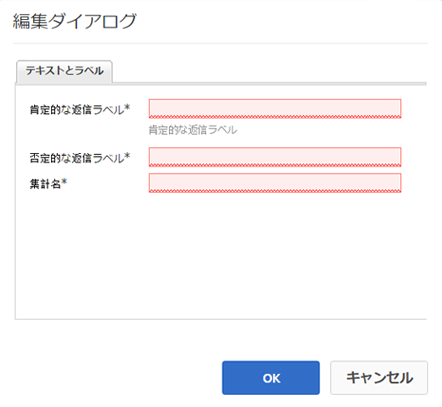

# 投票の使用 {#using-voting}

`Voting`コンポーネントは、コミュニティのメンバーがQnAコンポーネント内の回答など、特定のコンテンツの部分を評価するのに役立つツールです。 `Voting`コンポーネントを使用して、メンバーは上向きまたは下向きの矢印を選択し、その意見を示します。

## 投票をページに追加 {#adding-voting-to-a-page}

作成者モードで`Voting`コンポーネントをページに追加するには、コンポーネントブラウザーを使用して`Communities / Voting`を検索し、ページ上にドラッグして配置します。例えば、ユーザーが投票できる機能に対する相対位置です。

必要な情報については、[Communities Components Basics](basics.md)を参照してください。

[必要なクライアント側ライブラリ](essentials-voting.md#essentials-for-client-side)が含まれる場合、`Voting`コンポーネントは次のように表示されます。

## 投票の設定 {#configuring-voting}

アクセスする配置済みの`Voting`コンポーネントを選択し、編集ダイアログを開く`Configure`アイコンを選択します。

「**[!UICONTROL テキストとラベル]**」タブで、投票の記録に使用するプロパティを指定します。

* **[!UICONTROL 肯定的な返信ラベル]**

   （*必須*）ポジティブな応答の内部プロパティ名。

* **[!UICONTROL 否定的な返信ラベル]**

   （*必須*）否定的な応答の内部プロパティ名。

* **[!UICONTROL 集計名]**

   （*必須*）投票コンポーネントのこのインスタンスの内部で識別可能なプロパティ名。

## サイト訪問者のエクスペリエンス {#site-visitor-experience}

### メンバー {#members}

メンバーが投票できるのは 1 回だけですが、いつでも投票を変更できます。

### 匿名  {#anonymous}

匿名での投票はサポートされていません。サイト訪問者は、一度投票に参加するには、登録（会員になる）し、サインインする必要があります。

## 追加情報 {#additional-information}

詳しい情報は、開発者向けの[投票の必須事項](essentials-voting.md)ページにあります。
