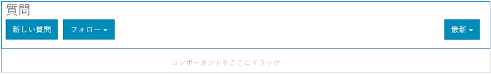

# Q&amp;A フォーラム機能{#q-a-forum-feature}

## はじめに {#introduction}

Q&amp;A（質問と回答）フォーラム機能は、コミュニティメンバーが質問をしたり、質問に答えたりする領域を提供します。 メンバーは次の操作を実行できます。

* 新しい質問の作成
* インライン画像の追加（ドラッグ&amp;ドロップのサポートあり）
* 質問の表示と回答
* 質問の検索
* Q&amp;Aコンテンツのモデレートに役立つ
* 最良の回答の特定
* Q&amp;Aの質問をページ間で移動する

このドキュメントでは、以下について説明します。

* Q&amp;Aフォーラム機能をAEMサイトに追加。
* `QnA`コンポーネントの設定。

## Q&amp;A フォーラムをページに追加 {#adding-a-q-a-forum-to-a-page}

`QnA`コンポーネントをオーサリングモードでページに追加するには、コンポーネントブラウザーを使用して`Communities / QnA`を探し、Q&amp;Aフォーラムが表示されるページ上の場所にドラッグします。

必要な情報については、[コミュニティコンポーネントの基本](/help/communities/basics.md)を参照してください。

[必須のクライアント側ライブラリ](/help/communities/qna-essentials.md#essentials-for-client-side)を含めると、`QnA`コンポーネントは次のように表示されます。

### Q&amp;A の設定 {#configuring-qna}

配置済みの`QnA`コンポーネントを選択し、`Configure`アイコンを選択すると、編集ダイアログが開きます。

#### 「設定」タブ{#settings-tab}

「**設定**」タブでは、トピック（質問）と返信（回答）の基本機能を設定します。

* **添付サムネールを許可**

   オンにすると、添付画像のサムネールが作成されます。

* **添付サムネールの最大サイズ**

   添付ファイルのサムネール画像の最大サイズ（ピクセル単位）。 デフォルト値は、800 x 800 です。

* **サムネールの最小画像サイズ**

   インライン画像のサムネールを生成する画像の最小サイズ（バイト単位）です。 デフォルト値は100000バイト(100 kb)です。

* **サムネールの最大サイズ**

   インライン画像のサムネール画像の最大サイズ（ピクセル単位）。 デフォルト値は、800 x 800 です。

* **1 ページのトピック数**

   1ページに表示する質問/投稿の数を定義します。 初期設定は 10 です。

* **モデレート**

   オンにすると、トピックおよびコメントの投稿を発行サイトに表示する前に承認が必要になります。 デフォルト値はオフです。

* **閉じる**

   オンにすると、フォーラムは新しい質問やコメントを受け付けなくなります。 デフォルト値はオフです。

* **リッチテキストエディター**

   オンにすると、マークアップを使用してトピックとコメントを入力できます。 デフォルト値はオフです。

* **タグ付けを許可**

   オンにすると、メンバーは自分の投稿にタグラベルを追加できます（**タグフィールド**&#x200B;タブを参照）。 デフォルト値はオフです。

* **ファイルのアップロードを許可**

   オンにすると、質問またはコメントに添付ファイルを追加できます。 デフォルト値はオフです。

* **フォローを許可**

   オンにすると、フォーラム投稿に次の機能が含まれ、メンバーは新しい投稿の[通知](/help/communities/notifications.md)を受け取ることができます。 デフォルト値はオフです。

* **ピン留めを許可**

   オンにすると、フォーラムトピックをトピックのリストの先頭に固定できます。 デフォルト値はオフです。

* **電子メール購読を許可**

   オンにすると、新しい投稿をEメールでメンバーに通知できます（[購読](/help/communities/subscriptions.md)）。 「フォローを許可」をオンにして、[電子メールを設定](/help/communities/email.md)する必要があります。デフォルト値はオフです。

* **最大ファイルサイズ**

   `Allow File Uploads`がオンの場合にのみ関連します。 このフィールドは、アップロードするファイルのサイズ（バイト単位）を制限します。初期設定は104857600(10 Mb)です。

* **許可されるファイルタイプ**

   `Allow File Uploads`がオンの場合にのみ関連します。 区切り文字「ドット」を含むファイル拡張子のコンマ区切りリスト。 例：.jpg, .jpeg, .png, .doc, .docx, .pdf）。ファイルタイプを指定した場合、指定しなかったファイルはアップロードできません。 初期設定では、** **すべてのファイルタイプが許可されるように指定されません。

* **添付する画像ファイルの最大サイズ**

   「ファイルのアップロードを許可」がオンの場合にのみ関連します。 アップロードされた画像ファイルに含めることができる最大バイト数。 初期設定は2097152(2 Mb)です。

* **応答を許可**

   オンにすると、質問に投稿されたコメントに対する返信を許可します。 デフォルト値はオフです。

* **投票を許可**

   オンにすると、質問に投票機能が含まれます。 デフォルト値はオフです。

* **ユーザーによるコメントおよびトピックの削除を許可**

   オンにすると、メンバーは自分が投稿したコメントや質問を削除できます。 デフォルト値はオフです。

* **権限を持つメンバーを許可**

   オンにすると、権限を持つメンバーのみがコンテンツを作成できます。

* **作成者編集モードでユーザーが生成したコンテンツをブロックする**

   有効にすると、オーサーモードでの編集中にユーザー生成コンテンツがブロックされます。

* **選択した回答を一番上に移動**

   オンにすると、最初に表示される回答は選択した回答になります。 デフォルト値はオフです。
* **バッジを表示**

   オンにすると、獲得した[バッジ](/help/communities/implementing-scoring.md)をメンバーのブログエントリに割り当てて表示します。 デフォルト値はオフです。

* **おすすめコンテンツを許可**

   オンにすると、アイデアを[おすすめコンテンツ](/help/communities/featured.md)として識別できます。 デフォルト値はオフです。

* **メンションを有効化**

   有効にすると、登録済みコミュニティユーザーは、他の登録済みメンバー（名、姓、ユーザー名を使用）を識別し、共通の@user-name構文を使用してタグ付けできます。 タグ付けされたユーザーは、メンションに関する通知を受け取ります。

* **最大メンション数**

   投稿で許可するメンションの最大数を制限します。 初期設定は 10 です。

* **UI メンションパターン**

   投稿内の登録ユーザーにタグ付け(@mention)するために許可されるパターン文字列を指定します。 （例：`~{{familyName}}{{givenName}}`）。

#### 「ユーザーモデレート」タブ{#user-moderation-tab}

「**ユーザーモデレート**」タブで、投稿されたトピック（質問）と回答（ユーザー生成コンテンツ）の管理方法を指定します。 詳しくは、[ユーザー生成コンテンツのモデレート](/help/communities/moderate-ugc.md)を参照してください。

* **回答を拒否**

   オンにすると、信頼できるメンバーモデレーターは、投稿された回答を拒否し、公開Q&amp;Aフォーラムに回答が表示されなくなります。 デフォルト値はオフです。

* **トピックを閉じる / 再度開く**

   オンにすると、信頼されているメンバーモデレーターは、質問（トピック）を閉じて、さらに編集や回答を行ったり、質問を再度開いたりできます。 デフォルト値はオフです。

* **トークンを移動**&#x200B;オンにすると、パブリッシュ側のモデレーターが質問を移動できます。デフォルト値はオフです。

* **投稿にフラグを設定**

   オンにすると、メンバーは他のユーザーの質問や回答に「不適切」のフラグを設定できます。 デフォルト値はオフです。

* **フラグ設定理由リスト**

   オンにすると、メンバーは質問または回答に「不適切」のフラグを設定した理由をドロップダウンリストから選択できます。 デフォルト値はオフです。

* **カスタムフラグ設定理由**

   オンにすると、メンバーは質問または回答に「不適切」のフラグを設定した独自の理由を入力できます。 デフォルト値はオフです。

* **モデレートのしきい値**

   モデレーターに通知する前に、メンバーが質問または回答にフラグを設定する回数を入力します。 初期設定は1（1回）です。

* **フラグ付けの制限**

   質問または回答に何回フラグを設定したら、公開表示から非表示にするかを入力します。 -1に設定した場合、フラグが設定された質問または回答が公開表示から非表示になることはありません。 それ以外の場合は、この数値をモデレートのしきい値以上にする必要があります。 初期設定は 5 です。

#### 「タグフィールド」タブ{#tag-field-tab}

「**タグフィールド**」タブで、適用できるタグ（「**設定**」タブで許可されている場合）は、選択した名前空間に応じて制限されます。

* **許可された名前空間**

   「**設定**」タブで`Allow Tagging`がチェックされている場合に関連します。 適用できるタグは、チェック対象の名前空間カテゴリ内のタグに制限されます。 名前空間のリストには、「標準タグ」（デフォルトの名前空間）と「すべてのタグを含む」が含まれます。 初期設定は「なし」です。これは、すべての名前空間が許可されることを意味します。

* **推奨の制限**

   フォーラムに投稿するメンバーに提案として表示するタグの数を入力します。 値が**-**1の場合、制限はありません。 初期設定は 0 です。

#### 「並べ替え設定」タブ{#sort-settings-tab}

「**並べ替え設定**」タブで、投稿されたコメントを表示する際の並べ替え方法を指定します。

* **並べ替え**

   許可されている並べ替えの選択をすべてオンにします。`Newest, Oldest, Last Updated, Most Viewed, Most Active, Most Followed and Most Liked`. デフォルトは `Newest, Oldest, Last Updated` です。

* **デフォルトとして設定**

   プルダウンして、オンにした並べ替えオプションの1つを選択し、デフォルトとして表示します。 デフォルトは `Newest` です。

* **Analytics 並べ替えのタイムオプションを選択**

   ドロップダウンして`All, Last 24 Hours, Last 7 Days, Last 30 Days`の1つを選択します。 デフォルトは `All` です。

## サイト訪問者のエクスペリエンス {#site-visitor-experience}

### 回答の指定 {#identifying-answers}

`Select Answer`ボタンを使用して、1つの回答を正解または有用な回答としてマークできます。 質問が「回答済み」とマークされると、最初の回答の選択が`Unmark Chosen Answer`ボタンで解除されるまで、別の回答は選択できません。

有効な回答として選択された回答は、「`Unmark Chosen Answer`」ボタンを使用して選択解除できます。

回答が有効な回答として選択されると、メインのQ&amp;Aページの質問トピックの横に、質問が`Answered`されたことを示すメッセージが表示されます。

#### モデレーターおよび管理者 {#moderators-and-administrators}

サインインしているユーザーがモデレーター権限または管理者権限を持っている場合は、誰が質問または回答を作成したかにかかわらず、コンポーネントの設定によって許可されているモデレートタスクを実行できます。

また、回答を特定することもできます。

#### メンバー {#members}

サイト訪問者がサインインすると、設定に応じて、次の操作が可能になります。

* 新しい質問を投稿します。
* 作成した質問を編集または削除します。
* 他のメンバーの質問または回答にフラグを設定します。
* 作成した質問に対する回答を特定します。

#### 匿名 {#anonymous}

サインインしていないサイト訪問者は、投稿された質問や回答の読み取り、サポートされている場合は翻訳のみが可能ですが、質問や回答の追加、他の人の投稿のフラグを設定することはできません。

## 追加情報 {#additional-information}

詳しくは、開発者向けの[Q&amp;Aの基本事項](/help/communities/qna-essentials.md)ページを参照してください。

投稿されたトピックとコメントのモデレートについては、[ユーザー生成コンテンツのモデレート](/help/communities/moderate-ugc.md)を参照してください。

投稿されたトピックとコメントのタグ付けについては、[ユーザー生成コンテンツのタグ付け](/help/communities/tag-ugc.md)を参照してください。
