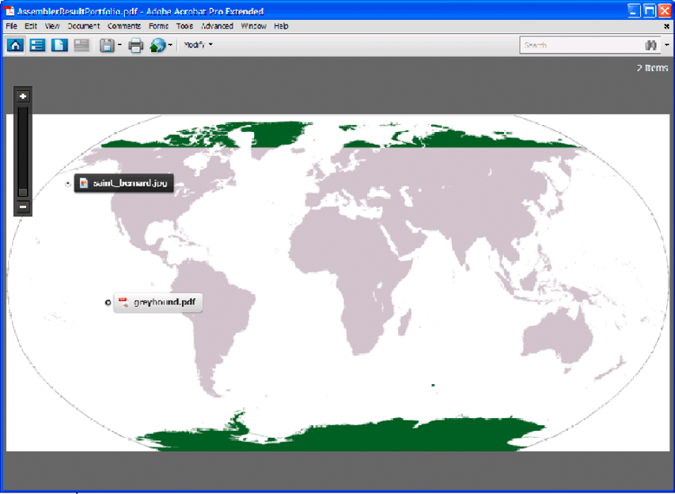

# PDFポートフォリオのアセンブリ {#assembling-pdf-portfolios}

Assembler JavaおよびWebサービスAPIを使用して、PDFポートフォリオをアセンブルできます。 ポートフォリオは、Wordファイル、画像ファイル（jpegファイルなど）、PDFドキュメントなど、様々な種類のドキュメントを組み合わせることができます。 ポートフォリオのレイアウトは、プレビュー付き *グリッド*、画像 *レイアウト* 上、 **&#x200B;回転など、様々なスタイルに設定できます。

以下の図は、ポートフォリオと画像 *スタイルレイアウトのスクリーンショット* を示しています。



PDFポートフォリオを作成すると、ドキュメントのコレクションを渡す代わりに、ペーパーレスで行うことができます。 AEM Formsを使用すると、構造化DDXドキュメントを使用してAssemblerサービスを呼び出すことでポートフォリオを作成できます。 次のDDXドキュメントは、PDFポートフォリオを作成するDDXドキュメントの例です。

```xml
 <DDX xmlns="https://ns.adobe.com/DDX/1.0/">
     <PDF result="portfolio1.pdf">
         <Portfolio>
             <Navigator source="myNavigator">
                 <Resource name="navigator/image.xxx" source="myImage.png"/>
             </Navigator>
         </Portfolio>
         <PackageFiles source="dog1"  >
              <FieldData name="X">72</FieldData>
             <FieldData name="Y">72</FieldData>
             <File filename="saint_bernard.jpg" mimetype="image/jpeg"/>
         </PackageFiles>
         <PackageFiles source="dog2"  >
             <FieldData name="X">120</FieldData>
             <FieldData name="Y">216</FieldData>
             <File filename="greyhound.pdf"/>
         </PackageFiles>
     </PDF>
 </DDX>
```

DXXドキュメントには、タグが入れ子になっている `Portfolio` 必要があり `Navigator` ます。 タグ `<Resource name="navigator/image.xxx" source="myImage.png"/>` は、onImageレイアウトナビゲーターとして割り当てら `myNavigator` れている場合にのみ必要です。 `AdobeOnImage.nav`. このタグを使用すると、Assemblerサービスでポートフォリオの背景として使用する画像を選択できます。 パッケージファイル `PackageFiles``File` のファイル名とMIMEタイプを定義するタグとタグを含めます。

>[!NOTE]
>
>For more information about the Assembler service, see [Services Reference for AEM Forms](https://www.adobe.com/go/learn_aemforms_services_63).

>[!NOTE]
>
>DDXドキュメントについて詳しくは、『 [Assembler Service and DDX Reference](https://www.adobe.com/go/learn_aemforms_ddx_63)』を参照してください。

## 手順の概要 {#summary-of-steps}

PDFポートフォリオを作成するには、次のタスクを実行します。

1. プロジェクトファイルを含めます。
1. PDFアセンブラクライアントを作成します。
1. 既存のDDXドキュメントの参照。
1. 必要なドキュメントを参照します。
1. 実行時オプションを設定します。
1. ポートフォリオをアセンブルします。
1. 組み立てたポートフォリオを保存します。

**プロジェクトファイルを含める**

必要なファイルを開発プロジェクトに含めます。 Javaを使用してクライアントアプリケーションを作成する場合は、必要なJARファイルを含めます。 Webサービスを使用している場合は、プロキシファイルを必ず含めてください。

次のJARファイルをプロジェクトのクラスパスに追加する必要があります。

* adobe-livecycle-client.jar
* adobe-usermanager-client.jar
* adobe-assembler-client.jar
* adobe-utilities.jar(AEM FormsがJBossにデプロイされている場合に必要)
* jbossall-client.jar(AEM FormsがJBossにデプロイされている場合に必要)

**PDFアセンブラクライアントの作成**

プログラムによってAssembler操作を実行する前に、Assemblerサービスクライアントを作成します。

**既存のDDXドキュメントの参照**

PDFポートフォリオをアセンブリするには、DDXドキュメントを参照する必要があります。 このDDXドキュメントには、 `Portfolio`、、 `Navigator` およびの各 `PackageFiles` 要素が含まれている必要があります。

**必要なドキュメントの参照**

PDFポートフォリオをアセンブリするには、アセンブリ対象のドキュメントを表すすべてのファイルを参照します。 例えば、DDXドキュメントで指定されているすべての画像ファイルをAssemblerサービスに渡します。 これらのファイルは、この節で指定するDDXドキュメントで参照されます。 *myImage.png* 、 *saint_bernard.jpg*。

PDFポートフォリオのアセンブリ時に、NAVファイル（ナビゲーターファイル）をAssemblerサービスに渡します。 Assemblerサービスに渡すNAVファイルは、作成するPDFポートフォリオのタイプに応じて異なります。 例えば、画像 *上レイアウトを作成するには、AdobeOnImage* .navファイルを渡します。 NAVファイルは次のフォルダーにあります。

`<Install folder>\Acrobat 9.0\Acrobat\Navigators`

Acrobat 9（以降）のインストールディレクトリからNAVファイルをコピーします。 NAVファイルは、クライアントアプリケーションがアクセスできる場所に配置します。 すべてのファイルは、Mapコレクションオブジェクト内でAssemblerサービスに渡されます。

>[!NOTE]
>
>PDFポートフォリオのアセンブリに関連付けられているクイック開始では、AdobeOnImage.navを使用します。

**実行時オプションの設定**

ジョブの実行中にAssemblerサービスの動作を制御する実行時オプションを設定できます。 例えば、エラーが発生した場合にジョブの処理を続行するようAssemblerサービスに指示するオプションを設定できます。

**ポートフォリオの編成**

PDFポートフォリオをアセンブリするには、この `invokeDDX` 操作を呼び出します。 Assemblerサービスは、コレクションオブジェクト内でPDFポートフォリオを返します。

**組み立てたポートフォリオの保存**

PDFポートフォリオは、コレクションオブジェクト内で返されます。 コレクションオブジェクトを繰り返し処理し、PDFポートフォリオをPDFファイルとして保存します。

**関連トピック**

[Java APIを使用したPDFポートフォリオのアセンブリ](#assemble-a-pdf-portfolio-using-the-java-api)

[WebサービスAPIを使用したPDFポートフォリオのアセンブリ](#assemble-a-pdf-portfolio-using-the-web-service-api)

[AEM Forms Java ライブラリファイルを含める](/help/forms/developing/invoking-aem-forms-using-java.md#including-aem-forms-java-library-files)

[接続プロパティの設定](/help/forms/developing/invoking-aem-forms-using-java.md#setting-connection-properties)

[プログラムによるPDFドキュメントのアセンブリ](/help/forms/developing/programmatically-assembling-pdf-documents.md)

## Java APIを使用したPDFポートフォリオのアセンブリ {#assemble-a-pdf-portfolio-using-the-java-api}

Assembler Service API(Java)を使用してPDFポートフォリオをアセンブリします。

1. プロジェクトファイルを含めます。

   Javaプロジェクトのクラスパスに、adobe-assembler-client.jarなどのクライアントJARファイルを含めます。

1. PDFアセンブラクライアントを作成します。

   * 接続プロパティを含む `ServiceClientFactory` オブジェクトを作成します。
   * Create an `AssemblerServiceClient` object by using its constructor and passing the `ServiceClientFactory` object.

1. 既存のDDXドキュメントの参照。

   * コンストラクターを使用し、DDXファイルの場所を指定する文字列値を渡して、DDXドキュメントを表す `java.io.FileInputStream` オブジェクトを作成します。
   * コンストラクタを使用して `com.adobe.idp.Document` オブジェクトを渡すことによって、`java.io.FileInputStream` オブジェクトを作成します。

1. 必要なドキュメントを参照します。

   * コンストラクターを使用して、入力PDFドキュメントの格納に使用する `java.util.Map` オブジェクトを作成し `HashMap` ます。
   * コンストラクタを使用して `java.io.FileInputStream` オブジェクトを作成します。必要なNAVファイルの場所を渡します(ポートフォリオの作成に必要な各ファイルに対してこのタスクを繰り返します)。
   * オブジェクトを作成し、NAVファイルを含む `com.adobe.idp.Document``java.io.FileInputStream` オブジェクトを渡します(ポートフォリオの作成に必要な各ファイルに対してこのタスクを繰り返します)。
   * メソッド追加を呼び出し、次の引数を渡すことによって、オブジェクトに対するエントリを作成します。 `java.util.Map``put`

      * キー名を表すstring値です。 この値は、DDXドキュメントで指定されたソース要素の値と一致する必要があります。 (ポートフォリオの作成に必要なファイルごとに、このタスクを繰り返します)。
      * PDFドキュメントを含む `com.adobe.idp.Document` オブジェクトです。 (ポートフォリオの作成に必要なファイルごとに、このタスクを繰り返します)。

1. 実行時オプションを設定します。

   * コンストラクターを使用して、実行時のオプションを格納する `AssemblerOptionSpec` オブジェクトを作成します。
   * オブジェクトに属するメソッドを呼び出して、ビジネス要件に合うように実行時オプションを設定し `AssemblerOptionSpec` ます。 例えば、エラーが発生した場合にジョブの処理を続行するようにAssemblerサービスに指示するには、 `AssemblerOptionSpec` オブジェクトの `setFailOnError` メソッドを呼び出して渡し `false`ます。

1. ポートフォリオをアセンブルします。

   オブジェクトの `AssemblerServiceClient``invokeDDX` メソッドを呼び出し、次の必須値を渡します。

   * 使用するDDXドキュメントを表す `com.adobe.idp.Document` オブジェクトです
   * PDFポートフォリオの構築に必要なファイルが含まれる `java.util.Map` オブジェクトです。
   * デフォルトフォントやジョブログレベルなど、ランタイムオプションを指定する `com.adobe.livecycle.assembler.client.AssemblerOptionSpec` オブジェクト。

   この `invokeDDX` メソッドは、アセンブリされたPDFポートフォリオと発生した例外を含む `com.adobe.livecycle.assembler.client.AssemblerResult` オブジェクトを返します。

1. 組み立てたポートフォリオを保存します。

   PDFポートフォリオを取得するには、次の操作を実行します。

   * オブジェクトの `AssemblerResult` メソッドを呼び出し `getDocuments` ます。 このメソッドは、 `java.util.Map` オブジェクトを返します。
   * オブジェクトを繰り返し処理して、結果のオブジ `java.util.Map``com.adobe.idp.Document` ェクトを見つけます。
   * オブジェクトの `com.adobe.idp.Document``copyToFile` メソッドを呼び出してPDFポートフォリオを抽出します。

**関連トピック**

[クイック開始（SOAPモード）: Java APIを使用したPDFポートフォリオのアセンブリ](/help/forms/developing/assembler-service-java-api-quick.md#quick-start-soap-mode-assembling-pdf-portfolios-using-the-java-api)

[AEM Forms Java ライブラリファイルを含める](/help/forms/developing/invoking-aem-forms-using-java.md#including-aem-forms-java-library-files)

[接続プロパティの設定](/help/forms/developing/invoking-aem-forms-using-java.md#setting-connection-properties)

## WebサービスAPIを使用したPDFポートフォリオのアセンブリ {#assemble-a-pdf-portfolio-using-the-web-service-api}

Assembler Service API（Webサービス）を使用してPDFポートフォリオをアセンブリします。

1. プロジェクトファイルを含めます。

   MTOMを使用するMicrosoft .NETプロジェクトを作成します。 サービス参照を設定する際は、次のWSDL定義を使用してください。 `http://localhost:8080/soap/services/AssemblerService?WSDL&lc_version=9.0.1`.

   >[!NOTE]
   >
   >サーバーホスト `localhost` AEM FormsのIPアドレスに置き換えます。

1. PDFアセンブラクライアントを作成します。

   * デフォルトのコンストラクターを使用して `AssemblerServiceClient` オブジェクトを作成します。
   * コンストラクターを使用して `AssemblerServiceClient.Endpoint.Address` オブジェクトを作成し `System.ServiceModel.EndpointAddress` ます。 WSDLをAEM Formsサービス(例えば、 `http://localhost:8080/soap/services/AssemblerService?blob=mtom`)に渡すstring値を渡します。 属性を使用する必要はありません `lc_version` 。 この属性は、サービス参照を作成する際に使用されます。
   * フィールドの値を取得して `System.ServiceModel.BasicHttpBinding` オブジェクトを作成し `AssemblerServiceClient.Endpoint.Binding` ます。 戻り値を `BasicHttpBinding` にキャストします。
   * オブジェクトの `System.ServiceModel.BasicHttpBinding` フィールドをに設定し `MessageEncoding` ま `WSMessageEncoding.Mtom`す。 この値により、MTOMが使用されます。
   * 次のタスクを実行して、基本的なHTTP認証を有効にします。

      * フィールドにAEM formsのユーザー名を割り当て `AssemblerServiceClient.ClientCredentials.UserName.UserName`ます。
      * 対応するパスワード値をフィールドに割り当て `AssemblerServiceClient.ClientCredentials.UserName.Password`ます。
      * 定数値をフィールド `HttpClientCredentialType.Basic` に割り当て `BasicHttpBindingSecurity.Transport.ClientCredentialType`ます。
      * 定数値をフィールド `BasicHttpSecurityMode.TransportCredentialOnly` に割り当て `BasicHttpBindingSecurity.Security.Mode`ます。

1. 既存のDDXドキュメントの参照。

   * コンストラクタを使用して `BLOB` オブジェクトを作成します。この `BLOB` オブジェクトは、DDXドキュメントの格納に使用されます。
   * コンストラクターを呼び出し、DDXドキュメントのファイルの場所とファイルを開くモードを表すstring値を渡して、 `System.IO.FileStream` オブジェクトを作成します。
   * オブジェクトの内容を格納するバイト配列を作成し `System.IO.FileStream` ます。 バイト配列のサイズは、 `System.IO.FileStream` オブジェクトのプロパティを取得して決定でき `Length` ます。
   * オブジェクトのメソッドを呼び出して、バイト配列にストリームデータ `System.IO.FileStream` を入力し `Read` ます。 読み取るバイト配列、開始位置、ストリーム長を渡します。
   * オブジェクトのプロパティにバイト配列の内容を割り当てて、 `BLOB``MTOM` オブジェクトを入力します。

1. 必要なドキュメントを参照します。

   * 各入力ファイルに対して、コンストラクターを使用して `BLOB` オブジェクトを作成します。 この `BLOB` オブジェクトは、入力ファイルの保存に使用されます。
   * コンストラクターを呼び出し、入力ファイルのファイルの場所とファイルを開くモードを表すstring値を渡して、 `System.IO.FileStream` オブジェクトを作成します。
   * オブジェクトの内容を格納するバイト配列を作成し `System.IO.FileStream` ます。 バイト配列のサイズは、 `System.IO.FileStream` オブジェクトのプロパティを取得して決定でき `Length` ます。
   * オブジェクトのメソッドを呼び出して、バイト配列にストリームデータ `System.IO.FileStream` を入力し `Read` ます。 読み取るバイト配列、開始位置、ストリーム長を渡します。
   * オブジェクトにバイト配列の内容を割り当てて、 `BLOB` オブジェクト `MTOM` を入力します。
   * Create a `MyMapOf_xsd_string_To_xsd_anyType` object. このコレクションオブジェクトは、PDFポートフォリオの作成に必要な入力ファイルの格納に使用されます。
   * 各入力ファイルに対して、 `MyMapOf_xsd_string_To_xsd_anyType_Item` オブジェクトを作成します。
   * キー名を表すstring値を `MyMapOf_xsd_string_To_xsd_anyType_Item` オブジェクトの `key` フィールドに割り当てます。 この値は、DDXドキュメントで指定された要素の値と一致する必要があります。 (このタスクは、入力ファイルごとに実行します)。
   * 入力ファイルを格納している `BLOB` オブジェクトをオブジェクトのフィー `MyMapOf_xsd_string_To_xsd_anyType_Item` ルドに割り当て `value` ます。 (このタスクは、入力PDFドキュメントごとに実行します)。
   * オ追加ブジェクトをオブジ `MyMapOf_xsd_string_To_xsd_anyType_Item``MyMapOf_xsd_string_To_xsd_anyType` ェクトに追加します。 Invoke the `MyMapOf_xsd_string_To_xsd_anyType` object&#39;s `Add` method and pass the `MyMapOf_xsd_string_To_xsd_anyType` object. (このタスクは、入力PDFドキュメントごとに実行します)。

1. 実行時オプションを設定します。

   * コンストラクターを使用して、実行時のオプションを格納する `AssemblerOptionSpec` オブジェクトを作成します。
   * オブジェクトに属するデータメンバに値を割り当てることで、ビジネス要件に合った実行時オプションを設定し `AssemblerOptionSpec` ます。 例えば、エラーが発生した場合にジョブの処理を続行するようにAssemblerサービスに指示するには、 `false` オブジェクトの `AssemblerOptionSpec``failOnError` データメンバーに割り当てます。

1. ポートフォリオをアセンブルします。

   オブジェクトの `AssemblerServiceClient``invokeDDX` メソッドを呼び出し、次の値を渡します。

   * DDXドキュメントを表す `BLOB` オブジェクトです
   * 必要なファイルを含む `MyMapOf_xsd_string_To_xsd_anyType` オブジェクトです
   * 実行時オプションを指定する `AssemblerOptionSpec` オブジェクトです。

   この `invokeDDX` メソッドは、ジョブの結果と発生した例外を含む `AssemblerResult` オブジェクトを返します。

1. 組み立てたポートフォリオを保存します。

   新しく作成されたPDFポートフォリオを取得するには、次の操作を実行します。

   * オブジェクトのフ `AssemblerResult` ィールドにアクセスします。この `documents` フィールドは、結果のPDFドキュメントを含む `Map` オブジェクトです。
   * オブジェクトを繰り返し処理して、 `Map` 各結果ドキュメントを取得します。 次に、その配列メンバーをにキャスト `value` し `BLOB`ます。
   * PDFドキュメントを表すバイナリデータを抽出するには、その `BLOB` オブジェクトの `MTOM` プロパティにアクセスします。 PDFファイルに書き出すことができるバイトの配列を返します。

**関連トピック**

[MTOMを使用したAEM Formsの呼び出し](/help/forms/developing/invoking-aem-forms-using-web.md#invoking-aem-forms-using-mtom)

[SwaRefを使用したAEM Formsの呼び出し](/help/forms/developing/invoking-aem-forms-using-web.md#invoking-aem-forms-using-swaref)
