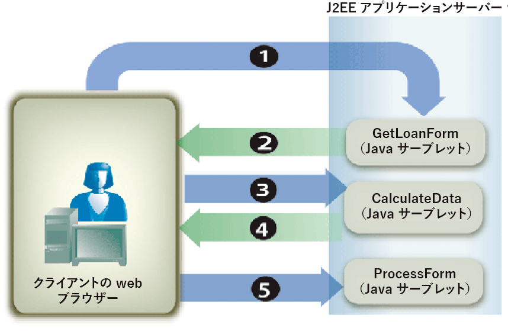

# フォームデータの計算{#calculating-form-data}

Formsサービスでは、ユーザーがフォームに入力した値を計算し、結果を表示できます。 フォームデータを計算するには、2つのタスクを実行する必要があります。 まず、フォームデータを計算するフォームデザインスクリプトを作成します。 フォームデザインは、3種類のスクリプトをサポートしています。 1つのスクリプトタイプはクライアントで実行され、別のスクリプトタイプはサーバーで実行され、3つ目のスクリプトタイプはサーバーとクライアントの両方で実行されます。 このトピックで説明されているスクリプトタイプは、サーバー上で実行されます。 サーバー側の計算は、HTML、PDF、およびForm Guide（非推奨）の変換に対してサポートされています。

フォームデザインのプロセスの一環として、演算とスクリプトを使用し、ユーザーの操作性を向上させることができます。 演算とスクリプトは、フォーム内のほとんどのフィールドとオブジェクトに追加できます。 ユーザーがインタラクティブフォームに入力したデータに対して演算操作を実行するには、フォームデザインのスクリプトを作成する必要があります。

ユーザーがフォームに値を入力し、「Calculate」ボタンをクリックして結果を表示します。 次のプロセスは、ユーザーにデータの計算を許可するアプリケーションの例を説明しています。

* ユーザーがStartLoan.htmlというHTMLページにアクセスし、Webアプリケーションの開始ページとして機能します。 このページは`GetLoanForm`という名前のJavaサーブレットを呼び出します。
* `GetLoanForm`サーブレットはローンフォームをレンダリングします。 このフォームには、スクリプト、インタラクティブフィールド、計算ボタン、送信ボタンが含まれています。
* ユーザーがフォームのフィールドに値を入力し、「計算」ボタンをクリックします。 フォームが`CalculateData` Javaサーブレットに送信され、スクリプトが実行されます。 フォームがユーザーに送り返され、計算結果がフォームに表示されます。
* ユーザは、満足のいく結果が表示されるまで値の入力と計算を続けます。 問題が解決したら、「送信」ボタンをクリックしてフォームを処理します。 フォームは、送信されたデータを取得する`ProcessForm`という別のJavaサーブレットに送信されます。 ([送信されたFormsの処理](/help/forms/developing/rendering-forms.md#handling-submitted-forms)を参照)。


次の図に、アプリケーションのロジックのフローを示します。



次の表に、この図の手順を示します。

<table>
 <thead>
  <tr>
   <th><p>ステップ</p></th>
   <th><p>説明</p></th>
  </tr>
 </thead>
 <tbody>
  <tr>
   <td><p>1</p></td>
   <td><p><code>GetLoanForm</code> JavaサーブレットがHTML開始ページから呼び出されます。 </p></td>
  </tr>
  <tr>
   <td><p>2</p></td>
   <td><p><code>GetLoanForm</code> Javaサーブレットは、FormsサービスクライアントAPIを使用して、ローンフォームをクライアントWebブラウザーにレンダリングします。 サーバー上で実行するように設定されたスクリプトが含まれるフォームのレンダリングと、スクリプトが含まれないフォームのレンダリングの違いは、スクリプトの実行に使用するターゲットの場所を指定する必要があるということです。 ターゲットーの場所を指定しない場合、サーバー上で実行するように設定されたスクリプトは実行されません。 例えば、この節で紹介するアプリケーションについて考えてみましょう。 <code>CalculateData</code> Javaサーブレットは、スクリプトが実行されるターゲットの場所です。</p></td>
  </tr>
  <tr>
   <td><p>3</p></td>
   <td><p>ユーザーがインタラクティブフィールドにデータを入力し、「計算」ボタンをクリックします。 フォームが<code>CalculateData</code> Javaサーブレットに送信され、スクリプトが実行されます。 </p></td>
  </tr>
  <tr>
   <td><p>4</p></td>
   <td><p>フォームがWebブラウザーにレンダリングされ、計算結果がフォームに表示されます。 </p></td>
  </tr>
  <tr>
   <td><p>5</p></td>
   <td><p>値が十分な場合は、「送信」ボタンをクリックします。 フォームは、<code>ProcessForm</code>という別のJavaサーブレットに送信されます。</p></td>
  </tr>
 </tbody>
</table>

通常、PDFコンテンツとして送信されるフォームには、クライアント上で実行されるスクリプトが含まれます。 ただし、サーバー側の計算を実行することもできます。 「送信」ボタンは、スクリプトの計算には使用できません。 この場合、Formsサービスがインタラクションを完了と見なすので、計算は実行されません。

フォームデザインのスクリプトの使用方法を説明するために、この節では、サーバー上で実行するように設定されたスクリプトを含むシンプルなインタラクティブフォームについて調べます。 次の図に示すフォームデザインには、ユーザーが最初の2つのフィールドに入力した値を追加し、その結果を3つ目のフィールドに表示するスクリプトが含まれています。


**A.** NumericField1  **B.** A NumericField2  **C.** A Field3という名前のフィールド

このフォームデザインにあるスクリプトの構文は次のとおりです。

```javascript
     NumericField3 = NumericField2 + NumericField1
```

このフォームデザインでは、「計算」ボタンはコマンドボタンで、スクリプトはこのボタンの`Click`イベントにあります。 ユーザーが最初の2つのフィールド（NumericField1とNumericField2）に値を入力し、「Calculate」ボタンをクリックすると、フォームがFormsサービスに送信され、そこでスクリプトが実行されます。 Formsサービスは、フォームをクライアントデバイスにレンダリングし返し、計算の結果をNumericField3フィールドに表示します。

>[!NOTE]
>
>フォームデザインスクリプトの作成について詳しくは、「[Formsデザイナ](https://www.adobe.com/go/learn_aemforms_designer_63)」を参照してください。

>[!NOTE]
>
>Formsサービスの詳細については、『[AEM Formsのサービスリファレンス](https://www.adobe.com/go/learn_aemforms_services_63)』を参照してください。

## 手順{#summary-of-steps}の概要

フォームデータを計算するには、次のタスクを実行します。

1. プロジェクトファイルを含めます。
1. FormsクライアントAPIオブジェクトを作成します。
1. 演算スクリプトを含むフォームを取得します。
1. フォームデータストリームをクライアントのWebブラウザーに書き戻します

**プロジェクトファイルを含める**

必要なファイルを開発プロジェクトに含めます。 Javaを使用してクライアントアプリケーションを作成する場合は、必要なJARファイルを含めます。 Webサービスを使用している場合は、プロキシファイルを必ず含めてください。

**FormsクライアントAPIオブジェクトの作成**

プログラムでFormsサービスのクライアントAPI操作を実行する前に、Formsサービスクライアントを作成する必要があります。 Java APIを使用している場合は、`FormsServiceClient`オブジェクトを作成します。 FormsのWebサービスAPIを使用している場合は、`FormsServiceService`オブジェクトを作成します。

**演算スクリプトを含むフォームの取得**

FormsサービスクライアントAPIを使用して、サーバー上で実行するように設定されたスクリプトが含まれるフォームを処理するアプリケーションロジックを作成します。 このプロセスは、送信されたフォームの処理と似ています。 ([送信されたFormsの処理](/help/forms/developing/handling-submitted-forms.md)を参照)。

送信されたフォームに関連付けられている処理状態が`1` `(Calculate)`であることを確認します。これは、Formsサービスがフォームデータに対して計算操作を実行しており、結果をユーザーに書き戻す必要があることを意味します。 この場合、サーバー上で実行するように設定されたスクリプトが自動的に実行されます。

**フォームデータストリームをクライアントのWebブラウザーに書き戻します**

送信されたフォームに関連付けられている処理状態が`1`であることを確認したら、結果をクライアントWebブラウザーに書き戻す必要があります。 フォームが表示されると、計算値が適切なフィールドに表示されます。

**関連項目**

[AEM Forms Java ライブラリファイルを含める](/help/forms/developing/invoking-aem-forms-using-java.md#including-aem-forms-java-library-files) 
[Java APICalculate form data using the Web service APISetting connection ](/help/forms/developing/calculating-form-data.md#calculate-form-data-using-the-java-api)
[propertiesForms Service API Quick ](/help/forms/developing/calculating-form-data.md#calculate-form-data-using-the-web-service-api)
[StartsインタラクティブPDFフォームのレンダリングインタラクティブPDFフォームのレンダリングFormsをレンダリングする](/help/forms/developing/invoking-aem-forms-using-java.md#setting-connection-properties)
[](/help/forms/developing/forms-service-api-quick-starts.md#forms-service-api-quick-starts)
[](/help/forms/developing/rendering-interactive-pdf-forms.md)
[Web アプリケーションの計算](/help/forms/developing/creating-web-applications-renders-forms.md)

## Java API {#calculate-form-data-using-the-java-api}を使用してフォームデータを計算する

FormsAPI(Java)を使用してフォームデータを計算するには：

1. プロジェクトファイルを含める

   Javaプロジェクトのクラスパスに、adobe-forms-client.jarなどのクライアントJARファイルを含めます。

1. FormsクライアントAPIオブジェクトの作成

   * 接続プロパティを含む `ServiceClientFactory` オブジェクトを作成します。
   * コンストラクターを使用し、`FormsServiceClient`オブジェクトを渡して、`ServiceClientFactory`オブジェクトを作成します。

1. 演算スクリプトを含むフォームの取得

   * 演算スクリプトを含むフォームデータを取得するには、コンストラクターを使用して`com.adobe.idp.Document`オブジェクトを作成し、コンストラクター内から`javax.servlet.http.HttpServletResponse`オブジェクトの`getInputStream`メソッドを呼び出します。
   * `FormsServiceClient`オブジェクトの`processFormSubmission`メソッドを呼び出し、次の値を渡します。

      * フォームデータを含む`com.adobe.idp.Document`オブジェクト。
      * 関連するすべてのHTTPヘッダーを含む環境変数を指定するstring値。 `CONTENT_TYPE`環境変数に1つ以上の値を指定して、処理するコンテンツタイプを指定する必要があります。 例えば、XMLデータとPDFデータを処理するには、このパラメーターに次の文字列値を指定します。`CONTENT_TYPE=application/xml&CONTENT_TYPE=application/pdf`
      * `HTTP_USER_AGENT`ヘッダー値を指定するstring値。例：`Mozilla/4.0 (compatible; MSIE 6.0; Windows NT 5.1; SV1; .NET CLR 1.1.4322)`
      * 実行時オプションを格納する`RenderOptionsSpec`オブジェクト。

      `processFormSubmission`メソッドは、フォーム送信の結果を含む`FormsResult`オブジェクトを返します。

   * `FormsResult`オブジェクトの`getAction`メソッドを呼び出して、送信されたフォームに関連付けられている処理状態が`1`であることを確認します。 このメソッドが値`1`を返す場合、計算が実行され、データをクライアントWebブラウザーに書き戻すことができます。


1. フォームデータストリームをクライアントのWebブラウザーに書き戻します

   * フォームデータストリームをクライアントのWebブラウザーに送信するために使用する`javax.servlet.ServletOutputStream`オブジェクトを作成します。
   * `FormsResult`オブジェクト&#39;s `getOutputContent`メソッドを呼び出して、`com.adobe.idp.Document`オブジェクトを作成します。
   * `com.adobe.idp.Document`オブジェクトの`getInputStream`メソッドを呼び出して、`java.io.InputStream`オブジェクトを作成します。
   * バイト配列を作成し、`InputStream`オブジェクトの`read`メソッドを呼び出して、バイト配列を引数として渡すことで、フォームデータストリームを設定します。
   * `javax.servlet.ServletOutputStream`オブジェクトの`write`メソッドを呼び出して、フォームデータストリームをクライアントのWebブラウザーに送信します。 バイト配列を`write`メソッドに渡します。

**関連項目**


[AEM Forms Java ライブラリファイルを含める](/help/forms/developing/invoking-aem-forms-using-java.md#including-aem-forms-java-library-files)
[接続プロパティの設定](/help/forms/developing/invoking-aem-forms-using-java.md#setting-connection-properties)

## WebサービスAPI {#calculate-form-data-using-the-web-service-api}を使用してフォームデータを計算する

FormsAPI（Webサービス）を使用してフォームデータを計算するには：

1. プロジェクトファイルを含める

   * FormsサービスのWSDLを使用するJavaプロキシクラスを作成します。
   * クラスパスにJavaプロキシクラスを含めます。

1. FormsクライアントAPIオブジェクトの作成

   `FormsService`オブジェクトを作成し、認証値を設定します。

1. 演算スクリプトを含むフォームの取得

   * Javaサーブレットに投稿されたフォームデータを取得するには、コンストラクタを使用して`BLOB`オブジェクトを作成します。
   * `javax.servlet.http.HttpServletResponse`オブジェクトの`getInputStream`メソッドを使用して`java.io.InputStream`オブジェクトを作成します。
   * コンストラクターを使用し、`java.io.InputStream`オブジェクトの長さを渡して、`java.io.ByteArrayOutputStream`オブジェクトを作成します。
   * `java.io.InputStream`オブジェクトの内容を`java.io.ByteArrayOutputStream`オブジェクトにコピーします。
   * `java.io.ByteArrayOutputStream`オブジェクトの`toByteArray`メソッドを呼び出して、バイト配列を作成します。
   * `BLOB`オブジェクトを入力するには、`setBinaryData`メソッドを呼び出し、バイト配列を引数として渡します。
   * コンストラクタを使用して `RenderOptionsSpec` オブジェクトを作成します。`RenderOptionsSpec`オブジェクトの`setLocale`メソッドを呼び出し、ロケール値を指定する文字列値を渡して、ロケール値を設定します。
   * `FormsServiceClient`オブジェクトの`processFormSubmission`メソッドを呼び出し、次の値を渡します。

      * フォームデータを含む`BLOB`オブジェクト。
      * 関連するすべてのHTTPヘッダーが含まれる環境変数を指定するstring値。 例えば、次の文字列値を指定できます。`HTTP_REFERER=referrer&HTTP_CONNECTION=keep-alive&CONTENT_TYPE=application/xml`
      * `HTTP_USER_AGENT`ヘッダー値を指定するstring値。例：`Mozilla/4.0 (compatible; MSIE 6.0; Windows NT 5.1; SV1; .NET CLR 1.1.4322)`
      * 実行時オプションを格納する`RenderOptionsSpec`オブジェクト。 その他の情報, .
      * メソッドによって入力される空の`BLOBHolder`オブジェクト。
      * メソッドによって入力される空の`javax.xml.rpc.holders.StringHolder`オブジェクト。
      * メソッドによって入力される空の`BLOBHolder`オブジェクト。
      * メソッドによって入力される空の`BLOBHolder`オブジェクト。
      * メソッドによって入力される空の`javax.xml.rpc.holders.ShortHolder`オブジェクト。
      * メソッドによって入力される空の`MyArrayOf_xsd_anyTypeHolder`オブジェクト。 このパラメーターは、フォームと共に送信された添付ファイルを保存するために使用されます。
      * 送信されたフォームと共にメソッドによって入力される、空の`FormsResultHolder`オブジェクト。

      `processFormSubmission`メソッドは、フォーム送信の結果を`FormsResultHolder`パラメーターに入力します。 `processFormSubmission`メソッドは、フォーム送信の結果を含む`FormsResult`オブジェクトを返します。

   * `FormsResult`オブジェクトの`getAction`メソッドを呼び出して、送信されたフォームに関連付けられている処理状態が`1`であることを確認します。 このメソッドが値`1`を返す場合、計算が実行され、データをクライアントWebブラウザーに書き戻すことができます。


1. フォームデータストリームをクライアントのWebブラウザーに書き戻します

   * フォームデータストリームをクライアントのWebブラウザーに送信するために使用する`javax.servlet.ServletOutputStream`オブジェクトを作成します。
   * `FormsResult`オブジェクトの`getOutputContent`メソッドを呼び出して、フォームデータを含む`BLOB`オブジェクトを作成します。
   * バイト配列を作成し、`BLOB`オブジェクトの`getBinaryData`メソッドを呼び出して値を設定します。 このタスクは、`FormsResult`オブジェクトの内容をバイト配列に割り当てます。
   * `javax.servlet.http.HttpServletResponse`オブジェクトの`write`メソッドを呼び出して、フォームデータストリームをクライアントのWebブラウザーに送信します。 バイト配列を`write`メソッドに渡します。

**Base64エンコーディングを使用したAEM Formsの呼び出しも参照し**
[てください。](/help/forms/developing/invoking-aem-forms-using-web.md#invoking-aem-forms-using-base64-encoding)
