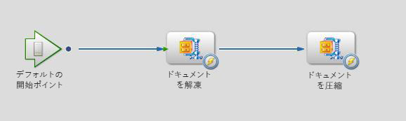

# AEM Forms on JEE のカスタム DSC を使用したファイルの圧縮と解凍 {#compressing-decompressing-files}

## 必要な知識 {#prerequisites}

AEM Forms on JEE のプロセス管理、基本的な Java プログラミング、カスタムコンポーネントの作成の経験。

**その他の必要な製品**

[Eclipse](https://www.eclipse.org/) や [Netbeans IDE](https://netbeans.apache.org/) などの Java エディター

## ユーザーレベル {#user-level}

中級者

AEM Forms on JEE を使用すると、開発者はカスタム DSC（ドキュメントサービスコンテナ）を作成して、強化された、すぐに使える機能を作成できます。このようなコンポーネントを作成すると、AEM Forms on JEE ランタイム環境にプラグインでき、意図する目的に活用できます。この記事では、カスタム ZIP サービスを作成する方法を説明します。このサービスを使用して、ファイルのリストを .zip ファイルに圧縮し、.zip をドキュメントのリストに解凍します。

## カスタム DSC コンポーネントの作成 {#create-custom-dsc-component}

2 つのサービス操作でドキュメントのリストの圧縮および解凍するためのカスタム DSC コンポーネントを作成します。このコンポーネントは、圧縮と解凍に java.util.zip パッケージを使用します。カスタムコンポーネントを作成するには、次の手順に従います。

1. adobe-livecycle-client.jar ファイルをライブラリに追加
1. 必要なアイコンを追加
1. パブリッククラスを作成
1. UnzipDocument と ZipDocuments という名前の 2 つのパブリックメソッドを作成
1. 圧縮と解凍のロジックを記述

コードは次の場所にあります。

```java
/*
 * Custom DSC : ZIP Utility
 * Purpose: This is a LiveCycle ES2 custom component used to Compress & Decompress List of Documents
 * Author: Nithiyanandam Dharmadass
 * Organization: Ministry of Finance, Kingdom of Bahrain
 * Last modified Date: 18/Apr/2011
 */
package nith.lces2.dsc;

import java.util.zip.ZipEntry;
import java.util.zip.ZipInputStream;
import com.adobe.idp.Document;
import java.io.ByteArrayOutputStream;
import java.io.InputStream;
import java.util.ArrayList;
import java.util.List;
import java.util.zip.ZipOutputStream;

public class ZIPService {

    static final int BUFFER = 2048; // 2MB buffer size

    public java.util.List UnzipDocument(com.adobe.idp.Document zipDocument) throws Exception {
        ZipInputStream zis = new ZipInputStream(zipDocument.getInputStream());

        ZipEntry zipFile;

        List resultList = new ArrayList();

        while ((zipFile = zis.getNextEntry()) != null) {

            ByteArrayOutputStream byteArrayOutStream = new ByteArrayOutputStream();

            int count;  // an int variable to hold the number of bytes read from input stream
            byte data[] = new byte[BUFFER];
            while ((count = zis.read(data, 0, BUFFER)) != -1) {
                byteArrayOutStream.write(data, 0, count);   // write to byte array
            }

            com.adobe.idp.Document unzippedDoc = new Document(byteArrayOutStream.toByteArray());  // create an idp document
            unzippedDoc.setAttribute("file", zipFile.getName());
            unzippedDoc.setAttribute("wsfilename", zipFile.getName());  // update the wsfilename attribute
            resultList.add(unzippedDoc);
        }
        return resultList;  // List of uncompressed documents
    }

    public com.adobe.idp.Document ZipDocuments(java.util.List listOfDocuments,java.lang.String zipFileName) throws Exception {

        if (listOfDocuments == null || listOfDocuments.size() == 0) {
            return null;
        }

        ByteArrayOutputStream byteArrayOutStream = new ByteArrayOutputStream();
        ZipOutputStream zos = new ZipOutputStream(byteArrayOutStream);  // ZIP Output Stream

        for (int i = 0; i < listOfDocuments.size(); i++) {
            Document doc = (Document) listOfDocuments.get(i);
            InputStream docInputStream = doc.getInputStream();
            ZipEntry zipEntry = new ZipEntry(doc.getAttribute("file").toString());
            zos.putNextEntry(zipEntry);
            int count;
            byte data[] = new byte[BUFFER];
            while ((count = docInputStream.read(data, 0, BUFFER)) != -1) {
                zos.write(data, 0, count);  // Read document content and add to zip entry
            }
            zos.closeEntry();
        }
        zos.flush();
        zos.close();

        Document zippedDoc = new Document(byteArrayOutStream.toByteArray());
        if(zipFileName==null || zipFileName.equals(""))
        {
            zipFileName = "CompressedList.zip";
        }
        zippedDoc.setAttribute("file", zipFileName);
        return zippedDoc;
    }
}
```

## Component.XML ファイルの作成 {#create-component-xml-file}

component.xml ファイルは、サービス操作とそのパラメーターを定義したパッケージのルートフォルダー内に作成する必要があります。

component.xml ファイルは、次のように表示されます。

```xml
<?xml version="1.0" encoding="UTF-8"?>
<component xmlns="http://adobe.com/idp/dsc/component/document">
<!-- Unique id identifying this component -->
   <component-id>ZipService</component-id>

<!-- Version -->
   <version>1.0</version>

<!-- Start of the Service definition -->
   <services>
<!-- Unique name for service descriptor.
           The value is used as the default name for
           deployed services -->
      <service name="ZipService">
<!-- service implementation class definition -->
        <implementation-class>nith.lces2.dsc.ZIPService</implementation-class>

<!-- description -->
        <description>Compress or Decompress list of documents</description>

<!--  You can provide your own icons for a distinct look   -->
          <small-icon>icons/Zip_icon16.png</small-icon>
          <large-icon>icons/Zip_icon32.png</large-icon>


<!-- automatically deploys the service and starts it after installation -->
         <auto-deploy service-id="ZipService" />

         <operations>
<!-- method name in the interface setSmtpHost-->
            <operation name="UnzipDocument">
<!-- input parameters to the "send" method -->
              <input-parameter name="zipDocument" title="Input ZIP Document" type="com.adobe.idp.Document">
                    <hint>A ZIP File to be decompressed</hint>
                </input-parameter>
                <output-parameter name="resultList" title="Decompressed list of documents" type="java.util.List">
                    <hint>Decompressed ZIP list</hint>
                </output-parameter>
            </operation>
            <operation name="ZipDocuments">
<!-- input parameters to the "send" method -->
              <input-parameter name="listOfDocuments" title="List of Documents" type="java.util.List">
                    <hint>A list of documents to be Compressed</hint>
                </input-parameter>
                <input-parameter name="zipFileName" title="Result File Name" type="java.lang.String">
                    <hint>The name of compressed file (optional)</hint>
                </input-parameter>

                <output-parameter name="zippedDoc" title="Compressed Zip file" type="com.adobe.idp.Document">
                    <hint>Compressed ZIP File</hint>
                </output-parameter>
            </operation>
             </operations>
      </service>
   </services>
</component>
```

## コンポーネントのパッケージ化とデプロイ {#packaging-deploying-component}

1. Java プロジェクトをコンパイルし、.JAR ファイルを作成します。
1. Workbench から、AEM Forms on JEE ランタイムにコンポーネント（.JAR ファイル）をデプロイします。
1. Workbench からサービスを開始します（下図を参照）。


## ワークフローでの ZIP サービスの使用 {#using-zip-service-in-workflows}

カスタムサービスの UnzipDocument 操作で、ドキュメント変数を入力として受け取り、ドキュメント変数のリストを出力として返すことができるようになりました。


同じように、カスタムコンポーネントの ZipDocuments 操作で、ドキュメントのリストを入力として受け取り、それらのドキュメントを zip ファイルとして圧縮し、圧縮されたドキュメントを返すことができます。


次のワークフローオーケストレーションでは、指定された ZIP ファイルを解凍し、別の ZIP ファイルに圧縮し直して、出力を返す方法を示します（下図を参照）。



## ビジネスユースケース {#business-use-cases}

この ZIP サービスは、次のユースケースで使用できます。

* 指定したフォルダー内のすべてのファイルを検索し、ファイルを圧縮ドキュメントとして返す。

* 解凍した後に読者が展開できる多数の PDF ドキュメントを含んだ ZIP ファイルを提供する。これには、AEM Forms on JEE の Reader Extensions モジュールが必要です。

* Generate PDF サービスを使用して解凍し、PDF ドキュメントに変換できる、異なるタイプのドキュメントを含んだ ZIP ファイルを提供する。

* ポリシーでドキュメントのリストを保護し、ZIP ファイルとして返します。

* ユーザーがプロセスインスタンスのすべての添付ファイルを単一の ZIP ファイルとしてダウンロードできるようにする。
