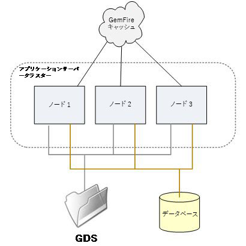
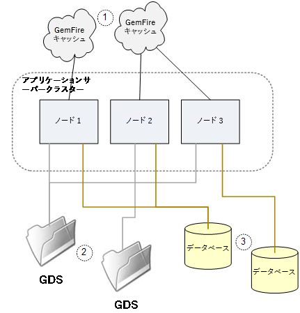

# JEE 上のAEM Formsサーバークラスターの設定とトラブルシューティング {#configuring-troubleshooting-aem-forms-jee-server-cluster}

## 必要な知識 {#prerequisites}

JEE 上のAEM Forms、JBoss、WebSphere、WebLogic アプリケーションサーバー、Red Hat Linux、SUSE Linux、Microsoft Windows、IBM AIX、Sun Solaris オペレーティングシステム、Oracle、IBM DB2、または SQL Server データベースサーバー、Web 環境に精通している。

## ユーザーレベル {#user-level}

詳細

JEE 上のAEM Formsクラスターは、JEE 上のAEM Formsがクラスターノードの障害に対して回復力を持ち、システム容量を単一のノードの能力を超えて拡大できるように設計されたトポロジーです。 クラスターは、複数のノードをデータを共有する単一の論理システムに結合し、トランザクションを複数のノードにまたがって実行できるようにします。 クラスターは、JEE 上のAEM Formsを拡張する最も一般的な方法です。ワークロードの組み合わせを処理する任意のサービスの組み合わせをサポートできます。 JEE 上のAEM Formsクラスターは、必ずしもすべてのタイプのデプロイメントに最適なものではなく、特に、非クラスター化サーバー負荷分散アーキテクチャは多くの場合に適しています。

このドキュメントの目的は、JEE 上のAEM Formsクラスターで発生する可能性のある、具体的な設定要件と潜在的な問題領域について説明することです。

## クラスターの内容 {#what-is-in-cluster}

JEE 上のAEM Formsクラスターノードは相互に通信し、情報を共有して、クラスター全体で単一の一貫した設定とアプリケーション状態を持つようにします。 クラスター内での情報の共有は、様々なコンテキストで同時に使用される、複数の異なる方法で行われます。 基本的な情報共有方法を次の図に示します。



### アプリケーションサーバークラスター {#application-server-cluster}

JEE 上のAEM Formsクラスターは、基になるアプリケーションサーバーのクラスタリング機能に依存します。 アプリケーションサーバークラスターは、クラスター構成全体を管理し、Java Naming and Directory Interface(JNDI) などの低レベルのクラスターサービスを提供し、ソフトウェアコンポーネントがクラスター内で互いを見つけ出すことを可能にします。 クラスターサービスの高度化と、アプリケーションサーバーが持つ基盤となる技術的依存関係は、アプリケーションサーバーに依存します。 WebSphere と WebLogic は、クラスターの高度な管理機能を備えていますが、JBoss は非常に基本的なアプローチを備えています。

### GemFire キャッシュ {#gemfire-cache}

GemFire キャッシュは、各クラスターノードに実装される分散キャッシュメカニズムです。 各ノードは互いを見つけ合い、各ノード間で一貫性を保つ単一の論理キャッシュを構築します。 互いに見つけ合うノードは、図 1 でクラウドとして表示される単一の概念的なキャッシュを維持するために結合されます。 GDS やデータベースとは異なり、キャッシュは純粋に概念的なエンティティです。 実際にキャッシュされたコンテンツは、各クラスターノードのメモリおよび `LC_TEMP` ディレクトリに保存されます。

### データベース {#database}

JEE 上のAEM Formsデータベース（JDBC データソース IDP_DS、EDC_DS などを介してアクセス）は、クラスターのすべてのノードで共有されます。 進行中のトランザクション、進行中のトランザクションに関連付けられたユーザーデータ、システム設定の設定方法に関するデータなど、JEE 上のAEM Formsの状態に関する永続的なデータのほとんどは、このデータベースに格納されます。

### グローバルドキュメントストレージ {#global-document-storage}

グローバルドキュメントストレージ (GDS) は、JEE 上のAEM Forms内の Document Manager（IDPDocument クラス）で使用される、ファイルシステムベースのストレージ領域です。 GDS には、クラスターのすべてのノードからアクセスできる必要がある、短時間のみ有効なファイルと長期間有効なファイルが格納されます。

### その他の項目 {#other-items}

これらの主な共有リソースに加えて、Quartz など、特定のクラスター動作を持つ他の項目もあります。 Quartz は、JEE 上のAEM Formsで使用されるスケジューラーサブシステムで、データベーステーブルを使用して、スケジュールされた内容と実行されているスケジュール済みアクティビティの知識を保持します。 Quartz は、シングルノードでのインストールとクラスターに対して異なる設定をおこなう必要があり、他の JEE 上のAEM Forms設定からキューを受け取ります。

## 設定に関する一般的な問題 {#common-configuration}

JEE 上のAEM Formsクラスターの保守やトラブルシューティングに関して最も不満がある点の 1 つは、クラスターが正常であることを確かに確認する場所が 1 つもないことです。 クラスタ内のすべてが正常であることを確認するには、何らかの調査と分析を行い、クラスタ構成の問題に応じて、クラスタ操作にいくつかのモードの障害が発生します。 次の図は、誤って設定されたクラスターを示しています。このクラスターでは、複数の共有リソースが正しく共有されていません。



興味深く重要な点は、クラスター内で JEE 上のAEM Formsを実行しない場合でも、クラスター化の仕組みや、クラスター内で検索および検証する内容について理解しておく必要がある点です。 これは、JEE 上のAEM Formsの一部で、クラスター内の動作に関する手掛かりを誤って受け取り、予期しないクラスター動作を引き受ける場合があるためです。

上の図の共有設定の問題は何ですか。 次の節では、問題について説明します。

### (1) GemFire クラスター設定 {#gemfire-cluster-configuration}

Gemfire キャッシュに問題が発生する場合があります。 次の 2 つの典型的なシナリオがあります。

* 互いに見つけ合うべきノードは、それを行うことができません。

* クラスター化されないノードは、互いに見つけ合い、キャッシュを共有すべきではない場合に、お互いを見つけ合います。

クラスター化するノードがある場合は、ネットワーク上で互いに見つけ合うことが重要です。 デフォルトでは、マルチキャスト UDP メッセージを使用してこれを行います。 各ノードは、その存在を広告したブロードキャストメッセージを送り出し、そのようなメッセージを受信したノードは、そのメッセージが見つけた他のノードと通信を開始する。 この種の自動検出方法は非常に一般的で、多くの種類のソフトウェアとアプライアンスがこれを行います。

自動検出に関するよくある問題の 1 つは、マルチキャストメッセージがネットワークポリシーの一部またはソフトウェアファイアウォール規則によってネットワークでフィルタリングされる場合、または単にノード間に存在するネットワークを経由できない場合です。 複雑なネットワークで UDP 自動検出を機能させるのは一般的に困難なので、実稼動環境のデプロイメントでは、次のような別の検出方法を使用するのが一般的です。TCP ロケーター。 TCP ロケーターの一般的な説明は、参照を参照してください。

**ロケーターと UDP のどちらを使用しているかを確認する方法を教えてください。**

次の JVM プロパティは、GemFire キャッシュが他のノードを検索する際に使用するメソッドを制御します。

マルチキャスト設定：

* `adobe.cache.multicast-port`:分散システムの他のメンバーとの通信に使用するマルチキャストポート。この値を 0 に設定すると、メンバーの検出と配布の両方に対してマルチキャストが無効になります。

* `gemfire.mcast-address` （オプション）:Gemfire で使用されるデフォルトの IP アドレスを上書きします。

TCP ロケーターの設定：

* `adobe.cache.cluster-locators`:実行中のロケーターとの通信にシステムメンバーが使用するすべてのロケーターの TCP ロケーターの IP アドレス/ホスト名と TCP ロケーターポート。

リストには、現在使用中のすべてのロケーターが含まれている必要があり、クラスターシステムのすべてのメンバーに対して一貫して設定する必要があります。

TCP ロケーターリストが空の場合、ロケーターは使用されず、代わりにマルチキャスト方式が使用されます。

**TCP ロケーターが実行中かどうかを確認するにはどうすればよいですか。**

まず、TCP ロケーターが使用中の場合は、すべてのクラスターノードの次の JVM プロパティに TCP ロケーターを一覧表示する必要があります。

`-Dadobe.cache.cluster-locators=aix01.adobe.com[22345],aix02.adobe.com[22345]`

JEE 上のAEM Formsクラスターノードでロケーターを実行する必要はありません。必要に応じて、クラスターとは別の他のシステムで実行できます。 複数のシステムでロケーターを実行できます。通常、ロケーターを 2 つの場所で実行することをお勧めします。ロケーターの 1 つの障害でクラスターの再起動に問題が生じる可能性はありません。 ロケーターを実行する各システムでは、これらのマシンで次のコマンドを使用して、ロケーターが実行されていることを確認できます。

`netstat -an | grep 22345`

期待される応答は次のようになります。

`tcp 0 0 *.22345 *.* LISTEN`

もう 1 つの検証コマンドは次のとおりです。

`ps -ef | grep gemfire`

期待される応答は次のようになります。

`livecycl 331984 1 0 10:14:51 pts/0 0:03 java -cp ./gemfire.jar: -Dgemfire.license-type=production -Dlocators=localhost[22345] com.gemstone.gemfire.distributed.Locator 22345`

**GemFire がクラスター内で考えるノードを確認する方法を教えてください。**

GemFire は、GemFire キャッシュで見つかり、どのクラスターメンバーが採用されたかを診断するために使用できるログ情報を生成します。 これを使用して、正しいクラスターメンバーがすべて見つかり、余分な、または誤ったクラスターノード検出がおこなわれていないことを確認できます。 GemFire のログファイルは、設定済みの JEE 上のAEM Forms一時ディレクトリにあります。

`.../LC_TEMP/adobeZZ__123456/Caching/Gemfire.log`

`adobeZZ_` の後の数値文字列はサーバーノードに固有であるため、一時ディレクトリの実際の内容を検索する必要があります。 `adobe` の後の 2 文字は、アプリケーションのサーバーの種類によって異なります。`wl`、`jb`、または `ws`。

次のサンプルログは、2 ノードのクラスタが自分自身を検出した場合の動作を示しています。

最初のノードで、AP-HP8:

```xml
[config 2011/08/05 09:28:09.143 EDT GemfireCacheAdapter <server.startup : 0> tid=0x65] This member, ap-hp8(4268):18763, is becoming group coordinator.
[info 2011/08/05 09:28:09.151 EDT GemfireCacheAdapter <server.startup : 0> tid=0x65] Entered into membership in group GF6.5.1.17 with ID ap-hp8(4268)<v0>:18763/56449.
[info 2011/08/05 09:28:09.152 EDT GemfireCacheAdapter <server.startup : 0> tid=0x65] Starting DistributionManager ap-hp8(4268)<v0>:18763/56449.
[info 2011/08/05 09:28:09.153 EDT GemfireCacheAdapter <server.startup : 0> tid=0x65] Initial (membershipManager) view =  [ap-hp8(4268)<v0>:18763/56449]
[info 2011/08/05 09:28:09.153 EDT GemfireCacheAdapter <server.startup : 0> tid=0x65] Admitting member <ap-hp8(4268)<v0>:18763/56449>. Now there are 1 non-admin member(s).
[info 2011/08/05 09:28:09.154 EDT GemfireCacheAdapter <server.startup : 0> tid=0x65] ap-hp8(4268)<v0>:18763/56449 is the elder and the only member.
[info 2011/08/05 09:28:09.163 EDT GemfireCacheAdapter <server.startup : 0> tid=0x65] Did not hear back from any other system. I am the first one.
[info 2011/08/05 09:28:09.164 EDT GemfireCacheAdapter <server.startup : 0> tid=0x65] DistributionManager ap-hp8(4268)<v0>:18763/56449 started on 239.192.81.1[33456]. There were 0 other DMs. others: []
[info 2011/08/05 09:28:20.841 EDT GemfireCacheAdapter <Pooled Message Processor 1> tid=0xc4] New administration member detected at ap-hp7(2821)<v1>:19498/59136.
```

もう 1 つのノードで、AP-HP7:

```xml
[info 2011/08/05 09:28:09.830 EDT GemfireCacheAdapter <server.startup : 0> tid=0x64] Attempting to join distributed system whose membership coordinator is ap-hp8(4268)<v0>:18763 using membership ID ap-hp7(2821):19498
[info 2011/08/05 09:28:10.058 EDT GemfireCacheAdapter <server.startup : 0> tid=0x64] Entered into membership in group GF6.5.1.17 with ID ap-hp7(2821)<v1>:19498/59136.
[info 2011/08/05 09:28:10.059 EDT GemfireCacheAdapter <server.startup : 0> tid=0x64] Starting DistributionManager ap-hp7(2821)<v1>:19498/59136.
[info 2011/08/05 09:28:10.060 EDT GemfireCacheAdapter <server.startup : 0> tid=0x64] Initial (membershipManager) view =  [ap-hp8(4268)<v0>:18763/56449, ap-hp7(2821)<v1>:19498/59136]
[info 2011/08/05 09:28:10.060 EDT GemfireCacheAdapter <server.startup : 0> tid=0x64] Admitting member <ap-hp8(4268)<v0>:18763/56449>. Now there are 1 non-admin member(s).
[info 2011/08/05 09:28:10.060 EDT GemfireCacheAdapter <server.startup : 0> tid=0x64] Admitting member <ap-hp7(2821)<v1>:19498/59136>. Now there are 2 non-admin member(s).
[info 2011/08/05 09:28:10.128 EDT GemfireCacheAdapter <server.startup : 0> tid=0x64] DistributionManager ap-hp7(2821)<v1>:19498/59136 started on 239.192.81.1[33456]. There were 1 other DMs. others: [ap-hp8(4268)<v0>:18763/56449]
```

**GemFire がノードを見つけるのでは？**

企業ネットワークを共有する個々のクラスタは、TCP ロケータが使用されている場合は別々の TCP ロケータのセットを使用し、マルチキャスト UDP 設定が使用されている場合は別々の UDP ポート番号を使用する必要があります。 UDP 自動検出は JEE 上のAEM Formsのデフォルト設定で、同じデフォルトポート33456が複数のクラスタで使用されている場合があるので、通信を試みないクラスタが予期せず使用される可能性があります。例えば、実稼動と QA のクラスタは分離したままで、UDP マルチキャストで接続します。

GemFire が適切にクラスタリングされていないネットワーク内の重複ポートを検出できる場合、最も一般的な状況は、クラスターのブートストラップ中です。 明確な原因がなくても、ブートストラッププロセスが失敗することが分かるかもしれません。 通常、次のようなエラーが発生します。

```xml
Caused by: com.ibm.ejs.container.UnknownLocalException: nested exception is: com.adobe.pof.schema.ObjectTypeNotFoundException: Object Type: dsc.sc_service_configuration not found.
                at com.adobe.pof.schema.POFDefaultDomain.getObjectType(POFDefaultDomain.java:93)
                at com.adobe.idp.dsc.initializer.DSCInitializerBean.serviceConfigAuditAttributeExists(DSCInitializerBean.java:225)
                at com.adobe.idp.dsc.initializer.DSCInitializerBean.installSchema(DSCInitializerBean.java:186)
                at com.adobe.idp.dsc.initializer.DSCInitializerBean.bootstrap(DSCInitializerBean.java:94)
                at com.adobe.idp.dsc.initializer.EJSLocalStatelessDSCInitializerBeanLocalEJB_7bb34e85.bootstrap(Unknown Source)
                at com.adobe.livecycle.bootstrap.bootstrappers.DSCBootstrapper.bootstrap(DSCBootstrapper.java:68)
```

この場合、ブートストラッパーは GemFire と連携して必要なテーブルにアクセスし、JDBC を通じてアクセスするテーブルと、基になるデータベースが異なる別のクラスターから返される GemFire のキャッシュされたテーブル情報の間に矛盾があります。

ブートストラップ中に重複ポートが明らかになることが多いが、この状況は後で現れ、他のクラスタのブートストラップが発生した後にクラスタが再起動された場合、またはネットワーク構成が変更され、以前に分離されたクラスタが相互に認識される。

これらの状況を診断するには、GemFire ログを確認し、予想されるノードのみが見つかるかどうかを慎重に検討することをお勧めします。 問題を修正するには、

`adobe.cache.multicast-port`

プロパティを 1 つまたは両方のクラスターで異なる値に設定します。

### 2) GDS の共有 {#gds-sharing}

GDS の共有は、JEE 上のAEM Formsの外部（O/S レベル）で設定されます。このレベルで、同じ共有ディレクトリ構造をすべてのクラスターノードで使用できるように設定する必要があります。 Windows タイプのシステムでは、通常、ファイル共有を 1 つのノードから別のノードに、または NAS アプライアンスなどのリモート・ファイル・システムからすべてのノードに設定することで、この処理を実行します。 UNIX システムでは、GDS の共有は通常、NFS ファイル共有を介して行われます。この場合も、1 つのノードから別のノード、または NAS アプライアンスから行われます。

クラスターの障害モードとして、このリモートファイル共有が利用できなくなった場合や、微妙な問題が発生した場合が考えられます。 ネットワークの問題、セキュリティ設定、または構成が正しくないため、リモートマウントが失敗する場合があります。 システムを再起動すると、何日も前から何週間も前もって行われた構成変更が有効になり、これによって予期しない事態が生じる可能性があります。

**NFS 共有がマウントに失敗した場合はどうなりますか。**

UNIX では、NFS マウントがディレクトリ構造にマッピングされる方法により、マウントに失敗した場合でも、明らかに使用可能な GDS ディレクトリを使用できます。 次の点を考慮してください。

* NAS サーバ：NFS 共有フォルダー/u01/iapply/livecycle_gds
* ノード 1:次の場所にある共有フォルダー（DB サーバー上でホストされる）へのマウントポイント：/u01/iapply/livecycle_gds
* ノード 2:次の場所にある共有フォルダー（DB サーバー上でホストされる）へのマウントポイント：/u01/iapply/livecycle_gds

* LCES は GDS へのパスを指定します。/u01/iapply/livecycle_gds

ノード 1 でのマウントが失敗した場合でも、ディレクトリ構造には空のマウントポイントへのパス/u01/iapply/livecycle_gds が含まれ、ノードは正しく実行されているように見えます。 ただし、GDS コンテンツは実際には他のノードと共有されていないので、クラスターは正しく動作しません。 これは可能であり、起こる可能性があり、結果として、クラスターは神秘的な方法で失敗します。

ベストプラクティスは、Linux マウントポイントを GDS のルートとして使用せず、その中の一部のディレクトリを GDS のルートとして使用するように配置することです。

* NFS サーバーがある場合は、次のディレクトリが存在する可能性があります。/some/storage/lc_cluster_dev/LC_GDS
* また、クラスターノードにマウントポイントがあります。/u01/iapply/shared
* nfs サーバのマウント：/some/storage/lc_cluster_dev/u01/iapply/shared
* GDS を/u01/iapply/shared/LC_GDS に設定します。

何らかの理由でマウントが成功しなかった場合は、ベアマウントポイントに LC_GDS ディレクトリが含まれておらず、GDS がまったく見つからないので、クラスタは予測可能に失敗します。

**すべてのノードが同じ GDS を参照し、権限を持っていることを確認するには、どうすればよいですか？**

GDS のアクセスと共有の検証は、SSH または UNIX ノードへの Telnet 経由、またはリモートデスクトップ経由で Windows システムに対してインタラクティブユーザーとして各ノードにアクセスすることで最も効果的です。 各ノードで設定済みの GDS ディレクトリまたはファイルシステムに移動し、他のすべてのノードに表示されるすべてのノードからテストファイルを作成できるはずです。

JEE 上のAEM Formsが動作するユーザー ID に注意してください。 Windows の自動インストールでは、ローカル管理者として機能します。 UNIX の場合は、起動スクリプトまたはアプリケーションサーバー設定で設定された特定のサービスユーザーの場合があります。 このユーザー ID は、すべてのノードで GDS ファイルの作成と操作を均等におこなうことが重要です。

UNIX システムでは、NFS 構成は、多くの場合、ルートの所有権や、ファイルやオブジェクトへのルートアクセス権を不信にするようにデフォルトで設定されます。 アプリケーション・サーバをルート・ユーザーとして実行する場合は、NFS サーバ、ファイルをマウントするノード、またはその両方で、あるノードが作成し、別のノードがアクセスするファイルの双務アクセスと制御を可能にするオプションを指定する必要があります。

### (3) データベース共有 {#database-sharing}

クラスターが正しく動作するには、同じデータベースをすべてのクラスターメンバーで共有する必要があります。 これを誤る範囲は、大まかに次のとおりです。

* 別々のクラスターノード上で誤って IDP_DS、EDC_DS、AdobeDefaultSA_DS またはその他の必要なデータソースを設定し、ノードが別々のデータベースを指すように誤って設定してしまった。
* 誤って複数の個別のノードを設定して、データベースを共有すべきでない場合にデータベースを共有する。

アプリケーションサーバーによっては、JDBC 接続がクラスタースコープで定義され、異なるノードで異なる定義が可能にならない場合があります。 ただし、IDP_DS などのデータソースがノード 1 上の 1 つのデータベースを指し、ノード 2 上の他のデータベースを指すように、Jboss では設定が完全に可能です。

逆の問題は、実際にはより一般的です。つまり、JEE 上の複数のスタンドアロン（またはクラスター）のAEM Formsノードが、意図していない場合に、誤って同じスキーマを指す状況です。 この問題は、DBA が JEE 上の 1 つのAEM Formsデータベースの接続情報を DEV と QA の両方のセットアップチームに知らずに提供し、DEV と QA のインスタンスに別々のデータベースが必要なことを認識しない場合に最も多く発生します。

## アプリケーションサーバークラスター {#application-server-cluster-1}

JEE 上のAEM Formsクラスターを正常に実行するには、アプリケーションサーバーをクラスターとして適切に設定および動作させる必要があります。 WebSphere および WebLogic では、これは明確に文書化されたプロセスです。 Jboss では、クラスターの設定はもう少し実践的で、ノードがクラスターとして機能し、実際に互いを見つけて通信するように設定されていることを確認するのが課題です。 JBoss は UDP マルチキャストを使用してピアノードを検索し、調整する JGroups に内部的に依存しています。GemFire で取り上げられる問題の一部は、必要な場合にノードが互いに見つからない場合や、必要でない場合に互いに見つかる場合などです。

参照:

* [JBoss クラスターを介した高可用性エンタープライズサービス](https://docs.jboss.org/jbossas/jboss4guide/r4/html/cluster.chapt.html)

* [OracleWebLogic Server — クラスターの使用](https://docs.oracle.com/cd/E12840_01/wls/docs103/pdf/cluster.pdf)

### JBoss が正しくクラスタリングされていることを確認する方法を教えてください。 {#check-jboss-clustering}

JBoss の起動時に、クラスターメンバーが検出されると、クラスターに参加するノードに関する INFO レベルのメッセージがログファイル/コンソールに記録されます。

クラスタ名が実行時に —g コマンドラインオプションを使用して指定された場合は、次のようなメッセージが表示されます。

```xml
GMS: address is 10.36.34.44:55200 (cluster=QE_cluster)
GMS: address is 10.36.34.44:55200 (cluster=QE_cluster-HAPartitionCache)
and ones like:

[org.jboss.ha.framework.interfaces.HAPartition.QE_cluster] (JBoss System Threads(1)-3) Number of cluster members: 1
2011-07-14 11:34:03,072 INFO  [org.jboss.ha.framework.interfaces.HAPartition.QE_cluster] (JBoss System Threads(1)-3) Other members: 0
2011-07-14 11:34:03,138 INFO  [org.jboss.cache.RPCManagerImpl] (main) Received new cluster view: [10.36.34.44:55200|0] [10.36.34.44:55200]
2011-07-14 11:34:03,139 INFO  [org.jboss.cache.RPCManagerImpl] (main) Cache local address is 10.36.34.44:55200
```

### Quartz スケジューラ {#quartz-scheduler}

ほとんどの場合、JEE 上のAEM Formsでは、クラスター内で内部 Quartz スケジューラーを使用して、JEE 上のAEM Formsのグローバルクラスター設定に自動的に従います。 ただし、Quartz の自動クラスター設定が失敗するバグ#2794033はあります。これは、マルチキャスト自動検出の代わりに TCP ロケーターを Gemfire に使用している場合に発生します。 この場合、Quartz は非クラスターモードで正しく実行されません。 これにより、Quartz テーブルでデッドロックとデータの破損が発生します。 Quartz はあまり使用されていないが、まだ存在するので、バージョン 8.2.x は 9.0 よりも悪い副作用があります。

この問題に関する修正点は次のとおりです。8.2.1.2 QF2.143 および 9.0.0.2 QF2.44。

また、次の両方のプロパティを設定するための回避策もあります。

* `-Dadobe.cache.cluster.locators=xxx`

* `-Dadobe.cache.cluster-locators=xxx`

一方の設定では「cluster」と「locators」の間のピリオドを使用し、もう一方の設定ではハイフンを使用します。 これは、実装が容易で、ソフトウェアパッチを適用するよりもリスクが低くなりますが、名前が間違っている、わかりにくい追加の設定を人為的に作成する必要があります。

### Quartz が単一のノードまたはクラスターとして実行されていることを確認する方法を教えてください。 {#check-quartz}

Quartz の設定内容を確認するには、起動時に JEE 上のAEM Forms Scheduler サービスによって生成されたメッセージを確認する必要があります。 これらのメッセージは INFO の重大度で生成され、メッセージを取得するには、ログレベルを調整し、再起動する必要がある場合があります。 JEE 上のAEM Formsの起動シーケンス内で、Quartz の初期化は次の行で開始されます。

INFO `[com.adobe.idp.scheduler.SchedulerServiceImpl]` IDPSchedulerService onLoad
一部のアプリケーションサーバーも Quartz を使用し、Quartz のインスタンスが JEE 上のAEM Formsスケジューラーサービスで使用されているインスタンスと混同しないように、ログの最初の行を見つけることが重要です。 これは、スケジューラサービスが起動中であることを示し、それに続く行は、スケジューラサービスが適切にクラスタモードで起動しているかどうかを示します。 このシーケンスには複数のメッセージが表示され、Quartz の設定方法を示す最後の「開始」メッセージです。

Quartz インスタンスの名前は次のとおりです。`IDPSchedulerService_$_ap-hp8.ottperflab.adobe.com1312883903975`. スケジューラーの Quartz インスタンスの名前は、常に文字列 `IDPSchedulerService_$_` で始まります。 Quartz がクラスターモードで実行されているかどうかを示す文字列が、この末尾に追加されます。 ノードのホスト名と長い数字の文字列（ここでは `ap-hp8.ottperflab.adobe.com1312883903975`）から生成される長い一意の識別子は、クラスター内で動作していることを示します。 単一のノードとして動作する場合、識別子は 2 桁の数値 (「20」) になります。

INFO `[org.quartz.core.QuartzScheduler]` スケジューラ `IDPSchedulerService_$_20` が開始されました。
各ノードのスケジューラーは、クラスターモードで動作するかどうかを独立して決定するので、このチェックは、すべてのクラスターノードで個別に行う必要があります。

### Quartz が間違ったモードで実行されている場合、どのような問題が発生しますか？ {#quartz-running-in-wrong-mode}

Quartz が単一のノードとして実行するように設定されていて、実際にクラスターで実行され、Quartz データベーステーブルを他のノードと共有している場合、JEE 上のAEM Formsスケジューラーサービスの動作が信頼できず、通常はデータベースのデッドロックが伴います。 これは、この状況で見られるかもしれない典型的なスタックトレースです。

```xml
[1/20/11 10:40:57:584 EST] 00000035 ErrorLogger   E org.quartz.core.ErrorLogger schedulerError An error occured while marking executed job complete. job= 'Asynchronous.TaskFormDataSaved:12955380518320.5650479324757354'
 org.quartz.JobPersistenceException: Couldn't remove trigger: ORA-00060: deadlock detected while waiting for resource  [See nested exception: java.sql.SQLException: ORA-00060: deadlock detected while waiting for resource ]
        at org.quartz.impl.jdbcjobstore.JobStoreSupport.removeTrigger(JobStoreSupport.java:1405)
        at org.quartz.impl.jdbcjobstore.JobStoreSupport.triggeredJobComplete(JobStoreSupport.java:2888)
        at org.quartz.impl.jdbcjobstore.JobStoreSupport$38.execute(JobStoreSupport.java:2872)
        at org.quartz.impl.jdbcjobstore.JobStoreSupport$40.execute(JobStoreSupport.java:3628)
        at org.quartz.impl.jdbcjobstore.JobStoreSupport.executeInNonManagedTXLock(JobStoreSupport.java:3662)
        at org.quartz.impl.jdbcjobstore.JobStoreSupport.executeInNonManagedTXLock(JobStoreSupport.java:3624)
        at org.quartz.impl.jdbcjobstore.JobStoreSupport.triggeredJobComplete(JobStoreSupport.java:2868)
        at org.quartz.core.QuartzScheduler.notifyJobStoreJobComplete(QuartzScheduler.java:1698)
        at org.quartz.core.JobRunShell.run(JobRunShell.java:273)
        at org.quartz.simpl.SimpleThreadPool$WorkerThread.run(SimpleThreadPool.java:529)
Caused by: java.sql.SQLException: ORA-00060: deadlock detected while waiting for resource
```

### クラスター内のシステムクロックを同期する方法を教えてください。 {#ynchronize-system-clocks-cluster}

クラスタがスムーズに動作するには、すべてのクラスタノードのクロックを密接に同期させる必要があります。 これは手作業では適切に行えず、非常に定期的に実行される何らかの形式の時間同期サービスで行う必要があります。 すべてのノードのクロックは、互いに 1 秒以内である必要があります。 ベストプラクティスでは、クラスターノードだけでなく、ロードバランサー、データベースサーバー、GDS NAS サーバー、その他のコンポーネントもすべて同期する必要があります。

Windows の時刻同期は、ドメインコントローラーに対しておこなわれる傾向があります。 UNIX システムは、NTP を使用して別のタイム・ソースに同期する場合があります。 すべてのシステム (JEE 上のAEM Formsノードと他のシステムコンポーネントの両方 ) を、可能であれば同じソースに同期させることが最適です。

ほとんどの一時的なテスト環境でも、ノードにクロックを手動で設定するだけでは、完全に不十分です。 手動でクロックを設定しても、同期の精度は十分に高くなりません。また、1 日の間でも、2 つのノードのクロックは必然的に相対的にドリフトします。 クラスタの動作を確実に行うには、アクティブタイム同期メカニズムが不可欠です。

### ロードバランサー {#load-balancer}

ユーザーインタラクティブサービスを提供するクラスターの一般的な要件は、HTTP 要求をクラスター全体に分散させる HTTP ロードバランサーです。 JEE 上のAEM Formsクラスターでロードバランサーを正常に使用するには、次の設定が必要です。

* セッション定着

* URL 書き換えルール

* ノードヘルスチェック

### ロードバランサーのヘルスチェック機能を使用するには、どうすればよいですか？ {#load-balancer-health-check}

ロードバランサの中には、負荷分散を行うノードに対して定期的なヘルスチェックを実行するように設定できるものもあります。 通常、ロードバランサーがアクセスを試みるアプリケーション関数への URL です。 負荷が成功した場合、ノードは正常であると見なされ、ロードバランシングセットに保持されます。 URL の読み込みに失敗した場合、ノードが誤っていると見なされ、セットから削除されます。 一般的に、ヘルスチェック URL は、JEE 上のAEM Forms AdminUI ログインページに接続するだけです。 これは、クラスターメンバーに対する理想的なヘルスチェックではないので、短時間のみ有効なプロセスを実装し、REST API URL をヘルスチェック機能として使用する方が良いでしょう。

## 一時ファイルパスと類似のクラスター設定 {#temporary-file-path-cluster-settings}

JEE 上のAEM Forms内の特定のファイルパス設定は、クラスター全体で確立され、各ノードで同じ有効な設定を持ちますが、ローカルファイルを参照するために各ノードで個別に解釈されます。 考慮すべき重要な点は、フォントパス設定と一時ディレクトリ設定です。 AdminUI コア設定画面に移動します（ホーム/設定/コアシステム/コア設定）。

次の設定を確認する必要があります。

1. 一時ディレクトリの場所
1. Adobe Server フォントディレクトリの場所
1. カスタマーフォントディレクトリの場所
1. システムフォントディレクトリの場所
1. Data Services 設定ファイルの場所

クラスターには、これらの構成設定ごとに 1 つのパス設定のみがあります。 例えば、Temp ディレクトリの場所は `/home/project/QA2/LC_TEMP` です。 クラスターでは、各ノードが実際にこの特定のパスにアクセスできる必要があります。 あるノードに予期された一時ファイルパスがあり、別のノードに必要な一時ファイルパスがない場合、そのノードが正しく機能しません。

これらのファイルとパスは、ノード間で共有したり、別々に配置したり、リモート・ファイル・システム上で共有したりできますが、通常は、ローカル・ノードのディスク・ストレージ上のローカル・コピーにすることをお勧めします。

特に、一時ディレクトリのパスは、ノード間で共有しないでください。 GDS を検証するために説明した手順と同様の手順を使用して、一時ディレクトリが共有されていないことを確認します。各ノードに移動し、パス設定で示されたパスに一時ファイルを作成し、他のノードがファイルを共有しないことを確認します。 一時ディレクトリパスは、可能な限り各ノードのローカルディスクストレージを参照し、チェックする必要があります。

各パス設定に対して、JEE 上のAEM Formsが実行される有効な使用 ID を使用して、パスが実際に存在し、クラスター内の各ノードからアクセスできることを確認します。 フォントディレクトリの内容は読み取り可能である必要があります。 一時ディレクトリは、読み取り、書き込み、制御を許可する必要があります。
