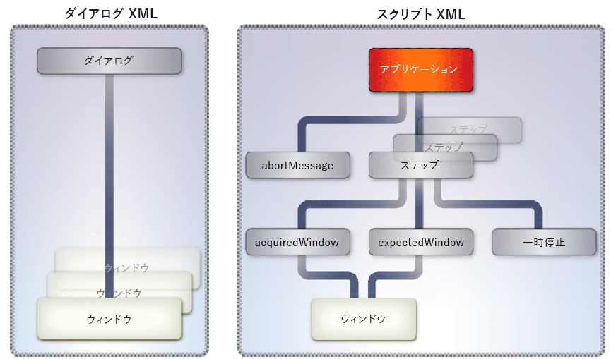

# ファイル形式とPDFの変換 {#converting-between-file-formatsand-pdf}

**Generate PDFサービスについて**

Generate PDF サービスは、ネイティブファイル形式を PDF に変換します。また、PDF を他のファイル形式に変換し、PDF ドキュメントのサイズを最適化します。

Generate PDF サービスは、以下のファイル形式を PDF に変換する際にネイティブアプリケーションを使用します。特に説明がない限り、これらのアプリケーションはドイツ語版、フランス語版、英語版および日本語版のみサポートされています。*Windowsのみ* 、Windows Server® 2003およびWindows Server 2008のみがサポートされていることを示します。

* Microsoft Office 2003および2007:DOC、DOCX、RTF、TXT、XLS、XLSX、PPT、PPTX、VSD、MPP、MPPX、XPS、PUBを変換（Windowsのみ）

>[!NOTE]
>
>Microsoft XPS形式をPDFに変換するには、Acrobat® 9.2以降が必要です。

* DWF、DWG、DXWを変換するAutodesk AutoCAD 2005、2006、2007、2008、2009（英語のみ）
* Corel WordPerfect 12およびX4によるWPD、QPW、SHWの変換（英語のみ）
* OpenOffice 2.0、2.4、3.0.1および3.1を使用して、ODT、ODS、ODP、ODG、ODF、SXW、SXI、SXD、DOC、DOCX、RTF、TXT、XLS、XLSX、PPT、pptx、VSD、MPP、MPPX、PUB

>[!NOTE]
>
>Generate PDFサービスは、64ビット版のOpenOfficeをサポートしていません。

* Adobe Photoshop® CS2からPSDへの変換（Windowsのみ）

>[!NOTE]
>
>PhotoshopCS3とCS4は、Windows Server 2003またはWindows Server 2008をサポートしていないため、サポートされていません。

* Adobe FrameMaker® 7.2および8でFMを変換（Windowsのみ）
* PMD、PM6、P65、PM の変換：Adobe PageMaker® 7.0（Windows のみ）
* サードパーティのアプリケーションによってサポートされているネイティブ形式（アプリケーションに固有のセットアップファイルの開発が必要）（Windows のみ）

Generate PDF サービスでは、次の標準ベースのファイル形式を PDF に変換します。

* ビデオファイル形式：SWF、FLV（Windows のみ）
* 画像ファイル形式：JPEG、JPG、JP2、J2Kí、JPC、J2C、GIF、BMP、TIFF、TIF、PNG、JPF
* HTML （Windows、Sun™ Solaris™、およびLinux®）

Generate PDF サービスでは、PDF を次のファイル形式に変換します（Windows のみ）：

* EPS（Encapsulated PostScript）
* HTML3.2
* CSS 1.0 を使用した HTML 4.01
* DOC（Microsoft Word format）
* RTF
* テキスト（アクセス可能およびプレーンの両方）
* XML
* PDF/A-1a（DeviceRGBカラースペースのみを使用）
* PDF/A-1b（DeviceRGBカラースペースのみを使用）

Generate PDF サービスを使用するには、以下の管理タスクを実行する必要があります。

* 必要なネイティブアプリケーションを、AEM Forms をホストするコンピューター上にインストールする
* AEM Formsをホストするコンピューターに、Adobe AcrobatプロフェッショナルまたはAcrobat Proエクステンデッド9.2をインストールする
* インストール後のセットアップタスクを実行する

これらのタスクは、『AEM formsの自動インストールおよびデプロイ（JBoss版）』に説明されています。

Generate PDFサービスを使用して、次のタスクを実行できます。

* ネイティブファイル形式からPDFに変換します。
* HTMLドキュメントをPDFドキュメントに変換します。
* PDFドキュメントをファイル形式に変換します。

>[!NOTE]
>
>For more information about the Generate PDF service, see [Services Reference for AEM Forms](https://www.adobe.com/go/learn_aemforms_services_63).

## WordドキュメントからPDFドキュメントへの変換 {#converting-word-documents-to-pdf-documents}

この節では、Generate PDF APIを使用して、Microsoft WordドキュメントをPDFドキュメントにプログラム的に変換する方法について説明します。

>[!NOTE]
>
>その他のファイル形式について詳しくは、「追加のネイティブファイル形式に対するサポートの [追加](converting-file-formats-pdf.md#adding-support-for-additional-native-file-formats)」を参照してください。

>[!NOTE]
>
>For more information about the Generate PDF service, see [Services Reference for AEM Forms](https://www.adobe.com/go/learn_aemforms_services_63).

### 手順の概要 {#summary-of-steps}

Microsoft WordドキュメントをPDFドキュメントに変換するには、次のタスクを実行します。

1. プロジェクトファイルを含めます。
1. Generate PDFクライアントを作成します。
1. PDFドキュメントに変換するファイルを取得します。
1. ファイルをPDFドキュメントに変換します。
1. 結果を取得します。

**プロジェクトファイルを含める**

必要なファイルを開発プロジェクトに含めます。 Javaを使用してクライアントアプリケーションを作成する場合は、必要なJARファイルを含めます。 Webサービスを使用している場合は、プロキシファイルを必ず含めてください。

**Generate PDFクライアントの作成**

プログラムを使用してGenerate PDF操作を実行する前に、Generate PDFサービスクライアントを作成します。 Java APIを使用している場合は、 `GeneratePdfServiceClient` オブジェクトを作成します。 WebサービスAPIを使用している場合は、 `GeneratePDFServiceService` オブジェクトを作成します。

**PDFドキュメントに変換するファイルを取得します**

Microsoft Wordドキュメントを取得してPDFドキュメントに変換します。

**ファイルをPDFドキュメントに変換**

Generate PDFサービスクライアントを作成した後、この `createPDF2` メソッドを呼び出すことができます。 このメソッドには、変換するドキュメント（ファイル拡張子など）に関する情報が必要です。

**結果を取得する**

ファイルがPDFドキュメントに変換された後、結果を取得できます。 例えば、WordファイルをPDFドキュメントに変換した後、PDFドキュメントを取得して保存できます。

**関連トピック**

[Java APIを使用したWordドキュメントのPDFドキュメントへの変換](converting-file-formats-pdf.md#convert-word-documents-to-pdf-documents-using-the-java-api)

[WebサービスAPIを使用してWordドキュメントをPDFドキュメントに変換する](converting-file-formats-pdf.md#convert-word-documents-to-pdf-documents-using-the-web-service-api)

[AEM Forms Java ライブラリファイルを含める](/help/forms/developing/invoking-aem-forms-using-java.md#including-aem-forms-java-library-files)

[接続プロパティの設定](/help/forms/developing/invoking-aem-forms-using-java.md#setting-connection-properties)

[Generate PDF Service APIのクイック開始](/help/forms/developing/generate-pdf-service-java-api.md#generate-pdf-service-java-api-quick-start-soap)

### Java APIを使用したWordドキュメントのPDFドキュメントへの変換 {#convert-word-documents-to-pdf-documents-using-the-java-api}

Generate PDF API(Java)を使用してMicrosoft WordドキュメントをPDFドキュメントに変換します。

1. プロジェクトファイルを含めます。

   Javaプロジェクトのクラスパスに、adobe-generatepdf-client.jarなどのクライアントJARファイルを含めます。

1. Generate PDFクライアントを作成します。

   * 接続プロパティを含む `ServiceClientFactory` オブジェクトを作成します。
   * コンストラクタを使用して `GeneratePdfServiceClient` オブジェクトを渡すことによって、`ServiceClientFactory` オブジェクトを作成します。

1. PDFドキュメントに変換するファイルを取得します。

   * 変換するWordファイルを表す `java.io.FileInputStream` オブジェクトを、コンストラクタを使用して作成します。 ファイルの場所を指定するstring値を渡します。
   * コンストラクタを使用して `com.adobe.idp.Document` オブジェクトを渡すことによって、`java.io.FileInputStream` オブジェクトを作成します。

1. ファイルをPDFドキュメントに変換します。

   オブジェクトの `GeneratePdfServiceClient` メソッドを呼び出し、次の値を渡して、ファイルをPDFドキュメント `createPDF2` に変換します。

   * A `com.adobe.idp.Document` object that represents the file to convert.
   * ファイル拡張子を含む `java.lang.String` オブジェクトです。
   * 変換に使用されるファイルタイプ設定を含む `java.lang.String` オブジェクト。 ファイルタイプの設定では、.docや.xlsなど、異なるファイルタイプの変換設定を指定します。
   * 使用するPDF設定の名前を含む `java.lang.String` オブジェクトです。 例えば、を指定でき `Standard`ます。
   * 使用するセキュリティ設定の名前を含む `java.lang.String` オブジェクトです。
   * PDFドキュメントの生成時に適用される設定を含むオプションの `com.adobe.idp.Document` オブジェクトです。
   * PDFドキュメントに適用されるメタデータ情報を含むオプションの `com.adobe.idp.Document` オブジェクトです。

   この `createPDF2` メソッドは、新しいPDFドキュメントとログ情報を含む `CreatePDFResult` オブジェクトを返します。 通常、ログファイルには、変換要求によって生成されるエラーメッセージや警告メッセージが含まれます。

1. 結果を取得します。

   PDFドキュメントを取得するには、次の操作を実行します。

   * オブジェクトのメソッドを呼び出します。こ `CreatePDFResult` のメソッドは `getCreatedDocument``com.adobe.idp.Document` オブジェクトを返します。
   * オブジェクトの `com.adobe.idp.Document``copyToFile` メソッドを呼び出して、前の手順で作成したオブジェクトからPDFドキュメントを抽出します。

   ログドキュメントの取得にこの `createPDF2` メソッドを使用した場合（HTML変換には適用されません）、次の操作を実行します。

   * オブジェクトの `CreatePDFResult` メソッドを呼び出し `getLogDocument` ます。 これは、 `com.adobe.idp.Document` オブジェクトを返します。
   * オブジェクトの `com.adobe.idp.Document``copyToFile` メソッドを呼び出してログドキュメントを抽出します。


**関連トピック**

[手順の概要](converting-file-formats-pdf.md#summary-of-steps)

[クイック開始（SOAPモード）:Java APIを使用したMicrosoft WordドキュメントのPDFドキュメントへの変換](/help/forms/developing/generate-pdf-service-java-api.md#quick-start-soap-mode-converting-a-microsoft-word-document-to-a-pdf-document-using-the-java-api)

[AEM Forms Java ライブラリファイルを含める](/help/forms/developing/invoking-aem-forms-using-java.md#including-aem-forms-java-library-files)

[接続プロパティの設定](/help/forms/developing/invoking-aem-forms-using-java.md#setting-connection-properties)

### WebサービスAPIを使用してWordドキュメントをPDFドキュメントに変換する {#convert-word-documents-to-pdf-documents-using-the-web-service-api}

Generate PDF API（Webサービス）を使用して、Microsoft WordドキュメントをPDFドキュメントに変換します。

1. プロジェクトファイルを含めます。

   MTOMを使用するMicrosoft .NETプロジェクトを作成します。 次のWSDL定義を使用していることを確認します。 `http://localhost:8080/soap/services/GeneratePDFService?WSDL&lc_version=9.0.1`.

   >[!NOTE]
   >
   >AEM Forms `localhost` をホストするサーバーのIPアドレスに置き換えます。

1. Generate PDFクライアントを作成します。

   * Create a `GeneratePDFServiceClient` object by using its default constructor.
   * Create a `GeneratePDFServiceClient.Endpoint.Address` object by using the `System.ServiceModel.EndpointAddress` constructor. WSDLをAEM Formsサービス(例えば、 `http://localhost:8080/soap/services/GeneratePDFService?blob=mtom`)に指定するstring値を渡します。 属性を使用する必要はありません `lc_version` 。 ただし、を指定し `?blob=mtom`ます。
   * フィールドの値を取得して `System.ServiceModel.BasicHttpBinding` オブジェクトを作成し `GeneratePDFServiceClient.Endpoint.Binding` ます。 戻り値を `BasicHttpBinding` にキャストします。
   * オブジェクトの `System.ServiceModel.BasicHttpBinding` フィールドをに設定し `MessageEncoding` ま `WSMessageEncoding.Mtom`す。 この値により、MTOMが使用されます。
   * 次のタスクを実行して、基本的なHTTP認証を有効にします。

      * フィールドにAEM formsユーザー名を割り当て `GeneratePDFServiceClient.ClientCredentials.UserName.UserName`ます。
      * 対応するパスワード値をフィールドに割り当て `GeneratePDFServiceClient.ClientCredentials.UserName.Password`ます。
      * 定数値をフィールド `HttpClientCredentialType.Basic` に割り当て `BasicHttpBindingSecurity.Transport.ClientCredentialType`ます。
      * 定数値をフィールド `BasicHttpSecurityMode.TransportCredentialOnly` に割り当て `BasicHttpBindingSecurity.Security.Mode`ます。

1. PDFドキュメントに変換するファイルを取得します。

   * コンストラクタを使用して `BLOB` オブジェクトを作成します。この `BLOB` オブジェクトは、PDFドキュメントに変換するファイルの保存に使用されます。
   * Create a `System.IO.FileStream` object by invoking its constructor. 変換するファイルの場所とファイルを開くモードを表すstring値を渡します。
   * オブジェクトの内容を格納するバイト配列を作成し `System.IO.FileStream` ます。 バイト配列のサイズは、 `System.IO.FileStream` オブジェクトのプロパティを取得して決定でき `Length` ます。
   * オブジェクトの `System.IO.FileStream``Read` メソッドを呼び出し、読み取るバイト配列、開始位置およびストリーム長を渡すことで、バイト配列にストリームデータを入力します。
   * オブジェクトの `BLOB``MTOM` プロパティにバイト配列の内容を割り当てて、オブジェクトを入力します。

1. ファイルをPDFドキュメントに変換します。

   オブジェクトの `GeneratePDFServiceService` メソッドを呼び出し、次の値を渡して、ファイルをPDFドキュメント `CreatePDF2` に変換します。

   * 変換するファイルを表す `BLOB` オブジェクトです。
   * ファイル拡張子を含む文字列です。
   * 変換に使用されるファイルタイプ設定を含む `java.lang.String` オブジェクト。 ファイルタイプの設定では、.docや.xlsなど、異なるファイルタイプの変換設定を指定します。
   * 使用するPDF設定を含むstringオブジェクトです。 You can specify `Standard`.
   * 使用するセキュリティ設定を含むstringオブジェクトです。 You can specify `No Security`.
   * PDFドキュメントの生成時に適用される設定を含むオプションの `BLOB` オブジェクトです。
   * PDFドキュメントに適用されるメタデータ情報を含むオプションの `BLOB` オブジェクトです。
   * メソッドによって入力さ `BLOB` れるタイプの出力パラメーター `CreatePDF2` 。 この `CreatePDF2` メソッドは、変換されたドキュメントをこのオブジェクトに入力します。 （このパラメーター値は、Webサービスの呼び出しの場合にのみ必要です）。
   * メソッドによって入力さ `BLOB` れるタイプの出力パラメーター `CreatePDF2` 。 この `CreatePDF2` メソッドは、このオブジェクトにログドキュメントを入力します。 （このパラメーター値は、Webサービスの呼び出しの場合にのみ必要です）。

1. 結果を取得します。

   * 変換されたPDFドキュメントを取得するには、 `BLOB` オブジェクトの `MTOM` フィールドをバイト配列に割り当てます。 byte配列は、変換されたPDFドキュメントを表します。 メソッドの出力パラメーターとして使用する `BLOB` オブジェクトを使用して `createPDF2` ください。
   * コンストラクターを呼び出し、変換されたPDF `System.IO.FileStream` ドキュメントのファイルの場所を表すstring値を渡して、オブジェクトを作成します。
   * Create a `System.IO.BinaryWriter` object by invoking its constructor and passing the `System.IO.FileStream` object.
   * オブジェクトのメソッドを呼び出し、バイト配列を渡して、バイト配列の内容をPDFファイルに書き込み `System.IO.BinaryWriter` ま `Write` す。

**関連トピック**

[手順の概要](converting-file-formats-pdf.md#summary-of-steps)

[MTOMを使用したAEM Formsの呼び出し](/help/forms/developing/invoking-aem-forms-using-web.md#invoking-aem-forms-using-mtom)

[SwaRefを使用したAEM Formsの呼び出し](/help/forms/developing/invoking-aem-forms-using-web.md#invoking-aem-forms-using-swaref)

## HTMLドキュメントのPDFドキュメントへの変換 {#converting-html-documents-to-pdf-documents}

この節では、Generate PDF APIを使用して、HTMLドキュメントをPDFドキュメントにプログラム的に変換する方法について説明します。

>[!NOTE]
>
>For more information about the Generate PDF service, see [Services Reference for AEM Forms](https://www.adobe.com/go/learn_aemforms_services_63).

### 手順の概要 {#summary_of_steps-1}

HTMLドキュメントをPDFドキュメントに変換するには、次のタスクを実行します。

1. プロジェクトファイルを含めます。
1. Generate PDFクライアントを作成します。
1. PDFドキュメントに変換するHTMLコンテンツを取得します。
1. HTMLコンテンツをPDFドキュメントに変換します。
1. 結果を取得します。

**プロジェクトファイルを含める**

必要なファイルを開発プロジェクトに含めます。 Javaを使用してクライアントアプリケーションを作成する場合は、必要なJARファイルを含めます。 Webサービスを使用している場合は、プロキシファイルを必ず含めてください。

**Generate PDFクライアントの作成**

プログラムを使用してGenerate PDF操作を実行する前に、Generate PDFサービスクライアントを作成する必要があります。 Java APIを使用している場合は、 `GeneratePdfServiceClient` オブジェクトを作成します。 WebサービスAPIを使用している場合は、を作成し `GeneratePDFServiceService`ます。

**PDFドキュメントに変換するHTMLコンテンツを取得する**

PDFドキュメントに変換するHTMLコンテンツを参照します。 HTMLファイルなどのHTMLコンテンツや、URLを使用してアクセスできるHTMLコンテンツを参照できます。

**HTMLコンテンツのPDFドキュメントへの変換**

サービスクライアントを作成したら、適切なPDF作成操作を呼び出すことができます。 この操作には、ターゲットドキュメントへのパスなど、変換するドキュメントに関する情報が必要です。

**結果を取得する**

HTMLコンテンツがPDFドキュメントに変換されたら、結果を取得してPDFドキュメントを保存できます。

**関連トピック**

[Java APIを使用したHTMLコンテンツのPDFドキュメントへの変換](converting-file-formats-pdf.md#convert-html-content-to-a-pdf-document-using-the-java-api)

[WebサービスAPIを使用したHTMLコンテンツのPDFドキュメントへの変換](converting-file-formats-pdf.md#convert-html-content-to-a-pdf-document-using-the-web-service-api)

[AEM Forms Java ライブラリファイルを含める](/help/forms/developing/invoking-aem-forms-using-java.md#including-aem-forms-java-library-files)

[接続プロパティの設定](/help/forms/developing/invoking-aem-forms-using-java.md#setting-connection-properties)

[Generate PDF Service APIのクイック開始](/help/forms/developing/generate-pdf-service-java-api.md#generate-pdf-service-java-api-quick-start-soap)

### Java APIを使用したHTMLコンテンツのPDFドキュメントへの変換 {#convert-html-content-to-a-pdf-document-using-the-java-api}

Generate PDF API(Java)を使用してHTMLドキュメントをPDFドキュメントに変換します。

1. プロジェクトファイルを含めます。

   Javaプロジェクトのクラスパスに、adobe-generatepdf-client.jarなどのクライアントJARファイルを含めます。

1. Generate PDFクライアントを作成します。

   コンストラクタを使用し、接続プロパティを含むオブジェクトを渡して、 `GeneratePdfServiceClient``ServiceClientFactory` オブジェクトを作成します。

1. PDFドキュメントに変換するHTMLコンテンツを取得します。

   文字列変数を作成し、HTMLコンテンツを指すURLを割り当てることで、HTMLコンテンツを取得します。

1. HTMLコンテンツをPDFドキュメントに変換します。

   オブジェクトの `GeneratePdfServiceClient``htmlToPDF2` メソッドを呼び出し、次の値を渡します。

   * 変換するHTMLファイルのURLを含む `java.lang.String` オブジェクトです。
   * 変換に使用されるファイルタイプ設定を含む `java.lang.String` オブジェクト。 ファイルタイプ設定には、スパイダリングレベルを含めることができます。
   * 使用するセキュリティ設定の名前を含む `java.lang.String` オブジェクトです。
   * PDFドキュメントの生成時に適用される設定を含むオプションの `com.adobe.idp.Document` オブジェクトです。 この情報を指定しない場合、設定は前の3つのパラメーターに基づいて自動的に選択されます。
   * PDFドキュメントに適用されるメタデータ情報を含むオプションの `com.adobe.idp.Document` オブジェクトです。

1. 結果を取得します。

   生成された新しいPDFドキュメントを含む `htmlToPDF2``HtmlToPdfResult` オブジェクトを返します。 新しく作成されたPDFドキュメントを取得するには、次の操作を実行します。

   * オブジェクトの `HtmlToPdfResult` メソッドを呼び出し `getCreatedDocument` ます。 これは、 `com.adobe.idp.Document` オブジェクトを返します。
   * オブジェクトの `com.adobe.idp.Document``copyToFile` メソッドを呼び出して、前の手順で作成したオブジェクトからPDFドキュメントを抽出します。

**関連トピック**

[HTMLドキュメントのPDFドキュメントへの変換](converting-file-formats-pdf.md#converting-html-documents-to-pdf-documents)

[クイック開始（SOAPモード）:Java APIを使用したHTMLコンテンツのPDFドキュメントへの変換](/help/forms/developing/generate-pdf-service-java-api.md#quick-start-soap-mode-converting-html-content-to-a-pdf-document-using-the-java-api)

[クイック開始（SOAPモード）:Java APIを使用したHTMLコンテンツのPDFドキュメントへの変換](/help/forms/developing/generate-pdf-service-java-api.md#quick-start-soap-mode-converting-html-content-to-a-pdf-document-using-the-java-api)

[AEM Forms Java ライブラリファイルを含める](/help/forms/developing/invoking-aem-forms-using-java.md#including-aem-forms-java-library-files)

[接続プロパティの設定](/help/forms/developing/invoking-aem-forms-using-java.md#setting-connection-properties)

### WebサービスAPIを使用したHTMLコンテンツのPDFドキュメントへの変換 {#convert-html-content-to-a-pdf-document-using-the-web-service-api}

Generate PDF API（Webサービス）を使用してHTMLコンテンツをPDFドキュメントに変換します。

1. プロジェクトファイルを含めます。

   MTOMを使用するMicrosoft .NETプロジェクトを作成します。 次のWSDL定義を使用していることを確認します。 `http://localhost:8080/soap/services/GeneratePDFService?WSDL&lc_version=9.0.1`.

   >[!NOTE]
   >
   >AEM Forms `localhost` をホストするサーバーのIPアドレスに置き換えます。

1. Generate PDFクライアントを作成します。

   * Create a `GeneratePDFServiceClient` object by using its default constructor.
   * Create a `GeneratePDFServiceClient.Endpoint.Address` object by using the `System.ServiceModel.EndpointAddress` constructor. WSDLをAEM Formsサービス(例えば、 `http://localhost:8080/soap/services/GeneratePDFService?blob=mtom`)に指定するstring値を渡します。 属性を使用する必要はありません `lc_version` 。 ただし、を指定し `?blob=mtom`ます。
   * フィールドの値を取得して `System.ServiceModel.BasicHttpBinding` オブジェクトを作成し `GeneratePDFServiceClient.Endpoint.Binding` ます。 戻り値を `BasicHttpBinding` にキャストします。
   * オブジェクトの `System.ServiceModel.BasicHttpBinding` フィールドをに設定し `MessageEncoding` ま `WSMessageEncoding.Mtom`す。 この値により、MTOMが使用されます。
   * 次のタスクを実行して、基本的なHTTP認証を有効にします。

      * フィールドにAEM formsユーザー名を割り当て `GeneratePDFServiceClient.ClientCredentials.UserName.UserName`ます。
      * 対応するパスワード値をフィールドに割り当て `GeneratePDFServiceClient.ClientCredentials.UserName.Password`ます。
      * 定数値をフィールド `HttpClientCredentialType.Basic` に割り当て `BasicHttpBindingSecurity.Transport.ClientCredentialType`ます。
      * 定数値をフィールド `BasicHttpSecurityMode.TransportCredentialOnly` に割り当て `BasicHttpBindingSecurity.Security.Mode`ます。

1. PDFドキュメントに変換するHTMLコンテンツを取得します。

   文字列変数を作成し、HTMLコンテンツを指すURLを割り当てることで、HTMLコンテンツを取得します。

1. HTMLコンテンツをPDFドキュメントに変換します。

   オブジェクトの `GeneratePDFServiceService` メソッドを呼び出して次の値を渡し、HTMLコンテンツをPDFドキュメントに変換し `HtmlToPDF2` ます。

   * 変換するHTMLコンテンツを含む文字列です。
   * 変換に使用されるファイルタイプ設定を含む `java.lang.String` オブジェクト。
   * 使用するセキュリティ設定を含むstringオブジェクトです。
   * PDFドキュメントの生成時に適用される設定を含むオプションの `BLOB` オブジェクトです。
   * PDFドキュメントに適用されるメタデータ情報を含むオプションの `BLOB` オブジェクトです。
   * メソッドによって入力さ `BLOB` れるタイプの出力パラメーター `CreatePDF2` 。 この `CreatePDF2` メソッドは、変換されたドキュメントをこのオブジェクトに入力します。 （このパラメーター値は、Webサービスの呼び出しの場合にのみ必要です）。

1. 結果を取得します。

   * 変換されたPDFドキュメントを取得するには、 `BLOB` オブジェクトの `MTOM` フィールドをバイト配列に割り当てます。 byte配列は、変換されたPDFドキュメントを表します。 メソッドの出力パラメーターとして使用する `BLOB` オブジェクトを使用して `HtmlToPDF2` ください。
   * コンストラクターを呼び出し、変換されたPDF `System.IO.FileStream` ドキュメントのファイルの場所を表すstring値を渡して、オブジェクトを作成します。
   * Create a `System.IO.BinaryWriter` object by invoking its constructor and passing the `System.IO.FileStream` object.
   * オブジェクトのメソッドを呼び出し、バイト配列を渡して、バイト配列の内容をPDFファイルに書き込み `System.IO.BinaryWriter` ま `Write` す。

**関連トピック**

[HTMLドキュメントのPDFドキュメントへの変換](converting-file-formats-pdf.md#converting-html-documents-to-pdf-documents)

[MTOMを使用したAEM Formsの呼び出し](/help/forms/developing/invoking-aem-forms-using-web.md#invoking-aem-forms-using-mtom)

[SwaRefを使用したAEM Formsの呼び出し](/help/forms/developing/invoking-aem-forms-using-web.md#invoking-aem-forms-using-swaref)

## PDFドキュメントから非画像形式への変換 {#converting-pdf-documents-to-non-image-formats}

この節では、Generate PDF Java APIとWebサービスAPIを使用して、PDFドキュメントをプログラムでRTFファイルに変換する方法について説明します。このファイルは画像以外の形式の例です。 その他の画像以外の形式には、HTML、テキスト、DOC、EPSがあります。 PDFドキュメントをRTFに変換する場合は、PDFドキュメントに送信ボタンなどのフォーム要素が含まれていないことを確認します。 フォーム要素は変換されません。

>[!NOTE]
>
>For more information about the Generate PDF service, see [Services Reference for AEM Forms](https://www.adobe.com/go/learn_aemforms_services_63).

### 手順の概要 {#summary_of_steps-2}

PDFドキュメントをサポートされている任意の種類に変換するには、次の手順を実行します。

1. プロジェクトファイルを含めます。
1. Generate PDFクライアントを作成します。
1. 変換するPDFドキュメントを取得します。
1. PDFドキュメントを変換します。
1. 変換したファイルを保存します。

**プロジェクトファイルを含める**

必要なファイルを開発プロジェクトに含めます。 Javaを使用してクライアントアプリケーションを作成する場合は、必要なJARファイルを含めます。 Webサービスを使用している場合は、プロキシファイルを必ず含めてください。

**Generate PDFクライアントの作成**

プログラムを使用してGenerate PDF操作を実行する前に、Generate PDFサービスクライアントを作成する必要があります。 Java APIを使用している場合は、 `GeneratePdfServiceClient` オブジェクトを作成します。 WebサービスAPIを使用している場合は、 `GeneratePDFServiceService` オブジェクトを作成します。

**変換するPDFドキュメントを取得します**

画像以外の形式に変換するPDFドキュメントを取得します。

**「Convert the PDF」ドキュメント**

サービスクライアントを作成したら、PDF書き出し操作を呼び出すことができます。 この操作には、ターゲットドキュメントへのパスなど、変換するドキュメントに関する情報が必要です。

**変換したファイルを保存**

変換したファイルを保存します。 例えば、PDFドキュメントをRTFファイルに変換する場合は、変換後のドキュメントをRTFファイルに保存します。

**関連トピック**

[Java APIを使用したPDFドキュメントのRTFファイルへの変換](converting-file-formats-pdf.md#convert-a-pdf-document-to-a-rtf-file-using-the-java-api)

[WebサービスAPIを使用したPDFドキュメントのRTFファイルへの変換](converting-file-formats-pdf.md#convert-a-pdf-document-to-a-rtf-file-using-the-web-service-api)

[AEM Forms Java ライブラリファイルを含める](/help/forms/developing/invoking-aem-forms-using-java.md#including-aem-forms-java-library-files)

[接続プロパティの設定](/help/forms/developing/invoking-aem-forms-using-java.md#setting-connection-properties)

[Generate PDF Service APIのクイック開始](/help/forms/developing/generate-pdf-service-java-api.md#generate-pdf-service-java-api-quick-start-soap)

### Java APIを使用したPDFドキュメントのRTFファイルへの変換 {#convert-a-pdf-document-to-a-rtf-file-using-the-java-api}

Generate PDF API(Java)を使用してPDFドキュメントをRTFファイルに変換します。

1. プロジェクトファイルを含めます。

   Javaプロジェクトのクラスパスに、adobe-generatepdf-client.jarなどのクライアントJARファイルを含めます。

1. Generate PDFクライアントを作成します。

   コンストラクタを使用し、接続プロパティを含むオブジェクトを渡して、 `GeneratePdfServiceClient``ServiceClientFactory` オブジェクトを作成します。

1. 変換するPDFドキュメントを取得します。

   * コンストラクターを使用して、変換するPDFドキュメントを表す `java.io.FileInputStream` オブジェクトを作成します。 PDFドキュメントの場所を指定するstring値を渡します。
   * コンストラクタを使用して `com.adobe.idp.Document` オブジェクトを渡すことによって、`java.io.FileInputStream` オブジェクトを作成します。

1. PDFドキュメントを変換します。

   オブジェクトの `GeneratePdfServiceClient``exportPDF2` メソッドを呼び出し、次の値を渡します。

   * 変換するPDFファイルを表す `com.adobe.idp.Document` オブジェクトです。
   * 変換するファイルの名前を含む `java.lang.String` オブジェクト。
   * Adobe PDF設定の名前を含む `java.lang.String` オブジェクトです。
   * 変換のターゲットファイルの種類を指定する `ConvertPDFFormatType` オブジェクトです。
   * PDFドキュメントの生成時に適用される設定を含むオプションの `com.adobe.idp.Document` オブジェクトです。

   この `exportPDF2` メソッドは、変換されたファイルを含む `ExportPDFResult` オブジェクトを返します。

1. PDFドキュメントを変換します。

   新しく作成したファイルを取得するには、次の操作を実行します。

   * オブジェクトの `ExportPDFResult` メソッドを呼び出し `getConvertedDocument` ます。 これは、 `com.adobe.idp.Document` オブジェクトを返します。
   * オブジェクトの `com.adobe.idp.Document``copyToFile` メソッドを呼び出して、新しいドキュメントを抽出します。

**関連トピック**

[手順の概要](converting-file-formats-pdf.md#summary-of-steps)

[クイック開始（SOAPモード）:Java APIを使用したHTMLコンテンツのPDFドキュメントへの変換](/help/forms/developing/generate-pdf-service-java-api.md#quick-start-soap-mode-converting-html-content-to-a-pdf-document-using-the-java-api)

[AEM Forms Java ライブラリファイルを含める](/help/forms/developing/invoking-aem-forms-using-java.md#including-aem-forms-java-library-files)

[接続プロパティの設定](/help/forms/developing/invoking-aem-forms-using-java.md#setting-connection-properties)

### WebサービスAPIを使用したPDFドキュメントのRTFファイルへの変換 {#convert-a-pdf-document-to-a-rtf-file-using-the-web-service-api}

Generate PDF API（Webサービス）を使用してPDFドキュメントをRTFファイルに変換します。

1. プロジェクトファイルを含めます。

   MTOMを使用するMicrosoft .NETプロジェクトを作成します。 次のWSDL定義を使用していることを確認します。 `http://localhost:8080/soap/services/GeneratePDFService?WSDL&lc_version=9.0.1`.

   >[!NOTE]
   >
   >AEM Forms `localhost` をホストするサーバーのIPアドレスに置き換えます。

1. Generate PDFクライアントを作成します。

   * Create a `GeneratePDFServiceClient` object by using its default constructor.
   * Create a `GeneratePDFServiceClient.Endpoint.Address` object by using the `System.ServiceModel.EndpointAddress` constructor. WSDLをAEM Formsサービス(例えば、 `http://localhost:8080/soap/services/GeneratePDFService?blob=mtom`)に指定するstring値を渡します。 属性を使用する必要はありません `lc_version` 。 ただし、を指定し `?blob=mtom`ます。
   * フィールドの値を取得して `System.ServiceModel.BasicHttpBinding` オブジェクトを作成し `GeneratePDFServiceClient.Endpoint.Binding` ます。 戻り値を `BasicHttpBinding` にキャストします。
   * オブジェクトの `System.ServiceModel.BasicHttpBinding` フィールドをに設定し `MessageEncoding` ま `WSMessageEncoding.Mtom`す。 この値により、MTOMが使用されます。
   * 次のタスクを実行して、基本的なHTTP認証を有効にします。

      * フィールドにAEM formsユーザー名を割り当て `GeneratePDFServiceClient.ClientCredentials.UserName.UserName`ます。
      * 対応するパスワード値をフィールドに割り当て `GeneratePDFServiceClient.ClientCredentials.UserName.Password`ます。
      * 定数値をフィールド `HttpClientCredentialType.Basic` に割り当て `BasicHttpBindingSecurity.Transport.ClientCredentialType`ます。
      * 定数値をフィールド `BasicHttpSecurityMode.TransportCredentialOnly` に割り当て `BasicHttpBindingSecurity.Security.Mode`ます。

1. 変換するPDFドキュメントを取得します。

   * コンストラクタを使用して `BLOB` オブジェクトを作成します。この `BLOB` オブジェクトは、変換されたPDFドキュメントの保存に使用されます。
   * コンストラクターを呼び出し、PDFドキュメントーのファイルの場所とファイルを開くモードを表すstring値を渡して、 `System.IO.FileStream` オブジェクトを作成します。
   * オブジェクトの内容を格納するバイト配列を作成し `System.IO.FileStream` ます。 バイト配列のサイズは、 `System.IO.FileStream` オブジェクトのプロパティを取得して決定でき `Length` ます。
   * オブジェクトの `System.IO.FileStream``Read` メソッドを呼び出し、読み取るバイト配列、開始位置およびストリーム長を渡すことで、バイト配列にストリームデータを入力します。
   * オブジェクトの `BLOB``MTOM` プロパティにバイト配列の内容を割り当てて、オブジェクトを入力します。

1. PDFドキュメントを変換します。

   オブジェクトの `GeneratePDFServiceServiceWse``ExportPDF2` メソッドを呼び出し、次の値を渡します。

   * 変換するPDFファイルを表す `BLOB` オブジェクトです。
   * 変換するファイルのパス名を含む文字列です。
   * ファイルの場所を指定する `java.lang.String` オブジェクト。
   * 変換のターゲットファイルの種類を指定するstringオブジェクト。 Specify `RTF`.
   * PDFドキュメントの生成時に適用される設定を含むオプションの `BLOB` オブジェクトです。
   * メソッドによって入力さ `BLOB` れるタイプの出力パラメーター `ExportPDF2` 。 この `ExportPDF2` メソッドは、変換されたドキュメントをこのオブジェクトに入力します。 （このパラメーター値は、Webサービスの呼び出しの場合にのみ必要です）。

1. 変換したファイルを保存します。

   * 変換されたRTFドキュメントを取得するには、 `BLOB` オブジェクトの `MTOM` フィールドをバイト配列に割り当てます。 バイト配列は、変換されたRTFドキュメントを表します。 メソッドの出力パラメーターとして使用する `BLOB` オブジェクトを使用して `ExportPDF2` ください。
   * Create a `System.IO.FileStream` object by invoking its constructor. RTFファイルの場所を表すstring値を渡します。
   * Create a `System.IO.BinaryWriter` object by invoking its constructor and passing the `System.IO.FileStream` object.
   * バイト配列の内容をRTFファイルに書き込むには、 `System.IO.BinaryWriter` オブジェクトの `Write` メソッドを呼び出し、バイト配列を渡します。

**関連トピック**

[手順の概要](converting-file-formats-pdf.md#summary-of-steps)

[MTOMを使用したAEM Formsの呼び出し](/help/forms/developing/invoking-aem-forms-using-web.md#invoking-aem-forms-using-mtom)

[SwaRefを使用したAEM Formsの呼び出し](/help/forms/developing/invoking-aem-forms-using-web.md#invoking-aem-forms-using-swaref)

## 追加のネイティブファイル形式のサポートの追加 {#adding-support-for-additional-native-file-formats}

この節では、その他のネイティブファイル形式に対するサポートを追加する方法について説明します。 このサービスでは、Generate PDFサービスと、このサービスでネイティブファイル形式をPDFに変換する際に使用されるネイティブアプリケーションとの間のやり取りの概要を提供します。

この節では、以下についても説明します。

* Generate PDFサービスが、この製品でネイティブファイル形式のPDFへの変換に既に使用されているネイティブアプリケーションに対して提供する応答を変更する方法
* Generate PDFサービス、Generate PDFサービスのApplication Monitor(AppMon)コンポーネント、およびMicrosoft Wordなどのネイティブアプリケーション間でのやり取り
* XMLグラマーがこれらのインタラクションで果たす役割

### コンポーネントの操作 {#component-interactions}

Generate PDFサービスは、ファイル形式に関連付けられたアプリケーションを呼び出してネイティブファイル形式を変換し、アプリケーションとやり取りして、デフォルトのプリンターを使用してドキュメントを印刷します。 デフォルトのプリンターは、Adobe PDFプリンターとして設定する必要があります。

次の図に、ネイティブアプリケーションのサポートに関連するコンポーネントとドライバを示します。 また、インタラクションに影響を与えるXMLグラマーについても説明します。

ネイティブファイル変換のコンポーネントの操作

このドキュメントでは、「 *ネイティブアプリケーション* 」という用語を使用して、Microsoft Wordなどのネイティブファイル形式の生成に使用するアプリケーションを示します。

*AppMon* は、ユーザーがそのアプリケーションから表示されるダイアログボックス内を移動するのと同じ方法で、ネイティブアプリケーションと対話するエンタープライズコンポーネントです。 AppMonで、Microsoft Wordなどのアプリケーションに対して、ファイルを開いて印刷するよう指示するために使用されるXMLグラマーでは、次の順次タスクが含まれます。

1. ファイル/開くを選択してファイルを開く
1. [開く]ダイアログボックスが表示されていることを確認します。そうでない場合は、エラーを処理します
1. 「ファイル名」フィールドにファイル名を入力し、「開く」ボタンをクリックする
1. ファイルが実際に開かれていることの確認
1. ファイル/印刷を選択して、印刷ダイアログボックスを開く
1. 印刷ダイアログボックスが表示されることを確認する

AppMonは、標準のWin32 APIを使用して、キーストロークやマウスクリックなどのUIイベントを転送するために、サードパーティアプリケーションとやり取りします。これは、これらのアプリケーションを制御してPDFファイルを生成するのに役立ちます。

これらのWin32 APIの制限により、AppMonは、フローティングメニューバー（TextPadなどのアプリケーションで見つかる）や、Win32 APIを使用してコンテンツを取得できない特定の種類のダイアログなど、特定の種類のウィンドウにこれらのUIイベントをディスパッチできません。

フローティングメニューバーを見分けるのは簡単です。ただし、特別な種類のダイアログは、視覚検査だけでは特定できない場合があります。 AppMonが標準のWin32 APIを使用してAppMonとやり取りできるかどうかを調べるためのダイアログを調べるには、Microsoft Spy++(Microsoft Visual C++開発環境の一部)やそれに相当するWinID( [https://www.dennisbabkin.com/php/download.php?what=WinID](https://www.dennisbabkin.com/php/download.php?what=WinID)から無料でダウンロードできます)などのサードパーティアプリケーションが必要です。

WinIDがテキスト、サブウィンドウ、ウィンドウクラスIDなどのダイアログコンテンツを抽出できる場合、AppMonも同様に機能します。

次の表に、ネイティブファイル形式で印刷する際に使用する情報の種類を示します。

<table>
 <thead>
  <tr>
   <th><p>情報タイプ</p></th>
   <th><p>説明</p></th>
   <th><p>ネイティブファイルに関連するエントリの変更/作成 </p></th>
  </tr>
 </thead>
 <tbody>
  <tr>
   <td><p>管理設定 </p></td>
   <td><p>PDF設定、セキュリティ設定、ファイルタイプ設定などが含まれます。 </p><p>ファイルタイプ設定により、ファイル名拡張子が対応するネイティブアプリケーションに関連付けられます。 ファイルタイプ設定では、ネイティブファイルの印刷に使用するネイティブアプリケーション設定も指定します。 </p></td>
   <td><p>既にサポートされているネイティブアプリケーションの設定を変更するには、システム管理者が管理コンソールで「ファイルタイプ設定」を設定します。 </p><p>新しいネイティブファイル形式のサポートを追加するには、ファイルを手動で編集する必要があります。 (ネイティブファイル形式のサポートの <a href="converting-file-formats-pdf.md#adding-or-modifying-support-for-a-native-file-format">追加または変更を参照</a>)。 </p></td>
  </tr>
  <tr>
   <td><p>スクリプト </p></td>
   <td><p>Generate PDFサービスとネイティブアプリケーションとの間のやり取りを指定します。 このような操作を行うと、通常、アプリケーションはAdobe PDFドライバにファイルを印刷するよう指示します。 </p><p>このスクリプトには、ネイティブアプリケーションに特定のダイアログボックスを開かせ、それらのダイアログボックスのフィールドとボタンに対して特定の応答を提供する命令が含まれています。 </p></td>
   <td><p>Generate PDFサービスには、サポートされるすべてのネイティブアプリケーション用のスクリプトファイルが含まれます。 これらのファイルは、XML編集アプリケーションを使用して変更できます。</p><p>新しいネイティブアプリケーションのサポートを追加するには、新しいスクリプトファイルを作成する必要があります。 (ネイティブアプリケーション用の追加のダイアログXMLファイルの <a href="converting-file-formats-pdf.md#creating-or-modifying-an-additional-dialog-xml-file-for-a-native-application">作成または変更を参照</a>)。 </p></td>
  </tr>
  <tr>
   <td><p>一般的なダイアログボックスの説明 </p></td>
   <td><p>複数のアプリケーションに共通のダイアログボックスに対する対応方法を指定します。 このようなダイアログボックスは、オペレーティングシステム、ヘルパーアプリケーション（PDFMakerなど）、およびドライバーによって生成されます。 </p><p>この情報を含むファイルは、appmon.global.en_US.xmlです。</p></td>
   <td><p>このファイルは変更しないでください。 </p></td>
  </tr>
  <tr>
   <td><p>アプリケーション固有のダイアログボックスの説明</p></td>
   <td><p>アプリケーション固有のダイアログボックスに対する応答方法を指定します。 </p><p>この情報を含むファイルはappmonです。<i>`[appname]`</i>.dialog.<i>`[ロケール]`</i>.xml （appmon.word.en_US.xmlなど）</p></td>
   <td><p>このファイルは変更しないでください。 </p><p>新しいネイティブアプリケーション用のダイアログボックスの手順を追加するには、「ネイティブアプリケーション用の追加のダイアログXMLファイルの <a href="converting-file-formats-pdf.md#creating_or_modifying_an_additional_dialog_xml_file_for_a_native_application">作成または変更</a>」を参照してください。</p></td>
  </tr>
  <tr>
   <td><p>その他のアプリケーション固有のダイアログボックスの手順 </p></td>
   <td><p>アプリケーション固有のダイアログボックスの説明に対する上書きと追加を指定します。 この節では、このような情報の例を示します。 </p><p>この情報を含むファイルはappmonです。<i>`[appname]`</i>.addition.<i>`[ロケール]`</i>.xml. appmon.addition.en_US.xmlなどがあります。</p></td>
   <td><p>この種類のファイルは、XML編集アプリケーションを使用して作成および変更できます。 (ネイティブアプリケーション用の追加のダイアログXMLファイルの <a href="converting-file-formats-pdf.md#creating-or-modifying-an-additional-dialog-xml-file-for-a-native-application">作成または変更を参照</a>)。 </p><p><strong>重要</strong>:サーバーがサポートするネイティブアプリケーションごとに、アプリケーション固有のダイアログボックスに関する追加の手順を作成する必要があります。 </p></td>
  </tr>
 </tbody>
</table>

### スクリプトおよびダイアログXMLファイルについて {#about-the-script-and-dialog-xml-files}

スクリプトXMLファイルは、ユーザーがアプリケーションのダイアログボックスを移動するのと同じように、Generate PDFサービスにアプリケーションのダイアログボックス間を移動するよう指示します。 また、スクリプトXMLファイルは、ボタンの押し下げ、チェックボックスの選択/選択解除、メニュー項目の選択などの操作を実行して、Generate PDFサービスにダイアログボックスへの応答を指示します。

対照的に、ダイアログXMLファイルは、スクリプトXMLファイルで使用されるのと同じタイプのアクションを持つダイアログボックスに応答します。

#### ダイアログボックスとウィンドウ要素の用語 {#dialog-box-and-window-element-terminology}

この節と次の節では、説明するパースペクティブに応じて、ダイアログボックスやダイアログボックスに含まれるコンポーネントに対して異なる用語を使用します。 ダイアログボックスのコンポーネントは、ボタン、フィールド、コンボボックスなどの項目です。

この節と次の節では、ユーザーの観点から、ダイアログボックスとそのコンポーネントについて説明する場合、 *ダイアログボックス*、 *ボタン*&#x200B;フィールド *、コン*** ボボックス、コンボボックスなどの用語が使用されます。

この節と次の節では、内部表現の観点から、ダイアログボックスとそのコンポーネントについて説明する場合、 *window要素* という用語が使用されます。 ウィンドウ要素の内部表現は階層で、各ウィンドウ要素のインスタンスはラベルで識別されます。 ウィンドウ要素インスタンスは、その物理的な特性と動作も記述します。

ユーザーの観点から見ると、ダイアログボックスとそのコンポーネントには異なる動作が表示されます。この場合、一部のダイアログボックス要素はアクティブ化されるまで非表示になります。 内部表現の観点からは、そのような行動の問題は存在しません。 例えば、ダイアログボックスの内部表現は、ダイアログボックス内でコンポーネントがネストされる点を除いて、ダイアログボックスの内部表現とそのコンポーネントの内部表現は似ています。

ここでは、AppMonに手順を提供するXML要素について説明します。 これらの要素には、要素や `dialog` 要素などの名前が付けられ `window` ます。 このドキュメントでは、XML要素を区別するために等幅フォントを使用します。 この `dialog` 要素は、XMLスクリプトファイルが意図的または意図せずに表示される原因となる可能性のあるダイアログボックスを識別します。 この `window` 要素は、ウィンドウ要素（ダイアログボックスまたはダイアログボックスのコンポーネント）を識別します。

#### 階層 {#hierarchy}

次の図に、スクリプトとダイアログのXMLの階層を示します。 スクリプトXMLファイルは、script.xsdスキーマに準拠しています。このには、（XMLの意味で）window.xsdスキーマが含まれます。 同様に、ダイアログXMLファイルはdialogs.xsdスキーマに準拠しています。この中にはwindow.xsdスキーマも含まれています。



スクリプトとダイアログのXMLの階層

#### スクリプトXMLファイル {#script-xml-files}

ス *クリプトXMLファイル* は、ネイティブアプリケーションに特定のウィンドウ要素に移動させ、それらの要素に応答を与える一連の手順を指定します。 ほとんどの応答は、対応するダイアログボックスのフィールド、コンボボックス、またはボタンに対してユーザーが入力するテキストまたはキーストロークです。

Generate PDFサービスでスクリプトXMLファイルがサポートされる目的は、ネイティブアプリケーションにネイティブファイルを印刷させることです。 ただし、スクリプトXMLファイルは、ネイティブアプリケーションのダイアログボックスを操作する際にユーザーが実行できるあらゆるタスクを実行するために使用できます。

スクリプトXMLファイル内の手順は、分岐の必要がなく順番に実行されます。 サポートされる唯一の条件付きテストは、タイムアウト/再試行に対するテストです。これにより、特定の再試行内および特定の数の期間が経過した後にステップが正常に完了しなかった場合に、スクリプトが終了します。

順次的なステップに加えて、ステップ内の命令も順に実行される。 手順と手順が、ユーザーが同じ手順を実行する順序を反映していることを確認する必要があります。

スクリプトXMLファイル内の各手順は、手順が正常に実行された場合に表示される予定のウィンドウ要素を識別します。 スクリプトの手順の実行中に予期しないダイアログボックスが表示された場合は、次の節の説明に従って、Generate PDFサービスでダイアログXMLファイルを検索します。

#### ダイアログXMLファイル {#dialog-xml-files}

ネイティブアプリケーションを実行すると、表示モードと非表示モードのどちらに関係なく、異なるダイアログボックスが表示されます。 ダイアログボックスは、オペレーティングシステムまたはアプリケーション自体で生成できます。 ネイティブアプリケーションがGenerate PDFサービスの制御下で実行されている場合、システムおよびネイティブアプリケーションのダイアログボックスが非表示ウィンドウに表示されます。

ダイ *アログXMLファイル* は、Generate PDFサービスがシステムまたはネイティブのアプリケーションダイアログボックスに対してどのように応答するかを指定します。 ダイアログXMLファイルを使用すると、Generate PDFサービスは、変換プロセスを容易にする方法で、指示に従わないダイアログボックスに応答できます。

現在実行中のスクリプトXMLファイルで処理されないダイアログボックスがシステムまたはネイティブアプリケーションに表示された場合、Generate PDFサービスは、次の順序でダイアログXMLファイルを検索し、一致が見つかった場合は停止します。

* appmon`[appname]`.追加の.`[locale]`.xml
* appmon`[appname]`。`[locale]`.xml （このファイルは変更しないでください。）
* appmon.global.`[locale]`.xml （このファイルは変更しないでください。）

Generate PDFサービスは、ダイアログボックスに一致するものを見つけた場合、ダイアログボックスに対して指定されたキーストロークまたは他の操作を送信して、ダイアログボックスを閉じます。 ダイアログボックスの手順で中止メッセージを指定した場合、Generate PDFサービスは、現在実行中のジョブを終了し、エラーメッセージを生成します。 このような中止メッセージは、スクリプトXML文法の `abortMessage` 要素で指定されます。

Generate PDFサービスで、前述のファイルのいずれにも記述されていないダイアログボックスが検出された場合、Generate PDFサービスは、このダイアログボックスのキャプションをログファイルエントリに組み込みます。 現在実行中のジョブは、最終的にタイムアウトになります。 その後、ログファイル内の情報を使用して、ネイティブアプリケーション用の追加のダイアログXMLファイル内の新しい手順を作成できます。

### ネイティブファイル形式のサポートの追加または変更 {#adding-or-modifying-support-for-a-native-file-format}

この節では、他のネイティブファイル形式をサポートするため、または既にサポートされているネイティブファイル形式のサポートを変更するために実行する必要があるタスクについて説明します。

サポートを追加または変更する前に、次のタスクを実行する必要があります。

#### ウィンドウ要素を識別するツールの選択 {#choosing-a-tool-for-identifying-window-elements}

ダイアログおよびスクリプトのXMLファイルでは、ダイアログまたはスクリプト要素が応答するウィンドウ要素（ダイアログボックス、フィールド、または他のダイアログコンポーネント）を指定する必要があります。 例えば、スクリプトがネイティブ・アプリケーションのメニューを呼び出した後、スクリプトはキー操作またはアクションを適用するメニューのウィンドウ要素を識別する必要があります。

ダイアログボックスは、タイトルバーに表示されるキャプションで簡単に識別できます。 ただし、Microsoft Spy++などのツールを使用して、下位レベルのウィンドウ要素を識別する必要があります。 下位レベルのウィンドウ要素は、明らかでない様々な属性を使用して識別できます。 また、各ネイティブアプリケーションは、ウィンドウ要素を異なる方法で識別できます。 その結果、ウィンドウ要素を識別する複数の方法があります。 ウィンドウ要素の識別を考慮するための推奨順序を次に示します。

1. 一意の場合のキャプション自体
1. コントロールID（特定のダイアログボックスに対して一意である場合とそうでない場合があります）
1. クラス名。一意のクラス名の場合とそうでない場合があります。

これら3つの属性のいずれかまたは組み合わせを使用して、ウィンドウを識別できます。

属性がキャプションを識別できない場合、親に対するインデックスを使用してウィンドウ要素を識別できます。 イン *デックス* は、兄弟のwindow要素を基準としたwindow要素の位置を指定します。 多くの場合、コンボボックスを識別する唯一の方法はインデックスです。

次の問題に注意してください。

* Microsoft Spy++では、キャプションにアンパサンド(&amp;)を使用してキャプションのホットキーを識別して表示します。 例えば、Spy++では、1つの印刷ダイアログボックスのキャプションが `Pri&nt`nであることを示してい *ます*。 スクリプトおよびダイアログXMLファイルのキャプションタイトルでは、アンパサンドを省略する必要があります。
* 一部のキャプションには改行が含まれます。 Generate PDFサービスは改行を識別できません。 キャプションに改行が含まれる場合は、キャプションを他のメニュー項目と区別するのに十分な量含め、省略された部分には正規式を使用します。 An example is ( `^Long caption title$`). (キャプション属性での正規式の [使用を参照](converting-file-formats-pdf.md#using-regular-expressions-in-caption-attributes))。
* 予約済みのXML文字には、文字エンティティ（エスケープシーケンスとも呼ばれます）を使用します。 例えば、アンパサンド、およびより小さい記号 `&` とより大きい記号、アポストロフィ `<` ー、引用符 `>``&apos;``&quot;` にはを使用します。

ダイアログまたはスクリプトXMLファイルを操作する場合は、Microsoft Spy++アプリケーションをインストールする必要があります。

#### ダイアログファイルとスクリプトファイルのパッケージ解除 {#unpackaging-the-dialog-and-script-files}

ダイアログファイルとスクリプトファイルは、appmondata.jarファイルに存在します。 これらのファイルのいずれかを変更したり、新しいスクリプトやダイアログファイルを追加したりする前に、このJARファイルを展開する必要があります。 例えば、EditPlusアプリケーションのサポートを追加するとします。 appmon.editplus.script.en_US.xmlという名前の2つのXMLファイルとappmon.editplus.script.addition.en_US.xmlを作成します。 これらのXMLスクリプトは、次に示すように、adobe-appmondata.jarファイルの2か所に追加する必要があります。

* adobe-livecycle-native-jboss-x86_win32.ear > adobe-Native2PDFSvc.war\WEB-INF\lib > adobe-native.jar > Native2PDFSvc-native.jar\bin > adobe-appmondata.jar\com\adobe\appmon。 adobe-livecycle-native-jboss-x86_win32.earファイルは、の書き出しフォルダーにあり `[AEM forms install directory]\configurationManager`ます。 (AEM Formsを別のJ2EEアプリケーションサーバーにデプロイする場合は、adobe-livecycle-native-jboss-x86_win32.earファイルを、ご使用のJ2EEアプリケーションサーバーに対応するEARファイルに置き換えます)。
* adobe-generatepdf-dsc.jar/adobe-appmondata.jar\com\adobe\appmon （adobe-appmondata.jarファイルはadobe-generatepdf-dsc.jarファイル内にあります）。 adobe-generatepdf-dsc.jarファイルは、 `[AEM forms install directory]\deploy` フォルダー内にあります。

これらのXMLファイルをadobe-appmondata.jarファイルに追加した後、GeneratePDFコンポーネントを再デプロイする必要があります。 adobe-appmondata.jarファイルにダイアログおよびスクリプトXMLファイルを追加するには、次のタスクを実行します。

1. WinZipやWinRARなどのツールを使用して、adobe-livecycle-native-jboss-x86_win32.earfile > adobe-Native2PDFSvc.war\WEB-INF\lib > adobe-native.jar > Native2PDFSvc-native.jar\bin > adobe-appmondata.jarファイルを開きます。
1. ダイアログ追加とスクリプトXMLファイルをappmondata.jarファイルに追加するか、このファイル内の既存のXMLファイルを変更します。 (ネイティブアプリケーション用のスクリプトXMLファイルの [作成または変更およびネイティブア](converting-file-formats-pdf.md#creating-or-modifying-a-script-xml-file-for-a-native-application)プリケーション用の追加のダイアログXMLファイルの [作成または変更を参照](converting-file-formats-pdf.md#creating-or-modifying-an-additional-dialog-xml-file-for-a-native-application))。
1. WinZipやWinRARなどのツールを使用して、adobe-generatepdf-dsc.jar/adobe-appmondata.jarを開きます。
1. ダイアログ追加とスクリプトXMLファイルをappmondata.jarファイルに追加するか、このファイル内の既存のXMLファイルを変更します。 (ネイティブアプリケーション用のスクリプトXMLファイルの [作成または変更およびネイティブア](converting-file-formats-pdf.md#creating-or-modifying-a-script-xml-file-for-a-native-application)プリケーション用の追加のダイアログXMLファイルの [作成または変更を参照](converting-file-formats-pdf.md#creating-or-modifying-an-additional-dialog-xml-file-for-a-native-application))。 XMLファイルをadobe-appmondata.jarファイルに追加した後、新しいadobe-appmondata.jarファイルをadobe-generatepdf-dsc.jarファイルに配置します。
1. 追加のネイティブファイル形式のサポートを追加した場合は、アプリケーションのパスを提供するシステム環境変数を作成します(ネイティブ環境を検索する変数の [作成を参照](converting-file-formats-pdf.md#creating-an-environment-variable-to-locate-the-native-application))。

**GeneratePDFコンポーネントを再デプロイするには**

1. Workbenchにログインします。
1. **Window** / **Show表示** / **Componentsを選択します**。 この操作により、WorkbenchにComponents表示ーが追加されます。
1. GeneratePDFコンポーネントを右クリックし、「 **Stop Component**」を選択します。
1. コンポーネントが停止したら、右クリックし、「Uninstall Component」を選択して削除します。
1. Right-click the **Components** icon and select **Install Component**.
1. 変更されたadobe-generatepdf-dsc.jarファイルを参照して選択し、「開く」をクリックします。 GeneratePDFコンポーネントの横に赤い四角形が表示されます。
1. GeneratePDFコンポーネントを展開し、「Service Descriptors」を選択して、「GeneratePDFService」を右クリックし、「Activate Service」を選択します。
1. 表示される設定ダイアログボックスで、適切な設定値を入力します。 これらの値を空白のままにすると、デフォルトの設定値が使用されます。
1. 「GeneratePDF」を右クリックし、「開始コンポーネント」を選択します。
1. 「Active Services」を展開します。 サービス名が実行されている場合は、その横に緑色の矢印が表示されます。 それ以外の場合は、サービスは停止状態です。
1. サービスが停止状態の場合は、サービス名を右クリックし、「開始サービス」を選択します。

### ネイティブアプリケーションのスクリプトXMLファイルの作成または変更 {#creating-or-modifying-a-script-xml-file-for-a-native-application}

ファイルを新しいネイティブアプリケーションに転送する場合は、そのアプリケーションのスクリプトXMLファイルを作成する必要があります。 既にサポートされているネイティブアプリケーションとGenerate PDFサービスがやり取りする方法を変更する場合は、そのアプリケーションのスクリプトを変更する必要があります。

スクリプトには、ネイティブアプリケーションのウィンドウ要素間を移動し、それらの要素に対して特定の応答を提供する手順が含まれています。 この情報を含むファイルは、 `appmon.`[appname]&quot; `.script.`[locale]`.xml`です。 appmon.notepad.script.en_US.xmlなどがあります。

#### スクリプトが実行する必要のある手順を識別します {#identifying-steps-the-script-must-execute}

ネイティブのドキュメントを使用して、ナビゲートする必要のあるウィンドウ要素と、アプリを印刷するために実行する必要のある各応答を決定します。 任意の応答から生成されるダイアログボックスに注目してください。 手順は次の手順と似ています。

1. ファイル／開くを選択します。
1. パスを指定し、「開く」をクリックします。
1. メニューバーでファイル/印刷を選択します。
1. プリンターに必要なプロパティを指定します。
1. 「印刷」を選択し、名前を付けて保存ダイアログボックスが表示されるまで待ちます。 Generate PDFサービスでPDFファイルの保存先を指定するには、Save Asダイアログボックスが必要です。

#### キャプション属性で指定されたダイアログの識別 {#identifying-the-dialogs-specified-in-caption-attributes}

Microsoft Spy++を使用して、ネイティブアプリケーションのウィンドウ要素プロパティのIDを取得します。 スクリプトを作成するには、これらのIDが必要です。

#### キャプション属性での正規式の使用 {#using-regular-expressions-in-caption-attributes}

キャプションの仕様では、正規式を使用できます。 Generate PDFサービスは、正規式をサポートするためにこの `java.util.regex.Matcher` クラスを使用します。 このユーティリティは、で説明されている正規式をサポートし `java.util.regex.Pattern`ます。 (JavaのWebサイト(https://java.sun.com/j2se/1.4.2/docs/api/java/util/regex/Pattern.html [)にアクセスします](https://java.sun.com/j2se/1.4.2/docs/api/java/util/regex/Pattern.html)。)

**メモ帳バナーの前に付加されるファイル名を格納する正規式**

```xml
 <!-- The regular expression ".*Notepad" means any number of non-terminating characters followed by Notepad. -->
 <step>
     <expectedWindow>
         <window caption=".*Notepad"/>
     </expectedWindow>
 </step>
```

**印刷と印刷設定を区別する正規式**

```xml
 <!-- This regular expression differentiates the Print dialog box from the Print Setup dialog box. The "^" specifies the beginning of the line, and the "$" specifies the end of the line. -->
 <windowList>
     <window controlID="0x01" caption="^Print$" action="press"/>
 </windowList>
```

#### window要素とwindowList要素の順序付け {#ordering-the-window-and-windowlist-elements}

要素と要素は、次の順序 `window``windowList` で並べ替える必要があります。

* 複数の `window` 要素が子として表示される要素 `windowList` または `dialog` 要素の場合は、それらの `window` 要素を降順に並べ、 `caption` 名前の長さで順序内の位置を示します。
* 要素内に複数の `windowList` 要素が表示される場合は、最初の要素の `window` 属性の長さで順序内の位置を示し、それら `windowList``caption``indexes/`の要素を降順に並べます。

**ダイアログファイル内のウィンドウ要素の順序付け**

```xml
 <!-- The caption attribute in the following window element is 40 characters long. It is the longest caption in this example, so its parent window element appears before the others. -->
 <window caption="Unexpected Failure in DebugActiveProcess">
     <…>
 </window>

 <!-- Caption length is 33 characters. -->
 <window caption="Adobe Acrobat - License Agreement">
     <…>
 </window>

 <!-- Caption length is 33 characters. -->
 <window caption="Microsoft Visual.*Runtime Library">
     <…>
 </window>

 <!-- The caption attribute in the following window element is 28 characters long. It is the shortest caption in this example, so its parent window element appears after the others. -->
 <window caption="Adobe Acrobat - Registration">
     <…>
 </window>
```

**windowList要素内のウィンドウ要素の順序付け**

```xml
 <!-- The caption attribute in the following indexes element is 56 characters long. It is the longest caption in this example, so its parent window element appears before the others. -->
 <windowList>
     <window caption="Can&apos;t exit design mode because.* cannot be created"/>
     <window className="Button" caption="OK" action="press"/>
 </windowList>
 <windowList>
     <window caption="Do you want to continue loading the project?"/>
     <window className="Button" caption="No" action="press"/>
 </windowList>
 <windowList>
     <window caption="The macros in this project are disabled"/>
     <window className="Button" caption="OK" action="press"/>
 </windowList>
```

### ネイティブアプリケーション用の追加のダイアログXMLファイルの作成または変更 {#creating-or-modifying-an-additional-dialog-xml-file-for-a-native-application}

以前サポートされていなかったネイティブアプリケーションのスクリプトを作成する場合は、そのアプリケーション用に追加のダイアログXMLファイルも作成する必要があります。 AppMonで使用されるすべてのネイティブアプリケーションには、ダイアログXMLファイルが1つだけ必要です。 未承諾のダイアログボックスが想定されない場合でも、追加のダイアログXMLファイルが必要です。 追加のダイアログボックスには、その要素が単なるプレースホルダーである場合でも、少なくとも1つの `window` 要素が含まれている必要があり `window` ます。

>[!NOTE]
>
>このコンテキストで、additionalは、 `appmon.[applicationname].addition.[locale]`.xmlファイルのコンテンツを意味します。 このようなファイルは、ダイアログXMLファイルへの上書きと追加を指定します。

ネイティブアプリケーション用の追加のダイアログXMLファイルは、次の目的で変更することもできます。

* 別の応答を持つアプリケーションのダイアログXMLファイルを上書きするには
* そのアプリケーションのダイアログXMLファイル内で指定されていないダイアログボックスに応答を追加するには

追加のdialogXMLファイルを識別するファイル名はで `appmon.[appname].addition.[locale].xml`す。 appmon.excel.addition.en_US.xmlなどがあります。

追加のダイアログXMLファイルの名前は、形式を使用する必要があり `appmon.[applicationname].addition.[locale].xml`ます。 ** applicationnameは、XML設定ファイルおよびスクリプトで使用されるアプリケーション名と完全に一致する必要があります。

>[!NOTE]
>
>native2pdfconfig.xml設定ファイルで指定された汎用アプリケーションには、プライマリダイアログXMLファイルがありません。 このような仕様については、「ネイティブファイル形式のサポートの [追加と変更](converting-file-formats-pdf.md#adding-or-modifying-support-for-a-native-file-format) 」の節で説明しています。

要素内で子として表示される `windowList` 要素を順に並べる必要があり `window` ます。 (window要素とwindowList要素の [順序付けを参照](converting-file-formats-pdf.md#ordering-the-window-and-windowlist-elements))。

### 一般的なダイアログXMLファイルの変更 {#modifying-the-general-dialog-xml-file}

一般的なダイアログXMLファイルを変更して、システムによって生成されたダイアログボックスに応答したり、複数のアプリケーションに共通するダイアログボックスに応答したりできます。

#### XML設定ファイルへのファイルタイプエントリの追加 {#adding-a-filetype-entry-in-the-xml-configuration-file}

この手順では、Generate PDFサービス設定ファイルを更新して、ファイルの種類をネイティブアプリケーションに関連付ける方法を説明します。 この設定ファイルを更新するには、管理コンソールを使用して設定データをファイルに書き出す必要があります。 設定データのデフォルトのファイル名は、native2pdfconfig.xmlです。

**Generate PDFサービス設定ファイルの更新**

1. 「 **Home** / **Services** / **Adobe PDFジェネレータ** / ********&#x200B;構成構成ファイル」、「次に「Export構成ファイル」、「Export構成ファイル」の順に選択します。
1. 必要に応じて、native2pdfconfig.xmlファイルの `filetype-settings` 要素を変更します。
1. 「 **Home** / **Services** / **Adobe PDFジェネレータ** /********&#x200B;構成ファイル」、「構成ファイル」、「構成インポート」の順に選択します。 設定データがGenerate PDFサービスに読み込まれ、以前の設定は置き換えられます。

>[!NOTE]
>
>アプリケーションの名前は、 `GenericApp` 要素の `name` 属性の値として指定されます。 この値は、そのアプリケーション用に開発するスクリプトで指定された、対応する名前と完全に一致する必要があります。 同様に、 `GenericApp` 要素の `displayName` 属性は、対応するスクリプトの `expectedWindow` ウィンドウのキャプションと完全に一致する必要があります。 このような等価性は、またはの属性に表示される正規式を解決した後 `displayName` に評価され `caption` ます。

この例では、Generate PDFサービスに付属のデフォルトの設定データを変更し、（Microsoft Wordではなく）メモ帳を使用してファイル名拡張子.txtのファイルを処理するように指定しています。 この変更前は、Microsoft Wordは、このようなファイルを処理するネイティブアプリケーションとして指定されていました。

**テキストファイルをメモ帳に向けるための変更(native2pdfconfig.xml)**

```xml
 <filetype-settings>

 <!-- Some native app file types were omitted for brevity. -->
 <!-- The following GenericApp element specifies Notepad as the native application that should be used to process files that have a txt file name extension. -->
             <GenericApp
                 extensions="txt"
                 name="Notepad" displayName=".*Notepad"/>
             <GenericApp
                 extensions="wpd"
                 name="WordPerfect" displayName="Corel WordPerfect"/>
             <GenericApp extensions="pmd,pm6,p65,pm"
                 name="PageMaker" displayName="Adobe PageMaker"/>
             <GenericApp extensions="fm"
                 name="FrameMaker" displayName="Adobe FrameMaker"/>
             <GenericApp extensions="psd"
                 name="Photoshop" displayName="Adobe Photoshop"/>
         </settings>
     </filetype-settings>
```

#### ネイティブ環境を検索するためのアプリケーション変数の作成 {#creating-an-environment-variable-to-locate-the-native-application}

ネイティブ環境の実行可能ファイルの場所を指定するアプリケーション変数を作成します。 変数は、形式を使用する必要があります。 `[applicationname]_PATH`applicationname ** は、XML設定ファイルおよびスクリプトで使用されるアプリケーション名と完全に一致する必要があります。また、パスには、実行可能ファイルのパスが重複の引用符で囲まれています。 このような環境変数の例を次に示し `Photoshop_PATH`ます。

新しい環境変数を作成したら、Generate PDFサービスをデプロイしているサーバーを再起動する必要があります。

**Windows XP環境でシステム変数を作成する**

1. 「 **Campaign コントロールパネル/システム**」を選択します。
1. [システムプロパティ]ダイアログボックスで、[ **詳細設定** ]タブをクリックし、[ **環境変数**]をクリックします。
1. [環境変数]ダイアログボックスの[システム変数]で、[ **新規**]をクリックします。
1. New System Variableダイアログボックスの「 **Variable name** 」ボックスに、形式を使用する名前を入力し `[applicationname]_PATH`ます。
1. 「 **Variable value** 」ボックスに、アプリケーションの実行可能ファイルのフルパスとファイル名を入力し、「 **OK**」をクリックします。 For example, type: `c:\windows\Notepad.exe`
1. [環境変数]ダイアログボックスで、[ **OK**]をクリックします。

**コマンドラインからシステム変数を作成する**

1. コマンドラインウィンドウで、次の形式を使用して変数定義を入力します。

   ```shell
            [applicationname]_PATH=[Full path name]
   ```

   For example, type: `NotePad_PATH=C:\WINDOWS\NOTEPAD.EXE`

1. システム変数を有効にするための新しいコマンドラインプロンプトを開始します。

#### XMLファイル {#xml-files}

AEM Formsには、Generate PDFサービスでメモ帳を使用してファイル名拡張子.txtのファイルを処理するためのサンプルXMLファイルが含まれています。 このコードは、この節に含まれています。 さらに、この節で説明するその他の変更を行う必要があります。

#### 追加のダイアログXMLファイル {#additional-dialog-xml-file}

次の使用例は、メモ帳アプリケーション用の追加のダイアログボックスを含みます。 これらのダイアログボックスは、Generate PDFサービスで指定されているダイアログボックスに加えて使用できます。

**メモ帳ダイアログボックス(appmon.notepad.addition.en_US.xml)**

```xml
 <dialogs app="Notepad" locale="en_US" version="7.0" xmlns:xsi="https://www.w3.org/2001/XMLSchema-instance" xsi:noNamespaceSchemaLocation="dialogs.xsd">
     <window caption="Caption Title">
         <windowList>
             <window className="Button" caption="OK" action="press"/>
         </windowList>
     </window>
 </dialogs>
```

#### スクリプトXMLファイル {#script-xml-file}

次の例では、Generate PDFサービスがメモ帳とやり取りし、Adobe PDFプリンターを使用してファイルを印刷する方法を指定します。

**NotepadスクリプトXMLファイル(appmon.notepad.script.en_US.xml)**

```xml
<?xml version="1.0" encoding="UTF-8" standalone="yes"?>
<!--
*
* ADOBE CONFIDENTIAL
* ___________________
* Copyright 2004 - 2005 Adobe Systems Incorporated
* All Rights Reserved.
*
* NOTICE:  All information contained herein is, and remains
* the property of Adobe Systems Incorporated and its suppliers,
* if any.  The intellectual and technical concepts contained
* herein are proprietary to Adobe Systems Incorporated and its
* suppliers and may be covered by U.S. and Foreign Patents,
* patents in process, and are protected by trade secret or copyright law.
* Dissemination of this information or reproduction of this material
* is strictly forbidden unless prior written permission is obtained
* from Adobe Systems Incorporated.
*-->

<!-- This file automates printing of text files via notepad to Adobe PDF printer. In order to see the complete hierarchy we recommend using the Microsoft Spy++ which details the properties of windows necessary to write scripts. In this sample there are total of eight steps-->

<application name="Notepad" version="9.0" locale="en_US" xmlns:xsi="https://www.w3.org/2001/XMLSchema-instance" xsi:noNamespaceSchemaLocation="scripts.xsd">

    <!-- In this step we wait for the application window to appear -->
    <step>
        <expectedWindow>
            <window caption=".*Notepad"/>
        </expectedWindow>
    </step>

    <!-- In this step, we acquire the application window and send File->Open menu bar, menu item commands and the expectation is the windows Open dialog-->
    <step>
        <acquiredWindow>
            <window caption=".*Notepad">
                <virtualInput>
                    <menuBar>
                        <selection>
                            <name>File</name>
                        </selection>
                        <selection>
                            <name>Open...</name>
                        </selection>
                    </menuBar>
                </virtualInput>
            </window>
        </acquiredWindow>
        <expectedWindow>
            <window caption="Open"/>
        </expectedWindow>
    </step>

    <!-- In this step, we acquire the Open window and then select the 'Edit' widget and input the source path followed by clicking on the 'Open' button . The expectation of this 'action' is that the Open dialog will disappear -->
    <step>
        <acquiredWindow>
            <window caption="Open">
                <windowList>
                    <window className="ComboBoxEx32">
                        <windowList>
                            <window className="ComboBox">
                                <windowList>
                                <window className="Edit" action="inputSourcePath"/>
                                </windowList>
                            </window>
                        </windowList>
                    </window>
                </windowList>
                <windowList>
                    <window className="Button" caption="Open" action="press"/>
                </windowList>
            </window>
        </acquiredWindow>
        <expectedWindow>
            <window caption="Open" action="disappear"/>
        </expectedWindow>
        <pause value="30"/>
    </step>

    <!-- In this step, we acquire the application window and send File->Print menu bar, menu item commands and the expectation is the windows Print dialog-->
    <step>
        <acquiredWindow>
            <window caption=".*Notepad">
                <virtualInput>
                    <menuBar>
                        <selection>
                            <name>File</name>
                        </selection>
                        <selection>
                            <name>Print...</name>
                        </selection>
                    </menuBar>
                </virtualInput>
            </window>
        </acquiredWindow>
        <expectedWindow>
            <window caption="Print">
        </window>
        </expectedWindow>
    </step>

    <!-- In this step, we acquire the Print dialog and click on the 'Preferences' button and the expected window in this case is the dialog with the caption '"Printing Preferences' -->
    <step>
        <acquiredWindow>
            <window caption="Print">
                <windowList>
                    <window caption="General">
                        <windowList>
                            <window className="Button" caption="Preferences" action="press"/>
                        </windowList>
                    </window>
                </windowList>
            </window>
        </acquiredWindow>
        <expectedWindow>
            <window caption="Printing Preferences"/>
        </expectedWindow>
    </step>

    <!-- In this step, we acquire the dialog "Printing Preferences' and select the combo box which is the 10th child of window with caption '"Adobe PDF Settings' and select the first index. (Note: All indeces start with 0.) Besides this we uncheck the box which  has the caption '"View Adobe PDF results' and we click on the button OK. The expectation is that 'Printing Preferences' dialog disappears. -->
    <step>
        <acquiredWindow>
            <window caption="Printing Preferences">
                <windowList>
                    <window caption="Adobe PDF Settings">
                        <windowList>
                            <window className="Button" caption="View Adobe PDF results" action="uncheck"/>
                        </windowList>
                        <windowList>
                            <window className="Button" caption="Ask to Replace existing PDF file" action="uncheck"/>
                        </windowList>
                    </window>
                </windowList>
                <windowList>
                    <window className="Button" caption="OK" action="press"/>
                </windowList>
            </window>
        </acquiredWindow>
        <expectedWindow>
            <window caption="Printing Preferences" action="disappear"/>
        </expectedWindow>
    </step>

    <!-- In this step, we acquire the 'Print' dialog and click on the Print button. The expectation is that the dialog with caption 'Print' disappears. In this case we use the regular expression '^Print$' for specifying the caption given there could be multiple dialogs with caption that includes the word Print. -->
    <step>
        <acquiredWindow>
            <window caption="Print">
                <windowList>
                    <window caption="General"/>
                    <window className="Button" caption="^Print$" action="press"/>
                </windowList>
            </window>
        </acquiredWindow>
        <expectedWindow>
            <window caption="Print" action="disappear"/>
        </expectedWindow>
    </step>
    <step>
        <expectedWindow>
            <window caption="Save PDF File As"/>
        </expectedWindow>
    </step>
    <!-- Finally in this step, we acquire the dialog with caption "Save PDF File As" and in the Edit widget type the destination path for the output PDF file and click on the Save button. The expectation is that the dialog disappears-->
    <step>
        <acquiredWindow>
            <window caption="Save PDF File As">
                <windowList>
                    <window className="Edit" action="inputDestinationPath"/>
                </windowList>
                <windowList>
                    <window className="Button" caption="Save" action="press"/>
                </windowList>
            </window>
        </acquiredWindow>
        <expectedWindow>
            <window caption="Save PDF File As" action="disappear"/>
        </expectedWindow>
    </step>

    <!-- We can always set a retry count or a maximum time for a step. In case we surpass these limitations, PDF Generator generates this abort message and terminates processing. -->
    <abortMessage msg="15078"/>
</application>
```

