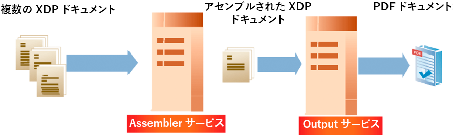
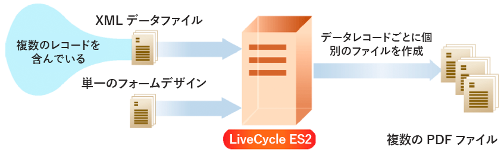
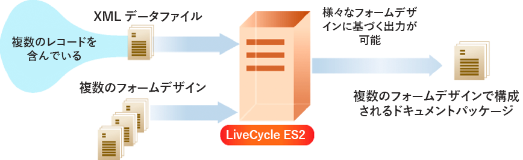

# ドキュメント出力ストリームの作成 {#creating-document-output-streams}

**Outputサービスについて**

Outputサービスを使用すると、ドキュメントをPDF(PDF/Aドキュメントを含む)、PostScript、Printer Control Language(PCL)および次のラベル形式で出力できます。

* Zebra - ZPL
* Intermec - IPL
* Datamax - DPL
* TecToshiba - TPCL

Outputサービスを使用すると、XMLフォームデータをフォームデザインとマージし、ドキュメントをネットワークプリンターまたはファイルに出力できます。

フォームデザイン（XDPファイル）をOutputサービスに渡す方法は2つあります。 フォームデザインを含むイ `com.adobe.idp.Document` ンスタンスをOutputサービスに渡すことができます。 また、フォームデザインの場所を指定するURI値を渡すこともできます。 これらの方法は、「AEM formsによるプログラミング」で *説明されています*。

>[!NOTE]
>
>Outputサービスは、アプリケーションオブジェクト固有のスクリプトを含むAcroform PDFドキュメントをサポートしていません。 アプリケーションオブジェクト固有のドキュメントを含むAcroform PDFスクリプトはレンダリングされません。

次の節では、URI値を使用してフォームデザインをOutputサービスに渡す方法を示します。

* [PDFの作成ドキュメント](creating-document-output-streams.md#creating-pdf-documents)
* [PDF/Aドキュメントの作成](creating-document-output-streams.md#creating-pdf-a-documents)

次の節では、インスタンス内でフォームデザインを渡す方法を示 `com.adobe.idp.Document` します。

* [Content Services（非推奨）内のドキュメントをOutputサービスに渡す](creating-document-output-streams.md#passing-documents-located-in-content-services-deprecated-to-the-output-service)
* [フラグメントを使用したPDFドキュメントの作成](creating-document-output-streams.md#creating-pdf-documents-using-fragments)

使用する方法を決定する際に考慮すべき点は、別のAEM Formsサービスからフォームデザインを取得し、それをインスタンス内で渡す場合 `com.adobe.idp.Document` です。 「 *Passing」ドキュメントーと「* Creating PDFドキュメントusing Fragments ** 」セクションの両方で、別のAEM Formsサービスからフォームデザインを取得する方法を示します。 最初の節では、Content Services（非推奨）からフォームデザインを取得します。 2つ目の節では、Assemblerサービスからフォームデザインを取得します。

ファイルシステムなどの固定の場所からフォームデザインを取得する場合は、どちらの方法でも使用できます。 つまり、URI値をXDPファイルに指定するか、インスタンスを使用することがで `com.adobe.idp.Document` きます。

PDFフォームを作成する際にフォームデザインの場所を指定するURI値を渡すには、このドキュメントを使用 `generatePDFOutput` します。 同様に、PDFメソッドの作成時 `com.adobe.idp.Document` にインスタンスをOutputサービスに渡す場合は、ドキュメントを使用 `generatePDFOutput2` します。

出力ストリームをネットワークプリンターに送信する場合は、どちらの方法を使用することもできます。 フォームデザインを含むインスタンスを渡して出力ストリ `com.adobe.idp.Document` ームをプリンターに送信するには、このメソッドを使 `sendToPrinter2`用します。 URI値を渡して出力ストリームをプリンターに送信するには、このメソッドを使用 `sendToPrinter`します。 「プリン *ターへの印刷ストリームの送信* 」セクションでは、この方法を使 `sendToPrinter` 用します。

Outputサービスを使用して、次のタスクを実行できます。

* [PDFの作成ドキュメント](creating-document-output-streams.md#creating-pdf-documents)
* [PDF/Aドキュメントの作成](creating-document-output-streams.md#creating-pdf-a-documents)
* [Content Services（非推奨）内のドキュメントをOutputサービスに渡す](creating-document-output-streams.md#passing-documents-located-in-content-services-deprecated-to-the-output-service)
* [フラグメントを使用したPDFドキュメントの作成](creating-document-output-streams.md#creating-pdf-documents-using-fragments)
* [ファイルへの印刷](creating-document-output-streams.md#printing-to-files)
* [プリンターへの印刷ストリームの送信](creating-document-output-streams.md#sending-print-streams-to-printers)
* [複数の出力ファイルの作成](creating-document-output-streams.md#creating-multiple-output-files)
* [検索ルールの作成](creating-document-output-streams.md#creating-search-rules)
* [PDFの統合ドキュメント](creating-document-output-streams.md#flattening-pdf-documents)

>[!NOTE]
>
>For more information about the Output service, see [Services Reference for AEM Forms](https://www.adobe.com/go/learn_aemforms_services_63).

## PDFの作成ドキュメント {#creating-pdf-documents}

Outputサービスを使用して、指定したフォームデザインとXMLフォームデータに基づくPDFドキュメントを作成できます。 Outputサービスで作成されるPDFドキュメントは、インタラクティブなPDFドキュメントではありません。ユーザーはフォームデータを入力または変更できません。

長期ストレージを目的としたPDFドキュメントを作成する場合は、PDF/Aドキュメントを作成することをお勧めします。 (PDF/A [ドキュメントの作成](creating-document-output-streams.md#creating-pdf-a-documents))。

ユーザーがデータを入力できるインタラクティブPDFフォームを作成するには、Formsサービスを使用します。 (インタラクティブPDF [フォームのレンダリングを参照](/help/forms/developing/rendering-forms.md#rendering-interactive-pdf-forms))。

>[!NOTE]
>
>For more information about the Output service, see [Services Reference for AEM Forms](https://www.adobe.com/go/learn_aemforms_services_63).

### 手順の概要 {#summary-of-steps}

PDFフォルダーを作成するには、次のドキュメントを実行します。

1. プロジェクトファイルを含めます。
1. Output Clientオブジェクトを作成します。
1. XMLデータソースの参照。
1. PDF実行時オプションを設定します。
1. レンダリングの実行時オプションを設定します。
1. PDFの生成ドキュメント
1. 操作の結果を取得します。

**プロジェクトファイルを含める**

必要なファイルを開発プロジェクトに含めます。 Javaを使用してクライアントアプリケーションを作成する場合は、必要なJARファイルを含めます。 Webサービスを使用している場合は、必ずプロキシファイルを含めてください。

次のJARファイルをプロジェクトのクラスパスに追加する必要があります。

* adobe-livecycle-client.jar
* adobe-usermanager-client.jar
* adobe-output-client.jar
* adobe-utilities.jar（AEM FormsがJBossにデプロイされている場合に必須）
* jbossall-client.jar（JBossにAEM Formsがデプロイされている場合は必須）

aem FormsがJBoss以外のサポート対象のJ2EEアプリケーションサーバーにデプロイされている場合は、adobe-utilities.jarファイルとjbossall-client.jarファイルを、AEM FormsがデプロイされているJ2EEアプリケーションサーバーに固有のJARファイルに置き換える必要があります。

**Output Clientオブジェクトの作成**

プログラムによってOutputサービス操作を実行する前に、Outputサービスクライアントオブジェクトを作成する必要があります。 Java APIを使用している場合は、オブジェクトを作成し `OutputClient` ます。 Output WebサービスAPIを使用している場合は、オブジェクトを作成 `OutputServiceService` します。

**XMLデータソースの参照**

データをフォームデザインとマージするには、データを含むXMLデータソースを参照する必要があります。 XML要素は、データを入力するすべてのフォームフィールドに存在する必要があります。 XML要素名は、フィールド名と一致する必要があります。 XML要素がフォームフィールドに対応していない場合、またはXML要素名がフィールド名と一致しない場合、XML要素は無視されます。 すべてのXML要素が指定されている場合、XML要素が表示される順序と一致する必要はありません。

次に、ローン申し込みフォームの例を示します。


データをこのフォームデザインにマージするには、フォームに対応するXMLデータソースを作成する必要があります。 次のXMLは、住宅ローン申し込みフォームの例に対応するXDP XMLデータソースを表しています。

```as3
 <?xml version="1.0" encoding="UTF-8" ?>
 - <xfa:datasets xmlns:xfa="https://www.xfa.org/schema/xfa-data/1.0/">
 - <xfa:data>
 - <data>
     - <Layer>
         <closeDate>1/26/2007</closeDate>
         <lastName>Johnson</lastName>
         <firstName>Jerry</firstName>
         <mailingAddress>JJohnson@NoMailServer.com</mailingAddress>
         <city>New York</city>
         <zipCode>00501</zipCode>
         <state>NY</state>
         <dateBirth>26/08/1973</dateBirth>
         <middleInitials>D</middleInitials>
         <socialSecurityNumber>(555) 555-5555</socialSecurityNumber>
         <phoneNumber>5555550000</phoneNumber>
     </Layer>
     - <Mortgage>
         <mortgageAmount>295000.00</mortgageAmount>
         <monthlyMortgagePayment>1724.54</monthlyMortgagePayment>
         <purchasePrice>300000</purchasePrice>
         <downPayment>5000</downPayment>
         <term>25</term>
         <interestRate>5.00</interestRate>
     </Mortgage>
 </data>
 </xfa:data>
 </xfa:datasets>
```

**PDF実行時オプションの設定**

PDFオプションを作成する場合は、「file URI」オプションをドキュメントします。 このオプションは、Outputサービスが生成するPDFファイルの名前と場所を指定します。

>[!NOTE]
>
>ファイルURIの実行時オプションを設定する代わりに、Outputサービスから返される複雑なデータ型からPDFドキュメントをプログラムで取得できます。 ただし、ファイルURIの実行時オプションを設定することで、プログラムによってPDFアプリケーションを取得するアプリケーションロジックを作成する必要はありません。ドキュメント

**レンダリングの実行時オプションの設定**

レンダリングの実行時オプションは、PDFオプションの作成時に設定できます。ドキュメント これらのオプションは必須ではありませんが（必要なPDF実行時オプションとは異なり）、Outputサービスのパフォーマンスの向上などのタスクを実行できます。 例えば、Outputサービスで使用されるフォームデザインをキャッシュして、パフォーマンスを向上させることができます。

タグ付きAcrobatフォームを入力として使用する場合、OutputサービスのJavaまたはWebサービスAPIを使用してタグ付き設定を無効にすることはできません。 プログラムでこのオプションをに設定しようとすると、 `false`結果のPDFドキュメントはタグ付けされます。

>[!NOTE]
>
>レンダリングの実行時オプションを指定しない場合は、デフォルト値が使用されます。 実行時オプションのレンダリングについて詳しくは、クラス参照を参 `RenderOptionsSpec` 照してください。 (『 [AEM Forms APIリファレンス』を参照](https://www.adobe.com/go/learn_aemforms_javadocs_63_en))。

**「Generate a PDF」ドキュメント**

フォームデータを含む有効なXMLデータソースを参照し、実行時オプションを設定したら、Outputサービスを呼び出して、PDFドキュメントを生成できます。

PDFドキュメントを生成する場合、OutputサービスでPDFドキュメントの作成に必要なURI値を指定します。 フォームデザインは、サーバーファイルシステムなどの場所や、AEM Formsアプリケーションの一部として保存できます。 Formsアプリケーションの一部として存在するフォームデザイン（または画像ファイルなどの他のリソース）は、コンテンツルートURI値を使用して参照できま `repository:///`す。 例えば、 *Applications/FormsApplicationというFormsアプリケーション内にある* Loan.xdp *という名前の次のフォームデザインを考えてみましょう*。


前の図に示したLoan.xdpファイルにアクセスするには、オブジェクトのメソ `repository:///Applications/FormsApplication/1.0/FormsFolder/` ッドに渡す3番目のパラメー `OutputClient` ターとして指定 `generatePDFOutput` します。 オブジェクトのメソッドに渡&#x200B;*す2番目のパラメーターとして、フォーム名(* Loan.xdp `OutputClient` )を `generatePDFOutput` 指定します。

XDPファイルに画像（またはフラグメントなどの他のリソース）が含まれている場合は、XDPファイルと同じアプリケーションフォルダーにリソースを配置します。 AEM Formsは、画像への参照を解決する際に、コンテンツルートURIをベースパスとして使用します。 例えば、Loan.xdpファイルに画像が含まれている場合は、必ず画像をに配置します `Applications/FormsApplication/1.0/FormsFolder/`。

>[!NOTE]
>
>オブジェクトまたはメソッドを呼び出すときに、Formsアプリ `OutputClient` ケーションURIを `generatePDFOutput` 参照で `generatePrintedOutput` きます。

>[!NOTE]
>
>Formsアプリケーション内のXDPを参照してPDFドキュメントを作成する完全なクイック開始を確認するには、「クイック開始(EJBモ [ード)」を参照してください。Java APIを使用したドキュメントXDPファイルに基づくPDFアプリケーションの作成](/help/forms/developing/output-service-java-api-quick.md#quick-start-soap-mode-creating-a-pdf-document-based-on-an-application-xdp-file-using-the-java-api)。

**操作の結果の取得**

Outputサービスは、操作の実行後、操作が成功したかどうかを示すステータスXMLデータなど、様々なデータ項目を返します。

**関連トピック**

[Java APIを使用したPDFドキュメントの作成](creating-document-output-streams.md#create-a-pdf-document-using-the-java-api)

[WebサービスAPIを使用したPDFドキュメントの作成](creating-document-output-streams.md#create-a-pdf-document-using-the-web-service-api)

[AEM Forms Java ライブラリファイルを含める](/help/forms/developing/invoking-aem-forms-using-java.md#including-aem-forms-java-library-files)

[接続プロパティの設定](/help/forms/developing/invoking-aem-forms-using-java.md#setting-connection-properties)

[Output Service APIのクイック開始](/help/forms/developing/output-service-java-api-quick.md#output-service-java-api-quick-start-soap)

### Java APIを使用したPDFドキュメントの作成 {#create-a-pdf-document-using-the-java-api}

Output API(Java)を使用してPDFドキュメントを作成します。

1. プロジェクトファイルを含めます。

   Javaプロジェクトのクラスパスに、adobe-output-client.jarなどのクライアントJARファイルを含めます。

1. Output Clientオブジェクトを作成します。

   * 接続プロパティを含む `ServiceClientFactory` オブジェクトを作成します。
   * Create an `OutputClient` object by using its constructor and passing the `ServiceClientFactory` object.

1. XMLデータソースの参照。

   * PDFドキュメントのコ `java.io.FileInputStream` ンストラクターを使用し、XMLファイルの場所を指定する文字列値を渡すことによって、PDFデータの入力に使用されるXMLデータソースを表すオブジェクトを作成します。
   * コンストラクタを使用して `com.adobe.idp.Document` オブジェクトを作成します。Pass the `java.io.FileInputStream` object.

1. PDF実行時オプションを設定します。

   * コンストラクタを使用して `PDFOutputOptionsSpec` オブジェクトを作成します。
   * オブジェクトのメソッドを呼び出して、「File URI」 `PDFOutputOptionsSpec` オプションを設定 `setFileURI` します。 Outputサービスが生成するPDFファイルの場所を指定するstring値を渡します。 「ファイルのURI」オプションは、クライアントコンピューターではなく、AEM FormsをホストするJ2EEアプリケーションサーバーに対する相対パスです。

1. レンダリングの実行時オプションを設定します。

   * コンストラクタを使用して `RenderOptionsSpec` オブジェクトを作成します。
   * オブジェクトの呼び出しと渡しを行うことで、フォームデザインをキャッシュし、Outputサービ `RenderOptionsSpec` スのパフォーマンスを `setCacheEnabled` 向上させま `true`す。
   >[!NOTE]
   >
   >入力ドキュメントがAcrobatフォーム（Acrobatで作成されたフォーム）または署名または認証されたXFAドキュメントの場合、オブジェクトのメソッドを使用してPDFドキュメントのバージョンを設定することはできません。 `RenderOptionsSpec``setPdfVersion` 出力PDFドキュメントは、元のPDFバージョンを保持します。 同様に、入力ドキュメントがAcrobatフォームまたは署名済みまたは認証済みのXFAドキュメントの場合、オブジェクトのメソッドを呼び出して、タグ付きAdobe PDFオ `RenderOptionsSpec``setTaggedPDF` プションを設定することはできません。

   >[!NOTE]
   >
   >入力PDFドキュメントが認証またはデジタル署名されている場合は、オブ `RenderOptionsSpec` ジェクトの方 `setLinearizedPDF` 法を使用して線形化されたPDFオプションを設定することはできません。 (See [Digitally Signing PDF Documents](/help/forms/developing/digitally-signing-certifying-documents.md#digitally-signing-pdf-documents)*.)*

1. PDFの生成ドキュメント

   Create a PDF document by invoking the `OutputClient` object’s `generatePDFOutput` method and passing the following values:

   * `TransformationFormat` 定義済みリスト値。 PDF生成を指定するには、ドキュメントを指定しま `TransformationFormat.PDF`す。
   * フォームデザイン名を指定する string 値。
   * フォームデザインが存在するコンテンツルートを指定するstring値。
   * PDFの実 `PDFOutputOptionsSpec` 行時オプションを含むオブジェクトです。
   * レンダリング `RenderOptionsSpec` の実行時オプションを含むオブジェクトです。
   * フォーム `com.adobe.idp.Document` デザインとマージするデータを含むXMLデータソースを含むオブジェクトです。
   The `generatePDFOutput` method returns an `OutputResult` object that contains the results of the operation.

   >[!NOTE]
   >
   >このメソッドを呼び出してPDFドキュメントを生成する `generatePDFOutput` 場合、署名または認証されたXFA PDFフォームとのデータの結合はできないことに注意してください。 (電子署名 [と認証ドキュメント](/help/forms/developing/digitally-signing-certifying-documents.md#digitally-signing-and-certifying-documents)*)。*

   >[!NOTE]
   >
   >オブジ `OutputResult` ェクトのメソッ `getRecordLevelMetaDataList` ドが返しま `null`*す。*

   >[!NOTE]
   >
   >オブジェクトのメソッドを呼び出してPDFドキュメントを作成す `OutputClient` ることもで `generatePDFOutput2` きます。 (Content Services(非推 [奨)にあるドキュメントをOutputサービスに渡すを参照](creating-document-output-streams.md#passing-documents-located-in-content-services-deprecated-to-the-output-service)*)。*

1. 操作の結果を取得します。

   * オブジェクト `com.adobe.idp.Document` のメソッドを呼び出して、操 `generatePDFOutput` 作のステータスを表すオ `OutputResult` ブジェクトを取得 `getStatusDoc` します。 このメソッドは、操作が成功したかどうかを示すステータスXMLデータを返します。
   * 操作の結果 `java.io.File` を含むオブジェクトを作成します。 ファイル名の拡張子が.xmlであることを確認します。
   * オブジェクト `com.adobe.idp.Document` のメソッ `copyToFile` ドを呼び出して、オブジェクトの内容をファイルにコピ `com.adobe.idp.Document` ーします(メソッドから返されたオブジェクトを使用 `com.adobe.idp.Document` していることを `getStatusDoc` 確認します)。
   Outputサービスは、オブジェクトのメソッドに渡された引数で指定された場所にPDFドキュメントを書き込みますが、オブジェクトのドキュメントを呼び出すことで、PDF/Aメソッドをプログラム的に取得する `PDFOutputOptionsSpec` ことがで `setFileURI``OutputResult``getGeneratedDoc` きます。

**関連トピック**

[手順の概要](creating-document-output-streams.md#summary-of-steps)

[クイック開始（EJBモード）:Java APIを使用したPDFドキュメントの作成](/help/forms/developing/output-service-java-api-quick.md#quick-start-soap-mode-creating-a-pdf-document-using-the-java-api)

[クイック開始（SOAPモード）:Java APIを使用したPDFドキュメントの作成](/help/forms/developing/output-service-java-api-quick.md#quick-start-soap-mode-creating-a-pdf-document-using-the-java-api)

[AEM Forms Java ライブラリファイルを含める](/help/forms/developing/invoking-aem-forms-using-java.md#including-aem-forms-java-library-files)

[接続プロパティの設定](/help/forms/developing/invoking-aem-forms-using-java.md#setting-connection-properties)

### WebサービスAPIを使用したPDFドキュメントの作成 {#create-a-pdf-document-using-the-web-service-api}

Output API（Webサービス）を使用してPDFドキュメントを作成します。

1. プロジェクトファイルを含めます。

   MTOMを使用するMicrosoft .NETプロジェクトを作成します。 次のWSDL定義を使用していることを確認します。 `http://localhost:8080/soap/services/OutputService?WSDL&lc_version=9.0.1`.

   >[!NOTE]
   >
   >AEM Formsをホ `localhost` ストするサーバーのIPアドレスで置き換えます。

1. Output Clientオブジェクトを作成します。

   * デフォルトのコンス `OutputServiceClient` トラクターを使用して、オブジェクトを作成します。
   * コンストラクタ `OutputServiceClient.Endpoint.Address` ーを使用してオブジェクトを作 `System.ServiceModel.EndpointAddress` 成します。 WSDLを指定するstring値をAEM Formsサービス(例： `http://localhost:8080/soap/services/OutputService?blob=mtom`.)に渡します。属性を使用する必要はありま `lc_version` せん。 この属性は、サービス参照を作成する際に使用されます。 ただし、MTOMを使用す `?blob=mtom` るように指定します。
   * フィールド `System.ServiceModel.BasicHttpBinding` の値を取得して、オブジェクトを作成 `OutputServiceClient.Endpoint.Binding` します。 戻り値を `BasicHttpBinding` にキャストします。
   * オブジェクト `System.ServiceModel.BasicHttpBinding` のフィールドをに `MessageEncoding` 設定しま `WSMessageEncoding.Mtom`す。 この値により、MTOMが使用されます。
   * 次のオプションを実行して、基本的なHTTP認証を有効にします。タスク

      * AEM formsのユーザー名をフィールドに割り当てま `OutputServiceClient.ClientCredentials.UserName.UserName`す。
      * 対応するパスワード値をフィールドに割り当てま `OutputServiceClient.ClientCredentials.UserName.Password`す。
      * 定数値をフィールドに `HttpClientCredentialType.Basic` 割り当てま `BasicHttpBindingSecurity.Transport.ClientCredentialType`す。
      * 定数値をフィールドに `BasicHttpSecurityMode.TransportCredentialOnly` 割り当てま `BasicHttpBindingSecurity.Security.Mode`す。

1. XMLデータソースの参照。

   * コンストラクタを使用して `BLOB` オブジェクトを作成します。このオ `BLOB` ブジェクトは、PDFデータと統合されるXMLデータの保存に使用されます。ドキュメント
   * オブジェクト `System.IO.FileStream` を作成するには、コンストラクターを呼び出し、フォームデータを含むXMLファイルのファイルの場所を表すstring値を渡します。
   * オブジェクトの内容を格納するバイト配列を作成 `System.IO.FileStream` します。 バイト配列のサイズは、オブジェクトのプロパティを取得す `System.IO.FileStream` ることで指定で `Length` きます。
   * オブジェクトのメソッドを呼び出し、読み取るバイ `System.IO.FileStream` ト配列、開始位 `Read` 置およびストリームの長さを渡すことで、バイト配列にストリームデータを入力します。
   * バイト配列の `BLOB` 内容をフィールドに割り `MTOM` 当てて、オブジェクトを入力します。

1. PDF実行時オプションの設定

   * コンストラクタを使用して `PDFOutputOptionsSpec` オブジェクトを作成します。
   * 「File URI」オプションを設定するには、Outputサービスが生成するPDFファイルの場所を指定するstring値をオブジェクトのデータメ `PDFOutputOptionsSpec` ンバーに割り当 `fileURI` てます。 「ファイルのURI」オプションは、クライアントコンピューターではなく、AEM FormsをホストするJ2EEアプリケーションサーバーに対する相対パスです。

1. レンダリングの実行時オプションを設定します。

   * コンストラクタを使用して `RenderOptionsSpec` オブジェクトを作成します。
   * フォームデザインをキャッシュし、オブジェクトのデータメンバーに値を割り当てることで、Outputサ `true` ービスのパフ `RenderOptionsSpec` ォーマンスを向 `cacheEnabled` 上させます。
   >[!NOTE]
   >
   >入力ドキュメントがAcrobatフォーム（Acrobatで作成されたフォーム）または署名または認証されたXFAドキュメントの場合、オブジェクトのメソッドを使用してPDFドキュメントのバージョンを設定することはできません。 `RenderOptionsSpec``setPdfVersion` 出力PDFドキュメントは、元のPDFバージョンを保持します。 同様に、入力ドキュメントがAcrobatフォームまたは署名済みまたは認証済みのXFAドキュメントの場合、オブジェクトの `RenderOptionsSpec``setTaggedPDF`*メソッドを呼び出してタグ付きAdobe PDFオプションを設定することはできません。*

   >[!NOTE]
   >
   >入力PDFドキュメントが認証またはデジタル署名されている場合、オブ `RenderOptionsSpec` ジェクトのメ `linearizedPDF` ンバを使用して線形化PDFオプションを設定することはできません。 (See [Digitally Signing PDF Documents](/help/forms/developing/digitally-signing-certifying-documents.md#digitally-signing-pdf-documents)*.)*

1. PDFの生成ドキュメント

   Create a PDF document by invoking the `OutputServiceService` object’s `generatePDFOutput`method and passing the following values:

   * `TransformationFormat` 定義済みリスト値。 PDF生成を指定するには、ドキュメントを指定しま `TransformationFormat.PDF`す。
   * フォームデザイン名を指定する string 値。
   * フォームデザインが存在するコンテンツルートを指定するstring値。
   * PDFの実 `PDFOutputOptionsSpec` 行時オプションを含むオブジェクトです。
   * レンダリング `RenderOptionsSpec` の実行時オプションを含むオブジェクトです。
   * フォーム `BLOB` デザインとマージするデータを含むXMLデータソースを含むオブジェクトです。
   * メソッ `BLOB` ドによって入力されるオブジェ `generatePDFOutput` クト。 メソッド `generatePDFOutput` は、このオブジェクトを記述する生成されたメタデータをこのオブジェクトにドキュメントします。 （このパラメーター値は、Webサービスの呼び出しにのみ必要です）。
   * メソッ `BLOB` ドによって入力されるオブジェ `generatePDFOutput` クト。 メソッド `generatePDFOutput` は、このオブジェクトに結果データを入力します。 （このパラメーター値は、Webサービスの呼び出しにのみ必要です）。
   * 操作 `OutputResult` の結果を含むオブジェクトです。 （このパラメーター値は、Webサービスの呼び出しにのみ必要です）。
   >[!NOTE]
   >
   >このメソッドを呼び出してPDFドキュメントを生成する `generatePDFOutput` 場合、署名または認証されたXFA PDFフォームとのデータの結合はできないことに注意してください。 (電子署名 [と認証ドキュメント](/help/forms/developing/digitally-signing-certifying-documents.md#digitally-signing-and-certifying-documents)*)。*

   >[!NOTE]
   >
   >オブジェクトのメソッドを呼び出してPDFドキュメントを作成す `OutputClient` ることもで `generatePDFOutput2` きます。 (Content Services(非推 [奨)にあるドキュメントをOutputサービスに渡すを参照](creating-document-output-streams.md#passing-documents-located-in-content-services-deprecated-to-the-output-service)*)。*

1. 操作の結果を取得します。

   * コンストラクタ `System.IO.FileStream` ーを呼び出し、結果データを含むXMLファイルの場所を表すstring値を渡して、オブジェクトを作成します。 ファイル名の拡張子が.xmlであることを確認します。
   * オブジェクトのメソッド（8番目のパラメーター）によっ `BLOB` て結果データが入力されたオブジェクトのデ `OutputServiceService` ータ内容を格納 `generatePDFOutput` するバイト配列を作成します。 オブジェクトの値を取得して、バイト配列 `BLOB` を設定しま `MTOM``field`す。
   * Create a `System.IO.BinaryWriter` object by invoking its constructor and passing the `System.IO.FileStream` object.
   * オブジェクトのメソッドを呼び出し、バイト配列を渡すことで、バイ `System.IO.BinaryWriter` ト配列の内 `Write` 容をXMLファイルに書き込みます。
   関連トピック

   [手順の概要](creating-document-output-streams.md#summary-of-steps)

   [MTOMを使用したAEM Formsの呼び出し](/help/forms/developing/invoking-aem-forms-using-web.md#invoking-aem-forms-using-mtom)

   [SwaRefを使用したAEM Formsの呼び出し](/help/forms/developing/invoking-aem-forms-using-web.md#invoking-aem-forms-using-swaref)

   >[!NOTE]
   >
   >オブジェクト `OutputServiceService` のメソッドは非推 `generateOutput` 奨となりました。

## PDF/Aドキュメントの作成 {#creating-pdf-a-documents}

Outputサービスを使用してPDF/Aドキュメントを作成できます。 PDF/Aはドキュメントのコンテンツを長期間保存するためのアーカイブ形式なので、すべてのフォントが埋め込まれ、ファイルは圧縮されません。 その結果、通常、PDF/A ドキュメントは標準の PDF ドキュメントよりも大きくなります。また、PDF/Aドキュメントには、オーディオおよびビデオコンテンツは含まれません。 他のOutputサービスタスクと同様に、フォームデザインとフォームデザインの結合用のデータの両方を提供し、PDF/Aドキュメントを作成します。

PDF/A-1仕様は、2つのレベルの準拠（aとb）で構成されています。この2つの主な違いは、論理構造（アクセシビリティ）のサポートに関するもので、準拠レベルbには必要ありません。準拠レベルに関係なく、PDF/A-1では、生成されたPDF/Aドキュメントにすべてのフォントが埋め込まれます。

PDF/AはPDFドキュメントのアーカイブの標準ですが、標準のPDFドキュメントが会社のニーズを満たしている場合、PDF/Aをアーカイブに使用する必要はありません。 PDF/A標準の目的は、長期間保存できるPDFファイルを確立し、ドキュメントの保存要件を満たすことです。 例えば、URLをPDF/Aに埋め込むことはできません。これは、URLが時間の経過と共に無効になる可能性があるためです。

組織は、独自のニーズ、ドキュメントの維持に要する時間、ファイルサイズに関する考慮事項を評価し、独自のアーカイブ戦略を決定する必要があります。 DocConverterサービスを使用すると、PDFドキュメントがPDF/Aに準拠しているかどうかをプログラムで判断できます。 (「PDF/A [の準拠をプログラムで判断する](/help/forms/developing/pdf-a-documents.md#programmatically-determining-pdf-a-compliancy)」を参照)。

PDF/Aドキュメントは、フォームデザインで指定されたフォントを使用する必要があり、フォントを置き換えることはできません。 その結果、PDFドキュメント内のフォントがホストのオペレーティングシステム(OS)で使用できない場合は、例外が発生します。

PDF/AドキュメントをAcrobatで開くと、次の図に示すように、ドキュメントがPDF/Aドキュメントであることを確認するメッセージが表示されます。


>[!NOTE]
>
>AIIMのWebサイトには、PDF/A FAQの節があり、https://www.aiim.org/documents/standards/19005-1_FAQ.pdfからアクセスでき [ます](https://www.aiim.org/documents/standards/19005-1_FAQ.pdf)。

>[!NOTE]
>
>For more information about the Output service, see [Services Reference for AEM Forms](https://www.adobe.com/go/learn_aemforms_services_63).

### 手順の概要 {#summary_of_steps-1}

PDF/Aドキュメントを作成するには：

1. プロジェクトファイルを含めます。
1. Output Clientオブジェクトを作成します。
1. XMLデータソースの参照。
1. PDF/Aランタイムオプションを設定します。
1. レンダリングの実行時オプションを設定します。
1. PDF/Aの生成ドキュメント
1. 操作の結果を取得します。

**プロジェクトファイルを含める**

必要なファイルを開発プロジェクトに含めます。 Javaを使用してカスタムアプリケーションを作成する場合は、必要なJARファイルを含めます。 Webサービスを使用している場合は、必ずプロキシファイルを含めてください。

次のJARファイルをプロジェクトのクラスパスに追加する必要があります。

* adobe-livecycle-client.jar
* adobe-usermanager-client.jar
* adobe-output-client.jar
* adobe-utilities.jar（AEM FormsがJBossにデプロイされている場合に必須）
* jbossall-client.jar（JBossにAEM Formsがデプロイされている場合は必須）

aem FormsがJBoss以外のサポート対象のJ2EEアプリケーションサーバーにデプロイされている場合は、adobe-utilities.jarファイルとjbossall-client.jarファイルを、AEM FormsがデプロイされているJ2EEアプリケーションサーバーに固有のJARファイルに置き換える必要があります。

**Output Clientオブジェクトの作成**

プログラムによってOutputサービス操作を実行する前に、Outputサービスクライアントオブジェクトを作成する必要があります。 Java APIを使用している場合は、オブジェクトを作成し `OutputClient` ます。 Output WebサービスAPIを使用している場合は、オブジェクトを作成 `OutputServiceService` します。

**XMLデータソースの参照**

データをフォームデザインとマージするには、データを含むXMLデータソースを参照する必要があります。 データを入力するすべてのフォームフィールドに対して、XML要素が存在する必要があります。 XML要素名は、フィールド名と一致する必要があります。 XML要素がフォームフィールドに対応していない場合、またはXML要素名がフィールド名と一致しない場合、XML要素は無視されます。 すべてのXML要素が指定されている場合、XML要素が表示される順序と一致する必要はありません。

**PDF/Aランタイムオプションの設定**

PDF/Aオプションを作成する際に、「ファイルのURI」オプションを設定できます。ドキュメント URIは、AEM FormsをホストするJ2EEアプリケーションサーバーに対する相対パスです。 つまり、C:\Adobeを設定した場合、ファイルはクライアントコンピューターではなく、サーバー上のフォルダーに書き込まれます。 URIは、Outputサービスが生成するPDF/Aファイルの名前と場所を指定します。

**レンダリングの実行時オプションの設定**

レンダリングの実行時オプションは、PDF/Aオプションの作成時に設定できます。ドキュメント PDF/Aに関連するオプションを2つ設定できます。このオプションには、と `PDFAConformance` の値があ `PDFARevisionNumber` ります。 The `PDFAConformance` value refers to how a PDF document adheres to requirements that specify how long-term electronic documents are preserved. このオプションの有効な値は、と `A` です `B`。 レベルaとbの準拠について詳しくは、「 *ISO 19005-1準拠管理」というPDF/A-1 ISO仕様を参照してください*。

この値 `PDFARevisionNumber` は、PDF/Aドキュメントのリビジョン番号を示します。 PDF/Aドキュメントのリビジョン番号について詳しくは、「 *ISO 19005-1ドキュメント管理」というPDF/A-1 ISO仕様」を参照してください*。

>[!NOTE]
>
>PDF/A 1Aドキュメントを作成する場合、タグ付きAdobe PDFオ `false` プションをに設定することはできません。 PDF/A 1Aは、常にタグ付きPDFドキュメントです。 また、PDF/A 1Bドキュメントを作成する場合、タグ付きAdobe PDFオ `true` プションをに設定することはできません。 PDF/A 1Bは、常にタグなしPDFドキュメントです。

**PDF/Aの生成ドキュメント**

フォームデータを含む有効なXMLデータソースを参照し、実行時オプションを設定したら、Outputサービスを呼び出して、PDF/Aドキュメントを生成できます。

**操作の結果の取得**

Outputサービスは、操作の実行後、操作が成功したかどうかを示すXMLデータなどの様々なデータ項目を返します。

**関連トピック**

[Java APIを使用したPDF/Aドキュメントの作成](creating-document-output-streams.md#create-a-pdf-a-document-using-the-java-api)

[WebサービスAPIを使用したPDF/Aドキュメントの作成](creating-document-output-streams.md#create-a-pdf-a-document-using-the-web-service-api)

[AEM Forms Java ライブラリファイルを含める](/help/forms/developing/invoking-aem-forms-using-java.md#including-aem-forms-java-library-files)

[接続プロパティの設定](/help/forms/developing/invoking-aem-forms-using-java.md#setting-connection-properties)

[Output Service APIのクイック開始](/help/forms/developing/output-service-java-api-quick.md#output-service-java-api-quick-start-soap)

### Java APIを使用したPDF/Aドキュメントの作成 {#create-a-pdf-a-document-using-the-java-api}

Output API(Java)を使用してPDF/Aドキュメントを作成します。

1. プロジェクトファイルを含めます。

   Javaプロジェクトのクラスパスに、adobe-output-client.jarなどのクライアントJARファイルを含めます。

1. Output Clientオブジェクトを作成します。

   * 接続プロパティを含む `ServiceClientFactory` オブジェクトを作成します。
   * Create an `OutputClient` object by using its constructor and passing the `ServiceClientFactory` object.

1. XMLデータソースの参照。

   * PDF/A `java.io.FileInputStream` ドキュメントのコンストラクターを使用し、XMLファイルの場所を指定する文字列値を渡すことで、PDF/Aデータの入力に使用されるXMLデータソースを表すオブジェクトを作成します。
   * コンストラクタを使用して `com.adobe.idp.Document` オブジェクトを渡すことによって、`java.io.FileInputStream` オブジェクトを作成します。

1. PDF/Aランタイムオプションを設定します。

   * コンストラクタを使用して `PDFOutputOptionsSpec` オブジェクトを作成します。
   * オブジェクトのメソッドを呼び出して、「File URI」 `PDFOutputOptionsSpec` オプションを設定 `setFileURI` します。 Outputサービスが生成するPDFファイルの場所を指定するstring値を渡します。 「ファイルのURI」オプションは、クライアントコンピューターではなく、AEM FormsをホストするJ2EEアプリケーションサーバーに対する相対パスです。

1. レンダリングの実行時オプションを設定します。

   * コンストラクタを使用して `RenderOptionsSpec` オブジェクトを作成します。
   * オブジェクト `PDFAConformance` のメソッドを呼び出 `RenderOptionsSpec` し、準拠レベ `setPDFAConformance` ルを指定する列挙 `PDFAConformance` 値を渡して、値を設定します。 例えば、準拠レベルAを指定するには、を渡しま `PDFAConformance.A`す。
   * オブジェクト `PDFARevisionNumber` のメソッドを呼び出し `RenderOptionsSpec` て渡し、値 `setPDFARevisionNumber` を設定しま `PDFARevisionNumber.Revision_1`す。
   >[!NOTE]
   >
   >PDF/AドキュメントのPDFバージョンは、オブジェクトのメソッドに指定した値に関係なく1.4 `RenderOptionsSpec` になり `setPdfVersion`*ます。*

1. PDF/Aの生成ドキュメント

   オブジェクトのメソッドを呼び出し、次 `OutputClient` の値を渡して、PDF/A `generatePDFOutput` ドキュメントを作成します。

   * `TransformationFormat` 定義済みリスト値。 PDF/Aドキュメントを生成するには、を指定しま `TransformationFormat.PDFA`す。
   * フォームデザイン名を指定する string 値。
   * フォームデザインが存在するコンテンツルートを指定するstring値。
   * PDFの実 `PDFOutputOptionsSpec` 行時オプションを含むオブジェクトです。
   * レンダリング `RenderOptionsSpec` の実行時オプションを含むオブジェクトです。
   * フォーム `com.adobe.idp.Document` デザインとマージするデータを含むXMLデータソースを含むオブジェクトです。
   The `generatePDFOutput` method returns an `OutputResult` object that contains the results of the operation.

   >[!NOTE]
   >
   >オブジ `OutputResult` ェクトのメソッ `getRecordLevelMetaDataList` ドが返しま `null`す。

   >[!NOTE]
   >
   >また、オブジェクトの `OutputClient``generatePDFOutput`2ドキュメントを呼び出して、PDF/Aメソッドを作成できます。 (Content Services(非推 [奨)にあるドキュメントをOutputサービスに渡すを参照](creating-document-output-streams.md#passing-documents-located-in-content-services-deprecated-to-the-output-service))。

1. 操作の結果を取得します。

   * オブジェクト `com.adobe.idp.Document` のメソッドを呼び出して、メソッ `generatePDFOutput` ドのステータスを表すオ `OutputResult` ブジェクトを作成 `getStatusDoc` します。
   * 操作の結 `java.io.File` 果を含むオブジェクトを作成します。 ファイル名の拡張子が.xmlであることを確認します。
   * オブジェクト `com.adobe.idp.Document` のメソッ `copyToFile` ドを呼び出して、オブジェクトの内容をファイルにコピ `com.adobe.idp.Document` ーします(メソッドから返されたオブジェクトを使用 `com.adobe.idp.Document` していることを `getStatusDoc` 確認します)。
   >[!NOTE]
   >
   >Outputサービスは、オブジェクトのメソッドに渡された引数で指定された場所にPDF/Aドキュメントを書き込みますが、オブジェクトのドキュメントを呼び出すことで、PDF/Aメソッドをプログラムで取得で `PDFOutputOptionsSpec` き `setFileURI``OutputResult``getGeneratedDoc` ます。

**関連トピック**

[手順の概要](creating-document-output-streams.md#summary-of-steps)

[クイック開始（SOAPモード）:Java APIを使用したPDF/Aドキュメントの作成](/help/forms/developing/output-service-java-api-quick.md#quick-start-soap-mode-creating-a-pdf-a-document-using-the-java-api)

[AEM Forms Java ライブラリファイルを含める](/help/forms/developing/invoking-aem-forms-using-java.md#including-aem-forms-java-library-files)

[接続プロパティの設定](/help/forms/developing/invoking-aem-forms-using-java.md#setting-connection-properties).

### WebサービスAPIを使用したPDF/Aドキュメントの作成 {#create-a-pdf-a-document-using-the-web-service-api}

Output API（Webサービス）を使用してPDF/Aドキュメントを作成します。

1. プロジェクトファイルを含めます。

   MTOMを使用するMicrosoft .NETプロジェクトを作成します。 次のWSDL定義を使用していることを確認します。 `http://localhost:8080/soap/services/OutputService?WSDL&lc_version=9.0.1`.

   >[!NOTE]
   >
   >AEM Formsをホ `localhost` ストするサーバーのIPアドレスで置き換えます。

1. Output Clientオブジェクトを作成します。

   * デフォルトのコンス `OutputServiceClient` トラクターを使用して、オブジェクトを作成します。
   * コンストラクタ `OutputServiceClient.Endpoint.Address` ーを使用してオブジェクトを作 `System.ServiceModel.EndpointAddress` 成します。 WSDLを指定するstring値をAEM Formsサービス(例： `http://localhost:8080/soap/services/OutputService?blob=mtom`.)に渡します。属性を使用する必要はありま `lc_version` せん。 この属性は、サービス参照を作成する際に使用されます。 ただし、MTOMを使用す `?blob=mtom` るように指定します。
   * フィールド `System.ServiceModel.BasicHttpBinding` の値を取得して、オブジェクトを作成 `OutputServiceClient.Endpoint.Binding` します。 戻り値を `BasicHttpBinding` にキャストします。
   * オブジェクト `System.ServiceModel.BasicHttpBinding` のフィールドをに `MessageEncoding` 設定しま `WSMessageEncoding.Mtom`す。 この値により、MTOMが使用されます。
   * 次のオプションを実行して、基本的なHTTP認証を有効にします。タスク

      * AEM formsのユーザー名をフィールドに割り当てま `OutputServiceClient.ClientCredentials.UserName.UserName`す。
      * 対応するパスワード値をフィールドに割り当てま `OutputServiceClient.ClientCredentials.UserName.Password`す。
      * 定数値をフィールドに `HttpClientCredentialType.Basic` 割り当てま `BasicHttpBindingSecurity.Transport.ClientCredentialType`す。
      * 定数値をフィールドに `BasicHttpSecurityMode.TransportCredentialOnly` 割り当てま `BasicHttpBindingSecurity.Security.Mode`す。

1. XMLデータソースの参照。

   * コンストラクタを使用して `BLOB` オブジェクトを作成します。このオ `BLOB` ブジェクトは、PDF/Aドキュメントと統合されるデータの保存に使用されます。
   * オブジェクト `System.IO.FileStream` を作成するには、コンストラクターを呼び出し、暗号化するPDFドキュメントーのファイルの場所と、ファイルを開くモードを表すstring値を渡します。
   * オブジェクトの内容を格納するバイト配列を作成 `System.IO.FileStream` します。 バイト配列のサイズは、オブジェクトのプロパティを取得す `System.IO.FileStream` ることで指定で `Length` きます。
   * オブジェクトのメソッドを呼び出し、読み取るバイ `System.IO.FileStream` ト配列、開始位 `Read` 置およびストリームの長さを渡すことで、バイト配列にストリームデータを入力します。
   * オブジェクトにバ `BLOB` イト配列の内容を割り当て `MTOM` て、オブジェクトを入力します。

1. PDF/Aランタイムオプションを設定します。

   * コンストラクタを使用して `PDFOutputOptionsSpec` オブジェクトを作成します。
   * 「File URI」オプションを設定するには、Outputサービスが生成するPDFファイルの場所を指定するstring値をオブジェクトのデータメ `PDFOutputOptionsSpec` ンバーに割り当 `fileURI` てます。 「ファイルのURI」オプションは、クライアントコンピューターではなく、AEM FormsをホストするJ2EEアプリケーションサーバーに対する相対パスです

1. レンダリングの実行時オプションを設定します。

   * コンストラクタを使用して `RenderOptionsSpec` オブジェクトを作成します。
   * オブジェクト `PDFAConformance` のデータメンバに `PDFAConformance` 列挙値を割り当てて、 `RenderOptionsSpec` 値を設定 `PDFAConformance` します。 例えば、準拠レベルAを指定するには、このデータメ `PDFAConformance.A` ンバーに割り当てます。
   * オブジェクト `PDFARevisionNumber` のデータメンバに `PDFARevisionNumber` 列挙値を割り当てて、 `RenderOptionsSpec` 値を設定 `PDFARevisionNumber` します。 このデー `PDFARevisionNumber.Revision_1` タメンバに割り当てます。
   >[!NOTE]
   >
   >PDF/AドキュメントのPDFバージョンは、指定した値に関係なく1.4です。

1. PDF/Aの生成ドキュメント

   Create a PDF document by invoking the `OutputServiceService` object’s `generatePDFOutput`method and passing the following values:

   * TransformationFormat定義済みリスト値。 PDF生成を指定するには、ドキュメントを指定しま `TransformationFormat.PDFA`す。
   * フォームデザイン名を指定する string 値。
   * フォームデザインが存在するコンテンツルートを指定するstring値。
   * PDFの実 `PDFOutputOptionsSpec` 行時オプションを含むオブジェクトです。
   * レンダリング `RenderOptionsSpec` の実行時オプションを含むオブジェクトです。
   * フォーム `BLOB` デザインとマージするデータを含むXMLデータソースを含むオブジェクトです。
   * メソッ `BLOB` ドによって入力されるオブジェ `generatePDFOutput` クト。 メソッド `generatePDFOutput` は、このオブジェクトを記述する生成されたメタデータをこのオブジェクトにドキュメントします。 （このパラメーター値は、Webサービスの呼び出しのみに必要です）。
   * メソッ `BLOB` ドによって入力されるオブジェ `generatePDFOutput` クト。 メソッド `generatePDFOutput` は、このオブジェクトに結果データを入力します。 （このパラメーター値は、Webサービスの呼び出しのみに必要です）。
   * 操作 `OutputResult` の結果を含むオブジェクトです。 （このパラメーター値は、Webサービスの呼び出しのみに必要です）。
   >[!NOTE]
   >
   >また、オブジェクトの `OutputClient``generatePDFOutput`2ドキュメントを呼び出して、PDF/Aメソッドを作成できます。 (Content Services(非推 [奨)にあるドキュメントをOutputサービスに渡すを参照](creating-document-output-streams.md#passing-documents-located-in-content-services-deprecated-to-the-output-service))。

1. 操作の結果を取得します。

   * コンストラクタ `System.IO.FileStream` ーを呼び出し、結果データを含むXMLファイルの場所を表すstring値を渡して、オブジェクトを作成します。 ファイル名の拡張子が.xmlであることを確認します。
   * オブジェクトのメソッド（8番目のパラメーター）によっ `BLOB` て結果データが入力されたオブジェクトのデ `OutputServiceService` ータ内容を格納 `generatePDFOutput` するバイト配列を作成します。 オブジェクトのフィールドの値を取得して、バ `BLOB` イト配列を設定 `MTOM` します。
   * Create a `System.IO.BinaryWriter` object by invoking its constructor and passing the `System.IO.FileStream` object.
   * オブジェクトのメソッドを呼び出し、バイト配列を渡すことで、バイ `System.IO.BinaryWriter` ト配列の内 `Write` 容をXMLファイルに書き込みます。

**関連トピック**

[手順の概要](creating-document-output-streams.md#summary-of-steps)

[MTOMを使用したAEM Formsの呼び出し](/help/forms/developing/invoking-aem-forms-using-web.md#invoking-aem-forms-using-mtom)

[SwaRefを使用したAEM Formsの呼び出し](/help/forms/developing/invoking-aem-forms-using-web.md#invoking-aem-forms-using-swaref)

## Content Services（非推奨）内のドキュメントをOutputサービスに渡す {#passing-documents-located-in-content-services-deprecated-to-the-output-service}

Outputサービスは、通常はXDPファイルとして保存され、Designerで作成されたフォームデザインに基づく非インタラクティブPDFフォームをレンダリングします。 フォームデザインを含 `com.adobe.idp.Document` むオブジェクトをOutputサービスに渡すことができます。 次に、Outputサービスは、オブジェクト内のフォームデザインをレンダリング `com.adobe.idp.Document` します。

オブジェクトをOutputサービスに渡 `com.adobe.idp.Document` す利点は、他のAEM Formsサービス操作がインスタンスを返すこと `com.adobe.idp.Document` です。 つまり、別のサービス操作からインスタ `com.adobe.idp.Document` ンスを取得し、レンダリングできます。 例えば、次の図に示すように、XDPファイルがという名前のContent Services（非推奨）ノ `/Company Home/Form Designs`ードに保存されているとします。

Content Services（非推奨）からLoan.xdpをプログラムで取得し、XDPファイルをオブジェクト内のOutputサービスに渡すことがで `com.adobe.idp.Document` きます。

>[!NOTE]
>
>For more information about the Forms service, see [Services Reference for AEM Forms](https://www.adobe.com/go/learn_aemforms_services_63).

### 手順の概要 {#summary_of_steps-2}

Content Services（非推奨）から取得したドキュメントをOutputサービスに渡すには、次のタスクを実行します。

1. プロジェクトファイルを含めます。
1. 出力とドキュメント管理クライアントAPIオブジェクトを作成します。
1. Content Services（非推奨）からフォームデザインを取得します。
1. 非インタラクティブPDFフォームをレンダリングします。
1. データストリームでアクションを実行します。

**プロジェクトファイルを含める**

必要なファイルを開発プロジェクトに含めます。 Javaを使用してクライアントアプリケーションを作成する場合は、必要なJARファイルを含めます。 Webサービスを使用している場合は、プロキシファイルを含めます。

**出力とドキュメント管理クライアントAPIオブジェクトの作成**

プログラムによってOutputサービスAPI操作を実行する前に、Output Client APIオブジェクトを作成します。 また、このワークフローはContent Services（非推奨）からXDPファイルを取得するので、ドキュメント管理APIオブジェクトを作成します。

**Content Services（非推奨）からフォームデザインを取得する**

JavaまたはWebサービスAPIを使用して、Content Services（非推奨）からXDPファイルを取得します。 XDPファイルは、インスタンス(Webサ `com.adobe.idp.Document` ービスを使用してい `BLOB` る場合はインスタンス)内で返されます。 その後、インスタンスをOutputサ `com.adobe.idp.Document` ービスに渡すことができます。

**非インタラクティブPDFフォームのレンダリング**

非インタラクティブフォームをレンダリングするには、Content Services(非推 `com.adobe.idp.Document` 奨)から返されたインスタンスをOutputサービスに渡します。

>[!NOTE]
>
>とgという2つの新しいメソッ `generatePDFOutput2`ドは、フォ `eneratePrintedOutput2`ームデザイ `com.adobe.idp.Document` ンを含むオブジェクトを受け入れます。 印刷ストリームをネットワークプ `com.adobe.idp.Document`リンターに送信する際に、フォームデザインを含むをOutputサービスに渡すこともできます。

**フォームデータストリームを使用したアクションの実行**

非インタラクティブフォームをPDFファイルとして保存できます。 フォームはAdobe ReaderまたはAcrobatで表示できます。

**関連トピック**

[Java APIを使用してドキュメントをOutputサービスに渡す](creating-document-output-streams.md#pass-documents-to-the-output-service-using-the-java-api)

[WebサービスAPIを使用してドキュメントをOutputサービスに渡す](creating-document-output-streams.md#pass-documents-to-the-output-service-using-the-web-service-api)

[AEM Forms Java ライブラリファイルを含める](/help/forms/developing/invoking-aem-forms-using-java.md#including-aem-forms-java-library-files)

[接続プロパティの設定](/help/forms/developing/invoking-aem-forms-using-java.md#setting-connection-properties)

[Output Service APIのクイック開始](/help/forms/developing/output-service-java-api-quick.md#output-service-java-api-quick-start-soap)

[フラグメントを使用したPDFドキュメントの作成](creating-document-output-streams.md#creating-pdf-documents-using-fragments)

### Java APIを使用してドキュメントをOutputサービスに渡す {#pass-documents-to-the-output-service-using-the-java-api}

OutputサービスとContent Services（非推奨）API(Java)を使用して、Content Services（非推奨）から取得したドキュメントを渡します。

1. プロジェクトファイルを含めます。

   Javaプロジェクトのクラスパスに、adobe-output-client.jarやadobe-contentservices-client.jarなどのクライアントJARファイルを含めます。

1. 出力とドキュメント管理クライアントAPIオブジェクトを作成します。

   * 接続プロパティを含む `ServiceClientFactory` オブジェクトを作成します。（[接続プロパティの設定](/help/forms/developing/invoking-aem-forms-using-java.md#setting-connection-properties)を参照。）
   * Create an `OutputClient` object by using its constructor and passing the `ServiceClientFactory` object.
   * コンストラクタを使用して `DocumentManagementServiceClientImpl` オブジェクトを渡すことによって、`ServiceClientFactory` オブジェクトを作成します。

1. Content Services（非推奨）からフォームデザインを取得します。

   オブジェクト `DocumentManagementServiceClientImpl` のメソッドを `retrieveContent` 呼び出し、次の値を渡します。

   * コンテンツを追加するストアを指定するstring値。 The default store is `SpacesStore`. この値は必須のパラメータです。
   * 取得するコンテンツの完全修飾パス(例えば、 `/Company Home/Form Designs/Loan.xdp`)を指定するstring値。 この値は必須のパラメータです。
   * バージョンを指定するstring値。 この値はオプションのパラメーターで、空の文字列を渡すことができます。 この場合、最新バージョンが取得されます。
   このメソ `retrieveContent` ッドは、XDPファ `CRCResult` イルを含むオブジェクトを返します。 オブジェクトの `com.adobe.idp.Document` メソッドを呼び出して、イ `CRCResult` ンスタンスを取得 `getDocument` します。

1. 非インタラクティブPDFフォームをレンダリングします。

   オブジェクト `OutputClient` のメソッドを `generatePDFOutput2` 呼び出し、次の値を渡します。

   * `TransformationFormat` 定義済みリスト値。 PDF生成を指定するには、ドキュメントを指定しま `TransformationFormat.PDF`す。
   * 画像などの追加のリソースが存在するコンテンツルートを指定するstring値です。
   * フォーム `com.adobe.idp.Document` デザインを表すオブジェクト(オブジェクトのメソッドから返され `CRCResult` るインスタン `getDocument` スを使用)。
   * PDFの実 `PDFOutputOptionsSpec` 行時オプションを含むオブジェクトです。
   * レンダリング `RenderOptionsSpec` の実行時オプションを含むオブジェクトです。
   * フォーム `com.adobe.idp.Document` デザインとマージするデータを含むXMLデータソースを含むオブジェクトです。
   The `generatePDFOutput2` method returns an `OutputResult` object that contains the results of the operation.

1. フォームデータストリームでアクションを実行します。

   * オブジェクトの `com.adobe.idp.Document` メソッドを呼び出して、非インタラクティブフォームを表すオ `OutputResult` ブジェクトを取得 `getGeneratedDoc` します。
   * 操作の結果 `java.io.File` を含むオブジェクトを作成します。 ファイル名の拡張子が.pdfであることを確認します。
   * オブジェクト `com.adobe.idp.Document` のメソッ `copyToFile` ドを呼び出して、オブジェクトの内容をファイルにコピ `com.adobe.idp.Document` ーします(メソッドから返されたオブジェクトを使用 `com.adobe.idp.Document` していることを `getGeneratedDoc` 確認します)。

**関連トピック**

[手順の概要](creating-document-output-streams.md#summary-of-steps)

[クイック開始（EJBモード）:Java APIを使用してドキュメントをOutputサービスに渡す](/help/forms/developing/output-service-java-api-quick.md#quick-start-soap-mode-passing-documents-to-the-output-service-using-the-java-api)

[クイック開始（SOAPモード）:Java APIを使用してドキュメントをOutputサービスに渡す](/help/forms/developing/output-service-java-api-quick.md#quick-start-soap-mode-passing-documents-to-the-output-service-using-the-java-api)

[AEM Forms Java ライブラリファイルを含める](/help/forms/developing/invoking-aem-forms-using-java.md#including-aem-forms-java-library-files)

[接続プロパティの設定](/help/forms/developing/invoking-aem-forms-using-java.md#setting-connection-properties)

### WebサービスAPIを使用してドキュメントをOutputサービスに渡す {#pass-documents-to-the-output-service-using-the-web-service-api}

OutputサービスとContent Services（非推奨）API（Webサービス）を使用して、Content Services（非推奨）から取得したドキュメントを渡します。

1. プロジェクトファイルを含めます。

   MTOMを使用するMicrosoft .NETプロジェクトを作成します。 このクライアントアプリケーションは2つのAEM Formsサービスを呼び出すので、2つのサービス参照を作成します。 Outputサービスに関連付けられたサービス参照に対して、次のWSDL定義を使用します。 `http://localhost:8080/soap/services/OutputService?WSDL&lc_version=9.0.1`.

   ドキュメント管理サービスに関連付けられたサービス参照に対して、次のWSDL定義を使用します。 `http://localhost:8080/soap/services/DocumentManagementService?WSDL&lc_version=9.0.1`.

   このデータ `BLOB` 型は両方のサービス参照に共通なので、使用する場合はデータ型 `BLOB` を完全に修飾してください。 対応するWebサービスクイック開始では、すべてのイ `BLOB` ンスタンスが完全修飾されます。

   >[!NOTE]
   >
   >AEM Formsをホ `localhost` ストするサーバーのIPアドレスで置き換えます。

1. 出力とドキュメント管理クライアントAPIオブジェクトを作成します。

   * デフォルトのコンス `OutputServiceClient` トラクターを使用して、オブジェクトを作成します。
   * コンストラクタ `OutputServiceClient.Endpoint.Address` ーを使用してオブジェクトを作 `System.ServiceModel.EndpointAddress` 成します。 WSDLを指定するstring値(例えば、 `http://localhost:8080/soap/services/OutputService?blob=mtom`)をFormsサービスに渡します。 属性を使用する必要はありま `lc_version` せん。 この属性は、サービス参照を作成する際に使用されます)。
   * フィールド `System.ServiceModel.BasicHttpBinding` の値を取得して、オブジェクトを作成 `OutputServiceClient.Endpoint.Binding` します。 戻り値を `BasicHttpBinding` にキャストします。
   * オブジェクト `System.ServiceModel.BasicHttpBinding` のフィールドをに `MessageEncoding` 設定しま `WSMessageEncoding.Mtom`す。 この値により、MTOMが使用されます。
   * 次のオプションを実行して、基本的なHTTP認証を有効にします。タスク

      * AEM formsのユーザー名をフィールドに割り当てま `OutputServiceClient.ClientCredentials.UserName.UserName`す。
      * 対応するパスワード値をフィールドに割り当てま `OutputServiceClient.ClientCredentials.UserName.Password`す。
      * 定数値をフィールドに `HttpClientCredentialType.Basic` 割り当てま `BasicHttpBindingSecurity.Transport.ClientCredentialType`す。
   * 定数値をフィールドに `BasicHttpSecurityMode.TransportCredentialOnly` 割り当てま `BasicHttpBindingSecurity.Security.Mode`す。
   >[!NOTE]
   >
   >サービスクライアントに対して、この手順 `DocumentManagementServiceClient`を繰り返します。

1. Content Services（非推奨）からフォームデザインを取得します。

   オブジェクトのメソッドを呼び出し、 `DocumentManagementServiceClient` 次の値を `retrieveContent` 渡すことで、コンテンツを取得します。

   * コンテンツを追加するストアを指定するstring値。 The default store is `SpacesStore`. この値は必須のパラメータです。
   * 取得するコンテンツの完全修飾パス(例えば、 `/Company Home/Form Designs/Loan.xdp`)を指定するstring値。 この値は必須のパラメータです。
   * バージョンを指定するstring値。 この値はオプションのパラメーターで、空の文字列を渡すことができます。 この場合、最新バージョンが取得されます。
   * ブラウズリンクの値を格納する文字列出力パラメータ。
   * コンテ `BLOB` ンツを保存する出力パラメーター。 この出力パラメーターを使用して、コンテンツを取得できます。
   * コンテンツ `ServiceReference1.MyMapOf_xsd_string_To_xsd_anyType` 属性を格納する出力パラメーター。
   * 出力パ `CRCResult` ラメーター。 このオブジェクトを使用する代わりに、出力パラメーターを使 `BLOB` 用してコンテンツを取得できます。

1. 非インタラクティブPDFフォームをレンダリングします。

   オブジェクト `OutputServiceClient` のメソッドを `generatePDFOutput2` 呼び出し、次の値を渡します。

   * `TransformationFormat` 定義済みリスト値。 PDF生成を指定するには、ドキュメントを指定しま `TransformationFormat.PDF`す。
   * 画像などの追加のリソースが存在するコンテンツルートを指定するstring値です。
   * フォー `BLOB` ムデザインを表すオブジェクト(Content Services（非推奨） `BLOB` から返されるインスタンスを使用)。
   * PDFの実 `PDFOutputOptionsSpec` 行時オプションを含むオブジェクトです。
   * レンダリング `RenderOptionsSpec` の実行時オプションを含むオブジェクトです。
   * フォーム `BLOB` デザインとマージするデータを含むXMLデータソースを含むオブジェクトです。
   * メソッド `BLOB` によって入力される出力オブジェクト `generatePDFOutput2` です。 メソッド `generatePDFOutput2` は、このオブジェクトを記述する生成されたメタデータをこのオブジェクトにドキュメントします。 （このパラメーター値は、Webサービスの呼び出しにのみ必要です）。
   * 操作の結 `OutputResult` 果を含む出力オブジェクトです。 （このパラメーター値は、Webサービスの呼び出しにのみ必要です）。
   このメソッ `generatePDFOutput2` ドは、非インタラク `BLOB` ティブPDFフォームを含むオブジェクトを返します。

1. フォームデータストリームでアクションを実行します。

   * Create a `System.IO.FileStream` object by invoking its constructor. インタラクティブPDFドキュメントのファイルの場所と、ファイルを開くモードを表すstring値を渡します。
   * メソッドから取得したオブジェクトの内容を格納 `BLOB` するバイト配列を作成 `generatePDFOutput2` します。 オブジェクトのデータメンバーの値を取得して、バ `BLOB` イト配列を設 `MTOM` 定します。
   * Create a `System.IO.BinaryWriter` object by invoking its constructor and passing the `System.IO.FileStream` object.
   * オブジェクトのメソッドを呼び出し、バイト配列を渡すことによって、バ `System.IO.BinaryWriter` イト配列の内 `Write` 容をPDFファイルに書き込みます。

**関連トピック**

[手順の概要](creating-document-output-streams.md#summary-of-steps)

[MTOMを使用したAEM Formsの呼び出し](/help/forms/developing/invoking-aem-forms-using-web.md#invoking-aem-forms-using-mtom)

## リポジトリ内のドキュメントをOutputサービスに渡す {#passing-documents-located-in-the-repository-to-the-output-service}

Outputサービスは、通常はXDPファイルとして保存され、Designerで作成されたフォームデザインに基づく非インタラクティブPDFフォームをレンダリングします。 フォームデザインを含 `com.adobe.idp.Document` むオブジェクトをOutputサービスに渡すことができます。 次に、Outputサービスは、オブジェクト内のフォームデザインをレンダリング `com.adobe.idp.Document` します。

オブジェクトをOutputサービスに渡 `com.adobe.idp.Document` す利点は、他のAEM Formsサービス操作がインスタンスを返すこと `com.adobe.idp.Document` です。 つまり、別のサービス操作からインスタ `com.adobe.idp.Document` ンスを取得し、レンダリングできます。 例えば、次の図に示すように、XDPファイルがAEM Formsリポジトリに保存されているとします。


FormsFolder *フォルダーは* 、AEM Formsリポジトリ内のユーザー定義の場所です（この場所は例で、デフォルトでは存在しません）。 この例では、Loan.xdpという名前のフォームデザインがこのフォルダー内にあります。 フォームデザインに加えて、画像などの他のフォームコラテラルもこの場所に保存できます。 AEM Formsリポジトリ内のリソースへのパスは次のとおりです。

`Applications/Application-name/Application-version/Folder.../Filename`

プログラムによってAEM FormsリポジトリからLoan.xdpを取得し、オブジェクト内のOutputサービスに渡すことがで `com.adobe.idp.Document` きます。

リポジトリ内のXDPファイルに基づいてPDFを作成するには、次の2つの方法があります。 XDPの場所は、参照によって渡すことも、プログラムによってリポジトリからXDPを取得し、XDPファイル内のOutputサービスに渡すこともできます。

[クイック開始（EJBモード）:Java APIを使用して、アプリケーションのXDPファイルに基づいてPDFドキュメントを作成します](/help/forms/developing/output-service-java-api-quick.md#quick-start-soap-mode-creating-a-pdf-document-based-on-an-application-xdp-file-using-the-java-api) （XDPファイルの場所を参照で渡す方法を示します）。

[クイック開始（EJBモード）:Java APIを使用してAEM Formsリポジトリ内のドキュメントをOutputサービスに渡す(AEM Forms RepositoryからXDPファイルをプログラム的に取得し、インスタンス内でOutputサービスに渡す方法を示](/help/forms/developing/output-service-java-api-quick.md#quick-start-soap-mode-passing-a-document-located-in-the-repository-to-the-output-service-using-the-java-api)`com.adobe.idp.Document` します)。 (この節では、この方法の実行タスク)

>[!NOTE]
>
>For more information about the Forms service, see [Services Reference for AEM Forms](https://www.adobe.com/go/learn_aemforms_services_63).

### 手順の概要 {#summary_of_steps-3}

AEM Formsリポジトリから取得したドキュメントをOutputサービスに渡すには、次のタスクを実行します。

1. プロジェクトファイルを含めます。
1. 出力とドキュメント管理クライアントAPIオブジェクトを作成します。
1. AEM Formsリポジトリからフォームデザインを取得します。
1. 非インタラクティブPDFフォームをレンダリングします。
1. データストリームでアクションを実行します。

**プロジェクトファイルを含める**

必要なファイルを開発プロジェクトに含めます。 Javaを使用してクライアントアプリケーションを作成する場合は、必要なJARファイルを含めます。 Webサービスを使用している場合は、プロキシファイルを含めます。

**出力とドキュメント管理クライアントAPIオブジェクトの作成**

プログラムによってOutputサービスAPI操作を実行する前に、Output Client APIオブジェクトを作成します。 また、このワークフローはContent Services（非推奨）からXDPファイルを取得するので、ドキュメント管理APIオブジェクトを作成します。

**AEM Formsリポジトリからのフォームデザインの取得**

リポジトリAPIを使用して、AEM FormsリポジトリからXDPファイルを取得します。 ( [Reading Resources](/help/forms/developing/aem-forms-repository.md#reading-resources)を参照)。

XDPファイルは、インスタンス(Webサ `com.adobe.idp.Document` ービスを使用してい `BLOB` る場合はインスタンス)内で返されます。 その後、インスタンスをOutputサ `com.adobe.idp.Document` ービスに渡すことができます。

**非インタラクティブPDFフォームのレンダリング**

非インタラクティブフォームをレンダリングするには、AEM Forms `com.adobe.idp.Document` リポジトリAPIを使用して返されたインスタンスを渡します。

>[!NOTE]
>
>フォームデザインを含むオ `generatePDFOutput2`ブジェ `generatePrintedOutput2`クトの名前と `com.adobe.idp.Document`受け入れを行う2つの新しいメソッド。 印刷ストリームをネットワークプ `com.adobe.idp.Document` リンターに送信する際に、フォームデザインを含むをOutputサービスに渡すこともできます。

**フォームデータストリームを使用したアクションの実行**

非インタラクティブフォームをPDFファイルとして保存できます。 フォームはAdobe ReaderまたはAcrobatで表示できます。

**関連トピック**

[Java APIを使用して、リポジトリ内のドキュメントをOutputサービスに渡す](creating-document-output-streams.md#pass-documents-located-in-the-repository-to-the-output-service-using-the-java-api)

[AEM Forms Java ライブラリファイルを含める](/help/forms/developing/invoking-aem-forms-using-java.md#including-aem-forms-java-library-files)

[接続プロパティの設定](/help/forms/developing/invoking-aem-forms-using-java.md#setting-connection-properties)

[Output Service APIのクイック開始](/help/forms/developing/output-service-java-api-quick.md#output-service-java-api-quick-start-soap)

ResourceRepositoryClient

### Java APIを使用して、リポジトリ内のドキュメントをOutputサービスに渡す {#pass-documents-located-in-the-repository-to-the-output-service-using-the-java-api}

OutputサービスとドキュメントAPI(Java)を使用して、リポジトリから取得したリポジトリを渡します。

1. プロジェクトファイルを含めます。

   Javaプロジェクトのクラスパスに、adobe-output-client.jarやadobe-repository-client.jarなどのクライアントJARファイルを含めます。

1. 出力とドキュメント管理クライアントAPIオブジェクトを作成します。

   * 接続プロパティを含む `ServiceClientFactory` オブジェクトを作成します。（[接続プロパティの設定](/help/forms/developing/invoking-aem-forms-using-java.md#setting-connection-properties)を参照。）
   * Create an `OutputClient` object by using its constructor and passing the `ServiceClientFactory` object.
   * コンストラクタを使用して `DocumentManagementServiceClientImpl` オブジェクトを渡すことによって、`ServiceClientFactory` オブジェクトを作成します。

1. AEM Formsリポジトリからフォームデザインを取得します。

   オブジェクト `ResourceRepositoryClient` のメソッ `readResourceContent` ドを呼び出し、URIの場所を指定するstring値をXDPファイルに渡します。 例えば、`/Applications/FormsApplication/1.0/FormsFolder/Loan.xdp` のようになります。この値は必須です。 このメソッドは、XDPフ `com.adobe.idp.Document` ァイルを表すインスタンスを返します。

1. 非インタラクティブPDFフォームをレンダリングします。

   オブジェクト `OutputClient` のメソッドを `generatePDFOutput2` 呼び出し、次の値を渡します。

   * `TransformationFormat` 定義済みリスト値。 PDF生成を指定するには、ドキュメントを指定しま `TransformationFormat.PDF`す。
   * 画像などの追加のリソースが存在するコンテンツルートを指定するstring値です。 例： `repository:///Applications/FormsApplication/1.0/FormsFolder/`
   * フォーム `com.adobe.idp.Document` デザインを表すオブジェクト(オブジェクトのメソッドから返され `ResourceRepositoryClient` るインスタン `readResourceContent` スを使用)。
   * PDFの実 `PDFOutputOptionsSpec` 行時オプションを含むオブジェクトです。
   * レンダリング `RenderOptionsSpec` の実行時オプションを含むオブジェクトです。
   * フォーム `com.adobe.idp.Document` デザインとマージするデータを含むXMLデータソースを含むオブジェクトです。
   The `generatePDFOutput2` method returns an `OutputResult` object that contains the results of the operation.

1. フォームデータストリームでアクションを実行します。

   * オブジェクトの `com.adobe.idp.Document` メソッドを呼び出して、非インタラクティブフォームを表すオ `OutputResult` ブジェクトを取得 `getGeneratedDoc` します。
   * 操作の結果 `java.io.File` を含むオブジェクトを作成します。 ファイル名の拡張子が.pdfであることを確認します。
   * オブジェクト `com.adobe.idp.Document` のメソッ `copyToFile` ドを呼び出して、オブジェクトの内容をファイルにコピ `com.adobe.idp.Document` ーします(メソッドから返されたオブジェクトを使用 `com.adobe.idp.Document` していることを `getGeneratedDoc` 確認します)。

**関連トピック**

[手順の概要](creating-document-output-streams.md#summary-of-steps)

[クイック開始（EJBモード）:Java APIを使用してAEM Formsドキュメント内のリポジトリをOutputサービスに渡す](/help/forms/developing/output-service-java-api-quick.md#quick-start-soap-mode-passing-a-document-located-in-the-repository-to-the-output-service-using-the-java-api)

[AEM Forms Java ライブラリファイルを含める](/help/forms/developing/invoking-aem-forms-using-java.md#including-aem-forms-java-library-files)

[接続プロパティの設定](/help/forms/developing/invoking-aem-forms-using-java.md#setting-connection-properties)

## フラグメントを使用したPDFドキュメントの作成 {#creating-pdf-documents-using-fragments}

OutputおよびAssemblerサービスを使用して、フラグメントに基づくPDFドキュメントなどの出力ストリームを作成できます。 Assemblerサービスは、複数のXDPドキュメントにあるフラグメントに基づいてXDPファイルをアセンブリします。 アセンブリされたXDPドキュメントがOutputサービスに渡され、PDFサービスが作成されます。ドキュメント このワークフローでは、生成中のPDFドキュメントが表示されますが、Outputサービスでは、このワークフロー用の他の出力タイプ（ZPLなど）を生成できます。 PDFドキュメントは、ディスカッションの目的でのみ使用します。

次の図に、このワークフローを示します。



「Fragmentsを使用し *たPDFドキュメントの作成」を読む前に*、Assemblerサービスを使用して複数のXDPドキュメントをアセンブリする方法を理解することをお勧めします。 (複数のXDPフ [ラグメントのアセンブリを参照](/help/forms/developing/assembling-pdf-documents.md#assembling-multiple-xdp-fragments))。

>[!NOTE]
>
>また、Assemblerサービスによってアセンブリされたフォームデザインを、Outputサービスの代わりにFormsサービスに渡すこともできます。 OutputサービスとFormsサービスの主な違いは、FormsサービスでインタラクティブPDFドキュメントが生成され、Outputサービスで非インタラクティブPDFドキュメントが生成される点です。 また、Formsサービスは、ZPLなどのプリンターベースの出力ストリームを生成できません。

>[!NOTE]
>
>For more information about the Output service, see [Services Reference for AEM Forms](https://www.adobe.com/go/learn_aemforms_services_63).

### 手順の概要 {#summary_of_steps-4}

フラグメントに基づいてPDFドキュメントを作成するには、次の手順を実行します。

1. プロジェクトファイルを含めます。
1. OutputおよびAssembler Clientオブジェクトを作成します。
1. Assemblerサービスを使用してフォームデザインを生成します。
1. Outputサービスを使用してPDFドキュメントを生成
1. PDFファイルとしてPDFドキュメントを保存します。

**プロジェクトファイルを含める**

必要なファイルを開発プロジェクトに含めます。 Javaを使用してクライアントアプリケーションを作成する場合は、必要なJARファイルを含めます。 Webサービスを使用している場合は、必ずプロキシファイルを含めてください。

**OutputおよびAssembler Clientオブジェクトの作成**

プログラムによってOutputサービスAPI操作を実行する前に、Output Client APIオブジェクトを作成します。 また、このワークフローはAssemblerサービスを呼び出してフォームデザインを作成するので、Assembler Client APIオブジェクトを作成します。

**Assemblerサービスを使用したフォームデザインの生成**

フラグメントを使用してフォームデザインを生成するには、Assemblerサービスを使用します。 Assemblerサービスは、フォームデザ `com.adobe.idp.Document` インを含むインスタンスを返します。

**Outputサービスを使用したPDFの生成ドキュメント**

Outputサービスを使用して、Assemblerサービスで作成したフォームデザインを使用してPDFドキュメントを生成できます。 Assemblerサービス `com.adobe.idp.Document` が返したインスタンスをOutputサービスに渡します。

**PDFファイルとしてPDFドキュメントを保存します**

OutputサービスでPDFドキュメントを生成したら、PDFファイルとして保存できます。

**関連トピック**

[Java APIを使用して、フラグメントに基づくPDFドキュメントを作成する](creating-document-output-streams.md#create-a-pdf-document-based-on-fragments-using-the-java-api)

[WebサービスAPIを使用して、フラグメントに基づくPDFドキュメントを作成する](creating-document-output-streams.md#create-a-pdf-document-based-on-fragments-using-the-web-service-api)

[AEM Forms Java ライブラリファイルを含める](/help/forms/developing/invoking-aem-forms-using-java.md#including-aem-forms-java-library-files)

[接続プロパティの設定](/help/forms/developing/invoking-aem-forms-using-java.md#setting-connection-properties)

[Output Service APIのクイック開始](/help/forms/developing/output-service-java-api-quick.md#output-service-java-api-quick-start-soap)

[複数のXDPフラグメントのアセンブリ](/help/forms/developing/assembling-pdf-documents.md#assembling-multiple-xdp-fragments)

[PDFの作成ドキュメント](creating-document-output-streams.md#creating-pdf-documents)

### Java APIを使用して、フラグメントに基づくPDFドキュメントを作成する {#create-a-pdf-document-based-on-fragments-using-the-java-api}

Output Service APIとAssembler Service API(Java)を使用して、フラグメントに基づいてPDFドキュメントを作成します。

1. プロジェクトファイルを含めます。

   Javaプロジェクトのクラスパスに、adobe-output-client.jarなどのクライアントJARファイルを含めます。

1. OutputおよびAssembler Clientオブジェクトを作成します。

   * 接続プロパティを含む `ServiceClientFactory` オブジェクトを作成します。
   * Create an `OutputClient` object by using its constructor and passing the `ServiceClientFactory` object.
   * Create an `AssemblerServiceClient` object by using its constructor and passing the `ServiceClientFactory` object.

1. Assemblerサービスを使用してフォームデザインを生成します。

   オブジェクト `AssemblerServiceClient` のメソッドを `invokeDDX` 呼び出し、次の必要な値を渡します。

   * 使用す `com.adobe.idp.Document` るDDXドキュメントを表すオブジェクト。
   * 入力XDP `java.util.Map` ファイルを含むオブジェクトです。
   * デフォ `com.adobe.livecycle.assembler.client.AssemblerOptionSpec` ルトフォントやジョブログレベルなど、実行時のオプションを指定するオブジェクト。
   このメソ `invokeDDX` ッドは、アセンブリ `com.adobe.livecycle.assembler.client.AssemblerResult` されたXDPドキュメントを含むオブジェクトを返します。 アセンブリ済みのXDPドキュメントを取得するには、次の操作を実行します。

   * オブジェクトの `AssemblerResult` メソッドを呼び出 `getDocuments` します。 このメソッドは、オブジェクトを `java.util.Map` 返します。
   * 結果のオブジェクト `java.util.Map` が見つかるまで、オブジェクトを繰り返 `com.adobe.idp.Document` します。
   * オブジェクト `com.adobe.idp.Document` のメソッドを呼 `copyToFile` び出して、アセンブリされたXDPドキュメントを抽出します。


1. Outputサービスを使用してPDFドキュメントを生成

   オブジェクト `OutputClient` のメソッドを `generatePDFOutput2` 呼び出し、次の値を渡します。

   * `TransformationFormat` 定義済みリスト値。 PDF生成ドキュメントを `TransformationFormat.PDF`
   * 画像などの追加のリソースが存在するコンテンツルートを指定するstring値です
   * フォー `com.adobe.idp.Document` ムデザインを表すオブジェクト（Assemblerサービスから返されるインスタンスを使用）
   * PDF実行時 `PDFOutputOptionsSpec` オプションを含むオブジェクト
   * レンダリング `RenderOptionsSpec` の実行時オプションを含むオブジェクト
   * フォーム `com.adobe.idp.Document` デザインとマージするデータを含むXMLデータソースを含むオブジェクトです
   The `generatePDFOutput2` method returns an `OutputResult` object that contains the results of the operation

1. PDFファイルとしてPDFドキュメントを保存します。

   * オブジェクト `com.adobe.idp.Document` のメソッドを呼び出して、PDFドキュメントを表す `OutputResult` オブジェクトを取得 `getGeneratedDoc` します。
   * 操作の結果 `java.io.File` を含むオブジェクトを作成します。 ファイル名の拡張子が.pdfであることを確認します。
   * Invoke the `com.adobe.idp.Document` object’s `copyToFile` method to copy the contents of the `com.adobe.idp.Document` object to the file. (メソッドが返すオブジェクト `com.adobe.idp.Document` を必ず使用 `getGeneratedDoc` してください)。

**関連トピック**

[手順の概要](creating-document-output-streams.md#summary-of-steps)

[クイック開始（EJBモード）:Java APIを使用したフラグメントに基づくPDFドキュメントの作成](/help/forms/developing/output-service-java-api-quick.md#quick-start-soap-mode-creating-a-pdf-document-based-on-fragments-using-the-java-api)

[クイック開始（SOAPモード）:Java APIを使用したフラグメントに基づくPDFドキュメントの作成](/help/forms/developing/output-service-java-api-quick.md#quick-start-soap-mode-creating-a-pdf-document-based-on-fragments-using-the-java-api)

[AEM Forms Java ライブラリファイルを含める](/help/forms/developing/invoking-aem-forms-using-java.md#including-aem-forms-java-library-files)

[接続プロパティの設定](/help/forms/developing/invoking-aem-forms-using-java.md#setting-connection-properties).

### WebサービスAPIを使用して、フラグメントに基づくPDFドキュメントを作成する {#create-a-pdf-document-based-on-fragments-using-the-web-service-api}

Output Service APIとAssembler Service API（Webサービス）を使用して、フラグメントに基づいてPDFドキュメントを作成します。

1. プロジェクトファイルを含めます。

   MTOMを使用するMicrosoft .NETプロジェクトを作成します。 Outputサービスに関連付けられたサービス参照に対して、次のWSDL定義を使用します。

   ```as3
    http://localhost:8080/soap/services/OutputService?WSDL&lc_version=9.0.1.
   ```

   Assemblerサービスに関連付けられたサービス参照に対して、次のWSDL定義を使用します。

   ```as3
    http://localhost:8080/soap/services/AssemblerService?WSDL&lc_version=9.0.1.
   ```

   このデータ `BLOB` 型は両方のサービス参照に共通なので、使用する場合はデータ型 `BLOB` を完全に修飾してください。 対応するWebサービスクイック開始では、すべてのイ `BLOB` ンスタンスが完全修飾されます。

   >[!NOTE]
   >
   >AEM Formsをホ `localhost` ストするサーバーのIPアドレスで置き換えます。

1. OutputおよびAssembler Clientオブジェクトを作成します。

   * デフォルトのコンス `OutputServiceClient` トラクターを使用して、オブジェクトを作成します。
   * コンストラクタ `OutputServiceClient.Endpoint.Address` ーを使用してオブジェクトを作 `System.ServiceModel.EndpointAddress` 成します。 WSDLを指定するstring値をAEM Formsサービス(例： `http://localhost:8080/soap/services/OutputService?blob=mtom`.)に渡します。属性を使用する必要はありま `lc_version` せん。 この属性は、サービス参照を作成する際に使用されます。 ただし、MTOMを使用す `?blob=mtom` るように指定します。
   * フィールド `System.ServiceModel.BasicHttpBinding` の値を取得して、オブジェクトを作成 `OutputServiceClient.Endpoint.Binding` します。 戻り値を `BasicHttpBinding` にキャストします。
   * オブジェクト `System.ServiceModel.BasicHttpBinding` のフィールドをに `MessageEncoding` 設定しま `WSMessageEncoding.Mtom`す。 この値により、MTOMが使用されます。
   * 次のオプションを実行して、基本的なHTTP認証を有効にします。タスク

      * AEM formsのユーザー名をフィールドに割り当 `OutputServiceClient.ClientCredentials.UserName.UserName`てます。
      * 対応するパスワード値をフィールドに割り当 `OutputServiceClient.ClientCredentials.UserName.Password`てます。
      * 定数値をフィールドに `HttpClientCredentialType.Basic` 割り当て `BasicHttpBindingSecurity.Transport.ClientCredentialType`ます。
   * 定数値をフ `BasicHttpSecurityMode.TransportCredentialOnly` ィールドに割り当 `BasicHttpBindingSecurity.Security.Mode`てます。
   >[!NOTE]
   >
   >オブジェクトに対してこの手順を繰り `AssemblerServiceClient`返します。

1. Assemblerサービスを使用してフォームデザインを生成します。

   オブジェクト `AssemblerServiceClient` のメソッドを `invokeDDX` 呼び出し、次の値を渡します。

   * DDX `BLOB` ドキュメント
   * 必要なフ `MyMapOf_xsd_string_To_xsd_anyType` ァイルを含むオブジェクトです。
   * 実行時 `AssemblerOptionSpec` のオプションを指定するオブジェクト
   このメ `invokeDDX` ソッドは、ジ `AssemblerResult` ョブの結果と発生した例外を含むオブジェクトを返します。 新しく作成されたXDPアクションを取得するには、ドキュメントを次のように実行します。

   * 結果のPDF `AssemblerResult` ドキュメントを含 `documents` むオブジェクトであ `Map` るオブジェクトのフィールドにアクセスします。
   * オブジェクトを繰り返し `Map` 処理し、アセンブリされたフォームデザインを取得します。 配列メンバーをにキャス `value` トしま `BLOB`す。 このインスタンス `BLOB` をOutputサービスに渡します。


1. Outputサービスを使用してPDFドキュメントを生成

   オブジェクト `OutputServiceClient` のメソッドを `generatePDFOutput2` 呼び出し、次の値を渡します。

   * `TransformationFormat` 定義済みリスト値。 PDF生成を指定するには、ドキュメントを指定しま `TransformationFormat.PDF`す。
   * 画像などの追加のリソースが存在するコンテンツルートを指定するstring値です。
   * フォー `BLOB` ムデザインを表すオブジェクト(Assemblerサービ `BLOB` スから返されるインスタンスを使用)。
   * PDFの実 `PDFOutputOptionsSpec` 行時オプションを含むオブジェクトです。
   * レンダリング `RenderOptionsSpec` の実行時オプションを含むオブジェクトです。
   * フォーム `BLOB` デザインとマージするデータを含むXMLデータソースを含むオブジェクトです。
   * メソッドが `BLOB` 入力する出力オ `generatePDFOutput2` ブジェクトです。 メソッド `generatePDFOutput2` は、このオブジェクトを記述する生成されたメタデータをこのオブジェクトにドキュメントします。 （このパラメーター値は、Webサービスの呼び出しにのみ必要です）。
   * 操作の結 `OutputResult` 果を含む出力オブジェクトです。 （このパラメーター値は、Webサービスの呼び出しにのみ必要です）。
   このメソッ `generatePDFOutput2` ドは、非インタラク `BLOB` ティブPDFフォームを含むオブジェクトを返します。

1. PDFファイルとしてPDFドキュメントを保存します。

   * Create a `System.IO.FileStream` object by invoking its constructor. インタラクティブPDFドキュメントのファイルの場所と、ファイルを開くモードを表すstring値を渡します。
   * メソッドから取得したオブジェクトの内容を格納 `BLOB` するバイト配列を作成 `generatePDFOutput2` します。 オブジェクトのデータメンバーの値を取得して、バ `BLOB` イト配列を設 `MTOM` 定します。
   * Create a `System.IO.BinaryWriter` object by invoking its constructor and passing the `System.IO.FileStream` object.
   * オブジェクトのメソッドを呼び出し、バイト配列を渡すことによって、バ `System.IO.BinaryWriter` イト配列の内 `Write` 容をPDFファイルに書き込みます。

**関連トピック**

[手順の概要](creating-document-output-streams.md#summary-of-steps)

[MTOMを使用したAEM Formsの呼び出し](/help/forms/developing/invoking-aem-forms-using-web.md#invoking-aem-forms-using-mtom)

## ファイルへの印刷 {#printing-to-files}

Outputサービスを使用して、PostScript、Printer Control Language(PCL)、または次のラベル形式などのストリームをファイルに出力できます。

* Zebra - ZPL
* Intermec - IPL
* Datamax - DPL
* TecToshiba - TPCL

Outputサービスを使用すると、XMLデータをフォームデザインとマージし、フォームをファイルに印刷できます。 次の図に、Outputサービスでのレーザーファイルとラベルファイルの作成を示します。

>[!NOTE]
>
>プリントストリームのプリンターへの送信の詳細は、Sending Print Streams to Printers [を参照してください](creating-document-output-streams.md#sending-print-streams-to-printers)。

>[!NOTE]
>
>For more information about the Output service, see [Services Reference for AEM Forms](https://www.adobe.com/go/learn_aemforms_services_63).

### 手順の概要 {#summary_of_steps-5}

ファイルに出力するには、次の手順を実行します。

1. プロジェクトファイルを含めます。
1. Output Clientオブジェクトを作成します。
1. XMLデータソースの参照。
1. ファイルへの印刷に必要な印刷実行時オプションを設定します。
1. 印刷ストリームをファイルに出力します。
1. 操作の結果を取得します。

**プロジェクトファイルを含める**

必要なファイルを開発プロジェクトに含めます。 Javaを使用してクライアントアプリケーションを作成する場合は、必要なJARファイルを含めます。 Webサービスを使用している場合は、必ずプロキシファイルを含めてください。

次のJARファイルをプロジェクトのクラスパスに追加する必要があります。

* adobe-livecycle-client.jar
* adobe-usermanager-client.jar
* adobe-output-client.jar
* adobe-utilities.jar（AEM FormsがJBossにデプロイされている場合に必要）
* jbossall-client.jar（AEM FormsがJBossにデプロイされている場合に必要）

aem FormsがJBoss以外のサポート対象のJ2EEアプリケーションサーバーにデプロイされている場合は、adobe-utilities.jarファイルとjbossall-client.jarファイルを、AEM FormsがデプロイされているJ2EEアプリケーションサーバーに固有のJARファイルに置き換える必要があります。 （[AEM Forms Java ライブラリファイルを含める](/help/forms/developing/invoking-aem-forms-using-java.md#including-aem-forms-java-library-files)を参照。）

**Output Clientオブジェクトの作成**

プログラムによってOutputサービス操作を実行する前に、Outputサービスクライアントオブジェクトを作成する必要があります。 Java APIを使用している場合は、オブジェクトを作成し `OutputClient` ます。 Output WebサービスAPIを使用している場合は、オブジェクトを作成 `OutputServiceService` します。

**XMLデータソースの参照**

データを含むドキュメントを印刷するには、データを入力するすべてのフォームフィールドのXML要素を含むXMLデータソースを参照する必要があります。 XML要素名は、フィールド名と一致する必要があります。 XML要素がフォームフィールドに対応していない場合、またはXML要素名がフィールド名と一致しない場合、XML要素は無視されます。 すべてのXML要素が指定されている場合、XML要素が表示される順序と一致する必要はありません。

**ファイルへの印刷に必要な印刷実行時オプションを設定する**

ファイルに出力するには、Outputサービスが印刷するファイルの場所と名前を指定して、「File URI run-time」オプションを設定する必要があります。 例えば、OutputサービスでMortgageForm.psという名前のPostScriptファイルを印刷するように指示す *るには* 、C:\Adobe\MortgageForm.psを指定します。

>[!NOTE]
>
>オプションで定義できる実行時オプションがあります。 設定できるすべてのオプションについて詳しくは、『 `PrintedOutputOptionsSpec` AEM Forms APIリファレンス』のクラス [リファレンスを参](https://www.adobe.com/go/learn_aemforms_javadocs_63_en)照してください。

**印刷ストリームをファイルに出力する**

フォームデータを含む有効なXMLデータソースを参照し、印刷の実行時オプションを設定したら、Outputサービスを呼び出して、ファイルを印刷できます。

**操作の結果の取得**

Outputサービスは、操作の実行後、操作が成功したかどうかを示すXMLデータなどの様々なデータ項目を返します。

**関連トピック**

[Java APIを使用したファイルへの印刷](creating-document-output-streams.md#print-to-files-using-the-java-api)

[WebサービスAPIを使用してファイルに出力](creating-document-output-streams.md#print-to-files-using-the-web-service-api)

[AEM Forms Java ライブラリファイルを含める](/help/forms/developing/invoking-aem-forms-using-java.md#including-aem-forms-java-library-files)

[接続プロパティの設定](/help/forms/developing/invoking-aem-forms-using-java.md#setting-connection-properties)

[Output Service APIのクイック開始](/help/forms/developing/output-service-java-api-quick.md#output-service-java-api-quick-start-soap)

### Java APIを使用したファイルへの印刷 {#print-to-files-using-the-java-api}

Output API(Java)を使用してファイルに出力：

1. プロジェクトファイルを含めます。

   adobe-output-client.jarなどのクライアントJARファイルをJavaプロジェクトのクラスパスに含めます。

1. Output Clientオブジェクトを作成します。

   * 接続プロパティを含む `ServiceClientFactory` オブジェクトを作成します。
   * Create an `OutputClient` object by using its constructor and passing the `ServiceClientFactory` object.

1. XMLデータソースの参照。

   * コンストラ `java.io.FileInputStream` クタを使用し、XMLファイルの場所を指定する文字列値を渡すことで、ドキュメントの入力に使用されるXMLデータソースを表すオブジェクトを作成します。
   * コンストラクタを使用して `com.adobe.idp.Document` オブジェクトを渡すことによって、`java.io.FileInputStream` オブジェクトを作成します。

1. ファイルへの印刷に必要な印刷実行時オプションを設定します。

   * コンストラクタを使用して `PrintedOutputOptionsSpec` オブジェクトを作成します。
   * PrintedOutputOptionsSpecオブジェクトのメソッドを呼び出し、フ `setFileURI` ァイルの名前と場所を表すstring値を渡して、ファイルを指定します。 例えば、OutputサービスをC:\AdobeにあるMortgageForm.psという名前のPostScriptファイルに印刷する場合は、C:\\Adobe\MortgageForm.psと指定します。
   * オブジェクトのメソッドを呼び出し、部 `PrintedOutputOptionsSpec` 数を表す整 `setCopies` 数値を渡して、印刷部数を指定します。

1. 印刷ストリームをファイルに出力します。

   オブジェクトのメソッドを呼び出し、次 `OutputClient` の値を渡 `generatePrintedOutput` して、ファイルに出力します。

   * 作成す `PrintFormat` る印刷ストリームの形式を指定する定義済みリスト値。 例えば、PostScript印刷ストリームを作成するには、を渡しま `PrintFormat.PostScript`す。
   * フォームデザイン名を指定する string 値。
   * 画像ファイルなど、関連するコラテラルファイルの場所を指定するstring値。
   * 使用するXDCファイルの場所を指定するstring値(オブジェクトを使用して使用す `null` るXDCファイルを指定した場合は、渡すことがで `PrintedOutputOptionsSpec` きます)。
   * ファイ `PrintedOutputOptionsSpec` ルに出力するために必要な実行時オプションを含むオブジェクトです。
   * フォーム `com.adobe.idp.Document` データを含むXMLデータソースを含むオブジェクトです。
   The `generatePrintedOutput` method returns an `OutputResult` object that contains the results of the operation.

   >[!NOTE]
   >
   >オブジ `OutputResult` ェクトのメソッ `getRecordLevelMetaDataList` ドが返しま `null`す。

1. 操作の結果を取得します。

   * オブジェクト `com.adobe.idp.Document` のメソッドを呼び出して(メソッドが返し `generatePrintedOutput` た)、メソッ `OutputResult` ドのステータスを表すオブジェ `getStatusDoc` クトを作成し `OutputResult``generatePrintedOutput` ます。
   * 操作の結 `java.io.File` 果を含むオブジェクトを作成します。 ファイル拡張子がXMLであることを確認します。
   * オブジェクト `com.adobe.idp.Document` のメソッ `copyToFile` ドを呼び出して、オブジェクトの内容をファイルにコピ `com.adobe.idp.Document` ーします(メソッドから返されたオブジェクトを使用 `com.adobe.idp.Document` していることを `getStatusDoc` 確認します)。

**関連トピック**

[手順の概要](creating-document-output-streams.md#summary-of-steps)

[クイック開始（SOAPモード）:Java APIを使用したファイルへの印刷](/help/forms/developing/output-service-java-api-quick.md#quick-start-soap-mode-printing-to-a-file-using-the-java-api)

[AEM Forms Java ライブラリファイルを含める](/help/forms/developing/invoking-aem-forms-using-java.md#including-aem-forms-java-library-files)

[接続プロパティの設定](/help/forms/developing/invoking-aem-forms-using-java.md#setting-connection-properties).

### WebサービスAPIを使用してファイルに出力 {#print-to-files-using-the-web-service-api}

Output API（Webサービス）を使用してファイルに出力します。

1. プロジェクトファイルを含めます。

   MTOMを使用するMicrosoft .NETプロジェクトを作成します。 次のWSDL定義を使用していることを確認します。 `http://localhost:8080/soap/services/OutputService?WSDL&lc_version=9.0.1`.

   >[!NOTE]
   >
   >AEM Formsをホ `localhost` ストするサーバーのIPアドレスで置き換えます。

1. Output Clientオブジェクトを作成します。

   * デフォルトのコンス `OutputServiceClient` トラクターを使用して、オブジェクトを作成します。
   * コンストラクタ `OutputServiceClient.Endpoint.Address` ーを使用してオブジェクトを作 `System.ServiceModel.EndpointAddress` 成します。 WSDLを指定するstring値をAEM Formsサービス(例： `http://localhost:8080/soap/services/OutputService?blob=mtom`.)に渡します。属性を使用する必要はありま `lc_version` せん。 この属性は、サービス参照を作成する際に使用されます。 ただし、MTOMを使用す `?blob=mtom` るように指定します。
   * フィールド `System.ServiceModel.BasicHttpBinding` の値を取得して、オブジェクトを作成 `OutputServiceClient.Endpoint.Binding` します。 戻り値を `BasicHttpBinding` にキャストします。
   * オブジェクト `System.ServiceModel.BasicHttpBinding` のフィールドをに `MessageEncoding` 設定しま `WSMessageEncoding.Mtom`す。 この値により、MTOMが使用されます。
   * 次のオプションを実行して、基本的なHTTP認証を有効にします。タスク

      * AEM formsのユーザー名をフィールドに割り当てま `OutputServiceClient.ClientCredentials.UserName.UserName`す。
      * 対応するパスワード値をフィールドに割り当てま `OutputServiceClient.ClientCredentials.UserName.Password`す。
      * 定数値をフィールドに `HttpClientCredentialType.Basic` 割り当てま `BasicHttpBindingSecurity.Transport.ClientCredentialType`す。
      * 定数値をフィールドに `BasicHttpSecurityMode.TransportCredentialOnly` 割り当てま `BasicHttpBindingSecurity.Security.Mode`す。

1. XMLデータソースの参照。

   * コンストラクタを使用して `BLOB` オブジェクトを作成します。このオブジ `BLOB` ェクトは、フォームデータの格納に使用されます。
   * コンストラクター `System.IO.FileStream` を呼び出し、フォームデータを含むXMLファイルの場所を指定する文字列値を渡して、オブジェクトを作成します。
   * オブジェクトの内容を格納するバイト配列を作成 `System.IO.FileStream` します。 バイト配列のサイズは、オブジェクトのプロパティを取得す `System.IO.FileStream` ることで指定で `Length` きます。
   * オブジェクトのメソッドを呼び出し、読み取るバイ `System.IO.FileStream` ト配列、開始位 `Read` 置およびストリームの長さを渡すことで、バイト配列にストリームデータを入力します。
   * オブジェクトに `BLOB` バイト配列の内容を割り当 `binaryData` てて、オブジェクトにデータを入力します。

1. ファイルへの印刷に必要な印刷実行時オプションを設定します。

   * コンストラクタを使用して `PrintedOutputOptionsSpec` オブジェクトを作成します。
   * ファイルの場所と名前を表すstring値をオブジェクトのデータメンバーに割り当て `PrintedOutputOptionsSpec` て、ファイルを指 `fileURI` 定します。 例えば、OutputサービスをC:\AdobeにあるPostScriptファイル *MortgageForm.ps* に印刷する場合は、C:\\Adobe\MortgageForm.psと指定します。
   * 印刷する部数を指定します。部数を表す整数値をオブジェクトのデータメンバ `PrintedOutputOptionsSpec` ーに割り当 `copies` てます。

1. 印刷ストリームをファイルに出力します。

   オブジェクトのメソッドを呼び出し、次 `OutputServiceService` の値を渡 `generatePrintedOutput` して、ファイルに出力します。

   * 作成す `PrintFormat` る印刷ストリームの形式を指定する定義済みリスト値。 例えば、PostScript印刷ストリームを作成するには、を渡しま `PrintFormat.PostScript`す。
   * フォームデザイン名を指定する string 値。
   * 画像ファイルなど、関連するコラテラルファイルの場所を指定するstring値。
   * 使用するXDCファイルの場所を指定するstring値(オブジェクトを使用して使用す `null` るXDCファイルを指定した場合は、渡すことがで `PrintedOutputOptionsSpec` きます)。
   * ファイ `PrintedOutputOptionsSpec` ルへの印刷に必要な印刷実行時オプションを含むオブジェクトです。
   * フォーム `BLOB` データを含むXMLデータソースを含むオブジェクトです。
   * メソッ `BLOB` ドによって入力されるオブジェ `generatePDFOutput` クト。 メソッド `generatePDFOutput` は、このオブジェクトを記述する生成されたメタデータをこのオブジェクトにドキュメントします。 （このパラメーター値は、Webサービスの呼び出しのみに必要です）。
   * メソッ `BLOB` ドによって入力されるオブジェ `generatePDFOutput` クト。 メソッド `generatePDFOutput` は、このオブジェクトに結果データを入力します。 （このパラメーター値は、Webサービスの呼び出しのみに必要です）。
   * 操作 `OutputResult` の結果を含むオブジェクトです。 （このパラメーター値は、Webサービスの呼び出しのみに必要です）。

1. 操作の結果を取得します。

   * コンストラクタ `System.IO.FileStream` ーを呼び出し、結果データを含むXMLファイルの場所を表すstring値を渡して、オブジェクトを作成します。 ファイル拡張子がXMLであることを確認します。
   * オブジェクトのメソッド（8番目のパラメーター）によっ `BLOB` て結果データが入力されたオブジェクトのデ `OutputServiceService` ータ内容を格納 `generatePDFOutput` するバイト配列を作成します。 オブジェクトのデータメンバーの値を取得して、バ `BLOB` イト配列を設 `MTOM` 定します。
   * Create a `System.IO.BinaryWriter` object by invoking its constructor and passing the `System.IO.FileStream` object.
   * オブジェクトのメソッドを呼び出し、バイト配列を渡すことで、バイ `System.IO.BinaryWriter` ト配列の内 `Write` 容をXMLファイルに書き込みます。

**関連トピック**

[手順の概要](creating-document-output-streams.md#summary-of-steps)

[MTOMを使用したAEM Formsの呼び出し](/help/forms/developing/invoking-aem-forms-using-web.md#invoking-aem-forms-using-mtom)

[SwaRefを使用したAEM Formsの呼び出し](/help/forms/developing/invoking-aem-forms-using-web.md#invoking-aem-forms-using-swaref)

## プリンターへの印刷ストリームの送信 {#sending-print-streams-to-printers}

Outputサービスを使用して、PostScript、Printer Control Language(PCL)、または次のラベル形式などの印刷ストリームをネットワークプリンターに送信できます。

* Zebra - ZPL
* Intermec - IPL
* Datamax - DPL
* TecToshiba - TPCL

Outputサービスを使用すると、XMLデータをフォームデザインとマージし、フォームを印刷ストリームとして出力できます。 例えば、PostScript印刷ストリームを作成し、ネットワークプリンターに送信できます。 次の図に、印刷ストリームをネットワークプリンターに送信するOutputサービスを示します。

>[!NOTE]
>
>印刷ストリームをネットワークプリンターに送信する方法を示すために、この節では、SharedPrinterプリンタープロトコルを使用してPostScript印刷ストリームをネットワークプリンターに送信します。

>[!NOTE]
>
>For more information about the Output service, see [Services Reference for AEM Forms](https://www.adobe.com/go/learn_aemforms_services_63).

### 手順の概要 {#summary_of_steps-6}

印刷ストリームをネットワークプリンターに送信するには、次の手順を実行します。

1. プロジェクトファイルを含めます。
1. Output Clientオブジェクトを作成します。
1. XMLデータソースの参照。
1. 印刷の実行時オプションの設定
1. 印刷するドキュメントを取得します。
1. ネットワークドキュメントにネットワークを送信します。

**プロジェクトファイルを含める**

必要なファイルを開発プロジェクトに含めます。 Javaを使用してクライアントアプリケーションを作成する場合は、必要なJARファイルを含めます。 Webサービスを使用している場合は、必ずプロキシファイルを含めてください。

次のJARファイルをプロジェクトのクラスパスに追加する必要があります。

* adobe-livecycle-client.jar
* adobe-usermanager-client.jar
* adobe-output-client.jar
* adobe-utilities.jar（AEM FormsがJBossにデプロイされている場合に必須）
* jbossall-client.jar（JBossにAEM Formsがデプロイされている場合は必須）

aem FormsがJBoss以外のサポート対象のJ2EEアプリケーションサーバーにデプロイされている場合は、adobe-utilities.jarファイルとjbossall-client.jarファイルを、AEM FormsがデプロイされているJ2EEアプリケーションサーバーに固有のJARファイルに置き換える必要があります。

**Output Clientオブジェクトの作成**

プログラムによってOutputサービス操作を実行する前に、Outputサービスクライアントオブジェクトを作成します。 Java APIを使用している場合は、オブジェクトを作成し `OutputClient` ます。 Output WebサービスAPIを使用している場合は、オブジェクトを作成 `OutputServiceClient` します。

**XMLデータソースの参照**

データを含むドキュメントを印刷するには、データを入力するすべてのフォームフィールドのXML要素を含むXMLデータソースを参照する必要があります。 XML要素名は、フィールド名と一致する必要があります。 XML要素がフォームフィールドに対応していない場合、またはXML要素名がフィールド名と一致しない場合、XML要素は無視されます。 すべてのXML要素が指定されている場合、XML要素が表示される順序と一致する必要はありません。

**印刷の実行時オプションの設定**

印刷ストリームをプリンターに送信する際に、次のオプションを含む実行時オプションを設定できます。

* **コピー**:プリンタに送信する部数を指定します。 デフォルト値は 1 です。
* **Staple**:XCIオプションは、ステープル印刷が使用されるときに設定されます。 このオプションは、設定モデルでstaple要素によって指定でき、PSプリンターとPCLプリンターにのみ使用されます。
* **OutputJog**:XCIオプションは、出力ページをジョグ（出力トレイで物理的に移動）する必要がある場合に設定されます。 このオプションは、PSおよびPCLプリンター専用です。
* **OutputBin**:印刷ドライバーが適切な出力binを選択できるようにするために使用されるXCI値です。

>[!NOTE]
>
>設定できるすべての実行時オプションについて詳しくは、クラス参照を参照し `PrintedOutputOptionsSpec` てください。

**印刷するドキュメントの取得**

プリンターに送信する印刷ストリームを取得します。 例えば、PostScriptファイルを取得して、プリンターに送信できます。

プリンターでPDFがサポートされている場合は、PDFファイルを送信するように選択できます。 ただし、プリンターにPDFドキュメントを送信する際の問題は、プリンターの製造元ごとにPDFインタープリターの実装が異なることです。 つまり、一部の印刷メーカーはAdobe PDFの解釈を使用していますが、プリンターによって異なります。 他のプリンターには、独自のPDFインタープリターがあります。 その結果、印刷結果は異なる場合があります。

プリンターにPDFドキュメントを送信するもう1つの制限は、単に印刷されることです。両面印刷、用紙トレイの選択、ホチキス止めにはアクセスできません。ただし、プリンタの設定を使用する場合を除きます。

印刷するドキュメントを取得するには、このメソッドを使用 `generatePrintedOutput` します。 次の表に、このメソッドを使用する際に特定の印刷ストリームに対して設定されるコンテンツタイプを示 `generatePrintedOutput` します。

<table>
 <thead>
  <tr>
   <th><p>印刷形式 </p></th>
   <th><p>説明</p></th>
  </tr>
 </thead>
 <tbody>
  <tr>
   <td><p>DPL </p></td>
   <td><p>デフォルトまたはカスタムのxdc出力ストリームでdpl203.xdcを作成します。</p></td>
  </tr>
  <tr>
   <td><p>DPL 300 DPI </p></td>
   <td><p>DPL 300 DPI出力ストリームを作成します。</p></td>
  </tr>
  <tr>
   <td><p>DPL 406 DPI </p></td>
   <td><p>DPL 400 DPI出力ストリームを作成します。</p></td>
  </tr>
  <tr>
   <td><p>DPL 600 DPI </p></td>
   <td><p>DPL 600 DPI出力ストリームを作成します。</p></td>
  </tr>
  <tr>
   <td><p>GenericColorPCL </p></td>
   <td><p>Generic Color PCL(5c)出力ストリームを作成します。</p></td>
  </tr>
  <tr>
   <td><p>GenericPSLevel3 </p></td>
   <td><p>汎用PostScript Level 3出力ストリームを作成します。</p></td>
  </tr>
  <tr>
   <td><p>IPL </p></td>
   <td><p>カスタムIPL出力ストリームを作成します。</p></td>
  </tr>
  <tr>
   <td><p>IPL 300 DPI </p></td>
   <td><p>IPL 300 DPI出力ストリームを作成します。</p></td>
  </tr>
  <tr>
   <td><p>IPL 400 DPI </p></td>
   <td><p>IPL 400 DPI出力ストリームを作成します。</p></td>
  </tr>
  <tr>
   <td><p>PCL </p></td>
   <td><p>汎用モノクロPCL(5e)出力ストリームを作成します。</p></td>
  </tr>
  <tr>
   <td><p>PostScript </p></td>
   <td><p>汎用PostScriptレベル2の出力ストリームを作成します。</p></td>
  </tr>
  <tr>
   <td><p>TPCL </p></td>
   <td><p>カスタムTPCL出力ストリームを作成します。</p></td>
  </tr>
  <tr>
   <td><p>TPCL 305 DPI </p></td>
   <td><p>TPCL 305 DPI出力ストリームを作成します。</p></td>
  </tr>
  <tr>
   <td><p>TPCL 600 DPI </p></td>
   <td><p>TPCL 600 DPI出力ストリームを作成します。</p></td>
  </tr>
  <tr>
   <td><p>ZPL </p></td>
   <td><p>ZPL 203 DPI出力ストリームを作成します。</p></td>
  </tr>
  <tr>
   <td><p>ZPL 300 DPI </p></td>
   <td><p>ZPL 300 DPI出力ストリームを作成します。</p></td>
  </tr>
 </tbody>
</table>

>[!NOTE]
>
>この方法を使用して、印刷ストリームをプリンターに送信することもで `generatePrintedOutput2` きます。 ただし、「プリントストリームをプリンターに送信する」セクションに関連するクイック開始では、このメソッドが使 `generatePrintedOutput` 用されます。

**印刷ストリームをネットワークプリンターに送信する**

印刷するドキュメントを取得した後、Outputサービスを呼び出すと、印刷ストリームがネットワークプリンターに送信されます。 Outputサービスでプリンターを正しく見つけるには、プリントサーバーとプリンター名の両方を指定する必要があります。 また、印刷プロトコルも指定する必要があります。

>[!NOTE]
>
>PDFGがformsサーバーにインストールされ、サーバーがWindows Server 2008で実行されている場合は、SharedPrinterプロパティを使用できません。 この場合は、別のプリンタープロトコルを使用します。

>[!NOTE]
>
>ネットワークプリンタを使用し、アクセスメカニズムがSharedPrinterの場合は、プリンタの完全なネットワークパスを指定する必要があります。Java APIを使用して、印刷ストリームをネットワークプリンタに送信します。

Output API(Java)を使用して、印刷ストリームをネットワークプリンターに送信します。

1. プロジェクトファイルを含めます。

   adobe-output-client.jarなどのクライアントJARファイルをJavaプロジェクトのクラスパスに含めます。

1. Output Clientオブジェクトの作成

   * 接続プロパティを含む `ServiceClientFactory` オブジェクトを作成します。
   * Create an `OutputClient` object by using its constructor and passing the `ServiceClientFactory` object.

1. XMLデータソースの参照

   * コンストラ `java.io.FileInputStream` クタを使用し、XMLファイルの場所を指定する文字列値を渡すことで、ドキュメントの入力に使用されるXMLデータソースを表すオブジェクトを作成します。
   * コンストラクタを使用して `com.adobe.idp.Document` オブジェクトを渡すことによって、`java.io.FileInputStream` オブジェクトを作成します。

1. 印刷の実行時オプションの設定

   印刷の実行時オ `PrintedOutputOptionsSpec` プションを表すオブジェクトを作成します。 例えば、オブジェクトのメソッドを呼び出して、印刷部数を指 `PrintedOutputOptionsSpec` 定することがで `setCopies` きます。

   >[!NOTE]
   >
   >ZPL印刷ストリームを生成する場合は、オブジェ `PrintedOutputOptionsSpec` クトのメソッ `setPagination` ドを使用してページ番号の値を設定することはできません。 同様に、ZPL印刷ストリームに対して次のオプションを設定することはできません。OutputJog、PageOffsetおよびStaple。 このメ `setPagination` ソッドはPostScriptの生成に対して無効です。 PCL生成に対してのみ有効です。

1. 印刷するドキュメントの取得

   * オブジェクトのドキュメントを呼び出し、次 `OutputClient` の値を渡して、 `generatePrintedOutput` 印刷するメソッドを取得します。

      * 印刷 `PrintFormat` 定義済みリストを指定するストリーム値。 例えば、PostScript印刷ストリームを作成するには、を渡しま `PrintFormat.PostScript`す。
      * フォームデザイン名を指定する string 値。
      * 画像ファイルなど、関連するコラテラルファイルの場所を指定するstring値。
      * 使用するXDCファイルの場所を指定するstring値です。
      * ファイ `PrintedOutputOptionsSpec` ルに出力するために必要な実行時オプションを含むオブジェクトです。
      * フォーム `com.adobe.idp.Document` デザインとマージするフォームデータが含まれるXMLデータソースを表すオブジェクトです。
      This method returns an `OutputResult` object that contains the results of the operation.

   * オブジェクト `com.adobe.idp.Document` のメソッドを呼び出して、プリンタに送信するオ `OutputResult` ブジェクトを作成 `getGeneratedDoc` します。 このメソッドは、オブジェクトを `com.adobe.idp.Document` 返します。


1. 印刷ストリームをネットワークプリンターに送信する

   オブジェクトのメソッドを呼び出し、次の値を渡して、印刷ス `OutputClient` トリームをネッ `sendToPrinter` トワークプリンターに送信します。

   * プリン `com.adobe.idp.Document` ターに送信する印刷ストリームを表すオブジェクトです。
   * 使用す `PrinterProtocol` る定義済みリストプロトコルを指定するプリンター値。 例えば、SharedPrinterプロトコルを指定するには、を渡しま `PrinterProtocol.SharedPrinter`す。
   * プリントサーバーの名前を指定するstring値。 例えば、プリントサーバーの名前がPrintSever1の場合は、を渡しま `\\\PrintSever1`す。
   * プリンターの名前を指定するstring値。 例えば、プリンターの名前がPrinter1の場合、を渡します `\\\PrintSever1\Printer1`。
   >[!NOTE]
   >
   >このメ `sendToPrinter` ソッドは、バージョン8.2.1のAEM Forms APIに追加されました。

### WebサービスAPIを使用したプリンターへの印刷ストリームの送信 {#send-a-print-stream-to-a-printer-using-the-web-service-api}

Output API（Webサービス）を使用して、印刷ストリームをネットワークプリンターに送信します。

1. プロジェクトファイルを含めます。

   MTOMを使用するMicrosoft .NETプロジェクトを作成します。 次のWSDL定義を使用していることを確認します。 `http://localhost:8080/soap/services/OutputService?WSDL&lc_version=9.0.1`.

   >[!NOTE]
   >
   >AEM Formsをホ `localhost` ストするサーバーのIPアドレスで置き換えます。

1. Output Clientオブジェクトを作成します。

   * デフォルトのコンス `OutputServiceClient` トラクターを使用して、オブジェクトを作成します。
   * コンストラクタ `OutputServiceClient.Endpoint.Address` ーを使用してオブジェクトを作 `System.ServiceModel.EndpointAddress` 成します。 WSDLを指定するstring値をAEM Formsサービス(例： `http://localhost:8080/soap/services/OutputService?blob=mtom`.)に渡します。属性を使用する必要はありま `lc_version` せん。 この属性は、サービス参照を作成する際に使用されます。 ただし、MTOMを使用す `?blob=mtom` るように指定します。
   * フィールド `System.ServiceModel.BasicHttpBinding` の値を取得して、オブジェクトを作成 `OutputServiceClient.Endpoint.Binding` します。 戻り値を `BasicHttpBinding` にキャストします。
   * オブジェクト `System.ServiceModel.BasicHttpBinding` のフィールドをに `MessageEncoding` 設定しま `WSMessageEncoding.Mtom`す。 この値により、MTOMが使用されます。
   * 次のオプションを実行して、基本的なHTTP認証を有効にします。タスク

      * AEM formsのユーザー名をフィールドに割り当てま `OutputServiceClient.ClientCredentials.UserName.UserName`す。
      * 対応するパスワード値をフィールドに割り当てま `OutputServiceClient.ClientCredentials.UserName.Password`す。
      * 定数値をフィールドに `HttpClientCredentialType.Basic` 割り当てま `BasicHttpBindingSecurity.Transport.ClientCredentialType`す。
      * 定数値をフィールドに `BasicHttpSecurityMode.TransportCredentialOnly` 割り当てま `BasicHttpBindingSecurity.Security.Mode`す。

1. XMLデータソースの参照。

   * コンストラクタを使用して `BLOB` オブジェクトを作成します。このオブジ `BLOB` ェクトは、フォームデータの格納に使用されます。
   * Create a `System.IO.FileStream` object by invoking its constructor. フォームデータを含むXMLファイルの場所を指定するstring値を渡します。
   * オブジェクトの内容を格納するバイト配列を作成 `System.IO.FileStream` します。 オブジェクトのプロパティを取得して、バイ `System.IO.FileStream` ト配列の長さを決 `Length` 定します。
   * オブジェクトのメソッドを呼び出し、読み取るバイ `System.IO.FileStream` ト配列、開始位 `Read` 置およびストリームの長さを渡すことで、バイト配列にストリームデータを入力します。
   * バイト配列の `BLOB` 内容をフィールドに割り `MTOM` 当てて、オブジェクトを入力します。

1. 印刷の実行時オプションを設定します。

   コンストラクタを使用して `PrintedOutputOptionsSpec` オブジェクトを作成します。例えば、印刷部数を指定するには、部数を表す整数値をオブジェクトのデータメンバに割り当 `PrintedOutputOptionsSpec` てる必要があ `copies` ります。

   >[!NOTE]
   >
   >ZPL印刷ストリームを生成する場合は、オブジェク `PrintedOutputOptionsSpec` トのデータメ `pagination` ンバを使用してページ番号の値を設定することはできません。 同様に、ZPL印刷ストリームに対して次のオプションを設定することはできません。OutputJog、PageOffsetおよびStaple。 データ `pagination` メンバはPostScriptの生成に対して無効です。 PCL生成に対してのみ有効です。

1. 印刷するドキュメントを取得します。

   * オブジェクトのドキュメントを呼び出し、次 `OutputServiceService` の値を渡して、 `generatePrintedOutput` 印刷するメソッドを取得します。

      * 印刷 `PrintFormat` 定義済みリストを指定するストリーム値。 例えば、PostScript印刷ストリームを作成するには、を渡しま `PrintFormat.PostScript`す。
      * フォームデザイン名を指定する string 値。
      * 画像ファイルなど、関連するコラテラルファイルの場所を指定するstring値。
      * 使用するXDCファイルの場所を指定するstring値です。
      * 印刷ス `PrintedOutputOptionsSpec` トリームをネットワークプリンターに送信する際に使用される印刷実行時オプションを含むオブジェクトです。
      * フォーム `BLOB` データを含むXMLデータソースを含むオブジェクトです。
      * メソッ `BLOB` ドによって入力されるオブジェ `generatePrintedOutput` クト。 メソッド `generatePrintedOutput` は、このオブジェクトを記述する生成されたメタデータをこのオブジェクトにドキュメントします。 （このパラメーター値は、Webサービスの呼び出しのみに必要です）。
      * メソッ `BLOB` ドによって入力されるオブジェ `generatePrintedOutput` クト。 メソッド `generatePrintedOutput` は、このオブジェクトに結果データを入力します。 （このパラメーター値は、Webサービスの呼び出しのみに必要です）。
      * 操作 `OutputResult` の結果を含むオブジェクトです。 （このパラメーター値は、Webサービスの呼び出しのみに必要です）。
   * オブジェクト `BLOB` のメソッドの値を取得して、プリンタに送信するオブジ `OutputResult` ェクトを作成 `generatedDoc` します。 このメソッドは、メソッド `BLOB` によって返されたPostScriptデータを含むオブジェクトを返 `generatePrintedOutput` します。


1. 印刷ストリームをネットワークプリンターに送信します。

   オブジェクトのメソッドを呼び出し、次の値を渡して、印刷ス `OutputClient` トリームをネッ `sendToPrinter` トワークプリンターに送信します。

   * プリン `BLOB` ターに送信する印刷ストリームを表すオブジェクトです。
   * 使用す `PrinterProtocol` る定義済みリストプロトコルを指定するプリンター値。 例えば、SharedPrinterプロトコルを指定するには、を渡しま `PrinterProtocol.SharedPrinter`す。
   * 以前の `bool` パラメータ値を使用するかどうかを指定する値。 値を渡します `true`。 （このパラメーター値は、Webサービスの呼び出しのみに必要です）。
   * プリントサーバーの名前を指定するstring値。 例えば、プリントサーバーの名前がPrintSever1であると仮定し、を渡しま `\\\PrintSever1`す。
   * プリンターの名前を指定するstring値。 例えば、プリンターの名前がPrinter1であると仮定し、を渡します `\\\PrintSever1\Printer1`。
   >[!NOTE]
   >
   >このメ `sendToPrinter` ソッドは、バージョン8.2.1のAEM Forms APIに追加されました。

## 複数の出力ファイルの作成 {#creating-multiple-output-files}

Outputサービスでは、XMLデータソース内の各レコードに対して個別のドキュメントを作成するか、すべてのレコードを含む単一のファイルを作成できます（この機能はデフォルトです）。 例えば、10個のレコードがXMLデータソース内にあり、OutputサービスでOutputサービスAPIを使用して各レコードに対して個別のPDFドキュメント（または他のタイプの出力）を作成するように指示したとします。 その結果、Outputサービスは10個のPDFドキュメントを生成します。 (プリンターを作成する代わりに、ドキュメントーを1つのプリンターに複数の印刷ストリームを送信することができます)。

次の図は、複数のレコードを含むXMLデータファイルを処理するOutputサービスを示しています。 ただし、すべてのデータレコードを含む単一のPDFドキュメントを作成するようにOutputサービスに指示したとします。 この場合、Outputサービスは、すべてのレコードを含む1つのドキュメントを生成します。

次の図に、複数のレコードを含むXMLデータファイルを処理するOutputサービスを示します。 Outputサービスに対して、各データレコードに対して個別のPDFドキュメントを作成するように指示したとします。 この場合、Outputサービスは、各データレコードに対して個別のPDFドキュメントを生成します。



次のXMLデータは、3つのデータレコードを含むデータファイルの例を示しています。

```as3
 <?xml version="1.0" encoding="UTF-8"?>
 <batch>
 <LoanRecord>
     <mortgageAmount>500000</mortgageAmount>
     <lastName>Blue</lastName>
     <firstName>Tony</firstName>
     <SSN>555666777</SSN>
     <PositionTitle>Product Manager</PositionTitle>
     <Address>555 No Where Dr</Address>
     <City>New York</City>
     <StateProv>New York</StateProv>
     <ZipCode>51256</ZipCode>
     <Email>TBlue@NoMailServer.com</Email>
     <PhoneNum>555-7418</PhoneNum>
     <FaxNum>555-9981</FaxNum>
     <Description>Buy a home</Description>
 </LoanRecord>
 <LoanRecord>
     <mortgageAmount>300000</mortgageAmount>
     <lastName>White</lastName>
     <firstName>Sam</firstName>
     <SSN>555666222</SSN>
     <PositionTitle>Program Manager</PositionTitle>
     <Address>557 No Where Dr</Address>
     <City>New York</City>
     <StateProv>New York</StateProv>
     <ZipCode>51256</ZipCode>
     <Email>SWhite@NoMailServer.com</Email>
     <PhoneNum>555-7445</PhoneNum>
     <FaxNum>555-9986</FaxNum>
     <Description>Buy a home</Description>
 </LoanRecord>
 <LoanRecord>
     <mortgageAmount>700000</mortgageAmount>
     <lastName>Green</lastName>
     <firstName>Steve</firstName>
     <SSN>55566688</SSN>
     <PositionTitle>Project Manager</PositionTitle>
     <Address>445 No Where Dr</Address>
     <City>New York</City>
     <StateProv>New York</StateProv>
     <ZipCode>51256</ZipCode>
     <Email>SGreeb@NoMailServer.com</Email>
     <PhoneNum>555-2211</PhoneNum>
     <FaxNum>555-2221</FaxNum>
     <Description>Buy a home</Description>
 </LoanRecord>
 </batch>
```

各データレコードを開始および終了するXML要素が表示されま `LoanRecord`す。 このXML要素は、複数のファイルを生成するアプリケーションロジックによって参照されます。

>[!NOTE]
>
>For more information about the Output service, see [Services Reference for AEM Forms](https://www.adobe.com/go/learn_aemforms_services_63).

### 手順の概要 {#summary_of_steps-7}

XMLデータソースに基づいて複数のPDFファイルを作成するには、次の手順を実行します。

1. プロジェクトファイルを含めます。
1. Output Clientオブジェクトを作成します。
1. XMLデータソースの参照。
1. PDF実行時オプションを設定します。
1. レンダリングの実行時オプションを設定します。
1. 複数のPDFファイルを生成します。
1. 操作の結果を取得します。

**プロジェクトファイルを含める**

必要なファイルを開発プロジェクトに含めます。 Javaを使用してクライアントアプリケーションを作成する場合は、必要なJARファイルを含めます。 Webサービスを使用している場合は、必ずプロキシファイルを含めてください。

次のJARファイルをプロジェクトのクラスパスに追加する必要があります。

* adobe-livecycle-client.jar
* adobe-usermanager-client.jar
* adobe-output-client.jar
* adobe-utilities.jar（AEM FormsがJBossにデプロイされている場合に必要）
* jbossall-client.jar（AEM FormsがJBossにデプロイされている場合に必要）

aem FormsがJBoss以外のサポート対象のJ2EEアプリケーションサーバーにデプロイされている場合は、adobe-utilities.jarファイルとjbossall-client.jarファイルを、AEM FormsがデプロイされているJ2EEアプリケーションサーバーに固有のJARファイルに置き換える必要があります。

**Output Clientオブジェクトの作成**

プログラムによってOutputサービス操作を実行する前に、Outputサービスクライアントオブジェクトを作成する必要があります。 Java APIを使用している場合は、オブジェクトを作成し `OutputClient` ます。 Output WebサービスAPIを使用している場合は、オブジェクトを作成 `OutputServiceService` します。

**XMLデータソースの参照**

複数のレコードを含むXMLデータソースを参照します。 XML要素を使用してデータレコードを分離する必要があります。 例えば、この節で前述したXMLデータソースの例では、データレコードを区切るXML要素に名前が付けられていま `LoanRecord`す。

データを入力するすべてのフォームフィールドに対して、XML要素が存在する必要があります。 XML要素名は、フィールド名と一致する必要があります。 XML要素がフォームフィールドに対応していない場合、またはXML要素名がフィールド名と一致しない場合、XML要素は無視されます。 すべてのXML要素が指定されている場合、XML要素が表示される順序と一致する必要はありません。

**PDF実行時オプションの設定**

XMLデータソースに基づいて複数のファイルを正しく作成するには、Outputサービスの次の実行時オプションを設定する必要があります。

* **多数のファイル**:Outputサービスで1つのサーバーを作成するか、複数のドキュメントを作成するかを指定します。 trueまたはfalseを指定できます。 XMLデータソースの各ドキュメントレコードに対して個別のデータを作成するには、trueを指定します。
* **ファイルURI**:Outputサービスが生成するファイルの場所を指定します。 例えば、C:\\Adobe\forms\Loan.pdfと指定したとします。 この場合、OutputサービスはLoan.pdfという名前のファイルを作成し、そのファイルをC:\\Adobe\forms folderフォルダーに配置します。 複数のファイルがある場合、ファイル名はLoan0001.pdf、Loan0002.pdf、Loan0003.pdfのようになります。 ファイルの場所を指定した場合、ファイルはクライアントコンピューターではなくサーバー上に配置されます。
* **レコード名**:データレコードを区切るデータソース内のXML要素名を指定します。 例えば、この節で前述したXMLデータソースの例では、データレコードを区切るXML要素が呼び出されます `LoanRecord`。 (「レコード名」実行時オプションを設定する代わりに、データレコードを含む要素レベルを示す数値をレコードレベルに割り当てることで、レコードレベルを設定できます。 ただし、「レコード名」または「レコードレベル」のみを設定できます。 両方の値を設定することはできません)。

**レンダリングの実行時オプションの設定**

レンダリングの実行時オプションは、複数のファイルの作成時に設定できます。 これらのオプションは必須ではありませんが（必須の出力実行時オプションとは異なり）、Outputサービスのパフォーマンスの向上などのタスクを実行できます。 例えば、Outputサービスで使用されるフォームデザインをキャッシュして、パフォーマンスを向上させることができます。

Outputサービスは、バッチレコードを処理する際に、複数のレコードを含むデータを増分的に読み取ります。 つまり、Outputサービスはデータをメモリに読み取り、レコードのバッチが処理されるとデータを解放します。 2つの実行時オプションのいずれかが設定されている場合、Outputサービスは、増分方法でデータを読み込みます。 Record Name実行時オプションを設定した場合、Outputサービスはデータを増分的に読み取ります。 同様に、「Record Level」実行時オプションを2以上に設定した場合、Outputサービスはデータを増分的に読み取ります。

Outputサービスでインクリメンタル読み込みを実行するかどうかは、またはオブジ `PDFOutputOptionsSpec` ェクトの方 `PrintedOutputOptionSpec` 法を使用して制御で `setLazyLoading` きます。 増分読み込みをオフにする `false` 値をこのメソッドに渡すことができます。

**複数のPDFファイルの生成**

複数のデータレコードを含む有効なXMLデータソースを参照し、実行時のオプションを設定したら、Outputサービスを呼び出して、複数のファイルを生成できます。 複数のレコードを生成する場合、オブジ `OutputResult` ェクトのメソッドは `getGeneratedDoc` を返しま `null`す。

**操作の結果の取得**

Outputサービスは、操作の実行後、操作が成功したかどうかを示すXMLデータを返します。 次のXMLがOutputサービスから返されます。 この場合、Outputサービスは42個のドキュメントを生成。

```as3
 <?xml version="1.0" encoding="UTF-8"?>
 <printResult>
 <status>0</status>
 <requestId>4ad85f9e2</requestId>
 <context/>
 <messages>
 <message>Printed all 42 records successfully.</message>
 </messages>
 <printSpec>
 <input>
 <validated>true</validated>
 <dataFile recordIdField="" recordLevel="0" recordName="LoanRecord"/>
 <sniffRules lookAhead="300"/>
 <formDesign>Loan.xdp</formDesign>
 <contentRoot>C:\Adobe</contentRoot>
 <metadata-spec record="false"/>
 </input>
 <output>
 <format>PDF</format>
 <fileURI>C:\Adobe\forms\Loan.pdf</fileURI>
 <optionString>cacheenabled=true&padebug=false&linearpdf=false&pdfarevisionnumber=1&pdfaconformance=A&taggedpdf=false&TransactionTimeOut=180</optionString>
 <waitForResponse>true</waitForResponse>
 <outputStream>multiple</outputStream>
 </output>
 </printSpec>
 </printResult>
```

**関連トピック**

[AEM Forms Java ライブラリファイルを含める](/help/forms/developing/invoking-aem-forms-using-java.md#including-aem-forms-java-library-files)

[接続プロパティの設定](/help/forms/developing/invoking-aem-forms-using-java.md#setting-connection-properties)

[Output Service APIのクイック開始](/help/forms/developing/output-service-java-api-quick.md#output-service-java-api-quick-start-soap)

### Java APIを使用した複数のPDFファイルの作成 {#create-multiple-pdf-files-using-the-java-api}

Output API(Java)を使用して複数のPDFファイルを作成します。

1. プロジェクトファイルを含める&quot;

   Javaプロジェクトのクラスパスに、adobe-output-client.jarなどのクライアントJARファイルを含めます。.

1. Output Clientオブジェクトの作成

   * 接続プロパティを含む `ServiceClientFactory` オブジェクトを作成します。
   * Create an `OutputClient` object by using its constructor and passing the `ServiceClientFactory` object.

1. XMLデータソースの参照

   * 複数のレコ `java.io.FileInputStream` ードを含むXMLデータソースを表すオブジェクトを作成します。この場合は、コンストラクタを使用し、XMLファイルの場所を指定する文字列値を渡します。
   * コンストラクタを使用して `com.adobe.idp.Document` オブジェクトを渡すことによって、`java.io.FileInputStream` オブジェクトを作成します。

1. PDF実行時オプションの設定

   * コンストラクタを使用して `PDFOutputOptionsSpec` オブジェクトを作成します。
   * オブジェクトのメソッドを呼び出して、「多数のファ `PDFOutputOptionsSpec` イル」オプションを設 `setGenerateManyFiles` 定します。 例えば、XMLデータソースの各レ `true` コードに対して個別のPDFファイルを作成するようにOutputサービスに指示する値を渡します。 (渡した場合、Outputサ `false`ービスはすべてのレコードを含む単一のPDFドキュメントを生成します)。
   * オブジェクトのメソッドを呼び出し、Outputサ `PDFOutputOptionsSpec` ービスで生 `setFileUri` 成されるファイルの場所を指定するstring値を渡して、「File URI」オプションを設定します。 「ファイルのURI」オプションは、クライアントコンピューターではなく、AEM FormsをホストするJ2EEアプリケーションサーバーに対する相対パスです。
   * オブジェクトのメソッドを呼び出し、デー `OutputOptionsSpec` タレコードを `setRecordName` 区切るデータソース内のXML要素名を指定する文字列値を渡して、「レコード名」オプションを設定します。 (例えば、この節で前述したXMLデータソースを考えてみましょう。 データレコードを区切るXML要素の名前はLoanRecordです。

1. レンダリングの実行時オプションの設定

   * コンストラクタを使用して `RenderOptionsSpec` オブジェクトを作成します。
   * オブジェクトを呼び出し、の値を渡すことで、Outputサービスのパフォーマンスを向上させるた `RenderOptionsSpec` めのフォームデザ `setCacheEnabled` インをキャッ `Boolean` シュしま `true`す。

1. 複数のPDFファイルの生成

   オブジェクトのメソッドを呼び出し、次 `OutputClient` の値を渡して、 `generatePDFOutput` 複数のPDFファイルを生成します。

   * 列 `TransformationFormat` 挙値。 PDF生成を指定するには、ドキュメントを指定しま `TransformationFormat.PDF`す。
   * フォームデザイン名を指定する string 値。
   * フォームデザインが存在するコンテンツルートを指定するstring値。
   * PDFの実 `PDFOutputOptionsSpec` 行時オプションを含むオブジェクトです。
   * レンダリング `RenderOptionsSpec` の実行時オプションを含むオブジェクトです。
   * フォーム `com.adobe.idp.Document` デザインとマージするデータを含むXMLデータソースを含むオブジェクトです。
   The `generatePDFOutput` method returns an `OutputResult` object that contains the results of the operation.

1. 操作の結果の取得

   * メソッド `java.io.File` の結果を含むXMLファイルを表すオブジェクトを作成し `generatePDFOutput` ます。 ファイル名の拡張子が.xmlであることを確認します。
   * オブジェクト `com.adobe.idp.Document` のメソッ `copyToFile` ドを呼び出して、オブジェクトの内容をファイルにコピ `com.adobe.idp.Document` ーします(メソッドから返されたオブジェクトを使用 `com.adobe.idp.Document` していることを `applyUsageRights` 確認します)。

**関連トピック**

[手順の概要](creating-document-output-streams.md#summary-of-steps)

[クイック開始（EJBモード）:Java APIを使用した複数のPDFファイルの作成](/help/forms/developing/output-service-java-api-quick.md#quick-start-soap-mode-creating-multiple-pdf-files-using-the-java-api)

[AEM Forms Java ライブラリファイルを含める](/help/forms/developing/invoking-aem-forms-using-java.md#including-aem-forms-java-library-files)

[接続プロパティの設定](/help/forms/developing/invoking-aem-forms-using-java.md#setting-connection-properties)

### WebサービスAPIを使用した複数のPDFファイルの作成 {#create-multiple-pdf-files-using-the-web-service-api}

Output API（Webサービス）を使用して複数のPDFファイルを作成します。

1. プロジェクトファイルを含めます。

   MTOMを使用するMicrosoft .NETプロジェクトを作成します。 次のWSDL定義を使用していることを確認します。 `http://localhost:8080/soap/services/OutputService?WSDL&lc_version=9.0.1`.

   >[!NOTE]
   >
   >AEM Formsをホ `localhost` ストするサーバーのIPアドレスで置き換えます。

1. Output Clientオブジェクトを作成します。

   * デフォルトのコンス `OutputServiceClient` トラクターを使用して、オブジェクトを作成します。
   * コンストラクタ `OutputServiceClient.Endpoint.Address` ーを使用してオブジェクトを作 `System.ServiceModel.EndpointAddress` 成します。 WSDLを指定するstring値をAEM Formsサービス(例： `http://localhost:8080/soap/services/OutputService?blob=mtom`.)に渡します。属性を使用する必要はありま `lc_version` せん。 この属性は、サービス参照を作成する際に使用されます。 ただし、MTOMを使用す `?blob=mtom` るように指定します。
   * フィールド `System.ServiceModel.BasicHttpBinding` の値を取得して、オブジェクトを作成 `OutputServiceClient.Endpoint.Binding` します。 戻り値を `BasicHttpBinding` にキャストします。
   * オブジェクト `System.ServiceModel.BasicHttpBinding` のフィールドをに `MessageEncoding` 設定しま `WSMessageEncoding.Mtom`す。 この値により、MTOMが使用されます。
   * 次のオプションを実行して、基本的なHTTP認証を有効にします。タスク

      * AEM formsのユーザー名をフィールドに割り当てま `OutputServiceClient.ClientCredentials.UserName.UserName`す。
      * 対応するパスワード値をフィールドに割り当てま `OutputServiceClient.ClientCredentials.UserName.Password`す。
      * 定数値をフィールドに `HttpClientCredentialType.Basic` 割り当てま `BasicHttpBindingSecurity.Transport.ClientCredentialType`す。
      * 定数値をフィールドに `BasicHttpSecurityMode.TransportCredentialOnly` 割り当てま `BasicHttpBindingSecurity.Security.Mode`す。

1. XMLデータソースの参照。

   * コンストラクタを使用して `BLOB` オブジェクトを作成します。このオブジ `BLOB` ェクトは、複数のレコードを含むフォームデータを格納するために使用されます。
   * Create a `System.IO.FileStream` object by invoking its constructor. 複数のレコードを含むXMLファイルのファイルの場所を表すstring値を渡します。
   * オブジェクトの内容を格納するバイト配列を作成 `System.IO.FileStream` します。 バイト配列のサイズは、オブジェクトのプロパティを取得す `System.IO.FileStream` ることで指定で `Length` きます。
   * オブジェクトのメソッドを呼び出し、読み取るバイ `System.IO.FileStream` ト配列、開始位 `Read` 置およびストリームの長さを渡すことで、バイト配列にストリームデータを入力します。
   * バイト配列の `BLOB` 内容をフィールドに割り `MTOM` 当てて、オブジェクトを入力します。

1. PDF実行時オプションを設定します。

   * コンストラクタを使用して `PDFOutputOptionsSpec` オブジェクトを作成します。
   * 「多数のファイル」オプションを設定するには、オブジェクトのデータメ `OutputOptionsSpec` ンバーにブール値を `generateManyFiles` 割り当てます。 例えば、このデータメンバーに値 `true` を割り当てて、XMLデータソースの各レコードに対して個別のPDFファイルを作成するようにOutputサービスに指示します。 (このデータメンバ `false` ーに割り当てると、Outputサービスはすべてのレコードを含む単一のPDFを生成します)。
   * ファイルURIオプションを設定するには、Outputサービスが生成するファイルの場所を指定するstring値をオブジェクトのデータメン `OutputOptionsSpec` バーに割り当 `fileURI` てます。 「ファイルのURI」オプションは、クライアントコンピューターではなく、AEM FormsをホストするJ2EEアプリケーションサーバーに対する相対パスです。
   * レコード名オプションを設定するには、データレコードをオブジェクトのデータメンバーに分けるデータソース内のXML要素名を指定する `OutputOptionsSpec` 文字列値を割り `recordName` 当てます。
   * 「コピー数」オプションを設定するには、Outputサービスが生成するコピーの数を指定する整数値をオブジェクトのデ `OutputOptionsSpec` ータメンバーに割り `copies` 当てます。

1. レンダリングの実行時オプションを設定します。

   * コンストラクタを使用して `RenderOptionsSpec` オブジェクトを作成します。
   * フォームデザインをキャッシュし、オブジェクトのデータメンバーに値を割り当てることで、Outputサ `true` ービスのパフ `RenderOptionsSpec` ォーマンスを向 `cacheEnabled` 上させます。

1. 複数のPDFファイルを生成します。

   オブジェクトのメソッドを呼び出し、次 `OutputServiceService` の値を渡し `generatePDFOutput`て、複数のPDFファイルを作成します。

   * TransformationFormat列挙値。 PDF生成を指定するには、ドキュメントを指定しま `TransformationFormat.PDF`す。
   * フォームデザイン名を指定する string 値。
   * フォームデザインが存在するコンテンツルートを指定するstring値。
   * PDFの実 `PDFOutputOptionsSpec` 行時オプションを含むオブジェクトです。
   * レンダリング `RenderOptionsSpec` の実行時オプションを含むオブジェクトです。
   * フォーム `BLOB` デザインとマージするデータを含むXMLデータソースを含むオブジェクトです。
   * メソッ `BLOB` ドによって入力されるオブジェ `generatePDFOutput` クト。 メソッド `generatePDFOutput` は、このオブジェクトを記述する生成されたメタデータをこのオブジェクトにドキュメントします。
   * メソッ `BLOB` ドによって入力されるオブジェ `generatePDFOutput` クト。 メソッド `generatePDFOutput` は、このオブジェクトに結果データを入力します。
   * 操作 `OutputResult` の結果を含むオブジェクトです。

1. 操作の結果の取得

   * コンストラクタ `System.IO.FileStream` ーを呼び出し、結果データを含むXMLファイルの場所を表すstring値を渡して、オブジェクトを作成します。 ファイル名の拡張子が.xmlであることを確認します。
   * オブジェクトのメソッド（8番目のパラメーター）によっ `BLOB` て結果データが入力されたオブジェクトのデ `OutputServiceService` ータ内容を格納 `generatePDFOutput` するバイト配列を作成します。 オブジェクトのデータメンバーの値を取得して、バ `BLOB` イト配列を設 `binaryData` 定します。
   * Create a `System.IO.BinaryWriter` object by invoking its constructor and passing the `System.IO.FileStream` object.
   * オブジェクトのメソッドを呼び出し、バイト配列を渡すことで、バイ `System.IO.BinaryWriter` ト配列の内 `Write` 容をXMLファイルに書き込みます。

**関連トピック**

[手順の概要](creating-document-output-streams.md#summary-of-steps)

[MTOMを使用したAEM Formsの呼び出し](/help/forms/developing/invoking-aem-forms-using-web.md#invoking-aem-forms-using-mtom)

[SwaRefを使用したAEM Formsの呼び出し](/help/forms/developing/invoking-aem-forms-using-web.md#invoking-aem-forms-using-swaref)

## 検索ルールの作成 {#creating-search-rules}

入力データを調べ、データコンテンツに基づいて様々なフォームデザインを使用して出力を生成するOutputサービスの結果となる検索ルールを作成できます。 例えば、テキストmortgageが入力デ *ータ内に* 配置されている場合、OutputサービスはMortgage.xdpという名前のフォームデザインを使用できます。 同様に、テキスト *automobile* が入力データ内にある場合、OutputサービスはAutomobileLoan.xdpとして保存されたフォームデザインを使用できます。 Outputサービスでは様々な出力タイプを生成できますが、この節では、OutputサービスでPDFファイルが生成されることを前提としています。 次の図に、XMLデータファイルを処理し、多数のフォームデザインの1つを使用してPDFファイルを生成するOutputサービスを示します。

また、Outputサービスではドキュメントパッケージを生成できます。このパッケージでは、複数のレコードがデータセット内に提供され、各レコードがフォームデザインと一致し、1つのドキュメントが複数のフォームデザインで構成されます。



>[!NOTE]
>
>For more information about the Output service, see [Services Reference for AEM Forms](https://www.adobe.com/go/learn_aemforms_services_63).

### 手順の概要 {#summary_of_steps-8}

ドキュメントの生成時に検索ルールを使用するようにOutputサービスに指示するには、次の手順を実行します。

1. プロジェクトファイルを含めます。
1. Output Clientオブジェクトを作成します。
1. XMLデータソースの参照。
1. 検索ルールを定義します。
1. PDF実行時オプションを設定します。
1. レンダリングの実行時オプションを設定します。
1. PDFの生成ドキュメント
1. 操作の結果を取得します。

**プロジェクトファイルを含める**

必要なファイルを開発プロジェクトに含めます。 Javaを使用してクライアントアプリケーションを作成する場合は、必要なJARファイルを含めます。 Webサービスを使用している場合は、必ずプロキシファイルを含めてください。

次のJARファイルをプロジェクトのクラスパスに追加する必要があります。

* adobe-livecycle-client.jar
* adobe-usermanager-client.jar
* adobe-output-client.jar
* adobe-utilities.jar（AEM FormsがJBossにデプロイされている場合に必須）
* jbossall-client.jar（JBossにAEM Formsがデプロイされている場合は必須）

aem FormsがJBoss以外のサポート対象のJ2EEアプリケーションサーバーにデプロイされている場合は、adobe-utilities.jarおよびjbossall-client.jarを、AEM FormsがデプロイされているJ2EEアプリケーションサーバーに固有のJARファイルに置き換える必要があります。

**Output Clientオブジェクトの作成**

プログラムによってOutputサービス操作を実行する前に、Outputサービスクライアントオブジェクトを作成する必要があります。

**XMLデータソースの参照**

データを入力するすべてのフォームフィールドに対して、XML要素が存在する必要があります。 XML要素名は、フィールド名と一致する必要があります。 XML要素がフォームフィールドに対応していない場合、またはXML要素名がフィールド名と一致しない場合、XML要素は無視されます。 すべてのXML要素が指定されている限り、XML要素が表示される順序と一致する必要はありません。

**検索ルールの定義**

検索ルールを定義するには、Outputサービスが入力データ内で検索する1つ以上のテキストパターンを定義します。 定義する各テキストパターンに対して、テキストパターンが存在する場合に使用する対応するフォームデザインを指定します。 テキストパターンが見つかった場合、Outputサービスは対応するフォームデザインを使用して出力を生成します。 テキストパターンの例としては、住宅ローンがあ *ります*。

>[!NOTE]
>
>テキストパターンが見つからない場合は、デフォルトのフォームが使用されます。 使用するすべてのフォームデザインがコンテンツルートに配置されていることを確認します。

**PDF実行時オプションの設定**

Outputサービスが複数のフォームデザインに基づいてPDFドキュメントを正しく作成できるように、次のPDF実行時オプションを設定します。

* **ファイルURI**:Outputサービスが生成するPDFファイルの名前と場所を指定します。
* **ルール**:定義したルールを指定します。
* **LookAHead**:定義済みのテキストパターンをスキャンするために入力データファイルの先頭から使用するバイト数を指定します。 デフォルトは500バイトです。

**レンダリングの実行時オプションの設定**

レンダリングの実行時オプションは、PDFファイルの作成時に設定できます。 これらのオプションは必須ではありませんが（PDFランタイムオプションとは異なり）、Outputサービスのパフォーマンスの向上などのタスクを実行できます。 例えば、Outputサービスで使用されるフォームデザインをキャッシュして、パフォーマンスを向上させることができます。

**「Generate a PDF」ドキュメント**

有効なXMLデータソースを参照し、実行時のオプションを設定したら、Outputサービスを呼び出してPDFドキュメントを生成できます。 Outputサービスが入力データ内で指定したテキストパターンを見つけた場合、対応するフォームデザインが使用されます。 テキストパターンを使用しない場合、Outputサービスはデフォルトのフォームデザインを使用します。

**操作の結果の取得**

Outputサービスは、操作の実行後、操作が成功したかどうかを示すXMLデータを返します。

**関連トピック**

[AEM Forms Java ライブラリファイルを含める](/help/forms/developing/invoking-aem-forms-using-java.md#including-aem-forms-java-library-files)

[接続プロパティの設定](/help/forms/developing/invoking-aem-forms-using-java.md#setting-connection-properties)

[Output Service APIのクイック開始](/help/forms/developing/output-service-java-api-quick.md#output-service-java-api-quick-start-soap)

### Java APIを使用した検索ルールの作成 {#create-search-rules-using-the-java-api}

Output API(Java)を使用して検索ルールを作成します。

1. プロジェクトファイルを含めます。

   Javaプロジェクトのクラスパスに、adobe-output-client.jarなどのクライアントJARファイルを含めます。

1. Output Clientオブジェクトを作成します。

   * 接続プロパティを含む `ServiceClientFactory` オブジェクトを作成します。
   * Create an `OutputClient` object by using its constructor and passing the `ServiceClientFactory` object.

1. XMLデータソースの参照。

   * PDFドキュメントのコ `java.io.FileInputStream` ンストラクターを使用し、XMLファイルの場所を指定する文字列値を渡すことによって、PDFデータの入力に使用されるXMLデータソースを表すオブジェクトを作成します。
   * コンストラクタを使用して `com.adobe.idp.Document` オブジェクトを渡すことによって、`java.io.FileInputStream` オブジェクトを作成します。

1. 検索ルールを定義します。

   * コンストラクタを使用して `Rule` オブジェクトを作成します。
   * オブジェクトのメソッドを呼び出し、テ `Rule` キストパタ `setPattern` ーンを指定する文字列値を渡して、テキストパターンを定義します。
   * オブジェクトのメソッドを呼び出して、対応するフ `Rule` ォームデザインを定 `setForm` 義します。 フォームデザインの名前を指定するstring値を渡します。
   >[!NOTE]
   >
   >定義するテキストパターンごとに、前の3つのサブ手順を繰り返します。

   * Create a `java.util.List` object by using an `java.util.ArrayList` constructor.
   * 作成したオ `Rule` ブジェクトごとに、オブジ `java.util.List` ェクトのメソッドを `add` 呼び出し、オブジェクトを渡 `Rule` します。


1. PDF実行時オプションを設定します。

   * コンストラクタを使用して `PDFOutputOptionsSpec` オブジェクトを作成します。
   * オブジェクトのメソッドを呼び出して、Outputサービスが生成するPDFファイルの名前と場 `PDFOutputOptionsSpec` 所を指定し `setFileURI` ます。 PDFファイルの場所を指定するstring値を渡します。 「ファイルのURI」オプションは、クライアントコンピューターではなく、AEM FormsをホストするJ2EEアプリケーションサーバーに対する相対パスです。
   * オブジェクトのメソッドを呼び出して、定義 `PDFOutputOptionsSpec` したルールを設定 `setRules` します。 オブジェクト `java.util.List` を含むオブジェクトを渡 `Rule` します。
   * オブジェクトのメソッドを呼び出して、定義済みのテキストパターンをスキャンす `PDFOutputOptionsSpec` るバイト数を設定 `setLookAhead` します。 バイト数を表す整数値を渡します。

1. レンダリングの実行時オプションを設定します。

   * コンストラクタを使用して `RenderOptionsSpec` オブジェクトを作成します。
   * オブジェクトの呼び出しと渡しを行ってOutputサービスのパフォーマンスを向上させるために、フォームデザ `RenderOptionsSpec` インをキャッシ `setCacheEnabled` ュしてくださ `true`い。

1. PDFの生成ドキュメント

   オブジェクトのドキュメントを呼び出し、次の値を渡すことで、複数のフォームデザ `OutputClient` インに基づくPDF `generatePDFOutput` メソッドを生成します。

   * `TransformationFormat` 定義済みリスト値。 PDF生成を指定するには、ドキュメントを指定しま `TransformationFormat.PDF`す。
   * デフォルトのフォームデザインの名前を指定するstring値。 つまり、テキストパターンが見つからない場合に使用されるフォームデザインです。
   * フォームデザインが配置されるコンテンツルートを指定するstring値。
   * PDFの実 `PDFOutputOptionsSpec` 行時オプションを含むオブジェクトです。
   * レンダリング `RenderOptionsSpec` の実行時オプションを含むオブジェクトです。
   * 定義さ `com.adobe.idp.Document` れたテキストパターンについてOutputサービスで検索されるフォームデータを含むオブジェクトです。
   The `generatePDFOutput` method returns an `OutputResult` object that contains the results of the operation.

1. 操作の結果を取得します。

   * オブジェクト `com.adobe.idp.Document` のメソッドを呼び出して、メソッ `generatePDFOutput` ドのステータスを表すオ `OutputResult` ブジェクトを作成 `getStatusDoc` します。
   * 操作の結 `java.io.File` 果を含むオブジェクトを作成します。 ファイルの拡張子が.xmlであることを確認します。
   * オブジェクト `com.adobe.idp.Document` のメソッ `copyToFile` ドを呼び出して、オブジェクトの内容をファイルにコピ `com.adobe.idp.Document` ーします(メソッドから返されたオブジェクトを使用 `com.adobe.idp.Document` していることを `getStatusDoc` 確認します)。

**関連トピック**

[手順の概要](creating-document-output-streams.md#summary-of-steps)

[クイック開始（EJBモード）:Java APIを使用した検索ルールの作成](/help/forms/developing/output-service-java-api-quick.md#quick-start-soap-mode-creating-search-rules-using-the-java-api)

[クイック開始（SOAPモード）:Java APIを使用した検索ルールの作成](/help/forms/developing/output-service-java-api-quick.md#quick-start-soap-mode-creating-search-rules-using-the-java-api)

[AEM Forms Java ライブラリファイルを含める](/help/forms/developing/invoking-aem-forms-using-java.md#including-aem-forms-java-library-files)

[接続プロパティの設定](/help/forms/developing/invoking-aem-forms-using-java.md#setting-connection-properties)

### WebサービスAPIを使用した検索ルールの作成 {#create-search-rules-using-the-web-service-api}

Output API（Webサービス）を使用して検索ルールを作成します。

1. プロジェクトファイルを含めます。

   MTOMを使用するMicrosoft .NETプロジェクトを作成します。 次のWSDL定義を使用していることを確認します。 `http://localhost:8080/soap/services/OutputService?WSDL&lc_version=9.0.1`.

   >[!NOTE]
   >
   >AEM Formsをホ `localhost` ストするサーバーのIPアドレスで置き換えます。

1. Output Clientオブジェクトを作成します。

   * デフォルトのコンス `OutputServiceClient` トラクターを使用して、オブジェクトを作成します。
   * コンストラクタ `OutputServiceClient.Endpoint.Address` ーを使用してオブジェクトを作 `System.ServiceModel.EndpointAddress` 成します。 WSDLを指定するstring値をAEM Formsサービス(例： `http://localhost:8080/soap/services/OutputService?blob=mtom`.)に渡します。属性を使用する必要はありま `lc_version` せん。 この属性は、サービス参照を作成する際に使用されます。 ただし、MTOMを使用す `?blob=mtom` るように指定します。
   * フィールド `System.ServiceModel.BasicHttpBinding` の値を取得して、オブジェクトを作成 `OutputServiceClient.Endpoint.Binding` します。 戻り値を `BasicHttpBinding` にキャストします。
   * オブジェクト `System.ServiceModel.BasicHttpBinding` のフィールドをに `MessageEncoding` 設定しま `WSMessageEncoding.Mtom`す。 この値により、MTOMが使用されます。
   * 次のオプションを実行して、基本的なHTTP認証を有効にします。タスク

      * AEM formsのユーザー名をフィールドに割り当てま `OutputServiceClient.ClientCredentials.UserName.UserName`す。
      * 対応するパスワード値をフィールドに割り当てま `OutputServiceClient.ClientCredentials.UserName.Password`す。
      * 定数値をフィールドに `HttpClientCredentialType.Basic` 割り当てま `BasicHttpBindingSecurity.Transport.ClientCredentialType`す。
      * 定数値をフィールドに `BasicHttpSecurityMode.TransportCredentialOnly` 割り当てま `BasicHttpBindingSecurity.Security.Mode`す。

1. XMLデータソースの参照。

   * コンストラクタを使用して `BLOB` オブジェクトを作成します。このオ `BLOB` ブジェクトは、PDFデータと統合されるデータの保存に使用されます。ドキュメント
   * オブジェクト `System.IO.FileStream` を作成するには、コンストラクターを呼び出し、暗号化するPDFドキュメントーのファイルの場所と、ファイルを開くモードを表すstring値を渡します。
   * オブジェクトの内容を格納するバイト配列を作成 `System.IO.FileStream` します。 バイト配列のサイズは、オブジェクトのプロパティを取得す `System.IO.FileStream` ることで指定で `Length` きます。
   * オブジェクトのメソッドを呼び出し、読み取るバイ `System.IO.FileStream` ト配列、開始位 `Read` 置およびストリームの長さを渡すことで、バイト配列にストリームデータを入力します。
   * バイト配列の `BLOB` 内容をフィールドに割り `MTOM` 当てて、オブジェクトを入力します。

1. 検索ルールを定義します。

   * コンストラクタを使用して `Rule` オブジェクトを作成します。
   * テキストパターンを定義するには、テキストパターンを指定する文字列値をオブジェクトのデータメ `Rule` ンバーに割り当 `pattern` てます。
   * オブジェクトのデータメンバーにフォームデザインを指定する文字列値を割り当てて、対応するフ `Rule` ォームデザインを `form` 定義します。
   >[!NOTE]
   >
   >定義するテキストパターンごとに、前の3つのサブ手順を繰り返します。

   * ルールを保存 `MyArrayOf_xsd_anyType` するオブジェクトを作成します。
   * 各オブジェクト `Rule` を配列の要素に割り当て `MyArrayOf_xsd_anyType` ます。 各オブジェクト `MyArrayOf_xsd_anyType` に対してオブジ `Add` ェクトのメソッドを呼び出 `Rule` します。


1. PDF実行時オプションの設定

   * コンストラクタを使用して `PDFOutputOptionsSpec` オブジェクトを作成します。
   * ファイルURIオプションを設定するには、Outputサービスが生成するPDFファイルの場所を指定するstring値をオブジェクトのデータメ `PDFOutputOptionsSpec` ンバーに割り当 `fileURI` てます。 「ファイルのURI」オプションは、クライアントコンピューターではなく、AEM FormsをホストするJ2EEアプリケーションサーバーに対する相対パスです。
   * 「コピー数」オプションを設定するには、Outputサービスが生成するコピーの数を指定する整数値をオブジェクトのデ `PDFOutputOptionsSpec` ータメンバーに割り `copies` 当てます。
   * ルールを保存するオブジェクトをオブジェクトのデ `MyArrayOf_xsd_anyType` ータメンバーに割り当てて、定義 `PDFOutputOptionsSpec` したルールを `rules` 設定します。
   * 定義済みのテキストパターンをスキャンするバイト数を設定するには、スキャンするバイト数を表す整数値をオブジェクトのデータ `PDFOutputOptionsSpec` メソッドに割り `lookAhead` 当てます。

1. レンダリングの実行時オプションの設定

   * コンストラクタを使用して `RenderOptionsSpec` オブジェクトを作成します。
   * オブジェクトのデータメンバーに値を割り当てることで、Outputサービスのパフォーマンスを向上させるために、フ `true` ォームデザ `RenderOptionsSpec` インをキャッ `cacheEnabled` シュします。
   >[!NOTE]
   >
   >入力ドキュメントがAcrobatフォームの場合、オブジェクトのメンバを使 `RenderOptionsSpec` 用してPDFドキュメントの `pdfVersion` を設定することはできません。 出力PDFドキュメントは、AcrobatフォームのPDFバージョンを保持します。 同様に、入力ドキュメントがAcrobatフォームの場合、オブジェクトの方 `RenderOptionsSpec` 法を使用してタグ付 `taggedPDF` きPDFオプションを設定することはできません。

   >[!NOTE]
   >
   >入力PDFドキュメントが認証またはデジタル署名されている場合、オブ `RenderOptionsSpec` ジェクトのメ `linearizedPDF` ンバを使用して線形化PDFオプションを設定することはできません。 詳しくは、PDFへの電子署名の [ドキュメントを参照](/help/forms/developing/digitally-signing-certifying-documents.md#digitally-signing-pdf-documents)。

1. 「Generate a PDF」ドキュメント

   Create a PDF document by invoking the `OutputServiceService` object’s `generatePDFOutput`method and passing the following values:

   * `TransformationFormat` 定義済みリスト値。 PDF生成を指定するには、ドキュメントを指定しま `TransformationFormat.PDF`す。
   * フォームデザイン名を指定する string 値。
   * フォームデザインが存在するコンテンツルートを指定するstring値。
   * PDFの実 `PDFOutputOptionsSpec` 行時オプションを含むオブジェクトです。
   * レンダリング `RenderOptionsSpec` の実行時オプションを含むオブジェクトです。
   * フォーム `BLOB` デザインとマージするデータを含むXMLデータソースを含むオブジェクトです。
   * メソッ `BLOB` ドによって入力されるオブジェ `generatePDFOutput` クト。 メソッド `generatePDFOutput` は、このオブジェクトを記述する生成されたメタデータをこのオブジェクトにドキュメントします。 （このパラメーター値は、Webサービスの呼び出しにのみ必要です）。
   * メソッ `BLOB` ドによって入力されるオブジェ `generatePDFOutput` クト。 メソッド `generatePDFOutput` は、このオブジェクトに結果データを入力します。 （このパラメーター値は、Webサービスの呼び出しにのみ必要です）。
   * 操作 `OutputResult` の結果を含むオブジェクトです。 （このパラメーター値は、Webサービスの呼び出しにのみ必要です）。
   >[!NOTE]
   >
   >このメソッドを呼び出してPDFドキュメントを生成する `generatePDFOutput` 場合、署名、認証済み、または使用権限を含むXFA PDFフォームとデータを結合できないことに注意してください。 使用権限について詳しくは、「PDFドキュメントへの使用権限の適 [用」を参照してくださ](/help/forms/developing/assigning-usage-rights.md#applying-usage-rights-to-pdf-documents)い。

1. 操作の結果の取得

   * コンストラクタ `System.IO.FileStream` ーを呼び出し、結果データを含むXMLファイルの場所を表すstring値を渡して、オブジェクトを作成します。 ファイル拡張子がXMLであることを確認します。
   * オブジェクトのメソッド（8番目のパラメーター）によっ `BLOB` て結果データが入力されたオブジェクトのデ `OutputServiceService` ータ内容を格納 `generatePDFOutput` するバイト配列を作成します。 オブジェクトのデータメンバーの値を取得して、バ `BLOB` イト配列を設 `MTOM` 定します。
   * Create a `System.IO.BinaryWriter` object by invoking its constructor and passing the `System.IO.FileStream` object.
   * オブジェクトのメソッドを呼び出し、バイト配列を渡すことで、バイ `System.IO.BinaryWriter` ト配列の内 `Write` 容をXMLファイルに書き込みます。

**関連トピック**

[手順の概要](creating-document-output-streams.md#summary-of-steps)

[MTOMを使用したAEM Formsの呼び出し](/help/forms/developing/invoking-aem-forms-using-web.md#invoking-aem-forms-using-mtom)

[SwaRefを使用したAEM Formsの呼び出し](/help/forms/developing/invoking-aem-forms-using-web.md#invoking-aem-forms-using-swaref)

## PDFの統合ドキュメント {#flattening-pdf-documents}

Outputサービスを使用して、インタラクティブPDFドキュメントを非インタラクティブPDFに変換できます。 インタラクティブPDFドキュメントを使用すると、ユーザーはPDFドキュメントフィールドにデータを入力または変更できます。 The process of transforming an interactive PDF document to a non-interactive PDF document is called *flattening*. PDFドキュメントをフラット化すると、ユーザーはデータフィールドのデータをドキュメントできません。 PDF ドキュメントを統合する理由の 1 つは、データを変更できないようにすることです。

次の種類のPDFドキュメントを統合できます。

* インタラクティブXFA PDFドキュメント
* Acrobat Forms

非インタラクティブPDFドキュメントのPDFを統合しようとすると、例外が発生します。

>[!NOTE]
>
>For more information about the Output service, see [Services Reference for AEM Forms](https://www.adobe.com/go/learn_aemforms_services_63).

### 手順の概要 {#summary_of_steps-9}

インタラクティブPDFドキュメントを非インタラクティブPDFドキュメントに統合するには、次の手順を実行します。

1. プロジェクトファイルを含めます。
1. Output Clientオブジェクトを作成します。
1. インタラクティブPDFの取得ドキュメント
1. 「変換」ドキュメント
1. 非インタラクティブPDFドキュメントをPDFファイルとして保存します。

**プロジェクトファイルを含める**

必要なファイルを開発プロジェクトに含めます。 Javaを使用してクライアントアプリケーションを作成する場合は、必要なJARファイルを含めます。 Webサービスを使用している場合は、必ずプロキシファイルを含めてください。

次のJARファイルをプロジェクトのクラスパスに追加する必要があります。

* adobe-livecycle-client.jar
* adobe-usermanager-client.jar
* adobe-output-client.jar
* adobe-utilities.jar（AEM FormsがJBossにデプロイされている場合に必要）
* jbossall-client.jar（AEM FormsがJBossにデプロイされている場合に必要）

aem FormsがJBoss以外のサポート対象のJ2EEアプリケーションサーバーにデプロイされている場合は、adobe-utilities.jarファイルとjbossall-client.jarファイルを、AEM FormsがデプロイされているJ2EEアプリケーションサーバーに固有のJARファイルに置き換える必要があります。 For information about the location of all AEM Forms JAR files, see [Including AEM Forms Java library files](/help/forms/developing/invoking-aem-forms-using-java.md#including-aem-forms-java-library-files).

**Output Clientオブジェクトの作成**

プログラムによってOutputサービス操作を実行する前に、Outputサービスクライアントオブジェクトを作成する必要があります。 Java APIを使用している場合は、オブジェクトを作成し `OutputClient` ます。 Output WebサービスAPIを使用している場合は、オブジェクトを作成 `OutputServiceService` します。

**インタラクティブPDFの取得ドキュメント**

非インタラクティブPDFドキュメントに変換するインタラクティブPDFドキュメントを取得します。 非インタラクティブPDF変換を試みると、ドキュメントが発生します。

**「Transform the PDF」ドキュメント**

インタラクティブPDFドキュメントを取得した後、非インタラクティブPDFドキュメントに変換できます。 Outputサービスは、非インタラクティブPDFドキュメントを返します。

**非インタラクティブPDFドキュメントをPDFファイルとして保存**

非インタラクティブPDFファイルをPDFドキュメントとして保存できます。

**関連トピック**

[Java APIを使用したPDFドキュメントの統合](creating-document-output-streams.md#flatten-a-pdf-document-using-the-java-api)

[WebサービスAPIを使用したPDFドキュメントの統合](creating-document-output-streams.md#flatten-a-pdf-document-using-the-web-service-api)

[AEM Forms Java ライブラリファイルを含める](/help/forms/developing/invoking-aem-forms-using-java.md#including-aem-forms-java-library-files)

[接続プロパティの設定](/help/forms/developing/invoking-aem-forms-using-java.md#setting-connection-properties)

[Output Service APIのクイック開始](/help/forms/developing/output-service-java-api-quick.md#output-service-java-api-quick-start-soap)

### Java APIを使用したPDFドキュメントの統合 {#flatten-a-pdf-document-using-the-java-api}

Output API(Java)を使用して、インタラクティブPDFドキュメントを非インタラクティブPDFドキュメントに統合します。

1. プロジェクトファイルを含めます。

   Javaプロジェクトのクラスパスに、adobe-output-client.jarなどのクライアントJARファイルを含めます。

1. Output Clientオブジェクトを作成します。

   * 接続プロパティを含む `ServiceClientFactory` オブジェクトを作成します。
   * Create an `OutputClient` object by using its constructor and passing the `ServiceClientFactory` object.

1. インタラクティブPDFの取得ドキュメント

   * コンストラク `java.io.FileInputStream` ターを使用し、インタラクティブPDFファイルの場所を指定するstring値を渡して、変換するインタラクティブPDFドキュメントを表すオブジェクトを作成します。
   * コンストラクタを使用して `com.adobe.idp.Document` オブジェクトを渡すことによって、`java.io.FileInputStream` オブジェクトを作成します。

1. 「変換」ドキュメント

   オブジェクトのメソッドを呼び出し、次の値を渡して、インタラクティブPDF `OutputServiceService` ドキュメントを非インタラクティブPDF `transformPDF` ドキュメントに変換します。

   * インタラク `com.adobe.idp.Document` ティブPDFドキュメントを含むオブジェクト。
   * 列 `TransformationFormat` 挙値。 非インタラクティブPDF画像を生成するには、ドキュメントを指定しま `TransformationFormat.PDF`す。
   * A `PDFARevisionNumber` enum value that specifies the revision number. このパラメーターはPDF/Aドキュメントー用なので、を指定できま `null`す。
   * 修正番号と年をコロンで区切って表すstring値です。 このパラメーターはPDF/Aドキュメントー用なので、を指定できま `null`す。
   * PDF/ `PDFAConformance` A準拠レベルを表すenum値です。 このパラメーターはPDF/Aドキュメントー用なので、を指定できま `null`す。
   このメソッ `transformPDF` ドは、非インタラク `com.adobe.idp.Document` ティブPDFメソッドを含むオブジェクトを返します。ドキュメント

1. 非インタラクティブPDFドキュメントをPDFファイルとして保存します。

   * Create a `java.io.File` object and ensure that the file name extension is .pdf.
   * オブジェクト `Document` のメソッ `copyToFile` ドを呼び出して、オブジェクトの内容をファイルにコピ `Document` ーします(メソッドから返されたオブジェクトを使用 `Document` していることを `transformPDF` 確認します)。

**関連トピック**

[手順の概要](creating-document-output-streams.md#summary-of-steps)

[クイック開始（EJBモード）:Java APIを使用したPDFドキュメントの変換](/help/forms/developing/output-service-java-api-quick.md#quick-start-soap-mode-transforming-a-pdf-document-using-the-java-api)

[クイック開始（SOAPモード）:Java APIを使用したPDFドキュメントの変換](/help/forms/developing/output-service-java-api-quick.md#quick-start-soap-mode-transforming-a-pdf-document-using-the-java-api)

[AEM Forms Java ライブラリファイルを含める](/help/forms/developing/invoking-aem-forms-using-java.md#including-aem-forms-java-library-files)

[接続プロパティの設定](/help/forms/developing/invoking-aem-forms-using-java.md#setting-connection-properties)

### WebサービスAPIを使用したPDFドキュメントの統合 {#flatten-a-pdf-document-using-the-web-service-api}

Output API（Webサービス）を使用して、インタラクティブPDFドキュメントを非インタラクティブPDFドキュメントに統合します。

1. プロジェクトファイルを含めます。

   MTOMを使用するMicrosoft .NETプロジェクトを作成します。 次のWSDL定義を使用していることを確認します。 `http://localhost:8080/soap/services/OutputService?WSDL&lc_version=9.0.1`.

   >[!NOTE]
   >
   >AEM Formsをホ `localhost` ストするサーバーのIPアドレスで置き換えます。

1. Output Clientオブジェクトを作成します。

   * デフォルトのコンス `OutputServiceClient` トラクターを使用して、オブジェクトを作成します。
   * コンストラクタ `OutputServiceClient.Endpoint.Address` ーを使用してオブジェクトを作 `System.ServiceModel.EndpointAddress` 成します。 WSDLを指定するstring値をAEM Formsサービス(例： `http://localhost:8080/soap/services/OutputService?blob=mtom`.)に渡します。属性を使用する必要はありま `lc_version` せん。 この属性は、サービス参照を作成する際に使用されます。 ただし、MTOMを使用す `?blob=mtom` るように指定します。
   * フィールド `System.ServiceModel.BasicHttpBinding` の値を取得して、オブジェクトを作成 `OutputServiceClient.Endpoint.Binding` します。 戻り値を `BasicHttpBinding` にキャストします。
   * オブジェクト `System.ServiceModel.BasicHttpBinding` のフィールドをに `MessageEncoding` 設定しま `WSMessageEncoding.Mtom`す。 この値により、MTOMが使用されます。
   * 次のオプションを実行して、基本的なHTTP認証を有効にします。タスク

      * AEM formsのユーザー名をフィールドに割り当てま `OutputServiceClient.ClientCredentials.UserName.UserName`す。
      * 対応するパスワード値をフィールドに割り当てま `OutputServiceClient.ClientCredentials.UserName.Password`す。
      * 定数値をフィールドに `HttpClientCredentialType.Basic` 割り当てま `BasicHttpBindingSecurity.Transport.ClientCredentialType`す。
      * 定数値をフィールドに `BasicHttpSecurityMode.TransportCredentialOnly` 割り当てま `BasicHttpBindingSecurity.Security.Mode`す。

1. インタラクティブPDFの取得ドキュメント

   * コンストラクタを使用して `BLOB` オブジェクトを作成します。オブジェクト `BLOB` は、インタラクティブPDFドキュメントの保存に使用されます。
   * コンストラクター `System.IO.FileStream` を呼び出し、インタラクティブPDFフォルダーのファイルの場所を表すstring値を渡して、オブジェクトを作成します。ドキュメント
   * オブジェクトの内容を格納するバイト配列を作成 `System.IO.FileStream` します。 バイト配列のサイズは、オブジェクトのプロパティを取得す `System.IO.FileStream` ることで指定で `Length` きます。
   * オブジェクトのメソッドを呼び出し、読み取るバイ `System.IO.FileStream` ト配列、開始位 `Read` 置およびストリームの長さを渡すことで、バイト配列にストリームデータを入力します。
   * オブジェクトに `BLOB` バイト配列の内容を割り当 `MTOM` てて、オブジェクトにデータを入力します。

1. 「変換」ドキュメント

   オブジェクトのメソッドを呼び出し、次の値を渡して、インタラクティブPDF `OutputClient` ドキュメントを非インタラクティブPDF `transformPDF` ドキュメントに変換します。

   * インタラク `BLOB` ティブPDFドキュメントを含むオブジェクト。
   * `TransformationFormat` 定義済みリスト値。 非インタラクティブPDF画像を生成するには、ドキュメントを指定しま `TransformationFormat.PDF`す。
   * A `PDFARevisionNumber` enum value that specifies the revision number.
   * 列挙値を使用するかどうかを指 `PDFARevisionNumber` 定するブール値です。 このパラメーターはPDF/Aドキュメントー用なので、を指定できま `false`す。
   * 修正番号と年をコロンで区切って表すstring値です。 このパラメーターはPDF/Aドキュメントー用なので、を指定できま `null`す。
   * PDF/ `PDFAConformance` A準拠レベルを表すenum値です。
   * 列挙値を使用するかどう `PDFAConformance` かを指定するブール値。 このパラメーターはPDF/Aドキュメントー用なので、を指定できま `false`す。
   このメソッ `transformPDF` ドは、非インタラク `BLOB` ティブPDFメソッドを含むオブジェクトを返します。ドキュメント

1. 非インタラクティブPDFドキュメントをPDFファイルとして保存します。

   * コンストラクター `System.IO.FileStream` を呼び出し、非インタラクティブPDFコンストラクターのファイルの場所を表すstring値を渡して、オブジェクトを作成します。ドキュメント
   * メソッドによって返されたオブジェクトのデータ内容を `BLOB` 格納するバイト配列を作成 `transformPDF` します。 オブジェクトのデータメンバーの値を取得して、バ `BLOB` イト配列を設 `MTOM` 定します。
   * Create a `System.IO.BinaryWriter` object by invoking its constructor and passing the `System.IO.FileStream` object.
   * オブジェクトのメソッドを呼び出し、バイト配列を渡すことによって、バ `System.IO.BinaryWriter` イト配列の内 `Write` 容をPDFファイルに書き込みます。

**関連トピック**

[手順の概要](creating-document-output-streams.md#summary-of-steps)

[MTOMを使用したAEM Formsの呼び出し](/help/forms/developing/invoking-aem-forms-using-web.md#invoking-aem-forms-using-mtom)

[SwaRefを使用したAEM Formsの呼び出し](/help/forms/developing/invoking-aem-forms-using-web.md#invoking-aem-forms-using-swaref)
