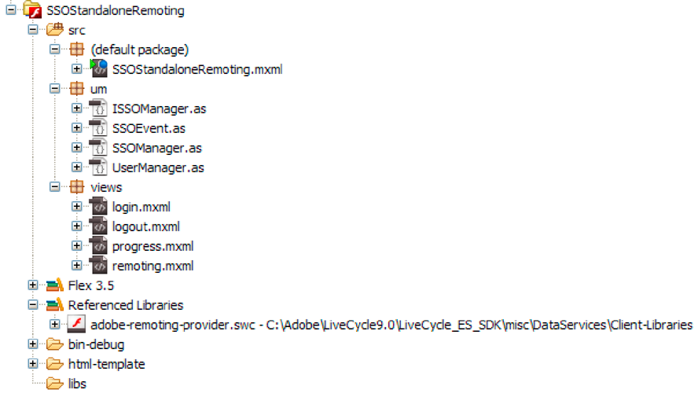

# HTTP トークンを使用した SSO 認証を実行する Flash Builder アプリケーションの作成 {#creating-flash-builder-applicationsthat-perform-sso-authentication-using-http-tokens}

**このドキュメントのサンプルと例は、JEE 環境の AEM Forms のみを対象としています。**

HTTP トークンを使用してシングルサインオン（SSO）認証を実行する Flash Builder を使用し、クライアントアプリケーションを作成できます。例えば、Flash Builder を使用して web ベースのアプリケーションを作成する場合を考えてみましょう。次に、アプリケーションに異なるビューが含まれ、各ビューが異なる AEM Forms 操作を呼び出すと仮定します。各 Forms 操作でユーザーを認証する代わりに、1 回でユーザーを認証できるログインページを作成できます。認証が完了すると、ユーザーは再度認証を行わなくても複数の操作を呼び出すことができます。例えば、ユーザーがワークスペース（または別の Forms アプリケーション）にログインした場合、そのユーザーを再認証する必要はありません。

クライアントアプリケーションには SSO 認証を実行するために必要なアプリケーションロジックが含まれていますが、AEM Forms User Management は実際のユーザー認証を実行します。HTTP トークンを使用してユーザーを認証するために、クライアントアプリケーションは Authentication Manager サービスの `authenticateWithHTTPToken` 操作を実行します。User Management は、HTTP トークンを使用してユーザーを認証できます。その後の AEM Forms へのリモートまたは web サービス呼び出しでは、認証用の資格情報を渡す必要はありません。

>[!NOTE]
>
>この節を読む前に、Remoting を使用した AEM Forms の呼び出しに関する詳細を理解しておくことをお勧めします。（[AEM Forms Remoting を使用した AEM Forms の呼び出し](/help/forms/developing/invoking-aem-forms-using-remoting.md#invoking-aem-forms-using-remoting)を参照。）

次の AEM Forms の短時間のみ有効なプロセスは `MyApplication/EncryptDocument` と呼ばれ、SSO を使用してユーザーが認証された後に呼び出されます。（このプロセスの入力値や出力値などについて詳しくは、[短時間のみ有効なプロセスの例](/help/forms/developing/aem-forms-processes.md)を参照。）


>[!NOTE]
>
>このプロセスは、既存の AEM Forms プロセスに基づいていません。このプロセスを呼び出す方法を説明するコード例に従うには、ワークベンチを使用して `MyApplication/EncryptDocument` という名前のプロセスを作成します。（[Workbench の使用](https://www.adobe.com/go/learn_aemforms_workbench_63_jp)を参照。）

Flash Builder を使用して構築されたクライアントアプリケーションは、`/um/login` および `/um/logout` で設定された User Manager のセキュリティサーブレットとやり取りします。つまり、クライアントアプリケーションは、 起動時に `/um/login` の URL へリクエストを送り、ユーザーのステータスを判断します。次に、User Manager はユーザーステータスで応答します。クライアントアプリケーションと User Manager のセキュリティサーブレットは、HTTP を使用して通信します。

**リクエストの形式**

セキュリティサーブレットには、次の入力変数が必要です。

* `um_no_redirect` - この値は、`true` である必要があります。この変数は、User Manager セキュリティサーブレットに対して行われたすべての要求に付随します。これはまたセキュリティサーブレットが、Flex クライアントや他の web アプリケーションからの受信リクエストを区別するのに役立ちます。
* `j_username` - この値は、ログインフォームで指定されたユーザーのログイン識別子の値です。
* `j_password` - この値は、ログインフォームで指定されたユーザーの対応するパスワードです。

この `j_password` の値は、資格情報リクエストに対してのみ必要です。パスワードの値が指定されていない場合、セキュリティサーブレットは、使用しているアカウントが既に認証されているかどうかを確認します。その場合は、作業を継続できます。ただし、セキュリティサーブレットは、再認証を行いません。

>[!NOTE]
>
>i18n を適切に処理するには、これらの値が POST 形式であることを確認してください。

**応答形式**

`/um/login` に設定されたセキュリティサーブレットは、`URLVariables` 形式を使って応答します。この形式では、コンテンツタイプの出力は text/plain です。出力には、名前と値のペアをアンパサンド (&amp;) 文字で区切って含めます。応答には次の変数が含まれます。

* `authenticated` - 値は、`true` または `false` です。
* `authstate` - この値には、次のいずれかの値を含めることができます。

   * `CREDENTIAL_CHALLENGE` - この状態は、User Manager がどの方法でもユーザーの ID を特定できないことを示します。認証を行うには、ユーザーのユーザー名とパスワードが必要です。
   * `SPNEGO_CHALLENGE` - この状態は `CREDENTIAL_CHALLENGE` と同じ扱いになります。
   * `COMPLETE` - この状態は、User Manager がユーザーを認証できることを示します。
   * `FAILED` - この状態は、User Manager がユーザーを認証できなかったことを示します。この状態への応答として、Flex クライアントはユーザーにエラーメッセージを表示できます。
   * `LOGGED_OUT` - この状態は、ユーザーが正常にログアウトしたことを示します。

* `assertionid` - 状態が `COMPLETE` の場合、ユーザーの `assertionId` の値を含みます。クライアントアプリケーションは、ユーザーのために `AuthResult` を取得できます。

**ログインプロセス**

クライアントアプリケーションの起動時に、 `/um/login` セキュリティサーブレットに対して POST リクエストを行うことができます。例えば、`https://<your_serverhost>:<your_port>/um/login?um_no_redirect=true` のようになります。リクエストが User Manager セキュリティサーブレットに到達すると、次の手順が実行されます。

1. `lcAuthToken` という名前の Cookie を検索します。ユーザーが既に別の Forms アプリケーションにログインしている場合、この Cookie が表示されます。Cookie が見つかった場合は、そのコンテンツは検証されます。
1. ヘッダーベースの SSO が有効な場合、サーブレットは設定済みのヘッダーを探してユーザーの ID を決定します。
1. SPNEGO が有効な場合、サーブレットは SPNEGO を開始を試み、ユーザーの ID 決定を試みます。

セキュリティサーブレットがユーザーに一致する有効なトークンを見つけた場合、セキュリティサーブレットはユーザーを続行させ、`authstate=COMPLETE` で応答します。それ以外の場合、セキュリティサーブレットは `authstate=CREDENTIAL_CHALLENGE` で応答します。次のリストで、これらの値を説明します。

* `Case authstate=COMPLETE`：ユーザーが認証され、`assertionid` 値には、ユーザーのアサーション識別子が含まれます。この段階で、クライアントアプリケーションは AEM Forms に接続できます。この URL 用に設定されたサーブレットは、`AuthenticationManager.authenticate(HttpRequestToken)` メソッドを呼び出して、ユーザーの `AuthResult` を取得できます。`AuthResult` インスタンスは、User Manager コンテキストを作成し、セッションに保存できます。
* `Case authstate=CREDENTIAL_CHALLENGE`：セキュリティサーブレットがユーザーの資格情報を必要とすることを示します。応答として、クライアントアプリケーションはログイン画面をユーザーに表示し、取得した資格情報をセキュリティサーブレットに送信できます（例： `https://<your_serverhost>:<your_port>/um/login?um_no_redirect=true&j_username=administrator&j_password=password)`）。認証に成功した場合、セキュリティサーブレットは `authstate=COMPLETE` で応答します。

それでも認証が成功しない場合、セキュリティサーブレットは`authstate=FAILED`で応答をします。この値に応答するために、クライアントアプリケーションでメッセージが表示され、資格情報を再度取得します。

>[!NOTE]
>
>`authstate=CREDENTIAL_CHALLENGE` の間は、クライアントが取得した資格情報を POST 形式でセキュリティサーブレットに送信することをお勧めします。

**ログアウトプロセス**

クライアントアプリケーションがログアウトする際に、次の URL にリクエストを送信できます。

`https://<your_serverhost>:<your_port>/um/logout?um_no_redirect=true`

このリクエストを受け取ると、User Manager セキュリティサーブレットは `lcAuthToken` Cookie を削除し、`authstate=LOGGED_OUT` と応答します。この値を受け取ったクライアントアプリケーションは、クリーンアップタスクを実行できます。

## SSO を使用した AEM Forms ユーザーを認証するクライアントアプリケーションの作成 {#creating-a-client-application-that-authenticates-aem-forms-users-using-sso}

SSO 認証を実行するクライアントアプリケーションの作成方法を示すために、サンプルのクライアントアプリケーションが作成されます。次の図は、SSO を使用してユーザーを認証するためにクライアントアプリケーションが実行する手順を示しています。


前述の図は、クライアントアプリケーションの起動時に発生するアプリケーションフローを示しています。

1. クライアントアプリケーションは、`applicationComplete` イベントをトリガーします。
1. `ISSOManager.singleSignOn` への呼び出しが実行されました。クライアントアプリケーションは、User Manager セキュリティサーブレットにリクエストを送信します。
1. セキュリティサーブレットがユーザーを認証する場合、`ISSOManager` は `SSOEvent.AUTHENTICATION_SUCCESS` をディスパッチします。応答として、クライアントアプリケーションにメインページが表示されます。この例では、メインページが MyApplication/EncryptDocument という名前の AEM Forms の短時間のみ有効なプロセスを呼び出します。
1. セキュリティサーブレットがユーザーが有効かどうかを判断できない場合は、アプリケーションはユーザー資格情報を再度要求してください。`ISSOManager` クラスは `SSOEvent.AUTHENTICATION_REQUIRED` イベントをディスパッチします。クライアントアプリケーションにログインページが表示されます。
1. ログインページで提供された資格情報が `ISSOManager.login` メソッドに送信されます。認証が成功した場合は、ステップ 3 に進みます。それ以外の場合は、`SSOEvent.AUTHENTICATION_FAILED` イベントがトリガーされます。クライアントアプリケーションにログインページと適切なエラーメッセージが表示されます。

### クライアントアプリケーションの作成 {#creating-the-client-application}

クライアントアプリケーションは、次のファイルで構成されます。

* `SSOStandalone.mxml`：クライアントアプリケーションを表すメインの MXML ファイルです。（[SSOStandalone.mxml ファイルの作成](creating-flash-builder-applications-perform.md#creating-the-ssostandalone-mxml-file)を参照）。
* `um/ISSOManager.as`：シングルサインオン（SSO）に関連する操作を公開します。（[ISSOManager.as ファイルの作成](creating-flash-builder-applications-perform.md#creating-the-issomanager-as-file)を参照。）
* `um/SSOEvent.as`：`SSOEvent` は、SSO 関連のイベントに対してディスパッチされます。（[SSOEvent.as ファイルの作成](creating-flash-builder-applications-perform.md#creating-the-ssoevent-as-file)を参照。）
* `um/SSOManager.as`：SSO 関連の操作を管理し、適切なイベントをディスパッチします。（[SSOManager.as ファイルの作成](creating-flash-builder-applications-perform.md#creating-the-ssomanager-as-file)を参照。）
* `um/UserManager.as`：WSDL を使用して Authentication Manager サービスを呼び出すアプリケーションロジックが含まれます。（[UserManager.as ファイルの作成](creating-flash-builder-applications-perform.md#creating-the-usermanager-as-file)を参照。）
* `views/login.mxml`：ログイン画面を表します。（[login.mxml ファイルの作成](creating-flash-builder-applications-perform.md#creating-the-login-mxml-file)を参照。）
* `views/logout.mxml`：ログアウト画面を表します。（[logout.mxml ファイルの作成](creating-flash-builder-applications-perform.md#creating-the-logout-mxml-file)を参照。）
* `views/progress.mxml`：進行状況ビューを表します。（[progress.mxml ファイルの作成](creating-flash-builder-applications-perform.md#creating-the-progress-mxml-file)を参照。）
* `views/remoting.mxml`：リモート処理を使用して MyApplication/EncryptDocument という名前の AEM Forms の短時間のみ有効なプロセスを呼び出すビューを表します。（[remoting.mxml ファイルの作成](creating-flash-builder-applications-perform.md#creating-the-remoting-mxml-file)を参照。）

次の図は、クライアントアプリケーションを視覚的に表したものです。



>[!NOTE]
>
>um と views という名前の 2 つのパッケージがあることに注意してください。クライアントアプリケーションを作成する場合は、ファイルを適切なパッケージに配置することを確認します。また、adobe-remoting-provider.swc ファイルをプロジェクトのクラスパスに追加することを確認します。（[AEM Forms Flex ライブラリファイルを含める](/help/forms/developing/invoking-aem-forms-using-remoting.md#including-the-aem-forms-flex-library-file)を参照。）

### SSOStandalone.mxml ファイルの作成 {#creating-the-ssostandalone-mxml-file}

次のコードは、SSOStandalone.mxml ファイルを表します。

```xml
 <?xml version="1.0" encoding="utf-8"?>
 <mx:Application
                 layout="absolute"
                 applicationComplete="initApp()"
                 height="400" width="550"
                 xmlns:v="views.*"
                 backgroundColor="#EDE8F0" viewSourceURL="srcview/index.html">
     <mx:Script>
         <![CDATA[
             import mx.utils.URLUtil;
             import um.SSOEvent;
             import mx.core.UIComponent;
             import um.SSOManager;
             import mx.rpc.events.ResultEvent;
             import mx.utils.ObjectUtil;
             import mx.controls.Alert;
 
             [Bindable]
             private var _serverURL:String;
 
             private var _ssoManager:SSOManager;
 
             private var _progress:UIComponent;
 
             private var _loginPage:UIComponent;
 
             private function initApp():void{
                 _serverURL = determineServerUrl();
                 _ssoManager = new SSOManager(_serverURL);
 
                 _ssoManager.addEventListener(SSOEvent.AUTHENTICATION_FAILED,loginHandler);
                 _ssoManager.addEventListener(SSOEvent.AUTHENTICATION_SUCCESS,loginHandler);
                 _ssoManager.addEventListener(SSOEvent.AUTHENTICATION_REQUIRED,loginHandler);
                 _ssoManager.addEventListener(SSOEvent.LOGOUT_COMPLETE,loginHandler);
                 _ssoManager.addEventListener(SSOEvent.AUTHENTICATION_FAULT,loginHandler);
 
                 trace("[Main] Add the required event handlers for authentication");
                 _ssoManager.singleSignOn();
 
                 showBusy();
             }
 
             private function determineServerUrl():String
             {
                 var s:String ;
                 var appUrl:String = Application.application.url;
                 var givenUrl:String  = ExternalInterface.call("serverUrl.toString");
                 trace("[Main] Application url ["+appUrl+"] Given url ["+givenUrl+"]");
                 if(appUrl != null && appUrl.search("^http") != -1){
                     s = appUrl;
                 }
                 if(s == null){
                     s = givenUrl;
                 }
                 if(s== null){
                     s = "https://hiro-xp:8080/";
                 }
                 s = URLUtil.getFullURL(s,"/");
                 trace("[Main] Would be using ["+s+"] as serverUrl");
                 return s;
             }
 
             private function loginHandler(event:SSOEvent):void
             {
                 trace("[Main] Handling event "+event.type);
                 switch(event.type)
                 {
                     case SSOEvent.AUTHENTICATION_FAILED:
                         viewContent.selectedChild = login;
                         login.showLoginFailed();
                         break;
                     case SSOEvent.AUTHENTICATION_SUCCESS:
                         viewContent.selectedChild = remoting;
                         break;
                     case SSOEvent.AUTHENTICATION_REQUIRED:
                         viewContent.selectedChild = login;
                         break;
                     case SSOEvent.LOGOUT_COMPLETE:
                         viewContent.selectedChild = logout;
                         break;
                     case SSOEvent.AUTHENTICATION_FAULT:
                         Alert.show("Error doing authentication. Root error ["+event.rootEvent+"]","Authentication Fault",Alert.OK);
                 }
             }
 
             public function get ssoManager():SSOManager
             {
                 return _ssoManager;
             }
 
             public function showBusy():void
             {
                 viewContent.selectedChild = progress;
             }
 
             public function get serverUrl():String
             {
                 return _serverURL;
             }
 
         ]]>
     </mx:Script>
     <mx:ViewStack x="0" y="0" id="viewContent" >
         <v:login id="login" />
         <v:remoting id="remoting"  />
         <v:progress id="progress" />
         <v:logout id="logout"/>
     </mx:ViewStack>
 </mx:Application>
 
```

### ISSOManager.as ファイルの作成 {#creating-the-issomanager-as-file}

次のコードは、ISSOManager.as ファイルを表します。

```java
 package um
 {
     import flash.events.IEventDispatcher;
 
     /**
      * The <code>ISSOManager</code> expose operations related to Single Sign On (SSO) in AEM Forms
      * environment. The application should register appropriate <code>SSOEvent</code> handlers prior
      * to calling any of the following operations
      */
     public interface ISSOManager extends IEventDispatcher
     {
         /**
          * Tries to validate whether the user has an already existing session or not (SSO Scenarios). The application
          * may call this method during the initialization. In general this call would lead to one of the
          * following events getting dispatched
          * <ul>
          * <li>SSOEvent.AUTHENTICATION_SUCCESS - If a SSO session was found and valid
          * <li>SSOEvent.AUTHENTICATION_REQUIRED - No SSO session was found and as such authentication is required in
          * the form of username and password.
          * <li>SSOEvent.AUTHENTICATION_FAULT - Some error has occured while connecting to the server
          * </ul>
          */
         function singleSignOn():void;
 
         /**
          * Authenticates the user using username and password. It may lead to one of the following events
          * <ul>
          * <li>SSOEvent.AUTHENTICATION_SUCCESS - The authentication is successful and a session is established
          * <li>SSOEvent.AUTHENTICATION_FAILED - Authentication has failed
          * </ul>
          */
         function login(username:String, password:String):void;
 
         /**
          * Terminates the current session and logs out the user.
          */
         function logout():void;
 
         /**
          * Get the assertionId for the logged in user
          */
         function get assertionId():String;
     }
 }
```

### SSOEvent.as ファイルの作成 {#creating-the-ssoevent-as-file}

次のコードは、SSOEvent.as ファイルを表します。

```java
 package um
 {
     import flash.events.Event;
 
     /**
      * The <code>SSOEvent</code> is dispatched for SSO related events
      */
     public class SSOEvent extends Event
     {
         /**
          * This type of event would be dispatched when the Authentication process is successful. Authentication
          * might have been done with SSO or username and password. As a response to this event the application
          * can show the welcome page to the user
          * The application may want to perform specific check for permission/role so as to verify the user is allowed.
          * So as a response to this event the application would do those checks and then only show the welcome page
          */
         public static const AUTHENTICATION_SUCCESS:String = "authenticationSuccess";
 
         /**
          * This type of event would be dispatched when authentication fails using the username, password.
          * As a response to this type of event an application can show an error message to the user.
          * This event would only happen when authentication is done using username and password and NOT in
          * SSO case.
          */
         public static const AUTHENTICATION_FAILED:String = "authenticationFailed";
 
         /**
          * This type of event would be dispatched when authentication using SSO is not achieved. And due to
          * that we require the user's username and password for authentication. As a response to this event
          * the application can show the login page to the user.
          */
         public static const AUTHENTICATION_REQUIRED:String = "authenticationRequired";
 
         /**
          * This type of event would be dispatched when logout is complete. As a response to this event the
          * application may show a logout page informing the user that he has been logged out. Or the application
          * can take the user back to login page
          */
         public static const LOGOUT_COMPLETE:String = "logoutComplete";
 
         /**
          * This type of event would be dispatched when ever there is a problem in doing Authentication. The root cause
          * can be obtained from the <code>rootEvent</code>.
          */
         public static const AUTHENTICATION_FAULT:String = "authenticationFault";
 
         private var _rootEvent:Event;
 
         public function SSOEvent(type:String, rootEvent:Event=null)
         {
             super(type,true,false);
             _rootEvent = rootEvent;
         }
 
         /**
          * The root event. If current event type is <code>AUTHENTICATION_FAULT</code> then it would be an
          * <code>IOErrorEvent</code> in other cases it would be complete event. Its basic use is to extract the root
          * cause in case of an authentication fault.
          */
         public function get rootEvent():Event
         {
             return _rootEvent;
         }
     }
 }
```

### SSOManager.as ファイルの作成 {#creating-the-ssomanager-as-file}

次のコードは、SSOManager.as ファイルを表します。

```java
 package um
 {
     import flash.events.Event;
     import flash.events.EventDispatcher;
     import flash.events.IOErrorEvent;
     import flash.external.ExternalInterface;
     import flash.net.URLLoader;
     import flash.net.URLLoaderDataFormat;
     import flash.net.URLRequest;
     import flash.net.URLVariables;
 
     import mx.utils.ObjectUtil;
 
     /**
      * Manages the SSO related operations and dispatches appropriate events. It would connect to the UM Filter/Servlet
      * at <code>um/login</code> The UM response would be of form of url encoded variables. It would look for
      * <code>authstate</code> value in the response and depending on that it would proceed.
      *
      * <p>If there is an IO_Error while initial attempt to UM then it would assume it as a 401 response. And it would
      * be assumed that SPNEGO based authenticatin is not working and therefore user would be shown a login page.
      */
     public class SSOManager extends EventDispatcher implements ISSOManager
     {
         private static const SSO_URL:String = "um/login";
         private static const SSO_LOGOUT_URL:String = "um/logout";
         private static const AUTH_COOKIE_NAME:String = "lcAuthToken";
 
         private var _serverUrl:String;
         private var _assertionId:String;
 
         /**
          * Constructs an SSOManager with the given server url.
          *
          * @param serverUrl - The uri of the server to connect to. it must be without any context path e.g
          * http://localhost:8080/. The SSOManager would directly append the path of UM exposed SSO url to it
          * for its operations
          */
         public function SSOManager(serverUrl:String)
         {
             _serverUrl = serverUrl;
         }
 
         public function singleSignOn():void
         {
             sendRequest(SSO_URL,true);
         }
 
         public function login(username:String, password:String):void
         {
             sendRequest(SSO_URL,false,
                 function(request:URLRequest,vars:URLVariables):void
                 {
                     vars.j_username = username;
                     vars.j_password = password;
                 }
             );
         }
 
         public function logout():void
         {
             sendRequest(SSO_LOGOUT_URL);
         }
 
         public function get assertionId():String
         {
             return _assertionId;
         }
 
 
 
         /**
          * Connects to the UM security service.
          */
         private function sendRequest(relativeUrl:String,authenticationRequest:Boolean=false, requestProcessor:Function=null):void
         {
             var loader:URLLoader = new URLLoader();
             loader.dataFormat = URLLoaderDataFormat.VARIABLES;
             var request:URLRequest = new URLRequest(_serverUrl + relativeUrl);
             trace("[SSOmanager] Contacting ["+request.url+"]");
             var vars:URLVariables = new URLVariables();
             vars.um_no_redirect = "true";
             request.data = vars;
             if(requestProcessor != null){
                 requestProcessor(request,vars);
             }
 
             loader.addEventListener(Event.COMPLETE,authHandler);
             //if its an authentication request then only treat io error as a possible 401
             //for others treat them as faults
             if(authenticationRequest){
                 loader.addEventListener(IOErrorEvent.IO_ERROR,httpAuthenticationHandler);
             }else{
                 loader.addEventListener(IOErrorEvent.IO_ERROR,authFaultHandler);
             }
             trace("[SSOmanager] Sending request "+ ObjectUtil.toString(request));
             loader.load(request);
         }
 
         private function authHandler(event:Event):void
         {
             var loader:URLLoader = URLLoader(event.target);
             var response:URLVariables = URLVariables(loader.data);
             trace("[SSOmanager] Processing response ["+ObjectUtil.toString(response)+"]");
             handleAuthResult(response["authstate"],response);
         }
 
         /**
          * Handles the IOErrorEvent. Flash would dispatch IOEvent in response to HTTP 401.
          * There is no way to distinguish it from the genuine IOError.
          */
         private function httpAuthenticationHandler(event:IOErrorEvent):void
         {
             trace("[SSOmanager] Processing IOErrorEvent ["+ObjectUtil.toString(event)+"]");
             handleAuthResult("CREDENTIAL_CHALLENGE");
 
         }
 
         /**
          * Dispatches appropriate <code>SSOEvent</code> on the basis of the <code>authstate</code>
          * value of the response.
          * The response is url encoded in for of
          * <pre>
          * authenticated=false&authstate=SPNEGO_CHALLENGE
          * </pre>
          * Depending on <code>authstate</code> the SSOEvent is dispatched
          */
         private function handleAuthResult(authState:String,response:URLVariables = null):void
         {
             trace("[SSOmanager] processing state "+authState);
             switch(authState)
             {
                 case "FAILED"  :
                     dispatchEvent(new SSOEvent(SSOEvent.AUTHENTICATION_FAILED));
                     break;
                 case "COMPLETE" :
                     _assertionId = response ? response["assertionid"] : null;
                     dispatchEvent(new SSOEvent(SSOEvent.AUTHENTICATION_SUCCESS));
                     break;
                 case "CREDENTIAL_CHALLENGE" :
                     dispatchEvent(new SSOEvent(SSOEvent.AUTHENTICATION_REQUIRED));
                     break;
                 case "LOGGED_OUT" :
                     dispatchEvent(new SSOEvent(SSOEvent.LOGOUT_COMPLETE));
                     break;
                 default:
                     dispatchEvent(new SSOEvent(SSOEvent.AUTHENTICATION_REQUIRED));
                     break;
             }
         }
 
         private function authFaultHandler(event:Event):void
         {
             dispatchEvent(new SSOEvent(SSOEvent.AUTHENTICATION_FAULT,event));
         }
 
     }
 }
```

### UserManager.as ファイルの作成 {#creating-the-usermanager-as-file}

次のコードは、UserManager.as ファイルを表します。

```java
 package um
 {
     import flash.events.Event;
     import mx.rpc.soap.WebService;
     import mx.rpc.soap.Operation;
     import mx.rpc.IResponder;
     import mx.rpc.events.FaultEvent;
     import mx.rpc.events.ResultEvent;
     import mx.rpc.soap.LoadEvent;
 
     public class UserManager
     {
         private var _ssoManager:ISSOManager;
         private var _serverUrl:String;
 
         public function UserManager(ssoManager:ISSOManager,serverUrl:String)
         {
             _serverUrl = serverUrl;
             _ssoManager = ssoManager;
         }
 
         public function retrieveAssertion(responder:IResponder):String
         {
             var assertionId:String = _ssoManager.assertionId;
             if(!assertionId)
             {
                 trace("[UserManager] AssertionId not found");
                 return null;
             }
 
             var ws:WebService = new WebService();
             var wsdl:String = _serverUrl+'soap/services/AuthenticationManagerService?wsdl&lc_version=8.2.1';
             ws.loadWSDL(wsdl);
             ws.addEventListener(LoadEvent.LOAD,
                 function(event:Event):void
                 {
                     trace("[UserManager] WSDL loaded");
                     var authenticate:Operation = ws.authenticateWithHttpToken as Operation;
                     authenticate.resultFormat = "e4x";
                     authenticate.addEventListener(ResultEvent.RESULT,
                         function(event:Event):void
                         {
                             responder.result(event);
                         }
                     );
                     authenticate.send({assertionId:assertionId});
                 }
             );
 
             ws.addEventListener(FaultEvent.FAULT,
                 function(event:Event):void
                 {
                     responder.fault(event);
                 }
             );
             return null;
         }
     }
 }
```

### login.mxml ファイルの作成 {#creating-the-login-mxml-file}

次のコードは、 login.mxml ファイルを表します。

```xml
 <?xml version="1.0" encoding="utf-8"?>
 <mx:Canvas  width="500" height="400">
     <mx:Script>
         <![CDATA[
             import mx.core.Application;
             public function showLoginFailed():void
             {
                 loginMessage.text = "Username or Password incorrect";
             }
 
             private function doLogin():void
             {
                 Application.application.ssoManager.login(j_username.text,j_password.text);
                 Application.application.showBusy();
             }
 
         ]]>
     </mx:Script>
 
     <mx:VBox height="113" width="244" x="128" y="144" horizontalAlign="center" verticalGap="10">
         <mx:HBox width="100%">
             <mx:HBox width="100%" verticalAlign="middle" horizontalAlign="center" height="32">
                 <mx:Label text="Username" fontWeight="bold"/>
                 <mx:TextInput id="j_username"/>
             </mx:HBox>
         </mx:HBox>
         <mx:HBox width="100%" height="33" horizontalAlign="center" horizontalGap="10" verticalAlign="middle">
             <mx:Label text="Password" fontWeight="bold"/>
             <mx:TextInput displayAsPassword="true" id="j_password"/>
         </mx:HBox>
         <mx:Button label="Login" click="doLogin()"/>
     </mx:VBox>
     <mx:Text x="128" y="122" id="loginMessage" width="230" height="14"/>
     <mx:Label x="154" y="65" text="AEM Forms SSO Demo" fontFamily="Georgia" fontSize="20" color="#0A0A0A"/>
 </mx:Canvas>
 
```

### logout.mxml ファイルの作成 {#creating-the-logout-mxml-file}

次のコードは、 logout.mxml ファイルを表します。

```xml
 <?xml version="1.0" encoding="utf-8"?>
 <mx:Canvas  width="500" height="400">
     <mx:Label x="97" y="188" text="You have successfully logged out from the application"/>
 
 </mx:Canvas>
 
```

### progress.mxml ファイルの作成 {#creating-the-progress-mxml-file}

次のコードは、progress.mxml ファイルを表します。

```xml
 <?xml version="1.0" encoding="utf-8"?>
 <mx:Canvas >
     <mx:Label x="151" y="141" text="Wait...."/>
     <mx:SWFLoader source="LoadingCircle.swf" width="50" height="50" horizontalCenter="0" verticalCenter="0"/>
 </mx:Canvas>
```

### remoting.mxml ファイルの作成 {#creating-the-remoting-mxml-file}

次のコードは、`MyApplication/EncryptDocument` プロセスを呼び出す remoting.mxml ファイルを表します。ドキュメントがプロセスに渡されるので、セキュアなドキュメントを AEM Forms に渡すためのアプリケーションロジックは、このファイルに配置されます。（[リモート処理を使用したプロセスを呼び出すためのセキュアなドキュメントの受け渡し](/help/forms/developing/invoking-aem-forms-using-remoting.md#passing-secure-documents-to-invoke-processes-using-remoting)を参照。）

```xml
 <?xml version="1.0" encoding="utf-8"?>
 <mx:Canvas  width="664" height="400" creationComplete="initializeChannelSet()" xmlns:views="views.*">
     <mx:Script>
 
         <![CDATA[
 
             import mx.rpc.livecycle.DocumentReference;
             import flash.net.FileReference;
             import flash.net.URLRequest;
             import flash.events.Event;
             import flash.events.DataEvent;
             import mx.messaging.ChannelSet;
             import mx.messaging.channels.AMFChannel;
             import mx.rpc.events.ResultEvent;
             import mx.collections.ArrayCollection;
             import mx.rpc.AsyncToken;
             import um.UserManager;
             import mx.rpc.events.ResultEvent;
             import mx.rpc.events.FaultEvent;
             import mx.core.Application;
             import mx.rpc.Responder;
             import mx.utils.ObjectUtil;
 
             // Classes used in file retrieval
             private var fileRef:FileReference = new FileReference();
             private var docRef:DocumentReference = new DocumentReference();
             private var parentResourcePath:String = "/";
             //private var serverPort:String = "'[server]:[port]'";
             private var serverPort:String = "'[server]:[port]'";
             private var now1:Date;
             private var userManager:UserManager;
 
             // Define a ChannelSet object.
             public var cs:ChannelSet;
 
             // Holds information returned from AEM Forms
             [Bindable]
             public var progressList:ArrayCollection = new ArrayCollection();
 
 
             // Set up channel set to invoke AEM Forms.
             // This must be done before calling any service or process, but only
             // once for the entire application.
             private function initializeChannelSet():void {
                 cs = new ChannelSet();
                 cs.addChannel(new AMFChannel("remoting-amf", "https://" + serverPort + "/remoting/messagebroker/amf"));
                 EncryptDocument.channelSet = cs;
 
             //Get the user that is authenticated
             userManager = new UserManager(Application.application.ssoManager,Application.application.serverUrl);
             userManager.retrieveAssertion(
                     new mx.rpc.Responder(
                         function(event:ResultEvent):void
                         {
                             var name:String = XML(event.currentTarget.lastResult)..*::authenticatedUser.*::userid.text();
                             username.text = "Welcome "+name;
                         },
                         function(event:FaultEvent):void
                         {
                             mx.controls.Alert.show(event.fault.faultString,'Error')
                         }
                     )
                 );
 
             }
 
             // Call this method to upload the file.
             // This creates a file picker and lets the user select a PDF file to pass to the EncryptDocument process.
             private function uploadFile():void {
                 fileRef.addEventListener(Event.SELECT, selectHandler);
                 fileRef.addEventListener(DataEvent.UPLOAD_COMPLETE_DATA,completeHandler);
                 fileRef.browse();
             }
 
             // Gets called for selected file. Does the actual upload via the file upload servlet.
             private function selectHandler(event:Event):void {
                 var authTokenService:RemoteObject = new RemoteObject("LC.FileUploadAuthenticator");
                 authTokenService.addEventListener("result", authTokenReceived);
                 authTokenService.channelSet = cs;
                 authTokenService.getFileUploadToken();
             }
 
             private function authTokenReceived(event:ResultEvent):void
             {
                 var token:String = event.result as String;
                 var request:URLRequest = DocumentReference.constructRequestForUpload("https://hiro-xp:8080", token);
 
                 try
                 {
                     fileRef.upload(request);
                 }
                 catch (error:Error)
                 {
                     trace("Unable to upload file.");
                 }
             }
 
             // Called once the file is completely uploaded.
             private function completeHandler(event:DataEvent):void {
 
                 // Set the docRefs url and referenceType parameters
                 docRef.url = event.data as String;
                 docRef.referenceType=DocumentReference.REF_TYPE_URL;
                 executeInvokeProcess();
             }
 
             //This method invokes the EncryptDocument process
             public function executeInvokeProcess():void {
                 //Create an Object to store the input value for the EncryptDocument process
                 now1 = new Date();
 
                 var params:Object = new Object();
                 params["inDoc"]=docRef;
 
                 // Invoke the EncryptDocument process
                 var token:AsyncToken;
                 token = EncryptDocument.invoke(params);
                 token.name = name;
             }
 
 
             // This method handles a successful conversion invocation
             public function handleResult(event:ResultEvent):void
             {
 
                 //Retrieve information returned from the service invocation
                 var token:AsyncToken = event.token;
                 var res:Object = event.result;
                 var dr:DocumentReference = res["outDoc"] as DocumentReference;
                 var now2:Date = new Date();
 
                 // These fields map to columns in the DataGrid
                 var progObject:Object = new Object();
                 progObject.filename = token.name;
                 progObject.timing = (now2.time - now1.time).toString();
                 progObject.state = "Success";
                 progObject.link = "<a href='" + dr.url + "'> open </a>";
                 progressList.addItem(progObject);
             }
 
 
             private function resultHandler(event:ResultEvent):void {
             // Do anything else here.
 
             }
 
             private function logout():void
             {
                 Application.application.ssoManager.logout();
                 Application.application.showBusy();
             }
 
 
         ]]>
 
     </mx:Script>
 
     <mx:RemoteObject id="EncryptDocument" destination="MyApplication/EncryptDocument" result="resultHandler(event);">
             <mx:method name="invoke" result="handleResult(event)"/>
     </mx:RemoteObject>
 
 
     <!--//This consists of what is displayed on the webpage-->
     <mx:Panel id="lcPanel" title="EncryptDocument  (Deprecated for AEM forms) AEM Forms Remoting Example"
           height="25%" width="25%" paddingTop="10" paddingLeft="10" paddingRight="10"
           paddingBottom="10">
         <mx:Label width="100%" color="blue"
                   id="username"/>
 
         <mx:DataGrid x="10" y="0" width="500" id="idProgress" editable="false"
                          dataProvider="{progressList}" height="231" selectable="false" >
         <mx:columns>
                 <mx:DataGridColumn headerText="Filename" width="200" dataField="filename" editable="false"/>
                 <mx:DataGridColumn headerText="State" width="75" dataField="state" editable="false"/>
                 <mx:DataGridColumn headerText="Timing" width="75" dataField="timing" editable="false"/>
                 <mx:DataGridColumn headerText="Click to Open" dataField="link" editable="false" >
                 <mx:itemRenderer>
 
                         <mx:Component>
                         <mx:Text x="0" y="0" width="100%" htmlText="{data.link}"/>
                         </mx:Component>
                     </mx:itemRenderer>
             </mx:DataGridColumn>
         </mx:columns>
     </mx:DataGrid>
     <mx:Button label="Select File" click="uploadFile()" />
     <mx:Button label="Logout"  click="logout()" />
     </mx:Panel>
 </mx:Canvas>
 
 
```

### 追加情報 {#additional-information}

次の節では、クライアントアプリケーションと User Manager セキュリティサーブレット間の通信に関する追加詳細を説明します。

### 新しい認証が発生 {#a-new-authentication-occurs}

この状況で、ユーザーはクライアントアプリケーションから AEM Forms に初めてログインしようとします。（このユーザーが関与する以前のセッションは存在しません。）`applicationComplete` イベントでは、`SSOManager.singleSignOn` メソッドが呼び出され、User Manager にリクエストが送信されます。

`GET /um/login?um%5Fno%5Fredirect=true HTTP/1.1`

User Manager セキュリティサーブレットは、次の値で応答します。

`HTTP/1.1 200 OK`

`authenticated=false&authstate=CREDENTIAL_CHALLENGE`

この値に対する応答として、`SSOEvent.AUTHENTICATION_REQUIRED` の値がディスパッチされます。その結果、クライアントアプリケーションはユーザーに対してログイン画面を表示します。資格情報が User Manager セキュリティサーブレットに送り返されます。

`GET /um/login?um%5Fno%5Fredirect=true&j%5Fusername=administrator&j%5Fpassword=password HTTP/1.1`

User Manager セキュリティサーブレットは、次の値で応答します。

```verilog
 HTTP/1.1 200 OK
 Set-Cookie: lcAuthToken=53630BC8-F6D4-F588-5D5B-4668EFB2EC7A; Path=/
 authenticated=true&authstate=COMPLETE&assertionid=53630BC8-F6D4-F588-5D5B-4668EFB2EC7A
```

その結果、 `authstate=COMPLETE the SSOEvent.AUTHENTICATION_SUCCESS` がディスパッチされます。クライアントアプリケーションは、必要に応じてさらに処理を実行できます。例えば、ユーザーが認証された日時を追跡するログを作成できます。

### ユーザーは既に認証済みです {#the-user-is-already-authenticated}

この場合、ユーザーは既に AEM Forms にログインしており、次にクライアントアプリケーションに移動します。クライアントアプリケーションは、起動時に User Manager セキュリティサーブレットに接続します。

```verilog
 GET /um/login?um%5Fno%5Fredirect=true HTTP/1.1
 Cookie: JSESSIONID=A4E0BCC2DD4BCCD3167C45FA350BD72A; lcAuthToken=53630BC8-F6D4-F588-5D5B-4668EFB2EC7A
```

ユーザーは既に認証されているので、User Manager Cookie が存在し、User Manager セキュリティサーブレットに送信されます。次にサーブレットが `assertionId` の値を取得し、値が有効かどうかを検証します。有効な場合は、`authstate=COMPLETE` が返されます。それ以外の場合は、`authstate=CREDENTIAL_CHALLENGE` が返されます。一般的な応答を次に示します。

```verilog
 HTTP/1.1 200 OK
        authenticated=true&authstate=COMPLETE&assertionid=53630BC8-F6D4-F588-5D5B-4668EFB2EC7A
```

この場合、ユーザーにはログイン画面が表示されず、代わりに、直接ようこそ画面が表示されます。
