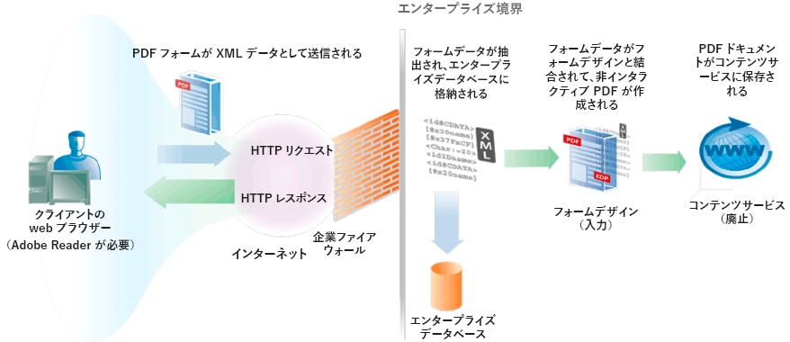

# 送信されたXMLデータを使用したPDFドキュメントの作成 {#creating-pdf-documents-with-submittedxml-data}

## 送信されたXMLデータを使用したPDFドキュメントの作成 {#creating-pdf-documents-with-submitted-xml-data}

ユーザーがインタラクティブフォームに入力できるWebベースのアプリケーションでは、データをサーバーに送信し直す必要があります。 Formsサービスを使用すると、ユーザーがインタラクティブフォームに入力したフォームデータを取得できます。 次に、フォームデータを別のAEM Formsサービス操作に渡し、そのデータを使用してPDFドキュメントを作成できます。

>[!NOTE]
>
>この内容を読む前に、送信済みフォームの処理に関する十分な理解を得ることをお勧めします。 フォームデザインと送信されたXMLデータの関係などの概念については、「送信されたFormsの処理」を参照してください。

3つのAEM Formsサービスを含む次のワークフローについて考えてみましょう。

* ユーザーは、XMLデータをWebベースのアプリケーションからFormsサービスに送信します。
* Formsサービスは、送信されたフォームの処理とフォームフィールドの抽出に使用されます。 フォームデータを処理できます。 例えば、データをエンタープライズデータベースに送信できます。
* フォームデータは、非インタラクティブPDFドキュメントを作成するためにOutputサービスに送信されます。
* 非インタラクティブPDFドキュメントは、Content Services（非推奨）に保存されます。

次の図に、このワークフローを視覚的に示します。

ユーザーがクライアントWebブラウザーからフォームを送信した後、非インタラクティブPDFドキュメントがContent Services（非推奨）に保存されます。 次の図に、Content Services（非推奨）に保存されているPDFドキュメントを示します。

### 手順の概要 {#summary-of-steps}

送信されたXMLデータを含む非インタラクティブPDFドキュメントを作成し、Content Services（非推奨）のPDFドキュメントに保存するには、次のタスクを実行します。

1. プロジェクトファイルを含めます。
1. Forms、出力、ドキュメント管理の各オブジェクトを作成します。
1. Formsサービスを使用してフォームデータを取得します。
1. Outputサービスを使用して、非インタラクティブPDFドキュメントを作成します。
1. ドキュメント管理サービスを使用して、PDFフォームをContent Services（非推奨）に格納します。

**プロジェクトファイルを含める**

必要なファイルを開発プロジェクトに含めます。 Javaを使用してクライアントアプリケーションを作成する場合は、必要なJARファイルを含めます。 Webサービスを使用している場合は、プロキシファイルを必ず含めてください。

**Forms、出力、ドキュメント管理の各オブジェクトの作成**

プログラムでFormsサービスAPI操作を実行する前に、FormsクライアントAPIオブジェクトを作成します。 同様に、このワークフローはOutputおよびドキュメント管理サービスを呼び出すので、Output Client APIオブジェクトとドキュメント管理クライアントAPIオブジェクトの両方を作成します。

**Formsサービスを使用したフォームデータの取得**

Formsサービスに送信されたフォームデータを取得します。 送信されたデータを処理して、ビジネス要件に合わせることができます。 例えば、フォームデータをエンタープライズデータベースに格納できます。 ただし、非インタラクティブPDFドキュメントを作成する場合は、フォームデータがOutputサービスに渡されます。

**Outputサービスを使用して、非インタラクティブPDFドキュメントを作成します。**

Outputサービスを使用して、フォームデザインとXMLフォームデータに基づく非インタラクティブPDFドキュメントを作成します。 ワークフローでは、フォームデータがFormsサービスから取得されます。

**ドキュメント管理サービスを使用して、PDFフォームをContent Services（非推奨）に格納する**

Content Services（非推奨）にPDFドキュメントを格納するには、ドキュメント管理サービスAPIを使用します。

**関連トピック**

[AEM Forms Java ライブラリファイルを含める](/help/forms/developing/invoking-aem-forms-using-java.md#including-aem-forms-java-library-files)

[接続プロパティの設定](/help/forms/developing/invoking-aem-forms-using-java.md#setting-connection-properties)

[FormsサービスAPIクイック開始](/help/forms/developing/forms-service-api-quick-starts.md#forms-service-api-quick-starts)

### Java APIを使用して、送信されたXMLデータを使用してPDFドキュメントを作成する {#create-a-pdf-document-with-submitted-xml-data-using-the-java-api}

Forms、出力、ドキュメント管理API(Java)を使用して、送信されたXMLデータを使用してPDFドキュメントを作成します。

1. プロジェクトファイルを含める

   Javaプロジェクトのクラスパスに、adobe-forms-client.jar、adobe-output-client.jar、adobe-contentservices-client.jarなどのクライアントJARファイルを含めます。

1. Forms、出力、ドキュメント管理の各オブジェクトの作成

   * 接続プロパティを含む `ServiceClientFactory` オブジェクトを作成します。
   * コンストラクタを使用して `FormsServiceClient` オブジェクトを渡すことによって、`ServiceClientFactory` オブジェクトを作成します。
   * Create an `OutputClient` object by using its constructor and passing the `ServiceClientFactory` object.
   * コンストラクタを使用して `DocumentManagementServiceClientImpl` オブジェクトを渡すことによって、`ServiceClientFactory` オブジェクトを作成します。

1. Formsサービスを使用したフォームデータの取得

   * オブジェクトの `FormsServiceClient``processFormSubmission` メソッドを呼び出し、次の値を渡します。

      * フォームデータを含む `com.adobe.idp.Document` オブジェクトです。
      * 関連するすべてのHTTPヘッダーを含む環境変数を指定するstring値。 環境変数に1つ以上の値を指定して、処理するコンテンツタイプを指定し `CONTENT_TYPE` ます。 例えば、XMLデータを処理するには、このパラメーターに次の文字列値を指定します。 `CONTENT_TYPE=text/xml`.
      * ヘッダー値を指定するstring値（例：） `HTTP_USER_AGENT``Mozilla/4.0 (compatible; MSIE 6.0; Windows NT 5.1; SV1; .NET CLR 1.1.4322)`。
      * 実行時オプションを格納する `RenderOptionsSpec` オブジェクト。

      この `processFormSubmission` メソッドは、フォーム送信の結果を含む `FormsResult` オブジェクトを返します。

   * オブジェクトのメソッドを呼び出して、Formsサービスがフォームデータの処理を完了したかどうか `FormsResult` を確認し `getAction` ます。 このメソッドが値を返す場合 `0`、データは処理可能な状態になります。
   * オブジェクトの `com.adobe.idp.Document` メソッドを呼び出して、オブジェクトを作成し、フォームデ `FormsResult` ータを取得し `getOutputContent` ます。 （このオブジェクトには、Outputサービスに送信できるフォームデータが含まれます）。
   * コンストラクターを呼び出し、オ `java.io.InputStream` ブジェクトを渡して、 `java.io.DataInputStream` オブジェクトを作成し `com.adobe.idp.Document` ます。
   * スタティック `org.w3c.dom.DocumentBuilderFactory` オブジェクトのメソッドを呼び出して、 `org.w3c.dom.DocumentBuilderFactory` オブジェクトを作成し `newInstance` ます。
   * オブジェクトの `org.w3c.dom.DocumentBuilder` メソッドを呼び出して、 `org.w3c.dom.DocumentBuilderFactory` オブジェクトを作成 `newDocumentBuilder` します。
   * Create an `org.w3c.dom.Document` object by invoking the `org.w3c.dom.DocumentBuilder` object’s `parse` method and passing the `java.io.InputStream` object.
   * XMLドキュメント内の各ノードの値を取得します。 このタスクを実行する1つの方法は、2つのパラメーターを受け取るカスタムメソッドを作成することです。値を取得する `org.w3c.dom.Document` オブジェクトとノードの名前。 このメソッドは、ノードの値を表すstring値を返します。 このプロセスの後のコード例では、このカスタムメソッドを呼び出し `getNodeText`ます。 このメソッドの本文が表示されます。

1. Outputサービスを使用して、非インタラクティブPDFドキュメントを作成します。

   Create a PDF document by invoking the `OutputClient` object’s `generatePDFOutput` method and passing the following values:

   * 列挙 `TransformationFormat` 値。 PDFドキュメントを生成するには、を指定し `TransformationFormat.PDF`ます。
   * フォームデザイン名を指定する string 値。フォームデザインが、Formsサービスから取得したフォームデータと互換性があることを確認します。
   * フォームデザインが配置されているコンテンツルートを指定するstring値。
   * PDF実行時オプションを含む `PDFOutputOptionsSpec` オブジェクトです。
   * レンダリングの実行時オプションを含む `RenderOptionsSpec` オブジェクトです。
   * フォームデザインとマージするデータを含むXMLデータソースを含む `com.adobe.idp.Document` オブジェクトです。 このオブジェクトがオブジェクトのメソッドによって返されているこ `FormsResult` とを確認してく `getOutputContent` ださい。
   * The `generatePDFOutput` method returns an `OutputResult` object that contains the results of the operation.
   * オブジェクトのメソッドを呼び出して、非インタラクティブPDFドキュメント `OutputResult` を取得し `getGeneratedDoc` ます。 このメソッドは、非インタラクティブPDFドキュメントを表す `com.adobe.idp.Document` インスタンスを返します。

1. ドキュメント管理サービスを使用したContent Services（非推奨）へのPDFフォームの保存

   オ追加ブジェクトのメソッドを呼び出し、次の値を渡すことで、コンテンツを取得します。 `DocumentManagementServiceClientImpl``storeContent`

   * コンテンツが追加されるストアを指定するstring値です。 The default store is `SpacesStore`. この値は必須のパラメータです。
   * コンテンツが追加されるスペースの完全修飾パスを指定するstring値(例： `/Company Home/Test Directory`)。 この値は必須のパラメータです。
   * 新しいコンテンツを表すノード名(例： `MortgageForm.pdf`)。 この値は必須のパラメータです。
   * ノードタイプを指定するstring値。 PDFファイルなどの新しいコンテンツを追加するには、を指定し `{https://www.alfresco.org/model/content/1.0}content`ます。 この値は必須のパラメータです。
   * コンテンツを表す `com.adobe.idp.Document` オブジェクトです。 この値は必須のパラメータです。
   * エンコーディング値(例： `UTF-8`)を指定するstring値。 この値は必須のパラメータです。
   * バージョン情報の処理方法を指定する `UpdateVersionType` 定義済みリスト値(例えば、コンテンツのバージョン `UpdateVersionType.INCREMENT_MAJOR_VERSION` を増やす場合)。 )この値は必須パラメータです。
   * コンテンツに関連する要素を指定する `java.util.List` インスタンス。 この値はオプションのパラメーターで、指定でき `null`ます。
   * コンテンツ属性を格納する `java.util.Map` オブジェクト。

   この `storeContent` メソッドは、コンテンツを表す `CRCResult` オブジェクトを返します。 オブジェクトを使用して、例えば、コンテンツの固有な識別子の値を取得でき `CRCResult` ます。 このタスクを実行するには、 `CRCResult` オブジェクトの `getNodeUuid` メソッドを呼び出します。

**関連トピック**

[AEM Forms Java ライブラリファイルを含める](/help/forms/developing/invoking-aem-forms-using-java.md#including-aem-forms-java-library-files)

[接続プロパティの設定](/help/forms/developing/invoking-aem-forms-using-java.md#setting-connection-properties)
