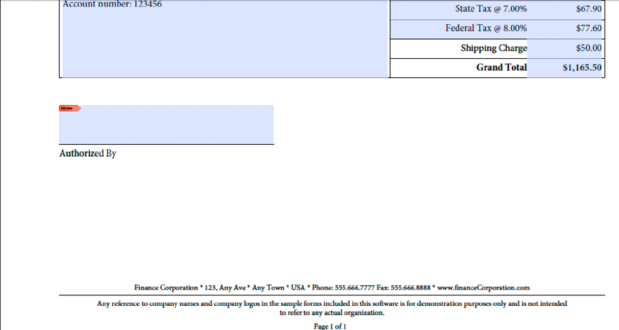

# フォームをレンダリングするWebアプリケーションの作成 {#creating-web-applications-thatrenders-forms}

## フォームをレンダリングするWebアプリケーションの作成 {#creating-web-applications-that-renders-forms}

Javaサーブレットを使用してFormsサービスを呼び出し、フォームをレンダリングするWebベースのアプリケーションを作成できます。 Java™サーブレットを使用する利点の1つは、プロセスの戻り値をクライアントWebブラウザーに書き込めることです。 つまり、Javaサーブレットは、フォームを返すFormsサービスとクライアントWebブラウザーの間のリンクとして使用できます。

>[!NOTE]
>
>ここでは、Formsサービスを呼び出し、フラグメントに基づいてフォームをレンダリングするJavaサーブレットを使用するWebベースのアプリケーションの作成方法について説明します。 (See [Rendering Forms Based on Fragments](/help/forms/developing/rendering-forms-based-fragments.md).)

Javaサーブレットを使用してクライアントWebブラウザーにフォームを書き込み、顧客がフォームにデータを表示して入力できるようにすることができます。 フォームにデータを入力した後、Webユーザーはフォーム上の送信ボタンをクリックして情報をJavaサーブレットに送信し、Javaサーブレットでデータを取得して処理できます。 例えば、データを別のプロセスに送信できます。

ここでは、次の図に示すように、米国ベースのフォームデータまたはカナダベースのフォームデータをユーザーが選択できるWebベースのアプリケーションの作成方法について説明します。


レンダリングされるフォームは、フラグメントに基づくフォームです。 つまり、ユーザーが米国のデータを選択した場合、返されるフォームは米国のデータに基づくフラグメントを使用します。 例えば、次の図に示すように、フォームのフッターに米国の住所が含まれています。



同様に、ユーザーがカナダのデータを選択した場合、返されるフォームには、次の図に示すように、カナダの住所が含まれます。


>[!NOTE]
>
>フラグメントに基づくフォームデザインの作成について詳しくは、「 [Forms Designer](https://www.adobe.com/go/learn_aemforms_designer_63)」を参照してください。

**サンプルファイル**

この節では、次の場所にあるサンプルファイルを使用します。

&lt;*Forms Designer install directory*>/Samples/Forms/Purchase Order/Form Fragments

&lt;*install directory*>はインストールパスです。 クライアントアプリケーションの目的で、Purchase Order Dynamic.xdpファイルがこのインストール場所からコピーされ、 *Applications/FormsApplicationという名前のFormsアプリケーションにデプロイされました*。 Purchase Order Dynamic.xdpファイルは、FormsFolderという名前のフォルダーに配置されます。 同様に、次の図に示すように、フラグメントはFragmentsという名前のフォルダーに配置されます。


Purchase Order Dynamic.xdpフォームデザインにアクセスするには、フォーム名( `Applications/FormsApplication/1.0/FormsFolder/Purchase Order Dynamic.xdp` メソッドに渡される最初のパラメーター)とコンテンツル `renderPDFForm` ートURI `repository:///` 値として指定します。

Webアプリケーションで使用されるXMLデータファイルが、Dataフォルダーから `C:\Adobe`（AEM FormsをホストするJ2EEアプリケーションサーバーに属するファイルシステム）に移動されました。 ファイル名はPurchase Order *Canada.xml* 、Purchase Order *US.xmlです*。

>[!NOTE]
>
>Workbenchを使用したFormsアプリケーションの作成について詳しくは、Workbenchヘルプを [参照してくださ](https://www.adobe.com/go/learn_aemforms_workbench_63)い。

### 手順の概要 {#summary-of-steps}

フラグメントに基づいてフォームをレンダリングするWebベースのアプリケーションを作成するには、次の手順を実行します。

1. 新しいWebプロジェクトを作成します。
1. Javaサーブレットを表すJavaアプリケーションロジックを作成します。
1. WebアプリケーションのWebページを作成します。
1. WebアプリケーションをWARファイルにパッケージ化します。
1. WARファイルをJ2EEアプリケーションサーバーにデプロイします。
1. Webアプリケーションをテストします。

>[!NOTE]
>
>これらの手順の一部は、AEM formsのデプロイ先のJ2EEアプリケーションに依存します。 例えば、WARファイルのデプロイ方法は、使用しているJ2EEアプリケーションサーバーに依存します。 この節では、AEM FormsがJBoss®にデプロイされていることを前提としています。

### Creating a web project {#creating-a-web-project}

Formsサービスを呼び出すことのできるJavaサーブレットを含むWebアプリケーションを作成する最初の手順は、新しいWebプロジェクトを作成することです。 このドキュメントが基にしているJava IDEはEclipse 3.3です。Eclipse IDEを使用して、Webプロジェクトを作成し、必要なJARファイルをプロジェクトに追加します。 最後に、 *index.htmlというHTMLページと* Javaサーブレットをプロジェクトに追加します。

Webプロジェクトに追加する必要があるJARファイルを次に示します。

* adobe-forms-client.jar
* adobe-livecycle-client.jar
* adobe-usermanager-client.jar
* adobe-utilities.jar

For the location of these JAR files, see [Including AEM Forms Java library files](/help/forms/developing/invoking-aem-forms-using-java.md#including-aem-forms-java-library-files).

**Webプロジェクトを作成するには：**

1. Eclipseを起動し、 **File** / **New Projectをクリックします**。
1. 新規プロジ **ェクトダイアログ** で、 **Web** /ダイナミッ **クWebプロジェクトを選択します**。
1. プロジ `FragmentsWebApplication` ェクトの名前を入力し、「完了」をクリック **します**。

**必要なJARファイルをプロジェクトに追加するには：**

1. 「プロジェクト・エクスプローラ」ウィンドウで、プロジェクトを右クリックし `FragmentsWebApplication` 、「プロパティ」を **選択しま**&#x200B;す。
1. 「 **Javaビルドパス」をクリックし** 、「ライブラリ」タブをク **リックします** 。
1. 「 **Add External JARs** 」ボタンをクリックし、含めるJARファイルを参照します。

**プロジェクトにJavaサーブレットを追加するには：**

1. 「プロジェクト・エクスプローラ」ウィンドウで、プロジェクトを右クリ `FragmentsWebApplication` ックし、「新規」>「その他」 **を選択** します ****。
1. 「 **Web** 」フォルダを展開し、「 **Servlet**」を選択して「 **Next」をクリックします**。
1. 「サーブレットを作成」ダイアログで、サーブ `RenderFormFragment` レットの名前を入力し、「完了」をクリック **します**。

**プロジェクトにHTMLページを追加するには：**

1. 「プロジェクト・エクスプローラ」ウィンドウで、プロジェクトを右クリ `FragmentsWebApplication` ックし、「新規」>「その他」 **を選択** します ****。
1. 「 **Web** 」フォルダを展開し、「 **HTML**」を選択して「 **Next**」をクリックします。
1. 新規HTMLダイアログボックスで、ファイル名 `index.html` を入力し、「完了」をクリック **します**。

>[!NOTE]
>
>Javaサーブレットを呼び出すHTMLページの作成について詳しくは、 `RenderFormFragment` Webページの作[成を参照してください](/help/forms/developing/rendering-forms.md#creating-the-web-page)。

### サーブレット用のJavaアプリケーションロジックの作成 {#creating-java-application-logic-for-the-servlet}

Formsサービスを呼び出すJavaアプリケーションロジックは、Javaサーブレット内から作成します。 次のコードは、 `RenderFormFragment` Javaサーブレットの構文を示しています。

```as3
     public class RenderFormFragment extends HttpServlet implements Servlet {
         public void doGet(HttpServletRequest req, HttpServletResponse resp
         throws ServletException, IOException {
         doPost(req,resp);
 
         }
         public void doPost(HttpServletRequest req, HttpServletResponse resp
         throws ServletException, IOException {
             //Add code here to invoke the Forms service
             }
```

通常、クライアントコードはJavaサーブレットのメソッドまたはメソッド内に配置 `doGet` しま `doPost` せん。 より良いプログラミング方法は、このコードを別のクラスに配置し、メソッド（またはメソッド）内からクラスをインスタンス化し、 `doPost` 適切なメソ `doGet` ッドを呼び出すことです。 ただし、コードを簡潔にするために、この節のコード例は最小限に抑え、コード例はメソッドに配置し `doPost` ます。

FormsサービスAPIを使用してフラグメントに基づいてフォームをレンダリングするには、次のタスクを実行します。

1. Javaプロジェクトのクラスパスに、adobe-forms-client.jarなどのクライアントJARファイルを含めます。 これらのファイルの場所については、[AEM Forms Java ライブラリファイルを含める](/help/forms/developing/invoking-aem-forms-using-java.md#including-aem-forms-java-library-files)を参照してください。
1. HTMLフォームから送信されたラジオボタンの値を取得し、米国のデータを使用するかカナダのデータを使用するかを指定します。 米国製が送信された場合は、Purchase Order US.xml `com.adobe.idp.Document` 内のデータを格納 *するを作成します*。 同様に、カナダ人の場合は、Purchase Order Canada.xml `com.adobe.idp.Document` ファイル内のデータを格納 *するを作成します* 。
1. 接続プロパティを含む `ServiceClientFactory` オブジェクトを作成します。（[接続プロパティの設定](/help/forms/developing/invoking-aem-forms-using-java.md#setting-connection-properties)を参照。）
1. Create an `FormsServiceClient` object by using its constructor and passing the `ServiceClientFactory` object.
1. コンストラク `URLSpec` ターを使用して、URI値を格納するオブジェクトを作成します。
1. オブジェクト `URLSpec` のメソッドを `setApplicationWebRoot` 呼び出し、アプリケーションのWebルートを表すstring値を渡します。
1. オブジェクト `URLSpec` のメソッドを `setContentRootURI` 呼び出し、コンテンツルートURI値を指定するstring値を渡します。 フォームデザインとフラグメントがコンテンツルートURIに配置されていることを確認します。 そうでない場合、Formsサービスは例外をスローします。 AEM Formsリポジトリを参照するには、を指定しま `repository://`す。
1. オブジェクト `URLSpec` のメソッ `setTargetURL` ドを呼び出し、フォームデータの投稿先のターゲットURL値を指定するstring値を渡します。 フォームデザインでターゲットURLを定義する場合は、空の文字列を渡すことができます。 演算を実行するためにフォームの送信先URLを指定することもできます。
1. オブジェクト `FormsServiceClient` のメソッドを `renderPDFForm` 呼び出し、次の値を渡します。

   * ファイル名の拡張子を含むフォームデザイン名を指定するstring値。
   * フォーム `com.adobe.idp.Document` とマージするデータを含むオブジェクト（手順2で作成）。
   * 実行時 `PDFFormRenderSpec` のオプションを格納するオブジェクトです。 For more information, see [AEM Forms API Reference](https://www.adobe.com/go/learn_aemforms_javadocs_63_en).
   * Formsサ `URLSpec` ービスがフラグメントに基づいてフォームをレンダリングするために必要なURI値を含むオブジェクトです。
   * 添付フ `java.util.HashMap` ァイルを格納するオブジェクト。 これはオプションのパラメーターで、フォームにフ `null` ァイルを添付しないかどうかを指定できます。
   このメソ `renderPDFForm` ッドは、クライア `FormsResult` ントのWebブラウザーに書き込む必要があるフォームデータストリームを含むオブジェクトを返します。

1. オブジェクトの `com.adobe.idp.Document` メソッドを呼び出して、オ `FormsResult` ブジェクトを作成 `getOutputContent` します。
1. メソッドを呼び出して、オブジェ `com.adobe.idp.Document` クトのコンテンツタイプを取得 `getContentType` します。
1. メソッドを呼 `javax.servlet.http.HttpServletResponse` び出し、オブジェクトのコンテンツタ `setContentType` イプを渡すことで、オブジェクトのコンテンツタイプを設定 `com.adobe.idp.Document` します。
1. オブジェクトの `javax.servlet.ServletOutputStream` メソッドを呼び出して、フォームデータストリームをクライアントのWebブラウザーに書き込むために使用する `javax.servlet.http.HttpServletResponse` オブジェクトを作 `getOutputStream` 成します。
1. オブジェクト `java.io.InputStream` のメソッドを呼び出して、オ `com.adobe.idp.Document` ブジェクトを作成 `getInputStream` します。
1. バイト配列を作成し、オブジェクトのメソッドを呼び出し、バイト配列を引 `InputStream` 数として渡すこ `read`とによって、フォームデータストリームを設定します。
1. オブジェクト `javax.servlet.ServletOutputStream` のメソッドを呼び `write` 出して、フォームデータストリームをクライアントWebブラウザーに送信します。 バイト配列をメソッドに渡し `write` ます。

次のコード例は、Formsサービスを呼び出し、フラグメントに基づいてフォームをレンダリングするJavaサーブレットを表しています。

```as3
 /*
     * This Java Quick Start uses the following JAR files
     * 1. adobe-forms-client.jar
     * 2. adobe-livecycle-client.jar
     * 3. adobe-usermanager-client.jar
     *
     * (Because Forms quick starts are implemented as Java servlets, it is
     * not necessary to include J2EE specific JAR files - the Java project
     * that contains this quick start is exported as a WAR file which
     * is deployed to the J2EE application server)
     *
     * These JAR files are located in the following path:
     * <install directory>/sdk/client-libs
     *
     * For complete details about the location of these JAR files,
     * see "Including AEM Forms library files" in Programming with AEM forms
     */
 import java.io.File;
 import java.io.FileInputStream;
 import java.io.IOException;
 import java.io.PrintWriter;
 
 import javax.servlet.Servlet;
 import javax.servlet.ServletException;
 import javax.servlet.ServletOutputStream;
 import javax.servlet.http.HttpServlet;
 import javax.servlet.http.HttpServletRequest;
 import javax.servlet.http.HttpServletResponse;
 import com.adobe.livecycle.formsservice.client.*;
 import java.util.*;
 import java.io.InputStream;
 import java.net.URL;
 
 import com.adobe.idp.Document;
 import com.adobe.idp.dsc.clientsdk.ServiceClientFactory;
 import com.adobe.idp.dsc.clientsdk.ServiceClientFactoryProperties;
 
 public class RenderFormFragment extends HttpServlet implements Servlet {
 
     public void doGet(HttpServletRequest req, HttpServletResponse resp)
         throws ServletException, IOException {
             doPost(req,resp);
 
     }
     public void doPost(HttpServletRequest req, HttpServletResponse resp)
     throws ServletException, IOException {
 
 
 
         try{
             //Set connection properties required to invoke AEM Forms
             Properties connectionProps = new Properties();
             connectionProps.setProperty(ServiceClientFactoryProperties.DSC_DEFAULT_SOAP_ENDPOINT, "https://[server]:[port]");
             connectionProps.setProperty(ServiceClientFactoryProperties.DSC_TRANSPORT_PROTOCOL,ServiceClientFactoryProperties.DSC_SOAP_PROTOCOL);
             connectionProps.setProperty(ServiceClientFactoryProperties.DSC_SERVER_TYPE, "JBoss");
             connectionProps.setProperty(ServiceClientFactoryProperties.DSC_CREDENTIAL_USERNAME, "administrator");
             connectionProps.setProperty(ServiceClientFactoryProperties.DSC_CREDENTIAL_PASSWORD, "password");
 
             //Get the value of selected radio button
             String radioValue = req.getParameter("radio");
 
             //Create an Document object to store form data
             Document oInputData = null;
 
             //The value of the radio button determines the form data to use
             //which determines which fragments used in the form
             if (radioValue.compareTo("AMERICAN") == 0)            {
                 FileInputStream myData = new FileInputStream("C:\\Adobe\Purchase Order US.xml");
                 oInputData = new Document(myData);
             }
             else if (radioValue.compareTo("CANADIAN") == 0)            {
                 FileInputStream myData = new FileInputStream("C:\\Adobe\Purchase Order Canada.xml");
                 oInputData = new Document(myData);
             }
 
             //Create a ServiceClientFactory object
             ServiceClientFactory myFactory = ServiceClientFactory.createInstance(connectionProps);
 
             //Create a FormsServiceClient object
             FormsServiceClient formsClient = new FormsServiceClient(myFactory);
 
             //Set the parameter values for the renderPDFForm method
             String formName = "Applications/FormsApplication/1.0/FormsFolder/Purchase Order Dynamic.xdp";
 
             //Cache the PDF form
             PDFFormRenderSpec pdfFormRenderSpec = new PDFFormRenderSpec();
             pdfFormRenderSpec.setCacheEnabled(new Boolean(true));
 
             //Specify URI values that are required to render a form
             //design based on fragments
             URLSpec uriValues = new URLSpec();
             uriValues.setApplicationWebRoot("https://[server]:[port]/RenderFormFragment");
             uriValues.setContentRootURI("repository:///");
             uriValues.setTargetURL("https://[server]:[port]/FormsServiceClientApp/HandleData");
 
             //Invoke the renderPDFForm method and write the
             //results to a client web browser
             FormsResult formOut = formsClient.renderPDFForm(
                         formName,               //formQuery
                         oInputData,             //inDataDoc
                         pdfFormRenderSpec,      //PDFFormRenderSpec
                         uriValues,                //urlSpec
                         null                    //attachments
                         );
 
             //Create a Document object that stores form data
             Document myData = formOut.getOutputContent();
 
             //Get the content type of the response and
             //set the HttpServletResponse object’s content type
             String contentType = myData.getContentType();
             resp.setContentType(contentType);
 
             //Create a ServletOutputStream object
             ServletOutputStream oOutput = resp.getOutputStream();
 
             //Create an InputStream object
             InputStream inputStream = myData.getInputStream();
 
             //Write the data stream to the web browser
             byte[] data = new byte[4096];
             int bytesRead = 0;
             while ((bytesRead = inputStream.read(data)) > 0)
             {
                 oOutput.write(data, 0, bytesRead);
             }
 
         }catch (Exception e) {
              System.out.println("The following exception occurred: "+e.getMessage());
       }
     }
 }
```

### Webページの作成 {#creating-the-web-page}

index.html webページは、Javaサーブレットへのエントリポイントを提供し、Formsサービスを呼び出します。 このWebページは、2つのラジオボタンと1つの送信ボタンを含む基本的なHTMLフォームです。 ラジオボタンの名前は「radio」です。 ユーザーが送信ボタンをクリックすると、フォームデータが `RenderFormFragment` Javaサーブレットにポストされます。

Javaサーブレットは、次のJavaコードを使用して、HTMLページから投稿されたデータを取得します。

```as3
             Document oInputData = null;
 
             //Get the value of selected radio button
             String radioValue = req.getParameter("radio");
 
             //The value of the radio button determines the form data to use
             //which determines which fragments used in the form
             if (radioValue.compareTo("AMERICAN") == 0)            {
                 FileInputStream myData = new FileInputStream("C:\\Adobe\Purchase Order US.xml");
                 oInputData = new Document(myData);
             }
             else if (radioValue.compareTo("CANADIAN") == 0)            {
                 FileInputStream myData = new FileInputStream("C:\\Adobe\Purchase Order Canada.xml");
                 oInputData = new Document(myData);
             }
```

次のHTMLコードは、開発環境のセットアップ時に作成されたindex.htmlファイル内にあります。 (See [Creating a web project](/help/forms/developing/rendering-forms.md#creating-a-web-project).)

```as3
 <!DOCTYPE html PUBLIC "-//W3C//DTD XHTML 1.0 Transitional//EN" "https://www.w3.org/TR/xhtml1/DTD/xhtml1-transitional.dtd">
 <html xmlns="https://www.w3.org/1999/xhtml">
 <head>
 <meta http-equiv="Content-Type" content="text/html; charset=utf-8" />
 <title>Untitled Document</title>
 </head>
 
 <body>
 <form name="myform" action="https://[server]:[port]/FragmentsWebApplication/RenderFormFragment" method="post">
      <table>
      <tr>
        <th>Forms Fragment Web Client</th>
      </tr>
      <tr>
        <td>
          <label>
          <input type="radio" name="radio" id="radio_Data" value="CANADIAN" />
          Canadian data<br />
          </label>
          <p>
            <label>
            <input type="radio" name="radio" id="radio_Data" value="AMERICAN" checked/>
            American data</label>
          </p>
        </td>
      </tr>
      <tr>
      <td>
        <label>
          <input type="submit" name="button_Submit" id="button_Submit" value="Submit" />
            </label>
            </td>
         </tr>
        </table>
      </form>
 </body>
 </html>
```

### Webアプリケーションのパッケージ化 {#packaging-the-web-application}

Formsサービスを呼び出すJavaサーブレットをデプロイするには、WebアプリケーションをWARファイルにパッケージ化します。 コンポーネントのビジネスロジックが依存する外部JARファイル（adobe-livecycle-client.jarやadobe-forms-client.jarなど）もWARファイルに含めてください。

**WebアプリケーションをWARファイルにパッケージ化するには：**

1. 「プロジェ **クトエクスプローラ** 」ウィンドウで、プロジェクトを右クリ `FragmentsWebApplication` ックし、「エクスポー **ト** 」>「 **WARファイル」を選択します**。
1. 「 **Web module** 」テキストボッ `FragmentsWebApplication` クスに、Javaプロジェクトの名前を入力します。
1. 「 **Destination** 」テキストボックスに `FragmentsWebApplication.war`**フ&#x200B;**ァイル名を入力し、WARファイルの場所を指定して、「Finish」をクリックします。

### J2EEアプリケーションサーバーへのWARファイルのデプロイ {#deploying-the-war-file-to-the-j2ee-application-server}

WARファイルは、AEM FormsがデプロイされるJ2EEアプリケーションサーバーにデプロイできます。 WARファイルをデプロイした後は、Webブラウザーを使用してHTML webページにアクセスできます。

**WARファイルをJ2EEアプリケーションサーバーにデプロイするには：**

* 書き出しパスのWARファイルを *[Forms Install]*\Adobe\Adobe Experience Manager Forms\jboss\server\all\deployにコピーします。

### Webアプリケーションのテスト {#testing-your-web-application}

Webアプリケーションをデプロイした後、Webブラウザーを使用してテストできます。 AEM formsをホストするコンピューターと同じコンピューターを使用している場合は、次のURLを指定できます。

* http://localhost:8080/FragmentsWebApplication/index.html

   ラジオボタンを選択し、「送信」ボタンをクリックします。 フラグメントに基づくフォームがWebブラウザーに表示されます。 問題が発生した場合は、J2EEアプリケーションサーバーのログファイルを参照してください。

