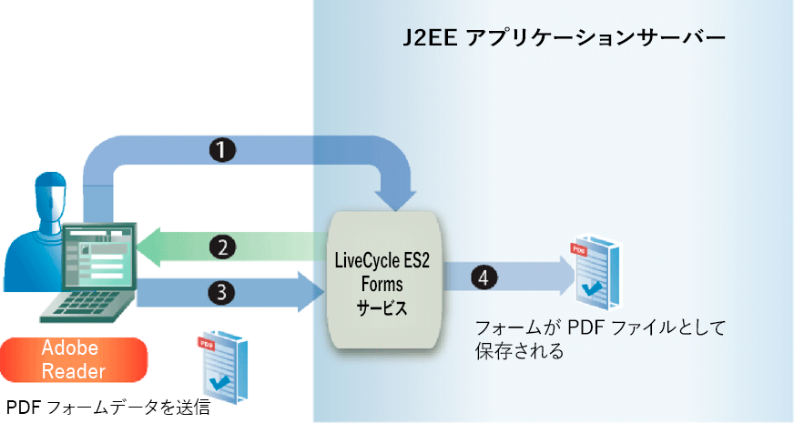

# 送信済みフォームの処理 {#handling-submitted-forms}

ユーザーがインタラクティブフォームに入力できるWebベースのアプリケーションでは、データをサーバーに送信し直す必要があります。 Formsサービスを使用すると、ユーザーがインタラクティブフォームに入力したデータを取得できます。 データを取得した後、ビジネス要件に合わせてデータを処理できます。 例えば、データをデータベースに格納し、データを別のアプリケーションに送信し、データを別のサービスに送信し、データをフォームデザインに結合し、Webブラウザーに表示するなどの操作を行うことができます。

フォームデータは、XMLまたはPDFデータとしてFormsサービスに送信されます。これは、Designerで設定されるオプションです。 XML形式で送信されるフォームを使用すると、個々のフィールドデータ値を抽出できます。 つまり、ユーザーがフォームに入力した各フォームフィールドの値を抽出できます。 PDFデータとして送信されるフォームは、XMLデータではなくバイナリデータです。 フォームをPDFファイルとして保存したり、別のサービスにフォームを送信したりできます。 XMLとして送信されたフォームからデータを抽出し、そのフォームデータを使用してPDFドキュメントを作成する場合は、別のAEM Forms操作を呼び出します。 (送信済みXML [ドキュメントを使用したPDFデータの作成を参照](/help/forms/developing/creating-pdf-documents-submitted-xml.md))。

次の図に、Webブラウザに表示されるインタラクティブフォームからJavaサーブレ `HandleData` ットに送信されるデータを示します。

次の表で、図の手順を説明します。

<table>
 <thead>
  <tr>
   <th>
ステップ
</th>
   <th>
説明
</th>
  </tr>
 </thead>
 <tbody>
  <tr>
   <td>
1
</td>
   <td>
ユーザーがインタラクティブフォームに入力し、フォームの「送信」ボタンをクリックします。
</td>
  </tr>
  <tr>
   <td>
2
</td>
   <td>
データはXMLデータとして <code>HandleData</code> Javaサーブレットに送信されます。
</td>
  </tr>
  <tr>
   <td>
3
</td>
   <td>
Javaサーブレット <code>HandleData</code> には、データを取得するためのアプリケーションロジックが含まれています。
</td>
  </tr>
 </tbody>
</table>

## 送信されたXMLデータの処理 {#handling-submitted-xml-data}

フォームデータがXMLとして送信されると、送信されたデータを表すXMLデータを取得できます。 すべてのフォームフィールドは、XMLノードでノードとして表示されます。スキーマ ノードの値は、ユーザーが入力した値に対応します。 例えば、フォーム内の各フィールドがXMLデータ内のノードとして表示されるローンフォームを考えてみましょう。 各ノードの値は、ユーザーが入力した値に対応します。 ユーザーが次のフォームに表示されるデータを使用してローンフォームに入力するとします。

次の図に、FormsサービスクライアントAPIを使用して取得された、対応するXMLデータを示します。

ローンフォームのフィールド。 これらの値は、Java XMLクラスを使用して取得できます。

>[!NOTE]
>
>データをXMLデータとして送信するには、Designerでフォームデザインを正しく設定する必要があります。 XMLデータを送信するようにフォームデザインを適切に設定するには、フォームデザイン上にある「送信」ボタンがXMLデータを送信するように設定されていることを確認します。 XMLデータを送信するための「送信」ボタンの設定について詳しくは、「 [AEM Forms Designer](https://www.adobe.com/go/learn_aemforms_designer_63)」を参照してください。

## 送信されたPDFデータの処理 {#handling-submitted-pdf-data}

Formsサービスを呼び出すWebアプリケーションを考えてみます。 FormsサービスがインタラクティブPDFフォームをクライアントのWebブラウザーにレンダリングした後、ユーザーはフォームに入力し、PDFデータとして送り返します。 Formsサービスは、PDFデータを受け取ると、PDFデータを別のサービスに送信したり、PDFファイルとして保存したりできます。 次の図に、アプリケーションのロジックフローを示します。

次の表に、この図の手順を示します。

<table>
 <thead>
  <tr>
   <th>
ステップ
</th>
   <th>
説明
</th>
  </tr>
 </thead>
 <tbody>
  <tr>
   <td>
1
</td>
   <td>
Webページには、Formsサービスを呼び出すJavaサーブレットにアクセスするリンクが含まれます。
</td>
  </tr>
  <tr>
   <td>
2
</td>
   <td>
Formsサービスは、インタラクティブPDFフォームをクライアントのWebブラウザーにレンダリングします。
</td>
  </tr>
  <tr>
   <td>
3
</td>
   <td>
ユーザーがインタラクティブフォームに入力し、送信ボタンをクリックします。 フォームがPDFデータとしてFormsサービスに返送されます。 このオプションは、Designerで設定されます。
</td>
  </tr>
  <tr>
   <td>
4
</td>
   <td>
Formsサービスは、PDFデータをPDFファイルとして保存します。 
</td>
  </tr>
 </tbody>
</table>

## 送信されたURL UTF-16データの処理 {#handling-submitted-url-utf-16-data}

フォームデータがURL UTF-16データとして送信される場合、クライアントコンピューターではAdobe ReaderまたはAcrobat 8.1以降が必要です。 また、フォームデザインにURLエンコードデータ(HTTP Post)を含む送信ボタンが含まれ、データエンコードオプションがUTF-16の場合は、フォームデザインをメモ帳などのテキストエディターで変更する必要があります。 送信ボタンのエンコードオプションは、また `UTF-16LE` はのい `UTF-16BE` ずれかに設定できます。 Designerにはこの機能はありません。

>[!NOTE]
>
>For more information about the Forms service, see [Services Reference for AEM Forms](https://www.adobe.com/go/learn_aemforms_services_63).

## 手順の概要 {#summary-of-steps}

送信されたフォームを処理するには、次のタスクを実行します。

1. プロジェクトファイルを含めます。
1. フォームクライアントAPIオブジェクトを作成します。
1. フォームデータを取得します。
1. フォーム送信に添付ファイルが含まれているかどうかを確認します。
1. 送信されたデータを処理します。

**プロジェクトファイルを含める**

必要なファイルを開発プロジェクトに含めます。 Javaを使用してクライアントアプリケーションを作成する場合は、必要なJARファイルを含めます。 Webサービスを使用している場合は、必ずプロキシファイルを含めてください。

**フォームクライアントAPIオブジェクトの作成**

プログラムによってFormsサービスのクライアントAPI操作を実行する前に、Formsサービスクライアントを作成する必要があります。 Java APIを使用している場合は、オブジェクトを作成し `FormsServiceClient` ます。 Forms WebサービスAPIを使用している場合は、オブジェクトを作成 `FormsService` します。

**フォームデータの取得**

送信されたフォームデータを取得するには、オブジェクト `FormsServiceClient` のメソッドを呼び出 `processFormSubmission` します。 このメソッドを呼び出す場合、送信済みフォームのコンテンツタイプを指定する必要があります。 データがクライアントWebブラウザーからFormsサービスに送信されると、XMLまたはPDFデータとして送信できます。 フォームフィールドに入力されたデータを取得するには、XMLデータとしてデータを送信します。

また、次の実行時オプションを設定することで、PDFデータとして送信されたフォームからフォームフィールドを取得することもできます。

* 次の値をコンテンツタイプパラメ `processFormSubmission` ーターとしてメソッドに渡します。 `CONTENT_TYPE=application/pdf`.
* オブジェ `RenderOptionsSpec` クトの値 `PDFToXDP` を `true`
* オブジェ `RenderOptionsSpec` クトの値 `ExportDataFormat` を `XMLData`

メソッドを呼び出すときに、送信済みフォームのコンテンツタイプを指定 `processFormSubmission` します。 次のリストは、適用可能なコンテンツタイプの値を指定します。

* **text/xml**:PDFフォームがフォームデータをXMLとして送信する場合に使用するコンテンツタイプを表します。
* **application/x-www-form-urlencoded**:HTMLフォームがデータをXMLとして送信する場合に使用するコンテンツタイプを表します。
* **application/pdf**:PDFフォームでデータをPDFとして送信する場合に使用するコンテンツタイプを表します。

>[!NOTE]
>
>「送信済みフォームの処理」セクションには、対応する3つのクイック開始が関連付けられています。 Java APIクイック開始を使用したPDFとして送信されたPDFフォームの処理では、送信されたPDFデータの処理方法を示します。 このクイック開始で指定されるコンテンツタイ `application/pdf`プは、 Java APIクイック開始を使用したXMLとして送信されたPDFフォームの処理では、PDFフォームから送信された送信済みXMLデータの処理方法を示します。 このクイック開始で指定されるコンテンツタイ `text/xml`プは、 同様に、Java APIクイック開始を使用したXMLとして送信されたHTMLフォームの処理では、HTMLフォームから送信された送信済みXMLデータの処理方法を示します。 このクイック開始で指定されるコンテンツタイプは、application/x-www-form-urlencodedです。

Formsサービスに投稿されたフォームデータを取得し、その処理状態を判断します。 つまり、データがFormsサービスに送信される場合、Formsサービスでのデータの処理が完了し、データの処理準備が整ったとは限りません。 例えば、計算を実行するために、データをFormsサービスに送信できます。 計算が完了すると、フォームはユーザーにレンダリングされ、計算結果が表示されます。 送信されたデータを処理する前に、Formsサービスがデータの処理を完了したかどうかを確認することをお勧めします。

Formsサービスは、データの処理が完了したかどうかを示す次の値を返します。

* **0（送信）:** 送信されたデータを処理する準備が整いました。
* **1（計算）:** Formsサービスはデータに対して計算操作を実行し、結果をユーザーにレンダリングして戻す必要があります。
* **2（検証）:** Formsサービスで検証されたフォームデータと結果は、ユーザーにレンダリングされる必要があります。
* **3（次へ）:** 現在のページは、クライアントアプリケーションに書き込む必要のある結果と共に変更されました。
* **4(前**):現在のページは、クライアントアプリケーションに書き込む必要のある結果と共に変更されました。

>[!NOTE]
>
>計算と検証は、ユーザーにレンダリングして戻す必要があります。 (フォームデ [ータの計算を参照](/help/forms/developing/calculating-form-data.md#calculating-form-data))。

**フォーム送信に添付ファイルが含まれているかどうかを確認する**

Formsサービスに送信されるフォームには、添付ファイルを含めることができます。 例えば、Acrobatの組み込みの添付ファイルペインを使用して、フォームと共に送信する添付ファイルを選択できます。 また、HTMLファイルと共にレンダリングされるHTMLツールバーを使用して、添付ファイルを選択することもできます。

フォームに添付ファイルが含まれているかどうかを確認したら、データを処理できます。 例えば、添付ファイルをローカルファイルシステムに保存できます。

>[!NOTE]
>
>添付ファイルを取得するには、フォームをPDFデータとして送信する必要があります。 フォームがXMLデータとして送信される場合、添付ファイルは送信されません。

**送信されたデータの処理**

送信データのコンテンツタイプに応じて、送信されたXMLデータから個々のフォームフィールド値を抽出したり、送信されたPDFデータをPDFファイルとして保存したり（または別のサービスに送信したり）できます。 個々のフォームフィールドを抽出するには、送信されたXMLデータをXMLデータソースに変換し、クラスを使用してXMLデータソースの値を取得 `org.w3c.dom` します。

**関連トピック**

[AEM Forms Java ライブラリファイルを含める](/help/forms/developing/invoking-aem-forms-using-java.md#including-aem-forms-java-library-files)

[接続プロパティの設定](/help/forms/developing/invoking-aem-forms-using-java.md#setting-connection-properties)

[FormsサービスAPIのクイック開始](/help/forms/developing/forms-service-api-quick-starts.md#forms-service-api-quick-starts)

[Formsサービスへのドキュメントの引き渡し](/help/forms/developing/passing-documents-forms-service.md)

[フォームをレンダリングするWeb アプリケーションの作成](/help/forms/developing/creating-web-applications-renders-forms.md)

## Java APIを使用して送信済みのフォームを処理する {#handle-submitted-forms-using-the-java-api}

Forms API (Java)を使用して送信済みのフォームを処理します。

1. プロジェクトファイルを含める

   Javaプロジェクトのクラスパスに、adobe-forms-client.jarなどのクライアントJARファイルを含めます。

1. フォームクライアントAPIオブジェクトの作成

   * 接続プロパティを含む `ServiceClientFactory` オブジェクトを作成します。
   * Create an `FormsServiceClient` object by using its constructor and passing the `ServiceClientFactory` object.

1. フォームデータの取得

   * Javaサーブレットにポストされたフォームデータを取得するには、コンストラクタを使用し、コ `com.adobe.idp.Document` ンストラクタ内からオブジェクトのメソッドを呼び出 `javax.servlet.http.HttpServletResponse` して、オ `getInputStream` ブジェクトを作成します。
   * コンストラクタを使用して `RenderOptionsSpec` オブジェクトを作成します。オブジェクトのメソッドを呼び出し、ロ `RenderOptionsSpec` ケール値を `setLocale` 指定する文字列値を渡すことで、ロケール値を設定します。
   >[!NOTE]
   >
   >Formsサービスに対して、送信されたPDFコンテンツからXDPまたはXMLデータを作成するように指示するには、オブジェクトのメソッドを呼び出し、 `RenderOptionsSpec` 渡し、呼び出し `setPDF2XDP` 、渡しを行う `true` こと `setXMLData` によって行いま `true`す。 その後、オブジェクトのメ `FormsResult` ソッドを呼 `getOutputXML` び出して、XDP/XMLデータに対応するXMLデータを取得できます。 (オブジ `FormsResult` ェクトは、次のサ `processFormSubmission` ブステップで説明するメソッドによって返されます)。

   * オブジェクト `FormsServiceClient` のメソッドを `processFormSubmission` 呼び出し、次の値を渡します。

      * フォーム `com.adobe.idp.Document` データを含むオブジェクトです。
      * すべての関連するHTTP環境を含むヘッダー変数を指定するstring値。 処理するコンテンツタイプを指定します。 XMLデータを処理するには、このパラメーターに次の文字列値を指定します。 `CONTENT_TYPE=text/xml`. PDFデータを処理するには、このパラメーターに次の文字列値を指定します。 `CONTENT_TYPE=application/pdf`.
      * ヘッダー値を指定す `HTTP_USER_AGENT` るstring値（例：）。 `Mozilla/4.0 (compatible; MSIE 6.0; Windows NT 5.1; SV1; .NET CLR 1.1.4322)` です。このパラメーター値はオプションです。
      * 実行時 `RenderOptionsSpec` のオプションを格納するオブジェクト。
      このメ `processFormSubmission` ソッドは、フォ `FormsResult` ーム送信の結果を含むオブジェクトを返します。

   * オブジェクトのメソッドを呼び出して、Formsサービスがフォームデータの処理を完了し `FormsResult` たかどうかを確認 `getAction` します。 このメソッドが値を返す場 `0`合、データは処理可能です。

1. フォーム送信に添付ファイルが含まれているかどうかを確認する

   * オブジェクトの `FormsResult` メソッドを呼び出 `getAttachments` します。 このメソッドは、フォーム `java.util.List` と共に送信されたファイルを含むオブジェクトを返します。
   * オブジェクトを繰り返し `java.util.List` 処理し、添付ファイルが存在するかどうかを確認します。 添付ファイルがある場合、各要素はインスタンスにな `com.adobe.idp.Document` ります。 添付ファイルを保存するには、オブジェクトのメソッドを呼び出 `com.adobe.idp.Document` し、オブジェクト `copyToFile` を渡す方法を使用 `java.io.File` します。
   >[!NOTE]
   >
   >この手順は、フォームがPDFとして送信される場合にのみ適用されます。

1. 送信されたデータの処理

   * データコンテンツタイプがまたはの場合 `application/vnd.adobe.xdp+xml` は、XMLデ `text/xml`ータ値を取得するアプリケーションロジックを作成します。

      * オブジェクトの `com.adobe.idp.Document` メソッドを呼び出して、オ `FormsResult` ブジェクトを作成 `getOutputContent` します。
      * コンストラクターを `java.io.InputStream` 呼び出し、オブジェクトを `java.io.DataInputStream` 渡すことで、オブジェクトを作成 `com.adobe.idp.Document` します。
      * スタティックオ `org.w3c.dom.DocumentBuilderFactory` ブジェクトのメソッドを呼び出して、オ `org.w3c.dom.DocumentBuilderFactory` ブジェクトを作成 `newInstance` します。
      * オブジェクトの `org.w3c.dom.DocumentBuilder` メソッドを呼び出して、オ `org.w3c.dom.DocumentBuilderFactory` ブジェクトを作成 `newDocumentBuilder` します。
      * Create an `org.w3c.dom.Document` object by invoking the `org.w3c.dom.DocumentBuilder` object’s `parse` method and passing the `java.io.InputStream` object.
      * XMLノード内の各ノードの値を取得します。ドキュメント このタスクを実行する1つの方法は、2つのパラメーターを受け取るカスタムメソッドを作成することです。取得 `org.w3c.dom.Document` する値を持つノードのオブジェクトと名前。 このメソッドは、ノードの値を表すstring値を返します。 このプロセスの後のコード例では、このカスタムメソッドが呼び出されま `getNodeText`す。 このメソッドの本体が表示されます。
   * データコンテンツタイプが「」の場 `application/pdf`合は、送信されたPDFデータをPDFファイルとして保存するアプリケーションロジックを作成します。

      * オブジェクトの `com.adobe.idp.Document` メソッドを呼び出して、オ `FormsResult` ブジェクトを作成 `getOutputContent` します。
      * Create a `java.io.File` object by using its public constructor. ファイル名の拡張子としてPDFを必ず指定してください。
      * オブジェクトのメソッドを呼び出し、オ `com.adobe.idp.Document` ブジェクトを渡 `copyToFile` して、PDFファイルを入力 `java.io.File` します。

**関連トピック**

[クイック開始（SOAPモード）:Java APIを使用したXMLとして送信されたPDFフォームの処理](/help/forms/developing/forms-service-api-quick-starts.md#quick-start-soap-mode-handling-pdf-forms-submitted-as-xml-using-the-java-api)

[クイック開始（SOAPモード）:Java APIを使用したXMLとして送信されたHTMLフォームの処理](/help/forms/developing/forms-service-api-quick-starts.md#quick-start-soap-mode-handling-html-forms-submitted-as-xml-using-the-java-api)

[クイック開始（SOAPモード）:Java APIを使用したPDFとして送信されたPDFフォームの処理](/help/forms/developing/forms-service-api-quick-starts.md#quick-start-soap-mode-handling-pdf-forms-submitted-as-pdf-using-the-java-api)

[AEM Forms Java ライブラリファイルを含める](/help/forms/developing/invoking-aem-forms-using-java.md#including-aem-forms-java-library-files)

[接続プロパティの設定](/help/forms/developing/invoking-aem-forms-using-java.md#setting-connection-properties)

## WebサービスAPIを使用して送信されたPDFデータを処理する {#handle-submitted-pdf-data-using-the-web-service-api}

Forms API（Webサービス）を使用して送信済みのフォームを処理します。

1. プロジェクトファイルを含める

   * FormsサービスのWSDLを使用するJavaプロキシクラスを作成します。
   * クラスパスにJavaプロキシクラスを含めます。

1. フォームクライアントAPIオブジェクトの作成

   オブジェクトを `FormsService` 作成し、認証値を設定します。

1. フォームデータの取得

   * Javaサーブレットにポストされたフォームデータを取得するには、コンストラクタを使 `BLOB` 用してオブジェクトを作成します。
   * オブジェクトの `java.io.InputStream` メソッドを呼び出して、オ `javax.servlet.http.HttpServletResponse` ブジェクトを作成 `getInputStream` します。
   * Create a `java.io.ByteArrayOutputStream` object by using its constructor and passing the length of the `java.io.InputStream` object.
   * オブジェクトの内容をオ `java.io.InputStream` ブジェクトにコピ `java.io.ByteArrayOutputStream` ーします。
   * オブジェクトのメソッドを呼び出して、バ `java.io.ByteArrayOutputStream` イト配列を作成 `toByteArray` します。
   * メソッドを呼 `BLOB` び出し、バイ `setBinaryData` ト配列を引数として渡して、オブジェクトを入力します。
   * コンストラクタを使用して `RenderOptionsSpec` オブジェクトを作成します。オブジェクトのメソッドを呼び出し、ロ `RenderOptionsSpec` ケール値を `setLocale` 指定する文字列値を渡すことで、ロケール値を設定します。
   * オブジェクト `FormsService` のメソッドを `processFormSubmission` 呼び出し、次の値を渡します。

      * フォーム `BLOB` データを含むオブジェクトです。
      * すべての関連するHTTP環境を含むヘッダー変数を指定するstring値。 処理するコンテンツタイプを指定します。 XMLデータを処理するには、このパラメーターに次の文字列値を指定します。 `CONTENT_TYPE=text/xml`. PDFデータを処理するには、このパラメーターに次の文字列値を指定します。 `CONTENT_TYPE=application/pdf`.
      * ヘッダー値を指定す `HTTP_USER_AGENT` るstring値。例えば、 `Mozilla/4.0 (compatible; MSIE 6.0; Windows NT 5.1; SV1; .NET CLR 1.1.4322)`.
      * 実行時 `RenderOptionsSpec` のオプションを格納するオブジェクト。
      * メソッドに `BLOBHolder` よって入力される空のオブジェクトです。
      * メソッドに `javax.xml.rpc.holders.StringHolder` よって入力される空のオブジェクトです。
      * メソッドに `BLOBHolder` よって入力される空のオブジェクトです。
      * メソッドに `BLOBHolder` よって入力される空のオブジェクトです。
      * メソッドに `javax.xml.rpc.holders.ShortHolder` よって入力される空のオブジェクトです。
      * メソッドに `MyArrayOf_xsd_anyTypeHolder` よって入力される空のオブジェクトです。 このパラメーターは、フォームと共に送信される添付ファイルを保存するために使用されます。
      * 送信され `FormsResultHolder` たフォームと共にメソッドによって入力される空のオブジェクト。
      メソッド `processFormSubmission` は、フォー `FormsResultHolder` ム送信の結果をパラメータに入力します。

   * オブジェクトのメソッドを呼び出して、Formsサービスがフォームデータの処理を完了し `FormsResult` たかどうかを確認 `getAction` します。 このメソッドが値を返す場 `0`合、フォームデータは処理可能です。 オブジェクトのデー `FormsResult` タメンバーの値を取得すること `FormsResultHolder` で、オブジェクトを取 `value` 得できます。

1. フォーム送信に添付ファイルが含まれているかどうかを確認する

   オブジェクトのデー `MyArrayOf_xsd_anyTypeHolder` タメンバ `value` の値を取得します(オ `MyArrayOf_xsd_anyTypeHolder` ブジェクトがメソッドに渡さ `processFormSubmission` れました)。 このデータメンバは、の配列を返しま `Objects`す。 配列内の各要素は、 `Object` フォーム `Object`と共に送信されたファイルに対応する要素です。 配列内の各要素を取得し、オブジェクトにキャストでき `BLOB` ます。

1. 送信されたデータの処理

   * データコンテンツタイプがまたはの場合 `application/vnd.adobe.xdp+xml` は、XMLデ `text/xml`ータ値を取得するアプリケーションロジックを作成します。

      * オブジェクトの `BLOB` メソッドを呼び出して、オ `FormsResult` ブジェクトを作成 `getOutputContent` します。
      * オブジェクトのメソッドを呼び出して、バ `BLOB` イト配列を作成 `getBinaryData` します。
      * コンストラクタ `java.io.InputStream` ーを呼び出し、バイト配列 `java.io.ByteArrayInputStream` を渡して、オブジェクトを作成します。
      * スタティックオ `org.w3c.dom.DocumentBuilderFactory` ブジェクトのメソッドを呼び出して、オ `org.w3c.dom.DocumentBuilderFactory` ブジェクトを作成 `newInstance` します。
      * オブジェクトの `org.w3c.dom.DocumentBuilder` メソッドを呼び出して、オ `org.w3c.dom.DocumentBuilderFactory` ブジェクトを作成 `newDocumentBuilder` します。
      * Create an `org.w3c.dom.Document` object by invoking the `org.w3c.dom.DocumentBuilder` object’s `parse` method and passing the `java.io.InputStream` object.
      * XMLノード内の各ノードの値を取得します。ドキュメント このタスクを実行する1つの方法は、2つのパラメーターを受け取るカスタムメソッドを作成することです。取得 `org.w3c.dom.Document` する値を持つノードのオブジェクトと名前。 このメソッドは、ノードの値を表すstring値を返します。 このプロセスの後のコード例では、このカスタムメソッドが呼び出されま `getNodeText`す。 このメソッドの本体が表示されます。
   * データコンテンツタイプが「」の場 `application/pdf`合は、送信されたPDFデータをPDFファイルとして保存するアプリケーションロジックを作成します。

      * オブジェクトの `BLOB` メソッドを呼び出して、オ `FormsResult` ブジェクトを作成 `getOutputContent` します。
      * オブジェクトのメソッドを呼び出して、バ `BLOB` イト配列を作成 `getBinaryData` します。
      * Create a `java.io.File` object by using its public constructor. ファイル名の拡張子としてPDFを必ず指定してください。
      * コンストラクタを使用して `java.io.FileOutputStream` オブジェクトを渡すことによって、`java.io.File` オブジェクトを作成します。
      * オブジェクトのメソッドを呼び出し、バ `java.io.FileOutputStream` イト配列を渡 `write` すことによって、PDFファイルを設定します。

**関連トピック**

[Base64エンコーディングを使用したAEM Formsの呼び出し](/help/forms/developing/invoking-aem-forms-using-web.md#invoking-aem-forms-using-base64-encoding)