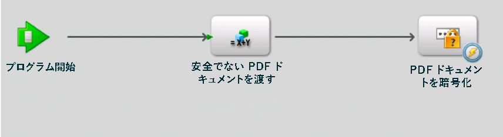
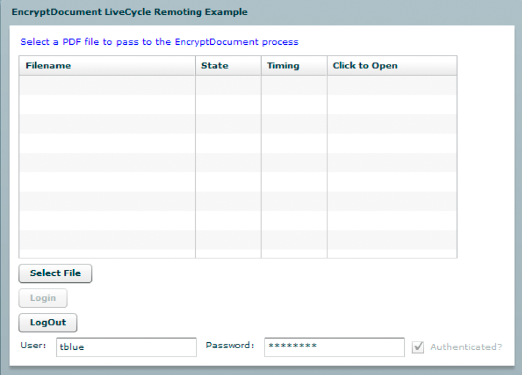
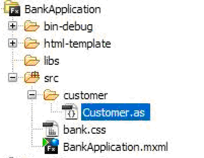

# Remotingを使用したAEM Formsの呼び出し {#invoking-aem-forms-using-remoting}

Workbenchで作成されたプロセスは、Remotingを使用して呼び出すことができます。 つまり、Flexで構築されたクライアントAEM Formsからアプリケーションプロセスを呼び出すことができます。 この機能は、Data Servicesに基づいています。

>[!NOTE]
>
>Remotingを使用する場合は、AEM FormsサービスではなくWorkbenchで作成されたプロセスを呼び出すことをお勧めします。 ただし、AEM Formsサービスを直接呼び出すことは可能です。 (AEM FormsデベロッパーセンターにあるRemotingを使用したPDFドキュメントの暗号化を参照)。

>[!NOTE]
>
>匿名アクセスを許可するようにAEM Formsサービスが設定されていない場合、Flexクライアントからの要求はWebブラウザーのチャレンジになります。 ユーザーは、ユーザー名とパスワードの資格情報を入力する必要があります。

次のAEM Formsに示す短時間のみ有効なプロセス `MyApplication/EncryptDocument`（この名前）は、Remotingを使用して呼び出すことができます。 (入力値や出力値など、このプロセスについて詳しくは、 [短時間のみ有効なプロセスの例を参照してください](/help/forms/developing/aem-forms-processes.md))。



>[!NOTE]
>
>FlexAEM Formsを使用してアプリケーションプロセスを呼び出すには、リモートエンドポイントが有効になっていることを確認します。 デフォルトでは、プロセスをデプロイすると、リモートエンドポイントが有効になります。

このプロセスを呼び出すと、次のアクションが実行されます。

1. 入力値として渡される、保護されていないPDFドキュメントを取得します。 このアクションは `SetValue` 操作に基づいています。入力パラメーターの名前 `inDoc` はです。データタイプはで `document`す。 ( `document` データ型は、Workbench内で使用できるデータ型です)。
1. PDF ドキュメントをパスワードで暗号化します。このアクションは `PasswordEncryptPDF` 操作に基づいています。このプロセスの出力値の名前は、パスワードで暗号化されたPDFドキュメント `outDoc` を表します。 outDocのデータタイプはで `document`す。
1. パスワードで暗号化されたPDFドキュメントをPDFファイルとしてローカルファイルシステムに保存します。 このアクションは `WriteDocument` 操作に基づいています。

>[!NOTE]
>
>The `MyApplication/EncryptDocument` process is not based on an existing AEM Forms process. To following along with the code examples, create a process named `MyApplication/EncryptDocument` using Workbench.

>[!NOTE]
>
>Remotingを使用した長期間有効なプロセスの呼び出しについて詳しくは、「人間中心の長期間有効なプロセスの [呼び出し](/help/forms/developing/invoking-human-centric-long-lived.md#invoking-human-centric-long-lived-processes)」を参照してください。

**関連トピック**

[AEM FormsFlexライブラリファイルのインクルード](invoking-aem-forms-using-remoting.md#including-the-aem-forms-flex-library-file)

[AEM Formsのリモート処理（AEM Formsでは非推奨）でのドキュメントの処理](invoking-aem-forms-using-remoting.md#handling-documents-with-remoting)

[AEM Formsのリモート処理（AEM Formsでは廃止されています）を使用して安全でないドキュメントを渡すことによる短時間のみ有効なプロセスの呼び出し](invoking-aem-forms-using-remoting.md#invoking-a-short-lived-process-by-passing-an-unsecure-document-using-remoting)

[Flexで構築されたクライアントアプリケーションの認証](invoking-aem-forms-using-remoting.md#authenticating-client-applications-built-with-flex)

[Remotingを使用してプロセスを呼び出すための安全なドキュメントーの渡し](invoking-aem-forms-using-remoting.md#passing-secure-documents-to-invoke-processes-using-remoting)

[Remotingを使用したカスタムコンポーネントサービスの呼び出し](invoking-aem-forms-using-remoting.md#invoking-custom-component-services-using-remoting)

[人間中心の長期間有効なプロセスを呼び出すFlexで構築されたクライアントアプリケーションの作成](/help/forms/developing/invoking-human-centric-long-lived.md#creating-a-client-application-built-with-flex-that-invokes-a-human-centric-long-lived-process)

[HTTPトークンを使用したSSO認証を実行するFlash Builderアプリケーションの作成](/help/forms/developing/creating-flash-builder-applications-perform.md#creating-flash-builder-applications-that-perform-sso-authentication-using-http-tokens)

Flexグラフコントロールでプロセスデータを表示する方法について詳しくは、「FlexグラフでのAEM Formsプロセスデータの [表示](https://www.adobe.com/devnet/livecycle/articles/populating_flexcontrols.html)」を参照してください。

>[!NOTE]
>
>*crossdomain.xmlファイルを適切な場所に配置するようにしてください。 例えば、JBossにAEM Formsをデプロイした場合、このファイルを次の場所に配置します。 &lt;install_directory>\Adobe_Experience_Manager_forms\jboss\server\lc_turnkey\deploy\jboss-web.deployer\ROOT.war.*

## AEM FormsFlexライブラリファイルのインクルード {#including-the-aem-forms-flex-library-file}

Remotingを使用してAEM Formsプロセスをプログラムで呼び出すには、adobe-remoting-provider.swcファイルをFlexプロジェクトのクラスパスに追加します。 このSWCファイルは、次の場所にあります。

* *&lt;install_directory>\Adobe_Experience_Manager_forms\sdk\misc\DataServices\Client-Libraries*

   &lt;*install_directory*>は、AEM Formsがインストールされているディレクトリです。

**関連トピック**

[AEM Formsのリモート処理（AEM Formsでは廃止）を使用したAEM Formsの呼び出し](invoking-aem-forms-using-remoting.md#invoking-aem-forms-using-remoting)

[AEM Formsのリモート処理（AEM Formsでは非推奨）でのドキュメントの処理](invoking-aem-forms-using-remoting.md#handling-documents-with-remoting)

[AEM Formsのリモート処理（AEM Formsでは廃止されています）を使用して安全でないドキュメントを渡すことによる短時間のみ有効なプロセスの呼び出し](invoking-aem-forms-using-remoting.md#invoking-a-short-lived-process-by-passing-an-unsecure-document-using-remoting)

[Flexで構築されたクライアントアプリケーションの認証](invoking-aem-forms-using-remoting.md#authenticating-client-applications-built-with-flex)

## リモート処理でのドキュメントの処理 {#handling-documents-with-remoting}

AEM Formsで使用される、プリミティブでない最も重要なJava型の1つは、 `com.adobe.idp.Document` クラスです。 通常、ドキュメントはAEM Forms操作を呼び出すために必要です。 主にPDFドキュメントですが、SWF、HTML、XML、DOCファイルなどの他のドキュメントタイプを含めることもできます。 (See [Passing data to AEM Forms services using the Java API](/help/forms/developing/invoking-aem-forms-using-java.md#passing-data-to-aem-forms-services-using-the-java-api).)

Flexで作成されたクライアントアプリケーションは、ドキュメントを直接要求できません。 例えば、Adobe Readerを起動してPDFファイルを生成するURLを要求することはできません。 PDFやMicrosoft Wordのドキュメントなど、ドキュメントタイプの要求は、URLの結果を返します。 URLの内容を表示するのは、クライアントの責任です。 ドキュメント管理サービスは、URLとコンテンツタイプの情報を生成するのに役立ちます。 XMLドキュメントの要求は、結果に完全なXMLドキュメントを返します。

### ドキュメントーを入力パラメーターとして渡す {#passing-a-document-as-an-input-parameter}

Flexで構築されたクライアントアプリケーションは、ドキュメントをAEM Formsプロセスに直接渡すことはできません。 代わりに、クライアントアプリケーションは、ActionScriptクラスのインスタンスを使用して、 `mx.rpc.livecycle.DocumentReference` インスタンスを必要とする操作に入力パラメーターを渡し `com.adobe.idp.Document` ます。 Flexクライアントアプリケーションには、オブジェクトを設定するための複数のオプションがあり `DocumentReference` ます。

* ドキュメントがサーバー上にあり、そのファイルの場所がわかっている場合は、DocumentReferenceオブジェクトのreferenceTypeプロパティをREF_TYPE_FILEに設定します。 次の例に示すように、fileRefプロパティをファイルの場所に設定します。

```java
 ... var docRef: DocumentReference = new DocumentReference(); 
 docRef.referenceType = DocumentReference.REF_TYPE_FILE; 
 docRef.fileRef = "C:/install/adobe/cs2/How to Uninstall.pdf"; ...
```

* ドキュメントがサーバー上にあり、そのURLがわかっている場合、DocumentReferenceオブジェクトのreferenceTypeプロパティをREF_TYPE_URLに設定します。 次の例のように、urlプロパティをURLに設定します。

```java
... var docRef: DocumentReference = new DocumentReference(); 
docRef.referenceType = DocumentReference.REF_TYPE_URL; 
docRef.url = "https://companyserver:8080/DocumentManager/116/7855"; ...
```

* クライアントアプリケーションのテキスト文字列からDocumentReferenceオブジェクトを作成するには、DocumentReferenceオブジェクトのreferenceTypeプロパティをREF_TYPE_INLINEに設定します。 次の例に示すように、textプロパティを、オブジェクトに含めるテキストに設定します。

```java
... var docRef: DocumentReference = new DocumentReference(); 
docRef.referenceType = DocumentReference.REF_TYPE_INLINE; 
docRef.text = "Text for my document";  // Optionally, you can override the server’s default character set  // if necessary:  // docRef.charsetName=CharacterSetName  ...
```

* ドキュメントがサーバ上にない場合は、Remotingアップロードサーブレットを使用してAEM Formsにドキュメントをアップロードします。 AEM Formsの新機能は、セキュリティで保護されたドキュメントをアップロードする機能です。 セキュアドキュメントをアップロードする場合、 *ドキュメントアップロードアプリのユーザ* 」ロールを持つユーザを使用する必要があります。 このロールがないと、セキュリティで保護されたドキュメントをアップロードできません。 セキュリティで保護されたドキュメントをアップロードするには、シングルサインオンを使用することをお勧めします。 (Remotingを使用してプロセスを呼び出すための安全なドキュメントーの [引き渡しを参照](invoking-aem-forms-using-remoting.md#passing-secure-documents-to-invoke-processes-using-remoting))。

>[!NOTE]
セキュリティで保護されていないドキュメントのアップロードを許可するようにAEM Formsが設定されている場合は、ドキュメントアップロードアプリケーションユーザーロールを持たないドキュメントを使用してアプリをアップロードできます。 ユーザは、ドキュメントのアップロード権限を持つこともできます。 ただし、セキュリティで保護されたドキュメントのみを許可するようにAEM Formsが設定されている場合は、そのユーザにドキュメントアップロードアプリケーションドキュメントロールまたはアプリケーションアップロード権限があることを確認してください。 (セキュリティで保護されたドキュメントとセキュリティで保護されていないAEM Formsを受け入れるように [設定するを参照](invoking-aem-forms-using-remoting.md#configuring-aem-forms-to-accept-secure-and-unsecure-documents))。

指定したアップロードURLには、標準のFlashアップロード機能を使用します。 `https://SERVER:PORT/remoting/lcfileupload`. その後、タイプの入力パラメーターが必要な場合は常に `DocumentReference` オブジェクトを使用できます。Remotingクイック開始 `Document` は` private function startUpload():void  {  fileRef.addEventListener(Event.SELECT, selectHandler);  fileRef.addEventListener("uploadCompleteData", completeHandler);  try  {   var success:Boolean = fileRef.browse();  }    catch (error:Error)  {   trace("Unable to browse for files.");  }  }      private function selectHandler(event:Event):void {  var request:URLRequest = new  URLRequest("https://SERVER:PORT/remoting/lcfileupload")  try   {   fileRef.upload(request);   }    catch (error:Error)   {   trace("Unable to upload file.");   }  }    private function completeHandler(event:DataEvent):void  {   var params:Object = new Object();   var docRef:DocumentReference = new DocumentReference();   docRef.url = event.data as String;   docRef.referenceType = DocumentReference.REF_TYPE_URL;  }`、Remotingアップロードサーブレットを使用してPDFファイルを `MyApplication/EncryptDocument`プロセスに渡します。 (「 [AEM FormsのRemoting（AEM Formsでは廃止されています）」を使用して安全でないドキュメントを渡すことによる短時間のみ有効なプロセスの呼び出し](invoking-aem-forms-using-remoting.md#invoking-a-short-lived-process-by-passing-an-unsecure-document-using-remoting)」を参照)。

```java
 
private
function startUpload(): void  { 
 fileRef.addEventListener(Event.SELECT, selectHandler); 
 fileRef.addEventListener("uploadCompleteData", completeHandler); 
 try  { 
  var success: Boolean = fileRef.browse(); 
 }  
 catch (error: Error)  { 
  trace("Unable to browse for files."); 
 } 
}   
private
function selectHandler(event: Event): void { 
 var request: URLRequest = new  URLRequest("https://SERVER:PORT/remoting/lcfileupload")  try  { 
  fileRef.upload(request); 
 }  
 catch (error: Error)  { 
  trace("Unable to upload file."); 
 } 
}  
private
function completeHandler(event: DataEvent): void  { 
 var params: Object = new Object(); 
 var docRef: DocumentReference = new DocumentReference(); 
 docRef.url = event.data as String; 
 docRef.referenceType = DocumentReference.REF_TYPE_URL; 
}
```

リモートクイック開始は、Remotingアップロードサーブレットを使用してPDFファイルを `MyApplication/EncryptDocument`プロセスに渡します。 (「 [AEM FormsのRemoting（AEM Formsでは廃止されています）」を使用して安全でないドキュメントを渡すことによる短時間のみ有効なプロセスの呼び出し](invoking-aem-forms-using-remoting.md#invoking-a-short-lived-process-by-passing-an-unsecure-document-using-remoting)」を参照)。

### ドキュメントをクライアントアプリケーションに渡す {#passing-a-document-back-to-a-client-application}

クライアントアプリケーションは、インスタンスを出力パラメーター `mx.rpc.livecycle.DocumentReference` として返すサービス操作のタイプのオブジェクトを受け取り `com.adobe.idp.Document` ます。 クライアントアプリケーションはJavaではなくActionScriptオブジェクトを扱うので、JavaベースのドキュメントオブジェクトをFlexクライアントに渡して戻すことはできません。 代わりに、ドキュメントのURLが生成され、そのURLがクライアントに渡されます。 この `DocumentReference` オブジェクトのプ `referenceType` ロパティは、コンテンツがオブジェクト内にあるか、そのプ `DocumentReference``DocumentReference.url` ロパティ内のURLから取得する必要があるかを指定します。 The `DocumentReference.contentType` property specifies the type of document.

**関連トピック**

[AEM Formsのリモート処理（AEM Formsでは廃止）を使用したAEM Formsの呼び出し](invoking-aem-forms-using-remoting.md#invoking-aem-forms-using-remoting)

[AEM FormsFlexライブラリファイルのインクルード](invoking-aem-forms-using-remoting.md#including-the-aem-forms-flex-library-file)

[AEM Formsのリモート処理（AEM Formsでは廃止されています）を使用して安全でないドキュメントを渡すことによる短時間のみ有効なプロセスの呼び出し](invoking-aem-forms-using-remoting.md#invoking-a-short-lived-process-by-passing-an-unsecure-document-using-remoting)

[Flexで構築されたクライアントアプリケーションの認証](invoking-aem-forms-using-remoting.md#authenticating-client-applications-built-with-flex)

[Remotingを使用してプロセスを呼び出すための安全なドキュメントーの渡し](invoking-aem-forms-using-remoting.md#passing-secure-documents-to-invoke-processes-using-remoting)

## Remotingを使用して安全でないドキュメントを渡すことによる短時間のみ有効なプロセスの呼び出し {#invoking-a-short-lived-process-by-passing-an-unsecure-document-using-remoting}

Flexで作成されたAEM Formsからアプリケーションプロセスを呼び出すには、次のタスクを実行します。

1. Create a `mx:RemoteObject` instance.
1. Create a `ChannelSet` instance.
1. 必要な入力値を渡します。
1. 戻り値を処理します。

>[!NOTE]
この節では、セキュリティで保護されていないドキュメントをアップロードするようにAEM Formsが設定されている場合に、AEM Formsプロセスを呼び出し、ドキュメントをアップロードする方法について説明します。 AEM Formsプロセスを呼び出し、セキュリティで保護されたドキュメントをアップロードする方法、およびセキュリティで保護されたドキュメントとセキュリティで保護されていないドキュメントを受け入れるようにAEM Formsを設定する方法について詳しくは、Remotingを使用してプロセスを呼び出すためのセキュリティで保護されたの [引き渡しを参照してください](invoking-aem-forms-using-remoting.md#passing-secure-documents-to-invoke-processes-using-remoting)。

**mx:RemoteObjectインスタンスの作成**

Workbenchで作成したAEM Formsプロセスを呼び出すための `mx:RemoteObject` インスタンスを作成します。 インスタンスを作成するには、次の値を指定し `mx:RemoteObject` ます。

* **id:** 呼び出すプロセスを表す `mx:RemoteObject` インスタンスの名前。
* **destination:** 呼び出すAEM Formsプロセスの名前。 例えば、 `MyApplication/EncryptDocument` プロセスを呼び出すには、を指定し `MyApplication/EncryptDocument`ます。
* **結果：** 結果を処理するFlexメソッドの名前です。

タグ内で、プロセスの呼び出しメソッドの名前を指定する `mx:RemoteObject``<mx:method>` タグを指定します。 通常、Forms呼び出しメソッドの名前はです `invoke`。

次のコードの例は、プロセスを呼び出す `mx:RemoteObject` インスタンスを作成し `MyApplication/EncryptDocument` ます。

```java
 <mx:RemoteObject id="EncryptDocument" destination="MyApplication/EncryptDocument" result="resultHandler(event);">
          <mx:method name="invoke" result="handleExecuteInvoke(event)"/>
      </mx:RemoteObject>
```

**AEM Formsへのチャネルの作成**

次のActionScriptの例に示すように、クライアントAEM Formsは、MXMLまたはActionScriptでチャネルを指定することでアプリケーションを呼び出すことができます。 チャネルは、 `AMFChannel`、、、、またはのい `SecureAMFChannel`ずれかである必要があり `HTTPChannel``SecureHTTPChannel`ます。

```java
     ...
     private function refresh():void{
         var cs:ChannelSet= new ChannelSet();
         cs.addChannel(new AMFChannel("my-amf",
             "https://yourlcserver:8080/remoting/messagebroker/amf"));
         EncryptDocument.setCredentials("administrator", "password");
         EncryptDocument.channelSet = cs;
     }
     ...
```

インスタンス `ChannelSet``mx:RemoteObject``channelSet` をインスタンスのフィールドに割り当てます（前のコード例に示したように）。 一般に、チャネルクラスは、メソッドの呼び出し時に完全修飾名を指定する代わりに、importステートメントで読み込みま `ChannelSet.addChannel` す。

**入力値を渡す**

Workbenchで作成されたプロセスは、0個以上の入力パラメーターを取り、出力値を返すことができます。 クライアントアプリケーションは、AEM Formsプロセスに属するパラメーターに対応するフィールドを持つ `ActionScript` オブジェクト内に入力パラメーターを渡します。 この名前の短時間のみ有効なプロセスには、という名前の入力パラメーター `MyApplication/EncryptDocument`が1つ必要 `inDoc`です。 プロセスによって公開される操作の名前は `invoke` （短時間のみ有効なプロセスのデフォルト名）です。 (「 [AEM Formsの呼び出し」（AEM Formsでは非推奨）AEM Formsのリモート処理を使用した呼び出し](invoking-aem-forms-using-remoting.md#invoking-aem-forms-using-remoting)」を参照)。

次のコードの例では、PDFドキュメントを `MyApplication/EncryptDocument` プロセスに渡します。

```java
     ...
     var params:Object = new Object();
 
     //Document is an instance of DocumentReference
     //that store an unsecured PDF document
     params["inDoc"] = pdfDocument;
 
     // Invoke an operation synchronously:
     EncryptDocument.invoke(params);
     ...
```

このコードの例で、は保護され `pdfDocument` ていないPDFドキュメントを含む `DocumentReference` インスタンスです。 詳しくは、 `DocumentReference`「AEM Formsのリモート処理（AEM Formsでは廃止されています）」を参照して [ください](invoking-aem-forms-using-remoting.md#handling-documents-with-remoting)。

**サービスの特定のバージョンを呼び出す**

呼び出しのパラメーターマップでパラメーターを使用すると、Formsサービスの特定のバージョンを呼び出すこ `_version` とができます。 例えば、サー `MyApplication/EncryptDocument` ビスのバージョン1.2を呼び出すには：

```java
 var params:Object = new Object();
 params["inDoc"] = pdfDocument;
 params["_version"] = "1.2"
 var token:AsyncToken = echoService.echoString(params);
```

この `version` パラメーターは、1つのピリオドを含む文字列である必要があります。 期間の左、メジャーバージョン、右、マイナーバージョンの値は整数である必要があります。 このパラメーターが指定されていない場合、headアクティブバージョンが呼び出されます。

**戻り値の処理**

AEM Formsプロセスの出力パラメーターは、ActionScriptオブジェクトにデシリアライズされ、クライアントアプリケーションは、次の例のように、特定のパラメーターを名前で抽出します。 ( `MyApplication/EncryptDocument` プロセスの出力値には名前が付けられ `outDoc`ます)。

```java
     ...
     var res:Object = event.result;
     var docRef:DocumentReference = res["outDoc"] as DocumentReference;
     ...
```

**MyApplication/EncryptDocumentプロセスの呼び出し**

次の手順を実行して、 `MyApplication/EncryptDocument` プロセスを呼び出すことができます。

1. ActionScriptまたはMXMLを使用して `mx:RemoteObject` インスタンスを作成します。 mx:RemoteObjectインスタンスの作成を参照してください。
1. AEM Formsと通信する `ChannelSet` インスタンスを設定し、そのインスタンスに関連付け `mx:RemoteObject` ます。 詳しくは、AEM Formsへのチャネルの作成を参照してください。
1. ChannelSetの `login``setCredentials` メソッドまたはサービスのメソッドを呼び出して、ユーザー識別子の値とパスワードを指定します。 (シングルサインオン [の使用を参照](invoking-aem-forms-using-remoting.md#using-single-sign-on))。
1. プロセスに渡す、保護されていないPDFドキュメントを使用して `mx.rpc.livecycle.DocumentReference` インスタンスを設定し `MyApplication/EncryptDocument` ます ( [入力パラメーターとしてドキュメントを渡すを参照](invoking-aem-forms-using-remoting.md#passing-a-document-as-an-input-parameter))。
1. インスタンスのメソッドを呼び出して、PDF `mx:RemoteObject` ドキュメントを暗号化し `invoke` ます。 入力ドキュメント `Object` ー（保護されていないPDFパラメーター）を含むを渡します。 詳しくは、入力値の引き渡しを参照してください。
1. プロセスから返される、パスワードで暗号化されたPDFドキュメントを取得します。 戻り値の処理を参照してください。

[クイック開始: AEM Formsのリモート処理（AEM Formsでは廃止されています）を使用して安全でないドキュメントを渡すことによる短時間のみ有効なプロセスの呼び出し](/help/forms/developing/invocation-api-quick-starts.md#quick-start-invoking-a-short-lived-process-by-passing-an-unsecure-document-using-deprecated-for-aem-forms-aem-forms-remoting)

## Flexで構築されたクライアントアプリケーションの認証 {#authenticating-client-applications-built-with-flex}

AEM Forms User ManagerがFlexアプリケーションからリモート要求を認証する方法はいくつかあります。例えば、中央ログインサービスを介したシングルサインオン、基本認証、カスタム認証などのAEM Formsがあります。 シングルサインオンと匿名アクセスのいずれも有効になっていない場合、リモート処理の要求は、基本認証（デフォルト）とカスタム認証のどちらかになります。

基本認証は、Webアプリケーションコンテナからの標準のJ2EE基本認証に依存します。 基本認証の場合、HTTP 401エラーはブラウザーのチャレンジを引き起こします。 つまり、RemoteObjectを使用してFormsアプリケーションに接続しようとしたが、Flexアプリケーションからまだログインしていない場合、ブラウザーからユーザー名とパスワードの入力が求められます。

カスタム認証の場合、サーバーは、認証が必要であることを示すエラーをクライアントに送信します。

>[!NOTE]
HTTPトークンを使用した認証の実行について詳しくは、HTTPトークンを使用したSSO認証を実行するFlash Builderアプリケーションの [作成を参照してください](/help/forms/developing/creating-flash-builder-applications-perform.md#creating-flash-builder-applications-that-perform-sso-authentication-using-http-tokens)。

### カスタム認証の使用 {#using-custom-authentication}

リモートエンドポイントで認証方法を「基本」から「カスタム」に変更して、管理コンソールでカスタム認証を有効にします。 カスタム認証を使用する場合、クライアントアプリケーションは `ChannelSet.login` メソッドを呼び出してログインし、 `ChannelSet.logout` メソッドを呼び出してログアウトします。

>[!NOTE]
以前のリリースのAEM Formsでは、 `RemoteObject.setCredentials` メソッドを呼び出して秘密鍵証明書を送信先に送信していました。 この `setCredentials` メソッドは、コンポーネントが最初にサーバーへの接続を試みるまで、実際には秘密鍵証明書をサーバーに渡しませんでした。 したがって、コンポーネントが障害イベントを発行した場合、認証エラーが原因で障害が発生したか、別の理由で障害が発生したかは不明です。 この `ChannelSet.login` メソッドは、呼び出し時にサーバーに接続し、認証の問題を直ちに処理できるようにします。 この `setCredentials` メソッドは引き続き使用できますが、使用することをお勧めし `ChannelSet.login` ます。

複数の宛先で同じチャネルと対応するChannelSetオブジェクトを使用できるので、1つの宛先にログインすると、同じチャネルまたはチャネルを使用する他の宛先にログインします。 2つのコンポーネントが同じChannelSetオブジェクトに異なる秘密鍵証明書を適用する場合は、最後に適用した秘密鍵証明書が使用されます。 複数のコンポーネントが同じ認証済みChannelSetオブジェクトを使用している場合、 `logout` メソッドを呼び出すと、すべてのコンポーネントが宛先からログアウトされます。

次の例では、RemoteObjectコントロールと共にメソッド `ChannelSet.login` と `ChannelSet.logout` メソッドを使用します。 このアプリケーションは、次の操作を実行します。

* コンポー `ChannelSet` ネントで使用されるチャネルを表す `creationComplete``RemoteObject` オブジェクトをハンドラーに作成します
* ボタンのクリックイベントに応じて `ROLogin` 関数を呼び出すことで、秘密鍵証明書をサーバーに渡します
* RemoteObjectコンポーネントを使用して、Button clickイベントに応答して文字列をサーバに送信します。 同じ文字列がRemoteObjectコンポーネントに返されます
* RemoteObjectコンポーネントの結果イベントを使用して、TextAreaコントロールに文字列を表示します
* ボタンのクリックイベントに応答して `ROLogout` 関数を呼び出し、サーバーからログアウトします

```java
 <?xml version=”1.0”?>
 <!-- security/SecurityConstraintCustom.mxml -->
 <mx:Application xmlns:mx=”https://www.adobe.com/2006/mxml” width=”100%”
     height=”100%” creationComplete=”creationCompleteHandler();”>
 
     <mx:Script>
         <![CDATA[
             import mx.controls.Alert;
             import mx.messaging.config.ServerConfig;
             import mx.rpc.AsyncToken;
             import mx.rpc.AsyncResponder;
             import mx.rpc.events.FaultEvent;
             import mx.rpc.events.ResultEvent;
             import mx.messaging.ChannelSet;
 
             // Define a ChannelSet object.
             public var cs:ChannelSet;
 
             // Define an AsyncToken object.
             public var token:AsyncToken;
 
             // Initialize ChannelSet object based on the
             // destination of the RemoteObject component.
             private function creationCompleteHandler():void {
                 if (cs == null)
                 cs = ServerConfig.getChannelSet(remoteObject.destination);
             }
 
             // Login and handle authentication success or failure.
             private function ROLogin():void {
                 // Make sure that the user is not already logged in.
                 if (cs.authenticated == false) {
                     token = cs.login(“sampleuser”, “samplepassword”);
                     // Add result and fault handlers.
                     token.addResponder(new AsyncResponder(LoginResultEvent,
                     LoginFaultEvent));
                 }
             }
 
             // Handle successful login.
             private function LoginResultEvent(event:ResultEvent,
                 token:Object=null):void  {
                     switch(event.result) {
                         case “success”:
                             authenticatedCB.selected = true;
                             break;
                             default:
                     }
                 }
 
                 // Handle login failure.
                 private function LoginFaultEvent(event:FaultEvent,
                     token:Object=null):void {
                         switch(event.fault.faultCode) {
                             case “Client.Authentication”:
                                 default:
                                 authenticatedCB.selected = false;
                                 Alert.show(“Login failure: “ + event.fault.faultString);
                     }
                 }
 
                 // Logout and handle success or failure.
                 private function ROLogout():void {
                     // Add result and fault handlers.
                     token = cs.logout();
                     token.addResponder(new
                         AsyncResponder(LogoutResultEvent,LogoutFaultEvent));
                 }
 
                 // Handle successful logout.
                 private function LogoutResultEvent(event:ResultEvent,
                     token:Object=null):void {
                         switch (event.result) {
                             case “success”:
                                 authenticatedCB.selected = false;
                                 break;
                                 default:
                     }
                 }
 
                 // Handle logout failure.
                 private function LogoutFaultEvent(event:FaultEvent,
                     token:Object=null):void {
                         Alert.show(“Logout failure: “ + event.fault.faultString);
                 }
                 // Handle message recevied by RemoteObject component.
                 private function resultHandler(event:ResultEvent):void {
                     ta.text += “Server responded: “+ event.result + “\n”;
                 }
 
                 // Handle fault from RemoteObject component.
                 private function faultHandler(event:FaultEvent):void {
                     ta.text += “Received fault: “ + event.fault + “\n”;
                 }
             ]]>
     </mx:Script>
     <mx:HBox>
         <mx:Label text=”Enter a text for the server to echo”/>
         <mx:TextInput id=”ti” text=”Hello World!”/>
         <mx:Button label=”Login”
             click=”ROLogin();”/>
         <mx:Button label=”Echo”
             enabled=”{authenticatedCB.selected}”
             click=”remoteObject.echo(ti.text);”/>
         <mx:Button label=”Logout”
             click=”ROLogout();”/>
         <mx:CheckBox id=”authenticatedCB”
             label=”Authenticated?”
             enabled=”false”/>
     </mx:HBox>
     <mx:TextArea id=”ta” width=”100%” height=”100%”/>
 
     <mx:RemoteObject id=”remoteObject”
         destination=”myDest”
         result=”resultHandler(event);”
         fault=”faultHandler(event);”/>
 </mx:Application>
```

メソッド `login` と `logout` メソッドは、AsyncTokenオブジェクトを返します。 成功した呼び出しを処理する結果イベントーと、失敗を処理するフォルトイベントーのAsyncTokenオブジェクトにイベントハンドラーを割り当てます。

### シングルサインオンの使用 {#using-single-sign-on}

AEM Formsでは、複数のAEM FormsWebアプリケーションに接続して、タスクを実行できます。 ユーザーがWebアプリケーション間を移動する場合、各Webアプリケーションに個別にログインする必要はありません。 AEM Formsのシングルサインオンメカニズムを使用すると、ユーザーは一度ログインし、任意のAEM FormsのWebアプリケーションにアクセスできます。 AEM Forms開発者は、AEM Formsで使用するクライアントアプリケーションを作成できるので、シングルサインオンメカニズムも利用できる必要があります。

各AEM FormsのWebアプリケーションは、独自のWebアーカイブ(WAR)ファイルにパッケージ化され、Enterprise Archive(EAR)ファイルの一部としてパッケージ化されます。 アプリケーションサーバーでは異なるWebアプリケーション間でのセッションデータの共有が許可されないので、AEM FormsはHTTP cookieを使用して認証情報を保存します。 認証cookieを使用すると、ユーザーはFormsアプリケーションにログインし、他のAEM FormsのWebアプリケーションに接続できます。 この方法は、シングルサインオンと呼ばれます。

AEM Forms開発者は、フォームガイド（非推奨）の機能を拡張し、Workspaceをカスタマイズするためのクライアントアプリケーションを作成します。 例えば、Workspaceアプリケーションでプロセスを開始できます。 次に、クライアントアプリケーションはリモートエンドポイントを使用して、Formsサービスからデータを取得します。

AEM FormsサービスがRemoting（AEM Formsでは非推奨）AEM Formsを使用して呼び出されると、クライアントアプリケーションは、要求の一部として認証Cookieを渡します。 ユーザーは既に認証されているので、クライアントアプリケーションからAEM Formsサービスに接続するために追加のログインは必要ありません。

>[!NOTE]
Cookieが無効な場合やcookieがない場合は、ログインページへの暗黙的なリダイレクトは行われません。 したがって、匿名サービスを呼び出すことはできます。

AEM Formsのシングルサインオンメカニズムを回避するには、独自にログインしてログアウトするクライアントアプリケーションを記述します。 シングルサインオンメカニズムを使用しない場合は、アプリケーションで基本認証またはカスタム認証を使用できます。

このメカニズムではAEM Formsのシングルサインオンメカニズムが使用されないので、クライアントに認証cookieが書き込まれません。 ログイン資格情報は、リモートチャネルの `ChannelSet` オブジェクトに格納されます。 したがって、同じ操作を行った `RemoteObject` 呼び出しは、それらの資格情報のコンテキスト `ChannelSet` で行われます。

### AEM Formsでのシングルサインオンの設定 {#setting-up-single-sign-on-in-aem-forms}

AEM Formsでシングルサインオンを使用するには、中央のログインサービスを含むforms workflowコンポーネントをインストールします。 ユーザーが正常にログインした後、集中化されたログインサービスはユーザーに認証cookieを返します。 Forms Webアプリケーションに対する以降のリクエストにはすべて、cookieが含まれます。 Cookieが有効な場合、ユーザーは認証済みと見なされ、再度ログインする必要はありません。

### シングルサインオンを使用するクライアントアプリケーションの作成 {#writing-a-client-application-that-uses-single-sign-on}

シングルサインオンのメカニズムを利用する場合は、クライアントアプリケーションを起動する前に、一元化されたログインサービスを使用してログインする必要があります。 つまり、クライアントアプリケーションは、ブラウザーを使用したり、 `ChannelSet.login` メソッドを呼び出したりしてログインすることはありません。

AEM Formsのシングルサインオンメカニズムを使用する場合は、基本ではなくカスタム認証を使用するようにリモートエンドポイントを設定します。 それ以外の場合は、基本認証を使用する場合、認証エラーによってブラウザーのチャレンジが行われ、ユーザーに表示されないようにします。 代わりに、アプリケーションで認証エラーが検出され、中央のログインサービスを使用してログインするようにユーザーに指示するメッセージが表示されます。

クライアントアプリケーションは、次の例に示すように、コンポーネントを使用してリモートエンドポイントを介してAEM Formsにアクセスし `RemoteObject` ます。

```java
 <?xml version="1.0"?>
 <mx:Application
        backgroundColor="#FFFFFF">
 
       <mx:Script>
          <![CDATA[
 
            import mx.controls.Alert;
            import mx.rpc.events.FaultEvent;
 
            // Prompt user to login on a fault.
            private function faultHandler(event:FaultEvent):void
            {
             if(event.fault.faultCode=="Client.Authentication")
             {
                 Alert.show(
                     event.fault.faultString + "\n" +
                     event.fault.faultCode + "\n" +
                     "Please login to continue.");
             }
         }
          ]]>
       </mx:Script>
 
       <mx:RemoteObject id="srv"
           destination="product"
           fault="faultHandler(event);"/>
 
       <mx:DataGrid
           width="100%" height="100%"
           dataProvider="{srv.getProducts.lastResult}"/>
 
       <mx:Button label="Get Data"
           click="srv.getProducts();"/>
 
 </mx:Application>
```

**Flexアプリケーションの実行中に新しいユーザーとしてログインする**

Flexで作成されるアプリケーションには、AEM Formsサービスへのすべてのリクエストを含む認証Cookieが含まれます。 パフォーマンス上の理由から、AEM Formsはリクエストのたびにcookieを検証しません。 ただし、AEM Formsは、認証cookieが別の認証cookieに置き換えられた場合を検出します。

例えば、クライアントアプリケーションを開始し、アプリケーションがアクティブな間は、一元化されたログインサービスを使用してログアウトします。 次に、別のユーザーとしてログインします。 別のユーザーとしてログインすると、既存の認証cookieが、新しいユーザーの認証cookieに置き換えられます。

クライアントアプリケーションからの次のリクエスト時に、AEM Formsはcookieが変更されたことを検出し、ユーザーをログアウトします。 したがって、cookieの変更後の最初のリクエストは失敗します。 それ以降のリクエストはすべて、新しいcookieのコンテキストで作成され、成功します。

**ログアウト**

AEM Formsからログアウトし、セッションを無効にするには、認証cookieをクライアントのコンピューターから削除する必要があります。 シングルサインオンの目的はユーザーに一度ログインを許可することなので、クライアントアプリケーションに対してcookieの削除を許可しないようにすることです。 この操作により、ユーザーが効果的にログアウトされます。

したがって、クライアントアプリケーションでこの `RemoteObject.logout` メソッドを呼び出すと、クライアント上で、セッションがログアウトされていないことを示すエラーメッセージが生成されます。 代わりに、ユーザは一元化されたログインサービスを使用して、認証cookieをログアウトおよび削除できます。

**Flexアプリケーションの実行中にログアウトする**

Flexで構築されたクライアントアプリケーションを開始し、集中化されたログインサービスを使用してログアウトできます。 ログアウトプロセスの一環として、認証cookieが削除されます。 Cookieを持たない、または無効なCookieを持つリモートリクエストが行われた場合、ユーザーセッションは無効になります。 このアクションは実際にはログアウトです。 次回クライアントアプリケーションがAEM Formsサービスへの接続を試みると、ログインが要求されます。

**関連トピック**

[AEM Formsのリモート処理（AEM Formsでは廃止）を使用したAEM Formsの呼び出し](invoking-aem-forms-using-remoting.md#invoking-aem-forms-using-remoting)

[AEM Formsのリモート処理（AEM Formsでは非推奨）でのドキュメントの処理](invoking-aem-forms-using-remoting.md#handling-documents-with-remoting)

[AEM FormsFlexライブラリファイルのインクルード](invoking-aem-forms-using-remoting.md#including-the-aem-forms-flex-library-file)

[AEM Formsのリモート処理（AEM Formsでは廃止されています）を使用して安全でないドキュメントを渡すことによる短時間のみ有効なプロセスの呼び出し](invoking-aem-forms-using-remoting.md#invoking-a-short-lived-process-by-passing-an-unsecure-document-using-remoting)

[Remotingを使用してプロセスを呼び出すための安全なドキュメントーの渡し](invoking-aem-forms-using-remoting.md#passing-secure-documents-to-invoke-processes-using-remoting)

## Remotingを使用してプロセスを呼び出すための安全なドキュメントーの渡し {#passing-secure-documents-to-invoke-processes-using-remoting}

1つ以上のドキュメントを必要とするプロセスを呼び出すときに、セキュリティで保護されたドキュメントをAEM Formsに渡すことができます。 安全なドキュメントを渡すことで、ビジネス情報や機密ドキュメントを保護できます。 この場合、ドキュメントはPDFドキュメント、XMLドキュメント、Wordドキュメントなどを参照できます。 セキュリティで保護されたドキュメントを許可するようにAEM Formsが設定されている場合は、Flexで記述されたクライアントAEM Formsからアプリケーションにセキュリティで保護されたドキュメントを渡す必要があります。 (セキュリティで保護されたドキュメントとセキュリティで保護されていないAEM Formsを受け入れるように [設定するを参照](invoking-aem-forms-using-remoting.md#configuring-aem-forms-to-accept-secure-and-unsecure-documents))。

セキュリティで保護されたドキュメントを渡す場合は、シングルサインオンを使用し、 *ドキュメントアップロードアプリケーションのユーザー* ロールを持つAEM formsユーザーを指定します。 このロールがないと、セキュリティで保護されたドキュメントをアップロードできません。 プログラムによって、ロールをユーザーに割り当てることができます。 (ロールと権限の [管理を参照](/help/forms/developing/users.md#managing-roles-and-permissions))。

>[!NOTE]
新しいロールを作成し、そのロールのメンバーが安全なドキュメントをアップロードできるようにする場合は、ドキュメントのアップロード権限を必ず指定してください。

AEM Formsは、という名前の操作をサポートし `getFileUploadToken` ます。この操作は、アップロードサーブレットに渡されるトークンを返します。 この `DocumentReference.constructRequestForUpload` メソッドには、メソッドが返すトークンと共に、AEM FormsへのURLが必要で `LC.FileUploadAuthenticator.getFileUploadToken` す。 このメソッドは、アップロードサーブレットへの呼び出しで使用される `URLRequest` オブジェクトを返します。 次のコードに、このアプリケーションロジックを示します。

```java
     ...
         private function startUpload():void
         {
             fileRef.addEventListener(Event.SELECT, selectHandler);
             fileRef.addEventListener("uploadCompleteData", completeHandler);
             try
             {
         var success:Boolean = fileRef.browse();
             }
             catch (error:Error)
             {
                 trace("Unable to browse for files.");
             }
 
         }
 
          private function selectHandler(event:Event):void
             {
             var authTokenService:RemoteObject = new RemoteObject("LC.FileUploadAuthenticator");
             authTokenService.addEventListener("result", authTokenReceived);
             authTokenService.channelSet = cs;
             authTokenService.getFileUploadToken();
             }
 
         private function authTokenReceived(event:ResultEvent):void
             {
             var token:String = event.result as String;
             var request:URLRequest = DocumentReference.constructRequestForUpload("http://localhost:8080", token);
 
             try
             {
           fileRef.upload(request);
             }
             catch (error:Error)
             {
             trace("Unable to upload file.");
             }
             }
 
         private function completeHandler(event:DataEvent):void
         {
 
             var params:Object = new Object();
             var docRef:DocumentReference = new DocumentReference();
             docRef.url = event.data as String;
             docRef.referenceType = DocumentReference.REF_TYPE_URL;
         }
         ...
```

）

### 安全なドキュメントと安全でないAEM Formsを受け入れるように設定する {#configuring-aem-forms-to-accept-secure-and-unsecure-documents}

管理コンソールを使用して、FlexクライアントアプリケーションからAEM Formsプロセスにドキュメントを渡す場合に、ドキュメントをセキュリティで保護するかどうかを指定できます。 デフォルトでは、AEM Formsはセキュリティで保護されたドキュメントを受け入れるように設定されています。 次の手順を実行して、セキュリティで保護されたドキュメントを受け入れるようにAEM Formsを設定できます。

1. 管理コンソールにログインします。
1. 「 **設定**」をクリックします。
1. 「 **コアシステム設定」をクリックします。**
1. 「設定」をクリックします。
1. 「Flex applicationsからの保護されていないドキュメントのアップロードを許可」オプションが選択されていないことを確認します。

>[!NOTE]
セキュリティで保護されていないドキュメントを受け入れるようにAEM Formsを設定するには、「セキュリティで保護されていないドキュメントのFlexアプリケーションからのアップロードを許可」オプションを選択します。 その後、アプリケーションまたはサービスを再起動し、設定が有効になることを確認します。

### クイック開始: Remotingを使用して安全なドキュメントを渡すことによる短時間のみ有効なプロセスの呼び出し {#quick-start-invoking-a-short-lived-process-by-passing-a-secure-document-using-remoting}

次のコードの例は、PDFファイルのアップロードとプロセスの呼び出しに使用される「Select File」ボタンをクリックするためにユーザーがログインする必要がある `MyApplication/EncryptDocument.`というメソッドを呼び出します。 つまり、ユーザーが認証されると、「Select File」ボタンが有効になります。 次の図に、ユーザーが認証された後のFlexクライアントアプリケーションを示します。 認証済みのCheckBoxが有効になっていることに注意してください。



セキュリティで保護されたドキュメントのアップロードのみを許可するようにAEM Formsが設定されていて、そのユーザに *ドキュメントアップロードアプリケーションユーザ* (UAP)ロールが割り当てられていない場合は、例外が発生します。 ユーザーがこのロールを持っている場合は、ファイルがアップロードされ、プロセスが呼び出されます。

```java
 <?xml version="1.0" encoding="utf-8"?>
 <mx:Application  xmlns="*"
      creationComplete="initializeChannelSet();">
        <mx:Script>
        <![CDATA[
      import mx.rpc.livecycle.DocumentReference;
      import flash.net.FileReference;
      import flash.net.URLRequest;
      import flash.events.Event;
      import flash.events.DataEvent;
      import mx.messaging.ChannelSet;
      import mx.messaging.channels.AMFChannel;
      import mx.rpc.events.ResultEvent;
      import mx.collections.ArrayCollection;
      import mx.rpc.AsyncToken;
      import mx.controls.Alert;
      import mx.rpc.events.FaultEvent;
      import mx.rpc.AsyncResponder;
 
      // Classes used in file retrieval
      private var fileRef:FileReference = new FileReference();
      private var docRef:DocumentReference = new DocumentReference();
      private var parentResourcePath:String = "/";
      private var now1:Date;
      private var serverPort:String = "hiro-xp:8080";
 
      // Define a ChannelSet object.
      public var cs:ChannelSet;
 
      // Define an AsyncToken object.
      public var token:AsyncToken;
 
       // Holds information returned from AEM Forms
      [Bindable]
      public var progressList:ArrayCollection = new ArrayCollection();
 
 
      // Handles a successful login
     private function LoginResultEvent(event:ResultEvent,
         token:Object=null):void  {
             switch(event.result) {
                 case "success":
                     authenticatedCB.selected = true;
                     btnFile.enabled = true;
                     btnLogout.enabled = true;
                     btnLogin.enabled = false;
                         break;
                     default:
                 }
             }
 
 
 // Handle login failure.
 private function LoginFaultEvent(event:FaultEvent,
     token:Object=null):void {
     switch(event.fault.faultCode) {
                 case "Client.Authentication":
                         default:
                         authenticatedCB.selected = false;
                         Alert.show("Login failure: " + event.fault.faultString);
                 }
             }
 
 
      // Set up channel set to invoke AEM Forms
      private function initializeChannelSet():void {
        cs = new ChannelSet();
        cs.addChannel(new AMFChannel("remoting-amf", "https://" + serverPort + "/remoting/messagebroker/amf"));
        EncryptDocument2.channelSet = cs;
      }
 
     // Call this method to upload the file.
      // This creates a file picker and lets the user select a PDF file to pass to the EncryptDocument process.
      private function uploadFile():void {
        fileRef.addEventListener(Event.SELECT, selectHandler);
        fileRef.addEventListener(DataEvent.UPLOAD_COMPLETE_DATA,completeHandler);
        fileRef.browse();
      }
 
      // Gets called for selected file. Does the actual upload via the file upload servlet.
      private function selectHandler(event:Event):void {
              var authTokenService:RemoteObject = new RemoteObject("LC.FileUploadAuthenticator");
         authTokenService.addEventListener("result", authTokenReceived);
         authTokenService.channelSet = cs;
         authTokenService.getFileUploadToken();
      }
 
     private function authTokenReceived(event:ResultEvent):void
     {
     var token:String = event.result as String;
     var request:URLRequest = DocumentReference.constructRequestForUpload("https://hiro-xp:8080", token);
 
     try
     {
           fileRef.upload(request);
     }
     catch (error:Error)
     {
         trace("Unable to upload file.");
     }
 }
 
      // Called once the file is completely uploaded.
      private function completeHandler(event:DataEvent):void {
 
        // Set the docRef’s url and referenceType parameters
        docRef.url = event.data as String;
        docRef.referenceType=DocumentReference.REF_TYPE_URL;
        executeInvokeProcess();
      }
 
     //This method invokes the EncryptDocument process
      public function executeInvokeProcess():void {
         //Create an Object to store the input value for the EncryptDocument process
           now1 = new Date();
 
         var params:Object = new Object();
         params["inDoc"]=docRef;
 
         // Invoke the EncryptDocument process
         var token:AsyncToken;
         token = EncryptDocument2.invoke(params);
         token.name = name;
      }
 
      // AEM Forms  login method
      private function ROLogin():void {
         // Make sure that the user is not already logged in.
 
         //Get the User and Password
         var userName:String = txtUser.text;
         var pass:String = txtPassword.text;
 
        if (cs.authenticated == false) {
             token = cs.login(userName, pass);
 
         // Add result and fault handlers.
         token.addResponder(new AsyncResponder(LoginResultEvent,    LoginFaultEvent));
                 }
             }
 
      // This method handles a successful process invocation
      public function handleResult(event:ResultEvent):void
      {
            //Retrieve information returned from the service invocation
          var token:AsyncToken = event.token;
          var res:Object = event.result;
          var dr:DocumentReference = res["outDoc"] as DocumentReference;
          var now2:Date = new Date();
 
           // These fields map to columns in the DataGrid
          var progObject:Object = new Object();
          progObject.filename = token.name;
          progObject.timing = (now2.time - now1.time).toString();
          progObject.state = "Success";
          progObject.link = "<a href='" + dr.url + "'> open </a>";
          progressList.addItem(progObject);
      }
 
      // Prompt user to login on a fault.
       private function faultHandler(event:FaultEvent):void
            {
             if(event.fault.faultCode=="Client.Authentication")
             {
                 Alert.show(
                     event.fault.faultString + "\n" +
                     event.fault.faultCode + "\n" +
                     "Please login to continue.");
             }
            }
 
       // AEM Forms  logout method
     private function ROLogout():void {
         // Add result and fault handlers.
         token = cs.logout();
         token.addResponder(new AsyncResponder(LogoutResultEvent,LogoutFaultEvent));
     }
 
     // Handle successful logout.
     private function LogoutResultEvent(event:ResultEvent,
         token:Object=null):void {
         switch (event.result) {
         case "success":
                 authenticatedCB.selected = false;
                 btnFile.enabled = false;
                 btnLogout.enabled = false;
                 btnLogin.enabled = true;
                 break;
                 default:
             }
     }
 
     // Handle logout failure.
     private function LogoutFaultEvent(event:FaultEvent,
             token:Object=null):void {
             Alert.show("Logout failure: " + event.fault.faultString);
     }
 
          private function resultHandler(event:ResultEvent):void {
          // Do anything else here.
          }
        ]]>
 
      </mx:Script>
      <mx:RemoteObject id="EncryptDocument" destination="MyApplication/EncryptDocument" result="resultHandler(event);">
          <mx:method name="invoke" result="handleResult(event)"/>
      </mx:RemoteObject>
 
       <!--//This consists of what is displayed on the webpage-->
      <mx:Panel id="lcPanel" title="EncryptDocument  (Deprecated for AEM forms) AEM Forms Remoting Example"
           height="25%" width="25%" paddingTop="10" paddingLeft="10" paddingRight="10"
           paddingBottom="10">
         <mx:Label width="100%" color="blue"
                text="Select a PDF file to pass to the EncryptDocument process"/>
        <mx:DataGrid x="10" y="0" width="500" id="idProgress" editable="false"
           dataProvider="{progressList}" height="231" selectable="false" >
          <mx:columns>
            <mx:DataGridColumn headerText="Filename" width="200" dataField="filename" editable="false"/>
            <mx:DataGridColumn headerText="State" width="75" dataField="state" editable="false"/>
            <mx:DataGridColumn headerText="Timing" width="75" dataField="timing" editable="false"/>
            <mx:DataGridColumn headerText="Click to Open" dataField="link" editable="false" >
             <mx:itemRenderer>
                <mx:Component>
                   <mx:Text x="0" y="0" width="100%" htmlText="{data.link}"/>
                </mx:Component>
             </mx:itemRenderer>
            </mx:DataGridColumn>
          </mx:columns>
        </mx:DataGrid>
        <mx:Button label="Select File" click="uploadFile()"  id="btnFile" enabled="false"/>
        <mx:Button label="Login" click="ROLogin();" id="btnLogin"/>
        <mx:Button label="LogOut" click="ROLogout();" enabled="false" id="btnLogout"/>
        <mx:HBox>
         <mx:Label text="User:"/>
         <mx:TextInput id="txtUser" text=""/>
         <mx:Label text="Password:"/>
         <mx:TextInput id="txtPassword" text="" displayAsPassword="true"/>
         <mx:CheckBox id="authenticatedCB"
             label="Authenticated?"
             enabled="false"/>
     </mx:HBox>
      </mx:Panel>
 </mx:Application>
```

**関連トピック**

[AEM Formsのリモート処理（AEM Formsでは廃止）を使用したAEM Formsの呼び出し](invoking-aem-forms-using-remoting.md#invoking-aem-forms-using-remoting)

[AEM Formsのリモート処理（AEM Formsでは非推奨）でのドキュメントの処理](invoking-aem-forms-using-remoting.md#handling-documents-with-remoting)

[AEM FormsFlexライブラリファイルのインクルード](invoking-aem-forms-using-remoting.md#including-the-aem-forms-flex-library-file)

[AEM Formsのリモート処理（AEM Formsでは廃止されています）を使用して安全でないドキュメントを渡すことによる短時間のみ有効なプロセスの呼び出し](invoking-aem-forms-using-remoting.md#invoking-a-short-lived-process-by-passing-an-unsecure-document-using-remoting)

[Flexで構築されたクライアントアプリケーションの認証](invoking-aem-forms-using-remoting.md#authenticating-client-applications-built-with-flex)

## Remotingを使用したカスタムコンポーネントサービスの呼び出し {#invoking-custom-component-services-using-remoting}

Remotingを使用して、カスタムコンポーネント内のサービスを呼び出すことができます。 例えば、Customerサービスを含む銀行コンポーネントについて考えてみましょう。 Flexで記述されたクライアントアプリケーションを使用して、Customerサービスに属する操作を呼び出すことができます。 このセクションに関連付けられたクイック開始を実行する前に、Bankカスタムコンポーネントを作成する必要があります。

Customerサービスは、という名前の操作を公開し `createCustomer`ます。 ここでは、Customerサービスを呼び出して顧客を作成するFlexクライアントアプリケーションを作成する方法について説明します。 この操作には、新しい顧客を表す型の複雑なオブジェクト `com.adobe.livecycle.sample.customer.Customer` が必要です。 次の図に、Customerサービスを呼び出し、新しい顧客を作成するクライアントアプリケーションを示します。 この `createCustomer` 操作は、顧客識別子の値を返します。 識別子の値は、「顧客識別子」テキストボックスに表示されます。


次の表に、このクライアントアプリケーションに含まれるコントロールを示します。

<table>
 <thead>
  <tr>
   <th><p>コントロール名</p></th>
   <th><p>説明</p></th>
  </tr>
 </thead>
 <tbody>
  <tr>
   <td><p>txtFirst</p></td>
   <td><p>顧客の名を指定します。 </p></td>
  </tr>
  <tr>
   <td><p>txtLast</p></td>
   <td><p>顧客の姓を指定します。 </p></td>
  </tr>
  <tr>
   <td><p>txtPhone</p></td>
   <td><p>顧客の電話番号を指定します。</p></td>
  </tr>
  <tr>
   <td><p>txtStreet</p></td>
   <td><p>顧客の住所名を指定します。</p></td>
  </tr>
  <tr>
   <td><p>txtState</p></td>
   <td><p>顧客の州を指定します。 </p></td>
  </tr>
  <tr>
   <td><p>txtZIP</p></td>
   <td><p>顧客の郵便番号を指定します。 </p></td>
  </tr>
  <tr>
   <td><p>txtCity</p></td>
   <td><p>顧客の市区町村を指定します。</p></td>
  </tr>
  <tr>
   <td><p>txtCustId</p></td>
   <td><p>新しいアカウントが属する顧客識別子の値を指定します。 このテキストボックスは、Customerサービスの <code>createCustomer</code> 操作の戻り値によって入力されます。 </p></td>
  </tr>
 </tbody>
</table>

### 複雑なデータ型のAEM Formsのマッピング {#mapping-aem-forms-complex-data-types}

一部のAEM Forms操作では、入力値として複雑なデータ型が必要です。 これらの複雑なデータ型は、操作で使用される実行時の値を定義します。 例えば、Customerサービスの `createCustomer``Customer` 操作には、サービスに必要な実行時の値を含むインスタンスが必要です。 複合型がない場合、Customerサービスは例外をスローし、操作を実行しません。

AEM Formsサービスを呼び出すときは、必要なAEM Forms複合型にマップするActionScriptオブジェクトを作成します。 操作に必要な複雑なデータ型ごとに、個別のActionScriptオブジェクトを作成します。

ActionScriptクラスで、 `RemoteClass` metadataタグを使用してAEM Forms複合型にマップします。 例えば、Customerサービスの `createCustomer` 操作を呼び出す場合、データ型にマップするActionScriptクラスを作成し `com.adobe.livecycle.sample.customer.Customer` ます。

次のCustomerクラスは、AEM Formsデータ型にマップする方法を示し `com.adobe.livecycle.sample.customer.Customer`ます。

```java
 package customer
 
 {
     [RemoteClass(alias="com.adobe.livecycle.sample.customer.Customer")]
     public class Customer
     {
            public var name:String;
            public var street:String;
            public var city:String;
            public var state:String;
            public var phone:String;
            public var zip:int;
        }
 }
```

複合型AEM Formsの完全修飾データ型は、aliasタグに割り当てられます。

ActionScriptクラスのフィールドは、AEM Forms複合型に属するフィールドと一致します。 Customer ActionScriptクラス内の6つのフィールドは、に属するフィールドと一致し `com.adobe.livecycle.sample.customer.Customer`ます。

>[!NOTE]
Forms複合型に属するフィールド名を判断する良い方法は、サービスのWSDLをWebブラウザーで表示することです。 WSDLは、サービスの複合型と対応するデータメンバを指定します。 Customerサービスでは、次のWSDLが使用されます。 `https://[yourServer]:[yourPort]/soap/services/CustomerService?wsdl.`

Customer ActionScriptクラスは、customerという名前のパッケージに属しています。 複雑なAEM Formsデータ型にマップするすべてのActionScriptクラスを、それぞれのパッケージに含めることをお勧めします。 次の図に示すように、Flexプロジェクトのsrcフォルダーにフォルダーを作成し、フォルダーにActionScriptファイルを配置します。



### クイック開始: Remotingを使用したCustomer Custom Serviceの呼び出し {#quick-start-invoking-the-customer-custom-service-using-remoting}

次のコードの例は、Customerサービスを呼び出し、新しい顧客を作成します。 このコード例を実行する場合は、すべてのテキストボックスに必ず入力してください。 また、にマップするCustomer.asファイルを作成していることを確認してくだ `com.adobe.livecycle.sample.customer.Customer`さい。

>[!NOTE]
このクイック開始を実行する前に、Bankカスタムコンポーネントを作成し、配置する必要があります。

```java
 <?xml version="1.0" encoding="utf-8"?>
 <mx:Application  layout="absolute" backgroundColor="#B1ABAB">
 
 <mx:Script>
            <![CDATA[
 
      import flash.net.FileReference;
      import flash.net.URLRequest;
      import flash.events.Event;
      import flash.events.DataEvent;
      import mx.messaging.ChannelSet;
      import mx.messaging.channels.AMFChannel;
      import mx.rpc.events.ResultEvent;
      import mx.collections.ArrayCollection;
      import mx.rpc.AsyncToken;
      import mx.managers.CursorManager;
      import mx.rpc.remoting.mxml.RemoteObject;
 
 
      // Custom class that corresponds to an input to the
      // AEM Forms encryption method
      import customer.Customer;
 
      // Classes used in file retrieval
      private var fileRef:FileReference = new FileReference();
      private var parentResourcePath:String = "/";
      private var serverPort:String = "hiro-xp:8080";
      private var now1:Date;
      private var fileName:String;
 
      // Prepares parameters for encryptPDFUsingPassword method call
      public function executeCreateCustomer():void
      {
 
        var cs:ChannelSet= new ChannelSet();
     cs.addChannel(new AMFChannel("remoting-amf", "https://" + serverPort + "/remoting/messagebroker/amf"));
 
     customerService.setCredentials("administrator", "password");
     customerService.channelSet = cs;
 
     //Create a Customer object required to invoke the Customer service's
     //createCustomer operation
     var myCust:Customer = new Customer();
 
     //Get values from the user of the Flex application
     var fullName:String = txtFirst.text +" "+txtLast.text ;
     var Phone:String = txtPhone.text;
     var Street:String = txtStreet.text;
     var State:String = txtState.text;
     var Zip:int = parseInt(txtZIP.text);
     var City:String = txtCity.text;
 
     //Populate Customer fields
     myCust.name = fullName;
     myCust.phone = Phone;
     myCust.street= Street;
     myCust.state= State;
     myCust.zip = Zip;
     myCust.city = City;
 
     //Invoke the Customer service's createCustomer operation
     var params:Object = new Object();
        params["inCustomer"]=myCust;
     var token:AsyncToken;
        token = customerService.createCustomer(params);
        token.name = name;
      }
 
      private function handleResult(event:ResultEvent):void
      {
          // Retrieve the information returned from the service invocation
          var token:AsyncToken = event.token;
          var res:Object = event.result;
          var custId:String = res["CustomerId"] as String;
 
          //Assign to the custId to the text box
          txtCustId.text = custId;
      }
 
 
      private function resultHandler(event:ResultEvent):void
      {
 
      }
            ]]>
 </mx:Script>
 <mx:RemoteObject id="customerService" destination="CustomerService" result="resultHandler(event);">
 <mx:method name="createCustomer" result="handleResult(event)"/>
 </mx:RemoteObject>
 
 
 <mx:Style source="../bank.css"/>
     <mx:Grid>
                     <mx:GridRow width="100%" height="100%">
                         <mx:GridItem width="100%" height="100%">
                             <mx:Label text="New Customer" fontSize="16" fontWeight="bold"/>
                         </mx:GridItem>
                         <mx:GridItem width="100%" height="100%">
                         </mx:GridItem>
                         <mx:GridItem width="100%" height="100%">
                         </mx:GridItem>
                     </mx:GridRow>
                     <mx:GridRow width="100%" height="100%">
                         <mx:GridItem width="100%" height="100%">
                             <mx:Label text="First Name:" fontSize="12" fontWeight="bold"/>
                         </mx:GridItem>
                         <mx:GridItem width="100%" height="100%">
                             <mx:TextInput styleName="textField" id="txtFirst"/>
                         </mx:GridItem>
                         <mx:GridItem width="100%" height="100%">
                             <mx:Button label="Create Customer" id="btnCreateCustomer" click="executeCreateCustomer()"/>
                         </mx:GridItem>
                     </mx:GridRow>
                     <mx:GridRow width="100%" height="100%">
                         <mx:GridItem width="100%" height="100%">
                             <mx:Label text="Last Name" fontSize="12" fontWeight="bold"/>
                         </mx:GridItem>
                         <mx:GridItem width="100%" height="100%">
                             <mx:TextInput styleName="textField" id="txtLast"/>
                         </mx:GridItem>
                         <mx:GridItem width="100%" height="100%">
                         </mx:GridItem>
                     </mx:GridRow>
                     <mx:GridRow width="100%" height="100%">
                         <mx:GridItem width="100%" height="100%">
                             <mx:Label text="Phone" fontSize="12" fontWeight="bold"/>
                         </mx:GridItem>
                         <mx:GridItem width="100%" height="100%">
                             <mx:TextInput styleName="textField" id="txtPhone"/>
                         </mx:GridItem>
                         <mx:GridItem width="100%" height="100%">
                         </mx:GridItem>
                     </mx:GridRow>
                     <mx:GridRow width="100%" height="100%">
                         <mx:GridItem width="100%" height="100%">
                             <mx:Label text="Street" fontSize="12" fontWeight="bold"/>
                         </mx:GridItem>
                         <mx:GridItem width="100%" height="100%">
                             <mx:TextInput styleName="textField" id="txtStreet"/>
                         </mx:GridItem>
                         <mx:GridItem width="100%" height="100%">
                         </mx:GridItem>
                     </mx:GridRow>
                     <mx:GridRow width="100%" height="100%">
                         <mx:GridItem width="100%" height="100%">
                             <mx:Label text="State" fontSize="12" fontWeight="bold"/>
                         </mx:GridItem>
                         <mx:GridItem width="100%" height="100%">
                             <mx:TextInput styleName="textField" id="txtState"/>
                         </mx:GridItem>
                         <mx:GridItem width="100%" height="100%">
                         </mx:GridItem>
                     </mx:GridRow>
                     <mx:GridRow width="100%" height="100%">
                         <mx:GridItem width="100%" height="100%">
                             <mx:Label text="ZIP" fontSize="12" fontWeight="bold"/>
                         </mx:GridItem>
                         <mx:GridItem width="100%" height="100%">
                             <mx:TextInput styleName="textField" id="txtZIP"/>
                         </mx:GridItem>
                         <mx:GridItem width="100%" height="100%">
                         </mx:GridItem>
                     </mx:GridRow>
                     <mx:GridRow width="100%" height="100%">
                         <mx:GridItem width="100%" height="100%">
                             <mx:Label text="City" fontSize="12" fontWeight="bold"/>
                         </mx:GridItem>
                         <mx:GridItem width="100%" height="100%">
                             <mx:TextInput styleName="textField" id="txtCity"/>
                         </mx:GridItem>
                         <mx:GridItem width="100%" height="100%">
                         </mx:GridItem>
                     </mx:GridRow>
                             <mx:GridRow width="100%" height="100%">
                         <mx:GridItem width="100%" height="100%">
                             <mx:Label text="Customer Identifier" fontSize="12" fontWeight="bold"/>
                         </mx:GridItem>
                         <mx:GridItem width="100%" height="100%">
                             <mx:TextInput styleName="textField" id="txtCustId" editable="false"/>
                         </mx:GridItem>
                         <mx:GridItem width="100%" height="100%">
                         </mx:GridItem>
                     </mx:GridRow>
                 </mx:Grid>
 </mx:Application>
 
```

**スタイルシート**

このクイック開始には、 *bank.cssという名前のスタイルシートが含まれています*。 次のコードは、使用されるスタイルシートを表しています。

```css
 /* CSS file */
 global
 {
          backgroundGradientAlphas: 1.0, 1.0;
          backgroundGradientColors: #525152,#525152;
          borderColor: #424444;
          verticalAlign: middle;
          color: #FFFFFF;
          font-size:12;
          font-weight:normal;
 }
 
 ApplicationControlBar
 {
          fillAlphas: 1.0, 1.0;
          fillColors: #393839, #393839;
 }
 
 .textField
 {
          backgroundColor: #393839;
          background-disabled-color: #636563;
 }
 
 
 .button
 {
          fillColors: #636563, #424242;
 }
 
 .dropdownMenu
 {
          backgroundColor: #DDDDDD;
          fillColors: #636563, #393839;
          alternatingItemColors: #888888, #999999;
 }
 
 .questionLabel
 {
 
 }
 
 ToolTip
 {
        backgroundColor: black;
        backgroundAlpha: 1.0;
        cornerRadius: 0;
        color: white;
 }
 
 DateChooser
 {
        cornerRadius: 0; /* pixels */
        headerColors: black, black;
        borderColor: black;
        themeColor: black;
        todayColor: red;
        todayStyleName: myTodayStyleName;
        headerStyleName: myHeaderStyleName;
        weekDayStyleName: myWeekDayStyleName;
        dropShadowEnabled: true;
 }
 
 .myTodayStyleName
 {
        color: white;
 }
 
 .myWeekDayStyleName
 {
        fontWeight: normal;
 }
 
 .myHeaderStyleName
 {
        color: red;
        fontSize: 16;
        fontWeight: bold;
 }
```

**関連トピック**

[AEM Formsのリモート処理（AEM Formsでは廃止）を使用したAEM Formsの呼び出し](invoking-aem-forms-using-remoting.md#invoking-aem-forms-using-remoting)

[AEM Formsのリモート処理（AEM Formsでは非推奨）でのドキュメントの処理](invoking-aem-forms-using-remoting.md#handling-documents-with-remoting)

[AEM FormsFlexライブラリファイルのインクルード](invoking-aem-forms-using-remoting.md#including-the-aem-forms-flex-library-file)

[AEM Formsのリモート処理（AEM Formsでは廃止されています）を使用して安全でないドキュメントを渡すことによる短時間のみ有効なプロセスの呼び出し](invoking-aem-forms-using-remoting.md#invoking-a-short-lived-process-by-passing-an-unsecure-document-using-remoting)

[Flexで構築されたクライアントアプリケーションの認証](invoking-aem-forms-using-remoting.md#authenticating-client-applications-built-with-flex)

[Remotingを使用してプロセスを呼び出すための安全なドキュメントーの渡し](invoking-aem-forms-using-remoting.md#passing-secure-documents-to-invoke-processes-using-remoting)
