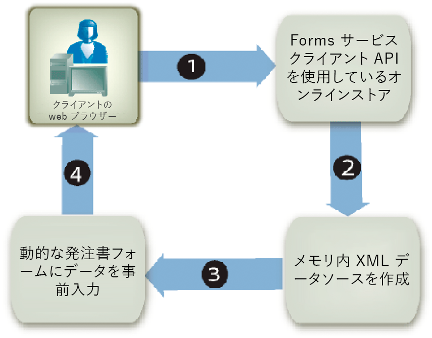

# 編集可能なレイアウトでのフォームの自動埋め込み {#prepopulating-forms-with-flowable-layouts1}

## 編集可能なレイアウトでのフォームの自動埋め込み {#prepopulating-forms-with-flowable-layouts2}

フォームの自動埋め込みは、レンダリングされたフォーム内のユーザーにデータを表示します。 例えば、ユーザーがユーザー名とパスワードを使用してWebサイトにログインしたとします。 認証が成功した場合、クライアントアプリケーションはクエリ情報のデータベースを作成します。 データがフォームにマージされ、フォームがユーザーにレンダリングされます。 その結果、ユーザーはフォーム内のパーソナライズされた表示データをパーソナライズできます。

フォームの自動埋め込みには、次の利点があります。

* ユーザーがフォーム内にカスタムデータを表示できる.
* ユーザーがフォームに入力する際の入力量を減らします。
* データを配置する場所を制御できるため、データの整合性を維持できる.

次の2つのXMLデータソースを使用して、フォームに事前入力できます。

* XDPデータソース。XFA構文（またはAcrobatを使用して作成されたフォームの事前入力用のXFDFデータ）に準拠するXMLです。
* フォームのフィールド名に一致する名前と値のペアを含む任意のXMLデータソース（この節の例では、任意のXMLデータソースを使用します）。

XML要素は、事前入力するすべてのフォームフィールドに存在する必要があります。 XML要素名は、フィールド名と一致する必要があります。 XML要素がフォームフィールドに対応していない場合、またはXML要素名がフィールド名と一致しない場合、XML要素は無視されます。 すべてのXML要素が指定されている限り、XML要素が表示される順序と一致する必要はありません。

既にデータを含むフォームに事前入力する場合は、XMLデータソース内に既に表示されているデータを指定する必要があります。 10個のフィールドを含むフォームに4つのフィールドのデータが含まれているとします。 次に、残りの6つのフィールドに事前入力するとします。 この場合、フォームの事前入力に使用するXMLデータソースに10個のXML要素を指定する必要があります。 6つの要素のみを指定した場合、元の4つのフィールドは空になります。

例えば、サンプルの確認フォームなどのフォームを事前入力できます。 (インタラクティブPDFフォームのレンダリングの「 [確認フォーム」を参照](/help/forms/developing/rendering-interactive-pdf-forms.md))。

サンプルの確認フォームを事前入力するには、フォーム内の3つのフィールドに一致する3つのXML要素を含むXMLデータソースを作成する必要があります。 このフォームには、次の3つのフィールドが含まれています。 `FirstName`、、 `LastName`および `Amount`。 最初の手順は、フォームデザイン内のフィールドと一致するXML要素を含むXMLデータソースを作成することです。 次の手順は、次のXMLコードに示すように、XML要素にデータ値を割り当てることです。

```as3
     <Untitled>
         <FirstName>Jerry</FirstName>
         <LastName>Johnson</LastName>
         <Amount>250000</Amount>
     </Untitled>
```

次の図に示すように、確認フォームにこのXMLデータソースを事前入力し、フォームをレンダリングすると、XML要素に割り当てたデータ値が表示されます。


### 編集可能なレイアウトでのフォームの自動埋め込み {#prepopulating_forms_with_flowable_layouts-1}

編集可能なレイアウトを含むフォームは、不確定な量のデータをユーザーに表示する場合に便利です。 フォームのレイアウトは結合されるデータ量に応じて自動的に調整されるので、固定レイアウトのフォームの場合と同様に、固定レイアウトやページ数を事前に決める必要はありません。

通常、フォームには実行時に取得されるデータが入力されます。 その結果、メモリ内XMLデータソースを作成し、そのデータをメモリ内XMLデータソースに直接配置することで、フォームに事前入力できます。

オンラインストアなど、Webベースのアプリケーションを考えます。 オンライン買い物客が品目の購入を完了すると、購入したすべての品目が、フォームの事前入力に使用されるメモリ内XMLデータソースに配置されます。 次の図に、このプロセスを示します。このプロセスについて、図の後の表で説明します。



次の表に、この図の手順を示します。

<table>
 <thead>
  <tr>
   <th><p>ステップ</p></th>
   <th><p>説明</p></th>
  </tr>
 </thead>
 <tbody>
  <tr>
   <td><p>1</p></td>
   <td><p>ユーザは、Webベースのオンラインストアからアイテムを購入します。 </p></td>
  </tr>
  <tr>
   <td><p>2</p></td>
   <td><p>ユーザーが項目の購入を完了し、「送信」ボタンをクリックすると、メモリ内XMLデータソースが作成されます。 購入したアイテムとユーザー情報は、メモリ内のXMLデータソースに配置されます。 </p></td>
  </tr>
  <tr>
   <td><p>3</p></td>
   <td><p>XMLデータソースは、発注書フォームの自動埋め込みに使用されます（このフォームの例を次の表に示します）。 </p></td>
  </tr>
  <tr>
   <td><p>4</p></td>
   <td><p>発注書フォームがクライアントWebブラウザーにレンダリングされます。 </p></td>
  </tr>
 </tbody>
</table>

次の図に、発注書フォームの例を示します。 表の情報は、XMLデータのレコード数に合わせて調整できます。


>[!NOTE]
>
>フォームには、エンタープライズデータベースや外部アプリケーションなど、他のソースのデータを事前入力することができます。

### フォームデザインに関する考慮事項 {#form-design-considerations}

編集可能なレイアウトを含むフォームは、Designerで作成されたフォームデザインに基づいています。 フォームデザインでは、ユーザーの入力に基づく値の計算を含む、レイアウト、プレゼンテーション、データ取得ルールのセットを指定します。 ルールは、データがフォームに入力されると適用されます。 フォームに追加されるフィールドは、フォームデザイン内のサブフォームです。 例えば、前の図に示した発注書フォームでは、各行がサブフォームです。 サブフォームを含むフォームデザインの作成について詳しくは、編集可能なレイア [ウトを含む発注書フォームの作成を参照してください](https://www.adobe.com/go/learn_aemforms_qs_poformflowable_9)。

### データサブグループについて {#understanding-data-subgroups}

XMLデータソースは、フォームに固定レイアウトと編集可能なレイアウトを事前入力するために使用されます。 ただし、フォームに編集可能なレイアウトを埋め込むXMLデータソースには、フォーム内で繰り返されるサブフォームの自動埋め込みに使用される繰り返しXML要素が含まれています。 これらの繰り返しXML要素は、データサブグループと呼ばれます。

前の図に示した発注書フォームの自動埋め込みに使用されるXMLデータソースには、4つの繰り返しデータサブグループが含まれています。 各データサブグループは、購入した品目に対応します。 購入された商品は、モニタ、卓上ランプ、電話、アドレス帳です。

次のXMLデータソースを使用して、発注書フォームに事前入力します。

```as3
     <header>
         <!-- XML elements used to prepopulate non-repeating fields such as address
         <!and city
         <txtPONum>8745236985</txtPONum>
         <dtmDate>2004-02-08</dtmDate>
         <txtOrderedByCompanyName>Any Company Name</txtOrderedByCompanyName>
         <txtOrderedByAddress>555, Any Blvd.</txtOrderedByAddress>
         <txtOrderedByCity>Any City</txtOrderedByCity>
         <txtOrderedByStateProv>ST</txtOrderedByStateProv>
         <txtOrderedByZipCode>12345</txtOrderedByZipCode>
         <txtOrderedByCountry>Any Country</txtOrderedByCountry>
         <txtOrderedByPhone>(123) 456-7890</txtOrderedByPhone>
         <txtOrderedByFax>(123) 456-7899</txtOrderedByFax>
         <txtOrderedByContactName>Contact Name</txtOrderedByContactName>
         <txtDeliverToCompanyName>Any Company Name</txtDeliverToCompanyName>
         <txtDeliverToAddress>7895, Any Street</txtDeliverToAddress>
         <txtDeliverToCity>Any City</txtDeliverToCity>
         <txtDeliverToStateProv>ST</txtDeliverToStateProv>
         <txtDeliverToZipCode>12346</txtDeliverToZipCode>
         <txtDeliverToCountry>Any Country</txtDeliverToCountry>
         <txtDeliverToPhone>(123) 456-7891</txtDeliverToPhone>
         <txtDeliverToFax>(123) 456-7899</txtDeliverToFax>
         <txtDeliverToContactName>Contact Name</txtDeliverToContactName>
     </header>
     <detail>
         <!-- A data subgroup that contains information about the monitor>
         <txtPartNum>00010-100</txtPartNum>
         <txtDescription>Monitor</txtDescription>
         <numQty>1</numQty>
         <numUnitPrice>350.00</numUnitPrice>
     </detail>
     <detail>
         <!-- A data subgroup that contains information about the desk lamp>
         <txtPartNum>00010-200</txtPartNum>
         <txtDescription>Desk lamps</txtDescription>
         <numQty>3</numQty>
         <numUnitPrice>55.00</numUnitPrice>
     </detail>
     <detail>
         <!-- A data subgroup that contains information about the Phone>
             <txtPartNum>00025-275</txtPartNum>
             <txtDescription>Phone</txtDescription>
             <numQty>5</numQty>
             <numUnitPrice>85.00</numUnitPrice>
     </detail>
     <detail>
         <!-- A data subgroup that contains information about the address book>
         <txtPartNum>00300-896</txtPartNum>
         <txtDescription>Address book</txtDescription>
         <numQty>2</numQty>
         <numUnitPrice>15.00</numUnitPrice>
     </detail>
```

各データサブグループには、次の情報に対応する4つのXML要素が含まれています。

* 項目のパーツ番号
* 項目の説明
* 品目の数量
* 単価

データサブグループの親XML要素の名前は、フォームデザイン内のサブフォームの名前と一致する必要があります。 例えば、前の図では、データサブグループの親XML要素の名前がになっています `detail`。 これは、発注書フォームの基になるフォームデザイン内のサブフォームの名前に対応します。 データサブグループの親XML要素の名前とサブフォームの名前が一致しない場合、サーバー側のフォームは事前入力されません。

各データサブグループには、サブフォーム内のフィールド名と一致するXML要素が含まれている必要があります。 フォーム `detail` デザイン内のサブフォームには、次のフィールドが含まれています。

* txtPartNum
* txtDescription
* numQty
* numUnitPrice

>[!NOTE]
>
>繰り返しXML要素を含むデータソースを使用してフォームに事前入力しようとし、このオプションをに設定した場合、最初のデータレコ `RenderAtClient` ー `No`ドのみがフォームにマージされます。 すべてのデータレコードが確実にフォームにマージされるようにするには、をに設 `RenderAtClient` 定しま `Yes`す。 このオプションについて詳しくは、「ク `RenderAtClient` ライアントでのフ [ォームのレンダリング」を参照してくださ](/help/forms/developing/rendering-forms-client.md)い。

>[!NOTE]
>
>For more information about the Forms service, see [Services Reference for AEM Forms](https://www.adobe.com/go/learn_aemforms_services_63).

### 手順の概要 {#summary-of-steps}

編集可能なレイアウトを含むフォームを事前入力するには、次のタスクを実行します。

1. プロジェクトファイルを含めます。
1. メモリ内XMLデータソースを作成します。
1. XMLデータソースを変換します。
1. 事前入力されたフォームをレンダリングします。

**プロジェクトファイルを含める**

必要なファイルを開発プロジェクトに含めます。 Javaを使用してクライアントアプリケーションを作成する場合は、必要なJARファイルを含めます。 Webサービスを使用している場合は、必ずプロキシファイルを含めてください。

**プロジェクトファイルを含める**

必要なファイルを開発プロジェクトに含めます。 Javaを使用してクライアントアプリケーションを作成する場合は、必要なJARファイルを含めます。 Webサービスを使用している場合は、必ずプロキシファイルを含めてください。

**メモリ内XMLデータソースの作成**

クラスを使用して、 `org.w3c.dom` メモリ内XMLデータソースを作成し、編集可能なレイアウトでフォームに事前入力することができます。 フォームに適合するXMLデータソースにデータを配置する必要があります。 編集可能なレイアウトを含むフォームとXMLデータソースとの関係について詳しくは、データサブグループにつ [いてを参照してください](#understanding-data-subgroups)。

**XMLデータソースの変換**

クラスを使用して作成されたメモリ内XMLデータソースは、 `org.w3c.dom` フォームの自動埋め込みに使用する前に、オ `com.adobe.idp.Document` ブジェクトに変換することができます。 メモリ内XMLデータソースは、Java XML変換クラスを使用して変換できます。

>[!NOTE]
>
>FormsサービスのWSDLを使用してフォームに事前入力する場合は、オブジェクトをオブジェクトに変換 `org.w3c.dom.Document` する必要があり `BLOB` ます。

**事前入力されたフォームのレンダリング**

他のフォームと同様に、事前入力されたフォームをレンダリングします。 唯一の違いは、XMLデータソースを含むオ `com.adobe.idp.Document` ブジェクトを使用してフォームに事前入力する点です。

**関連トピック**

[AEM Forms Java ライブラリファイルを含める](/help/forms/developing/invoking-aem-forms-using-java.md#including-aem-forms-java-library-files)

[接続プロパティの設定](/help/forms/developing/invoking-aem-forms-using-java.md#setting-connection-properties)

[FormsサービスAPIのクイック開始](/help/forms/developing/forms-service-api-quick-starts.md#forms-service-api-quick-starts)

[インタラクティブPDFフォームのレンダリング](/help/forms/developing/rendering-interactive-pdf-forms.md)

[フォームをレンダリングするWeb アプリケーションの作成](/help/forms/developing/creating-web-applications-renders-forms.md)

### Java APIを使用したフォームの自動埋め込み {#prepopulating-forms-using-the-java-api}

Forms API(Java)を使用して編集可能なレイアウトでフォームを事前入力するには、次の手順を実行します。

1. プロジェクトファイルを含める

   Javaプロジェクトのクラスパスに、adobe-forms-client.jarなどのクライアントJARファイルを含めます。 これらのファイルの場所については、[AEM Forms Java ライブラリファイルを含める](/help/forms/developing/invoking-aem-forms-using-java.md#including-aem-forms-java-library-files)を参照してください。

1. メモリ内XMLデータソースの作成

   * クラスのメソッド `DocumentBuilderFactory` を呼び出して、Javaオブジ `DocumentBuilderFactory` ェクトを作成 `newInstance` します。
   * オブジェクトのメ `DocumentBuilder` ソッドを呼び出して、Java `DocumentBuilderFactory` オブジェクトを作成 `newDocumentBuilder` します。
   * オブジェクトのメ `DocumentBuilder` ソッドを呼び出し `newDocument` て、オブジェクトをインスタンス化 `org.w3c.dom.Document` します。
   * オブジェクトのメソッドを呼び出して、XMLデータソースのル `org.w3c.dom.Document` ート要素を作成 `createElement` します。 これにより、ルート `Element` 要素を表すオブジェクトが作成されます。 要素の名前を表すstring値をメソッドに渡し `createElement` ます。 戻り値を `Element` にキャストします。次に、オブジェクトのメソッドを呼び出してルート要素を `Document` ドキュメントに追加し、ル `appendChild` ート要素オブジェクトを引数として渡します。 次のコード行に、このアプリケーションロジックを示します。

      ` Element root = (Element)document.createElement("transaction");  document.appendChild(root);`

   * オブジェクトのメソッドを呼び出して、XMLデータソースのヘッ `Document` ダー要素を作成 `createElement` します。 要素の名前を表すstring値をメソッドに渡し `createElement` ます。 戻り値を `Element` にキャストします。次に、オブジェクトのメソッドを呼び出して、ルート要素に `root` ヘッダー要素を追 `appendChild` 加し、ヘッダー要素オブジェクトを引数として渡します。 ヘッダー要素に追加されるXML要素は、フォームの静的な部分に対応します。 次のコード行は、このアプリケーションロジックを示しています。

      ` Element header = (Element)document.createElement("header");  root.appendChild(header);`

   * オブジェクトのメソッドを呼び出して、header要素に属する `Document` 子要素を作 `createElement` 成し、要素の名前を表すstring値を渡します。 戻り値を `Element` にキャストします。次に、子要素のメソッドを呼び出して値を設定 `appendChild` し、オブジェクトのメ `Document` ソッドを引 `createTextNode` 数として渡します。 子要素の値として表示する文字列値を指定します。 最後に、header要素のメソッドを呼び出して、header要素に子要素を追加し、 `appendChild` 子要素オブジェクトを引数として渡します。 次のコード行は、このアプリケーションロジックを示しています。

      ` Element poNum= (Element)document.createElement("txtPONum");  poNum.appendChild(document.createTextNode("8745236985"));  header.appendChild(LastName);`


   * フ追加ォームの静的な部分に表示される各フィールドの最後のサブステップを繰り返して、ヘッダー要素の残りのすべての要素(XMLデータソース図では、これらのフィールドがAの節に表示されます。(データサブグ [ループについてを参照](#understanding-data-subgroups))。
   * オブジェクトのメソッドを呼び出して、XMLデータソースの `Document` 詳細要素を作成 `createElement` します。 要素の名前を表すstring値をメソッドに渡し `createElement` ます。 戻り値を `Element` にキャストします。次に、オブジェクトのメソッドを呼び出して、ルート要素に `root` 詳細要素を追加 `appendChild` し、引数としてdetail要素オブジェクトを渡します。 詳細要素に追加されるXML要素は、フォームの動的な部分に対応します。 次のコード行は、このアプリケーションロジックを示しています。

      ` Element detail = (Element)document.createElement("detail");  root.appendChild(detail);`

   * オブジェクトのメソッドを呼び出して、detail要素に属す `Document` る子要素を作 `createElement` 成し、要素の名前を表すstring値を渡します。 戻り値を `Element` にキャストします。次に、子要素のメソッドを呼び出して値を設定 `appendChild` し、オブジェクトのメ `Document` ソッドを引 `createTextNode` 数として渡します。 子要素の値として表示する文字列値を指定します。 最後に、detail要素のメソッドを呼び出して子要素をdetail要素に追加し、 `appendChild` 子要素オブジェクトを引数として渡します。 次のコード行は、このアプリケーションロジックを示しています。

      ` Element txtPartNum = (Element)document.createElement("txtPartNum");  txtPartNum.appendChild(document.createTextNode("00010-100"));  detail.appendChild(txtPartNum);`

   * 詳細要素に追加するすべてのXML要素に対して、最後のサブ手順を繰り返します。 発注書フォームへの入力に使用するXMLデータソースを適切に作成するには、次のXML要素を詳細要素に追加する必要があります。 `txtDescription`、、 `numQty`および `numUnitPrice`。
   * フォームの事前入力に使用されるすべてのデータ項目に対して、最後の2つのサブ手順を繰り返します。

1. XMLデータソースの変換

   * オブジェクトの `javax.xml.transform.Transformer` 静的メソッドを呼び出し `javax.xml.transform.Transformer` て、オブジェクトを作成 `newInstance` します。
   * オブジェクトの `Transformer` メソッドを呼び出して、オ `TransformerFactory` ブジェクトを作成 `newTransformer` します。
   * コンストラクタを使用して `ByteArrayOutputStream` オブジェクトを作成します。
   * コンストラク `javax.xml.transform.dom.DOMSource` ターを使用し、手順1で作成したオブジ `org.w3c.dom.Document` ェクトを渡して、オブジェクトを作成します。
   * コンストラクタを使用して `javax.xml.transform.dom.DOMSource` オブジェクトを渡すことによって、`ByteArrayOutputStream` オブジェクトを作成します。
   * オブジェクトのメ `ByteArrayOutputStream` ソッドを呼び出し、およびオ `javax.xml.transform.Transformer` ブジェクトを渡 `transform` すことで、Javaオブジ `javax.xml.transform.dom.DOMSource` ェクトを入 `javax.xml.transform.stream.StreamResult` 力します。
   * バイト配列を作成し、オブジェクトのサイズをバ `ByteArrayOutputStream` イト配列に割り当てます。
   * オブジェクトのメソッドを呼び出して、バ `ByteArrayOutputStream` イト配列を設定 `toByteArray` します。
   * Create a `com.adobe.idp.Document` object by using its constructor and passing the byte array.

1. 事前入力されたフォームのレンダリング

   オブジェクト `FormsServiceClient` のメソッドを `renderPDFForm` 呼び出し、次の値を渡します。

   * ファイル名の拡張子を含む、フォームデザイン名を指定するstring値。
   * フォーム `com.adobe.idp.Document` とマージするデータを含むオブジェクトです。 手順1と2で作成したオ `com.adobe.idp.Document` ブジェクトを使用してください。
   * 実行時 `PDFFormRenderSpec` のオプションを格納するオブジェクト。
   * Formsサ `URLSpec` ービスで必要なURI値を含むオブジェクトです。
   * 添付ファ `java.util.HashMap` イルを格納するオブジェクト。 これはオプションのパラメーターで、フォームにフ `null` ァイルを添付しないかどうかを指定できます。
   このメソ `renderPDFForm` ッドは、クラ `FormsResult` イアントWebブラウザーに書き込む必要があるフォームデータストリームを含むオブジェクトを返します。

   * フォームデー `javax.servlet.ServletOutputStream` タストリームをクライアントのWebブラウザーに送信するために使用するオブジェクトを作成します。
   * オブジェクトの `com.adobe.idp.Document` メソッドを呼び出して、オ `FormsResult` ブジェクトを作成 `getOutputContent` します。
   * オブジェクトの `java.io.InputStream` メソッドを呼び出して、オ `com.adobe.idp.Document` ブジェクトを作成 `getInputStream` します。
   * オブジェクトのメソッドを呼び出し、バイト配列を引数として渡すことで、バ `InputStream` イト配列を作成 `read` し、フォームデータストリームを埋め込みます。
   * オブジェクト `javax.servlet.ServletOutputStream` のメソッドを呼 `write` び出して、フォームデータストリームをクライアントWebブラウザーに送信します。 バイト配列をメソッドに渡し `write` ます。


**関連トピック**

[クイック開始（SOAPモード）:Java APIを使用した編集可能なレイアウトでのフォームの自動埋め込み](/help/forms/developing/forms-service-api-quick-starts.md#quick-start-soap-mode-prepopulating-forms-with-flowable-layouts-using-the-java-api)

[AEM Forms Java ライブラリファイルを含める](/help/forms/developing/invoking-aem-forms-using-java.md#including-aem-forms-java-library-files)

[接続プロパティの設定](/help/forms/developing/invoking-aem-forms-using-java.md#setting-connection-properties)

### WebサービスAPIを使用したフォームの事前入力 {#prepopulating-forms-using-the-web-service-api}

Forms API（Webサービス）を使用して、編集可能なレイアウトでフォームを事前入力するには、次の手順を実行します。

1. プロジェクトファイルを含める

   * FormsサービスのWSDLを使用するJavaプロキシクラスを作成します。 (「Apache Axisを使 [用したJavaプロキシクラスの作成](/help/forms/developing/invoking-aem-forms-using-web.md#creating-java-proxy-classes-using-apache-axis)」を参照)。
   * クラスパスにJavaプロキシクラスを含めます。

1. メモリ内XMLデータソースの作成

   * クラスのメソッド `DocumentBuilderFactory` を呼び出して、Javaオブジ `DocumentBuilderFactory` ェクトを作成 `newInstance` します。
   * オブジェクトのメ `DocumentBuilder` ソッドを呼び出して、Java `DocumentBuilderFactory` オブジェクトを作成 `newDocumentBuilder` します。
   * オブジェクトのメ `DocumentBuilder` ソッドを呼び出し `newDocument` て、オブジェクトをインスタンス化 `org.w3c.dom.Document` します。
   * オブジェクトのメソッドを呼び出して、XMLデータソースのル `org.w3c.dom.Document` ート要素を作成 `createElement` します。 これにより、ルート `Element` 要素を表すオブジェクトが作成されます。 要素の名前を表すstring値をメソッドに渡し `createElement` ます。 戻り値を `Element` にキャストします。次に、オブジェクトのメソッドを呼び出してルート要素を `Document` ドキュメントに追加し、ル `appendChild` ート要素オブジェクトを引数として渡します。 次のコード行は、このアプリケーションロジックを示しています。

      ` Element root = (Element)document.createElement("transaction");  document.appendChild(root);`

   * オブジェクトのメソッドを呼び出して、XMLデータソースのヘッ `Document` ダー要素を作成 `createElement` します。 要素の名前を表すstring値をメソッドに渡し `createElement` ます。 戻り値を `Element` にキャストします。次に、オブジェクトのメソッドを呼び出して、ルート要素に `root` ヘッダー要素を追 `appendChild` 加し、ヘッダー要素オブジェクトを引数として渡します。 ヘッダー要素に追加されるXML要素は、フォームの静的な部分に対応します。 次のコード行は、このアプリケーションロジックを示しています。

      ` Element header = (Element)document.createElement("header");  root.appendChild(header);`

   * オブジェクトのメソッドを呼び出して、header要素に属する `Document` 子要素を作 `createElement` 成し、要素の名前を表すstring値を渡します。 戻り値を `Element` にキャストします。次に、子要素のメソッドを呼び出して値を設定 `appendChild` し、オブジェクトのメ `Document` ソッドを引 `createTextNode` 数として渡します。 子要素の値として表示する文字列値を指定します。 最後に、header要素のメソッドを呼び出して、header要素に子要素を追加し、 `appendChild` 子要素オブジェクトを引数として渡します。 次のコード行に、このアプリケーションロジックを示します。

      ` Element poNum= (Element)document.createElement("txtPONum");  poNum.appendChild(document.createTextNode("8745236985"));  header.appendChild(LastName);`

   * フ追加ォームの静的な部分に表示される各フィールドの最後のサブステップを繰り返して、ヘッダー要素の残りのすべての要素(XMLデータソース図では、これらのフィールドがAの節に表示されます。(データサブグ [ループについてを参照](#understanding-data-subgroups))。
   * オブジェクトのメソッドを呼び出して、XMLデータソースの `Document` 詳細要素を作成 `createElement` します。 要素の名前を表すstring値をメソッドに渡し `createElement` ます。 戻り値を `Element` にキャストします。次に、オブジェクトのメソッドを呼び出して、ルート要素に `root` 詳細要素を追加 `appendChild` し、引数としてdetail要素オブジェクトを渡します。 詳細要素に追加されるXML要素は、フォームの動的な部分に対応します。 次のコード行に、このアプリケーションロジックを示します。

      ` Element detail = (Element)document.createElement("detail");  root.appendChild(detail);`

   * オブジェクトのメソッドを呼び出して、detail要素に属す `Document` る子要素を作 `createElement` 成し、要素の名前を表すstring値を渡します。 戻り値を `Element` にキャストします。次に、子要素のメソッドを呼び出して値を設定 `appendChild` し、オブジェクトのメ `Document` ソッドを引 `createTextNode` 数として渡します。 子要素の値として表示する文字列値を指定します。 最後に、detail要素のメソッドを呼び出して子要素をdetail要素に追加し、 `appendChild` 子要素オブジェクトを引数として渡します。 次のコード行に、このアプリケーションロジックを示します。

      ` Element txtPartNum = (Element)document.createElement("txtPartNum");  txtPartNum.appendChild(document.createTextNode("00010-100"));  detail.appendChild(txtPartNum);`

   * 詳細要素に追加するすべてのXML要素に対して、最後のサブ手順を繰り返します。 発注書フォームへの入力に使用するXMLデータソースを適切に作成するには、次のXML要素を詳細要素に追加する必要があります。 `txtDescription`、、 `numQty`および `numUnitPrice`。
   * フォームの事前入力に使用されるすべてのデータ項目に対して、最後の2つのサブ手順を繰り返します。

1. XMLデータソースの変換

   * オブジェクトの `javax.xml.transform.Transformer` 静的メソッドを呼び出し `javax.xml.transform.Transformer` て、オブジェクトを作成 `newInstance` します。
   * オブジェクトの `Transformer` メソッドを呼び出して、オ `TransformerFactory` ブジェクトを作成 `newTransformer` します。
   * コンストラクタを使用して `ByteArrayOutputStream` オブジェクトを作成します。
   * コンストラク `javax.xml.transform.dom.DOMSource` ターを使用し、手順1で作成したオブジ `org.w3c.dom.Document` ェクトを渡して、オブジェクトを作成します。
   * コンストラクタを使用して `javax.xml.transform.dom.DOMSource` オブジェクトを渡すことによって、`ByteArrayOutputStream` オブジェクトを作成します。
   * オブジェクトのメ `ByteArrayOutputStream` ソッドを呼び出し、およびオ `javax.xml.transform.Transformer` ブジェクトを渡 `transform` すことで、Javaオブジ `javax.xml.transform.dom.DOMSource` ェクトを入 `javax.xml.transform.stream.StreamResult` 力します。
   * バイト配列を作成し、オブジェクトのサイズをバ `ByteArrayOutputStream` イト配列に割り当てます。
   * オブジェクトのメソッドを呼び出して、バ `ByteArrayOutputStream` イト配列を設定 `toByteArray` します。
   * コンストラクター `BLOB` を使用してオブジェクトを作成し、そのメソッドを呼 `setBinaryData` び出して、バイト配列を渡します。

1. 事前入力されたフォームのレンダリング

   オブジェクト `FormsService` のメソッドを `renderPDFForm` 呼び出し、次の値を渡します。

   * ファイル名の拡張子を含む、フォームデザイン名を指定するstring値。
   * フォーム `BLOB` とマージするデータを含むオブジェクトです。 手順1と2で作成したオ `BLOB` ブジェクトを使用していることを確認します。
   * 実行時 `PDFFormRenderSpecc` のオプションを格納するオブジェクト。 For more information, see [AEM Forms API Reference](https://www.adobe.com/go/learn_aemforms_javadocs_63_en).
   * Formsサ `URLSpec` ービスで必要なURI値を含むオブジェクトです。
   * 添付ファ `java.util.HashMap` イルを格納するオブジェクト。 これはオプションのパラメーターで、フォームにフ `null` ァイルを添付しないかどうかを指定できます。
   * メソッドに `com.adobe.idp.services.holders.BLOBHolder` よって入力される空のオブジェクトです。 これは、レンダリングされたPDFフォームを保存するために使用されます。
   * メソッドに `javax.xml.rpc.holders.LongHolder` よって入力される空のオブジェクトです。 （この引数は、フォームのページ数を格納します）。
   * メソッドに `javax.xml.rpc.holders.StringHolder` よって入力される空のオブジェクトです。 （この引数にはロケールの値が格納されます）。
   * この操作の `com.adobe.idp.services.holders.FormsResultHolder` 結果を含む空のオブジェクトです。
   メソッド `renderPDFForm` は、最後の引 `com.adobe.idp.services.holders.FormsResultHolder` 数として渡されたオブジェクトに、クライアントWebブラウザーに書き込む必要のあるフォームデータストリームを設定します。

   * オブジェクト `FormResult` のデータメンバーの値を取得して、オ `com.adobe.idp.services.holders.FormsResultHolder` ブジェクトを `value` 作成します。
   * オブジェクトの `BLOB` メソッドを呼び出して、フォームデータを含む `FormsResult` オブジェクトを作成 `getOutputContent` します。
   * メソッドを呼び出して、オブジェ `BLOB` クトのコンテンツタイプを取 `getContentType` 得します。
   * メソッドを呼 `javax.servlet.http.HttpServletResponse` び出し、オブジェクトのコンテ `setContentType` ンツタイプを渡して、オブジェクトのコンテンツタイプを設定 `BLOB` します。
   * オブジェクトの `javax.servlet.ServletOutputStream` メソッドを呼び出して、フォームデータストリームをクライアントのWebブラウザーに書き込むために使用す `javax.servlet.http.HttpServletResponse` るオブジェクトを作成 `getOutputStream` します。
   * バイト配列を作成し、オブジェクトのメソッドを呼び出 `BLOB` して値を設定 `getBinaryData` します。 このタスクは、オブジェクトの内容をバ `FormsResult` イト配列に割り当てます。
   * オブジェクト `javax.servlet.http.HttpServletResponse` のメソッドを呼 `write` び出して、フォームデータストリームをクライアントWebブラウザーに送信します。 バイト配列をメソッドに渡し `write` ます。
   >[!NOTE]
   >
   >メソッド `renderPDFForm` は、最後の引 `com.adobe.idp.services.holders.FormsResultHolder` 数として渡されたオブジェクトに、クライアントWebブラウザーに書き込む必要のあるフォームデータストリームを設定します。

**関連トピック**

[Base64エンコーディングを使用したAEM Formsの呼び出し](/help/forms/developing/invoking-aem-forms-using-web.md#invoking-aem-forms-using-base64-encoding)

