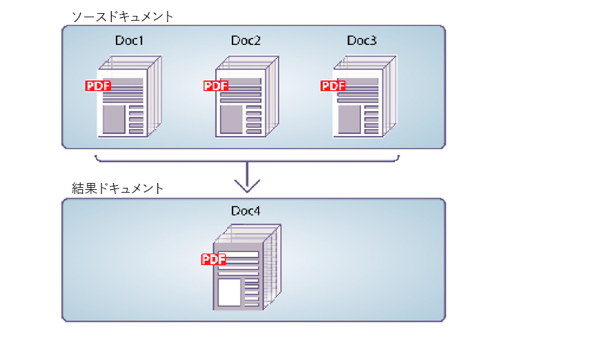

# プログラムによるPDFドキュメントのアセンブリ {#programmatically-assembling-pdf-documents}

Assembler Service APIを使用すると、複数のPDFドキュメントを1つのPDFドキュメントにアセンブリできます。 次の図は、3つのPDFドキュメントを1つのPDFドキュメントに結合する様子を示しています。



2つ以上のPDFドキュメントを1つのPDFドキュメントにアセンブリするには、DDXドキュメントが必要です。 DDXドキュメントは、Assemblerサービスが生成するPDFドキュメントを記述します。 つまり、DDXドキュメントは、実行するアクションをAssemblerサービスに指示します。

この説明の目的で、次のDDXドキュメントが使用されているとします。

```xml
 <?xml version="1.0" encoding="UTF-8"?>
 <DDX xmlns="https://ns.adobe.com/DDX/1.0/">
     <PDF result="out.pdf">
         <PDF source="map.pdf" />
         <PDF source="directions.pdf" />
     </PDF>
 </DDX>
```

このDDXドキュメントは、 *map.pdf* および ** directions.pdfという2つのPDFドキュメントを1つのPDFドキュメントにマージします。

>[!NOTE]
>
>PDFドキュメントをディスアセンブリするDDXドキュメントを確認するには、「PDFドキュメントの [プログラムによるディスアセンブリ](/help/forms/developing/programmatically-disassembling-pdf-documents.md#programmatically-disassembling-pdf-documents)」を参照してください。

>[!NOTE]
>
>For more information about the Assembler service, see [Services Reference for AEM Forms](https://www.adobe.com/go/learn_aemforms_services_63).

>[!NOTE]
>
>DDXドキュメントについて詳しくは、『 [Assembler Service and DDX Reference](https://www.adobe.com/go/learn_aemforms_ddx_63)』を参照してください。

## Webサービスを使用してAssemblerサービスを呼び出す場合の考慮事項 {#considerations-when-invoking-assembler-service-using-web-services}

大きなドキュメントのアセンブリ中にヘッダーとフッターを追加すると、 `OutOfMemory` エラーが発生し、ファイルがアセンブルされない場合があります。 この問題が発生する可能性を低くするには、次の例に示すように、DDXドキュメントに `DDXProcessorSetting` 要素を追加します。

`<DDXProcessorSetting name="checkpoint" value="2000" />`

この要素は、要素の子として、または `DDX` 要素の子として追加でき `PDF result` ます。 この設定のデフォルト値は0（ゼロ）で、チェックポイントがオフになり、DDXは `DDXProcessorSetting` 要素が存在しない場合と同じ動作をします。 エラーが発生した場合は、値を整数（通常は500 ～ 5000）に設定する必要があります。 `OutOfMemory` チェックポイントの値を小さくすると、チェックポイントの頻度が高くなります。

## 手順の概要 {#summary-of-steps}

複数のPDFドキュメントから単一のPDFドキュメントをアセンブリするには、次のタスクを実行します。

1. プロジェクトファイルを含めます。
1. PDFアセンブラクライアントを作成します。
1. 既存のDDXドキュメントの参照。
1. 入力PDFドキュメントを参照します。
1. 実行時オプションを設定します。
1. 入力PDFドキュメントをアセンブリします。
1. 結果を抽出します。

**プロジェクトファイルを含める**

必要なファイルを開発プロジェクトに含めます。 Javaを使用してクライアントアプリケーションを作成する場合は、必要なJARファイルを含めます。 Webサービスを使用している場合は、プロキシファイルを必ず含めてください。

次のJARファイルをプロジェクトのクラスパスに追加する必要があります。

* adobe-livecycle-client.jar
* adobe-usermanager-client.jar
* adobe-assembler-client.jar
* adobe-utilities.jar(AEM FormsがJBossにデプロイされている場合に必要)
* jbossall-client.jar(AEM FormsがJBossにデプロイされている場合に必要)

AEM FormsがJBoss以外のサポート対象のJ2EEアプリケーションサーバーにデプロイされている場合は、adobe-utilities.jarファイルとjbossall-client.jarファイルを、AEM FormsがデプロイされているJ2EEアプリケーションサーバーに固有のJARファイルに置き換える必要があります。

**PDFアセンブラクライアントの作成**

プログラムによってAssembler操作を実行する前に、Assemblerクライアントを作成する必要があります。

**既存のDDXドキュメントの参照**

PDFドキュメントをアセンブリするには、DDXドキュメントを参照する必要があります。 例えば、この節で紹介したDDXドキュメントについて考えてみましょう。 このDDXドキュメントは、2つのPDFドキュメントを1つのPDFドキュメントに結合するようAssemblerサービスに指示します。

**参照入力PDFドキュメント**

Assemblerサービスに渡す入力PDFドキュメントを参照します。 例えば、MapとDirectionsという名前の2つの入力PDFドキュメントーを渡す場合は、対応するPDFファイルを渡す必要があります。

map.pdfファイルとdirections.pdfファイルは、両方ともコレクションオブジェクトに配置する必要があります。 キーの名前は、DDXドキュメントのPDF source属性の値と一致する必要があります。 DDXドキュメントのkey属性とsource属性が一致した場合、PDFファイルの名前は関係ありません。

>[!NOTE]
>
>操作を呼び出すと、コレクションオブジェクトを含む `AssemblerResult` オブジェクトが返され `invokeDDX` ます。 この操作は、2つ以上の入力PDFドキュメントをAssemblerサービスに渡す場合に使用します。 ただし、1つの入力PDFのみをAssemblerサービスに渡し、1つの戻りドキュメントのみが必要な場合は、 `invokeOneDocument` 操作を呼び出します。 この操作を呼び出すと、1つのドキュメントが返されます。 この操作の使用について詳しくは、暗号化されたPDFドキュメントの [アセンブリを参照してください](/help/forms/developing/assembling-encrypted-pdf-documents.md#assembling-encrypted-pdf-documents)。

**実行時オプションの設定**

ジョブの実行中にAssemblerサービスの動作を制御する実行時オプションを設定できます。 例えば、エラーが発生した場合にジョブの処理を続行するようAssemblerサービスに指示するオプションを設定できます。 設定できる実行時オプションについて詳しくは、『 `AssemblerOptionSpec` AEM FormsAPIリファレンス』の [クラス参照を参照してください](https://www.adobe.com/go/learn_aemforms_javadocs_63_en)。

**入力PDFドキュメントのアセンブリ**

サービスクライアントを作成し、DDXファイルを参照し、入力PDFドキュメントを格納するコレクションオブジェクトを作成し、実行時オプションを設定した後で、DDX操作を呼び出すことができます。 この節で指定するDDXドキュメントを使用する場合、map.pdfファイルとdirection.pdfファイルが1つのPDFドキュメントにマージされます。

**結果の抽出**

Assemblerサービスは、オブジェクトから取得でき、操作結果を含む `java.util.Map` オブジェクトを返 `AssemblerResult` します。 返される `java.util.Map` オブジェクトには、結果のドキュメントと例外が含まれます。

次の表に、返されるオブジェクト内に配置できるキー値とオブジェクトの種類の一部を示し `java.util.Map` ます。

<table>
 <thead>
  <tr>
   <th><p>キー値</p></th>
   <th><p>オブジェクトタイプ</p></th>
   <th><p>説明</p></th>
  </tr>
 </thead>
 <tbody>
  <tr>
   <td><p><code><i>documentName</i></code></p></td>
   <td><p><code>com.adobe.idp.Document</code></p></td>
   <td><p>DDX結果ドキュメントに指定された結果要素を含みます</p></td>
  </tr>
  <tr>
   <td><p><code><i>documentName</i></code></p></td>
   <td><p><code>Exception</code></p></td>
   <td><p>ドキュメントに対する例外が含まれます</p></td>
  </tr>
  <tr>
   <td><p><code>OutputMapConstants.LOG_NAME</code></p></td>
   <td><p><code>com.adobe.idp.Documen</code></p></td>
   <td><p>ジョブログが含まれます</p></td>
  </tr>
 </tbody>
</table>

**関連トピック**

[AEM Forms Java ライブラリファイルを含める](/help/forms/developing/invoking-aem-forms-using-java.md#including-aem-forms-java-library-files)

[接続プロパティの設定](/help/forms/developing/invoking-aem-forms-using-java.md#setting-connection-properties)

[プログラムによるPDFドキュメントのディスアセンブリ](/help/forms/developing/programmatically-disassembling-pdf-documents.md#programmatically-disassembling-pdf-documents)

## Java APIを使用したPDFドキュメントのアセンブリ {#assemble-pdf-documents-using-the-java-api}

Assembler Service API(Java)を使用してPDFドキュメントをアセンブリします。

1. プロジェクトファイルを含めます。

   Javaプロジェクトのクラスパスに、adobe-assembler-client.jarなどのクライアントJARファイルを含めます。

1. PDFアセンブラクライアントを作成します。

   * 接続プロパティを含む `ServiceClientFactory` オブジェクトを作成します。
   * Create an `AssemblerServiceClient` object by using its constructor and passing the `ServiceClientFactory` object.

1. 既存のDDXドキュメントの参照。

   * コンストラクターを使用し、DDXファイルの場所を指定する文字列値を渡して、DDXドキュメントを表す `java.io.FileInputStream` オブジェクトを作成します。
   * コンストラクタを使用して `com.adobe.idp.Document` オブジェクトを渡すことによって、`java.io.FileInputStream` オブジェクトを作成します。

1. 入力PDFドキュメントを参照します。

   * コンストラクターを使用して、入力PDFドキュメントの格納に使用する `java.util.Map` オブジェクトを作成し `HashMap` ます。
   * 各入力PDFドキュメントに対して、コンストラクターを使用し、入力PDFドキュメントの場所を渡して、 `java.io.FileInputStream` オブジェクトを作成します。
   * 各入力PDFドキュメントに対して、 `com.adobe.idp.Document` オブジェクトを作成し、PDFドキュメントを含む `java.io.FileInputStream` オブジェクトを渡します。
   * 各入力ドキュメントーに対して、そのメソッドを呼び出し、次の引数を渡して、 `java.util.Map` オブジェクトにエントリを追加し `put` ます。

      * キー名を表すstring値です。 この値は、DDXドキュメントで指定されたPDFソース要素の値と一致する必要があります。
      * ソースPDFドキュメントを含む `com.adobe.idp.Document` オブジェクト(または複数のドキュメントを指定する `java.util.List` オブジェクト)です。

1. 実行時オプションを設定します。

   * コンストラクターを使用して、実行時のオプションを格納する `AssemblerOptionSpec` オブジェクトを作成します。
   * オブジェクトに属するメソッドを呼び出して、ビジネス要件に合うように実行時オプションを設定し `AssemblerOptionSpec` ます。 例えば、エラーが発生した場合にジョブの処理を続行するようにAssemblerサービスに指示するには、 `AssemblerOptionSpec` オブジェクトの `setFailOnError` メソッドを呼び出して渡し `false`ます。

1. 入力PDFドキュメントをアセンブリします。

   オブジェクトの `AssemblerServiceClient``invokeDDX` メソッドを呼び出し、次の必須値を渡します。

   * 使用されるDDXドキュメントを表す `com.adobe.idp.Document` オブジェクトです
   * アセンブリ対象の入力PDFファイルを含む `java.util.Map` オブジェクト
   * デフォルトのフォントとジョブログレベルなど、実行時のオプションを指定する `com.adobe.livecycle.assembler.client.AssemblerOptionSpec` オブジェクトです

   この `invokeDDX` メソッドは、ジョブの結果と発生した例外を含む `com.adobe.livecycle.assembler.client.AssemblerResult` オブジェクトを返します。

1. 結果を抽出します。

   新しく作成されたPDFドキュメントを取得するには、次の操作を実行します。

   * オブジェクトの `AssemblerResult` メソッドを呼び出し `getDocuments` ます。 これは、 `java.util.Map` オブジェクトを返します。
   * オブジェクトを繰り返し処理して、結果のオブジ `java.util.Map``com.adobe.idp.Document` ェクトを見つけます。 (DDXドキュメントで指定されたPDF結果ドキュメントを使用して、要素を取得できます)。
   * オブジェクトの `com.adobe.idp.Document``copyToFile` メソッドを呼び出してPDFドキュメントを抽出します。

   >[!NOTE]
   >
   >ログを生成するよう `LOG_LEVEL` に設定した場合は、オブジェクトの `AssemblerResult``getJobLog` メソッドを使用してログを抽出できます。

**関連トピック**

[クイック開始（SOAPモード）: Java APIを使用したPDFドキュメントのアセンブリ](/help/forms/developing/assembler-service-java-api-quick.md#quick-start-soap-mode-assembling-a-pdf-document-using-the-java-api)

[AEM Forms Java ライブラリファイルを含める](/help/forms/developing/invoking-aem-forms-using-java.md#including-aem-forms-java-library-files)

[接続プロパティの設定](/help/forms/developing/invoking-aem-forms-using-java.md#setting-connection-properties)

## WebサービスAPIを使用したPDFドキュメントのアセンブリ {#assemble-pdf-documents-using-the-web-service-api}

Assembler Service API（Webサービス）を使用してPDFドキュメントをアセンブリします。

1. プロジェクトファイルを含めます。

   MTOMを使用するMicrosoft .NETプロジェクトを作成します。 次のWSDL定義を使用していることを確認します。 `http://localhost:8080/soap/services/AssemblerService?WSDL&lc_version=9.0.1`.

   >[!NOTE]
   >
   >サーバーホスト `localhost` AEM FormsのIPアドレスに置き換えます。

1. PDFアセンブラクライアントを作成します。

   * デフォルトのコンストラクターを使用して `AssemblerServiceClient` オブジェクトを作成します。
   * コンストラクターを使用して `AssemblerServiceClient.Endpoint.Address` オブジェクトを作成し `System.ServiceModel.EndpointAddress` ます。 WSDLをAEM Formsサービス(例えば、 `http://localhost:8080/soap/services/AssemblerService?blob=mtom`)に渡すstring値を渡します。 属性を使用する必要はありません `lc_version` 。 この属性は、サービス参照を作成する際に使用されます。
   * フィールドの値を取得して `System.ServiceModel.BasicHttpBinding` オブジェクトを作成し `AssemblerServiceClient.Endpoint.Binding` ます。 戻り値を `BasicHttpBinding` にキャストします。
   * オブジェクトの `System.ServiceModel.BasicHttpBinding` フィールドをに設定し `MessageEncoding` ま `WSMessageEncoding.Mtom`す。 この値により、MTOMが使用されます。
   * 次のタスクを実行して、基本的なHTTP認証を有効にします。

      * フィールドにAEM formsのユーザー名を割り当て `AssemblerServiceClient.ClientCredentials.UserName.UserName`ます。
      * 対応するパスワード値をフィールドに割り当て `AssemblerServiceClient.ClientCredentials.UserName.Password`ます。
      * 定数値をフィールド `HttpClientCredentialType.Basic` に割り当て `BasicHttpBindingSecurity.Transport.ClientCredentialType`ます。
      * 定数値をフィールド `BasicHttpSecurityMode.TransportCredentialOnly` に割り当て `BasicHttpBindingSecurity.Security.Mode`ます。

1. 既存のDDXドキュメントの参照。

   * コンストラクタを使用して `BLOB` オブジェクトを作成します。この `BLOB` オブジェクトは、DDXドキュメントの格納に使用されます。
   * コンストラクターを呼び出し、DDXドキュメントのファイルの場所とファイルを開くモードを表すstring値を渡して、 `System.IO.FileStream` オブジェクトを作成します。
   * オブジェクトの内容を格納するバイト配列を作成し `System.IO.FileStream` ます。 バイト配列のサイズは、 `System.IO.FileStream` オブジェクトのプロパティを取得して決定でき `Length` ます。
   * オブジェクトの `System.IO.FileStream``Read` メソッドを呼び出し、読み取るバイト配列、開始位置およびストリーム長を渡すことで、バイト配列にストリームデータを入力します。
   * オブジェクトのプロパティにバイト配列の内容を割り当てて、 `BLOB``MTOM` オブジェクトを入力します。

1. 入力PDFドキュメントを参照します。

   * 入力PDFドキュメントごとに、コンストラクターを使用して `BLOB` オブジェクトを作成します。 この `BLOB` オブジェクトは、入力PDFドキュメントの保存に使用されます。
   * コンストラクターを呼び出し、入力PDFドキュメントーのファイルの場所とファイルを開くモードを表すstring値を渡して、 `System.IO.FileStream` オブジェクトを作成します。
   * オブジェクトの内容を格納するバイト配列を作成し `System.IO.FileStream` ます。 バイト配列のサイズは、 `System.IO.FileStream` オブジェクトのプロパティを取得して決定でき `Length` ます。
   * オブジェクトのメソッドを呼び出して、バイト配列にストリームデータ `System.IO.FileStream` を入力し `Read` ます。 読み取るバイト配列、開始位置、ストリーム長を渡します。
   * オブジェクトにバイト配列の内容を割り当てて、 `BLOB` オブジェクト `MTOM` を入力します。
   * Create a `MyMapOf_xsd_string_To_xsd_anyType` object. このコレクションオブジェクトは、入力PDFドキュメントの格納に使用されます。
   * 入力PDFドキュメントごとに、 `MyMapOf_xsd_string_To_xsd_anyType_Item` オブジェクトを作成します。 例えば、2つの入力PDFドキュメントを使用する場合は、2つの `MyMapOf_xsd_string_To_xsd_anyType_Item` オブジェクトを作成します。
   * キー名を表すstring値を `MyMapOf_xsd_string_To_xsd_anyType_Item` オブジェクトの `key` フィールドに割り当てます。 この値は、DDXドキュメントで指定されたPDFソース要素の値と一致する必要があります。 (このタスクは、入力PDFドキュメントごとに実行します)。
   * PDFドキュメントを保存している `BLOB` オブジェクトをオブジェクトのフィ `MyMapOf_xsd_string_To_xsd_anyType_Item` ー `value` ルドに割り当てます。 (このタスクは、入力PDFドキュメントごとに実行します)。
   * オ追加ブジェクトをオブジ `MyMapOf_xsd_string_To_xsd_anyType_Item``MyMapOf_xsd_string_To_xsd_anyType` ェクトに追加します。 Invoke the `MyMapOf_xsd_string_To_xsd_anyType` object&#39;s `Add` method and pass the `MyMapOf_xsd_string_To_xsd_anyType` object. (このタスクは、入力PDFドキュメントごとに実行します)。

1. 実行時オプションを設定します。

   * コンストラクターを使用して、実行時のオプションを格納する `AssemblerOptionSpec` オブジェクトを作成します。
   * オブジェクトに属するデータメンバに値を割り当てることで、ビジネス要件に合った実行時オプションを設定し `AssemblerOptionSpec` ます。 例えば、エラーが発生した場合にジョブの処理を続行するようにAssemblerサービスに指示するには、 `false` オブジェクトの `AssemblerOptionSpec``failOnError` データメンバーに割り当てます。

1. 入力PDFドキュメントをアセンブリします。

   オブジェクトの `AssemblerServiceClient``invoke` メソッドを呼び出し、次の値を渡します。

   * DDXドキュメントを表す `BLOB` オブジェクトです。
   * 入力PDFドキュメントを含む `mapItem` 配列です。 キーはPDFソースファイルの名前と一致する必要があり、値はそれらのファイルに対応する `BLOB` オブジェクトである必要があります。
   * 実行時オプションを指定する `AssemblerOptionSpec` オブジェクトです。

   この `invoke` メソッドは、ジョブの結果と発生した可能性のある例外を含む `AssemblerResult` オブジェクトを返します。

1. 結果を抽出します。

   新しく作成されたPDFドキュメントを取得するには、次の操作を実行します。

   * オブジェクトのフ `AssemblerResult` ィールドにアクセスします。この `documents` フィールドは、結果のPDFドキュメントを含む `Map` オブジェクトです。
   * 結果のドキュメントの名前と一致するキーが見つかるまで、 `Map` オブジェクトを繰り返し処理します。 次に、その配列メンバーのをにキャスト `value` し `BLOB`ます。
   * PDFドキュメントを表すバイナリデータを抽出するには、その `BLOB` オブジェクトの `MTOM` プロパティにアクセスします。 PDFファイルに書き出すことができるバイトの配列を返します。

   >[!NOTE]
   >
   >ログを生成するよう `LOG_LEVEL` に設定した場合は、オブジェクトの `AssemblerResult``jobLog` データメンバの値を取得してログを抽出できます。

**関連トピック**

[MTOMを使用したAEM Formsの呼び出し](/help/forms/developing/invoking-aem-forms-using-web.md#invoking-aem-forms-using-mtom)
