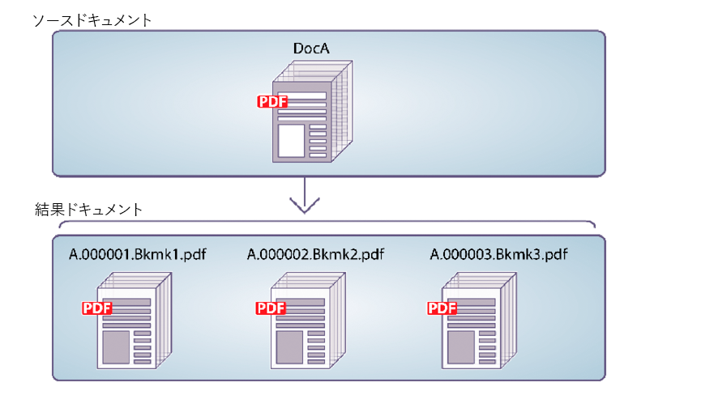

# プログラムによるPDFドキュメントのディスアセンブリ {#programmatically-disassembling-pdf-documents}

PDFドキュメントをAssemblerサービスに渡すことで、PDFアセンブリをディスアセンブリできます。 通常、このタスクは、PDFドキュメントが最初に多数の個々のドキュメント（文書の集まりなど）から作成された場合に役立ちます。 次の図では、DocAが複数の結果ドキュメントに分割されています。ページ上の第1レベル1のブックマークが、新しい結果ドキュメントの開始を示します。



PDFドキュメントをディスアセンブリするには、 `PDFsFromBookmarks` 要素がDDXドキュメント内にあることを確認します。 要素は結果の要素で `PDFsFromBookmarks` あり、要素の子要素のみにすることができ `DDX` ます。 属性がないのは、複数のドキュメントが生成される可能性があるためです。 `result`

この `PDFsFromBookmarks` 要素により、ソースドキュメントのレベル1ブックマークごとに1つのドキュメントが生成されます。

この説明を行うために、次のDDXドキュメントを使用するとします。

```xml
 <?xml version="1.0" encoding="UTF-8"?>
 <DDX xmlns="https://ns.adobe.com/DDX/1.0/">
      <PDFsFromBookmarks prefix="stmt">
     <PDF source="AssemblerResultPDF.pdf"/>
 </PDFsFromBookmarks>
 </DDX>
```

>[!NOTE]
>
>この節を読む前に、Assemblerサービスを使用したPDFドキュメントのアセンブリについて理解しておくことをお勧めします。 (「 [プログラムによるPDFドキュメントのアセンブリ](/help/forms/developing/programmatically-assembling-pdf-documents.md)」を参照)。

>[!NOTE]
>
>単一のPDFドキュメントをAssemblerサービスに渡して、単一のドキュメントを取得する場合は、この `invokeOneDocument` 操作を呼び出すことができます。 ただし、PDFドキュメントをディスアセンブリするには、この `invokeDDX` 操作を使用します。1つの入力PDFドキュメントがAssemblerサービスに渡されますが、Assemblerサービスは1つ以上のドキュメントを含むコレクションオブジェクトを返します。

>[!NOTE]
>
>For more information about the Assembler service, see [Services Reference for AEM Forms](https://www.adobe.com/go/learn_aemforms_services_63).

>[!NOTE]
>
>DDXドキュメントについて詳しくは、『 [Assembler Service and DDX Reference](https://www.adobe.com/go/learn_aemforms_ddx_63)』を参照してください。

## 手順の概要 {#summary-of-steps}

PDFドキュメントをディスアセンブリするには、次のタスクを実行します。

1. プロジェクトファイルを含めます。
1. PDFアセンブラクライアントを作成します。
1. 既存のDDXドキュメントの参照。
1. ディスアセンブリするPDFドキュメントの参照
1. 実行時オプションを設定します。
1. PDFドキュメントのディスアセンブリ
1. アセンブル解除されたPDFドキュメントを保存します。

**プロジェクトファイルを含める**

必要なファイルを開発プロジェクトに含めます。 Javaを使用してクライアントアプリケーションを作成する場合は、必要なJARファイルを含めます。 Webサービスを使用している場合は、プロキシファイルを必ず含めてください。

次のJARファイルをプロジェクトのクラスパスに追加する必要があります。

* adobe-livecycle-client.jar
* adobe-usermanager-client.jar
* adobe-assembler-client.jar
* adobe-utilities.jar(AEM FormsがJBossにデプロイされている場合に必要)
* jbossall-client.jar(AEM FormsがJBossにデプロイされている場合に必要)

AEM Formsが、JBoss以外のサポート対象のJ2EEアプリケーションサーバーにデプロイされている場合は、adobe-utilities.jarおよびjbossall-client.jarを、AEM FormsがデプロイされているJ2EEアプリケーションサーバーに固有のJARファイルに置き換える必要があります。

**PDFアセンブラクライアントの作成**

プログラムによってAssembler操作を実行する前に、Assemblerサービスクライアントを作成する必要があります。

**既存のDDXドキュメントの参照**

PDFドキュメントをディスアセンブリするには、DDXドキュメントを参照する必要があります。 このDDXドキュメントには、 `PDFsFromBookmarks` 要素を含める必要があります。

**PDFドキュメントの参照によるディスアセンブリ**

PDFドキュメントをディスアセンブリするには、ディスアセンブリするPDFドキュメントを表すPDFファイルを参照します。 Assemblerサービスに渡されると、ドキュメント内のレベル1のブックマークごとに個別のPDFドキュメントが返されます。

**実行時オプションの設定**

ジョブの実行中にAssemblerサービスの動作を制御する実行時オプションを設定できます。 例えば、エラーが発生した場合にジョブの処理を続行するようAssemblerサービスに指示するオプションを設定できます。

**PDFドキュメントのディスアセンブリ**

Assemblerサービスクライアントの作成、DDXドキュメントの参照、ディスアセンブリ対象のPDFドキュメントの参照、および実行時オプションの設定が完了したら、この `invokeDDX` メソッドを呼び出してPDFドキュメントをディスアセンブリできます。 DDXドキュメントにPDFドキュメントのディスアセンブリの命令が含まれている場合、Assemblerサービスは、コレクションオブジェクト内でディスアセンブリされたPDFドキュメントを返します。

**アセンブル解除されたPDFドキュメントの保存**

分解されたすべてのPDFドキュメントは、コレクションオブジェクト内で返されます。 コレクションオブジェクトを繰り返し処理し、各PDFドキュメントをPDFファイルとして保存します。

**関連トピック**

[AEM Forms Java ライブラリファイルを含める](/help/forms/developing/invoking-aem-forms-using-java.md#including-aem-forms-java-library-files)

[接続プロパティの設定](/help/forms/developing/invoking-aem-forms-using-java.md#setting-connection-properties)

[プログラムによるPDFドキュメントのアセンブリ](/help/forms/developing/programmatically-assembling-pdf-documents.md)

## Java APIを使用したPDFドキュメントのディスアセンブリ {#disassemble-a-pdf-document-using-the-java-api}

Assembler Service API(Java)を使用してPDFドキュメントをディスアセンブリします。

1. プロジェクトファイルを含めます。

   Javaプロジェクトのクラスパスに、adobe-assembler-client.jarなどのクライアントJARファイルを含めます。

1. PDFアセンブラクライアントを作成します。

   * 接続プロパティを含む `ServiceClientFactory` オブジェクトを作成します。
   * Create an `AssemblerServiceClient` object by using its constructor and passing the `ServiceClientFactory` object.

1. 既存のDDXドキュメントの参照。

   * コンストラクターを使用し、DDXファイルの場所を指定する文字列値を渡して、DDXドキュメントを表す `java.io.FileInputStream` オブジェクトを作成します。
   * コンストラクタを使用して `com.adobe.idp.Document` オブジェクトを渡すことによって、`java.io.FileInputStream` オブジェクトを作成します。

1. ディスアセンブリするPDFドキュメントの参照

   * コンストラクターを使用して、入力PDFドキュメントの格納に使用する `java.util.Map` オブジェクトを作成し `HashMap` ます。
   * コンストラクターを使用し、ディスアセンブリするPDFドキュメントの場所を渡して、 `java.io.FileInputStream` オブジェクトを作成します。
   * オブジェクトを作成し、ディスアセンブリするPDFドキュメントを含む `com.adobe.idp.Document``java.io.FileInputStream` オブジェクトを渡します。
   * メソッド追加を呼び出し、次の引数を渡すことによって、オブジェクトに対するエントリを作成します。 `java.util.Map``put`

      * キー名を表すstring値です。 この値は、DDXドキュメントで指定されたPDFソース要素の値と一致する必要があります。
      * ディスアセンブリするPDFドキュメントを含む `com.adobe.idp.Document` オブジェクトです。

1. 実行時オプションを設定します。

   * コンストラクターを使用して、実行時のオプションを格納する `AssemblerOptionSpec` オブジェクトを作成します。
   * オブジェクトに属するメソッドを呼び出して、ビジネス要件に合うように実行時オプションを設定し `AssemblerOptionSpec` ます。 例えば、エラーが発生した場合にジョブの処理を続行するようにAssemblerサービスに指示するには、 `AssemblerOptionSpec` オブジェクトの `setFailOnError` メソッドを呼び出して渡し `false`ます。

1. PDFドキュメントのディスアセンブリ

   オブジェクトの `AssemblerServiceClient``invokeDDX` メソッドを呼び出し、次の必須値を渡します。

   * 使用するDDXドキュメントを表す `com.adobe.idp.Document` オブジェクトです
   * ディスアセンブリするPDFドキュメントを含む `java.util.Map` オブジェクト
   * デフォルトフォントやジョブログレベルなど、実行時のオプションを指定する `com.adobe.livecycle.assembler.client.AssemblerOptionSpec` オブジェクト。

   この `invokeDDX` メソッドは、分解されたPDFドキュメントと発生した例外が含まれる `com.adobe.livecycle.assembler.client.AssemblerResult` オブジェクトを返します。

1. アセンブル解除されたPDFドキュメントを保存します。

   ディスアセンブリされたPDFドキュメントを取得するには、次の操作を実行します。

   * オブジェクトの `AssemblerResult` メソッドを呼び出し `getDocuments` ます。 これは、 `java.util.Map` オブジェクトを返します。
   * オブジェクトを繰り返し処理して、結果のオブジ `java.util.Map``com.adobe.idp.Document` ェクトを見つけます。
   * オブジェクトの `com.adobe.idp.Document``copyToFile` メソッドを呼び出してPDFドキュメントを抽出します。

**関連トピック**

[プログラムによるPDFドキュメントのディスアセンブリ](#programmatically-disassembling-pdf-documents)

[クイック開始（SOAPモード）: Java APIを使用したPDFドキュメントのディスアセンブリ](/help/forms/developing/assembler-service-java-api-quick.md#quick-start-soap-mode-disassembling-a-pdf-document-using-the-java-api)

[AEM Forms Java ライブラリファイルを含める](/help/forms/developing/invoking-aem-forms-using-java.md#including-aem-forms-java-library-files)

[接続プロパティの設定](/help/forms/developing/invoking-aem-forms-using-java.md#setting-connection-properties)

## WebサービスAPIを使用したPDFドキュメントのディスアセンブリ {#disassemble-a-pdf-document-using-the-web-service-api}

Assembler Service API（Webサービス）を使用してPDFドキュメントをディスアセンブリします。

1. プロジェクトファイルを含めます。

   MTOMを使用するMicrosoft .NETプロジェクトを作成します。 サービス参照を設定する際は、次のWSDL定義を使用してください。 `http://localhost:8080/soap/services/AssemblerService?WSDL&lc_version=9.0.1`.

   >[!NOTE]
   >
   >サーバーホスト `localhost` AEM FormsのIPアドレスに置き換えます。

1. PDFアセンブラクライアントを作成します。

   * デフォルトのコンストラクターを使用して `AssemblerServiceClient` オブジェクトを作成します。
   * コンストラクターを使用して `AssemblerServiceClient.Endpoint.Address` オブジェクトを作成し `System.ServiceModel.EndpointAddress` ます。 WSDLをAEM Formsサービス(例えば、 `http://localhost:8080/soap/services/AssemblerService?blob=mtom`)に渡すstring値を渡します。 属性を使用する必要はありません `lc_version` 。 この属性は、サービス参照を作成する際に使用されます。
   * フィールドの値を取得して `System.ServiceModel.BasicHttpBinding` オブジェクトを作成し `AssemblerServiceClient.Endpoint.Binding` ます。 戻り値を `BasicHttpBinding` にキャストします。
   * オブジェクトの `System.ServiceModel.BasicHttpBinding` フィールドをに設定し `MessageEncoding` ま `WSMessageEncoding.Mtom`す。 この値により、MTOMが使用されます。
   * 次のタスクを実行して、基本的なHTTP認証を有効にします。

      * フィールドにAEM formsのユーザー名を割り当て `AssemblerServiceClient.ClientCredentials.UserName.UserName`ます。
      * 対応するパスワード値をフィールドに割り当て `AssemblerServiceClient.ClientCredentials.UserName.Password`ます。
      * 定数値をフィールド `HttpClientCredentialType.Basic` に割り当て `BasicHttpBindingSecurity.Transport.ClientCredentialType`ます。
      * 定数値をフィールド `BasicHttpSecurityMode.TransportCredentialOnly` に割り当て `BasicHttpBindingSecurity.Security.Mode`ます。

1. 既存のDDXドキュメントの参照。

   * コンストラクタを使用して `BLOB` オブジェクトを作成します。この `BLOB` オブジェクトは、DDXドキュメントの格納に使用されます。
   * Create a `System.IO.FileStream` object by invoking its constructor. DDXドキュメントのファイルの場所とファイルを開くモードを表すstring値を渡します。
   * オブジェクトの内容を格納するバイト配列を作成し `System.IO.FileStream` ます。 バイト配列のサイズは、 `System.IO.FileStream` オブジェクトのプロパティを取得して決定でき `Length` ます。
   * オブジェクトの `System.IO.FileStream``Read` メソッドを呼び出し、読み取るバイト配列、開始位置およびストリーム長を渡すことで、バイト配列にストリームデータを入力します。
   * オブジェクトのプロパティにバイト配列の内容を割り当てて、 `BLOB``MTOM` オブジェクトを入力します。

1. ディスアセンブリするPDFドキュメントの参照

   * コンストラクタを使用して `BLOB` オブジェクトを作成します。この `BLOB` オブジェクトは、入力PDFドキュメントの保存に使用されます。 この `BLOB` オブジェクトは、引数としてに渡 `invokeOneDocument` されます。
   * コンストラクターを呼び出し、入力PDFドキュメントーのファイルの場所とファイルを開くモードを表すstring値を渡して、 `System.IO.FileStream` オブジェクトを作成します。
   * オブジェクトの内容を格納するバイト配列を作成し `System.IO.FileStream` ます。 バイト配列のサイズは、 `System.IO.FileStream` オブジェクトのプロパティを取得して決定でき `Length` ます。
   * オブジェクトの `System.IO.FileStream``Read` メソッドを呼び出し、読み取るバイト配列、開始位置およびストリーム長を渡すことで、バイト配列にストリームデータを入力します。
   * オブジェクトにバイト配列の内容をフィールドに割り当てて、 `BLOB``MTOM` オブジェクトを入力します。
   * Create a `MyMapOf_xsd_string_To_xsd_anyType` object. このコレクションオブジェクトは、ディスアセンブリ対象のPDFを保存するために使用します。
   * Create a `MyMapOf_xsd_string_To_xsd_anyType_Item` object.
   * キー名を表すstring値を `MyMapOf_xsd_string_To_xsd_anyType_Item` オブジェクトの `key` フィールドに割り当てます。 この値は、DDXドキュメントで指定されたPDFソース要素の値と一致する必要があります。
   * PDFドキュメントを保存している `BLOB` オブジェクトをオブジェクトのフィ `MyMapOf_xsd_string_To_xsd_anyType_Item` ー `value` ルドに割り当てます。
   * オ追加ブジェクトをオブジ `MyMapOf_xsd_string_To_xsd_anyType_Item``MyMapOf_xsd_string_To_xsd_anyType` ェクトに追加します。 オブジェクトのメ `MyMapOf_xsd_string_To_xsd_anyType` ソッドを呼び出 `Add` し、 `MyMapOf_xsd_string_To_xsd_anyType` オブジェクトを渡します。

1. 実行時オプションを設定します。

   * コンストラクターを使用して、実行時のオプションを格納する `AssemblerOptionSpec` オブジェクトを作成します。
   * オブジェクトに属するデータメンバに値を割り当てることで、ビジネス要件に合った実行時オプションを設定し `AssemblerOptionSpec` ます。 例えば、エラーが発生した場合にジョブの処理を続行するようにAssemblerサービスに指示するには、 `false` オブジェクトの `AssemblerOptionSpec``failOnError` フィールドに割り当てます。

1. PDFドキュメントのディスアセンブリ

   オブジェクトの `AssemblerServiceClient``invokeDDX` メソッドを呼び出し、次の値を渡します。

   * PDFドキュメントをディスアセンブリするDDXドキュメントを表す `BLOB` オブジェクトです
   * ディスアセンブリするPDFドキュメントを含む `MyMapOf_xsd_string_To_xsd_anyType` オブジェクトです
   * 実行時オプションを指定する `AssemblerOptionSpec` オブジェクトです。

   この `invokeDDX` メソッドは、ジョブの結果と発生した例外を含む `AssemblerResult` オブジェクトを返します。

1. アセンブル解除されたPDFドキュメントを保存します。

   新しく作成されたPDFドキュメントを取得するには、次の操作を実行します。

   * オブジェクトの `AssemblerResult` フィールドにアクセスします。この `documents` フィールドは、分解されたPDFドキュメントを含む `Map` オブジェクトです。
   * オブジェクトを繰り返し処理して、 `Map` 各結果ドキュメントを取得します。 次に、その配列メンバーをにキャスト `value` し `BLOB`ます。
   * PDFドキュメントを表すバイナリデータを抽出するには、その `BLOB` オブジェクトの `MTOM` プロパティにアクセスします。 PDFファイルに書き出すことができるバイトの配列を返します。

**関連トピック**

[プログラムによるPDFドキュメントのディスアセンブリ](#programmatically-disassembling-pdf-documents)

[MTOMを使用したAEM Formsの呼び出し](/help/forms/developing/invoking-aem-forms-using-web.md#invoking-aem-forms-using-mtom)
