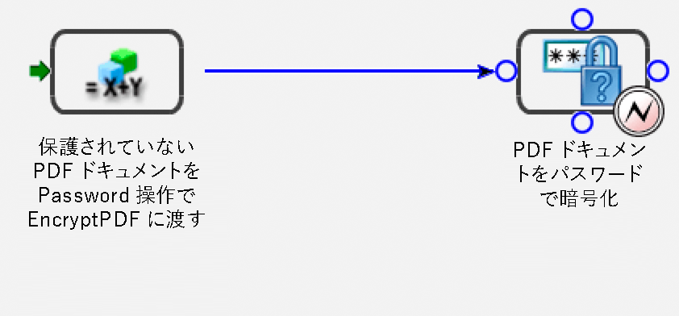
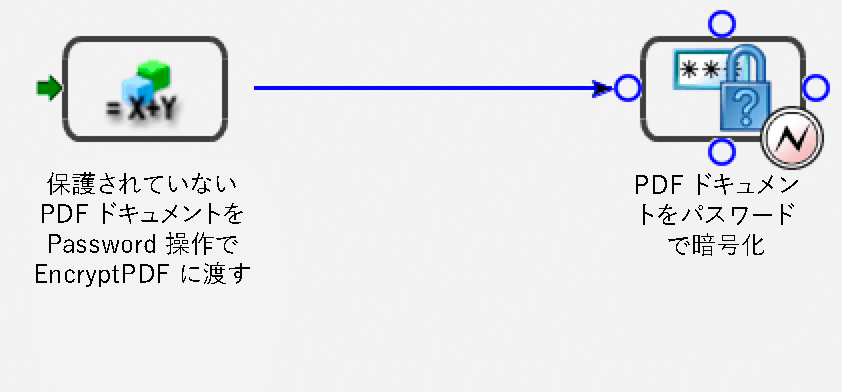

# エンドポイントのプログラム管理 {#programmatically-managing-endpoints}

**エンドポイントレジストリサービスについて**

Endpoint Registryサービスは、エンドポイントをプログラムで管理する機能を提供します。 例えば、次の種類のエンドポイントをサービスに追加できます。

* EJB
* SOAP
* 監視フォルダー
* 電子メール
* （AEM Formsでは非推奨）Remoting
* タスクマネージャ

>[!NOTE]
>
>SOAP、EJB、および（JEE上のAEM formsでは非推奨）リモートエンドポイントは、アクティブ化された各サービスに対して自動的に作成されます。 SOAPおよびEJBエンドポイントは、すべてのサービス操作でSOAPおよびEJBを有効にします。

リモートエンドポイントを使用すると、Flexクライアントは、エンドポイントが追加されたAEM Formsサービスで操作を呼び出すことができます。 エンドポイントと同じ名前のFlex宛先が作成され、Flexクライアントは、この宛先を指すRemoteObjectsを作成して、関連するサービスの操作を呼び出すことができます。

電子メール、タスクマネージャーおよび監視フォルダーエンドポイントで公開されるのは、サービスの特定の操作のみです。 これらのエンドポイントを追加するには、呼び出すメソッドを選択し、設定パラメーターを設定し、入力パラメーターと出力パラメーターのマッピングを指定する、2つ目の設定手順が必要です。

TaskManagerエンドポイントは、 *カテゴリと呼ばれるグループに編成できます*。 これらのカテゴリはTaskManagerを通じてWorkspaceに公開され、エンドユーザーはTaskManagerエンドポイントを分類したとおりに表示します。 Workspace内で、エンドユーザーはナビゲーションペインにこれらのカテゴリを表示します。 各カテゴリ内のエンドポイントは、Workspaceの開始プロセスページにプロセスカードとして表示されます。

Endpoint Registryサービスを使用して、次のタスクを実行できます。

* 追加EJBエンドポイント (「EJBエンドポイントの [追加](programmatically-endpoints.md#adding-ejb-endpoints)」を参照)。
* 追加SOAPエンドポイント (SOAPエンドポイントの [追加を参照](programmatically-endpoints.md#adding-soap-endpoints))。
* 追加監視フォルダーエンドポイント(監視フォルダーエンドポイントの [追加を参照](programmatically-endpoints.md#adding-watched-folder-endpoints))
* 電子メール追加エンドポイント (See [Adding Email Endpoints](programmatically-endpoints.md#adding-email-endpoints).)
* 追加エンドポイントをリモートします。 (「リモートエンドポイントの [追加](programmatically-endpoints.md#adding-remoting-endpoints)」を参照)。
* TaskManagerエンドポイント(TaskManager追加エンドポイントの [追加を参照](programmatically-endpoints.md#adding-taskmanager-endpoints))
* エンドポイントを変更します(エンドポイントの [変更を参照](programmatically-endpoints.md#modifying-endpoints))。
* エンドポイントの削除(エンドポイントの [削除を参照](programmatically-endpoints.md#removing-endpoints))
* エンドポイントコネクタ情報を取得します(エンドポイントコネクタ情報の [取得を参照](programmatically-endpoints.md#retrieving-endpoint-connector-information))。

## EJBエンドポイントの追加 {#adding-ejb-endpoints}

AEM FormsJava APIを使用して、プログラムによってEJBエンドポイントをサービスに追加できます。 EJBエンドポイントをサービスに追加すると、クライアントアプリケーションでEJBモードを使用してサービスを呼び出せるようになります。 つまり、AEM Formsの呼び出しに必要な接続プロパティを設定する場合、EJBモードを選択できます。 （[接続プロパティの設定](/help/forms/developing/invoking-aem-forms-using-java.md#setting-connection-properties)を参照。）

>[!NOTE]
>
>Webサービスを使用してEJBエンドポイントを追加することはできません。

>[!NOTE]
>
>通常、EJBエンドポイントはデフォルトでサービスに追加されますが、EJBエンドポイントは、プログラム的にデプロイされたプロセスや、EJBエンドポイントが削除され、再度追加する必要があるプロセスに追加できます。

### 手順の概要 {#summary-of-steps}

EJBエンドポイントをサービスに追加するには、次のタスクを実行します。

1. プロジェクトファイルを含めます。
1. オブジェクトを作成し `EndpointRegistry Client` ます。
1. EJBエンドポイント属性を設定します。
1. EJBエンドポイントを作成します。
1. エンドポイントを有効にします。

**プロジェクトファイルを含める**

開発プロジェクトに必要なファイルを含めます。 次のJARファイルをプロジェクトのクラスパスに追加する必要があります。

* adobe-livecycle-client.jar
* adobe-usermanager-client.jar
* adobe-utilities.jar(AEM FormsがJBoss Application Serverにデプロイされている場合に必要)
* jbossall-client.jar(AEM FormsがJBoss Application Serverにデプロイされている場合に必要)

For information about the location of these JAR files, see [Including AEM Forms Java library files](/help/forms/developing/invoking-aem-forms-using-java.md#including-aem-forms-java-library-files).

**EndpointRegistry Clientオブジェクトの作成**

プログラムでEJBエンドポイントを追加する前に、 `EndpointRegistryClient` オブジェクトを作成する必要があります。

**EJBエンドポイント属性の設定**

サービス用のEJBエンドポイントを作成するには、次の値を指定します。

* **コネクタ識別子**: 作成するエンドポイントのタイプを指定します。 EJBエンドポイントを作成するには、を指定し `EJB`ます。
* **説明**: エンドポイントの説明を指定します。
* **名前**: エンドポイントの名前を指定します。
* **サービス識別子**: エンドポイントが属するサービスを指定します。
* **操作名**: エンドポイントを使用して呼び出される操作の名前を指定します。 EJBエンドポイントを作成する場合は、ワイルドカード文字( `*`)を指定します。 ただし、すべてのサービス操作を呼び出すのではなく、特定の操作を指定する場合は、ワイルドカード文字( `*`)を使用するのではなく、操作の名前を指定します。

**EJBエンドポイントの作成**

EJBエンドポイント属性を設定した後、サービス用のEJBエンドポイントを作成できます。

**エンドポイントの有効化**

新しいエンドポイントを作成したら、そのエンドポイントを有効にする必要があります。 有効にしたエンドポイントは、サービスの呼び出しに使用できます。 エンドポイントを有効にした後、管理コンソール内で表示できます。

**関連トピック**

[Java APIを使用したEJBエンドポイントの追加](programmatically-endpoints.md#adding-an-ejb-endpoint-using-the-java-api)

[AEM Forms Java ライブラリファイルを含める](/help/forms/developing/invoking-aem-forms-using-java.md#including-aem-forms-java-library-files)

[接続プロパティの設定](/help/forms/developing/invoking-aem-forms-using-java.md#setting-connection-properties)

### Java APIを使用したEJBエンドポイントの追加 {#adding-an-ejb-endpoint-using-the-java-api}

Java APIを追加使用したEJBエンドポイント：

1. プロジェクトファイルを含めます。

   Javaプロジェクトのクラスパスに、adobe-livecycle-client.jarなどのクライアントJARファイルを含めます。 （

1. EndpointRegistry Clientオブジェクトを作成します。

   * 接続プロパティを含む `ServiceClientFactory` オブジェクトを作成します。
   * Create an `EndpointRegistryClient` object by using its constructor and passing the `ServiceClientFactory` object.

1. EJBエンドポイント属性を設定します。

   * コンストラクタを使用して `CreateEndpointInfo` オブジェクトを作成します。
   * コネクタ識別子の値を指定するには、 `CreateEndpointInfo` オブジェクトの `setConnectorId` メソッドを呼び出し、文字列値を渡 `EJB`します。
   * オブジェクトのメソッドを呼び出し、エンドポイントを説明する文字列値を渡して、エ `CreateEndpointInfo` ンドポイントの説明を指定し `setDescription` ます。
   * オブジェクトのメソッドを呼び出し、名前を指定する文字列値を渡して、エ `CreateEndpointInfo` ンドポイントの名前を指定し `setName` ます。
   * オブジェクトのメソッドを呼び出し、サービス名を指定する文字列値を渡して、エンドポイントが属する `CreateEndpointInfo` サービスを指定し `setServiceId` ます。
   * オブジェクトのメソッドを呼び出して呼び出す操作を指定し、操作名を指定する文字列値を `CreateEndpointInfo` 渡し `setOperationName` ます。 SOAPおよびEJBエンドポイントの場合は、すべての操作を意味するワイルドカード文字( `*`)を指定します。

1. EJBエンドポイントを作成します。

   オブジェクトのメソッドを呼び出し、 `EndpointRegistryClient` オブジェクトを渡して、エンドポイントを作成し `createEndpoint``CreateEndpointInfo` ます。 このメソッドは、新しいEJBエンドポイントを表す `Endpoint` オブジェクトを返します。

1. エンドポイントを有効にします。

   オブジェクトのenableメソッドを呼び出し、そのメソッドから返されたオブジェクトを渡して、エンドポイントを有効にし `EndpointRegistryClient``Endpoint``createEndpoint` ます。

**関連トピック**

[手順の概要](programmatically-endpoints.md#summary-of-steps)

[QuickStart: Java APIを使用したEJBエンドポイントの追加](/help/forms/developing/endpoint-registry-java-api-quick.md#quickstart-adding-an-ejb-endpoint-using-the-java-api)

[AEM Forms Java ライブラリファイルを含める](/help/forms/developing/invoking-aem-forms-using-java.md#including-aem-forms-java-library-files)

[接続プロパティの設定](/help/forms/developing/invoking-aem-forms-using-java.md#setting-connection-properties)

## SOAPエンドポイントの追加 {#adding-soap-endpoints}

AEM FormsJava APIを使用して、プログラムによってSOAPエンドポイントをサービスに追加できます。 SOAPエンドポイントを追加すると、クライアントアプリケーションがSOAPモードを使用してサービスを呼び出せるようになります。 つまり、AEM Formsの呼び出しに必要な接続プロパティを設定する場合、SOAPモードを選択できます。

>[!NOTE]
>
>Webサービスを使用してSOAPエンドポイントを追加することはできません。

>[!NOTE]
>
>通常、SOAPエンドポイントはデフォルトでサービスに追加されますが、SOAPエンドポイントは、プログラム的にデプロイされるプロセスや、SOAPエンドポイントが削除され、再度追加する必要があるプロセスに追加できます。

### 手順の概要 {#summary_of_steps-1}

SOAPエンドポイントをサービスに追加するには、次のタスクを実行します。

1. プロジェクトファイルを含めます。
1. オブジェクトを作成し `EndpointRegistryClient` ます。
1. SOAPエンドポイント属性を設定します。
1. SOAPエンドポイントを作成します。
1. エンドポイントを有効にします。

**プロジェクトファイルを含める**

必要なファイルを開発プロジェクトに含めます。 Javaを使用してクライアントアプリケーションを作成する場合は、必要なJARファイルを含めます。 Webサービスを使用している場合は、プロキシファイルを必ず含めます。

次のJARファイルをプロジェクトのクラスパスに追加する必要があります。

* adobe-livecycle-client.jar
* adobe-usermanager-client.jar
* adobe-utilities.jar(AEM FormsがJBoss Application Serverにデプロイされている場合に必要)
* jbossall-client.jar(AEM FormsがJBoss Application Serverにデプロイされている場合に必要)

これらのJARファイルは、SOAPエンドポイントを作成するために必要です。 ただし、SOAPエンドポイントを使用してサービスを呼び出す場合は、追加のJARファイルが必要です。 AEM FormsのJARファイルについて詳しくは、「AEM FormsJavaライブラリファイルを [含める](/help/forms/developing/invoking-aem-forms-using-java.md#including-aem-forms-java-library-files)」を参照してください。

**EndpointRegistry Clientオブジェクトの作成**

プログラムによってSOAPエンドポイントをサービスに追加するには、 `EndpointRegistryClient` オブジェクトを作成する必要があります。

**SOAPエンドポイント属性の設定**

SOAPエンドポイントをサービスに追加するには、次の値を指定します。

* **コネクタ識別子の値**: 作成するエンドポイントのタイプを指定します。 SOAPエンドポイントを作成するには、を指定し `SOAP`ます。
* **説明**: エンドポイントの説明を指定します。
* **名前**: エンドポイント名を指定します。
* **サービス識別子の値**: エンドポイントが属するサービスを指定します。
* **操作名**: エンドポイントを使用して呼び出される操作の名前を指定します。 SOAPエンドポイントを作成する場合は、ワイルドカード文字( `*`)を指定します。 ただし、すべてのサービス操作を呼び出すのではなく、特定の操作を指定する場合は、ワイルドカード文字( `*`)を使用するのではなく、操作の名前を指定します。

**SOAPエンドポイントの作成**

SOAPエンドポイント属性を設定した後、SOAPエンドポイントを作成できます。

**エンドポイントの有効化**

新しいエンドポイントを作成したら、そのエンドポイントを有効にする必要があります。 エンドポイントが有効な場合は、サービスの呼び出しに使用できます。 エンドポイントを有効にすると、表示は管理コンソール内でエンドポイントを確認できます。

**関連トピック**

[Java APIを追加使用したSOAPエンドポイント](programmatically-endpoints.md#add-a-soap-endpoint-using-the-java-api)

[AEM Forms Java ライブラリファイルを含める](/help/forms/developing/invoking-aem-forms-using-java.md#including-aem-forms-java-library-files)

[接続プロパティの設定](/help/forms/developing/invoking-aem-forms-using-java.md#setting-connection-properties)

### Java APIを追加使用したSOAPエンドポイント {#add-a-soap-endpoint-using-the-java-api}

Java APIを追加使用したサービスへのSOAPエンドポイント：

1. プロジェクトファイルを含めます。

   Javaプロジェクトのクラスパスに、adobe-livecycle-client.jarなどのクライアントJARファイルを含めます。

1. EndpointRegistry Clientオブジェクトを作成します。

   * 接続プロパティを含む `ServiceClientFactory` オブジェクトを作成します。
   * Create an `EndpointRegistryClient` object by using its constructor and passing the `ServiceClientFactory` object.

1. SOAPエンドポイント属性を設定します。

   * コンストラクタを使用して `CreateEndpointInfo` オブジェクトを作成します。
   * コネクタ識別子の値を指定するには、 `CreateEndpointInfo` オブジェクトの `setConnectorId` メソッドを呼び出し、文字列値を渡 `SOAP`します。
   * オブジェクトのメソッドを呼び出し、エンドポイントを説明する文字列値を渡して、エ `CreateEndpointInfo` ンドポイントの説明を指定し `setDescription` ます。
   * オブジェクトのメソッドを呼び出し、名前を指定する文字列値を渡して、エ `CreateEndpointInfo` ンドポイントの名前を指定し `setName` ます。
   * オブジェクトのメソッドを呼び出し、サービス名を指定する文字列値を渡して、エンドポイントが属する `CreateEndpointInfo` サービスを指定し `setServiceId` ます。
   * オブジェクトのメソッドを呼び出し、操作名を指定する文字列値を渡すことで、 `CreateEndpointInfo` 呼び出される操作を指定し `setOperationName` ます。 SOAPおよびEJBエンドポイントの場合は、すべての操作を意味するワイルドカード文字( `*`)を指定します。

1. SOAPエンドポイントを作成します。

   オブジェクトのメソッドを呼び出し、 `EndpointRegistryClient` オブジェクトを渡して、エンドポイントを作成し `createEndpoint``CreateEndpointInfo` ます。 このメソッドは、新しいSOAPエンドポイントを表す `Endpoint` オブジェクトを返します。

1. エンドポイントを有効にします。

   オブジェクトのenableメソッドを呼び出してエンドポイントを有効にし、その `EndpointRegistryClient` メソッドから返された `Endpoint` オブジェクトを渡し `createEndpoint` ます。

**関連トピック**

[手順の概要](programmatically-endpoints.md#summary-of-steps)

[QuickStart: Java APIを使用したSOAPエンドポイントの追加](/help/forms/developing/endpoint-registry-java-api-quick.md#quickstart-adding-a-soap-endpoint-using-the-java-api)

[AEM Forms Java ライブラリファイルを含める](/help/forms/developing/invoking-aem-forms-using-java.md#including-aem-forms-java-library-files)

[接続プロパティの設定](/help/forms/developing/invoking-aem-forms-using-java.md#setting-connection-properties)

## 監視フォルダーエンドポイントの追加 {#adding-watched-folder-endpoints}

AEM FormsのJava APIを使用して、プログラムによって監視フォルダーエンドポイントをサービスに追加できます。 監視フォルダーエンドポイントを追加すると、ユーザーはファイル（PDFファイルなど）をフォルダーに配置できます。 ファイルがフォルダーに配置されると、設定済みのサービスが呼び出され、ファイルが操作されます。 サービスが指定の操作を実行した後に、変更されたファイルが指定の出力フォルダーに保存されます。監視フォルダーは、固定レートの間隔、または毎週月曜日、水曜日、金曜日の正午など、Cronスケジュールでスキャンされるように設定されています。

プログラムによって監視フォルダーエンドポイントをサービスに追加する場合は、EncryptDocumentという名前の短時間のみ有効なプロセスを考慮して *ください*。 ( [AEM Formsプロセスについてを参照](/help/forms/developing/aem-forms-processes.md#understanding-aem-forms-processes))。



このプロセスは、保護されていないPDFドキュメントを入力値として受け取り、保護されていないPDFドキュメントをEncryptionサービスの `EncryptPDFUsingPassword` 操作に渡します。 PDFドキュメントはパスワードを使用して暗号化され、パスワードを使用して暗号化されたPDFドキュメントはこのプロセスの出力値です。 入力値(保護されていないPDFドキュメント)の名前 `InDoc` とデータタイプは `com.adobe.idp.Document`です。 出力値の名前(パスワードで暗号化されたPDFドキュメント) `SecuredDoc` と、データタイプは `com.adobe.idp.Document`です。

>[!NOTE]
>
>Webサービスを使用して監視フォルダーエンドポイントを追加することはできません。

### 手順の概要 {#summary_of_steps-2}

監視フォルダーエンドポイントをサービスに追加するには、次のタスクを実行します。

1. プロジェクトファイルを含めます。
1. オブジェクトを作成し `EndpointRegistryClient` ます。
1. 監視フォルダーエンドポイントの属性を設定します。
1. 設定値を指定します。
1. 入力パラメーターの値を定義します。
1. 出力パラメーターの値を定義します。
1. 監視フォルダーエンドポイントの作成を参照してください。
1. エンドポイントを有効にします。

**プロジェクトファイルを含める**

必要なファイルを開発プロジェクトに含めます。 Javaを使用してクライアントアプリケーションを作成する場合は、必要なJARファイルを含めます。 Webサービスを使用している場合は、プロキシファイルを必ず含めます。

次のJARファイルをプロジェクトのクラスパスに追加する必要があります。

* adobe-livecycle-client.jar
* adobe-usermanager-client.jar
* adobe-utilities.jar(AEM FormsがJBoss Application Serverにデプロイされている場合に必要)
* jbossall-client.jar(AEM FormsがJBoss Application Serverにデプロイされている場合に必要)

For information about the location of these JAR files, see [Including AEM Forms Java library files](/help/forms/developing/invoking-aem-forms-using-java.md#including-aem-forms-java-library-files).

**EndpointRegistry Clientオブジェクトの作成**

プログラムによって監視フォルダーエンドポイントを追加するには、 `EndpointRegistryClient` オブジェクトを作成する必要があります。

**監視フォルダーエンドポイント属性の設定**

サービスの監視フォルダーエンドポイントを作成するには、次の値を指定します。

* **コネクタ識別子**: 作成されるエンドポイントの種類を指定します。 監視フォルダーエンドポイントを作成するには、を指定し `WatchedFolder`ます。
* **説明**: エンドポイントの説明を指定します。
* **名前**: エンドポイントの名前を指定します。
* **サービス識別子**: エンドポイントが属するサービスを指定します。 例えば、この節で紹介するプロセス（Workbenchを使用してアクティブ化されるとプロセスがサービスになる）に監視フォルダーエンドポイントを追加するには、を指定し `EncryptDocument`ます。
* **操作名**: エンドポイントを使用して呼び出される操作の名前を指定します。 通常、Workbenchで作成されたプロセスから派生するサービスの監視フォルダーエンドポイントを作成する場合、操作の名前はで `invoke`す。

**設定値の指定**

監視フォルダーエンドポイントをサービスにプログラムで追加する場合は、監視フォルダーエンドポイントの設定値を指定する必要があります。 これらの設定値は、管理コンソールを使用して監視フォルダーエンドポイントを追加した場合に、管理者が指定します。

次のリストは、監視フォルダーエンドポイントをプログラムでサービスに追加した場合に設定される設定値を指定します。

* **url**: 監視フォルダーの場所を指定します。 クラスター環境では、この値は、クラスター内のすべてのコンピューターからアクセス可能な共有ネットワークフォルダーを指す必要があります。
* **非同期**: 呼び出しの種類を非同期型または同期型として指定します。 一過性および同期型のプロセスは、同期型でのみ呼び出すことができます。デフォルト値は true です。非同期を推奨します。
* **cronExpression**: Quartzで、入力ディレクトリのポーリングをスケジュールするために使用されます。 cron式の設定について詳しくは、https://quartz.sourceforge.net/javadoc/org/quartz/CronTrigger.htmlを参照して [ください](https://quartz.sourceforge.net/javadoc/org/quartz/CronTrigger.html)。
* **purgeDuration**: これは必須の属性です。 結果フォルダー内のファイルとフォルダーがこの値より古い場合、それらは削除されます。 この値の単位は日です。この属性は、結果フォルダーがいっぱいにならないようにするのに役立ちます。 -1 を指定すると、結果フォルダーの削除は行われません。デフォルト値は -1 です。
* **repeatInterval**: 監視フォルダーをスキャンして入力を確認する間隔（秒単位）です。 ジョブ数の制限が有効になっていない限り、この値は平均的なジョブの処理時間より長くする必要があります。 そうしないと、システムが過負荷の状態になる可能性があります。 デフォルト値は 5 です。
* **repeatCount**: 監視フォルダーがフォルダーまたはディレクトリをスキャンする回数です。 -1 を指定すると、無限にスキャンされます。デフォルト値は -1 です。
* **throttleOn**: 任意の時点で処理できる監視フォルダーのジョブ数を制限します。 ジョブの最大数は、batchSize値によって決まります。
* **userName**: 監視フォルダーからターゲットサービスを呼び出すときに使用されるユーザー名です。 この値は必須です。デフォルト値は「SuperAdmin」です。
* **domainName**: ユーザーのドメイン。 この値は必須です。デフォルト値は「DefaultDom」です。
* **batchSize**: 1回のスキャンで取得されるファイルまたはフォルダーの数です。 この値を使用して、システムの過負荷を防ぎます。 一度にスキャンするファイル数が多すぎると、クラッシュする場合があります。 デフォルト値は 2 です。
* **waitTime**: 作成後にフォルダーまたはファイルをスキャンするまでの待機時間（ミリ秒）です。 例えば、待機時間が36,000,000ミリ秒（1時間）で、1分前にファイルが作成された場合、このファイルは59分以上経過した後に取得されます。 この属性は、ファイルまたはフォルダーが入力フォルダーに完全にコピーされるようにする場合に役立ちます。 例えば、処理に大きなファイルがあり、そのファイルのダウンロードに10分かかる場合は、待機時間を10&amp;ast;60&amp;ast;1000ミリ秒に設定します。 この設定は、10分間待たないファイルは監視フォルダーでスキャンされないようにします。 デフォルト値は 0 です。
* **excludeFilePattern**: スキャンおよび取得の対象とするファイルとフォルダーを決定するために監視フォルダーが使用するパターンです。 このパターンを含むファイルまたはフォルダーは、スキャンの対象外となります。 この設定は、入力が複数のファイルを含むフォルダーである場合に役立ちます。 フォルダーの内容を、監視フォルダーの取得対象となる名前のフォルダーにコピーできます。 この手順により、フォルダーが入力フォルダーに完全にコピーされる前に監視フォルダーがフォルダーを取得しないようにすることができます。 For example, if the excludeFilePattern value is `data*`, all files and folders that match `data*` are not picked up. This includes files and folders named `data1`, `data2`, and so on. また、パターンにワイルドカードパターンを追加して、ファイルパターンを指定することもできます。 監視フォルダーは、およびなどのワイルドカードパターンをサポートするように正規式 `*.*` を変更し `*.pdf`ます。 これらのワイルドカードパターンは、正規式ではサポートされていません。
* **includeFilePattern**: スキャンおよび取得の対象とするフォルダーとファイルを決定するために監視フォルダーが使用するパターンです。 For example, if this value is `*`, all files and folders that match `input*` are picked up. This includes files and folders named `input1`, `input2`, and so on. デフォルト値は `*` です。この値は、すべてのファイルとフォルダーを示します。 また、パターンにワイルドカードパターンを追加して、ファイルパターンを指定することもできます。 監視フォルダーは、およびなどのワイルドカードパターンをサポートするように正規式 `*.*` を変更し `*.pdf`ます。 これらのワイルドカードパターンは、正規式ではサポートされていません。 この値は必須です。
* **resultFolderName**: 保存した結果が保存されるフォルダーです。 この場所は、絶対パスまたは相対ディレクトリパスにすることができます。 結果がこのフォルダーに表示されない場合は、失敗フォルダーを確認してください。読み取り専用ファイルは処理されず、失敗フォルダーに保存されます。デフォルト値は `result/%Y/%M/%D/` です。監視フォルダー内の結果フォルダーです。
* **preserveFolderName**: 正常にスキャンおよび取得されたファイルが保存される場所です。 絶対パス、相対パス、またはNULLのディレクトリパスを指定できます。 デフォルト値は `preserve/%Y/%M/%D/` です。
* **failureFolderName**: 失敗ファイルが保存されるフォルダーです。 この場所は、常に監視フォルダーからの相対パスで指定します。読み取り専用ファイルは処理されず、失敗フォルダーに保存されます。デフォルト値は `failure/%Y/%M/%D/` です。
* **preserveOnFailure**: サービスで操作の実行に失敗した場合に入力ファイルを保持します。 デフォルト値は true です。
* **overwriteDuplicateFilename**: trueに設定すると、結果フォルダーと保存用フォルダーにあるファイルが上書きされます。 「false」に設定した場合、ファイル名とフォルダー名の末尾に数値のインデックスが付けられます。 デフォルト値は false です。

**入力パラメーター値の定義**

監視フォルダーエンドポイントを作成する場合は、入力パラメーターの値を定義する必要があります。 つまり、監視フォルダーが呼び出す操作に渡す入力値を記述する必要があります。 例えば、このトピックで紹介したプロセスを考えてみましょう。 この変数には、という名前の入力値が1つ `InDoc` あり、そのデータタイプは `com.adobe.idp.Document`です。 このプロセスの監視フォルダーエンドポイントを作成する場合（プロセスがアクティベートされると、サービスになります）、入力パラメーターの値を定義する必要があります。

監視フォルダーエンドポイントに必要な入力パラメーターの値を定義するには、次の値を指定します。

**入力パラメーター名**: 入力パラメーターの名前。 入力値の名前は、プロセスに対してWorkbenchで指定されます。 入力値がサービス操作（Workbenchで作成されたプロセスではないサービス）に属する場合、入力名はcomponent.xmlファイルで指定されます。 例えば、この節で紹介するプロセスの入力パラメーターの名前はで `InDoc`す。

**マッピングの種類**: サービス操作の呼び出しに必要な入力値を設定するために使用します。 マッピングには次の2つのタイプがあります。

* `Literal`: 監視フォルダーエンドポイントでは、フィールドに入力された値が表示どおりに使用されます。 すべての基本 Java 型がサポートされます。例えば、String、long、int、Booleanなどの入力を使用するAPIの場合、文字列は適切な型に変換され、サービスが呼び出されます。
* `Variable`: 入力された値は、監視フォルダーが入力の選択に使用するファイルパターンです。 例えば、マッピングの種類として「Variable」を選択し、入力ドキュメントーをPDFファイルにする必要がある場合、マッピング値 `*.pdf`として指定できます。

**マッピング値**: マッピングタイプの値を指定します。 例えば、 `Variable` マッピングの種類を選択した場合は、ファイルパターン `*.pdf` として指定できます。

**データタイプ**: 入力値のデータタイプを指定します。 例えば、この節で紹介するプロセスの入力値のデータタイプはです `com.adobe.idp.Document`。

**出力パラメーター値の定義**

監視フォルダーエンドポイントを作成する場合は、出力パラメーターの値を定義する必要があります。 つまり、監視フォルダーエンドポイントによって呼び出されるサービスから返される出力値を記述する必要があります。 例えば、このトピックで紹介したプロセスを考えてみましょう。 この変数にはという名前の出力値があり `SecuredDoc` 、そのデータタイプは `com.adobe.idp.Document`です。 このプロセスの監視フォルダーエンドポイントを作成する場合（プロセスがアクティブ化されると、サービスになります）、出力パラメーターの値を定義する必要があります。

監視フォルダーエンドポイントに必要な出力パラメーターの値を定義するには、次の値を指定します。

**出力パラメーター名**: 出力パラメーターの名前。 プロセス出力値の名前は、Workbenchで指定されます。 出力値がサービス操作（Workbenchで作成されたプロセスではないサービス）に属する場合、出力名はcomponent.xmlファイルで指定されます。 例えば、この節で紹介するプロセスの出力パラメーターの名前はで `SecuredDoc`す。

**マッピングの種類**: サービスと操作の出力を設定するために使用します。 以下のオプションが利用できます。

* サービスが単一のオブジェクト(1つのドキュメント)を返す場合、パターンはで `%F.pdf` 、ソースの宛先はsourcefilename.pdfです。 例えば、この節で紹介したプロセスは、1つのドキュメントを返します。 その結果、マッピングの種類は、 `%F.pdf` (指定したファイル名を使用するこ `%F` とを意味する)と定義できます。 パターンは入力ドキュメントの拡張子を `%E` 指定します。
* サービスがリストを返す場合、パターンは `Result\%F\`です。ソースの出力先はResult\sourcefilename\source1 (output 1)およびResult\sourcefilename\source2 (output 2)です。
* サービスがマップを返す場合、パターンはResult\sourcefilename\file1 and Result\sourcefilename\file2 `Result\%F\`です。 マップに複数のオブジェクトがある場合、パターンはとなり、ソースの出力先はResult\sourcefilename1.pdf（出力1）、Result\sourcefilename2.pdf（出力2）のようになります。 `Result\%F.pdf`

**データタイプ**: 戻り値のデータ型を指定します。 例えば、この節で紹介するプロセスの戻り値のデータ型はです `com.adobe.idp.Document`。

**監視フォルダーエンドポイントの作成**

エンドポイントの属性、設定値を設定し、入力パラメーターと出力パラメーターの値を定義したら、監視フォルダーエンドポイントを作成する必要があります。

**エンドポイントの有効化**

監視フォルダーエンドポイントを作成したら、そのエンドポイントを有効にする必要があります。 エンドポイントが有効な場合は、サービスの呼び出しに使用できます。 エンドポイントを有効にした後、管理コンソール内で表示できます。

**関連トピック**

[Java APIを追加使用した監視フォルダーエンドポイント](programmatically-endpoints.md#add-a-watched-folder-endpoint-using-the-java-api)

[AEM Forms Java ライブラリファイルを含める](/help/forms/developing/invoking-aem-forms-using-java.md#including-aem-forms-java-library-files)

[接続プロパティの設定](/help/forms/developing/invoking-aem-forms-using-java.md#setting-connection-properties)

### Java APIを追加使用した監視フォルダーエンドポイント {#add-a-watched-folder-endpoint-using-the-java-api}

AEM Forms追加Java APIを使用した監視フォルダーエンドポイント

1. プロジェクトファイルを含めます。

   Javaプロジェクトのクラスパスに、adobe-livecycle-client.jarなどのクライアントJARファイルを含めます。

1. EndpointRegistry Clientオブジェクトを作成します。

   * 接続プロパティを含む `ServiceClientFactory` オブジェクトを作成します。
   * Create an `EndpointRegistryClient` object by using its constructor and passing the `ServiceClientFactory` object.

1. 監視フォルダーエンドポイントの属性を設定します。

   * コンストラクタを使用して `CreateEndpointInfo` オブジェクトを作成します。
   * コネクタ識別子の値を指定するには、 `CreateEndpointInfo` オブジェクトの `setConnectorId` メソッドを呼び出し、文字列値を渡 `WatchedFolder`します。
   * オブジェクトのメソッドを呼び出し、エンドポイントを説明する文字列値を渡して、エ `CreateEndpointInfo` ンドポイントの説明を指定し `setDescription` ます。
   * オブジェクトのメソッドを呼び出し、名前を指定する文字列値を渡して、エ `CreateEndpointInfo` ンドポイントの名前を指定し `setName` ます。
   * オブジェクトのメソッドを呼び出し、サービス名を指定する文字列値を渡して、エンドポイントが属する `CreateEndpointInfo` サービスを指定し `setServiceId` ます。
   * オブジェクトのメソッドを呼び出し、操作名を指定する文字列値を渡すことで、 `CreateEndpointInfo` 呼び出される操作を指定し `setOperationName` ます。 通常、Workbenchで作成されたプロセスから派生するサービスの監視フォルダーエンドポイントを作成する場合、操作の名前はinvokeです。

1. 設定値を指定します。

   監視フォルダーエンドポイントに設定する各設定値に対して、 `CreateEndpointInfo` オブジェクトの `setConfigParameterAsText` メソッドを呼び出す必要があります。 例えば、 `url` 設定値を設定するには、 `CreateEndpointInfo` オブジェクトの `setConfigParameterAsText` メソッドを呼び出し、次の文字列値を渡します。

   * 設定値の名前を指定するstring値。 設定値を設定する場合は、を指定し `url` ま `url`す。
   * 設定値の値を指定するstring値。 設定値を設定する場合は、監視フォルダーの場所を指定します。 `url`

   >[!NOTE]
   >
   >EncryptDocumentサービスに設定されたすべての設定値を確認するには、QuickStartにあるJavaコードの例を参照して [ください。 Java APIを使用した監視フォルダーエンドポイントの追加](/help/forms/developing/endpoint-registry-java-api-quick.md#quickstart-adding-a-watched-folder-endpoint-using-the-java-api)。

1. 入力パラメーターの値を定義します。

   オブジェクトのメソッドを呼び出し、次の値を渡して、 `CreateEndpointInfo` 入力パラメーターの値を定義し `setInputParameterMapping` ます。

   * 入力パラメーターの名前を指定するstring値。 例えば、EncryptDocumentサービスの入力パラメーターの名前はで `InDoc`す。
   * 入力パラメーターのデータタイプを指定するstring値。 例えば、 `InDoc` 入力パラメーターのデータタイプはで `com.adobe.idp.Document`す。
   * マッピングの種類を指定するstring値です。 例えば、を指定でき `variable`ます。
   * マッピングタイプの値を指定するstring値。 例えば、&amp;ast;.pdfをファイルパターンとして指定できます。

   >[!NOTE]
   >
   >定義する各入力パラメーター値の `setInputParameterMapping` メソッドを呼び出します。 EncryptDocumentプロセスには1つの入力パラメーターしかないので、このメソッドを1回呼び出す必要があります。

1. 出力パラメーターの値を定義します。

   オブジェクトのメソッドを呼び出し、次の値を渡して、出力 `CreateEndpointInfo` パラメーターの値を定義し `setOutputParameterMapping` ます。

   * 出力パラメーターの名前を指定するstring値。 例えば、EncryptDocumentサービスの出力パラメーターの名前はで `SecuredDoc`す。
   * 出力パラメーターのデータタイプを指定するstring値。 例えば、 `SecuredDoc` 出力パラメーターのデータタイプはで `com.adobe.idp.Document`す。
   * マッピングの種類を指定するstring値です。 例えば、を指定でき `%F.pdf`ます。

1. 監視フォルダーエンドポイントの作成を参照してください。

   オブジェクトのメソッドを呼び出し、 `EndpointRegistryClient` オブジェクトを渡して、エンドポイントを作成し `createEndpoint``CreateEndpointInfo` ます。 このメソッドは、監視フォルダーエンドポイントを表す `Endpoint` オブジェクトを返します。

1. エンドポイントを有効にします。

   オブジェクトのメソッドを呼び出し、そのメソッドから返された `EndpointRegistryClient` オブジェクトを渡して、エンドポイントを有効にし `enable``Endpoint``createEndpoint` ます。

**関連トピック**

[手順の概要](programmatically-endpoints.md#summary-of-steps)

[QuickStart: Java APIを使用した監視フォルダーエンドポイントの追加](/help/forms/developing/endpoint-registry-java-api-quick.md#quickstart-adding-a-watched-folder-endpoint-using-the-java-api)

[AEM Forms Java ライブラリファイルを含める](/help/forms/developing/invoking-aem-forms-using-java.md#including-aem-forms-java-library-files)

[接続プロパティの設定](/help/forms/developing/invoking-aem-forms-using-java.md#setting-connection-properties)

### 監視フォルダー設定値の定数ファイル {#watched-folder-configuration-values-constant-file}

クイックス [タート： Java APIを使用して監視開始ーエンドポイントを追加すると](/help/forms/developing/endpoint-registry-java-api-quick.md#quickstart-adding-a-watched-folder-endpoint-using-the-java-api) 、クイックフォルダーをコンパイルするためにJavaプロジェクトに含める必要がある定数ファイルが使用されます。 この定数ファイルは、監視フォルダーエンドポイントを追加する際に設定する必要がある設定値を表します。 次のJavaコードは定数ファイルを表しています。

```java
 /**
     * This class contains constants that can be used when setting Watched Folder
     * configuration values
     */

 public final class WatchedFolderEndpointConfigConstants {

         public static final String PROPERTY_FILEPROVIDER_URL = "url";
         public static final String PROPERTY_PROPERTY_ASYNCHRONOUS = "asynchronous";
         public static final String PROPERTY_CRON_EXPRESSION = "cronExpression";
         public static final String PROPERTY_PURGE_DURATION = "purgeDuration";
         public static final String PROPERTY_REPEAT_INTERVAL = "repeatInterval";
         public static final String PROPERTY_REPEAT_COUNT = "repeatCount";
         public static final String PROPERTY_THROTTLE = "throttleOn";
         public static final String PROPERTY_USERNAMER = "userName";
         public static final String PROPERTY_DOMAINNAME = "domainName";
         public static final String PROPERTY_FILEPROVIDER_BATCH_SIZE = "batchSize";
         public static final String PROPERTY_FILEPROVIDER_WAIT_TIME = "waitTime";
         public static final String PROPERTY_EXCLUDE_FILE_PATTERN = "excludeFilePattern";
         public static final String PROPERTY_INCLUDE_FILE_PATTERN = "excludeFilePattern";
         public static final String PROPERTY_FILEPROVIDER_RESULT_FOLDER_NAME =  "resultFolderName";
         public static final String PROPERTY_FILEPROVIDER_PRESERVE_FOLDER_NAME = "preserveFolderName";
         public static final String PROPERTY_FILEPROVIDER_FAILURE_FOLDER_NAME = "failureFolderName";
         public static final String PROPERTY_FILEPROVIDER_PRESERVE_ON_FAILURE = "preserveOnFailure";
         public static final String PROPERTY_FILEPROVIDER_OVERWRITE_DUPLICATE_FILENAME = "overwriteDuplicateFilename";
        }
```

## 電子メールエンドポイントの追加 {#adding-email-endpoints}

AEM FormsのJava APIを使用して、プログラムによって電子メールエンドポイントをサービスに追加できます。 電子メールエンドポイントを追加すると、1つ以上の添付ファイルが含まれた電子メールメッセージを、指定した電子メールアカウントに送信できます。 次に、configureサービス操作が呼び出され、ファイルが操作されます。 サービスが指定の操作を実行すると、送信者に電子メールメッセージが送信され、変更されたファイルが添付ファイルとして送信されます。

プログラムによって電子メールエンドポイントをサービスに追加する場合は、次のMyApplication\EncryptDocumentという短時間のみ有効なプロセスを検討して *ください*。 短時間のみ有効なプロセスについて詳しくは、「AEM Formsプロセスについて [](/help/forms/developing/aem-forms-processes.md#understanding-aem-forms-processes)」を参照してください。


このプロセスは、保護されていないPDFドキュメントを入力値として受け取り、保護されていないPDFドキュメントをEncryptionサービスの `EncryptPDFUsingPassword` 操作に渡します。 このプロセスでは、PDFドキュメントをパスワードで暗号化し、パスワードで暗号化されたPDFドキュメントを出力値として返します。 入力値(保護されていないPDFドキュメント)の名前 `InDoc` とデータタイプは `com.adobe.idp.Document`です。 出力値の名前(パスワードで暗号化されたPDFドキュメント) `SecuredDoc` と、データタイプは `com.adobe.idp.Document`です。

>[!NOTE]
>
>Webサービスを使用して電子メールエンドポイントを追加することはできません。

### 手順の概要 {#summary_of_steps-3}

電子メールエンドポイントをサービスに追加するには、次のタスクを実行します。

1. プロジェクトファイルを含めます。
1. オブジェクトを作成し `EndpointRegistryClient` ます。
1. 電子メールエンドポイント属性を設定します。
1. 設定値を指定します。
1. 入力パラメーターの値を定義します。
1. 出力パラメーターの値を定義します。
1. 電子メールエンドポイントを作成します。
1. エンドポイントを有効にします。

**プロジェクトファイルを含める**

必要なファイルを開発プロジェクトに含めます。 Javaを使用してクライアントアプリケーションを作成する場合は、必要なJARファイルを含めます。 Webサービスを使用している場合は、プロキシファイルを必ず含めます。

次のJARファイルをプロジェクトのクラスパスに追加する必要があります。

* adobe-livecycle-client.jar
* adobe-usermanager-client.jar
* adobe-utilities.jar(AEM FormsがJBoss Application Serverにデプロイされている場合に必要)
* jbossall-client.jar(AEM FormsがJBoss Application Serverにデプロイされている場合に必要)

For information about the location of these JAR files, see [Including AEM Forms Java library files](/help/forms/developing/invoking-aem-forms-using-java.md#including-aem-forms-java-library-files).

**EndpointRegistry Clientオブジェクトの作成**

プログラムで電子メールエンドポイントを追加する前に、 `EndpointRegistryClient` オブジェクトを作成する必要があります。

**電子メールエンドポイント属性の設定**

サービスの電子メールエンドポイントを作成するには、次の値を指定します。

* **コネクタ識別子の値**: 作成されるエンドポイントの種類を指定します。 電子メールエンドポイントを作成するには、を指定し `Email`ます。
* **説明**: エンドポイントの説明を指定します。
* **名前**: エンドポイントの名前を指定します。
* **サービス識別子の値**: エンドポイントが属するサービスを指定します。 例えば、この節で紹介するプロセス（Workbenchを使用してアクティブ化されるとプロセスがサービスになる）に電子メールエンドポイントを追加するには、を指定し `EncryptDocument`ます。
* **操作名**: エンドポイントを使用して呼び出される操作の名前を指定します。 通常、Workbenchで作成されたプロセスから派生するサービスの電子メールエンドポイントを作成する場合、操作の名前はで `invoke`す。

**設定値の指定**

電子メールエンドポイントをサービスにプログラム的に追加する場合は、電子メールエンドポイントの設定値を指定する必要があります。 これらの設定値は、管理コンソールを使用して電子メールエンドポイントを追加した場合に、管理者が指定します。

>[!NOTE]
>
>監視される電子メールアカウントは、電子メールエンドポイントにのみ使用される特別なアカウントです。 このアカウントは、通常のユーザーの電子メールアカウントではありません。 通常のユーザーの電子メールアカウントは、電子メールプロバイダーが使用するアカウントとして設定する必要はありません。電子メールプロバイダーは、メッセージの処理が完了した後でインボックスから電子メールメッセージを削除します。

電子メールエンドポイントをプログラムでサービスに追加する場合、次の設定値が設定されます。

* **cronExpression**: Cron式。Cron式を使用して電子メールをスケジュールする必要がある場合に使用します。
* **repeatCount**: 電子メールエンドポイントがフォルダーまたはディレクトリをスキャンする回数です。 -1 を指定すると、無限にスキャンされます。デフォルト値は -1 です。
* **repeatInterval**: 受信メールの確認に使用するスキャン速度（秒）です。 デフォルト値は 10 です。
* **startDelay**: スケジューラーの開始後にスキャンを実行するまで待機する時間です。 デフォルトの時間は0です。
* **batchSize**: 受信者が1回のスキャンで処理する電子メールメッセージの数で、最適なパフォーマンスを得るために必要なものです。 -1 を指定すると、すべての電子メールが処理されます。デフォルト値は 2 です。
* **userName**: 電子メールからターゲットサービスを呼び出すときに使用されるユーザー名です。 デフォルト値は `SuperAdmin` です。
* **domainName**: 必須の設定値です。 デフォルト値は `DefaultDom` です。
* **domainPattern**: 受信時にプロバイダーが受け付ける電子メールのドメインパターンを指定します。 For example, if `adobe.com` is used, only email from adobe.com is processed, email from other domains is ignored.
* **filePattern**: 受信時にプロバイダーが受け付ける添付ファイルのパターンを指定します。 特定のファイル名拡張子(&amp;ast;.dat, &amp;ast;.xml)を持つファイル、特定の名前(data)を持つファイル、名前と拡張子が複合式ーを持つファイル(&amp;ast;)などが含まれます。[dD][aA]&#39;port&#39;)。 デフォルト値は `*` です。
* **recipientSuccessfulJob**: ジョブの成功を示すメッセージの送信先の電子メールアドレスです。 デフォルトでは、ジョブの正常終了メッセージは常に送信者に送信されます。`sender` と入力すると、電子メールの結果は送信者に送信されます。最大 100 人の受信者を指定できます。追加の受信者を電子メールアドレスと共に指定し、それぞれをコンマで区切ります。 このオプションをオフにするには、この値を空白のままにします。 場合によっては、プロセスをトリガーし、結果の電子メール通知を送信しないことが必要になります。 デフォルト値は `sender` です。
* **recipientFailedJob**: ジョブの失敗を示すメッセージの送信先の電子メールアドレスです。 デフォルトでは、ジョブ失敗メッセージは常に送信者に送信されます。 `sender` と入力すると、電子メールの結果は送信者に送信されます。最大 100 人の受信者を指定できます。追加の受信者を電子メールアドレスと共に指定し、それぞれをコンマで区切ります。 このオプションをオフにするには、この値を空白のままにします。 デフォルト値は `sender` です。
* **inboxHost**: 電子メールプロバイダーがスキャンを実行するインボックスのホスト名またはIPアドレスです。
* **inboxPort**: 電子メールサーバーが使用するポートです。 POP3 のデフォルト値は「110」で、IMAP のデフォルト値は「143」です。SSL が有効になっている場合は、POP3 のデフォルト値は「995」で、IMAP のデフォルト値は「993」です。
* **inboxProtocol**: 電子メールエンドポイントがインボックスのスキャンに使用する電子メールプロトコルです。 オプションは `IMAP` またはで `POP3`す。 指定のプロトコルはインボックスホストメールサーバーでサポートされている必要があります。
* **inboxTimeOut**: 電子メールプロバイダーがインボックスの応答を待機する時間（秒）です。 デフォルト値は 60 です。
* **inboxUser**: 電子メールアカウントにログインするために必要なユーザー名です。 電子メールサーバーと設定によっては、電子メールのユーザー名の部分のみを指定する場合と、完全な電子メールアドレスを指定する場合があります。
* **inboxPassword**: インボックスユーザーのパスワードです。
* **inboxSSLEnabled**: この値を設定すると、電子メールプロバイダーは、結果またはエラーの通知メッセージを送信する際にSSLを使用するように強制されます。 IMAPまたはPOP3ホストでSSLがサポートされていることを確認します。
* **smtpHost**: 電子メールプロバイダーが結果およびエラーメッセージを送信するメールサーバーのホスト名です。
* **smtpPort**: SMTPポートのデフォルト値は25です。
* **smtpUser**: 電子メールプロバイダーが結果およびエラーの電子メール通知を送信するときに使用するユーザーアカウントです。
* **smtpPassword**: SMTPアカウントのパスワードです。 SMTP パスワードが不要なメールサーバーもあります。
* **charSet**: 電子メールプロバイダーが使用する文字セットです。 デフォルト値は `UTF-8` です。
* **smtpSSLEnabled**: この値を設定すると、電子メールプロバイダーは、結果またはエラーの通知メッセージを送信する際にSSLを使用するように強制されます。 SMTPホストでSSLがサポートされていることを確認します。
* **failedJobFolder**: SMTPメールサーバーが動作していない場合に結果を保存するディレクトリを指定します。
* **非同期**: 同期に設定すると、すべての入力ドキュメントが処理され、単一の応答が返されます。 「asynchronous」に設定すると、処理される入力ドキュメントごとに応答が送信されます。 例えば、このトピックで紹介されるプロセス用に電子メールエンドポイントが作成され、保護されていない複数のPDFドキュメントが含まれる電子メールメッセージがエンドポイントのインボックスに送信されます。 すべてのPDFドキュメントがパスワードを使用して暗号化され、エンドポイントが同期に設定されている場合は、保護されたすべてのPDFドキュメントが添付された単一の応答電子メールメッセージが送信されます。 エンドポイントが非同期として設定されている場合は、保護されたPDFドキュメントごとに個別の応答電子メールメッセージが送信されます。 各電子メールメッセージには、添付ファイルとして1つのPDFドキュメントが含まれています。 デフォルト値は「asynchronous」です。

**入力パラメーター値の定義**

電子メールエンドポイントを作成する場合は、入力パラメーターの値を定義する必要があります。 つまり、電子メールエンドポイントによって呼び出される操作に渡される入力値を記述する必要があります。 例えば、このトピックで紹介したプロセスを考えてみましょう。 この変数には、という名前の入力値が1つ `InDoc` あり、そのデータタイプは `com.adobe.idp.Document`です。 このプロセスの電子メールエンドポイントを作成する場合（プロセスがアクティベートされると、サービスになります）、入力パラメーターの値を定義する必要があります。

電子メールエンドポイントに必要な入力パラメーターの値を定義するには、次の値を指定します。

**入力パラメーター名**: 入力パラメーターの名前。 入力値の名前は、プロセスに対してWorkbenchで指定されます。 入力値がサービス操作（Workbenchで作成されたプロセスではないFormsサービス）に属する場合、入力名はcomponent.xmlファイルで指定されます。 例えば、この節で紹介するプロセスの入力パラメーターの名前はで `InDoc`す。

**マッピングの種類**: サービス操作の呼び出しに必要な入力値を設定するために使用します。 次に、2種類のマッピングタイプを示します。

* `Literal`: 電子メールエンドポイントでは、フィールドに入力された値が表示どおりに使用されます。 すべての基本 Java 型がサポートされます。例えば、String、long、int および Boolean などの入力が使用される API の場合、文字列は適切な型に変換され、サービスが呼び出されます。
* `Variable`: 入力された値は、電子メールエンドポイントが入力の選択に使用するファイルパターンです。 例えば、マッピングの種類として「Variable」を選択し、入力ドキュメントーをPDFファイルにする必要がある場合、マッピング値 `*.pdf` として指定できます。

**マッピング値**: マッピングタイプの値を指定します。 例えば、変数マッピングの種類を選択した場合、ファイルパターン `*.pdf` として指定できます。

**データタイプ**: 入力値のデータタイプを指定します。 例えば、この節で紹介するプロセスの入力値のデータタイプはcom.adobe.idp.ドキュメントです。

**出力パラメーター値の定義**

電子メールエンドポイントを作成する場合は、出力パラメーターの値を定義する必要があります。 つまり、電子メールエンドポイントによって呼び出されるサービスから返される出力値を記述する必要があります。 例えば、このトピックで紹介したプロセスを考えてみましょう。 この変数にはという名前の出力値があり `SecuredDoc` 、そのデータタイプは `com.adobe.idp.Document`です。 このプロセスの電子メールエンドポイントを作成する場合（プロセスがアクティブ化されると、サービスになります）、出力パラメーターの値を定義する必要があります。

電子メールエンドポイントに必要な出力パラメーターの値を定義するには、次の値を指定します。

**出力パラメーター名**: 出力パラメーターの名前。 プロセス出力値の名前は、Workbenchで指定されます。 出力値がサービス操作（Workbenchで作成されたプロセスではないサービス）に属する場合、出力名はcomponent.xmlファイルで指定されます。 例えば、この節で紹介するプロセスの出力パラメーターの名前はで `SecuredDoc`す。

**マッピングの種類**: サービスと操作の出力を設定するために使用します。 以下のオプションが利用できます。

* サービスが単一のオブジェクト(1つのドキュメント)を返す場合、パターンはで `%F.pdf` 、ソースの宛先はsourcefilename.pdfです。 例えば、この節で紹介したプロセスは、1つのドキュメントを返します。 その結果、マッピングの種類は、 `%F.pdf` (指定したファイル名を使用するこ `%F` とを意味する)と定義できます。 パターンは入力ドキュメントの拡張子を `%E` 指定します。
* サービスがリストを返す場合、パターンは `Result\%F\`です。ソースの出力先はResult\sourcefilename\source1 (output 1)およびResult\sourcefilename\source2 (output 2)です。
* サービスがマップを返す場合、パターンはResult\sourcefilename\file1 and Result\sourcefilename\file2 `Result\%F\`です。 マップに複数のオブジェクトがある場合、パターンはとなり、ソースの出力先はResult\sourcefilename1.pdf（出力1）、Result\sourcefilename2.pdf（出力2）のようになります。 `Result\%F.pdf`

**データタイプ**: 戻り値のデータ型を指定します。 例えば、この節で紹介するプロセスの戻り値のデータ型はです `com.adobe.idp.Document`。

**電子メールエンドポイントの作成**

電子メールエンドポイントの属性と設定値を設定し、入力パラメーターと出力パラメーターの値を定義した後、電子メールエンドポイントを作成する必要があります。

**エンドポイントの有効化**

電子メールエンドポイントを作成したら、そのエンドポイントを有効にする必要があります。 エンドポイントが有効な場合は、サービスの呼び出しに使用できます。 エンドポイントを有効にした後、管理コンソール内で表示できます。

**関連トピック**

[Java APIを追加使用する電子メールエンドポイント](programmatically-endpoints.md#add-an-email-endpoint-using-the-java-api)

[AEM Forms Java ライブラリファイルを含める](/help/forms/developing/invoking-aem-forms-using-java.md#including-aem-forms-java-library-files)

[接続プロパティの設定](/help/forms/developing/invoking-aem-forms-using-java.md#setting-connection-properties)

### Java APIを追加使用する電子メールエンドポイント {#add-an-email-endpoint-using-the-java-api}

Java APIを追加使用した電子メールエンドポイント：

1. プロジェクトファイルを含めます。

   Javaプロジェクトのクラスパスに、adobe-livecycle-client.jarなどのクライアントJARファイルを含めます。

1. EndpointRegistry Clientオブジェクトを作成します。

   * 接続プロパティを含む `ServiceClientFactory` オブジェクトを作成します。
   * Create an `EndpointRegistryClient` object by using its constructor and passing the `ServiceClientFactory` object.

1. 電子メールエンドポイント属性を設定します。

   * コンストラクタを使用して `CreateEndpointInfo` オブジェクトを作成します。
   * コネクタ識別子の値を指定するには、 `CreateEndpointInfo` オブジェクトの `setConnectorId` メソッドを呼び出し、文字列値を渡 `Email`します。
   * オブジェクトのメソッドを呼び出し、エンドポイントを説明する文字列値を渡して、エ `CreateEndpointInfo` ンドポイントの説明を指定し `setDescription` ます。
   * オブジェクトのメソッドを呼び出し、名前を指定する文字列値を渡して、エ `CreateEndpointInfo` ンドポイントの名前を指定し `setName` ます。
   * オブジェクトのメソッドを呼び出し、サービス名を指定する文字列値を渡して、エンドポイントが属する `CreateEndpointInfo` サービスを指定し `setServiceId` ます。
   * オブジェクトのメソッドを呼び出し、操作名を指定する文字列値を渡すことで、 `CreateEndpointInfo` 呼び出される操作を指定し `setOperationName` ます。 通常、Workbenchで作成されたプロセスから派生するサービスの電子メールエンドポイントを作成する場合、操作の名前はinvokeです。

1. 設定値を指定します。

   電子メールエンドポイントに設定する設定値ごとに、 `CreateEndpointInfo` オブジェクトの `setConfigParameterAsText` メソッドを呼び出す必要があります。 例えば、 `smtpHost` 設定値を設定するには、 `CreateEndpointInfo` オブジェクトの `setConfigParameterAsText` メソッドを呼び出し、次の値を渡します。

   * 設定値の名前を指定するstring値。 設定値を設定する場合は、を指定し `smtpHost` ま `smtpHost`す。
   * 設定値の値を指定するstring値。 設定値を設定する場合は、SMTPサーバーの名前を指定するstring値を指定します。 `smtpHost`

   >[!NOTE]
   >
   >この節で紹介するEncryptDocumentサービスの設定値をすべて確認するには、QuickStartにあるJavaコードの例を参照してくだ [さい。 Java APIを使用した電子メールエンドポイントの追加を参照してください](/help/forms/developing/endpoint-registry-java-api-quick.md#quickstart-adding-an-email-endpoint-using-the-java-api)。

1. 入力パラメーターの値を定義します。

   オブジェクトのメソッドを呼び出し、次の値を渡して、 `CreateEndpointInfo` 入力パラメーターの値を定義し `setInputParameterMapping` ます。

   * 入力パラメーターの名前を指定するstring値。 例えば、EncryptDocumentサービスの入力パラメーターの名前はで `InDoc`す。
   * 入力パラメーターのデータタイプを指定するstring値。 例えば、 `InDoc` 入力パラメーターのデータタイプはで `com.adobe.idp.Document`す。
   * マッピングの種類を指定するstring値です。 例えば、を指定でき `variable`ます。
   * マッピングタイプの値を指定するstring値。 例えば、&amp;ast;.pdfをファイルパターンとして指定できます。

   >[!NOTE]
   >
   >定義する各入力パラメーター値の `setInputParameterMapping` メソッドを呼び出します。 EncryptDocumentプロセスには1つの入力パラメーターしかないので、このメソッドを1回呼び出す必要があります。

1. 出力パラメーターの値を定義します。

   オブジェクトのメソッドを呼び出し、次の値を渡して、出力 `CreateEndpointInfo``setOutputParameterMapping` パラメーターの値を定義します。

   * 出力パラメーターの名前を指定するstring値。 例えば、EncryptDocumentサービスの出力パラメーターの名前はで `SecuredDoc`す。
   * 出力パラメーターのデータタイプを指定するstring値。 例えば、 `SecuredDoc` 出力パラメーターのデータタイプはで `com.adobe.idp.Document`す。
   * マッピングの種類を指定するstring値です。 例えば、を指定でき `%F.pdf`ます。

1. 電子メールエンドポイントを作成します。

   オブジェクトのメソッドを呼び出し、 `EndpointRegistryClient` オブジェクトを渡して、エンドポイントを作成し `createEndpoint``CreateEndpointInfo` ます。 このメソッドは、電子メールエンドポイントを表す `Endpoint` オブジェクトを返します。

1. エンドポイントを有効にします。

   オブジェクトのメソッドを呼び出し、そのメソッドから返された `EndpointRegistryClient` オブジェクトを渡して、エンドポイントを有効にし `enable``Endpoint``createEndpoint` ます。

**関連トピック**

[手順の概要](programmatically-endpoints.md#summary-of-steps)

[QuickStart: Java APIを使用した監視フォルダーエンドポイントの追加](/help/forms/developing/endpoint-registry-java-api-quick.md#quickstart-adding-a-watched-folder-endpoint-using-the-java-api)

[AEM Forms Java ライブラリファイルを含める](/help/forms/developing/invoking-aem-forms-using-java.md#including-aem-forms-java-library-files)

[接続プロパティの設定](/help/forms/developing/invoking-aem-forms-using-java.md#setting-connection-properties)

### 電子メール設定値の定数ファイル {#email-configuration-values-constant-file}

クイックス [タート： Java APIを使用して電子メールエンドポイントを追加すると](/help/forms/developing/endpoint-registry-java-api-quick.md#quickstart-adding-an-email-endpoint-using-the-java-api) 、クイック開始をコンパイルするためにJavaプロジェクトに含める必要がある定数ファイルが使用されます。 この定数ファイルは、電子メールエンドポイントを追加する際に設定する必要がある設定値を表します。 次のJavaコードは定数ファイルを表しています。

```java
 /**
     * This class contains constants that can be used when setting email endpoint
     * configuration values
     */
 public class EmailEndpointConfigConstants {

     public static final String PROPERTY_EMAILPROVIDER_CRON_EXPRESSION = "cronExpression";
     public static final String PROPERTY_EMAILPROVIDER_REPREAT_COUNT = "repeatCount";
     public static final String PROPERTY_EMAILPROVIDER_REPREAT_INTERVAL = "repeatInterval";
     public static final String PROPERTY_EMAILPROVIDER_START_DELAY = "startDelay";
     public static final String PROPERTY_EMAILPROVIDER_BATCH_SIZE = "batchSize";
     public static final String PROPERTY_EMAILPROVIDER_USERNAME = "userName";
     public static final String PROPERTY_EMAILPROVIDER_DOMAINNAME = "domainName";
     public static final String PROPERTY_EMAILPROVIDER_DOMAINPATTERN = "domainPattern";
     public static final String PROPERTY_EMAILPROVIDER_FILEPATTERN = "filePattern";
     public static final String PROPERTY_EMAILPROVIDER_RECIPIENT_SUCCESSFUL_JOB = "recipientSuccessfulJob";
     public static final String PROPERTY_EMAILPROVIDER_RECIPIENT_FAILED_JOB = "recipientFailedJob";
     public static final String PROPERTY_EMAILPROVIDER_INBOX_HOST = "inboxHost";
     public static final String PROPERTY_EMAILPROVIDER_INBOX_PORT = "inboxPort";
     public static final String PROPERTY_EMAILPROVIDER_PROTOCOL = "inboxProtocol";
     public static final String PROPERTY_EMAILPROVIDER_INBOX_TIMEOUT = "inboxTimeOut";
     public static final String PROPERTY_EMAILPROVIDER_INBOX_USER = "inboxUser";
     public static final String PROPERTY_EMAILPROVIDER_INBOX_PASSWORD = "inboxPassword";
     public static final String PROPERTY_EMAILPROVIDER_INBOX_SSL = "inboxSSLEnabled";
     public static final String PROPERTY_EMAILPROVIDER_SMTP_HOST = "smtpHost";
     public static final String PROPERTY_EMAILPROVIDER_SMTP_PORT = "smtpPort";
     public static final String PROPERTY_EMAILPROVIDER_SMTP_USER = "smtpUser";
     public static final String PROPERTY_EMAILPROVIDER_SMTP_PASSWORD = "smtpPassword";
     public static final String PROPERTY_EMAILPROVIDER_CHARSET = "charSet";
     public static final String PROPERTY_EMAILPROVIDER_SMTP_SSL = "smtpSSLEnabled";
     public static final String PROPERTY_EMAILPROVIDER_FAILED_FOLDER = "failedJobFolder";
     public static final String PROPERTY_EMAILPROVIDER_ASYNCHRONOUS = "asynchronous";
 }
```

## リモートエンドポイントの追加 {#adding-remoting-endpoints}

>[!NOTE]
>
>JEE上のAEM formsでは、LiveCycle Remoting APIが廃止されました。

AEM FormsJava APIを使用して、プログラムによってリモートエンドポイントをサービスに追加できます。 リモートエンドポイントを追加すると、Flexアプリケーションがリモート処理を使用してサービスを呼び出せるようになります。 （『AEM formsでは非推奨）AEM Formsのリモートを使用したAEM Formsの [呼び出し』を参照](/help/forms/developing/invoking-aem-forms-using-remoting.md#invoking-aem-forms-using-remoting))。

プログラムによってリモートエンドポイントをサービスに追加する場合は、次のEncryptDocumentという短時間のみ有効なプロセスを検討して *ください*。



このプロセスは、保護されていないPDFドキュメントを入力値として受け取り、保護されていないPDFドキュメントをEncryptionサービスの `EncryptPDFUsingPassword` 操作に渡します。 PDFドキュメントはパスワードを使用して暗号化され、パスワードを使用して暗号化されたPDFドキュメントはこのプロセスの出力値です。 入力値(保護されていないPDFドキュメント)の名前 `InDoc` とデータタイプは `com.adobe.idp.Document`です。 出力値の名前(パスワードで暗号化されたPDFドキュメント) `SecuredDoc` と、データタイプは `com.adobe.idp.Document`です。

この節では、Remotingエンドポイントをサービスに追加する方法を示すために、EncryptDocumentという名前のサービスにリモートエンドポイントを追加します。

>[!NOTE]
>
>Webサービスを使用してリモートエンドポイントを追加することはできません。

### 手順の概要 {#summary_of_steps-4}

エンドポイントをサービスから削除するには、次のタスクを実行します。

1. プロジェクトファイルを含めます。
1. オブジェクトを作成し `EndpointRegistryClient` ます。
1. リモートエンドポイントの属性を設定します。
1. リモートエンドポイントを作成します。
1. エンドポイントを有効にします。

**プロジェクトファイルを含める**

必要なファイルを開発プロジェクトに含めます。 Javaを使用してクライアントアプリケーションを作成する場合は、必要なJARファイルを含めます。 Webサービスを使用している場合は、プロキシファイルを必ず含めます。

次のJARファイルをプロジェクトのクラスパスに追加する必要があります。

* adobe-livecycle-client.jar
* adobe-usermanager-client.jar
* adobe-utilities.jar(AEM FormsがJBoss Application Serverにデプロイされている場合に必要)
* jbossall-client.jar(AEM FormsがJBoss Application Serverにデプロイされている場合に必要)

For information about the location of these JAR files, see [Including AEM Forms Java library files](/help/forms/developing/invoking-aem-forms-using-java.md#including-aem-forms-java-library-files).

**EndpointRegistry Clientオブジェクトの作成**

プログラムによってリモートエンドポイントを追加するには、 `EndpointRegistryClient` オブジェクトを作成する必要があります。

**リモートエンドポイント属性の設定**

サービスのリモートエンドポイントを作成するには、次の値を指定します。

* **コネクタ識別子の値**: 作成されるエンドポイントの種類を指定します。 リモートエンドポイントを作成するには、を指定し `Remoting`ます。
* **説明**: エンドポイントの説明を指定します。
* **名前**: エンドポイントの名前を指定します。
* **サービス識別子の値**: エンドポイントが属するサービスを指定します。 例えば、この節で紹介するプロセス（Workbench内でアクティブ化されるとプロセスがサービスになる）にリモートエンドポイントを追加するには、を指定し `EncryptDocument`ます。
* **操作名**: エンドポイントを使用して呼び出される操作の名前を指定します。 リモートエンドポイントを作成する場合は、ワイルドカード文字(&amp;ast;)を指定します。

**リモートエンドポイントの作成**

リモートエンドポイント属性を設定した後、サービスのリモートエンドポイントを作成できます。

**エンドポイントの有効化**

新しいエンドポイントを作成したら、そのエンドポイントを有効にする必要があります。 リモートエンドポイントが有効な場合、Flexクライアントがサービスを呼び出せるようにします。

**関連トピック**

[Java APIを追加使用するリモートエンドポイント](programmatically-endpoints.md#add-a-remoting-endpoint-using-the-java-api)

[AEM Forms Java ライブラリファイルを含める](/help/forms/developing/invoking-aem-forms-using-java.md#including-aem-forms-java-library-files)

[接続プロパティの設定](/help/forms/developing/invoking-aem-forms-using-java.md#setting-connection-properties)

### Java APIを追加使用するリモートエンドポイント {#add-a-remoting-endpoint-using-the-java-api}

Java APIを追加使用したリモートエンドポイント：

1. プロジェクトファイルを含めます。

   Javaプロジェクトのクラスパスに、adobe-livecycle-client.jarなどのクライアントJARファイルを含めます。

1. EndpointRegistry Clientオブジェクトを作成します。

   * 接続プロパティを含む `ServiceClientFactory` オブジェクトを作成します。
   * Create an `EndpointRegistryClient` object by using its constructor and passing the `ServiceClientFactory` object.

1. リモートエンドポイントの属性を設定します。

   * コンストラクタを使用して `CreateEndpointInfo` オブジェクトを作成します。
   * コネクタ識別子の値を指定するには、 `CreateEndpointInfo` オブジェクトの `setConnectorId` メソッドを呼び出し、文字列値を渡 `Remoting`します。
   * オブジェクトのメソッドを呼び出し、エンドポイントを説明する文字列値を渡して、エ `CreateEndpointInfo` ンドポイントの説明を指定し `setDescription` ます。
   * オブジェクトのメソッドを呼び出し、名前を指定する文字列値を渡して、エ `CreateEndpointInfo` ンドポイントの名前を指定し `setName` ます。
   * オブジェクトのメソッドを呼び出し、サービス名を指定する文字列値を渡して、エンドポイントが属する `CreateEndpointInfo` サービスを指定し `setServiceId` ます。
   * オブジェクトのメ `CreateEndpointInfo``setOperationName` ソッドによって呼び出される操作を指定し、操作名を指定する文字列値を渡します。 リモートエンドポイントには、ワイルドカード文字(&amp;ast;)を指定します。

1. リモートエンドポイントを作成します。

   オブジェクトのメソッドを呼び出し、 `EndpointRegistryClient` オブジェクトを渡して、エンドポイントを作成し `createEndpoint``CreateEndpointInfo` ます。 このメソッドは、新しいRemotingエンドポイントを表す `Endpoint` オブジェクトを返します。

1. エンドポイントを有効にします。

   オブジェクトのメソッドを呼び出し、そのメソッドから返された `EndpointRegistryClient` オブジェクトを渡して、エンドポイントを有効にし `enable``Endpoint``createEndpoint` ます。

**関連トピック**

[手順の概要](programmatically-endpoints.md#summary-of-steps)

[QuickStart: Java APIを使用したリモートエンドポイントの追加](/help/forms/developing/endpoint-registry-java-api-quick.md#quickstart-adding-a-remoting-endpoint-using-the-java-api)

[AEM Forms Java ライブラリファイルを含める](/help/forms/developing/invoking-aem-forms-using-java.md#including-aem-forms-java-library-files)

[接続プロパティの設定](/help/forms/developing/invoking-aem-forms-using-java.md#setting-connection-properties)

## TaskManagerエンドポイントの追加 {#adding-taskmanager-endpoints}

AEM FormsJava APIを使用して、プログラムによってTaskManagerエンドポイントをサービスに追加できます。 TaskManagerエンドポイントをサービスに追加することで、Workspaceユーザーがサービスを呼び出せるようにします。 つまり、Workspaceで作業しているユーザーは、対応するTaskManagerエンドポイントを持つプロセスを呼び出すことができます。

>[!NOTE]
>
>Webサービスを使用してTaskManagerエンドポイントを追加することはできません。

### 手順の概要 {#summary_of_steps-5}

TaskManagerエンドポイントをサービスに追加するには、次のタスクを実行します。

1. プロジェクトファイルを含めます。
1. オブジェクトを作成し `EndpointRegistryClient` ます。
1. エンドポイントのカテゴリを作成します。
1. TaskManagerエンドポイント属性を設定します。
1. TaskManagerエンドポイントを作成します。
1. エンドポイントを有効にします。

**プロジェクトファイルを含める**

必要なファイルを開発プロジェクトに含めます。 Javaを使用してクライアントアプリケーションを作成する場合は、必要なJARファイルを含めます。 Webサービスを使用している場合は、プロキシファイルを必ず含めます。

次のJARファイルをプロジェクトのクラスパスに追加する必要があります。

* adobe-livecycle-client.jar
* adobe-usermanager-client.jar
* adobe-utilities.jar(AEM FormsがJBoss Application Serverにデプロイされている場合に必要)
* jbossall-client.jar(AEM FormsがJBoss Application Serverにデプロイされている場合に必要)

For information about the location of these JAR files, see [Including AEM Forms Java library files](/help/forms/developing/invoking-aem-forms-using-java.md#including-aem-forms-java-library-files).

**EndpointRegistry Clientオブジェクトの作成**

プログラムによってTaskManagerエンドポイントを追加する前に、 `EndpointRegistryClient` オブジェクトを作成する必要があります。

**エンドポイントのカテゴリの作成**

カテゴリは、Workspace内のサービスを整理するために使用されます。 つまり、Workspaceユーザーは、Workspace内でカテゴリを選択することで、TaskManagerエンドポイントを持つサービスを呼び出すことができます。 TaskManagerエンドポイントを作成する場合、既存のカテゴリを参照するか、新しいカテゴリをプログラムで作成できます。

>[!NOTE]
>
>この節では、TaskManagerエンドポイントをサービスに追加する際に、新しいカテゴリを作成します。

**TaskManagerエンドポイント属性の設定**

サービスのTaskManagerエンドポイントを作成するには、次の値を指定します。

* **コネクタ識別子**: 作成されるエンドポイントの種類を指定します。 TaskManagerエンドポイントを作成するには、を指定し `TaskManagerConnector`ます。
* **説明**: エンドポイントの説明を指定します。
* **名前**: エンドポイントの名前を指定します。
* **サービス識別子**: エンドポイントが属するサービスを指定します。
* **カテゴリ**: TaskManagerエンドポイントに関連付けられるカテゴリ識別子の値を指定します。
* **操作名**: 通常、Workbenchで作成されたプロセスから派生するサービスのTaskManagerエンドポイントを作成する場合、操作の名前はで `invoke`す。

**TaskManagerエンドポイントの作成**

TaskManagerエンドポイント属性を設定した後、サービス用のTaskManagerエンドポイントを作成できます。

**エンドポイントの有効化**

新しいエンドポイントを作成したら、そのエンドポイントを有効にする必要があります。 エンドポイントが有効な場合、Workspace内からサービスを呼び出すために使用できます。 エンドポイントを有効にした後、管理コンソール内で表示できます。

**関連トピック**

[Java APIを追加使用するTaskManagerエンドポイント](programmatically-endpoints.md#add-a-taskmanager-endpoint-using-the-java-api)

[AEM Forms Java ライブラリファイルを含める](/help/forms/developing/invoking-aem-forms-using-java.md#including-aem-forms-java-library-files)

[接続プロパティの設定](/help/forms/developing/invoking-aem-forms-using-java.md#setting-connection-properties)

### Java APIを追加使用するTaskManagerエンドポイント {#add-a-taskmanager-endpoint-using-the-java-api}

Java APIを追加使用したTaskManagerエンドポイント：

1. プロジェクトファイルを含めます。

   Javaプロジェクトのクラスパスに、adobe-livecycle-client.jarなどのクライアントJARファイルを含めます。

1. EndpointRegistry Clientオブジェクトを作成します。

   * 接続プロパティを含む `ServiceClientFactory` オブジェクトを作成します。
   * Create an `EndpointRegistryClient` object by using its constructor and passing the `ServiceClientFactory` object.

1. エンドポイントのカテゴリを作成します。

   * Create a `CreateEndpointCategoryInfo` object by using its constructor and passing the following values:

      * カテゴリの識別子の値を指定するstring値
      * カテゴリの説明を指定するstring値です
   * オブジェクトのメソッドを呼び出し、 `EndpointRegistryClient` オブジェクトを渡して、カテゴリを作成し `createEndpointCategory` ま `CreateEndpointCategoryInfo` す。 新しいカテゴリを表す `EndpointCategory` オブジェクトを返します。


1. TaskManagerエンドポイント属性を設定します。

   * コンストラクタを使用して `CreateEndpointInfo` オブジェクトを作成します。
   * コネクタ識別子の値を指定するには、 `CreateEndpointInfo` オブジェクトの `setConnectorId` メソッドを呼び出し、文字列値を渡 `TaskManagerConnector`します。
   * オブジェクトのメソッドを呼び出し、エンドポイントを説明する文字列値を渡して、エ `CreateEndpointInfo` ンドポイントの説明を指定し `setDescription` ます。
   * オブジェクトのメソッドを呼び出し、名前を指定する文字列値を渡して、エ `CreateEndpointInfo` ンドポイントの名前を指定し `setName` ます。
   * オブジェクトのメソッドを呼び出し、サービス名を指定する文字列値を渡して、エンドポイントが属する `CreateEndpointInfo` サービスを指定し `setServiceId` ます。
   * オブジェクトのメソッドを呼び出し、カテゴリ識別子の値を指定する文字列値を渡して、エンドポイントが属するカテゴリーを指定し `CreateEndpointInfo``setCategoryId` ます。 この `EndpointCategory``getId` オブジェクトのメソッドを呼び出して、このカテゴリの識別子の値を取得できます。
   * オブジェクトのメソッドを呼び出し、操作名を指定する文字列値を渡すことで、 `CreateEndpointInfo` 呼び出される操作を指定し `setOperationName` ます。 通常、Workbenchで作成されたプロセスから派生するサービスの `TaskManager` エンドポイントを作成する場合、操作の名前はで `invoke`す。

1. TaskManagerエンドポイントを作成します。

   オブジェクトのメソッドを呼び出し、 `EndpointRegistryClient` オブジェクトを渡して、エンドポイントを作成し `createEndpoint``CreateEndpointInfo` ます。 このメソッドは、新しいTaskManagerエンドポイントを表す `Endpoint` オブジェクトを返します。

1. エンドポイントを有効にします。

   オブジェクトのメソッドを呼び出し、そのメソッドから返された `EndpointRegistryClient` オブジェクトを渡して、エンドポイントを有効にし `enable``Endpoint``createEndpoint` ます。

**関連トピック**

[手順の概要](programmatically-endpoints.md#summary-of-steps)

[QuickStart: Java APIを使用したTaskManagerエンドポイントの追加](/help/forms/developing/endpoint-registry-java-api-quick.md#quickstart-adding-a-taskmanager-endpoint-using-the-java-api)

[AEM Forms Java ライブラリファイルを含める](/help/forms/developing/invoking-aem-forms-using-java.md#including-aem-forms-java-library-files)

[接続プロパティの設定](/help/forms/developing/invoking-aem-forms-using-java.md#setting-connection-properties)

## エンドポイントの変更 {#modifying-endpoints}

AEM FormsJava APIを使用して、既存のエンドポイントをプログラムで変更できます。 エンドポイントを変更すると、エンドポイントの動作を変更できます。 例えば、監視フォルダーとして使用されるフォルダーを指定する監視フォルダーエンドポイントがあるとします。 監視フォルダーエンドポイントに属する設定値をプログラムで変更すると、別のフォルダーが監視フォルダーとして機能するようになります。 監視フォルダーエンドポイントに属する設定値について詳しくは、「監視フォルダーエンドポイントの [追加](programmatically-endpoints.md#adding-watched-folder-endpoints)」を参照してください。

エンドポイントの変更方法を示すために、この節では、監視フォルダーとして動作するフォルダーを変更して監視フォルダーエンドポイントを変更します。

>[!NOTE]
>
>Webサービスを使用してエンドポイントを変更することはできません。

### 手順の概要 {#summary_of_steps-6}

エンドポイントを変更するには、次のタスクを実行します。

1. プロジェクトファイルを含めます。
1. オブジェクトを作成し `EndpointRegistryClient` ます。
1. エンドポイントを取得します。
1. 新しい設定値を指定します。

**プロジェクトファイルを含める**

必要なファイルを開発プロジェクトに含めます。 Javaを使用してクライアントアプリケーションを作成する場合は、必要なJARファイルを含めます。 Webサービスを使用している場合は、プロキシファイルを必ず含めます。

次のJARファイルをプロジェクトのクラスパスに追加する必要があります。

* adobe-livecycle-client.jar
* adobe-usermanager-client.jar
* adobe-utilities.jar(AEM FormsがJBoss Application Serverにデプロイされている場合に必要)
* jbossall-client.jar(AEM FormsがJBoss Application Serverにデプロイされている場合に必要)

For information about the location of these JAR files, see [Including AEM Forms Java library files](/help/forms/developing/invoking-aem-forms-using-java.md#including-aem-forms-java-library-files).

**EndpointRegistry Clientオブジェクトの作成**

エンドポイントをプログラムで変更するには、 `EndpointRegistryClient` オブジェクトを作成する必要があります。

**変更するエンドポイントの取得**

エンドポイントを変更する前に、エンドポイントを取得する必要があります。 エンドポイントを取得するには、エンドポイントにアクセスできるユーザーとして接続する必要があります。 管理者として接続することをお勧めします。 (See [Setting connection properties](/help/forms/developing/invoking-aem-forms-using-java.md#setting-connection-properties)).

エンドポイントのリストを取得するには、エンドポイントを取得します。 その後、削除する特定のエンドポイントを検索し、リストを繰り返し実行できます。 例えば、エンドポイントに対応するサービスとエンドポイントの種類を決定することで、エンドポイントを特定できます。 エンドポイントを見つけたら、そのエンドポイントを変更できます。

**新しい設定値を指定する**

エンドポイントを変更する場合は、新しい設定値を指定します。 例えば、監視フォルダーエンドポイントを変更するには、変更する値だけでなく、すべての監視フォルダーエンドポイントの設定値をリセットします。 監視フォルダーエンドポイントに属する設定値について詳しくは、「監視フォルダーエンドポイントの [追加](programmatically-endpoints.md#adding-watched-folder-endpoints)」を参照してください。

>[!NOTE]
>
>電子メールエンドポイントに属する設定値について詳しくは、「電子メールエンドポイントの [追加](programmatically-endpoints.md#adding-email-endpoints)」を参照してください。

>[!NOTE]
>
>エンドポイントによって呼び出されるサービスは変更できません。 サービスを変更しようとすると、例外が発生します。 特定のエンドポイントに関連付けられたサービスを変更するには、エンドポイントを削除し、新しいエンドポイントを作成します。 (エンドポイントの [削除を参照](programmatically-endpoints.md#removing-endpoints))。

**関連トピック**

[Java APIを使用したエンドポイントの変更](programmatically-endpoints.md#modifying-an-endpoint-using-the-java-api)

[AEM Forms Java ライブラリファイルを含める](/help/forms/developing/invoking-aem-forms-using-java.md#including-aem-forms-java-library-files)

[接続プロパティの設定](/help/forms/developing/invoking-aem-forms-using-java.md#setting-connection-properties)

### Java APIを使用したエンドポイントの変更 {#modifying-an-endpoint-using-the-java-api}

Java APIを使用してエンドポイントを変更します。

1. プロジェクトファイルを含めます。

   Javaプロジェクトのクラスパスに、adobe-livecycle-client.jarなどのクライアントJARファイルを含めます。

1. EndpointRegistry Clientオブジェクトを作成します。

   * 接続プロパティを含む `ServiceClientFactory` オブジェクトを作成します。
   * Create an `EndpointRegistryClient` object by using its constructor and passing the `ServiceClientFactory` object.

1. 変更するエンドポイントを取得します。

   * 現在のユーザー（接続プロパティで指定）がアクセスできるすべてのエンドポイントのリストを取得するには、 `EndpointRegistryClient` オブジェクトの `getEndpoints` メソッドを呼び出し、フィルターとして機能する `PagingFilter` オブジェクトを渡します。 すべてのエンドポイントを返す `(PagingFilter)null` 値を渡すことができます。 このメソッドは、各要素がオブジェクトである `java.util.List` オブジェクトを返し `Endpoint` ます。 オブジェクトについて詳しくは、『 `PagingFilter` AEM FormsAPIリファレンス [](https://www.adobe.com/go/learn_aemforms_javadocs_63_en)』を参照してください。
   * オブジェクトを繰り返し処理して、 `java.util.List` オブジェクトにエンドポイントがあるかどうかを確認します。 エンドポイントが存在する場合は、各要素が1つの `EndPoint` インスタンスになります。
   * オブジェクトのメソッドを呼び出して、エンドポイントに対応するサー `EndPoint` ビスを特定し `getServiceId` ます。 このメソッドは、サービス名を指定するstring値を返します。
   * オブジェクトのメソッドを呼び出して、エンドポイントの種類を決定 `EndPoint` し `getConnectorId` ます。 このメソッドは、エンドポイントのタイプを指定するstring値を返します。 例えば、エンドポイントが監視フォルダーエンドポイントの場合、このメソッドは、を返し `WatchedFolder`ます。

1. 新しい設定値を指定します。

   * Create a `ModifyEndpointInfo` object by invoking its constructor.
   * 設定する各設定値に対して、 `ModifyEndpointInfo` オブジェクトの `setConfigParameterAsText` メソッドを呼び出します。 例えば、url設定値を設定するには、 `ModifyEndpointInfo` オブジェクトの `setConfigParameterAsText` メソッドを呼び出し、次の値を渡します。

      * 設定値の名前を指定するstring値。 例えば、 `url` 設定値を設定するには、を指定し `url`ます。
      * 設定値の値を指定するstring値。 設定値の値を定義するには、監視フォルダーの場所を指定し `url` ます。
   * Invoke the `EndpointRegistryClient` object’s `modifyEndpoint` method and pass the `ModifyEndpointInfo` object.


**関連トピック**

[手順の概要](programmatically-endpoints.md#summary-of-steps)

[QuickStart: Java APIを使用したエンドポイントの変更](/help/forms/developing/endpoint-registry-java-api-quick.md#quickstart-modifying-an-endpoint-using-the-java-api)

[AEM Forms Java ライブラリファイルを含める](/help/forms/developing/invoking-aem-forms-using-java.md#including-aem-forms-java-library-files)

[接続プロパティの設定](/help/forms/developing/invoking-aem-forms-using-java.md#setting-connection-properties)

## エンドポイントの削除 {#removing-endpoints}

AEM FormsJava APIを使用して、プログラムによってエンドポイントをサービスから削除できます。 エンドポイントを削除すると、エンドポイントで有効になっている呼び出し方法を使用してサービスを呼び出すことはできません。 例えば、サービスからSOAPエンドポイントを削除する場合、SOAPモードを使用してサービスを呼び出すことはできません。

サービスからエンドポイントを削除する方法を示すために、この節では、EncryptDocumentという名前のサービスからEJBエンドポイントを削除し *ます*。

>[!NOTE]
>
>Webサービスを使用してエンドポイントを削除することはできません。

### 手順の概要 {#summary_of_steps-7}

エンドポイントをサービスから削除するには、次のタスクを実行します。

1. プロジェクトファイルを含めます。
1. オブジェクトを作成し `EndpointRegistryClient` ます。
1. エンドポイントを取得します。
1. エンドポイントを削除します。

**プロジェクトファイルを含める**

必要なファイルを開発プロジェクトに含めます。 Javaを使用してクライアントアプリケーションを作成する場合は、必要なJARファイルを含めます。 Webサービスを使用している場合は、プロキシファイルを必ず含めます。

次のJARファイルをプロジェクトのクラスパスに追加する必要があります。

* adobe-livecycle-client.jar
* adobe-usermanager-client.jar
* adobe-utilities.jar(AEM FormsがJBoss Application Serverにデプロイされている場合に必要)
* jbossall-client.jar(AEM FormsがJBoss Application Serverにデプロイされている場合に必要)

For information about the location of these JAR files, see [Including AEM Forms Java library files](/help/forms/developing/invoking-aem-forms-using-java.md#including-aem-forms-java-library-files).

**EndpointRegistry Clientオブジェクトの作成**

プログラムによってエンドポイントを削除するには、 `EndpointRegistryClient` オブジェクトを作成する必要があります。

**削除するエンドポイントを取得します**

エンドポイントを削除する前に、エンドポイントを取得する必要があります。 エンドポイントを取得するには、エンドポイントにアクセスできるユーザーとして接続する必要があります。 管理者として接続することをお勧めします。 (See [Setting connection properties](/help/forms/developing/invoking-aem-forms-using-java.md#setting-connection-properties)).

エンドポイントのリストを取得するには、エンドポイントを取得します。 その後、削除する特定のエンドポイントを検索し、リストを繰り返し実行できます。 例えば、エンドポイントに対応するサービスとエンドポイントの種類を決定することで、エンドポイントを特定できます。 エンドポイントが見つかったら、削除できます。

**エンドポイントの削除**

新しいエンドポイントを作成したら、そのエンドポイントを有効にする必要があります。 エンドポイントが有効な場合は、サービスの呼び出しに使用できます。 エンドポイントを有効にした後、管理コンソール内で表示できます。

**関連トピック**

[Java APIを使用したエンドポイントの削除](programmatically-endpoints.md#removing-an-endpoint-using-the-java-api)

[AEM Forms Java ライブラリファイルを含める](/help/forms/developing/invoking-aem-forms-using-java.md#including-aem-forms-java-library-files)

[接続プロパティの設定](/help/forms/developing/invoking-aem-forms-using-java.md#setting-connection-properties)

### Java APIを使用したエンドポイントの削除 {#removing-an-endpoint-using-the-java-api}

Java APIを使用したエンドポイントの削除：

1. プロジェクトファイルを含めます。

   Javaプロジェクトのクラスパスに、adobe-livecycle-client.jarなどのクライアントJARファイルを含めます。

1. EndpointRegistry Clientオブジェクトを作成します。

   * 接続プロパティを含む `ServiceClientFactory` オブジェクトを作成します。
   * Create an `EndpointRegistryClient` object by using its constructor and passing the `ServiceClientFactory` object.

1. 削除するエンドポイントを取得します。

   * 現在のユーザー（接続プロパティで指定）がアクセス権を持つすべてのエンドポイントのリストを取得するには、 `EndpointRegistryClient` オブジェクトの `getEndpoints` メソッドを呼び出し、フィルターとして機能する `PagingFilter` オブジェクトを渡します。 すべてのエンドポイント `(PagingFilter)null` を返すために、を渡すことができます。 このメソッドは、各要素がオブジェクトである `java.util.List` オブジェクトを返し `Endpoint` ます。
   * オブジェクトを繰り返し処理して、 `java.util.List` オブジェクトにエンドポイントがあるかどうかを確認します。 エンドポイントが存在する場合は、各要素が1つの `EndPoint` インスタンスになります。
   * オブジェクトのメソッドを呼び出して、エンドポイントに対応するサー `EndPoint` ビスを特定し `getServiceId` ます。 このメソッドは、サービス名を指定するstring値を返します。
   * オブジェクトのメソッドを呼び出して、エンドポイントのタイプ `EndPoint` を決定し `getConnectorId` ます。 このメソッドは、エンドポイントのタイプを指定するstring値を返します。 例えば、エンドポイントがEJBエンドポイントの場合、このメソッドはを返し `EJB`ます。

1. エンドポイントを削除します。

   オブジェクトの `EndpointRegistryClient` メソッドを呼び出し、削除するエンドポイントを表す `remove``EndPoint` オブジェクトを渡して、エンドポイントを削除します。

**関連トピック**

[手順の概要](programmatically-endpoints.md#summary-of-steps)

[QuickStart: Java APIを使用したエンドポイントの削除](/help/forms/developing/endpoint-registry-java-api-quick.md#quickstart-removing-an-endpoint-using-the-java-api)

[AEM Forms Java ライブラリファイルを含める](/help/forms/developing/invoking-aem-forms-using-java.md#including-aem-forms-java-library-files)

[接続プロパティの設定](/help/forms/developing/invoking-aem-forms-using-java.md#setting-connection-properties)

## エンドポイントコネクタ情報を取得しています {#retrieving-endpoint-connector-information}

AEM FormsAPIを使用して、エンドポイントコネクタに関する情報をプログラムで取得できます。 コネクタは、エンドポイントが様々な呼び出し方法を使用してサービスを呼び出せるようにします。 例えば、監視フォルダーコネクターを使用すると、エンドポイントで監視フォルダーを使用したサービスの呼び出しが可能になります。 プログラムによってエンドポイントコネクタに関する情報を取得することで、必要な設定値や任意の設定値など、コネクタに関連付けられた設定値を取得できます。

エンドポイントコネクターに関する情報を取得する方法を説明するために、この節では監視フォルダーコネクターに関する情報を取得します。 (See [Adding Watched Folder Endpoints](programmatically-endpoints.md#adding-watched-folder-endpoints).)

>[!NOTE]
>
>エンドポイントに関する情報は、Webサービスを使用して取得できません。

>[!NOTE]
>
>このトピックでは、 `ConnectorRegistryClient` APIを使用してエンドポイントコネクタに関する情報を取得します。 ( [AEM FormsAPIリファレンスを参照](https://www.adobe.com/go/learn_aemforms_javadocs_63_en))。

### 手順の概要 {#summary_of_steps-8}

エンドポイントコネクタ情報を取得するには、次のタスクを実行します。

1. プロジェクトファイルを含めます。
1. オブジェクトを作成し `ConnectorRegistryClient` ます。
1. コネクタタイプを指定します。
1. 設定値を取得します。

**プロジェクトファイルを含める**

必要なファイルを開発プロジェクトに含めます。 Javaを使用してクライアントアプリケーションを作成する場合は、必要なJARファイルを含めます。 Webサービスを使用している場合は、プロキシファイルを必ず含めます。

次のJARファイルをプロジェクトのクラスパスに追加する必要があります。

* adobe-livecycle-client.jar
* adobe-usermanager-client.jar
* adobe-utilities.jar(AEM FormsがJBoss Application Serverにデプロイされている場合に必要)
* jbossall-client.jar(AEM FormsがJBoss Application Serverにデプロイされている場合に必要)

AEM FormsがJBoss以外のサポート対象のJ2EEアプリケーションサーバーにデプロイされている場合は、adobe-utilities.jarおよびjbossall-client.jarを、AEM FormsがデプロイされているJ2EEアプリケーションサーバーに固有のJARファイルに置き換えます。 For information about the location of all AEM Forms JAR files, see [Including AEM Forms Java library files](/help/forms/developing/invoking-aem-forms-using-java.md#including-aem-forms-java-library-files).

**ConnectorRegistry Clientオブジェクトの作成**

プログラムによってエンドポイントコネクタ情報を取得するには、 `ConnectorRegistryClient` オブジェクトを作成します。

**コネクタタイプを指定**

情報を取得するコネクタの種類を指定します。 次のタイプのコネクタが存在します。

* **EJB**: クライアントアプリケーションがEJBモードを使用してサービスを呼び出せるようにします。
* **SOAP**: クライアントアプリケーションがSOAPモードを使用してサービスを呼び出せるようにします。
* **監視フォルダー**: 監視フォルダーからサービスを呼び出せるようにします。
* **電子メール**: 電子メールメッセージでサービスを呼び出せるようにします。
* **Remoting**: Flexクライアントアプリケーションがサービスを呼び出せるようにします。
* **TaskManagerConnector**: WorkspaceユーザーがWorkspace内からサービスを呼び出せるようにします。

**設定値の取得**

コネクタの種類を指定すると、サポートされている設定値など、コネクタに関する情報を取得できます。 例えば、どのコネクタの設定値が必須でどの設定値がオプションかを指定できます。

**関連トピック**

[Java APIを使用したエンドポイントコネクタ情報の取得](programmatically-endpoints.md#retrieve-endpoint-connector-information-using-the-java-api)

[AEM Forms Java ライブラリファイルを含める](/help/forms/developing/invoking-aem-forms-using-java.md#including-aem-forms-java-library-files)

[接続プロパティの設定](/help/forms/developing/invoking-aem-forms-using-java.md#setting-connection-properties)

### Java APIを使用したエンドポイントコネクタ情報の取得 {#retrieve-endpoint-connector-information-using-the-java-api}

Java APIを使用して、エンドポイントコネクタ情報を取得します。

1. プロジェクトファイルを含めます。 .

   Javaプロジェクトのクラスパスに、adobe-livecycle-client.jarなどのクライアントJARファイルを含めます。

1. ConnectorRegistry Clientオブジェクトを作成します。

   * 接続プロパティを含む `ServiceClientFactory` オブジェクトを作成します。
   * コンストラクタを使用して `ConnectorRegistryClient` オブジェクトを渡すことによって、`ServiceClientFactory` オブジェクトを作成します。

1. コネクタタイプを指定します。

   コネクタの種類を指定するには、 `ConnectorRegistryClient` オブジェクトの `getEndpointDefinition` メソッドを呼び出し、コネクタの種類を指定する文字列値を渡します。 例えば、監視フォルダーのコネクタタイプを指定するには、文字列値を渡し `WatchedFolder`ます。 このメソッドは、コネクタの種類に対応する `Endpoint` オブジェクトを返します。

1. 設定値を取得します。

   * オブジェクトのメソッドを呼び出して、このエンドポイント内に関連付けられている設定値を取得 `Endpoint` し `getConfigParameters` ます。 このメソッドは、 `ConfigParameter` オブジェクトの配列を返します。
   * 配列内の各要素を取得して、各設定値に関する情報を取得します。 各要素は `ConfigParameter` オブジェクトです。 例えば、 `ConfigParameter` オブジェクトのメソッドを呼び出して、設定値が必須か任意かを判断でき `isRequired` ます。 設定値が必要な場合、このメソッドはを返し `true`ます。

**関連トピック**

[手順の概要](programmatically-endpoints.md#summary-of-steps)

[QuickStart: Java APIを使用したエンドポイントコネクタ情報の取得](/help/forms/developing/endpoint-registry-java-api-quick.md#quickstart-retrieving-endpoint-connector-information-using-the-java-api)

[AEM Forms Java ライブラリファイルを含める](/help/forms/developing/invoking-aem-forms-using-java.md#including-aem-forms-java-library-files)

[接続プロパティの設定](/help/forms/developing/invoking-aem-forms-using-java.md#setting-connection-properties)
