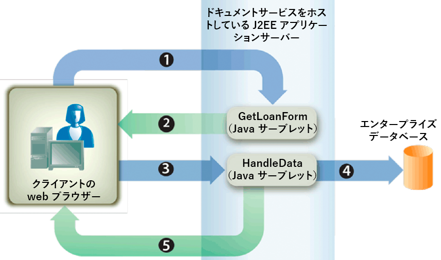

# インタラクティブPDF formsのレンダリング{#rendering-interactive-pdf-forms}

Formsサービスは、ユーザーから情報を収集するために、クライアントデバイス（通常はWebブラウザー）に対してインタラクティブなPDF formsをレンダリングします。 インタラクティブフォームがレンダリングされた後、ユーザーはフォームフィールドにデータを入力し、フォーム上の送信ボタンをクリックして、情報をFormsサービスに送り返すことができます。 インタラクティブPDFフォームを表示するには、クライアントのWebブラウザーをホストするコンピューターにAdobe ReaderまたはAcrobatをインストールする必要があります。

>[!NOTE]
>
>Formsサービスを使用してフォームをレンダリングする前に、フォームデザインを作成します。 通常、フォームデザインはDesignerで作成され、XDPファイルとして保存されます。 フォームデザインの作成について詳しくは、「[Formsデザイナー](https://www.adobe.com/go/learn_aemforms_designer_63)」を参照してください。

**ローンの申し込み例**

Formsサービスがユーザーから情報を収集する際にインタラクティブフォームを使用する方法を示すローン申し込み例を紹介します。 この申込みにより、ユーザーはローンのセキュリティ保護に必要なデータをフォームに入力し、データをFormsサービスに送信できます。 次の図に、ローン申込のロジックの流れを示します。



次の表に、この図の手順を示します。

<table>
 <thead>
  <tr>
   <th><p>ステップ</p></th>
   <th><p>説明</p></th>
  </tr>
 </thead>
 <tbody>
  <tr>
   <td><p>1</p></td>
   <td><p><code>GetLoanForm</code> JavaサーブレットがHTMLページから呼び出されます。 </p></td>
  </tr>
  <tr>
   <td><p>2</p></td>
   <td><p><code>GetLoanForm</code> Javaサーブレットは、FormsサービスクライアントAPIを使用して、ローンフォームをクライアントWebブラウザーにレンダリングします。 （<a href="#render-an-interactive-pdf-form-using-the-java-api">Java APIを使用したインタラクティブPDFフォームのレンダリング</a>を参照）。</p></td>
  </tr>
  <tr>
   <td><p>3</p></td>
   <td><p>ユーザーがローンフォームに入力し、「送信」ボタンをクリックすると、データが<code>HandleData</code> Javaサーブレットに送信されます。 （<i>"ローンフォーム"</i>を参照）。</p></td>
  </tr>
  <tr>
   <td><p>4</p></td>
   <td><p><code>HandleData</code> Javaサーブレットは、FormsサービスクライアントAPIを使用してフォーム送信を処理し、フォームデータを取得します。 次に、データをエンタープライズデータベースに格納します。 (<a href="/help/forms/developing/handling-submitted-forms.md#handling-submitted-forms">送信されたFormsの処理</a>を参照)。</p></td>
  </tr>
  <tr>
   <td><p>5</p></td>
   <td><p>確認フォームがWebブラウザーにレンダリングされて戻されます。 ユーザーの姓や名などのデータは、レンダリング前にフォームにマージされます。 (「<a href="/help/forms/developing/prepopulating-forms-flowable-layouts.md">編集可能なレイアウトでFormsを自動埋め込む</a>」を参照)。</p></td>
  </tr>
 </tbody>
</table>

**ローンフォーム**

このインタラクティブローンフォームは、サンプルローンアプリケーションの`GetLoanForm` Javaサーブレットによってレンダリングされます。


**確認フォーム**

このフォームは、サンプルローンアプリケーションの`HandleData` Javaサーブレットによってレンダリングされます。


`HandleData` Javaサーブレットは、このフォームにユーザーの姓と名と金額を事前入力します。 フォームに事前入力された後、フォームがクライアントのWebブラウザーに送信されます。 (「[編集可能なレイアウトでFormsを自動埋め込む](/help/forms/developing/prepopulating-forms-flowable-layouts.md)」を参照)。

**Javaサーブレット**

ローン申し込み例は、Javaサーブレットとして存在するFormsサービス申し込みの例です。 Javaサーブレットは、WebSphereなどのJ2EEアプリケーションサーバー上で実行されるJavaプログラムで、FormsサービスのクライアントAPIコードが含まれています。

次のコードは、GetLoanFormという名前のJavaサーブレットの構文を示しています。

```java
     public class GetLoanForm extends HttpServlet implements Servlet {
         public void doGet(HttpServletRequest req, HttpServletResponse resp
         throws ServletException, IOException {

         }
         public void doPost(HttpServletRequest req, HttpServletResponse resp
         throws ServletException, IOException {

             }
```

通常、FormsサービスのクライアントAPIコードは、Javaサーブレットの`doGet`メソッドまたは`doPost`メソッド内に配置しません。 このコードを別のクラスに配置し、`doPost`メソッド（または`doGet`メソッド）内からクラスをインスタンス化して、適切なメソッドを呼び出す方が、プログラミングのベストプラクティスです。 ただし、コードを簡潔にするために、この節のコード例は最小限に抑え、コード例は`doPost`メソッドに配置します。

>[!NOTE]
>
>Formsサービスの詳細については、『[AEM Formsのサービスリファレンス](https://www.adobe.com/go/learn_aemforms_services_63)』を参照してください。

**手順の概要**

インタラクティブPDFフォームをレンダリングするには、次のタスクを実行します。

1. プロジェクトファイルを含めます。
1. FormsクライアントAPIオブジェクトを作成します。
1. URI値を指定します。
1. フォームへのファイルの添付（オプション）
1. インタラクティブPDFフォームをレンダリングします。
1. フォームデータストリームをクライアントのWebブラウザーに書き込みます。

**プロジェクトファイルを含める**

必要なファイルを開発プロジェクトに含めます。 Javaを使用してクライアントアプリケーションを作成する場合は、必要なJARファイルを含めます。 Webサービスを使用している場合は、プロキシファイルを必ず含めてください。

**FormsクライアントAPIオブジェクトの作成**

プログラムでFormsサービスのクライアントAPI操作を実行する前に、FormsクライアントAPIオブジェクトを作成する必要があります。 Java APIを使用している場合は、`FormsServiceClient`オブジェクトを作成します。 FormsのWebサービスAPIを使用している場合は、`FormsService`オブジェクトを作成します。

**URI値の指定**

フォームをレンダリングするためにFormsサービスで必要なURI値を指定できます。 Formsアプリケーションの一部として保存されたフォームデザインは、コンテンツルートURI値`repository:///`を使用して参照できます。 例えば、*FormsApplication*&#x200B;という名前のFormsアプリケーション内にある&#x200B;*Loan.xdp*&#x200B;という名前の次のフォームデザインを考えてみましょう。


このフォームデザインにアクセスするには、フォーム名（`renderPDFForm`メソッドに渡される最初のパラメーター）に`Applications/FormsApplication/1.0/FormsFolder/Loan.xdp`を指定し、コンテンツルートURI値に`repository:///`を指定します。

>[!NOTE]
>
>Workbenchを使用したFormsアプリケーションの作成について詳しくは、[Workbenchヘルプ](https://www.adobe.com/go/learn_aemforms_workbench_63)を参照してください。

Formsアプリケーション内のリソースへのパスは次のとおりです。

`Applications/Application-name/Application-version/Folder.../Filename`

次に、URI値の例を示します。

* Applications/AppraisalReport/1.0/Forms/FullForm.xdp
* Applications/AnotherApp/1.1/Assets/picture.jpg
* Applications/SomeApp/2.0/Resources/Data/XSDs/MyData.xsd

インタラクティブフォームをレンダリングする場合、フォームデータの投稿先となるターゲットURLなどのURI値を定義できます。 ターゲットURLは、次のいずれかの方法で定義できます。

* Designerでフォームデザインをデザインする際の「Submit」ボタン
* FormsサービスクライアントAPIを使用する

ターゲットURLがフォームデザイン内で定義されている場合は、FormsサービスのクライアントAPIを使用して上書きしないでください。 つまり、FormsAPIを使用してターゲットURLを設定すると、フォームデザインで指定されたURLが、APIを使用して指定されたURLにリセットされます。 PDFフォームをフォームデザインで指定されたターゲットURLに送信する場合は、プログラムでターゲットURLを空の文字列に設定します。

送信ボタンと計算ボタン（サーバーで実行される対応するスクリプトを含む）を含むフォームがある場合、スクリプトを実行するためにフォームを送信する先のURLをプログラムで定義できます。 フォームデザインの送信ボタンを使用して、フォームデータが投稿されるURLを指定します。 （「[フォームデータの計算](/help/forms/developing/calculating-form-data.md)」を参照）。

>[!NOTE]
>
>XDPファイルを参照するURL値を指定する代わりに、`com.adobe.idp.Document`インスタンスをFormsサービスに渡すこともできます。 `com.adobe.idp.Document`インスタンスにはフォームデザインが含まれています。 (「[Formsサービスにドキュメントを渡す](/help/forms/developing/passing-documents-forms-service.md)」を参照)。

**フォームへのファイルの添付**

フォームにファイルを添付できます。 添付ファイルを含むPDFフォームをレンダリングする場合、ユーザーは添付ファイルペインを使用して、Acrobatで添付ファイルを取得できます。 テキストファイルなどのフォームや、JPGファイルなどのバイナリファイルに、様々なファイル形式を添付できます。

>[!NOTE]
>
>添付ファイルのフォームへの添付は任意です。

**インタラクティブPDFフォームのレンダリング**

フォームをレンダリングするには、Designerで作成され、XDPまたはPDFファイルとして保存されたフォームデザインを使用します。 また、Acrobatを使用して作成し、PDFファイルとして保存したフォームをレンダリングすることもできます。 インタラクティブPDFフォームをレンダリングするには、`FormsServiceClient`オブジェクトの`renderPDFForm`メソッドまたは`renderPDFForm2`メソッドを呼び出します。

`renderPDFForm`は`URLSpec`オブジェクトを使用します。 XDPファイルに対するコンテンツルートは、`URLSpec`オブジェクトの`setContentRootURI`メソッドを使用してFormsサービスに渡されます。 フォームデザイン名(`formQuery`)は、別のパラメーター値として渡されます。 2つの値が連結され、フォームデザインの絶対参照が取得されます。

`renderPDFForm2`メソッドは、レンダリングするXDPまたはPDFドキュメントを含む`com.adobe.idp.Document`インスタンスを受け取ります。

>[!NOTE]
>
>入力ドキュメントがPDFドキュメントの場合、タグ付きPDFランタイムオプションは設定できません。 入力ファイルがXDPファイルの場合は、タグ付きPDFオプションを設定できます。

## Java API {#render-an-interactive-pdf-form-using-the-java-api}を使用してインタラクティブPDFフォームをレンダリングする

FormsAPI(Java)を使用してインタラクティブPDFフォームをレンダリングします。

1. プロジェクトファイルを含める

   Javaプロジェクトのクラスパスに、adobe-forms-client.jarなどのクライアントJARファイルを含めます。

1. FormsクライアントAPIオブジェクトの作成

   * 接続プロパティを含む `ServiceClientFactory` オブジェクトを作成します。
   * コンストラクターを使用し、`FormsServiceClient`オブジェクトを渡して、`ServiceClientFactory`オブジェクトを作成します。

1. URI値の指定

   * コンストラクターを使用して、URI値を格納する`URLSpec`オブジェクトを作成します。
   * `URLSpec`オブジェクトの`setApplicationWebRoot`メソッドを呼び出し、アプリケーションのWebルートを表す文字列値を渡します。
   * `URLSpec`オブジェクトの`setContentRootURI`メソッドを呼び出し、コンテンツルートURI値を指定する文字列値を渡します。 フォームデザインがコンテンツルートURI内にあることを確認します。 そうでない場合、Formsサービスは例外をスローします。 リポジトリを参照するには、`repository:///`を指定します。
   * `URLSpec`オブジェクトの`setTargetURL`メソッドを呼び出し、フォームデータのポスト先のターゲットURL値を指定する文字列値を渡します。 フォームデザインでターゲットURLを定義する場合は、空の文字列を渡すことができます。 演算を実行するために、フォームの送信先URLを指定することもできます。

1. フォームへのファイルの添付

   * コンストラクターを使用して、添付ファイルを格納する`java.util.HashMap`オブジェクトを作成します。
   * レンダリングされたフォームに添付する各ファイルに対して`java.util.HashMap`オブジェクトの`put`メソッドを呼び出します。 このメソッドに次の値を渡します。

      * 添付ファイルの名前（ファイル名拡張子を含む）を指定するstring値。
   * 添付ファイルを含む`com.adobe.idp.Document`オブジェクト。

   >[!NOTE]
   >
   >フォームに添付するファイルごとに、この手順を繰り返します。 この手順はオプションです。添付ファイルを送信したくない場合は、`null`を渡すことができます。

1. インタラクティブPDFフォームのレンダリング

   `FormsServiceClient`オブジェクトの`renderPDFForm`メソッドを呼び出し、次の値を渡します。

   * ファイル名拡張子を含むフォームデザイン名を指定するstring値。 Formsアプリケーションの一部であるフォームデザインを参照する場合は、`Applications/FormsApplication/1.0/FormsFolder/Loan.xdp`など、完全なパスを必ず指定してください。
   * フォームとマージするデータを含む`com.adobe.idp.Document`オブジェクト。 データをマージしない場合は、空の`com.adobe.idp.Document`オブジェクトを渡します。
   * 実行時オプションを格納する`PDFFormRenderSpec`オブジェクト。 これはオプションのパラメーターです。実行時のオプションを指定しない場合は、`null`を指定できます。
   * Formsサービスに必要なURI値を含む`URLSpec`オブジェクト。
   * 添付ファイルを格納する`java.util.HashMap`オブジェクト。 これはオプションのパラメーターです。フォームにファイルを添付しない場合は、`null`を指定できます。

   `renderPDFForm`メソッドは、クライアントのWebブラウザーに書き込む必要があるフォームデータストリームを含む`FormsResult`オブジェクトを返します。

1. フォームデータストリームをクライアントのWebブラウザーに書き込みます

   * `FormsResult`オブジェクト&#39;s `getOutputContent`メソッドを呼び出して、`com.adobe.idp.Document`オブジェクトを作成します。
   * `getContentType`メソッドを呼び出して、`com.adobe.idp.Document`オブジェクトのコンテンツタイプを取得します。
   * `javax.servlet.http.HttpServletResponse`オブジェクトのコンテンツタイプを設定するには、`setContentType`メソッドを呼び出し、`com.adobe.idp.Document`オブジェクトのコンテンツタイプを渡します。
   * `javax.servlet.http.HttpServletResponse`オブジェクトの`getOutputStream`メソッドを呼び出して、フォームデータストリームをクライアントのWebブラウザーに書き込むために使用する`javax.servlet.ServletOutputStream`オブジェクトを作成します。
   * `com.adobe.idp.Document`オブジェクトの`getInputStream`メソッドを呼び出して、`java.io.InputStream`オブジェクトを作成します。
   * バイト配列を作成し、`InputStream`オブジェクトの`read`メソッドを呼び出して、バイト配列を引数として渡すことで、フォームデータストリームを設定します。
   * `javax.servlet.ServletOutputStream`オブジェクトの`write`メソッドを呼び出して、フォームデータストリームをクライアントのWebブラウザーに送信します。 バイト配列を`write`メソッドに渡します。

## WebサービスAPI {#render-an-interactive-pdf-form-using-the-web-service-api}を使用してインタラクティブPDFフォームをレンダリングする

FormsAPI（Webサービス）を使用してインタラクティブPDFフォームをレンダリングします。

1. プロジェクトファイルを含める

   * FormsサービスのWSDLを使用するJavaプロキシクラスを作成します。
   * クラスパスにJavaプロキシクラスを含めます。

1. FormsクライアントAPIオブジェクトの作成

   `FormsService`オブジェクトを作成し、認証値を設定します。

1. URI値の指定

   * コンストラクターを使用して、URI値を格納する`URLSpec`オブジェクトを作成します。
   * `URLSpec`オブジェクトの`setApplicationWebRoot`メソッドを呼び出し、アプリケーションのWebルートを表す文字列値を渡します。
   * `URLSpec`オブジェクトの`setContentRootURI`メソッドを呼び出し、コンテンツルートURI値を指定する文字列値を渡します。 フォームデザインがコンテンツルートURI内にあることを確認します。 そうでない場合、Formsサービスは例外をスローします。 リポジトリを参照するには、`repository:///`を指定します。
   * `URLSpec`オブジェクトの`setTargetURL`メソッドを呼び出し、フォームデータのポスト先のターゲットURL値を指定する文字列値を渡します。 フォームデザインでターゲットURLを定義する場合は、空の文字列を渡すことができます。 演算を実行するために、フォームの送信先URLを指定することもできます。

1. フォームへのファイルの添付

   * コンストラクターを使用して、添付ファイルを格納する`java.util.HashMap`オブジェクトを作成します。
   * レンダリングされたフォームに添付する各ファイルに対して`java.util.HashMap`オブジェクトの`put`メソッドを呼び出します。 このメソッドに次の値を渡します。

      * 添付ファイルの名前（ファイル名拡張子を含む）を指定するstring値
   * 添付ファイルを含む`BLOB`オブジェクト

   >[!NOTE]
   >
   >フォームに添付するファイルごとに、この手順を繰り返します。

1. インタラクティブPDFフォームのレンダリング

   `FormsService`オブジェクトの`renderPDFForm`メソッドを呼び出し、次の値を渡します。

   * ファイル名拡張子を含むフォームデザイン名を指定するstring値。 Formsアプリケーションの一部であるフォームデザインを参照する場合は、`Applications/FormsApplication/1.0/FormsFolder/Loan.xdp`など、完全なパスを必ず指定してください。
   * フォームとマージするデータを含む`BLOB`オブジェクト。 データを結合したくない場合は、`null`を渡します。
   * 実行時オプションを格納する`PDFFormRenderSpec`オブジェクト。 これはオプションのパラメーターです。実行時のオプションを指定しない場合は、`null`を指定できます。
   * Formsサービスに必要なURI値を含む`URLSpec`オブジェクト。
   * 添付ファイルを格納する`java.util.HashMap`オブジェクト。 これはオプションのパラメーターです。フォームにファイルを添付しない場合は、`null`を指定できます。
   * メソッドによって入力される空の`com.adobe.idp.services.holders.BLOBHolder`オブジェクト。 これは、レンダリングされたPDFフォームを保存するために使用します。
   * メソッドによって入力される空の`javax.xml.rpc.holders.LongHolder`オブジェクト。 （この引数は、フォームのページ数を格納します。）
   * メソッドによって入力される空の`javax.xml.rpc.holders.StringHolder`オブジェクト。 （この引数はロケールの値を格納します）。
   * この操作の結果を含む空の`com.adobe.idp.services.holders.FormsResultHolder`オブジェクトです。

   `renderPDFForm`メソッドは、最後の引数値として渡される`com.adobe.idp.services.holders.FormsResultHolder`オブジェクトに、クライアントWebブラウザーに書き込む必要のあるフォームデータストリームを入力します。

1. フォームデータストリームをクライアントのWebブラウザーに書き込みます

   * `com.adobe.idp.services.holders.FormsResultHolder`オブジェクトの`value`データメンバの値を取得して、`FormResult`オブジェクトを作成します。
   * `FormsResult`オブジェクトの`getOutputContent`メソッドを呼び出して、フォームデータを含む`BLOB`オブジェクトを作成します。
   * `getContentType`メソッドを呼び出して、`BLOB`オブジェクトのコンテンツタイプを取得します。
   * `javax.servlet.http.HttpServletResponse`オブジェクトのコンテンツタイプを設定するには、`setContentType`メソッドを呼び出し、`BLOB`オブジェクトのコンテンツタイプを渡します。
   * `javax.servlet.http.HttpServletResponse`オブジェクトの`getOutputStream`メソッドを呼び出して、フォームデータストリームをクライアントのWebブラウザーに書き込むために使用する`javax.servlet.ServletOutputStream`オブジェクトを作成します。
   * バイト配列を作成し、`BLOB`オブジェクトの`getBinaryData`メソッドを呼び出して値を設定します。 このタスクは、`FormsResult`オブジェクトの内容をバイト配列に割り当てます。
   * `javax.servlet.http.HttpServletResponse`オブジェクトの`write`メソッドを呼び出して、フォームデータストリームをクライアントのWebブラウザーに送信します。 バイト配列を`write`メソッドに渡します。

**フォームデータストリームをクライアントのWebブラウザーに書き込みます**

Formsサービスはフォームをレンダリングすると、フォームデータストリームを返します。このストリームをクライアントのWebブラウザーに書き込む必要があります。 クライアントのWebブラウザーに書き込まれると、フォームはユーザーに表示されます。
