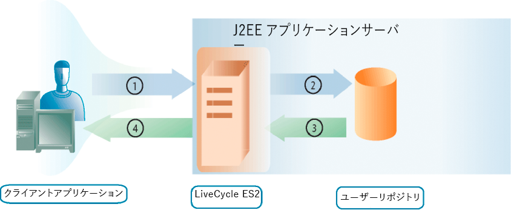

# ユーザーの管理 {#managing-users}

**User Managementについて**

User Management APIを使用して、ロール、権限、プリンシパル（ユーザーまたはグループ）を管理でき、ユーザーを認証できるクライアントアプリケーションを作成できます。 User Management APIは、次のAEM FormsAPIで構成されています。

* Directory Manager Service API
* Authentication ManagerサービスAPI
* 承認マネージャーサービスAPI

User Managementでは、ロールと権限の割り当て、削除、決定を行うことができます。 また、ドメイン、ユーザー、グループの割り当て、削除、クエリも可能です。 最後に、User Managementを使用してユーザーを認証できます。

「ユーザー [の追加](users.md#adding-users) 」では、プログラムによってユーザーを追加する方法を理解しています。 この節では、Directory Manager Service APIを使用します。

「ユーザーの [削除](users.md#deleting-users) 」では、ユーザーをプログラム的に削除する方法を理解しています。 この節では、Directory Manager Service APIを使用します。

ユーザーとグループの [管理では](users.md#managing-users-and-groups) 、ローカルユーザーとディレクトリユーザーの違いを理解し、Java APIとWebサービスAPIを使用してユーザーとグループをプログラム的に管理する方法の例を確認します。 この節では、Directory Manager Service APIを使用します。

ロールと権限の [管理では](users.md#managing-roles-and-permissions) 、システムの役割と権限、およびそれらをプログラムによって拡張する方法について学び、JavaおよびWebサービスAPIを使用して役割と権限をプログラム的に管理する方法の例を示します。 このセクションでは、Directory Manager Service APIとAuthorization Manager Service APIの両方を使用します。

「 [ユーザーの](users.md#authenticating-users) 認証」には、Java APIとWebサービスAPIを使用してユーザーをプログラム的に認証する方法の例が示されています。 この節では、承認マネージャーサービスAPIを使用します。

**認証プロセスについて**

User Managementには組み込みの認証機能があり、独自の認証プロバイダーとの接続機能も備わっています。 User Managementは、認証要求を受け取る（例えば、ユーザーがログインを試行する）と、認証のためにユーザー情報を認証プロバイダーに渡します。 User Managementは、ユーザーの認証後、認証プロバイダーから結果を受け取ります。

次の図に、ログインを試みたエンドユーザー、User Management、認証プロバイダー間でのやり取りを示します。

次の表に、認証プロセスの各手順を示します。

<table>
 <thead>
  <tr>
   <th>
ステップ
</th>
   <th>
説明
</th>
  </tr>
 </thead>
 <tbody>
  <tr>
   <td>
1
</td>
   <td>
ユーザーがUser Managementを呼び出すサービスにログインしようとします。 ユーザは、ユーザ名とパスワードを指定する。 
</td>
  </tr>
  <tr>
   <td>
2
</td>
   <td>
User Managementは、ユーザー名とパスワード、および設定情報を認証プロバイダーに送信します。
</td>
  </tr>
  <tr>
   <td>
3
</td>
   <td>
認証プロバイダは、ユーザストアに接続し、ユーザを認証する。
</td>
  </tr>
  <tr>
   <td>
4
</td>
   <td>
認証プロバイダーは、結果をUser Managementに返します。
</td>
  </tr>
  <tr>
   <td>
5
</td>
   <td>
User Managementでは、ユーザーが製品へのログインを許可するか、製品へのアクセスを拒否します。
</td>
  </tr>
 </tbody>
</table>

>[!NOTE]
>
>サーバーのタイムゾーンがクライアントのタイムゾーンと異なる場合、WebSphere Application Serverクラスター上の.NETクライアントを使用してネイティブSOAPスタック上のAEM FormsGenerate PDFサービス用のWSDLを使用すると、次のUser Management認証エラーが発生する可能性があります。

`[com.adobe.idp.um.webservices.WSSecurityHandler] errorCode:12803 errorCodeHEX:0x3203 message:WSSecurityHandler: UM authenticate returns exception : An error was discovered processing the <wsse:Security> header. (WSSecurityEngine: Invalid timestamp The security semantics of message have expired).`

**ディレクトリ管理について**

User Managementは、LDAPディレクトリへの接続をサポートするディレクトリサービスプロバイダー(DirectoryManagerService)と共にパッケージ化されています。 組織でLDAP以外のリポジトリを使用してユーザーレコードを保存する場合は、リポジトリで機能する独自のディレクトリサービスプロバイダーを作成できます。

ディレクトリサービスプロバイダーは、User Managementの要求時にユーザーストアからレコードを取得します。 User Managementは、ユーザーレコードとグループレコードを定期的にデータベースにキャッシュし、パフォーマンスを向上させます。

ディレクトリサービスプロバイダーを使用して、User Managementデータベースをユーザーストアと同期できます。 この手順では、すべてのユーザーディレクトリ情報と、すべてのユーザーレコードおよびグループレコードが最新であることを確認します。

また、DirectoryManagerServiceでは、ドメインの作成と管理を行うことができます。 ドメインは、様々なユーザーベースを定義します。 ドメインの境界は、通常、組織の構造化方法やユーザーストアの設定方法に従って定義されます。 User Managementドメインには、認証プロバイダーやディレクトリサービスプロバイダーが使用する設定が用意されています。

User Managementがエクスポートする設定XMLで、の属性値を持つルートノードに、User Management用に定義された各ドメインのXML要素 `Domains` が含まれています。 これらの各要素には、特定のサービスプロバイダーに関連付けられたドメインの外観を定義する他の要素が含まれます。

**objectSID値について**

Active Directoryを使用する場合、 `objectSID` 値が複数のドメイン間で一意の属性ではないことを理解することが重要です。 この値には、オブジェクトのセキュリティ識別子が格納されます。 複数のドメイン環境（ドメインのツリーなど）では、 `objectSID` 値が異なる場合があります。

あるActive Directoryドメインから別のドメインにオブジェクトを移動すると、値が変わり `objectSID` ます。 一部のオブジェクトは、ドメイン内のどこでも同じ `objectSID` 値を持ちます。 例えば、BUILTIN\Administrators、BUILTIN\Power Usersなどのグループは、ドメインに関係なく同じ `objectSID` 値を持ちます。 これらの `objectSID` 値はよく知られています。

## Adding Users {#adding-users}

Directory Manager Service API（JavaおよびWebサービス）を使用して、ユーザーをプログラム的にAEM Formsに追加できます。 ユーザーを追加した後、そのユーザーを、ユーザーを必要とするサービス操作の実行時に使用できます。 例えば、新しいユーザーにタスクを割り当てることができます。

### 手順の概要 {#summary-of-steps}

ユーザーを追加するには、次の手順を実行します。

1. プロジェクトファイルを含めます。
1. DirectoryManagerServiceクライアントを作成します。
1. ユーザー情報を定義します。
1. AEM Forms追加へのユーザー。
1. ユーザーが追加されていることを確認します。

**プロジェクトファイルを含める**

開発プロジェクトに必要なファイルを含めます。 Javaを使用してクライアントアプリケーションを作成する場合は、必要なJARファイルを含めます。 Webサービスを使用している場合は、プロキシファイルを含めます。

**DirectoryManagerServiceクライアントの作成**

プログラムを使用してDirectory Managerサービスの操作を実行する前に、Directory Manager Service APIクライアントを作成します。

**ユーザー情報の定義**

Directory Manager Service APIを使用して新しいユーザーを追加する場合は、そのユーザーの情報を定義します。 通常、新しいユーザーを追加する場合は、次の値を定義します。

* **ドメイン名**:ユーザーが属するドメイン(例： `DefaultDom`)。
* **ユーザー識別子の値**:ユーザーの識別子の値(例： `wblue`)。
* **プリンシパルタイプ**:ユーザーのタイプ(例えば、指定でき `USER)`ます)。
* **名**:ユーザーの名前(例： `Wendy`)。
* **姓**:ユーザーの姓(例： `Blue)`)。
* **ロケール**:ユーザーのロケール情報。

**AEM Forms追加へのユーザー**

ユーザ情報を定義した後、そのユーザをAEM Formsに追加できます。 ユーザーを追加するには、 `DirectoryManagerServiceClient` オブジェクトの `createLocalUser` メソッドを呼び出します。

**ユーザーが追加されたことを確認します**

ユーザーが追加されたことを確認して、問題が発生していないことを確認できます。 ユーザー識別子の値を使用して、新しいユーザーを見つけます。

**関連トピック**

[Java APIを追加使用するユーザー](users.md#add-users-using-the-java-api)

[webサービスAPI追加を使用するユーザー](users.md#add-users-using-the-web-service-api)

[AEM Forms Java ライブラリファイルを含める](/help/forms/developing/invoking-aem-forms-using-java.md#including-aem-forms-java-library-files)

[接続プロパティの設定](/help/forms/developing/invoking-aem-forms-using-java.md#setting-connection-properties)

[ユーザーの削除](users.md#deleting-users)

### Java APIを追加使用するユーザー {#add-users-using-the-java-api}

Directory Manager追加 Service API(Java)を使用したユーザー：

1. プロジェクトファイルを含めます。

   Javaプロジェクトのクラスパスに、adobe-usermanager-client.jarなどのクライアントJARファイルを含めます。

1. DirectoryManagerServicesクライアントを作成します。

   コンストラクタを使用し、接続プロパティを含むオブジェクトを渡して、 `DirectoryManagerServiceClient``ServiceClientFactory` オブジェクトを作成します。

1. ユーザー情報を定義します。

   * コンストラクタを使用して `UserImpl` オブジェクトを作成します。
   * オブジェクトのメソッドを呼び出して、デ `UserImpl` メイン名を設定し `setDomainName` ます。 ドメイン名を指定するstring値を渡します。
   * オブジェクトのメソッドを呼び出して、プリンシパ `UserImpl` ルの種類を設定し `setPrincipalType` ます。 ユーザーのタイプを指定するstring値を渡します。 例えば、を指定でき `USER`ます。
   * オブジェクトのメソッドを呼び出して、ユー `UserImpl` ザー識別子の値を設定し `setUserid` ます。 ユーザー識別子の値を指定するstring値を渡します。 例えば、を指定でき `wblue`ます。
   * オブジェクトのメソッドを呼び出して、正規名 `UserImpl` を設定し `setCanonicalName` ます。 ユーザーの正規名を指定するstring値を渡します。 例えば、を指定でき `wblue`ます。
   * オブジェクトのメソッドを呼び出して、 `UserImpl` 指定した名前を設定し `setGivenName` ます。 ユーザーの名前を指定するstring値を渡します。 例えば、を指定でき `Wendy`ます。
   * オブジェクトの `UserImpl``setFamilyName` メソッドを呼び出して、ファミリ名を設定します。 ユーザーの姓を指定するstring値を渡します。 例えば、を指定でき `Blue`ます。

   >[!NOTE]
   >
   >オブジェクトに属するメソッドを呼び出して、他の値を設定し `UserImpl` ます。 例えば、 `UserImpl` オブジェクトのメソッドを呼び出してロケール値を設定でき `setLocale` ます。

1. AEM Forms追加へのユーザー。

   オブジェクトの `DirectoryManagerServiceClient``createLocalUser` メソッドを呼び出し、次の値を渡します。

   * 新しいユーザーを表す `UserImpl` オブジェクトです
   * ユーザーのパスワードを表すstring値です

   この `createLocalUser` メソッドは、ローカルユーザー識別子の値を指定するstring値を返します。

1. ユーザーが追加されたことを確認します。

   * コンストラクタを使用して `PrincipalSearchFilter` オブジェクトを作成します。
   * オブジェクトのメソッドを呼び出して、ユー `PrincipalSearchFilter` ザー識別子の値を設定し `setUserId` ます。 ユーザー識別子の値を表すstring値を渡します。
   * Invoke the `DirectoryManagerServiceClient` object’s `findPrincipals` method and pass the `PrincipalSearchFilter` object. このメソッドは、各要素がオブジェクトである `java.util.List` インスタンスを返し `User` ます。 インスタンスを繰り返し処理して、ユーザーを検索し `java.util.List` ます。

**関連トピック**

[手順の概要](users.md#summary-of-steps)

[クイック開始（SOAPモード）:Java APIを使用したユーザの追加](/help/forms/developing/user-manager-java-api-quick.md#quick-start-soap-mode-adding-users-using-the-java-api)

[AEM Forms Java ライブラリファイルを含める](/help/forms/developing/invoking-aem-forms-using-java.md#including-aem-forms-java-library-files)

[接続プロパティの設定](/help/forms/developing/invoking-aem-forms-using-java.md#setting-connection-properties)

### webサービスAPI追加を使用するユーザー {#add-users-using-the-web-service-api}

Directory Manager Service API（Webサービス）追加を使用したユーザー：

1. プロジェクトファイルを含めます。

   MTOMを使用するMicrosoft .NETプロジェクトを作成します。 サービス参照に次のWSDL定義を使用していることを確認します。 `http://localhost:8080/soap/services/DirectoryManagerService?WSDL&lc_version=9.0.1`.

   >[!NOTE]
   >
   >AEM Forms `localhost` をホストするサーバーのIPアドレスに置き換えます。

1. DirectoryManagerServiceクライアントを作成します。

   * Create a `DirectoryManagerServiceClient` object by using its default constructor.
   * Create a `DirectoryManagerServiceClient.Endpoint.Address` object by using the `System.ServiceModel.EndpointAddress` constructor. WSDLをAEM Formsサービス(例えば、 `http://localhost:8080/soap/services/DirectoryManagerService?blob=mtom`)に指定するstring値を渡します。 属性を使用する必要はありません `lc_version` 。 この属性は、サービス参照を作成する際に使用されます。 必ず指定してくだ `?blob=mtom`さい。
   * フィールドの値を取得して `System.ServiceModel.BasicHttpBinding` オブジェクトを作成し `DirectoryManagerServiceClient.Endpoint.Binding` ます。 戻り値を `BasicHttpBinding` にキャストします。
   * オブジェクトの `System.ServiceModel.BasicHttpBinding` フィールドをに設定し `MessageEncoding` ま `WSMessageEncoding.Mtom`す。 この値により、MTOMが使用されます。
   * 次のタスクを実行して、基本的なHTTP認証を有効にします。

      * フィールドにAEM formsユーザー名を割り当て `DirectoryManagerServiceClient.ClientCredentials.UserName.UserName`ます。
      * 対応するパスワード値をフィールドに割り当て `DirectoryManagerServiceClient.ClientCredentials.UserName.Password`ます。
      * 定数値をフィールド `HttpClientCredentialType.Basic` に割り当て `BasicHttpBindingSecurity.Transport.ClientCredentialType`ます。
      * 定数値をフィールド `BasicHttpSecurityMode.TransportCredentialOnly` に割り当て `BasicHttpBindingSecurity.Security.Mode`ます。

1. ユーザー情報を定義します。

   * コンストラクタを使用して `UserImpl` オブジェクトを作成します。
   * オブジェクトのフィールドに文字列値を割り当てて、デ `UserImpl` メイン名を設定し `domainName` ます。
   * プリンシパルタイプを設定するには、 `UserImpl` オブジェクトの `principalType` フィールドに文字列値を割り当てます。 例えば、を指定でき `USER`ます。
   * ユーザー識別子の値を設定するには、文字列値を `UserImpl` オブジェクトの `userid` フィールドに割り当てます。
   * オブジェクトのフィールドに文字列値を割り当てて、正規名の値を設定 `UserImpl` し `canonicalName` ます。
   * 指定した名前の値を設定するには、文字列値を `UserImpl` オブジェクトの `givenName` フィールドに割り当てます。
   * ファミリ名の値を設定するには、文字列値を `UserImpl` オブジェクトの `familyName` フィールドに割り当てます。

1. AEM Forms追加へのユーザー。

   オブジェクトの `DirectoryManagerServiceClient``createLocalUser` メソッドを呼び出し、次の値を渡します。

   * 新しいユーザーを表す `UserImpl` オブジェクトです
   * ユーザーのパスワードを表すstring値です

   この `createLocalUser` メソッドは、ローカルユーザー識別子の値を指定するstring値を返します。

1. ユーザーが追加されたことを確認します。

   * コンストラクタを使用して `PrincipalSearchFilter` オブジェクトを作成します。
   * ユーザーのユーザー識別子の値を設定するには、ユーザー識別子の値を表すstring値を `PrincipalSearchFilter` オブジェクトの `userId` フィールドに割り当てます。
   * Invoke the `DirectoryManagerServiceClient` object’s `findPrincipals` method and pass the `PrincipalSearchFilter` object. このメソッドは、 `MyArrayOfUser` コレクションオブジェクトを返します。各要素は `User` オブジェクトです。 コレクションを繰り返し実行し、ユーザーを検索し `MyArrayOfUser` ます。

**関連トピック**

[手順の概要](users.md#summary-of-steps)

[MTOMを使用したAEM Formsの呼び出し](/help/forms/developing/invoking-aem-forms-using-web.md#invoking-aem-forms-using-mtom)

[SwaRefを使用したAEM Formsの呼び出し](/help/forms/developing/invoking-aem-forms-using-web.md#invoking-aem-forms-using-swaref)

## ユーザーの削除 {#deleting-users}

Directory Manager Service API（JavaおよびWebサービス）を使用すると、ユーザーをAEM Formsからプログラム的に削除できます。 ユーザーを削除すると、そのユーザーは、ユーザーを必要とするサービス操作を実行するために使用できなくなります。 例えば、削除したタスクにユーザーを割り当てることはできません。

### 手順の概要 {#summary_of_steps-1}

ユーザーを削除するには、次の手順を実行します。

1. プロジェクトファイルを含めます。
1. DirectoryManagerServiceクライアントを作成します。
1. 削除するユーザーを指定します。
1. ユーザーをAEM Formsから削除します。

**プロジェクトファイルを含める**

開発プロジェクトに必要なファイルを含めます。 Javaを使用してクライアントアプリケーションを作成する場合は、必要なJARファイルを含めます。 Webサービスを使用している場合は、プロキシファイルを含めます。

**DirectoryManagerServiceクライアントの作成**

プログラムでDirectory Manager Service API操作を実行する前に、Directory Managerサービスクライアントを作成します。

**削除するユーザーの指定**

ユーザーの識別子の値を使用して、削除するユーザーを指定できます。

**ユーザーをAEM Formsから削除します**

ユーザーを削除するには、 `DirectoryManagerServiceClient` オブジェクトの `deleteLocalUser` メソッドを呼び出します。

**関連トピック**

[Java APIを使用したユーザーの削除](users.md#delete-users-using-the-java-api)

[WebサービスAPIを使用したユーザーの削除](users.md#delete-users-using-the-web-service-api)

[AEM Forms Java ライブラリファイルを含める](/help/forms/developing/invoking-aem-forms-using-java.md#including-aem-forms-java-library-files)

[接続プロパティの設定](/help/forms/developing/invoking-aem-forms-using-java.md#setting-connection-properties)

[ユーザーの追加](users.md#adding-users)

### Java APIを使用したユーザーの削除 {#delete-users-using-the-java-api}

Directory Manager Service API(Java)を使用してユーザーを削除します。

1. プロジェクトファイルを含めます。

   Javaプロジェクトのクラスパスに、adobe-usermanager-client.jarなどのクライアントJARファイルを含めます。

1. DirectoryManagerServiceクライアントを作成します。

   コンストラクタを使用し、接続プロパティを含むオブジェクトを渡して、 `DirectoryManagerServiceClient``ServiceClientFactory` オブジェクトを作成します。

1. 削除するユーザーを指定します。

   * コンストラクタを使用して `PrincipalSearchFilter` オブジェクトを作成します。
   * オブジェクトのメソッドを呼び出して、ユー `PrincipalSearchFilter` ザー識別子の値を設定し `setUserId` ます。 ユーザー識別子の値を表すstring値を渡します。
   * Invoke the `DirectoryManagerServiceClient` object’s `findPrincipals` method and pass the `PrincipalSearchFilter` object. このメソッドは、各要素がオブジェクトである `java.util.List` インスタンスを返し `User` ます。 インスタンスを繰り返し実行して、削除するユーザーを検索します。 `java.util.List`

1. ユーザーをAEM Formsから削除します。

   オブジェクトの `DirectoryManagerServiceClient` メソッドを呼び出し、オブジェクトの `deleteLocalUser` フィールドの値を渡し `User``oid` ます。 オブジェクトの `User` メソッドを呼び出し `getOid` ます。 インスタンスから取得した `User` オブジェクトを使用し `java.util.List` ます。

**関連トピック**

[手順の概要](users.md#summary-of-steps)

[クイック開始（EJBモード）:Java APIを使用したユーザーの削除](/help/forms/developing/user-manager-java-api-quick.md#quick-start-soap-mode-deleting-users-using-the-java-api)

[クイック開始（SOAPモード）:Java APIを使用したユーザーの削除](/help/forms/developing/user-manager-java-api-quick.md#quick-start-soap-mode-deleting-users-using-the-java-api)

[AEM Forms Java ライブラリファイルを含める](/help/forms/developing/invoking-aem-forms-using-java.md#including-aem-forms-java-library-files)

[接続プロパティの設定](/help/forms/developing/invoking-aem-forms-using-java.md#setting-connection-properties)

### WebサービスAPIを使用したユーザーの削除 {#delete-users-using-the-web-service-api}

Directory Manager Service API（Webサービス）を使用してユーザーを削除します。

1. プロジェクトファイルを含めます。

   Javaプロジェクトのクラスパスに、adobe-usermanager-client.jarなどのクライアントJARファイルを含めます。

1. DirectoryManagerServiceクライアントを作成します。

   * Create a `DirectoryManagerServiceClient` object by using its default constructor.
   * Create a `DirectoryManagerServiceClient.Endpoint.Address` object by using the `System.ServiceModel.EndpointAddress` constructor. WSDLをAEM Formsサービス(例えば、 `http://localhost:8080/soap/services/DirectoryManagerService?blob=mtom`)に指定するstring値を渡します。 属性を使用する必要はありません `lc_version` 。 この属性は、サービス参照を作成する際に使用されます。 必ず `blob=mtom.`
   * フィールドの値を取得して `System.ServiceModel.BasicHttpBinding` オブジェクトを作成し `DirectoryManagerServiceClient.Endpoint.Binding` ます。 戻り値を `BasicHttpBinding` にキャストします。
   * オブジェクトの `System.ServiceModel.BasicHttpBinding` フィールドをに設定し `MessageEncoding` ま `WSMessageEncoding.Mtom`す。 この値により、MTOMが使用されます。
   * 次のタスクを実行して、基本的なHTTP認証を有効にします。

      * フィールドにAEM formsユーザー名を割り当て `DirectoryManagerServiceClient.ClientCredentials.UserName.UserName`ます。
      * 対応するパスワード値をフィールドに割り当て `DirectoryManagerServiceClient.ClientCredentials.UserName.Password`ます。
      * 定数値をフィールド `HttpClientCredentialType.Basic` に割り当て `BasicHttpBindingSecurity.Transport.ClientCredentialType`ます。
      * 定数値をフィールド `BasicHttpSecurityMode.TransportCredentialOnly` に割り当て `BasicHttpBindingSecurity.Security.Mode`ます。

1. 削除するユーザーを指定します。

   * コンストラクタを使用して `PrincipalSearchFilter` オブジェクトを作成します。
   * ユーザー識別子の値を設定するには、文字列値を `PrincipalSearchFilter` オブジェクトの `userId` フィールドに割り当てます。
   * Invoke the `DirectoryManagerServiceClient` object’s `findPrincipals` method and pass the `PrincipalSearchFilter` object. このメソッドは、 `MyArrayOfUser` コレクションオブジェクトを返します。各要素は `User` オブジェクトです。 コレクションを繰り返し実行し、ユーザーを検索し `MyArrayOfUser` ます。 コレクションオブジェクトから取得した `User` オブジェクトは、ユー `MyArrayOfUser` ザーの削除に使用されます。

1. ユーザーをAEM Formsから削除します。

   オブジェクトの `User` フィールド値をオブジェクトの `oid``DirectoryManagerServiceClient``deleteLocalUser` メソッドに渡して、ユーザーを削除します。

**関連トピック**

[手順の概要](users.md#summary-of-steps)

[MTOMを使用したAEM Formsの呼び出し](/help/forms/developing/invoking-aem-forms-using-web.md#invoking-aem-forms-using-mtom)

[SwaRefを使用したAEM Formsの呼び出し](/help/forms/developing/invoking-aem-forms-using-web.md#invoking-aem-forms-using-swaref)

## グループの作成 {#creating-groups}

Directory Manager Service API（JavaおよびWebサービス）を使用して、AEM Formsグループをプログラムで作成できます。 グループを作成した後、そのグループを使用して、グループを必要とするサービス操作を実行できます。 例えば、ユーザーを新しいグループに割り当てることができます。 (「ユーザーとグループの [管理](users.md#managing-users-and-groups)」を参照)。

### 手順の概要 {#summary_of_steps-2}

グループを作成するには、次の手順を実行します。

1. プロジェクトファイルを含めます。
1. DirectoryManagerServiceクライアントを作成します。
1. グループが存在しないことを確認します。
1. グループを作成します。
1. グループに対してアクションを実行します。

**プロジェクトファイルを含める**

開発プロジェクトに必要なファイルを含めます。 Javaを使用してクライアントアプリケーションを作成する場合は、必要なJARファイルを含めます。

次のJARファイルをプロジェクトのクラスパスに追加する必要があります。

* adobe-livecycle-client.jar
* adobe-usermanager-client.jar
* adobe-utilities.jar(AEM FormsがJBossにデプロイされている場合に必須)
* jbossall-client.jar(AEM FormsがJBossにデプロイされている場合に必須)

For information about the location of these JAR files, see [Including AEM Forms Java library files](/help/forms/developing/invoking-aem-forms-using-java.md#including-aem-forms-java-library-files).

**DirectoryManagerServiceクライアントの作成**

プログラムを使用してDirectory Managerサービスの操作を実行する前に、Directory Manager Service APIクライアントを作成します。

**グループが存在するかどうかの確認**

グループを作成する場合は、そのグループが同じドメインに存在しないことを確認します。 つまり、2つのグループが同じドメイン内で同じ名前を持つことはできません。 このタスクを実行するには、検索を実行し、2つの値に基づいて検索結果をフィルタリングします。 プリンシパルタイプをに設定し、グループ `com.adobe.idp.um.api.infomodel.Principal.PRINCIPALTYPE_GROUP` のみが返されるようにします。 また、ドメイン名を必ず指定してください。

**グループの作成**

グループがドメインに存在しないと判断したら、グループを作成し、次の属性を指定します。

* **共通名**:グループの名前。
* **ドメイン**:グループが追加されるドメイン。
* **説明**:グループの説明。

**グループに対するアクションの実行**

グループを作成した後、そのグループを使用してアクションを実行できます。 例えば、ユーザーをグループに追加できます。 ユーザーをグループに追加するには、ユーザーとグループの両方の固有な識別子の値を取得します。 これらの値を `addPrincipalToLocalGroup` メソッドに渡します。

**関連トピック**

[Java APIを使用したグループの作成](users.md#create-groups-using-the-java-api)

[AEM Forms Java ライブラリファイルを含める](/help/forms/developing/invoking-aem-forms-using-java.md#including-aem-forms-java-library-files)

[接続プロパティの設定](/help/forms/developing/invoking-aem-forms-using-java.md#setting-connection-properties)

[ユーザーの追加](users.md#adding-users)

[ユーザーの削除](users.md#deleting-users)

### Java APIを使用したグループの作成 {#create-groups-using-the-java-api}

Directory Manager Service API(Java)を使用してグループを作成します。

1. プロジェクトファイルを含めます。

   Javaプロジェクトのクラスパスに、adobe-usermanager-client.jarなどのクライアントJARファイルを含めます。

1. DirectoryManagerServiceクライアントを作成します。

   コンストラクタを使用し、接続プロパティを含むオブジェクトを渡して、 `DirectoryManagerServiceClient``ServiceClientFactory` オブジェクトを作成します。

1. グループが存在するかどうかを確認します。

   * コンストラクタを使用して `PrincipalSearchFilter` オブジェクトを作成します。
   * オブジェクトのオブジェクトを呼び出して、プリンシパルタ `PrincipalSearchFilter` イプを設定し `setPrincipalType` ます。 値を渡し `com.adobe.idp.um.api.infomodel.Principal.PRINCIPALTYPE_GROUP`ます。
   * オブジェクトのオブジェクトを呼び出して、 `PrincipalSearchFilter` ドメインを設定し `setSpecificDomainName` ます。 ドメイン名を指定するstring値を渡します。
   * グループを検索するには、 `DirectoryManagerServiceClient` オブジェクトの `findPrincipals` メソッドを呼び出します（プリンシパルはグループにすることができます）。 プリンシパルタイプとドメイン名を指定する `PrincipalSearchFilter` オブジェクトを渡します。 このメソッドは、各要素がインスタンスである `java.util.List` インスタンスを返し `Group` ます。 各グループインスタンスは、 `PrincipalSearchFilter` オブジェクトを使用して指定されたフィルタに準拠します。
   * インスタンスを繰り返し処理 `java.util.List` します。 各要素について、グループ名を取得します。 グループ名が新しいグループ名と等しくないことを確認します。

1. グループを作成します。

   * グループが存在しない場合は、 `Group` オブジェクトの `setCommonName` メソッドを呼び出し、グループ名を指定する文字列値を渡します。
   * オブ `Group` ジェクトの `setDescription` メソッドを呼び出し、グループの説明を指定する文字列値を渡します。
   * オブ `Group` ジェクトの `setDomainName` メソッドを呼び出し、ドメイン名を指定する文字列値を渡します。
   * Invoke the `DirectoryManagerServiceClient` object’s `createLocalGroup` method and pass the `Group` instance.

   この `createLocalUser` メソッドは、ローカルユーザー識別子の値を指定するstring値を返します。

1. グループに対してアクションを実行します。

   * コンストラクタを使用して `PrincipalSearchFilter` オブジェクトを作成します。
   * オブジェクトのメソッドを呼び出して、ユー `PrincipalSearchFilter` ザー識別子の値を設定し `setUserId` ます。 ユーザー識別子の値を表すstring値を渡します。
   * Invoke the `DirectoryManagerServiceClient` object’s `findPrincipals` method and pass the `PrincipalSearchFilter` object. このメソッドは、各要素がオブジェクトである `java.util.List` インスタンスを返し `User` ます。 インスタンスを繰り返し処理して、ユーザーを検索し `java.util.List` ます。
   * オ追加ブジェクトのメソッドを呼び出して、グループにアクセスするユーザー。 `DirectoryManagerServiceClient``addPrincipalToLocalGroup` オブジェクトのメ `User` ソッドの戻り値を渡し `getOid` ます。 オブジェクトの `Group` メソッドの戻り値を渡します(新しいグループを表す `getOid``Group` インスタンスを使用)。

**関連トピック**

[手順の概要](users.md#summary-of-steps)

[AEM Forms Java ライブラリファイルを含める](/help/forms/developing/invoking-aem-forms-using-java.md#including-aem-forms-java-library-files)

[接続プロパティの設定](/help/forms/developing/invoking-aem-forms-using-java.md#setting-connection-properties)

## ユーザーとグループの管理 {#managing-users-and-groups}

このトピックでは、(Java)を使用して、ドメイン、ユーザー、グループをプログラムによって割り当て、削除、クエリする方法について説明します。

>[!NOTE]
>
>ドメインを設定する場合、グループおよびユーザーの固有な識別子を設定する必要があります。 選択する属性は、LDAP環境内で一意である必要があるだけでなく、不変である必要があり、ディレクトリ内で変更されません。 また、この属性は単純な文字列データ型である必要があります(Active Directory 2000/2003で現在許可されている唯一の例外はバイナリ値 `"objectsid"`です)。 たとえば、Novell eDirectory属性 `"GUID"`は、単純な文字列データ型ではないので、機能しません。

* Active Directoryの場合は、を使用し `"objectsid"`ます。
* SunOneの場合は、を使用し `"nsuniqueid"`ます。

>[!NOTE]
>
>LDAPディレクトリの同期の進行中に複数のローカルユーザーおよびグループを作成することは、サポートされていません。 この処理を試みると、エラーが発生します。

### 手順の概要 {#summary_of_steps-3}

ユーザーおよびグループを管理するには、次の手順を実行します。

1. プロジェクトファイルを含めます。
1. DirectoryManagerServiceクライアントを作成します。
1. 適切なユーザー操作またはグループ操作を呼び出します。

**プロジェクトファイルを含める**

開発プロジェクトに必要なファイルを含めます。 Javaを使用してクライアントアプリケーションを作成する場合は、必要なJARファイルを含めます。 Webサービスを使用している場合は、プロキシファイルを必ず含めます。

**DirectoryManagerServiceクライアントの作成**

プログラムを使用してDirectory Managerサービスの操作を実行する前に、Directory Managerサービスクライアントを作成する必要があります。 Java APIを使用すると、これは `DirectoryManagerServiceClient` オブジェクトを作成することで実現できます。 WebサービスAPIを使用すると、これは `DirectoryManagerServiceService` オブジェクトを作成することで実現できます。

**適切なユーザー操作またはグループ操作を呼び出します**

サービスクライアントを作成したら、ユーザー管理操作またはグループ管理操作を呼び出すことができます。 サービスクライアントでは、ドメイン、ユーザー、グループの割り当て、削除、クエリが可能です。 ディレクトリプリンシパルまたはローカルプリンシパルをローカルグループに追加することは可能ですが、ローカルプリンシパルをディレクトリグループに追加することはできません。

**関連トピック**

[Java APIを使用したユーザーとグループの管理](users.md#managing-users-and-groups-using-the-java-api)

[WebサービスAPIを使用したユーザーとグループの管理](users.md#managing-users-and-groups-using-the-web-service-api)

[AEM Forms Java ライブラリファイルを含める](/help/forms/developing/invoking-aem-forms-using-java.md#including-aem-forms-java-library-files)

[接続プロパティの設定](/help/forms/developing/invoking-aem-forms-using-java.md#setting-connection-properties)

[User Manager APIのクイック開始](/help/forms/developing/user-manager-java-api-quick.md#user-manager-java-api-quick-start-soap)

### Java APIを使用したユーザーとグループの管理 {#managing-users-and-groups-using-the-java-api}

(Java)を使用してユーザー、グループおよびドメインをプログラムで管理するには、次のタスクを実行します。

1. プロジェクトファイルを含めます。

   Javaプロジェクトのクラスパスに、adobe-usermanager-client.jarなどのクライアントJARファイルを含めます。 これらのファイルの場所については、[AEM Forms Java ライブラリファイルを含める](/help/forms/developing/invoking-aem-forms-using-java.md#including-aem-forms-java-library-files)を参照してください。

1. DirectoryManagerServiceクライアントを作成します。

   コンストラクタを使用し、接続プロパティを含むオブジェクトを渡して、 `DirectoryManagerServiceClient``ServiceClientFactory` オブジェクトを作成します。 詳しくは、「接続プロパティの [設定&#x200B;](/help/forms/developing/invoking-aem-forms-using-java.md#setting-connection-properties)*」を参照してください。*

1. 適切なユーザー操作またはグループ操作を呼び出します。

   ユーザーまたはグループを検索するには、オブジェクトのプリンシパルを検索するメソッドの1つを呼び出します（プリンシパルはユーザーまたはグループになる可能性があるため）。 `DirectoryManagerServiceClient` 次の例では、 `findPrincipals` メソッドは検索フィルター( `PrincipalSearchFilter` オブジェクト)を使用して呼び出されます。

   この場合の戻り値は `java.util.List` 含まれるオブジェクトであるため、結果を繰り返し処理し、オ `Principal` ブジェクトをまたは `Principal``User``Group` オブジェクトにキャストします。

   (両方ともインター `User` フェイスから継承する)結果 `Group` または `Principal` オブジェクトを使用して、ワークフローで必要な情報を取得します。 例えば、ドメイン名と正規名の値を組み合わせて、プリンシパルを一意に識別します。 これらは、 `Principal` オブジェクトのメソッドとメソッドをそれぞれ呼び出して取得さ `getDomainName` れ `getCanonicalName` ます。

   ローカルユーザーを削除するには、 `DirectoryManagerServiceClient` オブジェクトの `deleteLocalUser` メソッドを呼び出し、ユーザーのIDを渡します。

   ローカルグループを削除するには、 `DirectoryManagerServiceClient` オブジェクトの `deleteLocalGroup` メソッドを呼び出し、グループのIDを渡します。

**関連トピック**

[手順の概要](users.md#summary-of-steps)

[AEM Forms Java ライブラリファイルを含める](/help/forms/developing/invoking-aem-forms-using-java.md#including-aem-forms-java-library-files)

[接続プロパティの設定](/help/forms/developing/invoking-aem-forms-using-java.md#setting-connection-properties)

### WebサービスAPIを使用したユーザーとグループの管理 {#managing-users-and-groups-using-the-web-service-api}

Directory Manager Service API（Webサービス）を使用してユーザー、グループ、ドメインをプログラムで管理するには、次のタスクを実行します。

1. プロジェクトファイルを含めます。

   * Directory Manager WSDLを使用するMicrosoft .NETクライアントアセンブリを作成します。 (Base64エンコーディングを使用した [AEM Formsの呼び出しを参照](/help/forms/developing/invoking-aem-forms-using-web.md#invoking-aem-forms-using-base64-encoding))。
   * Microsoft .NETクライアントアセンブリを参照します。 (Base64エンコーディングを使用した.NETクライアントアセンブリの [作成を参照](/help/forms/developing/invoking-aem-forms-using-web.md#creating-a-net-client-assembly-that-uses-base64-encoding))。

1. DirectoryManagerServiceクライアントを作成します。

   プロキシクラスのコンストラクターを使用して、 `DirectoryManagerServiceService` オブジェクトを作成します。

1. 適切なユーザー操作またはグループ操作を呼び出します。

   ユーザーまたはグループを検索するには、オブジェクトのプリンシパルを検索するメソッドの1つを呼び出します（プリンシパルはユーザーまたはグループになる可能性があるため）。 `DirectoryManagerServiceService` 次の例では、 `findPrincipalsWithFilter` メソッドは検索フィルター( `PrincipalSearchFilter` オブジェクト)を使用して呼び出されます。 オブジェクトを使用する場合、ローカルプリンシパルは、 `PrincipalSearchFilter` プロパティがに設定されている場合にのみ返され `isLocal``true`ます。 この動作は、Java APIで発生する動作とは異なります。

   >[!NOTE]
   >
   >検索フィルターで検索結果の最大数が( `PrincipalSearchFilter.resultsMax` フィールドを通して)指定されていない場合、最大1000個の結果が返されます。 これは、Java APIを使用した場合とは異なる動作です。Java APIの結果数はデフォルトの最大数10です。 また、検索フィルターで検索結果の最大数が指定されていない場合（例えば、フィールドを通して）、検索結果が返されない場合（など）は、検索結果は得られません `findGroupMembers``GroupMembershipSearchFilter.resultsMax` 。 これは、クラスから継承するすべての検索フィルターに適用され `GenericSearchFilter` ます。 For more information, see [AEM Forms API Reference](https://www.adobe.com/go/learn_aemforms_javadocs_63_en).

   この場合の戻り値は `object[]` 含まれるオブジェクトであるため、結果を繰り返し処理し、オ `Principal` ブジェクトをまたは `Principal``User``Group` オブジェクトにキャストします。

   (両方ともインター `User` フェイスから継承する)結果 `Group` または `Principal` オブジェクトを使用して、ワークフローで必要な情報を取得します。 例えば、ドメイン名と正規名の値を組み合わせて、プリンシパルを一意に識別します。 これらは、 `Principal` オブジェクトのフィールドとフィールドをそれぞれ呼び出して取得さ `domainName` れ `canonicalName` ます。

   ローカルユーザーを削除するには、 `DirectoryManagerServiceService` オブジェクトの `deleteLocalUser` メソッドを呼び出し、ユーザーのIDを渡します。

   ローカルグループを削除するには、 `DirectoryManagerServiceService` オブジェクトの `deleteLocalGroup` メソッドを呼び出し、グループのIDを渡します。

**関連トピック**

[手順の概要](users.md#summary-of-steps)

[MTOMを使用したAEM Formsの呼び出し](/help/forms/developing/invoking-aem-forms-using-web.md#invoking-aem-forms-using-mtom)

## ロールと権限の管理 {#managing-roles-and-permissions}

このトピックでは、Authorization Manager Service API (Java)を使用して、ロールと権限をプログラムによって割り当て、削除、決定する方法について説明します。

AEM Formsでは、 *ロール* は、1つ以上のシステムレベルのリソースにアクセスするための権限のグループです。 これらの権限は、User Managementを通じて作成され、サービスコンポーネントによって適用されます。 例えば、管理者が「ポリシーセット作成者」のロールをユーザーのグループに割り当てることができます。 その後、Rights Managementは、そのロールを持つグループのユーザーに、管理コンソールからポリシーセットを作成することを許可します。

役割には2種類あります。 *デフォルトのロール* と *カスタムロール*。 デフォルトのロール(*システムロール)* は、既にAEM Formsに常駐しています。 デフォルトのロールは、管理者が削除または変更できない場合があるので変更できません。 その後、管理者が作成したカスタムロールは、変更または削除できるので、変更できません。

ロールを使用すると、権限の管理が容易になります。 ロールがプリンシパルに割り当てられると、一連の権限がそのプリンシパルに自動的に割り当てられ、プリンシパルに関する特定のアクセス関連の決定はすべて、割り当てられた権限の全体セットに基づいて行われます。

### 手順の概要 {#summary_of_steps-4}

ロールと権限を管理するには、次の手順を実行します。

1. プロジェクトファイルを含めます。
1. AuthorizationManagerServiceクライアントを作成します。
1. 適切なロールまたは権限操作を呼び出します。

**プロジェクトファイルを含める**

開発プロジェクトに必要なファイルを含めます。 Javaを使用してクライアントアプリケーションを作成する場合は、必要なJARファイルを含めます。 Webサービスを使用している場合は、プロキシファイルを必ず含めます。

**AuthorizationManagerServiceクライアントの作成**

User Management AuthorizationManagerService操作をプログラムで実行する前に、AuthorizationManagerServiceクライアントを作成する必要があります。 Java APIを使用すると、これは `AuthorizationManagerServiceClient` オブジェクトを作成することで実現できます。

**適切なロールまたは権限操作を呼び出します**

サービスクライアントを作成したら、ロール操作または権限操作を呼び出すことができます。 サービスクライアントでは、ロールと権限の割り当て、削除、および決定を行うことができます。

**関連トピック**

[Java APIを使用したロールと権限の管理](users.md#managing-roles-and-permissions-using-the-java-api)

[WebサービスAPIを使用したロールと権限の管理](users.md#managing-roles-and-permissions-using-the-web-service-api)

[AEM Forms Java ライブラリファイルを含める](/help/forms/developing/invoking-aem-forms-using-java.md#including-aem-forms-java-library-files)

[接続プロパティの設定](/help/forms/developing/invoking-aem-forms-using-java.md#setting-connection-properties)

[User Manager APIのクイック開始](/help/forms/developing/user-manager-java-api-quick.md#user-manager-java-api-quick-start-soap)

### Java APIを使用したロールと権限の管理 {#managing-roles-and-permissions-using-the-java-api}

Authorization Manager Service API (Java)を使用してロールと権限を管理するには、次のタスクを実行します。

1. プロジェクトファイルを含めます。

   Javaプロジェクトのクラスパスに、adobe-usermanager-client.jarなどのクライアントJARファイルを含めます。

1. AuthorizationManagerServiceクライアントを作成します。

   コンストラクタを使用し、接続プロパティを含むオブジェクトを渡して、 `AuthorizationManagerServiceClient``ServiceClientFactory` オブジェクトを作成します。

1. 適切なロールまたは権限操作を呼び出します。

   プリンシパルにロールを割り当てるには、 `AuthorizationManagerServiceClient` オブジェクトの `assignRole` メソッドを呼び出し、次の値を渡します。

   * ロール識別子を含む `java.lang.String` オブジェクト
   * プリンシパル識別子を含む `java.lang.String` オブジェクトの配列です。

   プリンシパルからロールを削除するには、 `AuthorizationManagerServiceClient` オブジェクトの `unassignRole` メソッドを呼び出し、次の値を渡します。

   * ロール識別子を含む `java.lang.String` オブジェクトです。
   * プリンシパル識別子を含む `java.lang.String` オブジェクトの配列です。

**関連トピック**

[手順の概要](users.md#summary-of-steps)

[クイック開始（SOAPモード）:Java APIを使用したロールと権限の管理](/help/forms/developing/user-manager-java-api-quick.md#quick-start-soap-mode-managing-roles-and-permissions-using-the-java-api)

[AEM Forms Java ライブラリファイルを含める](/help/forms/developing/invoking-aem-forms-using-java.md#including-aem-forms-java-library-files)

[接続プロパティの設定](/help/forms/developing/invoking-aem-forms-using-java.md#setting-connection-properties)

### WebサービスAPIを使用したロールと権限の管理 {#managing-roles-and-permissions-using-the-web-service-api}

Authorization Manager Service API （Webサービス）を使用して、ロールと権限を管理します。

1. プロジェクトファイルを含めます。

   MTOMを使用するMicrosoft .NETプロジェクトを作成します。 次のWSDL定義を使用していることを確認します。 `http://localhost:8080/soap/services/AuthorizationManagerService?WSDL&lc_version=9.0.1`.

   >[!NOTE]
   >
   >AEM Forms `localhost` をホストするサーバーのIPアドレスに置き換えます。

1. AuthorizationManagerServiceクライアントを作成します。

   * デフォルトのコンストラクターを使用して `AuthorizationManagerServiceClient` オブジェクトを作成します。
   * コンストラクターを使用して `AuthorizationManagerServiceClient.Endpoint.Address` オブジェクトを作成し `System.ServiceModel.EndpointAddress` ます。 WSDLをAEM Formsサービス(例えば、 `http://localhost:8080/soap/services/AuthorizationManagerService?blob=mtom`)に指定するstring値を渡します。 属性を使用する必要はありません `lc_version` 。 この属性は、サービス参照を作成する際に使用されます。
   * フィールドの値を取得して `System.ServiceModel.BasicHttpBinding` オブジェクトを作成し `AuthorizationManagerServiceClient.Endpoint.Binding` ます。 戻り値を `BasicHttpBinding` にキャストします。
   * オブジェクトの `System.ServiceModel.BasicHttpBinding` フィールドをに設定し `MessageEncoding` ま `WSMessageEncoding.Mtom`す。 この値により、MTOMが使用されます。
   * 次のタスクを実行して、基本的なHTTP認証を有効にします。

      * フィールドにAEM formsユーザー名を割り当て `AuthorizationManagerServiceClient.ClientCredentials.UserName.UserName`ます。
      * 対応するパスワード値をフィールドに割り当て `AuthorizationManagerServiceClient.ClientCredentials.UserName.Password`ます。
      * 定数値をフィールド `HttpClientCredentialType.Basic` に割り当て `BasicHttpBindingSecurity.Transport.ClientCredentialType`ます。
      * 定数値をフィールド `BasicHttpSecurityMode.TransportCredentialOnly` に割り当て `BasicHttpBindingSecurity.Security.Mode`ます。

1. 適切なロールまたは権限操作を呼び出します。

   プリンシパルにロールを割り当てるには、 `AuthorizationManagerServiceClient` オブジェクトの `assignRole` メソッドを呼び出し、次の値を渡します。

   * ロール識別子を含む `string` オブジェクト
   * プリンシパル識別子を含む `MyArrayOf_xsd_string` オブジェクトです。

   プリンシパルからロールを削除するには、 `AuthorizationManagerServiceService` オブジェクトの `unassignRole` メソッドを呼び出し、次の値を渡します。

   * ロール識別子を含む `string` オブジェクトです。
   * プリンシパル識別子を含む `string` オブジェクトの配列です。

**関連トピック**

[手順の概要](users.md#summary-of-steps)

[MTOMを使用したAEM Formsの呼び出し](/help/forms/developing/invoking-aem-forms-using-web.md#invoking-aem-forms-using-mtom)

## ユーザーの認証 {#authenticating-users}

このトピックでは、Authentication Manager Service API(Java)を使用して、クライアントアプリケーションでユーザーをプログラム的に認証する方法について説明します。

ユーザー認証は、安全なデータを格納するエンタープライズデータベースや他のエンタープライズリポジトリとのやり取りに必要な場合があります。

例えば、ユーザーがユーザー名とパスワードをWebページに入力し、値をFormsをホストするJ2EEアプリケーションサーバーに送信するシナリオを考えてみましょう。 Formsのカスタムアプリケーションは、Authentication Managerサービスでユーザーを認証できます。

認証が成功した場合、アプリケーションは、保護されたエンタープライズデータベースにアクセスします。 それ以外の場合は、許可されたユーザーではないことを示すメッセージがユーザーに送信されます。

次の図に、アプリケーションのロジックのフローを示します。

次の表に、この図の手順を示します

<table>
 <thead>
  <tr>
   <th>
ステップ
</th>
   <th>
説明
</th>
  </tr>
 </thead>
 <tbody>
  <tr>
   <td>
1
</td>
   <td>
ユーザはウェブサイトにアクセスし、ユーザ名とパスワードを指定する。 この情報は、AEM FormsをホストするJ2EEアプリケーションサーバーに送信されます。
</td>
  </tr>
  <tr>
   <td>
2
</td>
   <td>
ユーザー資格情報はAuthentication Managerサービスで認証されます。 ユーザーの資格情報が有効な場合、ワークフローは手順3に進みます。 それ以外の場合は、許可されたユーザーではないことを示すメッセージがユーザーに送信されます。
</td>
  </tr>
  <tr>
   <td>
3
</td>
   <td>
ユーザ情報とフォームデザインは、保護された企業データベースから検索される。 
</td>
  </tr>
  <tr>
   <td>
4
</td>
   <td>
ユーザー情報がフォームデザインとマージされ、フォームがユーザーにレンダリングされます。 
</td>
  </tr>
 </tbody>
</table>

### 手順の概要 {#summary_of_steps-5}

プログラムによってユーザーを認証するには、次の手順を実行します。

1. プロジェクトファイルを含めます。
1. AuthenticationManagerServiceクライアントを作成します。
1. 認証操作を呼び出します。
1. 必要に応じて、コンテキストを取得し、クライアントアプリケーションが認証用に別のAEM Formsサービスに転送できるようにします。

**プロジェクトファイルを含める**

開発プロジェクトに必要なファイルを含めます。 Javaを使用してクライアントアプリケーションを作成する場合は、必要なJARファイルを含めます。 Webサービスを使用している場合は、プロキシファイルを必ず含めます。

**AuthenticationManagerServiceクライアントの作成**

プログラムでユーザーを認証する前に、AuthenticationManagerServiceクライアントを作成する必要があります。 Java APIを使用する場合は、 `AuthenticationManagerServiceClient` オブジェクトを作成します。

**認証操作の呼び出し**

サービスクライアントを作成したら、認証操作を呼び出すことができます。 この操作には、ユーザー名やパスワードなど、ユーザーに関する情報が必要です。 ユーザーが認証されない場合は、例外が発生します。

**認証コンテキストの取得**

ユーザーを認証すると、認証済みユーザーに基づいてコンテキストを作成できます。 その後、コンテンツを使用して別のAEM Formsサービスを呼び出すことができます。 例えば、コンテキストを使用して、PDFドキュメントを作成し、パスワードを使用して暗号化す `EncryptionServiceClient` ることができます。 認証されたユーザーに、AEM Formsサービスの呼び出しに必要なロール `Services User` があることを確認してください。

**関連トピック**

[AEM Forms Java ライブラリファイルを含める](/help/forms/developing/invoking-aem-forms-using-java.md#including-aem-forms-java-library-files)

[接続プロパティの設定](/help/forms/developing/invoking-aem-forms-using-java.md#setting-connection-properties)

[User Manager APIのクイック開始](/help/forms/developing/user-manager-java-api-quick.md#user-manager-java-api-quick-start-soap)

[PDFドキュメントのパスワードによる暗号化](/help/forms/developing/encrypting-decrypting-pdf-documents.md#encrypting-pdf-documents-with-a-password)

### Java APIを使用したユーザーの認証 {#authenticate-a-user-using-the-java-api}

Authentication Manager Service API(Java)を使用してユーザーを認証します。

1. プロジェクトファイルを含めます。

   Javaプロジェクトのクラスパスに、adobe-usermanager-client.jarなどのクライアントJARファイルを含めます。

1. AuthenticationManagerServicesクライアントを作成します。

   コンストラクタを使用し、接続プロパティを含むオブジェクトを渡して、 `AuthenticationManagerServiceClient``ServiceClientFactory` オブジェクトを作成します。

1. 認証操作を呼び出します。

   オブジェクトの `AuthenticationManagerServiceClient``authenticate` メソッドを呼び出し、次の値を渡します。

   * ユーザー名を含む `java.lang.String` オブジェクト。
   * ユーザーのパスワードを含むバイト配列( `byte[]` オブジェクト)。 オブジェクトの `byte[]` メソッドを呼び出して、 `java.lang.String` オブジェクトを取得でき `getBytes` ます。

   authenticateメソッドは、認証済みユーザーに関する情報を含む `AuthResult` オブジェクトを返します。

1. 認証コンテキストを取得します。

   オブジェクトの `ServiceClientFactory` メソッドを呼び出します。このメソッドは、 `getContext``Context` オブジェクトを返します。

   次に、 `Context` オブジェクトの `initPrincipal` メソッドを呼び出し、を渡し `AuthResult`ます。

### WebサービスAPIを使用したユーザーの認証 {#authenticate-a-user-using-the-web-service-api}

Authentication Manager Service API（Webサービス）を使用してユーザーを認証します。

1. プロジェクトファイルを含めます。

   * Authentication Manager WSDLを使用するMicrosoft .NETクライアント・アセンブリを作成します。 (Base64エンコーディングを使用した [AEM Formsの呼び出しを参照](/help/forms/developing/invoking-aem-forms-using-web.md#invoking-aem-forms-using-base64-encoding))。
   * Microsoft .NETクライアントアセンブリを参照します。 (『Base64エンコーディングを使用したAEM Formsの [呼び出し』の「.NETクライアントアセンブリの参照](/help/forms/developing/invoking-aem-forms-using-web.md#invoking-aem-forms-using-base64-encoding)」を参照)。

1. AuthenticationManagerServiceクライアントを作成します。

   プロキシクラスのコンストラクターを使用して、 `AuthenticationManagerServiceService` オブジェクトを作成します。

1. 認証操作を呼び出します。

   オブジェクトの `AuthenticationManagerServiceClient``authenticate` メソッドを呼び出し、次の値を渡します。

   * ユーザー名を含む `string` オブジェクト
   * ユーザーのパスワードを含むバイト配列( `byte[]` オブジェクト)。 次の例に示すロジックを使用して、パスワードを含む `byte[]` オブジェクトを `string``byte[]` 配列に変換することで、オブジェクトを取得できます。
   * 返される値は `AuthResult` オブジェクトで、ユーザーに関する情報の取得に使用できます。 以下の例では、ユーザーの情報を取得するために、最初に `AuthResult` オブジェクトの `authenticatedUser` フィールドを取得し、次に結果の `User` オブジェクトの `canonicalName``domainName` フィールドとフィールドを取得します。

**関連トピック**

[MTOMを使用したAEM Formsの呼び出し](/help/forms/developing/invoking-aem-forms-using-web.md#invoking-aem-forms-using-mtom)

[SwaRefを使用したAEM Formsの呼び出し](/help/forms/developing/invoking-aem-forms-using-web.md#invoking-aem-forms-using-swaref)

## プログラムによるユーザの同期 {#programmatically-synchronizing-users}

User Management APIを使用して、プログラムによってユーザーを同期できます。 ユーザーを同期すると、ユーザーリポジトリ内のユーザーデータでAEM Formsを更新します。 例えば、新しいユーザーをユーザーリポジトリに追加するとします。 同期操作を実行すると、新しいユーザーがAEM formsユーザーになります。 また、ユーザーリポジトリに存在しなくなったユーザーは、AEM Formsから削除されます。

次の図は、AEM Formsがユーザー・リポジトリと同期していることを示しています。

次の表に、この図の手順を示します

<table>
 <thead>
  <tr>
   <th>
ステップ
</th>
   <th>
説明
</th>
  </tr>
 </thead>
 <tbody>
  <tr>
   <td>
1
</td>
   <td>
AEM Formsが同期操作を実行するクライアントアプリケーション要求。
</td>
  </tr>
  <tr>
   <td>
2
</td>
   <td>
AEM Formsが同期操作を実行します。
</td>
  </tr>
  <tr>
   <td>
3
</td>
   <td>
ユーザー情報が更新されます。
</td>
  </tr>
  <tr>
   <td>
4
</td>
   <td>
ユーザは、更新されたユーザ情報を表示することができる。 
</td>
  </tr>
 </tbody>
</table>

### 手順の概要 {#summary_of_steps-6}

プログラムによってユーザーを同期するには、次の手順を実行します。

1. プロジェクトファイルを含めます。
1. UserManagerUtilServiceClientクライアントを作成します。
1. エンタープライズドメインを指定します。
1. 認証操作を呼び出します。
1. 同期操作が完了したかどうかを確認する

**プロジェクトファイルを含める**

開発プロジェクトに必要なファイルを含めます。 Javaを使用してクライアントアプリケーションを作成する場合は、必要なJARファイルを含めます。 Webサービスを使用している場合は、プロキシファイルを必ず含めます。

**UserManagerUtilServiceClientclientの作成**

プログラムを使用してユーザーを同期する前に、 `UserManagerUtilServiceClient` オブジェクトを作成する必要があります。

**エンタープライズドメインの指定**

User Management APIを使用して同期操作を実行する前に、ユーザーが属するエンタープライズドメインを指定します。 エンタープライズドメインは1つ以上指定できます。 プログラムによって同期操作を実行する前に、管理コンソールを使用してエンタープライズドメインを設定する必要があります。 (See [administration help](https://www.adobe.com/go/learn_aemforms_admin_63).)

**同期操作の呼び出し**

1つ以上のエンタープライズドメインを指定した後、同期操作を実行できます。 この操作の実行に要する時間は、ユーザーリポジトリ内のユーザーレコードの数によって異なります。

**同期操作が完了したかどうかを確認する**

プログラムで同期操作を実行した後、操作が完了したかどうかを判断できます。

**関連トピック**

[AEM Forms Java ライブラリファイルを含める](/help/forms/developing/invoking-aem-forms-using-java.md#including-aem-forms-java-library-files)

[接続プロパティの設定](/help/forms/developing/invoking-aem-forms-using-java.md#setting-connection-properties)

[User Manager APIのクイック開始](/help/forms/developing/user-manager-java-api-quick.md#user-manager-java-api-quick-start-soap)

[PDFドキュメントのパスワードによる暗号化](/help/forms/developing/encrypting-decrypting-pdf-documents.md#encrypting-pdf-documents-with-a-password)

### Java APIを使用したプログラムによるユーザ同期 {#programmatically-synchronizing-users-using-the-java-api}

User Management API(Java)を使用してユーザーを同期します。

1. プロジェクトファイルを含めます。

   Javaプロジェクトのクラスパスに、adobe-usermanager-client.jarやadobe-usermanager-util-client.jarなどのクライアントJARファイルを含めます。

1. UserManagerUtilServiceClientクライアントを作成します。

   コンストラクタを使用し、接続プロパティを含むオブジェクトを渡して、 `UserManagerUtilServiceClient``ServiceClientFactory` オブジェクトを作成します。

1. エンタープライズドメインを指定します。

   * オブジェクトの `UserManagerUtilServiceClient``scheduleSynchronization` メソッドを呼び出して、ユーザー同期操作を開始します。
   * コンストラクターを使用して `java.util.Set` インスタンスを作成し `HashSet` ます。 データタイプとして指定し `String` ていることを確認します。 この `Java.util.Set` インスタンスは、同期操作が適用されるドメイン名を格納します。
   * 追加するドメイン名ごとに、 `java.util.Set` オブジェクトのaddメソッドを呼び出し、ドメイン名を渡します。

1. 同期操作を呼び出します。

   オブジェクトの `ServiceClientFactory` メソッドを呼び出します。このメソッドは、 `getContext``Context` オブジェクトを返します。

   次に、 `Context` オブジェクトの `initPrincipal` メソッドを呼び出し、を渡し `AuthResult`ます。

**関連トピック**

[プログラムによるユーザの同期](users.md#programmatically-synchronizing-users)

[AEM Forms Java ライブラリファイルを含める](/help/forms/developing/invoking-aem-forms-using-java.md#including-aem-forms-java-library-files)

[接続プロパティの設定](/help/forms/developing/invoking-aem-forms-using-java.md#setting-connection-properties)
