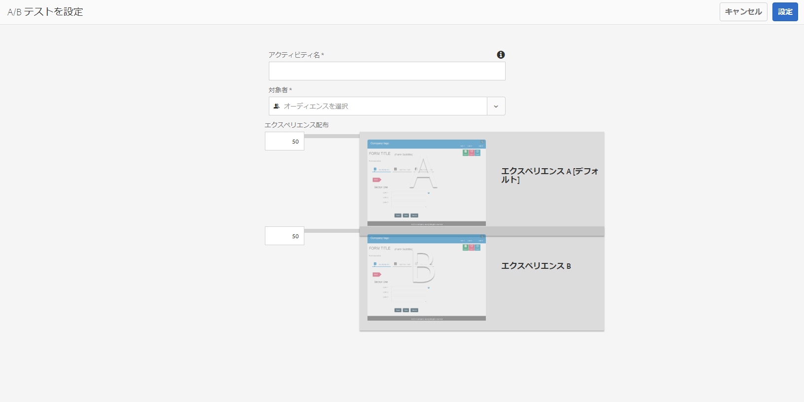

# アダプティブフォームの A/B テストの作成と管理{#create-and-manage-a-b-test-for-adaptive-forms}

## 概要 {#overview-br}

顧客は、フォームのエクスペリエンスに魅力がない場合、フォームを放棄してしまいます。また、フォームが顧客にとって使いにくい場合は、サポート量が増加し組織のコストが膨らむことになります。コンバージョン率を向上させる顧客体験を正しく認識して提供することは、難題であると同時に非常に重要です。この問題を解決する鍵は Adobe Experience Manager Forms にあります。

AEM Forms は Adobe Marketing Cloud ソリューションである Adobe Target と統合することで、個々の顧客に対応した魅力的な顧客体験を、複数のデジタルチャネルにわたって提供します。Target の主な機能の一つである A/B テストを使用すると、同時 A/B テストを簡単に設定し、対象ユーザーに関連するコンテンツを表示して、コンバージョン率を向上させるエクスペリエンスを特定することができます。

AEM Forms により、リアルタイムでアダプティブフォーム上に A/B テストを設定し、実行することが可能です。また、事前設定されているカスタマイズ可能なレポート機能で、フォームのエクスペリエンスのリアルタイムなパフォーマンスを可視化し、ユーザーの利用状況とコンバージョンを最大限に高めるエクスペリエンスを特定します。

## AEM Forms での Target の設定と統合  {#set-up-and-integrate-target-in-aem-forms}

アダプティブフォームで A/B テストを作成および分析する前に、Target サーバーを設定し、AEM Forms に統合する必要があります。

### Target の設定  {#set-up-target}

AEM を Target と統合するには、有効な Adobe Target のアカウントを保有していることを確認してください。Adobe Target に登録すると、クライアントコードを受け取ります。クライアントコード、Target アカウントに関連付けられた電子メール、AEM と Target を接続するパスワードが必要です。

クライアントコードは Adobe Target の顧客アカウントを識別するもので、Adobe Target サーバーの呼び出し時に URL 内のサブドメインとして使用されます。開始する前に、この資格情報で [/](https://testandtarget.omniture.com/)https://testandtarget.omniture.com/ にログインできるか確認してください。

### AEM Forms に Target を統合  {#integrate-target-in-aem-forms}

実行中の Target サーバーを AEM Forms と統合するには、次の手順を実行します。

1. AEMサーバーで、https://&lt;*hostname*:&lt;*port*/libs/cq/core/content/tools/cloudservices.htmlに移動します。

1. **Adobe Target** セクションで、「**設定を表示**」をクリックし、「**+**」アイコンをクリックして新しい設定を追加します。初回にターゲットを設定する場合は、「**今すぐ設定**」をクリックします。

1. 設定を作成ダイアログで、設定の「**タイトル**」と「**名前**」を指定します。

1. 「**作成**」をクリックします。コンポーネントを編集ダイアログが開きます。
1. Target アカウントの詳細に、クライアントコード、電子メール、パスワードなどを指定します。
1. API タイプドロップダウンリストから「**Rest**」を選択します。

1. 「**Adobe Target に接続**」をクリックして、Target の接続を開始します。接続に成功すると、「接続に成功しました」というメッセージが表示されます。メッセージの「**OK**」をクリックして、ダイアログの「**OK**」をクリックします。Target アカウントが設定されます。

1. Target フレームワークの作成については、「[フレームワークの追加](/help/sites-administering/target.md)」の説明に従ってください。

1. https://&lt;*hostname*>:&lt;*port*/system/console/configMgrに移動します。

1. 「**AEM Forms Target の設定**」をクリックします。
1. **Target フレームワーク**&#x200B;を選択します。
1. 「**Target URL**」フィールドで、A/B テストを実行するすべての URL を指定します。例えば、OSGiのAEM Formsサーバーの場合はhttps://&lt;*hostname*:&lt;*port*/、JEEのAEM Formsサーバーの場合はhttps://&lt;*hostname*:*port*/lc/です。
パブリッシュインスタンスに Target URL を設定し、顧客がホスト名または IP アドレスを使用してアクセスできるようにする場合、ホスト名を使用した Target URL と IP アドレスの両方を設定する必要があります。URL のいずれか 1 つのみを設定する場合、その A/B テストは別の URL からの顧客には実行されません。「**+**」をクリックして複数の URL を指定します。 

1. 「**保存**」をクリックします。

Target サーバーが AEM Forms と統合されます。Adobe Target を使用するための完全なライセンスがある場合、A/B テストを有効にできるようになりました。

Adobe Target を使用するための完全なライセンスがある場合、Target を AEM Forms と統合後、以下のパラメーターを使用してサーバーを起動します。

`parameter -Dabtesting.enabled=true java -Xmx2048m -XX:MaxPermSize=512M -jar -Dabtesting.enabled=true`

AEM インスタンスが `jboss\bin\standalone.conf.bat` ファイルで JBoss 上のサービスとして自動的に起動され、実行されている場合は、以下のエントリに -Dabtesting.enabled=true パラメーターを追加します。

`set "JAVA_OPTS=%JAVA_OPTS% -Dadobeidp.serverName=server1 -Dfile.encoding=utf8 -Djava.net.preferIPv4Stack=true -Dabtesting.enabled=true"`

JBoss サーバーに加えて、アプリケーションサーバーのサーバー起動スクリプトにも -Dabtesting.enabled=true jvm 引数を追加できます。これで、A/B テストをアダプティブフォームに作成または実行することができます。

>[!NOTE]
>
>設定した Target URL をあとで更新する場合、実行中の A/B テストを必ず更新し、現在の URL が指定されるようにしてください。A/B テストの更新について詳しくは、[A/B テストを更新](/help/forms/using/ab-testing-adaptive-forms.md#p-update-a-b-test-p)を参照してください。

## AEM 内でのオーディエンスの作成  {#create-audiences-within-aem}

AEM では、オーディエンスを作成し、それを A/B テストで使用できます。AEM 内で作成したオーディエンスは AEM Forms 内で使用できます。次の手順を実行して、AEM 内でオーディエンスを作成します。

1. オーサリングインスタンスで、**Adobe Experience Manager**/**パーソナライゼーション**/**オーディエンス**&#x200B;をタップします。

1. オーディエンスページで、**オーディエンスを作成／ターゲットオーディエンスを作成**&#x200B;をタップします。
1. [Adobe Target設定]ダイアログで、ターゲット設定を選択し、[**OK**]をクリックします。
1. 新しいオーディエンスを作成ページで、ルールを作成します。ルールを使用すると、オーディエンスを分類できます。例えば、オペレーティングシステムに基づいてオーディエンスを分類できます。オーディエンス A は Windows から、オーディエンス B は Linux から来ています。

   1. Windowsに基づいてオーディエンスを分類するには、ルール#1で、**OS**&#x200B;属性タイプを選択します。 「日時」ドロップダウンから、「**ウィンドウ」を選択します。**

   1. Linuxに基づいてオーディエンスを分類するには、ルール#2で、**OS**&#x200B;属性タイプを選択します。 「**日時**」ドロップダウンから「**Linux**」を選択し、「**次へ**」をクリックします。

1. 作成したオーディエンスの名前を指定し、「**保存**」をクリックします。

以下に示すように、フォームに対して A/B テストを設定するときにオーディエンスを選択できます。

## A/B テストの作成  {#create-a-b-test}

次の手順を実行して、アダプティブフォームのA/Bテストを作成します。

1. https://&lt;*hostname*:&lt;*port*/aem/forms.html/content/dam/formsanddocumentsの&#x200B;**Forms&amp;ドキュメント**&#x200B;に移動します。

1. アダプティブフォームを含むフォルダーに移動します。
1. ツールバーの「**選択**」ツールをクリックして、アダプティブフォームを選択します。
1. ツールバーの「**その他**」をクリックし、「**A/B テストを設定**」を選択します。「A/B テストを設定」ページが開きます。

1. A/B テストの「**アクティビティ名**」を指定します。 

1. オーディエンスドロップダウンリストから、そのフォームの異なるエクスペリエンスを提供する対象オーディエンスを選択します。例えば、**Chrome を使用している訪問者**&#x200B;を選択します。対象者のリストは、設定された Target サーバーから作成します。 

1. エクスペリエンス A および B に対する&#x200B;**エクスペリエンス配布**&#x200B;フィールドで、パーセンテージの見地から配信内容を指定し、全オーディエンス間のエクスペリエンスの配信を決定します。例えば、エクスペリエンス A および B に対してそれぞれ 40、60 を指定すると、エクスペリエンス A はオーディエンスの 40 % に配布され、残りの 60 % にはエクスペリエンス B が表示されます。
1. 「**設定**」をクリックします。A/B テストの作成を確認するダイアログが表示されます。
1. 「**エクスぺリンス B を編集**」をクリックして、アダプティブフォームを編集モードで開きます。フォームを修正し、デフォルトのエクスペリエンス A とは異なるエクスペリエンスを作成します。エクスペリエンス B で変更可能な箇所は、次のとおりです。

   * CSS またはスタイル設定
   * 異なるパネルまたは同じパネルのフィールドの順番
   * パネルレイアウト
   * パネルタイトル
   * フィールドの記述、ラベル、ヘルプテキスト
   * 送信フローに影響したり送信フローを中断したりすることのないスクリプト
   * 検証（クライアント側とサーバー側の両方）
   * エクスペリエンス B のテーマ。（エクスペリエンス B に対して別のテーマを選択できます）

1. 「フォームとドキュメント」 UI へ進み、アダプティブフォームを選択し、「**その他**」をクリックして、「**A/B テストを開始**」を選択します。

A/B テストが実行され、指定された対象者に、設定された配分に基づいてランダムにエクスペリエンスが提供されます。

## A/B テストの更新  {#update-a-b-test}

実行中の A/B テストのオーディエンスとエクスペリエンスの配布を更新することができます。この作業を行うには：

1. フォームとドキュメント UI で、A/B テストを実行しているアダプティブフォームを含むフォルダに移動します。
1. アダプティブフォームを選択します。
1. 「**その他**」をクリックして「**A/B テストを編集**」を選択します。「A/B テストを更新」ページが開きます。 

1. 必要に応じて対象者とエクスペリエンスの配布を更新します。
1. 「**更新**」をクリックします。

## A/B テストレポートの表示と分析 {#view-and-analyze-a-b-test-report}

A/B テストを目的の期間実行すると、レポートを生成してどちらのエクスペリエンスのコンバージョン率が高いか、結果を確認することができます。結果が良い方のエクスペリエンスを推奨結果として宣言するか、または別の A/B テストを実行する選択もできます。これには、次の手順を実行します。

1. アダプティブフォームを選択し、「**その他**」をクリックしてから、「**A/B テストレポート**」をクリックします。レポートが表示されます。

1. レポートを分析して、結果が良い方のエクスペリエンスを推奨結果として宣言するのに十分なデータポイントが得られていることを確認します。同じ A/B テストをさらに時間をかけて継続する、または推奨結果を宣言する、あるいはA/B テストを終了するかを選択できます。 
1. 推奨結果を宣言し A/B テストを終了するには、レポートダッシュボードの「**A/B テストを終了**」ボタンをクリックします。2 つのエクスペリエンスの一方を推奨結果として宣言するように求めるダイアログが表示されます。推奨結果を選択し、A/B テストの終了を確認します。別の方法として、それぞれのエクスペリエンスで「**推奨結果を宣言**」ボタンをクリックして最初に推奨結果を宣言することができます。推奨結果の確認を求めるプロンプトが表示されます。「**はい**」をクリックして A/B テストを終了します。 

エクスペリエンス A を推奨結果として選択した場合、A/B テストの終了後は、エクスペリエンス A のみがすべての対象者に配布されます。
