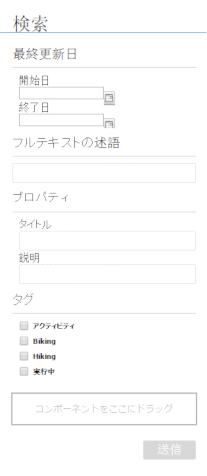
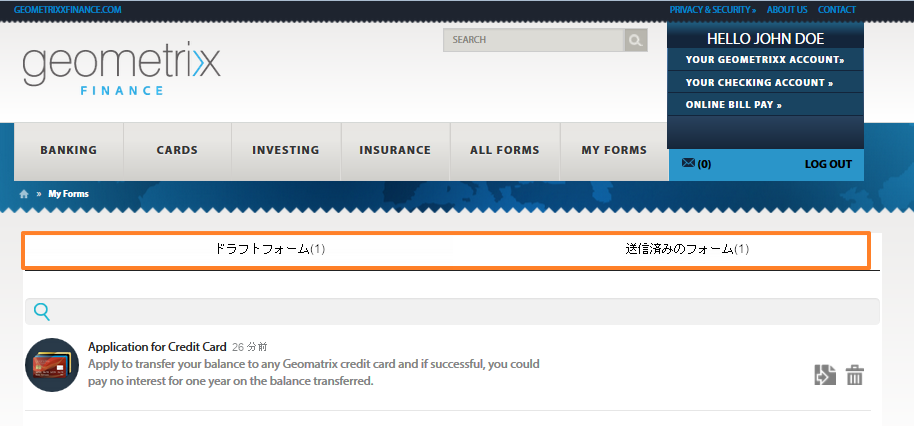
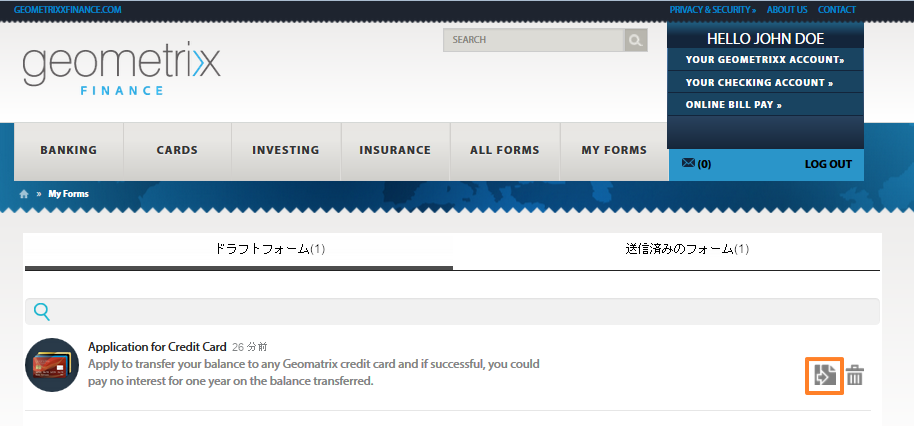

# 発行済みフォームへのアクセスと入力{#accessing-and-filling-published-forms}

フォーム中心のポータル展開設定では、フォームの開発とポータルの開発が2つの異なるアクティビティです。フォーム開発者がフォームを設計してリポジトリに保存する一方で、Web 開発者が Web アプリケーションを作成してフォームを一覧表示し、送信を処理します。フォームリポジトリと Web アプリケーションの間で通信が行われないため、フォームは Web層にコピーされます。

これが設定管理および実稼働の遅延につながることがよくあります。例えば、リポジトリで新しいバージョンのフォームを利用できる場合、フォーム開発者は、Web層でフォームを置換し、Webアプリケーションを変更し、公共サイトでフォームを再展開します。Webアプリケーションの再展開によって、サーバーのダウンタイムが発生する可能性があります。サーバーのダウンタイムは計画的に行われるため、変更を瞬時に公共サイトにプッシュすることはできません。

フォームポータルでは、管理のオーバーヘッドと実稼働の遅延が低減されます。このパッケージでは、Web 開発者に Adobe Experience Manager（AEM）を使用して作成された Web サイトでフォームポータルを作成してカスタマイズするためのコンポーネントが支給されます。

フォームポータルおよびその機能について詳しくは、「[ポータルでのフォーム発行の概要](/help/forms/using/introduction-publishing-forms.md)」を参照してください。

## フォームポータルの概要 {#getting-started-with-forms-portal}

発行済みのフォームポータルページに移動します。フォームポータルページの作成について詳しくは、「[フォームポータルページの作成](../../forms/using/creating-form-portal-page.md)」を参照してください。

フォームポータルの Search &amp; Lister コンポーネントは、AEM サーバーの公開インスタンス上で利用可能なフォームを表示します。このリストには、すべてのフォームまたはフォームポータルページの作成時のフィルターで定義されたフォームが含まれています。次の画像が示すように、フォームポータルページは似ています。

フォームポータルページのサンプル

### Search &amp; Lister {#search-and-lister}

Search &amp; Lister コンポーネントでは、次の機能をフォームポータルに追加することができます。

* パネル表示、カード表示、またはグリッド表示をリストする。また、Forms Manager 内の特定フォルダーのカスタムのテンプレートリストフォームもサポートします。
* フォームのレンダリング方法として、「HTML5」、「PDF」、または「両方」を指定する。
* PDF および XFA-forms のレンダリング方法として、「HTML5」、「PDF」、または「両方」を指定する。HTML5としてのNon-XFAフォーム
* 検索条件（例えば、フォームプロパティ、メタデータ、タグ）に基づいたフォームの検索を有効にする。
* フォームデータをサーブレットに送信する。
* カスタムスタイルシートを使用して、ルック＆フィールをカスタマイズすることができます。
* フォームへのリンクを作成する。

次のオプションを使用して、フォームポータルページで、フォームを検索することができます。

* フルテキスト検索
* 詳細検索

フルテキスト検索では、特定のキーワードに基づいて find &amp; list forms を検索することができます。

「詳細設定」ダイアログ

「詳細設定」では、特定フォームのプロパティに基づいてフォームを検索することができます。これにより、フルテキスト検索よりもさらに絞り込むことができます。「詳細検索」には、タグ、プロパティ（作成者、説明、タイトルなど）、修正日、フルテキストに基づいた検索が含まれています。

リスターは、検索パラメーターに基づいたフォームを表示します。検索結果内の各フォームは、関連フォームへのハイパーリンク付きのアイコンで表示されます。アイコンをクリックして開き、関連フォームを使用します。

### フォームへの入力  {#filling-a-form}

アダプティブフォームのサンプル

フォームは、そのページの Search &amp; Lister コンポーネント内のフォームと共に指定されたリンクからアクセスできます。

各フォームには、ユーザーがフォームに入力できるようにするヘルプ情報が含まれています。

#### ドラフト &amp; 送信  {#drafts-and-submission}

ユーザーは、オプションとして保存ボタンをクリックすることでフォームのドラフトを保存することができます。これによって、ユーザーは、フォームを送信するまでの一定期間、フォームで作業することができます。

フォームに入力されたデータ（添付ファイルを含む）は、ドラフトとしてサーバーに保存されます。フォームのドラフトは、何度でも保存することができます。保存されたフォームは、そのページのドラフト &amp; 送信コンポーネントの「ドラフト」タブに表示されます。

フォーム入力が完成すると、ユーザーは、フォーム上の送信ボタンをクリックしてフォームを送信します。送信済みのフォームは、そのページのドラフト &amp; 送信コンポーネントの「送信」タブに表示されます。

>[!NOTE]
>
>送信済みのフォームは、アダプティブフォームの送信アクションがFormsポータル送信アクションとして設定されている場合にのみ、「送信済みのForms」タブに表示されます。 送信アクションについて詳しくは、「[送信アクションの設定](../../forms/using/configuring-submit-actions.md)」を参照してください。

ドラフト&amp;送信コンポーネント:

## 送信済みフォームのデータを使用して新規フォームを開始 {#start-a-new-form-using-submitted-form-data}

かなり頻繁に入力および送信する必要があるフォームがあります。例えば、個人の納税申告のためのフォームは、毎年提出しなければなりません。このような場合、ごく一部の情報が記入する度に変わる一方、個人情報や家族に関する情報などの大部分の情報は変わりません。ただし、最初からフォーム全体の入力を行う必要はあります。

AEM Forms は、フォーム入力の作業を最適化する上で役立ち、フォームを再度入力および送信する際にかかる時間を大幅に削減します。エンドユーザーは、送信済みフォームのデータを使用して新規のフォームを開始することができます。この機能は[ドラフト &amp; 送信コンポーネント](../../forms/using/draft-submission-component.md)に組み込まれています。フォームポータルのページにドラフト &amp; 送信コンポーネントを追加して公開すると、送信済みフォームのデータを使用して新しいフォームを開始するオプションが、「送信済みのフォーム」タブと「ドラフトフォーム」タブに表示されます。次の画像は、そのオプションに焦点を当てています。

新規のフォームを開始するためにボタンをクリックすると、対応する送信済みフォームから新規フォームが開きます。これで、必要に応じてレビューおよびアップデートして、フォームを送信することができるようになりました。
