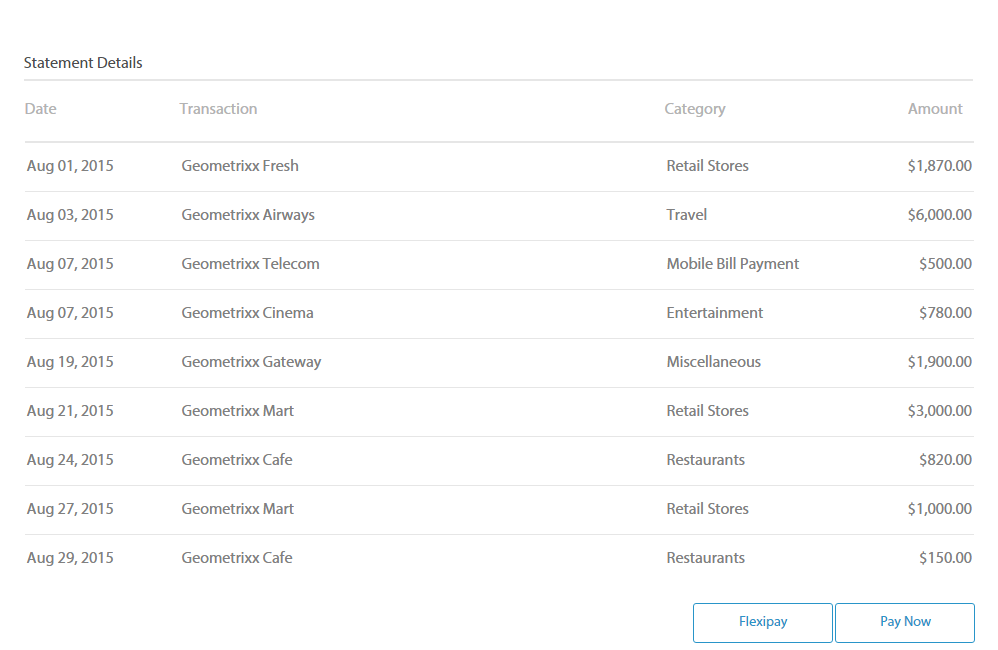

# アダプティブフォームのグラフ {#af-charts}


表やグラフはデータを視覚的に示す表示域です。大量の情報を分かりやすい視覚的形式で要約し、複雑なデータの視覚化、解釈、分析を改善できます。
AEM Formsアドオンパッケージには、すぐに使用できるグラフコンポーネントが用意されています。 アダプティブフォームとドキュメント内でを使用して、 **繰り返し可能なパネル** および **テーブル**. グラフコンポーネントを使用すると、次のタイプのグラフを追加および設定できます。

1. 円グラフ
1. 列
1. ドーナツグラフ
1. 棒グラフ
1. 線
1. 線とポイント
1. ポイント
1. 領域

グラフコンポーネントは、グラフ上の値を計算およびプロットするための組み込みの統計関数 (sum、mean、maximum、minimum、mode、median、range、frequency) をサポートし、提供します。 すぐに使用できる関数に加え、独自のカスタム関数を作成して、グラフで使用できるようにすることができます。

次に、グラフコンポーネントを追加して設定する方法を見てみましょう。

## グラフを追加 {#add-chart}

グラフコンポーネントは、デフォルトではAEMのサイドバーで使用できます。 グラフコンポーネントは、オーサリングモードでAEMのサイドバーからアダプティブフォームまたはアダプティブドキュメントにドラッグ&amp;ドロップできます。 このコンポーネントをドロップすると、グラフのプレースホルダーが作成されます。

## グラフを設定 {#configure-chart}

>[!NOTE]
> 
> グラフを設定する前に、グラフを設定するパネルまたはテーブル行が繰り返し可能に設定されていることを確認してください。 繰り返し可能なパネルまたはテーブル行の最小数と最大数は、コンポーネントを編集ダイアログの「繰り返し設定」タブで指定できます。

グラフを設定するには、グラフコンポーネントをクリックし、  をクリックして、[ グラフの編集 ] ダイアログを開きます。 このダイアログには、グラフを設定できる「タイトルとテキスト」、「設定」、「詳細設定」オプション、「スタイル設定」タブが含まれています。

### 基本 {#basic}

「基本」タブで、次のプロパティを設定できます。


* **要素名**:JCR コンテンツ構造内のグラフ要素の識別子。 グラフには表示されませんが、他のコンポーネント、スクリプト、SOM 式から要素を参照する際に役立ちます。
* **グラフのタイプ**：生成するグラフのタイプを指定します。 使用可能なオプションは、円グラフ、ドーナツグラフ、棒グラフ、列グラフ、線グラフ、線とポイントグラフ、ポイントグラフ、面グラフです。 この例では、グラフのタイプは列です。
* **データソースの行名またはパネル名を繰り返しています**：データのソースとなるテーブル行または繰り返し可能なパネルの要素名を指定します。 この例では、 statementDetails は、 Statement Details テーブル内の繰り返し可能な行の要素名です。
* **X 軸/タイトル**:X 軸のタイトルを指定します。 この例では、X 軸のタイトルは Category です。
* **X 軸/フィールド**:X 軸にプロットするフィールド（またはテーブル内のセル）の要素名を指定します。 この例では、X 軸に categories が設定されています。 例のテーブルの Category 列にあるテーブルセルの要素名は category です。
* **X 軸/関数を使用**:X 軸の値の計算に使用する統計関数を指定します。 この例では、「なし」が選択されています。 関数の詳細については、「グラフで関数を使用する」を参照してください。
* **Y 軸/タイトル**:Y 軸のタイトルを指定します。 この例では、Y 軸のタイトルは Expense です。
* **Y 軸/フィールド**:Y 軸にプロットするフィールド（またはテーブル内のセル）の要素名を指定します。 この例では、Y 軸に amount を設定します。 例のテーブルの Amount 列にあるテーブルセルの要素名は amount です。
* **Y 軸/関数を使用**:Y 軸の値の計算に使用する統計関数を指定します。 この例では、各カテゴリに費やした金額が追加され、計算された値が Y 軸にプロットされます。 したがって、関数を使用ドロップダウンリストから「合計」を選択します。 関数の詳細については、「グラフで関数を使用する」を参照してください。
* **凡例の位置**：グラフを基準とした凡例の位置を指定します。 使用可能なオプションは、「右」、「左」、「上」、「下」です。
* **凡例を表示**：有効な場合に、グラフの凡例を表示します。
* **ツールチップ**：グラフ内のデータポイントにマウスを置くと表示されるツールヒントの形式を指定します。 デフォルト値は **\${x}(\${y})**. グラフの種類に応じて、グラフ内のポイント、棒、またはスライスにマウスを置くと、変数が表示されます **\${x}** および **\${y}** は、X 軸と Y 軸の対応する値に動的に置き換えられ、ツールチップに表示されます。 次の例に示すように、ツールチップは次のように表示されます。 **小売店 (5870)** Retails Stores 列にマウスを置くとき。 ツールチップを無効にするには、ツールチップフィールドを空白のままにします。 このオプションは、折れ線グラフと面グラフには適用されません。
* **グラフ固有の設定**：一般的な設定に加えて、次のグラフ固有の設定を使用できます。
* **内半径**：ドーナツグラフで使用でき、グラフ内の内側の円の半径（ピクセル単位）を指定できます。
* **線の色**：折れ線グラフ、折れ線グラフ、ポイントグラフ、面グラフで使用でき、グラフ内の線の色を 16 進値で指定できます。
* **ポイントの色**：ポイントグラフと折れ線グラフおよびポイントグラフで使用でき、グラフ内のポイントの色を 16 進値で指定できます。
* **領域の色**：面グラフで使用でき、グラフの線の下の領域の色の 16 進値を指定します。
* **CSS クラス**:CSS クラスの名前を「 CSS クラス」フィールドに指定し、グラフにカスタムスタイルを適用します。

### 設定 {#configuration}

「基本」タブでは、グラフの種類、データを含むソースパネルまたはテーブル行、グラフの X 軸と Y 軸にプロットする値、およびオプションでグラフにプロットする値を計算する統計関数を定義します。

クレジットカード明細の繰り返し可能な表の例を参考に、このタブに表示される情報について詳しく説明します。 次に示すように、クレジットカード明細の明細の詳細セクションで、様々なカテゴリの総費用を示し、関連付けるグラフを生成するとします。

これを行うには、X 軸にカテゴリをプロットし、Y 軸に各カテゴリの総支出をプロットする必要があります。



この例で使用されているクレジットカード明細はアダプティブフォームドキュメントで、明細の詳細セクションは表です。この表は、オーサリングモードでは次のように表示されます。


次に、グラフを生成するための要件と条件を考えてみましょう。

* このグラフには、「明細の詳細」テーブルの各カテゴリの合計費用が表示されます。
* グラフのタイプは列ですが、必要に応じて他のグラフのタイプも選択できます。
* Statement Details テーブルの Table 行は繰り返し可能です。 これは、テーブル行プロパティの「設定を繰り返し」フィールドで設定できます。
* 行の要素名は「Statement Details」です。 これは、テーブル行のプロパティで設定できます。
* Category 列のテーブルセルの要素名は category です。 インラインで指定できます。 セルを選択し、編集ボタンをタップします。
* Amount 列のテーブルセルの要素名は amount です。 また、Amount 列のテーブルセルは数値ボックスです。
* 指定した設定を使用すると、例の列グラフは次のように表示されます。 各色はカテゴリを表し、カテゴリの個々の行項目または金額がグラフに追加されます。

  

凡例とツールヒントは次のように表示されます。


### スタイル設定 {#styling}

スタイルモードでは、グラフの幅を、フォームまたはドキュメントで使用可能な全幅に対する割合で設定し、高さをピクセル単位で設定できます。 その他のオプションには、テキスト、背景、境界線、効果、CSS 上書きなどがあります。

スタイルモードに切り替えるには、ページツールバーで次の手順を実行します。 **タップ >> スタイル**.


## グラフで関数を使用 {#use-functions}

統計関数を使用するようにグラフを設定し、ソースデータの値を計算して、グラフにプロットすることができます。グラフコンポーネントには組み込み関数がいくつかありますが、独自の関数を記述し、グラフの設定で使用できるようにすることができます。

>[!NOTE]
>
> 関数を使用して、グラフの X 軸または Y 軸の値を計算できます。

### デフォルトの関数 {#default-functions}

デフォルトでは、以下の関数をグラフコンポーネントに使用できます。

* **平均（平均）**：他の軸にある特定の値の X 軸または Y 軸の値の平均を戻します。
* **合計**：他の軸にある特定の値の X 軸または Y 軸のすべての値の合計を戻します。
* **最大**：他の軸にある特定の値の X 軸または Y 軸の最大値を戻します。
* **頻度**：他の軸にある特定の値の X 軸または Y 軸の値の数を戻します。
* **範囲**：他の軸にある特定の値の X 軸または Y 軸の最大値と最小値の差を戻します。
* **中央値**：他の軸にある特定の値の、X 軸または Y 軸の上半分の値を区切る値を戻します。
* **最小**：他の軸にある特定の値の X 軸または Y 軸の最小値を戻します。
* **モード**：他の軸にある特定の値の X 軸または Y 軸で最も多く出現する値を戻します

### カスタム関数 {#custom-functions}

グラフでデフォルトの関数を使用する以外に、 [カスタム関数](/help/forms/using/rule-editor.md#custom-functions-in-rule-editor-custom-functions) JavaScript で使用できるようにし、グラフコンポーネントの関数のリストで使用できるようにします。

関数は入力された配列または値とカテゴリ名を使用して、値を返します。例：

```
Multiply(valueArray, category) {
    var val = 1;
    _.each(valueArray, function(value) {
        val = val * value;
    });
    return val;
}
```

カスタム関数を作成したら、次の手順を実行して、グラフの設定で使用できるようにします。

1. アダプティブフォームまたはアダプティブドキュメントに関連付けられたクライアントライブラリにカスタム関数を追加します。
1. CRXDE Liteで、次のプロパティを持つ nt:unstructured ノードを apps フォルダーに作成します。
   * guideComponentType を fd/af/reducer に設定します。 (mandatory)
   * カスタム JavaScript 関数の完全修飾名に値を設定します。 (mandatory)
   * jcr:description を意味のある名前に設定します。 これは、 **関数を使用** 」ドロップダウンリストから選択できます。 例えば、**Multiply** と表示されます。
   * qtip に関数の短い説明を設定します。 「関数を使用」ドロップダウンリストで関数名の上にマウスポインターを置くと、ツールチップとして表示されます。
   * 「**すべて保存**」をクリックして設定を保存します。
   * これで関数をグラフで使用できるようになります。


## グラフの自動更新 {#auto-refresh-chart}

ユーザーが次のいずれかの操作を行うと、グラフは自動的に更新されます。
* データソースパネルまたはテーブル行のインスタンスを追加または削除します。
* データソースパネルまたはテーブル行の X 軸または Y 軸にプロットされる値を変更します。
* グラフのタイプを変更します。

## アダプティブフォームのルールでグラフタイプを使用する {#chart-in-rules}

chartType プロパティは、グラフのタイプを指定します。 指定できる値は、円グラフ、ドーナツグラフ、棒グラフ、線グラフ、線分、点、面グラフです。 これはスクリプト可能なプロパティで、 [アダプティブフォームルール](/help/forms/using/rule-editor.md) を使用して、グラフの設定を操作します。 例を参考にして理解してみましょう。

列グラフを設定したとします。 ただし、ユーザーが別の種類のグラフをドロップダウンリストから選択して再描画するオプションを提供する必要もあります。 これは、次のように、ルールで chartType プロパティを使用して実現できます。

1. アダプティブフォームのAEMサイドバーからドロップダウンリストコンポーネントをドラッグ&amp;ドロップします。
1. コンポーネントを選択し、 .
1. ドロップダウンリストのタイトルを指定します。 例えば、グラフのタイプを選択します。
1. 「項目」セクションに、サポートされているグラフタイプを追加して、ドロップダウンリストに表示します。 「**完了**」をクリックします。
   

1. ドロップダウンコンポーネントを選択し、をタップします。 . ルールエディターで、次に示すように、ルールをビジュアルルールエディターに記述します。
   

   この例では、グラフコンポーネントの要素名は **myChart**.

   または、コードエディターで次のルールを記述できます。

   

   ルールの作成について詳しくは、 [ルールエディター](/help/forms/using/rule-editor.md)

1. 「完了」をクリックして、ルールを保存します。

これで、ドロップダウンリストからグラフの種類を選択し、「更新」をクリックしてグラフを再描画できます。
