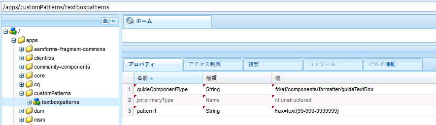

# アダプティブフォームの数式{#adaptive-form-expressions}

アダプティブフォームは、ダイナミックなスクリプト機能によってエンドユーザーのフォームへの入力作業を最適化および簡素化します。式を作成して、ダイナミックなフィールドやパネルの表示/非表示など、様々な動作を追加できます。 また、計算指標フィールドの追加、フィールドの読み取り専用化、検証ロジックの追加などを行うこともできます。 動的動作は、ユーザー入力や事前入力に基づいています。

アダプティブフォームの式言語はJavascriptです。すべての数式は有効なJavaScriptの数式で、アダプティブフォームのスクリプトモデルAPIを使用しています。これらの数式は、特定のタイプの値を返します。アダプティブフォームクラス、イベント、オブジェクト、パブリック API の完全なリストについては、「[アダプティブフォームの JavaScript ライブラリ API リファレンス](https://helpx.adobe.com/aem-forms/6/javascript-api/index.html)」を参照してください。

## 式を記述するためのベストプラクティス {#best-practices-for-writing-expressions}

* 式を記述したり、フィールドやパネルにアクセスしたりする場合は、フィールド名またはパネル名を使用します。フィールドの値にアクセスするには、valueプロパティを使用します。例：`field1.value`
* フォーム間でフィールド名およびパネル名には一意の名前を付けてください。式を記述する場合に使用されているフィールド名を使用すると競合を回避しやすくなります。
* 複数行にわたる式を記述する場合、セミコロンを使用して分を終了します。

## 繰り返しパネルを含む式のベストプラクティス {#best-practices-for-expressions-involving-repeating-panel}

繰り返しパネルは、スクリプティングAPIまたは事前に入力されたデータを使用して追加または削除されたインスタンスのパネルです。繰り返しパネルの使用に関して詳しくは、[繰り返し可能なセクションでのフォーム作成](/help/forms/using/creating-forms-repeatable-sections.md)を参照してください。

* 繰り返しパネルを作成するためには、パネルダイアログで設定を開きます。そして最大カウントの値を1以上に設定します。
* 繰り返しパネル設定の最小カウントの値は、一つ以上設定することが可能ですが、最大値を超えてはなりません。
* 式が繰り返しパネルのフィールドを参照する場合、その式のフィールド名は一番近い繰り返し要素に解決されます。
* アダプティブフォームには、合計、カウント、最小値、最大値、フィルター等の繰り返しパネルの計算を簡素化するためのいくつかの特別な機能があります。全機能のリストについては、[JavaScript ライブラリアダプティブフォームのAPI リファレンス](https://helpx.adobe.com/aem-forms/6/javascript-api/af.html)を参照してください。
* 繰り返しパネルのインスタンスを操作するためのAPIは：

   * To add a panel instance: `panel1.instanceManager.addInstance()`
   * To get a panel repeat index: `panel1.instanceIndex`
   * パネルのinstanceManagerを取得するには： `_panel1 or panel1.instanceManager`
   * To remove an instance of a panel: `_panel1.removeInstance(panel1.instanceIndex)`

## 式のタイプ {#expression-types}

アダプティブフォームでは、式を記述して、ダイナミックなフィールドやパネルの表示/非表示などの動作を追加できます。 また、式を記述して、計算指標フィールドを追加したり、フィールドを読み取り専用にしたり、検証ロジックを追加したりすることもできます。 アダプティブフォームは次の数式をサポートします:

* **[アクセス数式](#access-expression-enablement-expression)**：フィールドを有効化/無効化します。
* **[数式の計算](#calculate-expression)**：フィールドの値を自動計算します。
* **[式](#click-expression)**: をクリックして、ボタンのクリックイベント上の操作を処理します。
* **[初期化スクリプト](#initialization-script)：**フィールドの初期化で操作を実行します。
* **[オプション式](#options-expression)**：ドロップダウンリストを動的に埋めます。
* **[要約式](#summary)**：アコーディオンのタイトルを動的に計算します。
* **[検証数式](#validate-expression)**：フィールドを検証します。
* **[値コミットスクリプト](#value-commit-script):**フィールドの値を変更した後にフォームのコンポーネントを変更する場合。
* **[視認性の数式](#visibility-expression)**：フィールドおよびパネルの視認性をコントロールします。
* **[ステップ完了の式](#step-completion-expression)**: ユーザがウィザードの次のステップに進むのを防ぐ。

### アクセス式(イネーブルメント式) {#access-expression-enablement-expression}

アクセス式を使用してフィールドを有効/無効にできます。式がフィールドの値を使用する場合、フィールドの値が変更されるたびに、式がトリガされます。

**適用性：**&#x200B;フィールド

****&#x200B;戻り値の型 ：数式は、フィールドが有効/無効であることを表すブール値を返します。**trueは**&#x200B;フィールドが有効であることを表し、**falseは**&#x200B;フィールドが無効であることを表します。

**例**: field1 **の値が** Xに設定されている場合にのみフィールドを有効にする場合のアクセス式は次のとおりです ****。 `field1.value == "X"`

### 数式の計算 {#calculate-expression}

数式の計算は、式を使ってフィールドの値を自動計算するのに使用されます。通常、この式には、他のフィールドの値プロパティを使用します。例えば、`field2.value + field3.value` のようになります。Whenever value of the `field2`or `field3`changes, the expression is retriggered and the value is recomputed.

**適用性：**&#x200B;フィールド

**戻り値の型**：数式は、式の結果が表示されるフィールドに対応する値を返します（例えば、小数値）。

**例**: field1内の2つのフィールドの合計を表示するcalculate式 **は** 、次のとおりです。
`field2.value + field3.value`

### クリック式 {#click-expression}

クリック式は、数式をクリック：ボタンのクリックイベント上で実行された操作を処理します。GuideBridgeは、送信や検証などのクリック式と共に使用される様々な機能を実行するためにAPIをデフォルトで提供します。For complete list of the APIs, see [GuideBridge APIs](https://helpx.adobe.com/jp/aem-forms/6/javascript-api/GuideBridge.html).

**適任性**：ボタンフィールド

**戻り値の型**：クリック式は値を返しません。数式が値を返した場合、その値は無視されます。

**例**: テキストボックス **textbox1** を値の **AEM Formsでクリックアクションに埋め込むには、ボタンのクリック式**&#x200B;を次のように指定します。 `textbox1.value="AEM Forms"`

### 初期化スクリプト {#initialization-script}

アダプティブフォームが初期化された場合に、初期化スクリプトがトリガされます。 シナリオに応じて、初期化スクリプトは次の方法で動作します。

* アダプティブフォームが、データの事前入力なしでレンダリングされた場合、初期化スクリプトは、フォームが初期化された後で実行されます。
* アダプティブフォームがデータの事前入力と共にレンダリングされる場合、スクリプトは事前入力操作が完了した後で実行されます。
* アダプティブフォームのサーバー側の再検証がトリガされた場合、初期化スクリプトが実行されます。

**適用先：**&#x200B;フィールドおよびパネル

**戻り値の型：**&#x200B;初期化スクリプトの数式は値を返しません。数式が値を返した場合、その値は無視されます。

**例：** データの事前入力シナリオでは、値がnullとして保存されたときにフィールドにデフォルト値 `'Adaptive Forms'` を入力するため、初期化スクリプトの式は次のようになります。
`if(this.value==null) this.value='Adaptive Forms';`

### オプション式{#options-expression}

オプション式はドロップダウンリストのフィールドをダイナミックに挿入するのに使用されます。

**適用性**：ドロップダウンリストのフィールド

**戻り値の型**：オプション式は文字列値の配列を返します。それぞれの値は&#x200B;**男性**&#x200B;または1=男性などの&#x200B;**キーと値のペアのような単純な文字列である場合があります。**

**例**：別のフィールドの値に基づいてフィールドの値を入力するために、単純なオプション式を提供します。**例えば、別のフィールドの結婚歴の式に基づいて**&#x200B;フィールドに子供の数を入力する場合、**式はこのようになります。**

**`marital_status.value == "married" ? ["1=One", "2=two"] : ["0=Zero"]`.**

結婚歴フィールドの値が変わる場合は、常に式が再トリガされます。**** RESTサービスからドロップダウンを挿入することもできます。詳しくは、「[ドロップダウンの動的な挿入](../../forms/using/dynamically-populate-dropdowns.md)」を参照してください。

### 要約式 {#summary}

要約式はアコーディオンレイアウトパネルの子パネルのタイトルを動的に計算します。要約式はルールで指定できます。タイトルはフォームフィールドまたはカスタムロジックを使用して評価されます。式は、フォームが起動すると実行されます。フォームの事前入力を行っている場合、式は、データが事前入力された後、または式で使用される依存フィールドの値が変更されたときに実行されます。

要約式は通常、アコーディオンレイアウトパネルの子の繰り返し処理に使用され、子パネルごとに意味のあるタイトルを作成します。

**適用先：** レイアウトがアコーディオンとして設定されたパネルの直接の子であるパネル。

**戻り値の型：** 式は、アコーディオンのタイトルになる文字列型(String)の値を返します。

**例：** &quot;口座番号： &quot;+ textbox1.value

### 数式の検証 {#validate-expression}

数式の検証は、特定の数式を使ってフィールドを検証するのに使用されます。通常、このような式では、フィールドの値と共に正規式を使用してフィールドを検証します。 フィールドの値が変更されると、数式はトリガされ、フィールドの検証ステータスは再計算されます。

**適用性：**&#x200B;フィールド

**戻り値の型**: 式は、フィールドの検証ステータスを表すブール型(Boolean)の値を返します。 The value **false** represents that the field is invalid and **true** represents that the field is valid.
**例**：英国の郵便番号を表すフィールドの検証式は次の通りです：

(**this.value** &amp;&amp; `this.value.match(/^(GIR 0AA|[A-Z]{1,2}\d[A-Z0-9]? ?[0-9][A-Z]{2}\s*)$/i) == null) ? false : true`

上記の例において、空でない値がパターンに一致しない場合は、数式は、**そのフィールドが有効でないことを示すために** falseを返します。

>[!NOTE]
>
>必須または必須でないフィールドの検証式を記述する場合、その式はフィールドの視認性ステータスに関わらず評価されます。隠れているフィールドの検証を停止するには、初期化または値コミットスクリプトの検証無効プロパティをtrueに設定します。例：`this.validationsDisabled=true`

### 値コミットスクリプト {#value-commit-script}

値コミットスクリプトがトリガされるのは、次のような場合です。

* ユーザーがUIからフィールドの値を変更した場合。
* 別のフィールドの値が変更されたため、フィールドの値がプログラムによって変更された場合。

**適用先：**&#x200B;フィールド

**戻り値の型：**&#x200B;値コミットスクリプトの数式は値を返しません。数式が値を返した場合、その値は無視されます。

**例：** commit上のフィールドに入力されたアルファベットを大文字を変換する場合に使用される値コミット式は次の通りです：`this.value=this.value.toUpperCase()`

>[!NOTE]
>
>フィールドの値がプログラムによって変更された場合、値コミットスクリプトを無効にすることができます。To do so, go to https://&#39;[server]:[port]&#39;/system/console/configMgr and change **Adaptive Forms Version for Compatibility** to **AEM Forms 6.1**. 以降、値コミットスクリプトは、ユーザーがフィールドの値をUIから変更した場合にのみ実行されます。

### 表示式 {#visibility-expression}

表示式は、フィールド／パネルの視認性を制御するのに使用されます。通常、表示式にはフィールドの値プロパティが使用され、値が変更される度に再トリガされます。

**適任性**：フィールドおよびパネル

****&#x200B;戻り値の型 ：数式は、フィールド/パネルが表示されているか否かを表すブール値を返します。**false** はフィールドまたはパネルが表示されないことを表し、trueはフィールドまたはパネルが表示されることを表します。

**例：**&#x200B;フィールドの値が&#x200B;****&#x200B;男性に&#x200B;**設定された場合のみ表示されるパネルの**&#x200B;表示式は次の通りです：`field1.value == "Male"`1.

### ステップ完了の式 {#step-completion-expression}

ステップ完了の式は、ユーザーがウィザードの次のステップへ進むのを防ぎます。これらの数式は、パネルにウィザードのレイアウト（ワンステップずつ表示するマルチステップフォーム）がある場合に使用されます。ユーザーは、現在のセクションのすべての必須の値が入力され、有効な場合にのみ、次のステップ、パネルまたはサブセクションに移動できます。

**適用性**：ウィザードに設定された項目がレイアウトされたパネル

****&#x200B;戻り値の型 ：数式は、既存のパネルが有効か無効かを表すブール値を返します。**True**&#x200B;は既存のパネルが有効で、ユーザーが次のステップに移動できることを表します。

**例**：様々なパネルに表示されるフォームでは、次のパネルに移動する前に既存のパネルが検証されます。このような場合、ステップ完了の式を使用します。一般的に、これらの数式にはGuildBridge検証APIが使用されます。An example of step completion expression is:
`window.guideBridge.validate([],this.panel.navigationContext.currentItem.somExpression)`

## アダプティブフォームにおける検証 {#validations-in-adaptive-form}

アダプティブフォームにフィールド検証を追加するには複数の方法があります。検証チェックがフィールドに追加された場合、**True**&#x200B;はフィールドに入力された値が有効であることを示します。**False** は、値が無効であることを表します。 フィールドの中または外にタブを付けた場合、エラーメッセージは生成されません。

フィールドに検証を追加する方法：

### 必須 {#required}

コンポーネントの編集ダイアログにおいて、コンポーネントを必須にするには、**TitleとText>Requiredのオプション**&#x200B;を選択します。****&#x200B;また、**適切な必須メッセージ(オプション)**&#x200B;も追加することができます。

### 検証パターン {#validation-patterns}

フィールドにはデフォルトの検証パターンが複数あります。検証パターンを選択するには、**コンポーネントの**&#x200B;編集&#x200B;**ダイアログで、**&#x200B;パターン&#x200B;**セクションを見つけて**&#x200B;パターンを選択します。パターンテキストボックスにおいて、独自のカスタム検証パターンを作成できます。****&#x200B;検証ステータスは、入力されたデータが検証パターンに適応している場合のみTrue **を返し、**&#x200B;それ以外の場合は&#x200B;**False**&#x200B;を返します。独自の検証パターンを書き込むには、「[HTML5 フォームのパターン形式文字列サポート](/help/forms/using/picture-clause-support.md)」を参照してください。

### 検証式 {#validation-expressions}

フィールドの検証は、別のフィールドの式を使って計算することもできます。この数式は、**コンポーネントの編集ダイアログにあるスクリプトタブの検証スクリプトフィールドの中で作成されます。**********&#x200B;フィールドの検証ステータスは、式が返す値によって異なります。 このような数式を作成する方法について詳しくは、「[数式の検証](../../forms/using/adaptive-form-expressions.md#p-validate-expression-p)」を参照してください。

## 追加情報 {#additional-information}

### フィールドの表示形式の使用 {#using-field-display-format}

表示形式は、異なる形式でデータを表示するのに使用されます。例えば、ハイフンが入った電話番号、郵便番号または日付選択を表示するのに、表示形式を使うことができます。表示形式は、**コンポーネントの編集ダイアログにあるパターンセクションから**&#x200B;選択することができます。上記の検証パターンに類似したパターンをカスタムで作成することも可能です。

### GuideBridge - APIとイベント {#guidebridge-apis-and-events}

GuideBridgeは、ブラウザのメモリーモデルにおいてアダプティブフォームを操作するのに使うAPIが集まったものです。Guide Bridge API、クラスメソッド、公開されたイベントに関する詳細の紹介は、[アダプティブフォームの JavaScript ライブラリ API リファレンス](https://helpx.adobe.com/aem-forms/6/javascript-api/)を参照してください。

>[!NOTE]
>
>数式でGuideBridgeイベントリスナーの使用は避けることをお勧めします。

#### 様々な数式におけるGuideBridgeの使用方法 {#guidebridge-usage-in-various-expressions}

* To reset form fields, you can trigger `guideBridge.reset()` API on the click expression of a button. Similarly there is a submit API which can be called as a click expression `guideBridge.submit()`**.**

* You can use the `setFocus()` API to set focus across various fields or panels (for panel focus is set to the first field automatically). `setFocus()`は、パネル間のナビゲーション、前/次のトラバーサル間の移動、特定のフィールドへのフォーカスの設定など、幅広いオプションを提供します。 For example, to move to the next panel, you can use: `guideBridge.setFocus(this.panel.somExpression, 'nextItem').`

* To validate an adaptive form or its specific panels, use `guideBridge.validate(errorList, somExpression).`

#### 数式外でのGuideBridgeの使用{#using-guidebridge-outside-expressions-nbsp}

GuideBridge　APIを数式の外で使用することもできます。例えば、アダプティブフォームをホストしているページHTMLとフォームモデル間の通信を設定するのにGuideBridge APIを使用することができます。さらに、フォームをホストするIframeの親から取得した値を設定できます。

GuideBridge APIを上記の例で使用するには、GuideBridgeのインスタンスを取得します。To capture the instance, listen to `bridgeInitializeStart`event of a `window`object:

```javascript
window.addEventListener("bridgeInitializeStart", function(evnt) {

     // get hold of the guideBridge object

     var gb = evnt.detail.guideBridge;

     //wait for the completion of AF

     gb.connect(function (){

        //this function will be called after Adaptive Form is initialized

     })

})
```

>[!NOTE]
>
>AEMでは、clientLibにコードを記述し、ページに含めることをお勧めします（ページのheader.jspまたはfooter.jsp）

To use GuideBridge after the form is initialized (the `bridgeInitializeComplete` event is dispatched), get the GuideBridge instance using `window.guideBridge`.  APIを使って、`guideBride.isConnected`GuideBridge初期化ステータスを確認することができます。

#### GuideBridgeイベント {#guidebridge-events}

またGuideBridgeは、ホストページ内の外部スクリプトのために特定のイベントも提供します。外部スクリプトは、これらのイベントを聞いて様々な操作を行います。例えば、フォームのユーザー名が変更される場合は、ページのヘッダー部分に表示される名前も常に変更されます。For more details about such events, see [JavaScript Library API reference for adaptive forms](https://helpx.adobe.com/jp/aem-forms/6/javascript-api/GuideBridge.html).

次のコードを使ってハンドラーを登録してください：

```javascript
guideBridge.on("elementValueChanged", function (event, data)  {

      // execute some logic when value of a field is changed

});
```

### フィールドのカスタムパターンの作成 {#creating-custom-patterns-for-a-field}

前述のように、アダプティブフォームでは、作成者が検証または表示形式のパターンを提供することができます。デフォルトパターンの使用に加えて、アダプティブフォームコンポーネントに再利用可能なカスタムパターンを設定することも可能です。例えば、テキストフィールドや数値フィールドを定義できます。 設定が終われば、特定の種類のコンポーネントのすべてのフォームにおいてこれらのパターンを使用することができます。例えば、テキストフィールドのカスタムパターンを作成し、アダプティブフォームのテキストフィールドで使用することができます。 コンポーネントの編集ダイアログでパターンセクションにアクセスすることで、カスタムパターンを選択できます。パターン設定またはフォーマットに関する詳細は、「[HTML5 のパターン形式文字列サポート](/help/forms/using/picture-clause-support.md)」を参照してください。

特定のフィールドタイプのカスタムパターンを作成して、同じ種類のフィールドに再利用するには、次のステップを実行してください。

1. 自分のオーサーインスタンスで CRXDE Lite に移動します。
1. カスタムパターンを管理するためのフォルダーを作成します。アプリケーションディレクトリの下で、sling:folderタイプのノードを作成します。For example, create a node with the name `customPatterns`. Under this node, create another node of type `nt:unstructed` and name it `textboxpatterns`. このノードには、追加しておくとよい様々なカスタムパターンが含まれています。
1. 作成したノードのプロパティタブを開きます。例えば、`textboxpatterns`のプロパティタブを開きます。このノードにプロパティ`guideComponentType`を追加して、その値を&#x200B;*fd/af/components/formatter/guideTextBox*&#x200B;に設定します。

1. このプロパティの値は、パターンを設定するフィールドによって変わります。数値フィールドの`guideComponentType`*プロパティの値は、* fd/af/components/formatter/guideNumericBoxです。The value for the Datepicker field is *fd/af/components/formatter/guideDatepicker*.
``
1. ノードにプロパティを割り当てることで`textboxpatterns`カスタムパターンを追加できます。Add a property with a name (for example `pattern1`), and set its value to the pattern you want to add. For example, add a property `pattern1` with value Fax=text{99-999-9999999}. このパターンは、アダプティブフォームで使用するすべてのテキストボックスで使用できます。

   

   カスタムパターンの作成

