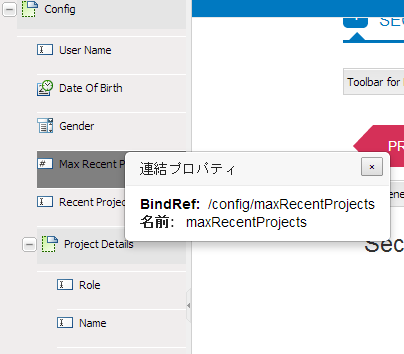

# XML スキーマを使ったアダプティブフォームの作成{#creating-adaptive-forms-using-xml-schema}

## 前提条件 {#prerequisites}

フォームモデルとして XML スキーマを使用してアダプティブフォームをオーサリングする場合、XML スキーマの基本を理解している必要があります。また、この記事を読む前に次のコンテンツを読んでおくことをお勧めします。

* [アダプティブフォームの作成](../../forms/using/creating-adaptive-form.md)
* [XML スキーマ](https://www.w3.org/TR/xmlschema-2/)

## フォームモデルとして XML スキーマを使用 {#using-an-xml-schema-as-form-model}

AEM Forms では、既存の XML スキーマをフォームモデルとして使用したアダプティブフォームの作成がサポートされています。XML スキーマは、組織のバックエンドシステムによりデータの生成や消費が行われる構造を表しています。

XML スキーマの使用の主な特長は、次のとおりです。

* XSD の構造は、アダプティブフォームのオーサリングモードの「コンテンツファインダー」タブでツリーとして表示されます。XSD 階層からアダプティブフォームに要素をドラッグして追加できます。
* 関連付けられたスキーマに準拠する XML を使用して、フォームに事前入力できます。
* ユーザーが入力したデータは、送信時には関連付けられたスキーマに適合する XML として送信されます。

XML スキーマは、単純型要素と複合型要素で構成されています。要素には、その要素にルールを追加する属性が含まれています。これらの要素や属性がアダプティブフォーム上にドラッグされると、自動的に該当するアダプティブフォームコンポーネントにマッピングされます。

この XML 要素とアダプティブフォームコンポーネントのマッピングは、次のように行われます。

<table>
 <tbody>
  <tr>
   <th><strong>XML要素または属性 </strong></th>
   <th><strong>アダプティブフォームコンポーネント</strong></th>
  </tr>
  <tr>
   <td><code>xs:string</code></td>
   <td>テキストボックス</td>
  </tr>
  <tr>
   <td><code>xs:boolean</code></td>
   <td>チェックボックス</td>
  </tr>
  <tr>
   <td>
    <ul>
     <li><code>xs:unsignedInt</code></li>
     <li><code>xs:xs:int</code></li>
     <li><code class="code">xs:decimal
        </code></li>
     <li>すべてのタイプの数値</li>
    </ul> </td>
   <td>数値ボックス</td>
  </tr>
  <tr>
   <td><code>xs:date</code></td>
   <td>日付選択</td>
  </tr>
  <tr>
   <td><code class="code">xs:enumeration
      </code></td>
   <td>ドロップダウン</td>
  </tr>
  <tr>
   <td>任意の複合型要素</td>
   <td>パネル</td>
  </tr>
 </tbody>
</table>

## XML スキーマのサンプル {#sample-xml-schema}

XML スキーマの例を示します。

```xml
<?xml version="1.0" encoding="utf-8" ?>
    <xs:schema targetNamespace="https://adobe.com/sample.xsd"
                    xmlns="https://adobe.com/sample.xsd"
                    xmlns:xs="https://www.w3.org/2001/XMLSchema"
                >

        <xs:element name="sample" type="SampleType"/>

        <xs:complexType name="SampleType">
            <xs:sequence>
                <xs:element name="leaderName" type="xs:string" default="Enter Name"/>
                <xs:element name="assignmentStartBirth" type="xs:date"/>
                <xs:element name="gender" type="GenderEnum"/>
                <xs:element name="noOfProjectsAssigned" type="IntType"/>
                <xs:element name="assignmentDetails" type="AssignmentDetails"
                                            minOccurs="0" maxOccurs="10"/>
            </xs:sequence>
        </xs:complexType>

        <xs:complexType name="AssignmentDetails">
            <xs:attribute name="name" type="xs:string" use="required"/>
            <xs:attribute name="durationOfAssignment" type="xs:unsignedInt" use="required"/>
            <xs:attribute name="numberOfMentees" type="xs:unsignedInt" use="required"/>
             <xs:attribute name="descriptionOfAssignment" type="xs:string" use="required"/>
             <xs:attribute name="financeRelatedProject" type="xs:boolean"/>
       </xs:complexType>
  <xs:simpleType name="IntType">
            <xs:restriction base="xs:int">
            </xs:restriction>
        </xs:simpleType>
  <xs:simpleType name="GenderEnum">
            <xs:restriction base="xs:string">
                <xs:enumeration value="Female"/>
                <xs:enumeration value="Male"/>
            </xs:restriction>
        </xs:simpleType>
    </xs:schema>
```

>[!NOTE]
>
>XML スキーマには root 要素が 1 つだけ含まれていることを確認します。2 つ以上の root 要素を持つ XML スキーマはサポートされていません。

## XML スキーマを使用したフィールドへの特別なプロパティの追加 {#adding-special-properties-to-fields-using-xml-schema}

次の属性を XML スキーマ要素に追加して、関連付けられたアダプティブフォームのフィールドに特別なプロパティを追加できます。

<table>
 <tbody>
  <tr>
   <th><strong>スキーマプロパティ</strong></th>
   <th><strong>アダプティブフォームでの使用</strong></th>
   <th><strong>サポート対象 </strong></th>
  </tr>
  <tr>
   <td><code>use=required </code></td>
   <td>必須フィールドのマーク<br /> </td>
   <td>属性</td>
  </tr>
  <tr>
   <td><code>default="default value"</code></td>
   <td>デフォルト値の追加</td>
   <td>要素および属性</td>
  </tr>
  <tr>
   <td><code>minOccurs="3"</code></td>
   <td><p>最小発生回数の指定</p> <p>（繰り返し可能なサブフォーム（複合型）の場合）</p> </td>
   <td>要素（複合型）</td>
  </tr>
  <tr>
   <td><code class="code">maxOccurs="10"
      </code></td>
   <td><p>最大発生回数の指定</p> <p>（繰り返し可能なサブフォーム（複合型）の場合）</p> </td>
   <td>要素（複合型）</td>
  </tr>
 </tbody>
</table>

>[!NOTE]
>
>スキーマ要素をアダプティブフォームにドラッグすると、デフォルトのキャプションが次の規則に基づいて生成されます。
>
>* 要素名の最初の文字を大文字にします。
>* キャメルケースの単語の境界にスペースを挿入します。

>
>
For example, if you add the `userFirstName` schema element, the caption generated in the adaptive form is `User First Name`.

## アダプティブフォームコンポーネントで許容される値の制限 {#limit-acceptable-values-for-an-adaptive-form-component}

XMLスキーマ要素に次の制限を追加して、アダプティブフォームコンポーネントに許容される値を制限することができます。

<table>
 <tbody>
  <tr>
   <td><p><strong> スキーマプロパティ</strong></p> </td>
   <td><p><strong>データタイプ</strong></p> </td>
   <td><p><strong>説明</strong></p> </td>
   <td><p><strong>コンポーネント</strong></p> </td>
  </tr>
  <tr>
   <td><p><code>totalDigits</code></p> </td>
   <td><p>String</p> </td>
   <td><p>コンポーネントで許可される最大桁数を指定します。桁数は 0 以上である必要があります。</p> </td>
   <td>
    <ul>
     <li>数値ボックス</li>
     <li>数値ステッパー</li>
    </ul> </td>
  </tr>
  <tr>
   <td><p><code>maximum</code></p> </td>
   <td><p>String</p> </td>
   <td><p>数値および日付の上限を指定します。デフォルトでは、最大値が含まれます。</p> </td>
   <td>
    <ul>
     <li>数値ボックス</li>
     <li>数値ステッパー<br /> </li>
     <li>日付選択</li>
    </ul> </td>
  </tr>
  <tr>
   <td><p><code>minimum</code></p> </td>
   <td><p>String</p> </td>
   <td><p>数値および日付の下限を指定します。デフォルトでは、最小値が含まれます。</p> </td>
   <td>
    <ul>
     <li>数値ボックス</li>
     <li>数値ステッパー</li>
     <li>日付選択</li>
    </ul> </td>
  </tr>
  <tr>
   <td><p><code>exclusiveMaximum</code></p> </td>
   <td><p>Boolean</p> </td>
   <td><p>true の場合、フォームのコンポーネントで指定された数値または日付は、maximum プロパティに指定された数値または日付よりも小さい値である必要があります。</p> <p>false の場合、フォームのコンポーネントで指定された数値または日付は、maximum プロパティに指定された数値または日付以下の値である必要があります。</p> </td>
   <td>
    <ul>
     <li>数値ボックス</li>
     <li>数値ステッパー</li>
     <li>日付選択</li>
    </ul> </td>
  </tr>
  <tr>
   <td><p><code>exclusiveMinimum</code></p> </td>
   <td><p>Boolean</p> </td>
   <td><p>true の場合、フォームのコンポーネントで指定された数値または日付は、minimum プロパティに指定された数値または日付よりも大きい値である必要があります。</p> <p>false の場合、フォームのコンポーネントで指定された数値または日付は、minimum プロパティに指定された数値または日付以上の値である必要があります。</p> </td>
   <td>
    <ul>
     <li>数値ボックス</li>
     <li>数値ステッパー</li>
     <li>日付選択</li>
    </ul> </td>
  </tr>
  <tr>
   <td><p><code>minLength</code></p> </td>
   <td><p>String</p> </td>
   <td><p>コンポーネントで許可される最小文字数を指定します。最小の長さは 0 以上である必要があります。</p> </td>
   <td>
    <ul>
     <li>テキストボックス</li>
    </ul> </td>
  </tr>
  <tr>
   <td><p><code>maxLength</code></p> </td>
   <td><p>String</p> </td>
   <td><p>コンポーネントで許可される最大文字数を指定します。最大長さには 0 より大きい数を指定する必要があります。</p> </td>
   <td>
    <ul>
     <li>テキストボックス</li>
    </ul> </td>
  </tr>
  <tr>
   <td><p><code>length</code></p> </td>
   <td><p>String</p> </td>
   <td><p>コンポーネントで許可される正確な文字数を指定します。長さは 0 以上である必要があります。</p> </td>
   <td>
    <ul>
     <li>テキストボックス</li>
    </ul> </td>
  </tr>
  <tr>
   <td><p><code>fractionDigits</code></p> </td>
   <td><p>String</p> </td>
   <td><p>コンポーネントで許可される小数の位を指定します。fractionDigits は 0 以上である必要があります。</p> </td>
   <td>
    <ul>
     <li> 浮動小数点数または小数のデータタイプを持つ数値ボックス</li>
    </ul> </td>
  </tr>
  <tr>
   <td><p><code>pattern</code></p> </td>
   <td><p>String</p> </td>
   <td><p>文字のシーケンスを指定します。文字が指定されたパターンに適合すると、コンポーネントはその文字を受け入れます。</p> <p>この pattern プロパティは、対応するアダプティブフォームコンポーネントの検証パターンにマッピされます。</p> </td>
   <td>
    <ul>
     <li>XSDスキーマにマップされているすべてのアダプティブフォームコンポーネント </li>
    </ul> </td>
  </tr>
 </tbody>
</table>

## よくある質問 {#frequently-asked-questions}

**ツリーのどの要素がどの XML 要素に関連付けられているかをどうやって判断しますか？**

When you double-click an element in Content Finder, a pop-up displays a field name and a property called `bindRef`. このプロパティはツリー要素をスキーマ内の要素または属性にマッピングします。



The bindRef</code> field shows the association between a tree element and an element or attribute in a schema.

>[!NOTE]
>
>Attributes have an `@` symbol in their `bindRef`value to distinguish them from elements. 例： `/config/projectDetails/@duration`

**繰り返し可能なサブフォーム（minOccours 値または maxOccurs 値が 1 より大きい）では、サブフォーム（任意の複合型から生成された構造）の個々の要素をドラッグできないのはなぜですか？**

繰り返し可能なサブフォームでは、完全なサブフォームを使用する必要があります。選択した一部のフィールドのみを使用する場合は、構造全体を使用し、不要部分を削除します。

**コンテンツファインダーに長く複雑な構造があります。特定の要素を見つけるにはどうすればよいですか？**

次の 2 つのオプションがあります。

* ツリー構造をスクロールします。
* 「検索」ボックスを使用して、要素を検索します。

**bindRef とは何ですか？**

`bindRef` は、アダプティブフォームコンポーネントとスキーマ要素または属性との接続です。これは、このコンポーネントまたはフィールドから取得された値が出力 XML で使用できる、`XPath` を指定しています。`bindRef` は、事前入力された XML からフィールドの値を事前に入力する際にも使用されます。
