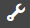

# アダプティブフォームの操作のベストプラクティス {#best-practices-for-working-with-adaptive-forms}

## 概要 {#overview}

Adobe Experience Manager（AEM）Forms を使用すると、複雑なトランザクションを単純で使いやすいデジタルエクスペリエンスに変えることができます。ただし、効率よく生産的な AEM Forms エコシステムを実装、ビルド、実行、維持するためには、多くの取り組みが必要となります。

ここでは、フォーム管理者、フォーム作成者、開発者たちが AEM Forms、特にアダプティブフォームコンポーネントを扱う際に知っておくべきガイドラインや推奨事項を紹介します。フォーム開発プロジェクトのセットアップから、AEM Forms の設定、カスタマイズ、オーサリング、最適化まで、ベストプラクティスを説明します。これらのベストプラクティスをそれぞれ実行すると、AEM Forms の全体的なパフォーマンスが向上します。

また、AEM の一般的なベストプラクティスについて、以下をお読みになることもお勧めします。

* [ベストプラクティス：AEMのデプロイと保守](/help/sites-deploying/best-practices.md)
* [ベストプラクティス：コンテンツのオーサリング](/help/sites-authoring/best-practices.md)
* [ベストプラクティス：AEM の管理](/help/sites-administering/administer-best-practices.md)
* [ベストプラクティス：ソリューションの開発](/help/sites-developing/best-practices.md)

## AEM Forms のセットアップおよび設定 {#set-up-and-configure-aem-forms}

### フォーム開発プロジェクトのセットアップ {#setting-up-forms-development-project}

プロジェクトの構造を簡素化し標準化することで、開発と維持にかかる労力を大幅に削減することができます。AEM プロジェクトのビルドには、オープンソースツールの Apache Maven をお勧めします。

* AEM プロジェクトの構造を作成し管理するために、Apache Maven `aem-project-archetype` を使用できます。AEM プロジェクトに合わせて、推奨される構造およびテンプレートを作成します。さらに、ビルドを自動化し、変更制御システムを提供するので、プロジェクト管理が容易になります。

   * Maven `archetype:generate` コマンドを使用して、最初の構造を生成します。
   * Maven `eclipse:eclipse` コマンドを使用して eclipse プロジェクトファイルを生成し、プロジェクトを eclipse 内に読み込みます。

For more information, see [How to Build AEM Projects using Apache Maven](/help/sites-developing/ht-projects-maven.md).

* FileVault ツール（VLT）は、CRX または AEM インスタンスをファイルシステムにマッピングするのに役立ちます。AEM プロジェクトコンテンツのチェックインやチェックアウトなどの変更制御を管理する操作を提供します。See [How to use the VLT Tool](/help/sites-developing/ht-vlttool.md).

* Eclipse 統合開発環境を使用している場合、AEM 開発者ツールを使用して Eclipse IDE を AEM インスタンスにシームレスに統合して、AEM アプリケーションを作成できます。詳しくは、「[Eclipse 用 AEM 開発者ツール](/help/sites-developing/aem-eclipse.md)」を参照してください。

* コンテンツを保存したり、/libsフォルダーに変更を加えたりしないでください。 /appフォルダーにオーバーレイを作成して、デフォルトの機能を拡張または上書きします。

* コンテンツを移動するパッケージを作成する場合は、パッケージフィルターのパスが正しく、必要なパスのみが記載されていることを確認します。

* コンテンツを保存したり、/libsフォルダーに変更を加えたりしないでください。 /appフォルダーにオーバーレイを作成して、デフォルトの機能を拡張または上書きします。

* パッケージの正しい依存関係を定義し、事前に決定されたインストールの順序/シーケンスを強制します。

* /libsや/appsに参照可能なノードを作成しないでください。

### オーサリング環境の計画 {#planning-for-authoring-environment}

AEM プロジェクトのセットアップを完了したら、アダプティブフォームのテンプレートおよびコンポーネントを作成してカスタマイズするための計画を策定します。

* アダプティブフォームテンプレートとは、アダプティブフォームの構造およびヘッダーとフッターの情報を定義する特別な AEM ページです。テンプレートのアダプティブフォーム用レイアウト、スタイル、基本構造は事前に設定されています。AEM Forms はアダプティブフォームの作成時にすぐに使用できるテンプレートおよびコンポーネントを提供します。ただし、必要に応じてカスタムのテンプレートやコンポーネントを作成できます。アダプティブフォームで今後必要となる追加のテンプレートやコンポーネントの要件を収集しておくことをお勧めします。詳しくは、「[アダプティブフォームおよびコンポーネントのカスタマイズ](/help/forms/using/adaptive-forms-best-practices.md#customize-components)」を参照してください。
* AEM Forms では、次のフォームモデルに基づいてアダプティブフォームを作成することができます。フォームモデルは、フォームと AEM システム間のデータ交換のためのインターフェイスとして機能し、アダプティブフォーム内外のデータフローの XML ベースの構造を提供します。また、フォームモデルはスキーマおよび XFA 制約の形式で、アダプティブフォームにルールや制約を課します。

   * **なし**：このオプションを使用して作成されたアダプティブフォームは、フォームモデルを使用しません。このようなフォームで生成されるデータ XML は、フィールドと対応する値を持つフラットな構造です。
   * **XMLまたはJSONスキーマ**:XMLとJSONのスキーマは、組織のバックエンドシステムでデータが生成、消費される構造を表します。 アダプティブフォームにスキーマを関連付け、その要素を使用して、アダプティブフォームに動的なコンテンツを追加することができます。 スキーマの要素は、アダプティブフォームを作成する際に、コンテンツブラウザーの「データモデルオブジェクト」タブから利用できます。 スキーマ要素をドラッグ &amp; ドロップしてフォームを作成できます。
   * **XFA フォームテンプレート**：これまで XFA ベースの HTML5 フォームに投資してきた場合、これが最適なフォームデータモデルです。XFA ベースのフォームをアダプティブフォームに直接変換する方法を提供します。すべての既存の XFA ルールは、関連付けられたアダプティブフォームに保持されます。このアダプティブフォームは、検証、イベント、プロパティ、パターンなどの XFA 構成をサポートします。
   * **Form Data Model**:データベース、Webサービス、AEMユーザープロファイルなどのバックエンドシステムを統合して、アダプティブフォームに事前入力し、送信済みのフォームデータをバックエンドシステムに書き込む場合は、このフォームモデルをお勧めします。 フォームデータモデルエディターにより、アダプティブフォームの作成に使用できるフォームデータモデルで、エンティティとサービスを定義して設定することができます。詳しくは、「[AEM Forms のデータ統合](/help/forms/using/data-integration.md)」を参照してください。

データモデルを選択する際には、要件に適合するかどうかだけでなく、すでに XFA および XSD アセットに投資をしている場合、それらの既存の投資を拡張できるかどうかを考慮することが重要です。生成されるXMLにはスキーマが定義するXPATHに従ったデータが含まれるので、フォームテンプレートの作成にはXSDモデルを使用することをお勧めします。 フォームデータモデルのデフォルトとして XSD モデルを使用することは、データを処理して使用するバックエンドシステムからフォームデザインが切り離され、フォームフィールドとの 1 対 1 のマッピングによりフォームのパフォーマンスが向上する点でも有用です。また、フィールドの BindRef を XML でそのデータ値の XPATH にすることもできます。

詳しくは、「[アダプティブフォームの作成](/help/forms/using/creating-adaptive-form.md)」を参照してください。

* アダプティブフォーム間には一部の共通セクションがあります。これらを特定して、コンテンツの再利用を促進する計画を策定してください。アダプティブフォームでは、スタンドアロンのフラグメントを作成して、フォーム間で再利用することができます。パネルをアダプティブフォーム内にフラグメントとして保存することもできます。フラグメントに対するすべての変更は関連付けられたフォームに反映されます。オーサリングにかかる時間を短縮し、フォーム間で一貫性を保つことに役立ちます。さらに、フラグメントを使用するとアダプティブフォームが軽量になるため、特に大規模なフォームではオーサリング体験が改善します。For more information, see [Adaptive form fragments](/help/forms/using/adaptive-form-fragments.md).

### アダプティブフォームおよびコンポーネントのカスタマイズ {#customize-components}

* AEM Forms には、アダプティブフォームの作成に使用できる初期設定済みのアダプティブフォームテンプレートが用意されています。独自のテンプレートを作成することも可能です。AEM では、静的テンプレートと編集可能なテンプレートを提供しています。

   * 静的テンプレートは、開発者により定義され構成されています。
   * 編集可能なテンプレートは、テンプレートエディターを使用して作成者により作成されます。テンプレートエディターを使用すれば、テンプレートで基本構造と初期コンテンツを定義できます。構造レイヤーに加えられた変更内容は、そのテンプレートを使用しているすべてのフォームに反映されます。初期コンテンツには、事前設定されたテーマ、事前入力サービス、送信アクションなどが含まれます。ただし、これらの設定はフォームエディターを使用したフォームに対して変更することができます。For more information, see [Adaptive form templates](/help/forms/using/template-editor.md).

* For styling a specific field or panel instance, use [inline styling](/help/forms/using/inline-style-adaptive-forms.md). または、CSS ファイルでクラスを定義し、そのクラス名をコンポーネントの CSS Class プロパティに指定します。
* コンポーネントにクライアントライブラリを含めることで、アダプティブフォームやそのコンポーネントを使用するフラグメントに一貫したスタイルを適用します。詳しくは、「[アダプティブフォームのページコンポーネントの作成](/help/forms/using/custom-adaptive-forms-templates.md)」を参照してください。
* アダプティブフォームコンテナのプロパティで、CSS ファイルパスフィールド内のクライアントライブラリへのパスを指定することで、選択したアダプティブフォームに、クライアントライブラリで定義したスタイルを適用します。
* スタイルのクライアントライブラリを作成するには、テーマエディターのベース clientlib またはフォームコンテナのプロパティでカスタム CSS ファイルを設定します。
* アダプティブフォームにはレスポンシブ、タブ形式、アコーディオン、ウィザードなどのパネルレイアウトが用意されており、フォームコンポーネントをパネル上に並べる方法を制御できます。カスタマイズパネルレイアウトを作成し、フォーム作成者が使用できるようにすることができます。For more information, see [Creating custom layout components for adaptive forms](/help/forms/using/custom-layout-components-forms.md).
* フィールドやパネルレイアウトなど、アダプティブフォームの特定のコンポーネントをカスタマイズすることもできます。

   * AEM の[オーバーレイ](/help/sites-developing/overlays.md)機能を使用してコンポーネントのコピーを変更します。デフォルトコンポーネントは変更しないことをお勧めします。
   * /libs のすぐに使用できるアダプティブフォームコンポーネントのレイアウトをカスタマイズするには、[デフォルトレイアウト](/help/forms/using/layout-capabilities-adaptive-forms.md)に加えて、[カスタマイズレイアウトコンポーネントを作成](/help/forms/using/custom-layout-components-forms.md)します。
   * カスタムウィジェットまたはカスタム外観を作成することで、カスタムのインタラクティブ機能を導入できます。デフォルトコンポーネントは変更しないことをお勧めします。詳しくは、「[外観フレームワーク](/help/forms/using/introduction-widgets.md)」を参照してください。

* See [Handling personally identifiable information](/help/forms/using/adaptive-forms-best-practices.md#p-handling-personally-identifiable-information-p) for recommendations on handling PII data.

## アダプティブフォームのオーサリング {#author-adaptive-forms}

### タッチに最適化されたオーサリング用 UI の使用 {#using-touch-optimized-ui-for-authoring}

* サイドバーのオブジェクトブラウザーを使用すると、フォーム階層の深いフィールドにすばやくアクセスできます。 検索ボックスを使用してフォームまたはオブジェクトツリー内のオブジェクトを検索し、オブジェクト間を移動することができます。
* To view and edit the properties of a component in the components browser in the sidebar, select the component and click . コンポーネントをダブルクリックして、プロパティブラウザーにコンポーネントのプロパティを表示することもできます。
* フォームに対する操作をすばやく実行するには、キーボードショートカットを使用します。See [AEM Forms Keyboard Shortcuts](/help/forms/using/keyboard-shortcuts.md).

* アダプティブフォームのコンポーネントは、アダプティブフォームのページでのみ使用することをお勧めします。これらのコンポーネントは、その親階層に対して依存関係を持っています。このため、AEM ページではこれらのコンポーネントを使用しないでください。

また、「[アダプティブフォームのオーサリングの概要](/help/forms/using/introduction-forms-authoring.md)」に記載されているコンポーネントの説明とベストプラクティスを参照してください。

### アダプティブフォームにおけるルールの使用 {#using-rules-in-adaptive-forms}

AEM Forms が提供する[ルールエディター](/help/forms/using/rule-editor.md)を使用すると、アダプティブフォームコンポーネントに動的な動きを付加するルールを作成できます。これらのルールを使用すると、条件を評価し、フィールドの表示/非表示、値の計算、ドロップダウンリストの動的な変更など、コンポーネントに対してアクションをトリガーできます。

ルールエディターには、ルールを記述するために、視覚的なエディターとコードエディターが用意されています。コードエディターモードを使用してルールを記述する際には、以下を考慮してください。

* ルールの記述時には、フォームフィールドおよびコンポーネントには意味のある固有の名前を使用し、名前の競合を回避します。
* ルールの式で、コンポーネント自身を参照するには、コンポーネントの `this` 演算子を使用します。これにより、コンポーネント名が変更されても、ルールは有効なままになります。例： `field1.valueCommit script: this.value > 10`

* 他のフォームコンポーネントを参照する場合には、コンポーネント名を使用します。フィールドまたはコンポーネントの値を取得するには、`value` プロパティを使用します。例： `field1.value`

* 競合を回避するために、コンポーネントは固有の相対階層で参照します。例： `parentName.fieldName`

* 複雑なルールや一般的に使用されるルールを処理する場合は、指定してアダプティブフォーム間で再利用できる別のクライアントライブラリの機能としてビジネスロジックを記述することを検討してください。 クライアントライブラリは独立のライブラリとし、jQuery および Underscore.js 以外の外部依存性はなくしてください。You can also use the client library to enforce [server-side revalidation](/help/forms/using/configuring-submit-actions.md#server-side-revalidation-in-adaptive-form) of submitted form data.
* アダプティブフォームが提供する一連の API を使用して、アダプティブフォームと通信したり、アダプティブフォーム上でアクションを実行したりできます。主要な API には次の項目が挙げられます。詳しくは、「[アダプティブフォームの JavaScript ライブラリ API リファレンス](https://adobe.com/go/learn_aemforms_documentation_63)」を参照してください。

   * `guideBridge.reset()`:フォームをリセットします。
   * `guideBridge.submit()`:フォームを送信します。
   * `guideBridge.setFocus(somExp, focusOption, runCompletionExp)`:フィールドにフォーカスを設定します。
   * `guideBridge.validate(errorList, somExpression, focus)`:フォームを検証します。
   * `guideBridge.getDataXML(options)`:フォームデータをXMLとして取得します。
   * `guideBridge.resolveNode(somExpression)`:フォームオブジェクトを取得します。
   * `guideBridge.setProperty(somList, propertyName, valueList)`:フォームオブジェクトのプロパティを設定します。
   * 上記に加えて、以下のフィールドプロパティを使用できます。

      * `field.value` フィールドの値を変更します。
      * f `ield.enabled` to enable/disable a field.
      * `field.visible` フィールドの表示／非表示を変更します。

* アダプティブフォームの作成者は、フォーム内のビジネスロジックを構築するために、場合によっては JavaScript コードを作成する必要があります。JavaScript は強力で効果的ですが、セキュリティ上の期待に対して妥協が生じる可能性があります。このため、フォーム作成者が信頼できる人物であることや、フォームを本番稼動させる前に JavaScript コードを見直して承認するプロセスがあることを確認する必要があります。管理者は、各ユーザーの役割や職務に基づいて、ユーザーグループのルールエディターへのアクセスを制限することができます。[選択したユーザーグループにルールエディターへのアクセスを許可する](/help/forms/using/rule-editor-access-user-groups.md)を参照してください。
* ルール内で数式を使用して、アダプティブフォームを動的にすることができます。すべての数式は有効なJavaScriptの数式で、アダプティブフォームのスクリプトモデルAPIを使用しています。これらの数式は、特定のタイプの値を返します。数式およびベストプラクティスについて詳しくは、「[アダプティブフォームの数式](/help/forms/using/adaptive-form-expressions.md)」を参照してください。

### テンプレートの操作 {#working-with-themes}

アダプティブフォームのテーマを使用して、一貫した外観とスタイル設定をフォーム全体に適用できる再利用可能なスタイルを作成できます。テーマを使用してフォームコンポーネントやパネルのスタイル設定を定義することをお勧めします。テーマに関するベストプラクティスの一部を以下に示します。

* テキストスタイル、背景および画像の簡単なアプリケーション用にアセットライブラリを使用します。スタイルをアセットライブラリに追加すると、他のテーマに使用できて、フォームエディターのスタイルモードで利用できます。
* ページレベルのセレクターを使用して、フォントやページ背景などのグローバル設定に適用します。
* クライアントライブラリを使用して、既存のスタイル設定または詳細スタイル設定をテーマに読み込みます。
* フォームスタイルレイヤー内の特定のフィールド、パネル、ボタンにスタイル設定を上書きできます。
* テーマがスタイル設定の要件を満たさない場合は、事前定義済みのクラス（guideFieldNode、guideFieldLabel、guideFieldWidget、guidePanelNode など）を使用して複数のフォームに共通のスタイルを適用できます。

詳しくは、「[テーマ](/help/forms/using/themes.md)」を参照してください。

### 大規模フォームおよび複雑なフォームのパフォーマンスの最適化 {#optimizing-performance-of-large-and-complex-forms}

通常、パフォーマンスに関する問題が発生するのは、フォーム作成者およびエンドユーザーが、オーサリングモードで、または実行時に大規模なフォームを読み込む場合です。フォーム内のオブジェクト（フィールドおよびパネル）が増えるにしたがって、オーサリングや実行の快適さは低下します。また、複数の作成者が共同作業したり、同時にフォームをオーサリングしたりする妨げにもなります。

大規模フォームに関するパフォーマンスの問題を解決するには、以下のベストプラクティスを検討してください。

* 可能な場合には、XFA をアダプティブフォームに変換する場合でも、XSD フォームデータモデルを使用してアダプティブフォームを作成することをお勧めします。
* アダプティブフォームには、ユーザーから情報を取得するフィールドおよびパネルのみを含めます。静的コンテンツを最小限にするか、それらのコンテンツを別のウィンドウで開く URL を使用することを検討します。
* すべてのフォームは特定の目的のためにデザインされますが、ほとんどのフォームにはいくつかの共通するセグメントがあります。例えば、個人の詳細、住所、雇用の詳細などです。Create [adaptive form fragments](/help/forms/using/adaptive-form-fragments.md) for common form elements and sections and use them across forms. 既存のフォーム内にパネルをフラグメントとして保存することもできます。フラグメントに対する変更はすべて、関連付けられたアダプティブフォームに反映されます。これにより、複数の作成者が同時に、1 つのフォームを構成する別のフラグメントの作業を行えるため、オーサリングの共同作業が促進されます。

   * アダプティブフォームと同様に、フラグメント固有のすべてのスタイルおよびカスタムスクリプトは、フラグメントコンテナダイアログを使用して定義することをお勧めします。外部のオブジェクトに依存しない自己完結型のフラグメントを作成するようにしてください。
   * フラグメントをまたぐスクリプトは使用しないでください。フラグメントの外部に参照する必要があるオブジェクトが存在する場合、そのオブジェクトを親フォームの一部とするようにしてください。それでもオブジェクトが別のフラグメントに存在しなくてはならない場合、スクリプト中でその名前を参照します。。

* 自動保存機能のある「保存して再開」を使用して、アダプティブフォームを定期的に保存し、ユーザーが後で再度アクセスしてフォームを完了できるようにします。
* フラグメントの遅延読み込みを設定します。遅延読み込みをマークされたフラグメントは、実行時に必要な場合にのみレンダリングされます。大規模なフォームでは、読み込み時間が大幅に減少します。これは、リピート可能なパネルを使用したフラグメントでもサポートされます。詳しくは、「[遅延読み込みの設定](/help/forms/using/lazy-loading-adaptive-forms.md)」を参照してください。

   * レスポンシブグリッドレイアウトまたは最初のパネルには、フラグメントに遅延読み込みを設定しないでください。
   * ファイル添付および利用条件コンポーネントは、遅延読み込みフラグメントではサポートされません。
   * 遅延読み込みパネルにある値は、その値がフォームの別の部分で使用されている場合、「グローバルに値を使用」とマークします。これにより、パネルが読み込まれていない場合に、この値を使用できるようになります。
   * フラグメントの表示ルールは、条件に基づいて表示または非表示するべきフラグメントに対して作成するようにしてください。

### アダプティブフォームに事前にデータを取り込む {#prefilling-adaptive-forms}

バックエンドから取得したデータを使用してアダプティブフォームフィールドに事前にデータを取り込んで、ユーザーの入力ミスを防いですばやくフォームに入力できるようにします。

* AEM Forms の事前入力サービスは、事前定義されたデータ XML ファイルからデータを読み込み、事前入力 XML ファイルの内容でアダプティブフォームのフィールドに事前入力します。
* 事前入力データ XML は、アダプティブフォームに関連付られたフォームモデルのスキーマに準拠している必要があります。
* 事前入力 XML には `afBoundedData` および `afUnBoundedData` セクションを含めて、アダプティブフォームの連結されたフィールドと連結されていないフィールドのどちらにも事前入力するようにします。

* フォームデータモデルを基にしたアダプティブフォームの場合、AEM Formsは標準搭載のフォームデータモデル事前入力サービスを提供しています。 この事前入力サービスは、アダプティブフォーム内のデータモデルオブジェクトに対してデータソースのクエリを実行し、フォームのレンダリング時に、フィールドに値を取り込みます。
* ファイル、crx、サービス、http プロトコルを使用してアダプティブフォームに事前入力することもできます。
* AEM Forms は、OSGi サービスとしてプラグインしてアダプティブフォームに事前入力できるカスタム事前入力サービスをサポートしています。

For more information, see [Prefill adaptive form fields](/help/forms/using/prepopulate-adaptive-form-fields.md).

### アダプティブフォームの署名と送信 {#signing-and-submitting-adaptive-forms}

Adaptive forms では、ユーザー指定のデータを処理するために、送信アクションが必要となります。送信アクションは、アダプティブフォームを使用して送信するデータに対して実行されるタスクを決定します。

* アダプティブフォームには、初期設定済みの複数の送信アクションがあります。For details, see [Configuring the Submit action](/help/forms/using/configuring-submit-actions.md).
* デフォルトの送信アクションが実際のユースケースに適していない場合は、カスタム送信アクションを作成できます。For more information, see [Writing custom Submit action for adaptive forms](/help/forms/using/custom-submit-action-form.md).
* サーバー側の検証を含めて、無効なデータ送信を防ぎます。

アダプティブフォームで Adobe Sign の複数署名機能を活用できます。アダプティブフォームで Adobe Sign を設定する際は、以下を考慮してください。For details, see [Using Adobe Sign in an adaptive form](/help/forms/using/working-with-adobe-sign.md).

* Adobe Sign が有効になっているアダプティブフォームは、すべての署名者がフォームに署名するまで送信されないことに注意してください。Formsは、すべての署名者がフォームに署名するまで、署名待ち状態で表示されます。
* フォーム内署名機能を設定する、または送信時に署名者を署名ページにリダイレクトすることができます。
* 連続署名または並列署名のどちらか適している方を設定します。

### レコードのドキュメントの生成 {#generating-document-of-record}

レコードのドキュメント（DoR）はアダプティブフォームのフラットな PDF 版で、印刷、署名、アーカイブが行えます。

* アダプティブフォームが基づくフォームデータモデルによって、DoR のテンプレートを以下のように設定できます

   * **XFA フォームテンプレート**：関連付けられた XDP ファイルを DoR テンプレートとして使用します。
   * **XSD スキーマ**：アダプティブフォームが使用するのと同じ XML スキーマを使用する、関連付けられた XFA テンプレートを使用します。
   * **なし**：自動生成 DoR を使用します。

* アダプティブフォームエディターの「レコードのドキュメント」タブで、ヘッダー、フッター、画像、色、フォントなどを設定します。
* `DoRService` を使用して、DoR をプログラムにより生成します。
* DoR から非表示フィールドを除外します。
* Use `afAcceptLang` request parameter to view DoR in another locale.

### アダプティブフォームのデバッグとテスト {#debugging-and-testing-adaptive-forms}

[AEM Chrome プラグイン](https://adobe-consulting-services.github.io/acs-aem-tools/aem-chrome-plugin/)は、アダプティブフォームをデバッグするためのツールを提供する Google Chrome のブラウザー拡張機能です。フォームの作成者と開発者は、これらのツールを使用して以下の操作を実行できます。

* フォームレンダリングのボトルネックを特定し、パフォーマンスを最適化する
* フォームのキーワードと bindRef エラーをデバッグする
* ログを有効にして設定する
* フォームのルールとスクリプトをデバッグする
* guideBridge API について調査および学習する

For more information, see [AEM Chrome Plug-in - Adaptive Form](https://adobe-consulting-services.github.io/acs-aem-tools/aem-chrome-plugin/adaptive-form/).

Calvin SDK は、アダプティブフォームをテストするためのアダプティブフォーム開発者用のユーティリティ API です。Calvin SDK is built on top of the [Hobbes.js testing framework](https://docs.adobe.com/docs/en/aem/6-3/develop/ref/test-api/index.html). このフレームワークを使用して、次のテストを実行できます。

* アダプティブフォームのレンディションのエクスペリエンス
* アダプティブフォームの事前入力機能
* アダプティブフォームの送信機能
* 式のルール
* 検証
* 遅延読み込み

詳しくは、「[アダプティブフォームのテスト自動化](/help/forms/using/calvin.md)」を参照してください。

### AEM サーバー上でのアダプティブフォームの検証 {#validating-adaptive-forms-on-aem-server}

クライアント側で検証をすり抜ける試みを阻止するためにも、データ送信の漏洩やビジネスルール違反の可能性を阻止するためにも、サーバー側の検証が必要です。サーバー側の検証は、必要なクライアントライブラリを読み込むことにより、サーバー上で実行されます。

* クライアントライブラリに、アダプティブフォームの検証式の機能を含めて、アダプティブフォームコンテナダイアログでクライアントライブラリを指定します。詳しくは、「[サーバー側の再検証](/help/forms/using/configuring-submit-actions.md#p-server-side-revalidation-in-adaptive-form-p)」を参照してください。
* サーバー側の検証により、フォームモデルが検証されます。検証のために別個のクライアントライブラリを作成し、1 つのクライアントライブラリに HTML のスタイルや DOM 操作を混在させないことをお勧めします。

### アダプティブフォームのローカライズ {#localizing-adaptive-forms}

AEM には、アダプティブフォームをローカライズするために使用できる翻訳ワークフローが用意されています。詳しくは、「[AEM 翻訳ワークフローを使用したアダプティブフォームのローカライズ](/help/forms/using/using-aem-translation-workflow-to-localize-adaptive-forms.md)」を参照してください。

アダプティブフォームをローカライズする際のベストプラクティスの一部を以下に示します。

* アダプティブフォームフラグメントを使用すると、フォーム間やローカライズフラグメントで共通の要素を使用できます。 フラグメントを一度ローカライズすると、ローカライズしたフラグメントが使用されているすべてのフォームにその内容が反映されます。
* 新しいコンポーネントの追加やローカライズしたフォームへのスクリプトの適用などの変更を行った場合、その変更内容は自動的にローカライズされません。したがって、複数のローカライゼーションサイクルを避けるために、フォームをローカライズする前に最終決定する必要があります。
* ブラウザーのロケールを上書きし、指定したロケールでフォームをレンダリングするには、`afAcceptLang` 要求パラメーターを使用します。例えば、次のURLは、ブラウザーの設定で指定されているロケールに関係なく、日本語ロケールでのフォームのレンダリングを強制します。

   `https://'[server]:[port]'/<contextPath>/<formFolder>/<formName>.html?wcmmode=disabled&afAcceptLang=ja`

* AEM Formsでは、英語(en)、スペイン語(es)、フランス語(fr)、イタリア語(it)、ドイツ語(de)、日本語(ja)、ポルトガル語(br)、ポルトガル語(pt-BR)、中国語(zh-CN)、中国語 — 台湾(zh-TW)、韓国語(ko-KR)ロケールでのアダプティブフォームコンテンツのローカライゼーションをサポートしています。 ただし、実行時にアダプティブフォームに対する新しいロケールのサポートを追加できます。詳しくは、「[アダプティブフォームのローカライズに対する新しいロケールのサポート](/help/forms/using/supporting-new-language-localization.md)」を参照してください。

## フォームプロジェクトを実稼働で使用するための準備 {#prepare-forms-project-for-production}

### フォーム処理サーバーの追加 {#adding-forms-processing-server}

ファイアウォール内側の保護された領域に、追加の AEM Forms サーバーを構成することもできます。このインスタンスは次の目的に使用できます。

* **バッチ処理**:定期的なジョブ、または負荷の大きいバッチでスケジュールされるジョブ。 例えば、印刷明細、通信の生成や、PDF Generator、Output、アセンブラなどのドキュメントサービスの使用が例として挙げられます。
* **PII データの保存**： PII データを処理サーバーに保存します。PII データの保存用にカスタムのストレージプロバイダーを使用している場合には必要ありません。

### プロジェクトの別の環境への移動 {#moving-project-to-another-environment}

AEM プロジェクトを別の環境に移動させたいという場合は、よくあります。移動時の主な留意事項は、次のとおりです。

* 既存のクライアントライブラリ、カスタムコード、設定のバックアップを作成します。
* 製品パッケージおよびパッチを、手動で、新しい環境で指定された順序でデプロイします。
* プロジェクト固有のコードパッケージおよびバンドルを、手動で、新しい AEM サーバー上の別個のパッケージまたはバンドルとしてデプロイします。
* (*AEM Forms on JEE only*) Deploy LCAs and DSCs manually on Forms Workflow server.
* [エクスポート-インポート](/help/forms/using/import-export-forms-templates.md)機能を使用して、アセットを新しい環境に移動します。複製エージェントを構成し、アセットを発行することもできます。
* アップグレードする際は、非推奨のAPIと機能をすべて新しいAPIと機能に置き換えます。

### AEM の設定 {#configuring-aem}

AEM 全体のパフォーマンスを改善するために設定するベストプラクティスのいくつかは、次のとおりです。

* Felix Console からの JavaScript および CSS の HTML クライアントライブラリ圧縮を有効にします。See [Clientlibs explained by example](https://blogs.adobe.com/experiencedelivers/experience-management/clientlibs-explained-example/).
* Cache all client libraries at `/etc.clientlibs/fd` and any additional custom client libraries on AEM dispatcher to increase the responsiveness and security of your published forms. 詳しくは、「[ディスパッチャー](https://helpx.adobe.com/experience-manager/dispatcher/using/dispatcher.html)」を参照してください。

* キャッシュ `/content/forms/af/` と `/content/dam/formsanddocuments/*` パスは使用しません。 アダプティブフォームのキャッシュの設定に関する詳細は、「アダプティブフォームの [キャッシュ](/help/forms/using/configure-adaptive-forms-cache.md)」を参照してください。

* Web サーバー圧縮モジュールを経由して、HTML を有効にします。詳しくは、「[AEM Forms サーバーのパフォーマンス調整](/help/forms/using/performance-tuning-aem-forms.md)」を参照してください。
* 大規模なフォームのリクエスト構成ごとの呼び出し数を増加させます。「[大規模フォームおよび複雑なフォームのパフォーマンスの最適化](/help/forms/using/adaptive-forms-best-practices.md#optimizing-performance-of-large-and-complex-forms)」を参照してください。
* [エラーハンドラーにより表示されるカスタムエラーページ](https://helpx.adobe.com/experience-manager/6-2/sites-developing/customizing-errorhandler-pages.html)を作成します。
* AEM Forms サーバーを保護します。

   * `nosamplecontent` 実行モードを使用して、実稼働サーバーにサンプルコンテンツおよびサンプルユーザーがデプロイされていないことを確認します。See [Running AEM in Production Ready Mode](/help/sites-administering/production-ready.md).

* ヒープサイズを 8 GB 以上にします。その他の設定については、「[AEM Forms サーバーのパフォーマンス調整](/help/forms/using/performance-tuning-aem-forms.md)」を参照してください。
* ユーザーレベルのタスクを実行するには、管理者セッションではなくサービスユーザーセッションを使用します。詳しくは、「[サービス認証](https://sling.apache.org/documentation/the-sling-engine/service-authentication.html)」を参照してください。

>[!VIDEO](https://vimeo.com/)

### ドラフトおよび送信済みフォームのデータを保存する外部ストレージの設定 {#external-storage}

実稼働環境では、送信されたフォームデータを AEM リポジトリに保存しないことをお勧めします。「フォームポータル保存」、「コンテンツ保存」および「PDF の保存」送信アクションのデフォルト実装では、フォームデータが AEM リポジトリに保存されます。これらの送信アクションは、デモを目的としたものです。また、「保存して再開」機能や「自動保存」機能でも、デフォルトでポータルストレージが使用されます。したがって、次の推奨事項を考慮してください。

* **ドラフトデータの保存**：アダプティブフォームの「ドラフト」機能を使用している場合は、カスタムサービスプロバイダーインターフェイス（SPI）を実装して、データベースなどのより安全なストレージにドラフトデータを保存してください。詳しくは、「[ドラフト&amp;送信コンポーネントとデータベースの統合](/help/forms/using/integrate-draft-submission-database.md)」を参照してください。

* **送信データの保存**:フォームポータル送信ストアを使用する場合は、カスタムSPIを実装して送信データをデータベースに保存する必要があります。 See [Sample for integrating drafts &amp; submissions component with database](/help/forms/using/integrate-draft-submission-database.md) for a sample integration.

   安全なストレージにフォームデータと添付ファイルを保存するカスタム送信アクションを作成することもできます。See [Writing custom Submit action for adaptive forms](/help/forms/using/custom-submit-action-form.md) for more information.

* **ドラフトIDの長さ**:アダプティブフォームをドラフトとして保存すると、ドラフトを一意に識別するためのドラフトIDが生成されます。 ドラフトIDフィールドの長さの最小値は26文字です。 Adobeでは、ドラフトIDの長さを26文字以上に設定することをお勧めします。

### 個人が特定できる情報の処理 {#handling-personally-identifiable-information}

組織にとって大きな課題の 1 つは、個人が特定できる情報（PII）の取り扱い方法です。このようなデータを取り扱うためのベストプラクティスのいくつかは、次のとおりです。

* データベースなどの安全な外部ストレージを使用してドラフトおよび送信済みフォームのデータを保存します。See [Configuring external storage for drafts and submitted forms data](/help/forms/using/adaptive-forms-best-practices.md#external-storage).
* 自動保存を有効にする前に、利用規約フォームを使用してユーザーからの明示的な同意を得ます。この場合、ユーザーが利用規約コンポーネントの条件に合意した場合にのみ自動保存を有効にします。

