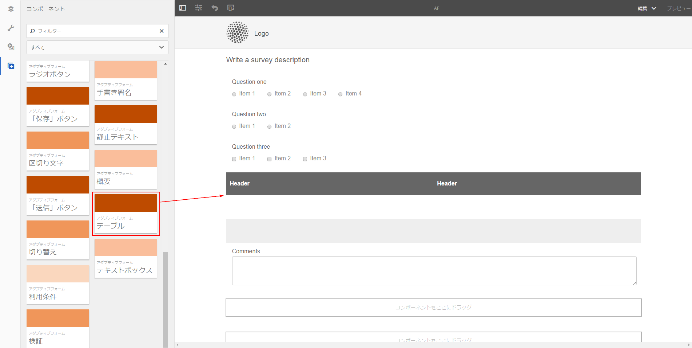
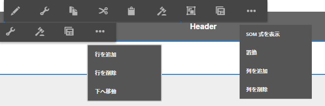
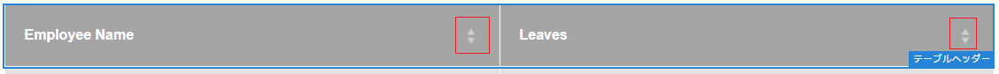
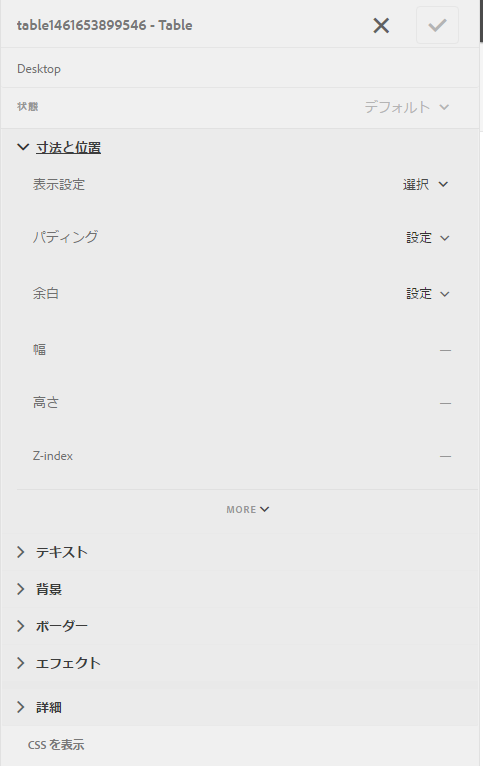
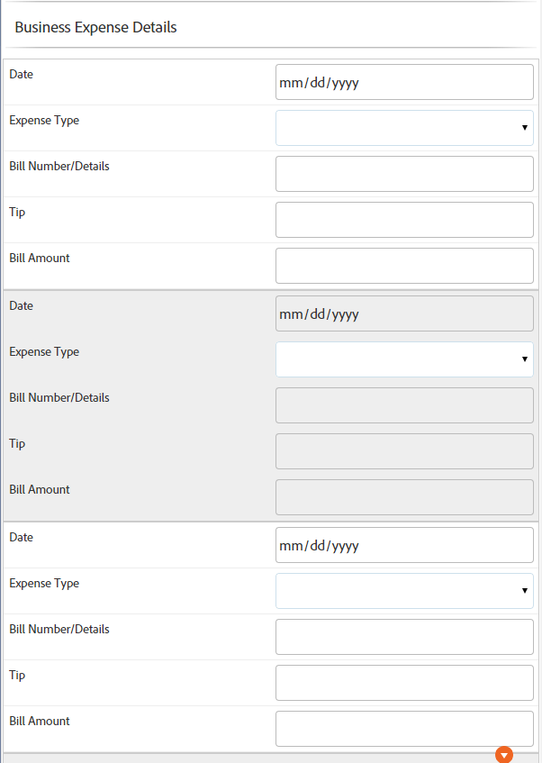

# アダプティブフォームにおける表{#tables-in-adaptive-forms}

複雑なデータであっても、表を使用することで、効果的かつシンプルにまとめて提示することができます。情報をわかりやすく配置し、行と列に分けて規則正しく配列することで、ユーザーも入力しやすくなります。金融サービスや政府機関が提供するフォームの大部分は、数字を入力して計算を実行できる大規模なデータ表を必要とします。

AEM Forms を使用すると、サイドバーにあるコンポーネントブラウザーから表コンポーネントを追加し、アダプティブフォーム内で表を作成できるようになります。主な機能には次のようなものがあります。

* モバイルデバイス上のレスポンシブなレイアウト
* 設定可能な行と列
* 実行時の動的な追加と削除
* セルの結合と分割
* スクリーンリーダーによるアクセス
* CSS を使用したカスタムレイアウト
* XDP 表コンポーネントとの互換性とマッピング
* XSD 複合タイプ要素を使用した行またはセルの追加のサポート
* XML ファイルからのデータの統合

## 表の作成 {#create-a-table}

表を作成するには、表コンポーネントをサイドキックにあるコンポーネントブラウザーからアダプティブフォームへとドラッグ＆ドロップします。表には、デフォルトで 2 つの列と ヘッダー行を含む 3 つの行が含まれています。



### ヘッダーとボディセルについて {#about-header-and-body-cells}

ヘッダーセルは、テキストフィールドです。ヘッダーのラベルを変更するには、ヘッダーセルを右クリックし、「**編集**」をクリックします。編集ダイアログの「**値**」フィールドのラベルを編集して「**OK**」をクリックします。

ボディセルは、デフォルトでテキストボックスになっています。ボディセルは、数値ボックス、日付選択、ドロップダウンリストなど、サイドキックで使用できるどのアダプティブフォームコンポーネントとでも置き換えることができます。

例えば、次の表の最初のボディ行には、テキストボックス、日付選択、ドロップダウンリストのコンポーネントが含まれています。


結合したいセルを選択し、右クリックして「**結合**」を選択することにより、複数のセルを結合することができます。また、結合されたセルを右クリックして「**セルの分割**」を選択することにより、セルを分割することができます。

### 行および列の追加、削除、移動 {#add-delete-move-rows-and-columns}

行または列の追加/削除を行ったり、表の中で行を上下に移動させることができます。

行または列を追加/削除する、または行を移動させるには、行または列に含まれるセルのいずれかをクリックします。列の一番上および行の左側にドロップダウンメニューが表示されます。上部のメニューには列を追加または削除するオプションが表示され、左側のメニューには行を追加、削除、または移動させるオプションが表示されます。

* 追加の操作では、選択された行の下に行が、そして選択された列の右隣に列が追加されます。
* 削除の操作では、選択された行または列が削除されます。
* 上へ移動または下へ移動の操作は、選択された行を上下に移動させます。

行のドロップダウンメニューでは、行のプロパティ、設定、スタイル設定オプションを編集する編集の操作も提供されます。



>[!NOTE]
>
>表には、任意の数の行を追加することができますが、追加できる列の数は最大 6 つまでに制限されています。また、表からヘッダー行を削除することはできません。

### 表の説明の追加 {#add-table-description}

情報がどのように整理されているか、スクリーンリーダーが解釈し、読み出すことのできる説明を、表に追加することができます。説明を追加するには：

1. Select the table and tap  to see its properties in the sidebar.
1. 「アクセシビリティ」タブで概要を指定します。
1. 「**完了**」をクリックします。

### テーブルの列の並べ替え {#sortcolumnstable}

アダプティブフォーム内の表の任意の列に基づいてデータを並べ替えることができます。 列の値は、昇順または降順で並べ替えることができます。

並べ替えは、次の項目を含む表の列に適用できます。

* 静的テキスト
* データモデルオブジェクトのプロパティ
* スタティックテキストとデータモデルオブジェクトプロパティの組み合わせ

テーブルの列に並べ替えを適用するには、テーブルの列のセルに次のいずれかのコンポーネントが含まれている必要があります。数値ボックス、数値ステッパー、日付入力フィールド、日付ピッカー、テキストまたはテキストボックス。

並べ替えを有効にするには：

1. テーブルを選択し、「  」（設定）をタップします。 対話型通信のサイドキックにある **コンテンツ** ・ブラウザを使用して、テーブルを選択することもできます。
1. 「並べ替えを **有効にする**」を選択します。
1. Tap  to save the table properties. 列ヘッダー内の並べ替えアイコン（上向き矢印と下向き矢印）は、並べ替えが有効になっていることを表します。

   

1. 出力を表示するには、 **プレビュー** ・モードに切り替えます。 テーブルは、テーブルの最初の列に基づいて自動的に並べ替えられます。
1. 列見出しをクリックして、列に基づいて値を並べ替えます。

   上向き矢印の付いた列ヘッダーは、その列に基づいてテーブルが並べ替えられていることを表します。 さらに、列の値が昇順で表示されます。

   

   同様に、下向き矢印の付いた列見出しは、列内の値が降順で表示されていることを表します。

   また、 **プレビュー** ・モードでテーブルを変更し、列見出しを再度クリックして列の値を並べ替えることもできます。

## 表のスタイルの設定 {#configure}

ページのツールバーでスタイルモードを使用することにより、表のスタイルを定義できます。次の手順を実行してスタイルモードに切り替え、表のスタイルを編集します。

1. In the page toolbar, before Preview, tap  > **Style**.

1. In the sidebar select table and tap the edit button .
サイドバーにスタイル設定プロパティが表示されます。



>[!NOTE]
>
>ヘッダーおよびボディ行のカラーテーマは、LESS 変数の値を変更することによって変更することができます。詳しくは、「[AEM Forms のテーマ](/help/forms/using/themes.md)」を参照してください。[](/help/forms/using/creating-custom-adaptive-form-themes.md)

## 行の動的な追加または削除 {#add-or-delete-a-row-dynamically}

表には、実行時の動的な行の追加および削除のサポートがあらかじめ含まれています。

1. Select a table row and tap .
1. 「繰り返しの設定」タブで、表の行の数を制限する最大値と最小値を指定します。
1. 「**完了**」をクリックします。

実行時に、行を追加/削除するための **+** と *-* ボタンが表示されます。 


>[!NOTE]
>
>行の動的な追加/削除は、表の「左側にヘッダー」のモバイルレイアウトではサポートされていません。

## 表における数式 {#expressions-in-a-table}

アダプティブフォームの表では、表または行を表示/非表示にする、すべての数値を加算して合計をセルに表示する、セルを有効または無効にする、ユーザー入力を検証するなどの動作を誘導する数式を JavaScript で作成することができます。これらの数式は、アダプティブフォームのスクリプトモデル API を使用しています。

表と行では、数式によって返される値を基にその視認性をコントロールする視認性の数式のみがサポートされていますが、セルでは、次の数式がサポートされています。

* **初期化スクリプト：**&#x200B;フィールドの初期化で操作を実行します。
* **値コミットスクリプト：** フィールドの値を変更した後にフォームのコンポーネントを変更する場合。

>[!NOTE]
>
>同じフィールドに XFA change/exit スクリプトも適用されている場合は、値コミットスクリプトの前に XFA change/exit スクリプトが実行されます。

* **数式の計算**：フィールドの値を自動計算します。
* **検証数式**：フィールドを検証します。
* **アクセス数式**：フィールドを有効化/無効化します。
* **視認性の数式**：フィールドおよびパネルの視認性をコントロールします。

表または行の視認性の数式は、対応する編集コンポーネントダイアログの「パネルプロパティ」タブで定義することができます。セルの数式は、編集コンポーネントダイアログの「スクリプト」タブで定義することができます。

アダプティブフォームクラス、イベント、オブジェクト、パブリック API の完全なリストについては、「[アダプティブフォームの JavaScript ライブラリ API リファレンス](https://helpx.adobe.com/jp/experience-manager/6-5/forms/javascript-api/index.html)」を参照してください。

## モバイルレイアウト {#mobile-layouts}

アダプティブフォームの表は、その流動的でレスポンシブなレイアウトで、モバイルデバイスでの卓越したエクスペリエンスを提供します。AEM Formsオファーでは、表に使用するモバイルレイアウトを、左側にヘッダーと折りたたみ可能な列の2種類用意しています。

表のモバイルレイアウトは、表の編集コンポーネントダイアログの「スタイル設定」タブから設定することができます。

### 左側にヘッダー {#headers-on-left}

左側にヘッダーのレイアウトでは、表のヘッダーが左側に転置され、ヘッダーに寄せてセルがひとつだけ表示されている形になっています。このレイアウトでの各行は、個別のセクションとして表示されます。次の画像では、デスクトップ上での表とモバイルデバイス上での表を比較しています。


左側にヘッダーのレイアウトを使った表のデスクトップビュー



左側にヘッダーのレイアウトを使った表のモバイルビュー

### 折りたたみ可能な列のレイアウト {#collapsible-columns-layout}

折りたたみ可能な列のレイアウトでは、デバイスの大きさによって 1 つまたは 2 つの列が表示され、その他の列は折りたたまれます。折りたたみ/展開アイコンをクリックすると、表の他の列を表示することができます。

>[!NOTE]
>
>折りたたみ可能な列のレイアウトはモバイルデバイス向けに最適化されていますが、表のすべての列を表示するのに十分な幅がない場合は、デスクトップでも使用できます。

次の画像では、列が折りたたまれた状態と展開された状態で、表がどのように表示されるかを比較しています。


モバイルデバイス上で、列が 2 つだけ表示されている表の中の折りたたまれた列


モバイルデバイス上で展開された表の列

## 表におけるデータの統合 {#merge-data-in-a-table}

アダプティブフォームの表では、実行時に、XML ファイルからのデータを使用して表にデータを入力することができます。データの XML ファイルは、AEM Forms サーバーが稼働しているマシンのローカルファイルシステム、または CRX リポジトリに置くことができます。

XML ファイルのデータを使って入力する、次の銀行取引概略表を見てみましょう。


この例で使用する要素名プロパティは以下の通りです。

* 行：**Row1**
* 取引日の下のボディセル：**tableItem1**
* 説明の下のボディセル：**tableItem2**
* 取引の種類の下のボディセル：**type**
* 金額（USD）の下のボディセル：**tableItem3**

次の形式のデータを含む XML ファイル：

```xml
<?xml version="1.0" encoding="UTF-8"?><afData>
  <afUnboundData>
    <data>
 <typeSelect>0</typeSelect>
 <Row1>
      <tableItem1>2015-01-08</tableItem1>
      <tableItem2>Purchase laptop</tableItem2>
      <type>0</type>
      <tableItem3>12000</tableItem3>
 </Row1>
 <Row1>
      <tableItem1>2015-01-05</tableItem1>
      <tableItem2>Transport expense</tableItem2>
      <type>0</type>
      <tableItem3>120</tableItem3>
 </Row1>
 <Row1>
      <tableItem1>2014-01-08</tableItem1>
      <tableItem2>Laser printer</tableItem2>
      <type>0</type>
      <tableItem3>500</tableItem3>
 </Row1>
 <Row1>
      <tableItem1>2014-12-08</tableItem1>
      <tableItem2>Credit card payment</tableItem2>
      <type>0</type>
      <tableItem3>300</tableItem3>
 </Row1>
 <Row1>
      <tableItem1>2015-01-06</tableItem1>
      <tableItem2>Interest earnings</tableItem2>
      <type>1</type>
      <tableItem3>12000</tableItem3>
 </Row1>
 <Row1>
      <tableItem1>2015-01-05</tableItem1>
      <tableItem2>Payment from a client</tableItem2>
      <type>1</type>
      <tableItem3>500</tableItem3>
 </Row1>
 <Row1>
      <tableItem1>2015-01-08</tableItem1>
      <tableItem2>Food expense</tableItem2>
      <type>0</type>
      <tableItem3>120</tableItem3>
 </Row1>
 </data>
  </afUnboundData>
  <afBoundData>
    <data/>
  </afBoundData>
  <afBoundData/>
</afData>
```

In the sample XML, the data for a row is defined by the `<Row1>` tags, which is the element name for the row in the table. Within the `<Row1>` tag, the data for each cell is defined within the tag for its element name, such as `<tableItem1>`, `<tableItem2>`, `<tableItem3>`, and `<type>`.

このデータを実行時に表と統合するには、wcmmode を無効にした状態で、XML の絶対位置を表を含むアダプティブフォームに示す必要があります。For example, if the adaptive form is at *https://localhost:4502/myForms/bankTransaction.html* and the data XML file is saved at *C:/myTransactions/bankSummary.xml*, you can view the table with data at the following URL:

*https://localhost:4502/myForms/bankTransaction.html?dataRef=file:/// C:/myTransactions/bankSummary.xml&amp;wcmmode=disabled*


## XDP コンポーネントおよび XSD 複合タイプの使用 {#use-xdp-components-and-xsd-complex-types}

XFA フォームテンプレートに基づいてアダプティブフォームを作成した場合、XFA 要素を AEM コンテンツファインダの「データモデル」タブから利用することができます。表を含むこれらの XFA 要素は、アダプティブフォームにドラッグ＆ドロップすることができます。

XFA の表要素は、表コンポーネントにマッピングされており、追加設定なしでアダプティブフォームに使用することができます。XDP 表のすべてのプロパティおよび機能は、アダプティブフォームに移動されるときに保持されるため、ネイティブのアダプティブフォームの表と同様に操作を行うことができます。例えば、XDP 表の行が繰り返し可能とマークされている場合、アダプティブフォームにドロップされたときにも繰り返されます。

さらに、XDP サブフォームをドラッグ＆ドロップして、新しい行を表に追加することもできます。ただし、階層化されたサブフォームをドロップすることはできませんので注意してください。

>[!NOTE]
>
>ヘッダー行のない XDP 表は、アダプティブフォームの表コンポーネントにマッピングされません。代わりに、流動的なレイアウトを持つアダプティブフォームのパネルコンポーネントにマッピングされます。また、階層化された表を XDP からアダプティブフォームに追加する場合、外側の表はパネルに変換され、内側の表は保持されます。

さらに、XSD 複合タイプ要素のグループをドラッグ＆ドロップし、表の行を作成することができます。要素をドロップした行のすぐ下に、新しい行が作成されます。XSD 複合タイプ要素を使用して作成されたセルは、XSD への連結参照を維持します。また、セルに要素をドロップすることで、ボディセルを XSD 複合タイプ要素で置き換えることもできます。

>[!NOTE]
>
>XDPX 表コンポーネント（サブフォーム）または XSD 複合タイプ内の要素数は、行内のセル数を超えることはできません。例えば、セルが 3 つしかない行に、4 つの要素をドロップすることはできません。これは、エラーとなります。
>
>要素数が行内のセル数より少ない場合、要素に基づいたセルが新しい行にまず追加され、その後、行内の残りのセルを埋めるためにデフォルトのセルが追加されます。例えば、3 つの要素のグループを 4 つのセルを持つ行にドロップした場合、最初の 3 つのセルはドロップされた要素に基づくセルとなり、残りの 1 つのセルは表のデフォルトのセルになります。

## 主な考慮事項 {#key-considerations}

* XSD ベースの表の作成中に行を上下に移動させると、フォームの送信時に、表の行から、XML によって生成されたデータのデータ損失が見られます。
* デフォルトの表の各ボディセルには、事前に定義された要素名が関連付けられています。アダプティブフォームに別の表を追加すると、新しい表のデフォルトのボディセルには、最初の表と同じ要素名が割り当てられます。このようなケースでは、フォームの送信時に生成されるデータに、どちらかひとつの表のデフォルトのボディセルのデータのみが含まれることになります。したがって、データ損失を避けるため、デフォルトのボディセルの要素名を付け直し、各表ごとに一意の要素名が割り当てられていることを確認してください。

   これは、デフォルトのボディセルにのみ該当します。行または列を表に追加する場合、デフォルト以外のボディセルに対し、一意の要素名が自動生成されます。

