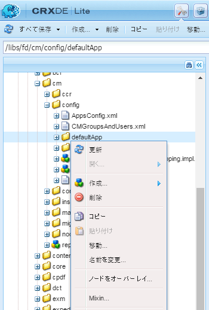
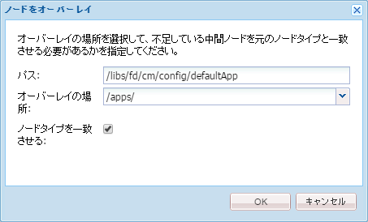
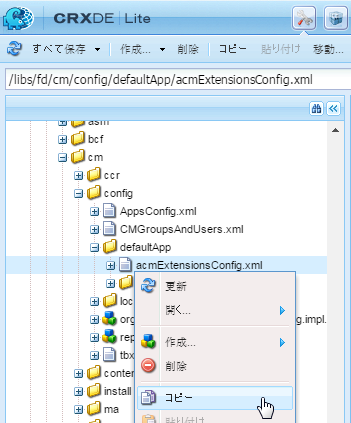
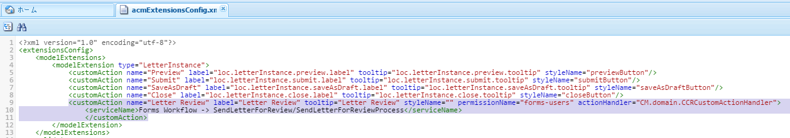
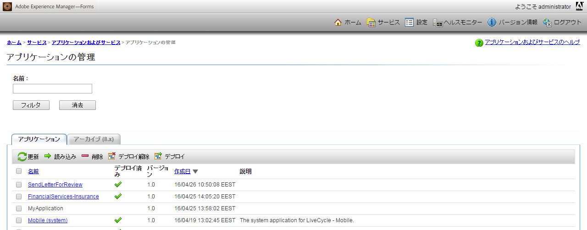
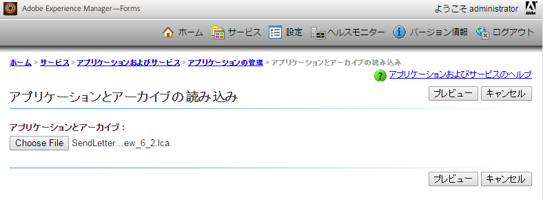

# 「通信を作成」UI へのカスタムアクションまたはボタンの追加{#add-custom-action-button-in-create-correspondence-ui}

## 概要 {#overview}

Correspondence Management ソリューションでは、「通信を作成」UI にカスタムアクションを追加できます。

このドキュメントのシナリオでは、通信を作成ユーザーインターフェイスでボタンを作成して、レターをレビュー用のPDFとして電子メールに添付して共有する方法を説明します。

### 前提条件 {#prerequisites}

このシナリオを完了するには、以下が必要になります。

* CRX および JavaScript についての知識
* LiveCycle サーバー

## シナリオ：通信を作成ユーザーインターフェイスにボタンを作成してレビュー用のレターを送信する {#scenario-create-the-button-in-the-create-correspondence-user-interface-to-send-a-letter-for-review}

通信を作成ユーザーインターフェイスにボタンを追加して、ボタンのアクション（ここではレビュー用のレターの送信）を指定するには、次の操作を行います。

1. 通信を作成ユーザーインターフェイスにボタンを追加します
1. ボタンにアクション処理を追加します
1. LiveCycle プロセスを追加してアクション処理を有効化します

### 通信を作成ユーザーインターフェイスへのボタンの追加 {#add-the-button-to-the-create-correspondence-user-interface}

1. Go to `https://'[server]:[port]'/[ContextPath]/crx/de` and login as Administrator.
1. In the apps folder, create a folder named `defaultApp` with path/structure similar to the defaultApp folder (located in config folder). フォルダーの作成手順は次のとおりです。

   1. Right-click the **defaultApp** folder at the following path and select **Overlay Node**:

      /libs/fd/cm/config/defaultApp/

      

   1. ノードをオーバーレイダイアログに次の値が表示されていることを確認します。

      **パス：** /libs/fd/cm/config/defaultApp/

      **オーバーレイの場所：** /apps/

      **ノードタイプを一致：** チェック済み

      

   1. 「**OK**」をクリックします。
   1. 「**すべて保存**」をクリックします。

1. acmExtensionsConfig.xml ファイル（/libs branch の下）のコピーを /apps branch の下に作成します。

   1. 「/libs/fd/cm/config/defaultApp/acmExtensionsConfig.xml」に移動します。

   1. Right click the acmExtensionsConfig.xml file and select **Copy**.

      

   1. 「/apps/fd/cm/config/defaultApp/」にある **defaultApp** フォルダーを右クリックし、「**貼り付け**」を選択します。
   1. 「**すべて保存**」をクリックします。

1. apps フォルダーで新しく作成した acmExtentionsConfig.xml のコピーをダブルクリックします。ファイルが開いて編集可能になります。
1. 次のコードを検索します。

   ```xml
   <?xml version="1.0" encoding="utf-8"?>
   <extensionsConfig>
       <modelExtensions>
           <modelExtension type="LetterInstance">
     <customAction name="Preview" label="loc.letterInstance.preview.label" tooltip="loc.letterInstance.preview.tooltip" styleName="previewButton"/>
               <customAction name="Submit" label="loc.letterInstance.submit.label" tooltip="loc.letterInstance.submit.tooltip" styleName="submitButton" permissionName="forms-users"/>
               <customAction name="SaveAsDraft" label="loc.letterInstance.saveAsDraft.label" tooltip="loc.letterInstance.saveAsDraft.tooltip" styleName="submitButton" permissionName="forms-users"/>
               <customAction name="Close" label="loc.letterInstance.close.label" tooltip="loc.letterInstance.close.tooltip" styleName="closeButton"/>
           </modelExtension>
       </modelExtensions>
   </extensionsConfig>
   ```

1. レターを電子メールで送信するには、LiveCycle Forms ワークフローを使用します。次のよ追加うに、acmExtensionsConfig.xmlのmodelExtensionタグの下にcustomActionタグがあります。

   ```xml
    <customAction name="Letter Review" label="Letter Review" tooltip="Letter Review" styleName="" permissionName="forms-users" actionHandler="CM.domain.CCRCustomActionHandler">
         <serviceName>Forms Workflow -> SendLetterForReview/SendLetterForReviewProcess</serviceName>
       </customAction>
   ```

   

   modelExtension タグには、アクションボタンのアクション、権限、外観を設定する customAction 子タグのセットが含まれています。以下は customAction 設定タグの一覧です。

   | **名前** | **説明** |
   |---|---|
   | name | 実行するアクションの英数字による名前。 このタグの値は必須です。modelExtension タグ内で一意であり、アルファベットで始まる必要があります。 |
   | label | アクションボタンに表示するラベル。 |
   | tooltip | ボタンのツールチップテキスト。ボタンにカーソルを置くと表示されます。 |
   | styleName | アクションボタンに適用するカスタムスタイルの名前。 |
   | permissionName | 対応するアクションは、ユーザーがpermissionNameで指定された権限を持つ場合にのみ表示されます。 When you specify permissionName as `forms-users`, all the users get access to this option. |
   | actionHandler | ユーザーがボタンをクリックしたときに呼び出されるActionHandlerクラスの完全修飾名です。 |

   上記のパラメーター以外に、customAction には追加の設定を関連付けることができます。これらの追加の設定は、CustomActionオブジェクトを通じてハンドラーで使用できます。

   | **名前** | **説明** |
   |---|---|
   | serviceName | customActionにserviceNameという名前の子タグが含まれている場合、関連するボタンまたはリンクをクリックすると、serviceNameタグで表される名前でプロセスが呼び出されます。 このプロセスの署名がLetter PostProcessと同じであることを確認します。 サービス名に「Forms Workflow ->」プレフィックスを追加します。 |
   | タグ名にcm_プレフィックスが含まれるパラメーター | customActionに名前cm_で始まる子タグが含まれる場合、後処理（レター後処理か、serviceNameタグで表される特別な処理）では、これらのパラメーターは、cm_プレフィックスが削除された関連タグの下の入力XMLコードで使用できます。 |
   | actionName | クリックが後処理に発生した場合は常に、送信されたXMLには、ユーザーアクションの名前を持つタグの下に、名前の付いた特別なタグが含まれます。 |

1. 「**すべて保存**」をクリックします。

#### /apps branch 内のプロパティファイルを使用したローカルフォルダーの作成 {#create-a-locale-folder-with-properties-file-in-the-apps-branch}

ACMExtensionsMessages.propertiesファイルには、通信を作成ユーザーインターフェイスの様々なフィールドのラベルとツールチップメッセージが含まれています。 カスタマイズしたアクションやボタンを機能させるために、/apps branch にこのファイルのコピーを作成します。

1. Right-click the **locale** folder at the following path and select **Overlay Node**:

   /libs/fd/cm/config/defaultApp/locale

1. ノードをオーバーレイダイアログに次の値が表示されていることを確認します。

   **パス：** /libs/fd/cm/config/defaultApp/locale

   **オーバーレイの場所：** /apps/

   **ノードタイプを一致：** チェック済み

1. 「**OK**」をクリックします。
1. 「**すべて保存**」をクリックします。
1. Right-click the following file and select **Copy**:

   `/libs/fd/cm/config/defaultApp/locale/ACMExtensionsMessages.properties`

1. 次のパスにある **locale** フォルダーを右クリックし、「**貼り付け**」を選択します。

   `/apps/fd/cm/config/defaultApp/locale/`

   ACMExtensionsMessages.properties ファイルがローカルフォルダーにコピーされます。

1. To localize the labels of the newly added custom action/button, create the ACMExtensionsMessages.properties file for the relevant locale in `/apps/fd/cm/config/defaultApp/locale/`.

   たとえば、この記事で作成したカスタムアクションまたはボタンをローカライズするには、次のエントリを使用して ACMExtensionsMessages_fr.properties という名前のファイルを作成します。

   `loc.letterInstance.letterreview.label=Revue De Lettre`

   同様に、このファイルにツールチップやスタイルなどのプロパティを追加することもできます。

1. 「**すべて保存**」をクリックします。

#### Adobe Asset Composer 構築ブロックバンドルの再起動 {#restart-the-adobe-asset-composer-building-block-bundle}

サーバー側の変更をすべて加えた後、Adobe Asset Composer 構築ブロックバンドルを再起動します。このシナリオでは、サーバー側のacmExtensionsConfig.xmlファイルとACMExtensionsMessages.propertiesファイルが編集されるので、Adobe Asset Composer構築ブロックバンドルを再起動する必要があります。

>[!NOTE]
>
>ブラウザーのキャッシュをクリアする必要が生じる場合があります。

1. `https://[host]:'port'/system/console/bundles` にアクセスします。必要に応じて、管理者としてログインします。

1. Adobe Asset Composer 構築ブロックバンドルを検索します。バンドルを再起動します。「停止」をクリックした後、「開始」をクリックします。

   

Adobe Asset Composer 構築ブロックバンドルを再起動した後、通信を作成ユーザーインターフェイスにカスタムボタンが表示されます。通信を作成ユーザーインターフェイスでレターを開いて、カスタムボタンをプレビューできます。

### ボタンへのアクション処理の追加 {#add-action-handling-to-the-button}

通信を作成ユーザーインターフェイスはデフォルトで、次の場所にある cm.domain.js ファイルの ActionHandler を実装します。

/libs/fd/cm/ccr/gui/components/admin/clientlibs/ccr/js/cm.domain.js

カスタムのアクション処理の場合は、CRX の /apps branch にある cm.domain.js ファイルのオーバーレイを作成します。

アクションやボタンをクリックしたときのアクションやボタンの処理には、次のロジックが含まれます。

* 新しく追加したアクションを表示または非表示にする：actionVisible() 関数をオーバーライドして実行します。
* 新しく追加したアクションを有効または無効にする： actionEnabled()関数をオーバーライドして実行します。
* ユーザーがボタンをクリックした場合の実際のアクションの処理： handleAction()関数の実装をオーバーライドして実行します。

1. `https://'[server]:[port]'/[ContextPath]/crx/de` にアクセスします。必要に応じて、管理者としてログインします。

1. apps フォルダーに、次のフォルダーに類似した構造で、CRX の /apps branch に `js` という名前のフォルダーを作成します。

   `/libs/fd/cm/ccr/gui/components/admin/clientlibs/ccrui/js`

   フォルダーの作成手順は次のとおりです。

   1. Right-click the **js** folder at the following path and select **Overlay Node**:

      `/libs/fd/cm/ccr/gui/components/admin/clientlibs/ccrui/js`

   1. ノードをオーバーレイダイアログに次の値が表示されていることを確認します。

      **パス：** /libs/fd/cm/ccr/gui/components/admin/clientlibs/ccrui/js

      **オーバーレイの場所：** /apps/

      **ノードタイプを一致：** チェック済み

   1. 「**OK**」をクリックします。
   1. 「**すべて保存**」をクリックします。

1. 次の手順を使用して、ccrcustomization.jsという名前のファイルをjsフォルダーに作成し、ボタンのアクション処理のコードを指定します。

   1. Right-click the **js** folder at the following path and select **Create > Create File**:

      `/apps/fd/cm/ccr/gui/components/admin/clientlibs/ccrui/js`

      ファイルに ccrcustomization.js という名前を付けます。

   1. ccrcustomization.js ファイルをダブルクリックして、CRX で開きます。
   1. ファイルに次のコードを貼り付けて、「**すべて保存**」をクリックします。

      ```javascript
      /* for adding and handling custom actions in Extensible Toolbar.
        * One instance of handler will be created for each action.
        * CM.domain.CCRCustomActionHandler is actionHandler class.
        */
      var CCRCustomActionHandler;
          CCRCustomActionHandler = CM.domain.CCRCustomActionHandler = new Class({
              className: 'CCRCustomActionHandler',
              extend: CCRDefaultActionHandler,
              construct : function(action,model){
              }
          });
          /**
           * Called when user user click an action
           * @param extraParams additional arguments that may be passed to handler (For future use)
           */
          CCRCustomActionHandler.prototype.handleAction = function(extraParams){
              if (this.action.name == CCRCustomActionHandler.SEND_FOR_REVIEW) {
                  var sendForReview = function(){
                      var serviceName = this.action.actionConfig["serviceName"];
                      var inputParams = {};
                      inputParams["dataXML"] = this.model.iccData.data;
                      inputParams["letterId"] = this.letterVO.id;
                      inputParams["letterName"] = this.letterVO.name;
                      inputParams["mailId"] = $('#email').val();
                      /*function to invoke the LivecyleService */
                      ServiceDelegate.callJSONService(this,"lc.icc.renderlib.serviceInvoker.json","invokeProcess",[serviceName,inputParams],this.onProcessInvokeComplete,this.onProcessInvokeFail);
                      $('#ccraction').modal("hide");
                  }
                  if($('#ccraction').length == 0){
                      /*For first click adding popup & setting letterName.*/
                      $("body").append(popUp);
                      $("input[id*='letterName']").val(this.letterVO.name);
                      $(document).on('click',"#submitLetter",$.proxy( sendForReview, this ));
                  }
                  $('#ccraction').modal("show");
              }
          };
          /**
           * Should the action be enabled in toolbar
           * @param extraParams additional arguements that may be passed to handler (For future use)
           * @return flag indicating whether the action should be enabled
           */
         CCRCustomActionHandler.prototype.actionEnabled = function(extraParams){
                  /*can be customized as per user requirement*/
                  return true;
          };
          /**
           * Should the action be visible in toolbar
           * @param extraParams additional arguments that may be passed to handler (For future use)
           * @return flag indicating whether the action should be enabled
           */
          CCRCustomActionHandler.prototype.actionVisible = function(extraParams){
              /*Check can be enabled for Non-Preview Mode.*/
              return true;
          };
          /*SuccessHandler*/
          CCRCustomActionHandler.prototype.onProcessInvokeComplete = function(response) {
              ErrorHandler.showSuccess("Letter Sent for Review");
          };
          /*FaultHandler*/
          CCRCustomActionHandler.prototype.onProcessInvokeFail = function(event) {
              ErrorHandler.showError(event.message);
          };
          CCRCustomActionHandler.SEND_FOR_REVIEW  = "Letter Review";
      /*For PopUp*/
          var popUp = '<div class="modal fade" id="ccraction" tabindex="-1" role="dialog" aria-hidden="true">'+
          '<div class="modal-dialog modal-sm">'+
              '<div class="modal-content">' +
                  '<div class="modal-header">'+
                      '<button type="button" class="close" data-dismiss="modal" aria-label="Close"><span aria-hidden="true">&times;</code></button>'+
                      '<h4 class="modal-title"> Send Review </h4>'+
                  '</div>'+
                  '<div class="modal-body">'+
                      '<form>'+
                          '<div class="form-group">'+
                              '<label class="control-label">Email Id</label>'+
                              '<input type="text" class="form-control" id="email">'+
                          '</div>'+
                          '<div class="form-group">'+
                              '<label  class="control-label">Letter Name</label>'+
                              '<input id="letterName" type="text" class="form-control" readonly>'+
                          '</div>'+
                          '<div class="form-group">'+
                              '<input id="letterData" type="text" class="form-control hide" readonly>'+
                          '</div>'+
                      '</form>'+
                  '</div>'+
                  '<div class="modal-footer">'+
                     '<button type="button" class="btn btn-default" data-dismiss="modal"> Cancel </button>'+
                     '<button type="button" class="btn btn-primary" id="submitLetter"> Submit </button>'+
                  '</div>'+
              '</div>'+
          '</div>'+
      '</div>';
      ```

### LiveCycle プロセスの追加によるアクション<span class="acrolinxCursorMarker"></code>処理の有効化 {#add-the-livecycle-process-to-enable-action-span-class-acrolinxcursormarker-span-handling}

このシナリオでは、次のコンポーネントを有効にします。これらのコンポーネントは、添付されたcomponents.zipファイルの一部です。

* DSC コンポーネント jar（DSCSample.jar）
* レビュープロセス LCA（SendLetterForReview.lca）用の送信レター

components.zipファイルをダウンロードして解凍し、DSCSample.jarファイルとSendLetterForReview.lcaファイルを取得します。 これらのファイルは、次の手順に従って使用します。components.zip

#### LiveCycle サーバーの設定と LCA プロセスの実行 {#configure-the-livecycle-server-to-run-the-lca-process}

>[!NOTE]
>
>この手順は、OSGI設定を使用し、実装するカスタマイズのタイプにLC統合が必要な場合にのみ必要です。

LCA プロセスは LiveCycle サーバー上で実行され、サーバーアドレスとログイン情報が必要になります。

1. Go to `https://'[server]:[port]'/system/console/configMgr` and login as Administrator.
1. Adobe LiveCycle Client SDK Configuration を見つけて、「**編集**」（編集アイコン）をクリックします。「設定」パネルが開きます。

1. Enter the following details and click **Save**:

   * **Server Url**: アクションハンドラーコードが使用するSend For ReviewサービスのLCサーバーのURLです。
   * **ユーザー名**: LCサーバーの管理者ユーザー名
   * **パスワード**：管理者ユーザー名のパスワード

   

#### Install LiveCycle Archive (LCA) {#install-livecycle-archive-lca}

電子メールサービスプロセスを有効にするために必要なLiveCycleプロセス。

>[!NOTE]
>
>このプロセスの処理を表示するか、独自の類似プロセスを作成するには、Workbench が必要になります。

1. Log in as Administrator to Livecycle Server adminui at `https:/[lc server]/:[lc port]/adminui`.

1. **ホーム／サービス／アプリケーションおよびサービス／アプリケーションの管理**&#x200B;に移動します。

1. SendLetterForReviewアプリケーションが既に存在する場合は、この手順の残りの手順をスキップします。存在しない場合は、次の手順に進みます。

   

1. 「**読み込み**」をクリックします。

1. Click **Choose File** and select SendLetterForReview.lca.

   

1. 「**プレビュー**」をクリックします。

1. Select **Deploy assets to runtime when import is complete**.

1. 「**読み込み**」をクリックします。

#### Adding ServiceName to the Allowlist Service list {#adding-servicename-to-the-allowlist-service-list}

AEM サーバーにアクセスする必要のある LiveCycle サービスを AEM サーバーで指定します。

1. 管理者としてにログインし `https:/[host]:'port'/system/console/configMgr`ます。

1. Locate and click **Adobe LiveCycle Client SDK Configuration**. Adobe LiveCycle Client SDK Configurationパネルが表示されます。
1. In the Service Name list, click + icon and add a serviceName **SendLetterForReview/SendLetterForReviewProcess**.

1. 「**保存**」をクリックします。

#### 電子メールサービスの設定 {#configure-the-email-service}

このシナリオでは、Correspondence Management で電子メールを送信できるようにするため、LiveCycle サーバーで電子メールサービスを設定します。

1. Log in with Admin credentials to Livecycle Server adminui at `https:/[lc server]:[lc port]/adminui`.

1. **ホーム／サービス／アプリケーションおよびサービス／サービスの管理**&#x200B;に移動します。

1. 「**電子メールサービス**」を検索してクリックします。

1. In **SMTP Host**, configure the email service.

1. 「**保存**」をクリックします。

#### DSC サービスの設定 {#configure-the-dsc-service}

Correspondence Management APIを使用するには、DSCSample.jar(このドキュメントに添付されているcomponents.zipに含まれています)をダウンロードし、LiveCycleサーバーにアップロードします。 DSCSample.jarファイルがLiveCycleサーバーにアップロードされると、AEMサーバーはDSCSample.jarファイルを使用してrenderLetter APIにアクセスします。

For more information, see [Connecting AEM Forms with Adobe LiveCycle](/help/forms/using/aem-livecycle-connector.md).

1. DSCSample.jarのcmsa.propertiesでAEMサーバーのURLを更新します。次の場所にあります。

   DSCSample.jar\com\adobe\livecycle\cmsa.properties

1. 設定ファイルに次のパラメーターを指定します。

   * **crx.serverUrl**=https:/host:port/[context path]/[AEM URL]
   * **crx.username**= AEM ユーザー名
   * **crx.password**= AEMパスワード
   * **crx.appRoot**=/content/apps/cm

   >[!NOTE]
   >
   >サーバー側で変更を加えるたびに LiveCycle サーバーは再起動します。独自の LiveCycle コンポーネントの作成について詳しくは、「[カスタムの DSC 開発を通じた LiveCycle ES ソフトウェアの拡張](https://www.adobe.com/devnet/livecycle/articles/dsc_development.html)」を参照してください。

   DSCSample.jarファイルはrenderLetter APIを使用します。 For more Information about the renderLetter API, see [Interface LetterRenderService](https://helpx.adobe.com/aem-forms/6-1/javadocs/com/adobe/icc/ddg/api/LetterRenderService.html).

#### LiveCyle への DSC の読み込み {#import-dsc-to-livecyle}

DSCSample.jarファイルはrenderLetter APIを使用して、Cが入力として与えたXMLデータからのPDFバイトとしてレターをレンダリングします。 renderLetter およびその他の API について詳しくは、「[レターのレンダリングサービス](https://helpx.adobe.com/aem-forms/6-1/javadocs/com/adobe/icc/ddg/api/LetterRenderService.html)」を参照してください。

1. Livecycle Workbenchを起動してログインします。
1. **Window/Show表示/Componentsを選択します**。 

1. Right-click **Components** and select **Install Component**.

1. Select the **DSCSample.jar** file through the file browser and click **Open**.
1. Right-click **RenderWrapper** and select **Start Component**. コンポーネントが起動すると、コンポーネント名の横に緑色の矢印が表示されます。

## レビュー用のレターの送信 {#send-letter-for-review}

レビュー用のレターを送信するためのアクションとボタンを設定した後、次の操作を行います。

1. ブラウザーのキャッシュをクリアします。

1. In the Create Correspondence UI, click **Letter Review** and specify the reviewer&#39;s email ID.

1. 「**送信**」をクリックします。


レビュー担当者は、PDF ファイルとして添付されたレターが含まれる電子メールを受信します。
