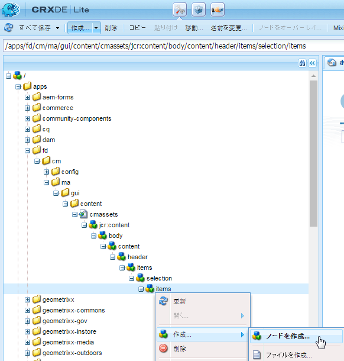
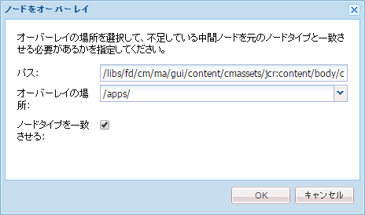
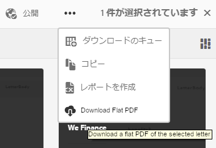

# アセット一覧表示画面へのカスタムアクションの追加{#add-custom-action-to-the-asset-listing-view}

## 概要 {#overview}

Correspondence Management ソリューションでは、「アセットを管理」UI にカスタムアクションを追加できます。

次のカスタムアクションをアセット一覧表示画面に追加できます。

* 1 つ以上のアセットタイプまたはレター。
* 1 つまたは複数のアセット／レター選択時の実行アクション（アクション／コマンドをアクティブにする）、または非選択時の実行アクション。

このカスタマイズの使用事例として、レターのアセット一覧表示画面に「Download Flat PDF」コマンドを追加するシナリオが示されます。このカスタマイズのシナリオを活用し、ユーザーが選択した 1 つのレターのフラット PDF をダウンロードできるようにします。

### 前提条件 {#prerequisites}

以下で説明するシナリオまたは同様のシナリオを完了するには、次の知識が必要になります。

* CRX
* JavaScript
* Java

## シナリオ：レターリストの UI にコマンドを追加してレターのフラットな PDF 版をダウンロードする {#addcommandtoletters}

次の手順でレターのアセット一覧画面に「Download Flat PDF」コマンドを追加し、選択されたレターのフラットな PDF のダウンロードをユーザに許可することができます。これらの手順で適切なコードとパラメーターを使用することで、データディクショナリやテキストなどこれ以外のアセットにその他の機能を追加することもできます。

Correspondence Management をカスタマイズしてレターのフラットな PDF のダウンロードをユーザーに許可するには、以下の手順を実行します。

1. `https://'[server]:[port]'/[ContextPath]/crx/de` にアクセスし、管理者としてログインします。

1. 次の手順で、apps フォルダーに、selection フォルダー内の items フォルダーに類似したパス／構造で items という名前のフォルダーを作成します。

   1. 次のパスにある **items** フォルダーを右クリックし、「**ノードをオーバーレイ**」を選択します。

      `/libs/fd/cm/ma/gui/content/cmassets/jcr:content/body/content/header/items/selection/items`

      >[!NOTE]
      >
      >このパスは、1 つまたはそれ以上のアセット／レターの選択時に機能するアクションを作成する際に使用されます。選択を行わなくても機能するアクションを作成する場合は、代わりに次のパスにオーバーレイノードを作成し、それに応じて残りの手順を完了します。
      >
      >
      >`/libs/fd/cm/ma/gui/content/cmassets/jcr:content/body/content/header/items/default/items`

      

   1. ノードをオーバーレイダイアログに次の値が表示されていることを確認します。

      **パス：** /libs/fd/cm/ma/gui/content/cmassets/jcr:content/body/content/header/items/selection/items

      **場所：** /apps/

      **ノードタイプを一致させる：**&#x200B;選択済み

      

   1. 「**OK**」をクリックします。apps フォルダーにフォルダー構造が作成されます。

      「**すべて保存**」をクリックします。

1. 次の手順を使用し、新規作成した items フォルダーに特定のアセットのカスタムのボタン／アクション用のノードを追加します（例：downloadFlatPDF）。

   1. **items**&#x200B;フォルダーを右クリックし、**作成**／**ノードを作成**&#x200B;を選択します。

   1. ノードを作成ダイアログに次の値が表示されていることを確認し、「**OK**」をクリックします。

      **名前：** downloadFlatPDF（または、このプロパティに与える任意の名前）

      **型：** nt:unstructured

   1. 新しく作成したノードをクリックします（ここでは downloadFlatPDF）。CRX にノードのプロパティが表示されます。

   1. 次のプロパティをノード（ここでは downloadFlatPDF）に追加し、「**すべて保存**」をクリックします。

      <table>
        <tbody>
        <tr>
        <td><strong>名前</strong></td>
        <td><strong>型</strong></td>
        <td><strong>値と説明</strong></td>
        </tr>
        <tr>
        <td>class</td>
        <td>文字列</td>
        <td>foundation-collection-action</td>
        </tr>
        <tr>
        <td>foundation-collection-action</td>
        <td>文字列</td>
        <td><p>{"target": ".cq-manageasset-admin-childpages", "activeSelectionCount": "single","type": "LETTER"}<br /> <br /> <br /> <strong>activeSelectionCount</strong> は、単一または複数に設定し、カスタムアクションが実行されるアセットとして、単一または複数のアセットの選択を許可できます。</p> <p><strong>type</strong> は次のうち 1 つまたは複数（複数の場合はカンマ区切り）です。LETTER,TEXT,LIST,CONDITION,DATADICTIONARY</p> </td>
        </tr>
        <tr>
        <td>icon</td>
        <td>文字列</td>
        <td>icon-download<br /> <br />Correspondence Management のコマンド／メニューの左側に表示されるアイコンです。使用できるその他のアイコンと設定については、<a href="https://helpx.adobe.com/experience-manager/6-3/sites/developing/using/reference-materials/coral-ui/coralui3/Coral.Icon.html" target="_blank">CoralUI Icons ドキュメント</a>を参照してください。<br /> </td>
        </tr>
        <tr>
        <td>jcr:primaryType</td>
        <td>名前</td>
        <td>nt:unstructured</td>
        </tr>
        <tr>
        <td>rel</td>
        <td>文字列</td>
        <td>download-flat-pdf-button</td>
        </tr>
        <tr>
        <td>sling:resourceType</td>
        <td>文字列</td>
        <td>granite/ui/components/endor/actionbar/button</td>
        </tr>
        <tr>
        <td>text</td>
        <td>文字列</td>
        <td>Download Flat PDF（または任意のラベル）<br /> <br />アセット一覧表示のインターフェイスに表示されるコマンド。</td>
        </tr>
        <tr>
        <td>title</td>
        <td>文字列</td>
        <td>Download a flat PDF of the selected letter（または任意のラベルや代替テキスト）<br /> <br />このタイトルは、カスタムコマンドの上にカーソルを置いたときに Correspondence Management に表示される代替テキストです。</td>
        </tr>
        </tbody>
       </table>

1. 次の手順で、apps フォルダーに、admin フォルダー内の items フォルダーに類似したパス／構造で js という名前のフォルダーを作成します。

   1. 次のパスにある **js** フォルダーを右クリックし、「**ノードをオーバーレイ**」を選択します。

      `/libs/fd/cm/ma/gui/components/admin/clientlibs/admin/js`

   1. ノードをオーバーレイダイアログに次の値が表示されていることを確認します。

      **パス：** /libs/fd/cm/ma/gui/components/admin/clientlibs/admin/js

      **場所：** /apps/

      **ノードタイプを一致させる：**&#x200B;選択済み

   1. 「**OK**」をクリックします。apps フォルダーにフォルダー構造が作成されます。「**すべて保存**」をクリックします。

1. 次の手順を使用し、formaction.js という名前のファイルを js フォルダーに作成し、ボタンのアクション処理のコードを指定します。

   1. 次のパスにある **js**&#x200B;フォルダーを右クリックし、**作成／ファイルを作成**&#x200B;を選択します。

      `/apps/fd/cm/ma/gui/components/admin/clientlibs/admin/js`

      ファイルに formaction.js という名前を付けます。

   1. ファイルをダブルクリックして、CRX で開きます。
   1. formaction.js ファイル（/apps 階層の下）で、formaction.js ファイルのコードを次の場所にコピーします。

      `/libs/fd/cm/ma/gui/components/admin/clientlibs/admin/js/formaction.js`

      次に、formaction.js（/apps 階層の下）ファイルの最後に以下のコードを追加し、「**すべて保存**」をクリックします。

      ```javascript
      /* Action url for xml file to be added.*/
      var ACTION_URL = "/apps/fd/cm/ma/gui/content/commons/actionhandlers/items/letterpdfdownloader.html";
      
      /* File upload handling*/
      var fileSelectedHandler = function(e){
          if(e && e.target && e.target.value)
              $(".downloadLetterPDFBtn").removeAttr('disabled');
          else
              $(".downloadLetterPDFBtn").attr('disabled','disabled');
      }
      
      /*Handing of Download button in pop up.*/
      var downloadClickHandler = function(){
          $('#downloadLetterPDFDilaog').modal("hide");
          var element = $('.foundation-selections-item');
          var path = $(element).data("path");
          $("#fileUploadForm").attr('action', ACTION_URL + "?letterId="+path).submit();
      }
      
      /*Click handling on action button.*/
      $(document).on("click",'.download-flat-pdf-button',function(e){
          $("#uploadSamepledata").val("");
           if($('#downloadLetterPDFDilaog').length == 0){
              $(document).on("click",".downloadLetterPDFBtn",downloadClickHandler);
              $(document).on("change","#uploadSamepledata",fileSelectedHandler);
              $("body").append(downloadLetterPDFDilaog);
          }
            $('#downloadLetterPDFDilaog').modal("show");
      });
      
      /*Download popup.*/
      var downloadLetterPDFDilaog = '<div id="downloadLetterPDFDilaog" class="coral-Modal notice " role="dialog"  aria-hidden="true">'+
          '<form id="fileUploadForm" method="POST" enctype="multipart/form-data">'+
              '<div class="coral-Modal-header">'+
                  '<h2 class="coral-Modal-title coral-Heading coral-Heading--2" id="modal-header1443020790107-label" tabindex="0">Download Letter as PDF.</h2>'+
                  '<button type="button" class="coral-MinimalButton coral-Modal-closeButton" data-dismiss="modal">×</button>'+
              '</div>'+
              '<div class="coral-Modal-body" id="modal-header1443020790107-message" role="document" tabindex="0">'+
                  '<div class="coral-Modal-message">'+
                      '<p></p>'+
                  '</div>'+
                  '<div class="coral-Modal-uploader">'+
                      '<p>Select sample data for letter.</p>'+
                      '<input type="file" id="uploadSamepledata" name="file" accept=".xml" size="70px">'+
                  '</div>'+
              '</div>'+
           '</form>'+
              '<div class="coral-Modal-footer">'+
                  '<button type="button" class="coral-Button" data-dismiss="modal">Cancel</button>'+
                  '<button type="button" class="coral-Button coral-Button--primary downloadLetterPDFBtn" disabled="disabled">Download</button>'+
              '</div>'+
      '</div>';
      ```

      この手順で追加するコードは libs フォルダーのコードを上書きします。そのため、変更前のコードを /apps 階層の formaction.js ファイルにコピーしてください。/libs 階層から /apps 階層にコードをコピーすることでも変更前の機能を保持することができます。

      上記のコードは、この手順で作成されたレターごとのコマンド処理のアクションに使用されます。その他のアセットの処理を行うアクションについては、JavaScript コードを変更してください。

1. 次の手順で、apps フォルダーに、actionhandlers フォルダー内の items フォルダーに類似したパス／構造で items という名前のフォルダーを作成します。

   1. 次のパスにある **items** フォルダーを右クリックし、「**ノードをオーバーレイ**」を選択します。

      `/libs/fd/cm/ma/gui/content/commons/actionhandlers/items/`

   1. ノードをオーバーレイダイアログに次の値が表示されていることを確認します。

      **パス：** /libs/fd/cm/ma/gui/content/commons/actionhandlers/items/

      **場所：** /apps/

      **ノードタイプを一致させる：**&#x200B;選択済み

   1. 「**OK**」をクリックします。apps フォルダーにフォルダー構造が作成されます。

   1. 「**すべて保存**」をクリックします。

1. 次の手順で、新しく作成した items ノードに、特定のアセットのカスタムのボタン／アクション用のノードを追加します（例：letterpdfdownloader）。

   1. items フォルダーを右クリックして、「**作成／ノードを作成**」を選択します。

   1. ノードを作成ダイアログに次の値が表示されていることを確認し、「**OK**」をクリックします。

      **名前：** letterpdfdownloader（またはこのプロパティに与える任意の名前。一意の名前である必要があります。これ以外の名前を使用する場合、formaction.js ファイルの ACTION_URL の変数にも同一の名前を指定する必要があります）。

      **型：** nt:unstructured

   1. 新しく作成したノードをクリックします（ここでは downloadFlatPDF）。CRX にノードのプロパティが表示されます。

   1. 次のプロパティをノード（ここでは letterpdfdownloader）に追加し、「**すべて保存**」をクリックします。

      | **名前** | **種類** | **値** |
      |---|---|---|
      | sling:resourceType | 文字列 | fd/cm/ma/gui/components/admin/clientlibs/admin |

1. 次の場所に、コマンドのアクション処理のコードを指定した POST.jsp という名前のファイルを作成します。

   /apps/fd/cm/ma/gui/components/admin/clientlibs/admin

   1. 次のパスにある **admin** フォルダーを右クリックし、**作成／ファイルを作成**&#x200B;を選択します

      /apps/fd/cm/ma/gui/components/admin/clientlibs/admin

      ファイルに POST.jsp という名前を付けます。（POST.jsp 以外のファイル名を使用しないでください）。

   1. **POST.jsp** ファイルをダブルクリックして、CRX で開きます。
   1. POST.jsp ファイルに次のコードを追加して、「**すべて保存**」をクリックします。

      このコードはレターのレンダリングサービスに固有のコードです。その他のアセットに関しては、このコードにアセットの Java ライブラリを追加してください。AEM Forms API について詳しくは、「[AEM Forms API](https://adobe.com/go/learn_aemforms_javadocs_63)」を参照してください。

      AEM ライブラリについて詳しくは、AEM [コンポーネント](/help/sites-developing/components.md)を参照してください。

      ```xml
      /*Import libraries. Here we are downloading letter flat pdf with input xml data so we require letterRender Api. For any other Module functionality we need to first import that library. */
      <%@include file="/libs/foundation/global.jsp"%>
      <!DOCTYPE html lang="en" PUBLIC "-//W3C//DTD XHTML 1.1//EN" "https://www.w3.org/TR/xhtml11/DTD/xhtml11.dtd">
      <%@page import="com.adobe.icc.ddg.api.*"%>
      <%@page import="com.adobe.icc.dbforms.obj.*"%>
      <%@page import="com.adobe.icc.render.obj.*" %>
      <%@page import="com.adobe.icc.services.api.*" %>
      <%@page import="org.apache.sling.api.resource.*" %>
      <%@page import="java.io.File" %>
      <%@page import="java.util.*" %>
      <%@page import="com.adobe.livecycle.content.appcontext.AppContextManager"%>
      <%@page import=" com.adobe.icc.dbforms.exceptions.ICCException"%>
      <%@page import="java.io.InputStream" %>
      <%@page import="java.io.FileInputStream" %>
      <%@page import="org.apache.commons.io.IOUtils" %>
      <%@page session="false" contentType="text/html; charset=utf-8"%>
      <%@taglib prefix="sling" uri="https://sling.apache.org/taglibs/sling/1.0"%>
      <%@taglib prefix="cq" uri="https://www.day.com/taglibs/cq/1.0" %>
       <%@page session="false" contentType="text/html; charset=utf-8"%>
      <%
         AppContextManager.setCurrentAppContext("/content/apps/cm");
         /*Get letter id sent in js file.*/
          String letterId = request.getParameter("letterId");
          if(letterId.lastIndexOf("?") != -1)
              letterId = letterId.substring(0, letterId.indexOf("?"));
          String fileName = null;
          String letterName = null;
          InputStream inputStream = null;
          /*Get xml file data*/
          if (slingRequest.getRequestParameter("file") != null)
              inputStream = slingRequest.getRequestParameter("file").getInputStream();
          if(letterId != null){
              String xmlData = null;
              try{
                  xmlData = IOUtils.toString(inputStream, "UTF-8");
              }
              catch (Exception e) {
                  log.error("Xml data does not exists.");
              }
              /*letter Name from letter letter id.*/
              letterName = letterId.substring(letterId.lastIndexOf("/")+1);
              /*Invoking letter render services API.*/
              LetterRenderService letterRenderService = sling.getService(LetterRenderService.class);
              /*using CM renderLetter api to get pdfbytes.*/
              PDFResponseType  pdfResponseType= letterRenderService.renderLetter(letterId,xmlData,true,false,false,false);
              byte[] bytes = null;
              /*Downloading pdf bytes as pdf.*/
              if(pdfResponseType != null && pdfResponseType.getFile() != null){
                  bytes = pdfResponseType.getFile().getDocument();
                  /*set the response header to enable download*/
                  response.setContentType("application/OCTET-STREAM");
                  response.setHeader("Content-Disposition", "attachment;filename=\"" + letterName + ".pdf\"");
                  response.setHeader("Pragma", "cache");
                  response.setHeader("Cache-Control", "private");
                  out.clear();
                  response.getOutputStream().write(bytes);
              }
          }
          else{
              log.error("Letter id does not exists.");
          }
      %>
      ```

## カスタム機能によるレターのフラットな PDF のダウンロード {#download-flat-pdf-of-a-letter-using-the-custom-functionality}

レターのフラットな PDF のダウンロード用にカスタム機能を追加した後、次の手順を使用して、選択したレターのフラットな PDF 版をダウンロードできます。

1. `https://'[server]:[port]'/[ContextPath]/projects.html` に移動し、ログインします。

1. **Forms／レター**&#x200B;を選択します。Correspondence Management によってシステムで使用可能なレターが一覧表示されます。
1. 「**選択**」をクリックし、選択するレターをクリックします。
1. **詳細**／**&lt;Download Flat PDF>**（この記事の解説に従って作成したカスタム機能）を選択します。PDF でレターをダウンロードするダイアログが表示されます。

   メニュー項目名、機能、代替テキストは、[レターのフラットな PDF バージョンをダウンロードするためのコマンドをレターリストのユーザーインターフェイスに追加するシナリオ](#addcommandtoletters)で作成したカスタマイズに準じます。

   

1. 「PDF でレターをダウンロード」ダイアログで、PDF に入力するデータから関連する XML を選択します。

   >[!NOTE]
   >
   >フラットな PDF としてレターをダウンロードする前に、「**レポートの作成**」オプションで、レターのデータを保持した状態の XML ファイルを作成することができます。

   

   フラットな PDF としてレターがコンピューターにダウンロードされます。
