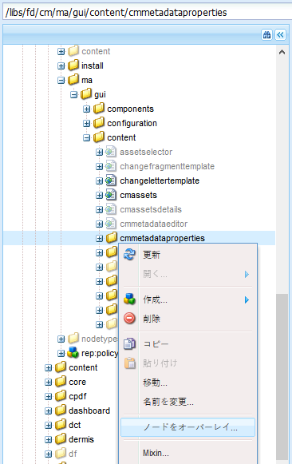

# Correspondence Management アセットへのカスタムプロパティの追加{#add-custom-properties-to-correspondence-management-assets}

## 概要 {#overview}

Correspondence Management ユーザーインターフェイスをカスタマイズし、調整したプロパティとタブのセットをユーザーに提示できます。このカスタマイズには、特定のアセットタイプ/レター、またはすべてのアセットタイプとレターに、カスタムフィールド/プロパティとタブを追加することが含まれます。

## Correspondence Management アセットへのカスタムプロパティの追加 {#adding-custom-properties-to-correspondence-management-assets}

以下のシナリオで、Correspondence Management アセットおよびレターにプロパティ／タブを追加する方法について説明します。

* すべてのアセットタイプへの共通プロパティの追加
* すべてのアセットタイプへの共通タブの追加
* 特定のアセットタイプへのカスタムプロパティの追加

これらのシナリオでプロパティ、パスおよび値を調整することにより、要件に従い、様々なアセットのセットにカスタムプロパティおよびタブを追加できます。

### シナリオ：すべてのアセットタイプへの共通フィールド（プロパティ）の追加  {#scenario-adding-a-common-field-property-to-all-the-asset-types}

このシナリオでは、すべてのアセットタイプ（テキスト、リスト、条件およびレイアウトフラグメント）およびレターにカスタムプロパティを追加する方法について説明します。このシナリオを使用すると、すべてのアセットとレターにプロパティ(受信者の場所)を追加できます。 受信者の場所プロパティは、アセットやレターが関連する配信の地理的な領域を識別するのに役立ちます。

>[!NOTE]
>
>カスタムプロパティを追加すると、プロパティはアセット作成ページに表示されるようになります。このようなプロパティを非表示にする方法については、「アセット作成ページとプロパティページでのカスタムプロパティの表示／非表示」を参照してください。


すべてのアセットタイプおよびレターにカスタムプロパティを追加するには、次の手順を実行します。

1. `https://'[server]:[port]'/[ContextPath]/crx/de`に移動し、管理者としてログインします。
1. 次の手順を使用して、appsフォルダーに、名前「css」のフォルダーを作成し、ccruiフォルダー内のcssフォルダーに類似したパス/構造を持ちます。

   1. 次のパスにあるitemsフォルダーを右クリックし、「**ノードをオーバーレイ**」を選択します。

      `/libs/fd/cm/ma/gui/content/cmmetadataproperties/commonproperties/col1/items`

      

   1. ノードをオーバーレイダイアログに次の値が表示されていることを確認します。

      **パス：** /libs/fd/cm/ma/gui/content/cmmetadataproperties/commonproperties/col1/items

      **場所：** /apps/

      **ノードタイプを一致：** 選択

      

   1. 「**OK**」をクリックします。apps フォルダーにフォルダー構造が作成されます。

   1. 「**すべて保存**」をクリックします。

1. 新しく作成したitemsフォルダーの下で、すべてのアセットのカスタムプロパティのノードを追加します(例：GeoLocationを参照)を使用します。

   1. items フォルダーを右クリックして、「**作成**／**ノードを作成**」を選択します。

      

   1. ノードを作成ダイアログに次の値が表示されていることを確認し、「**OK**」をクリックします。

      **名前：** GeoLocation（またはこのプロパティに与える名前）

      **Type:** nt:unstructured

      

   1. 作成した新しいノード（ここでは「GeoLocation」）をクリックします。CRX にノードのプロパティが表示されます。
   1. このノード（ここでは「GeoLocation」）に次のプロパティを追加します。

      | **名前** | **種類** | **値** |
      |---|---|---|
      | fieldLabel | String | フィールド／プロパティに与える任意の名前。（ここでは「Location of recipients」） |
      | name | 文字列 | `./extendedproperties/GeoLocation` （値は、itemsノードの下で作成したフィールド名と同じにします）。 |
      | renderReadOnly | Boolean | true |
      | sling:resourceType | 文字列 | `granite/ui/components/coral/foundation/form/textfield` |

   1. 「**すべて保存**」をクリックします。

1. カスタマイズ内容を表示するには、アセット（テキスト、リスト、条件またはレイアウトフラグメント）またはレターの上にカーソルを置き、「**プロパティを表示**」をクリックし、「**編集**」をクリックします。新しいフィールド（Location of recipients）がアセット／レタープロパティの「基本」タブに表示されます。

   >[!NOTE]
   >
   >カスタマイズ内容を UI に表示するには、ブラウザーのキャッシュをクリアする必要が生じる場合があります。

   

   >[!NOTE]
   >
   >すべてのアセットに追加する共通プロパティは、アセットプロパティの「基本」タブに表示されます。デフォルトでは、すべてのアセットに追加する共通プロパティは、プロパティページおよびアセット作成ページに表示されます。共通のプロパティを非表示にするには、<!--link to show / hide properties]-->が必要です。

### シナリオ：カスタムプロパティ／フィールドへのカスタムドロップダウンおよび値の追加 {#scenario-add-custom-drop-down-and-values-to-a-custom-property-field}

このシナリオでは、すべてのアセットタイプにカスタムプロパティを追加し、そのドロップダウン値を追加する方法について説明します。

1. 次のパスにあるitemsフォルダーを右クリックし、「**ノードをオーバーレイ**」を選択します。

   `/libs/fd/cm/ma/gui/content/cmmetadataproperties/commonproperties/col1/items`

1. 新しく作成されたオーバーレイノード(/apps/fd/cm/ma/gui/content/cmmetadataproperties/commonproperties/col1/items)の下
各プロパティ（フィールド）に対してノードを作成し、nt:unstructuredタイプのドロップダウン（ここでは`geographicallocation`）を作成する必要があります。
1. 次のプロパティをノード（ここでは「geographicallocation」）に追加し、「**すべて保存**」をクリックします。

   <table>
   <tbody>
   <tr>
      <td><strong>名前</strong></td>
      <td><strong>タイプ</strong></td>
      <td><strong>値</strong></td>
   </tr>
   <tr>
      <td>fieldLabel</td>
      <td>文字列</td>
      <td>フィールド／プロパティに与える任意の名前。（ここでは「geographicallocation」）</td>
   </tr>
   <tr>
      <td>name</td>
      <td>文字列</td>
      <td>。/extendedproperties/geographicallocation（値は、itemsノードの下で作成したフィールド名と同じにします）</td>
   </tr>
   <tr>
      <td>renderReadOnly</td>
      <td>ブール値</td>
      <td>true</td>
   </tr>
   <tr>
      <td>sling:resourceType</td>
      <td>文字列</td>
      <td>granite/ui/components/coral/foundation/form/select<br /> </td>
   </tr>
   </tbody>
   </table>

1. プロパティノード（ここでは「geographicallocation」）に、`items` という名前の新しいノードを追加します。items ノードに、ドロップダウン内の各値のノードを追加します。ドロップダウンのデフォルト値およびユーザーがフィールドに値を指定しないためのオプションとして機能するように、最初のノードを空白として追加することをお勧めします。複数のオプション／ドロップダウン値を追加するには、次の手順を繰り返します。

   1. プロパティノード（ここでは「geographicallocation」）を右クリックし、**作成**/**ノードを作成**&#x200B;を選択します。
   1. フィールドの名前を`item1,` retain type as nt:unstructuredと入力し、「**OK**」をクリックします。
   1. 新しく追加作成されたノード（ここではitem1）に対する次のプロパティを指定し、「**すべて保存**」をクリックします。

      <table>
         <tbody>
         <tr>
          <td><strong>名前</strong></td>
          <td><strong>タイプ</strong></td>
          <td><strong>値</strong></td>
         </tr>
         <tr>
          <td>text</td>
          <td>文字列</td>
          <td>これは、ユーザーに表示されるドロップダウンオプションの値です。空白（デフォルト）値の場合は空白のままにします。または、「<strong>海外</strong>」、「<strong>米国内</strong>」などの値を入力します。<br /> </td>
         </tr>
         <tr>
          <td>value</td>
          <td>文字列</td>
          <td>テキストのCRXDEに格納される値。 一意のキーワードを入力します。<br /> </td>
         </tr>
         </tbody>
   </table>

   

カスタムドロップダウンは、アセットプロパティで次のように表示されます。


### シナリオ：すべてのアセットタイプ用の共通タブ {#scenario-common-tab-for-all-asset-types}

このシナリオでは、すべてのアセットタイプ（テキスト、リスト、条件およびレイアウトフラグメント）およびレターにカスタムタブ「Recipients」を追加する方法について説明します。「Recipients」タブに、受信者に関連するすべてのカスタムプロパティを配置することができます。


次の手順を使用して、すべてのアセットにフィールド付きのタブを追加できます。

1. `https://'[server]:[port]'/[ContextPath]/crx/de`に移動し、管理者としてログインします。
1. 次の手順を使用して、appsフォルダーにcmmetadatapropertiesという名前のフォルダーを作成し、コンテンツフォルダー内のcmmetadatapropertiesフォルダーに類似したパスや構造を持ちます。

   1. 次のパスにあるcmmetadatapropertiesフォルダーを右クリックし、「**ノードをオーバーレイ**」を選択します。

      `/libs/fd/cm/ma/gui/content/cmmetadataproperties`

      

   1. ノードをオーバーレイダイアログに次の値が表示されていることを確認します。

      **パス：** /libs/fd/cm/ma/gui/content/cmmetadataproperties

      **場所：** /apps/

      **ノードタイプを一致：** 選択

   1. 「**OK**」をクリックします。apps フォルダーにフォルダー構造が作成されます。

      

      「**すべて保存**」をクリックします。

1. cmmetadatapropertiesフォルダーの下で、すべてのアセット用のカスタムタブを作成するためのノードを追加します(例：commontab)を次の手順で使用します。

   1. cmmetadataproperties フォルダーを右クリックして、「**作成**／**ノードを作成**」を選択します。

      

   1. ノードを作成ダイアログに次の値が表示されていることを確認し、「**OK**」をクリックします。

      **名前：** commontab（またはこのプロパティに与える名前）

      **Type:** nt:unstructured

   1. 新しく作成したノードをクリックします（ここでは「commontab」）。CRX にノードのプロパティが表示されます。
   1. このノード（ここでは「commontab」）に次のプロパティを追加します。

      <table>
         <tbody>
         <tr>
          <td><strong>名前</strong></td>
          <td><strong>タイプ</strong></td>
          <td><strong>値</strong></td>
         </tr>
         <tr>
          <td>jcr:title</td>
          <td>文字列</td>
          <td>列に与える任意の名前。（ここでは「Recipients」）</td>
         </tr>
         <tr>
          <td>sling:resourceType</td>
          <td>文字列</td>
          <td>granite/ui/components/coral/foundation/container<br /> </td>
   </tr>
         </tbody>
       </table>

   1. 「**すべて保存**」をクリックします。

1. 次の手順を使用し、最後の手順で作成したタブノード（ここでは「commontab」）に対して item という名前のノードを作成します。

   1. 関連ノード（ここでは「commontab」）を右クリックし、「**作成**／**ノードを作成**」を選択します。
   1. ノードを作成ダイアログに次の値が表示されていることを確認し、「**OK**」をクリックします。

      **名前：** items

      **Type:** nt:unstructured

   1. 「**すべて保存：**」をクリックします。

1. 前の手順（「コモンタブ」の下）で作成した項目ノードで、次の手順（列を追加するには、この手順を繰り返します）を使用して、カスタムタブ（「コモン」タブ）に列を作成するノード（ここでは「列1」）を追加します。

   1. items ノードを右クリックし、「**作成**／**ノードを作成**」を選択します。
   1. ノードを作成ダイアログに次の値が表示されていることを確認し、「**OK**」をクリックします。

      **名前：** 列1（またはノードに付ける名前。この名前はユーザーインターフェイスに表示されません）

      **Type:** nt:unstructured

   1. 次の追加プロパティをノード（ここの列1）に追加し、「**すべて保存**」をクリックします。

      <table>
         <tbody>
         <tr>
           <td><strong>名前</strong></td>
           <td><strong>タイプ</strong></td>
           <td><strong>値</strong></td>
         </tr>
         <tr>
           <td>sling:resourceType</td>
           <td>文字列</td>
           <td>granite/ui/components/coral/foundation/コンテナ<br /> </td>
         </tr>
         </tbody>
       </table>

1. 前の手順（ここでは「Column1」）で作成したノードで、次の手順を使用して「items」というノードを追加します。

   1. ノード（ここでは「Column1」）を右クリックし、「**作成**／**ノードを作成**」を選択します。
   1. ノードを作成ダイアログに次の値が表示されていることを確認し、「**OK**」をクリックします。

      **名前：** items

      **Type:** nt:unstructured

   1. 「**すべて保存**」をクリックします。

1. カスタムタブ（ここでは「Recipients」）にフィールドを作成するには、ノード（ここでは「GeographicalLocation」）を追加します。このプロパティは、作成した列に対応します。フィールドの作成手順は次のとおりです（さらにフィールド／ノードを作成するには、この手順を繰り返します）。：

   1. items ノードを右クリックし、「**作成**／**ノードを作成**」を選択します。
   1. ノードを作成ダイアログに次の値が表示されていることを確認し、「**OK**」をクリックします。

      **名前：** GeographicalLocation（または、フィールドプロパティの別の名前）

      **Type:** nt:unstructured

   1. 次のプロパティをフィールドノード（ここでは GeographicalLocation）に追加し、「**すべて保存**」をクリックします。

      | **名前** | **種類** | **値** |
      |---|---|---|
      | fieldLabel | 文字列 | Location of recipients（または、フィールドに与える任意の名前。） |
      | name | 文字列 | 。/extendedproperties/GeographicalLocation |
      | renderReadOnly | ブール値 | true |
      | sling:resourceType | 文字列 | `/libs/granite/ui/components/coral/foundation/form/textfield` |

1. レターにこのタブを追加するには、次のパスにある以下の items フォルダーに類似したパス／構造でオーバーレイフォルダーを作成します。

   `/libs/fd/cm/ma/gui/content/cmmetadataproperties/properties/letter/items/tabs/items`

   レターまたは別のアセットにオーバーレイを作成するには、[assettype]をテキスト、条件、リスト、データディクショナリまたはフラグメントに置き換えて、次のパスを使用します。

   `/libs/fd/cm/ma/gui/content/cmmetadataproperties/properties/[assettype]/items/tabs/items`

   1. 次のパスにあるitemsフォルダーを右クリックし、「**ノードをオーバーレイ**」を選択します。

      `/libs/fd/cm/ma/gui/content/cmmetadataproperties/properties/letter/items/tabs/items`

   1. ノードをオーバーレイダイアログに次の値が表示されていることを確認します。

      **パス:** `/libs/fd/cm/ma/gui/content/cmmetadataproperties/properties/letter/items/tabs/items`

      **場所：** /apps/

      **ノードタイプを一致：** 選択

   1. 「**OK**」をクリックします。フォルダーが作成されます。「**すべて保存**」をクリックします。

1. 次の手順を使用して、新しく作成したitemsフォルダーに、アセットのカスタムタブのノードを追加します（ここではmytab — この名前はユーザーインターフェイスに表示されません）。

   1. items フォルダーを右クリックして、「**作成**／**ノードを作成**」を選択します。
   1. ノードを作成ダイアログに次の値が表示されていることを確認し、「**OK**」をクリックします。

      **名前：** mytab（または、このプロパティに与える任意の名前）

      **Type:** nt:unstructured

   1. 新しく作成したノードをクリックします（ここでは「mytab」）。CRX にノードのプロパティが表示されます。
   1. このノード（ここでは「customtab」）に次の 2 つのプロパティを追加します。

      <table>
         <tbody>
         <tr>
           <td><strong>名前</strong></td>
           <td><strong>タイプ</strong></td>
           <td><strong>値</strong></td>
         </tr>
         <tr>
           <td>パス<br /> </td>
           <td>文字列</td>
           <td>fd/cm/ma/gui/content/cmmetadataproperties/commontab<br /> </td>
         </tr>
         <tr>
           <td>sling:resourceType</td>
           <td>文字列</td>
           <td>granite/ui/components/coral/foundation/include<br /> </td>
         </tr>
         </tbody>
       </table>

   1. 「**すべて保存**」をクリックします。

1. カスタマイズ内容を表示するには、関連するアセット（ここではレター）の上にカーソルを置き、「プロパティを表示」をクリックし、「**編集**」をクリックします。新しいタブ（Recipients）とフィールド（Location of Recipients）がユーザーインターフェイスに表示されます。

   >[!NOTE]
   >
   >カスタマイズ内容を UI に表示するには、ブラウザーのキャッシュをクリアする必要が生じる場合があります。

   

### シナリオ：特定のアセットタイプのカスタムプロパティの追加 {#scenario-adding-custom-properties-for-specific-asset-types}

このシナリオでは、すべてのテキストアセットに対するフィールドなど、特定のアセットタイプにプロパティを追加する方法について説明します。このプロセスを使用して、次のいずれかにプロパティを追加できます。

* テキスト
* 条件
* リスト
* レイアウトフラグメント
* データディクショナリ
* レター

例えば、テキストアセットにのみプロパティ「受信者の場所」を追加して、アセットが関連する地理的な領域を識別します。  

アセットタイプにプロパティを追加するには、次の手順を実行します。

1. `https://'[server]:[port]'/[ContextPath]/crx/de`に移動し、管理者としてログインします。
1. アセットタイプ（テキストなど）にタブを作成するには、appsフォルダーに次のフォルダー構造を作成します。

   `/libs/fd/cm/ma/gui/content/cmmetadataproperties/properties/[AssetType]/items/tabs/items`

   [AssetType] =テキスト、条件、リスト、レター、データディクショナリまたはフラグメント

   次の手順に従って、このフォルダー構造を作成します。

   1. 次のパスにあるitemsフォルダーを右クリックし、「**ノードをオーバーレイ**」を選択します。

      `/libs/fd/cm/ma/gui/content/cmmetadataproperties/properties/[AssetType]/items/tabs/items`

      例えば、テキストアセットのプロパティを作成する場合は、次のフォルダーを選択します。

      `/libs/fd/cm/ma/gui/content/cmmetadataproperties/properties/text/items/tabs/items`

      

   1. ノードをオーバーレイダイアログに次の値が表示されていることを確認します。

      **パス：** /libs/fd/cm/ma/gui/content/cmmetadataproperties/properties/[AssetType]/items/tabs/items

      **場所：** /apps/

      **ノードタイプを一致：** 選択

   1. 「**OK**」をクリックします。apps フォルダーにフォルダー構造が作成されます。

      「**すべて保存**」をクリックします。

1. 新しく作成したitemsフォルダーに、アセットのカスタムタブのノードを追加します(例：customtab)を次の手順で使用します。

   1. items フォルダーを右クリックして、「**作成**／**ノードを作成**」を選択します。
   1. ノードを作成ダイアログに次の値が表示されていることを確認し、「**OK**」をクリックします。

      **名前：** customtab（または、このプロパティに与える任意の名前）

      **Type:** nt:unstructured

   1. 新しく作成したノードをクリックします（ここでは「customtab」）。CRX にノードのプロパティが表示されます。
   1. このノード（ここでは「customtab」）に次の 2 つのプロパティを追加します。

      | **名前** | **種類** | **値** |
      |---|---|---|
      | sling:resourceType | 文字列 | granite/ui/components/coral/foundation/container |
      | jcr:title | 文字列 | ユーザーインターフェイス上のフィールドの名前（ここでは「My tab」） |

   1. 「**すべて保存**」をクリックします。

1. 前の手順で作成したノード（ここでは「customtab」）で、次の手順を使用して「items」というノードを追加します。

   1. ノード（ここでは「customtab」）を右クリックし、「**作成**／**ノードを作成**」を選択します。
   1. ノードを作成ダイアログに次の値が表示されていることを確認し、「**OK**」をクリックします。

      **名前：** items

      **Type:** nt:unstructured

   1. 「**すべて保存**」をクリックします。

1. 前の手順（「customtab」の下）で作成した項目ノードで、次の手順（列を追加するには、この手順を繰り返します）を使用して、「カスタム」タブに列（ここでは「列1」）を作成するノードを追加します。

   1. items ノードを右クリックし、「**作成**／**ノードを作成**」を選択します。
   1. ノードを作成ダイアログに次の値が表示されていることを確認し、「**OK**」をクリックします。

      **名前：** 列1（またはノードに付ける名前）

      **Type:** nt:unstructured

   1. 次の追加プロパティをノード（ここの列1）に追加し、「**すべて保存**」をクリックします。

      <table>
         <tbody>
         <tr>
           <td><strong>名前</strong></td>
           <td><strong>タイプ</strong></td>
           <td><strong>値</strong></td>
         </tr>
         <tr>
           <td>sling:resourceType</td>
           <td>文字列</td>
           <td>granite/ui/components/coral/foundation/コンテナ<br /> </td>
         </tr>
         </tbody>
       </table>

1. 作成する各列（前の手順 — ここでは「Column1」で指定）に対して、次の手順を使用してitemというノードを作成します。

   1. 関連する列ノード（ここでは「Column1」）を右クリックし、「**作成**／**ノードを作成**」を選択します。
   1. ノードを作成ダイアログに次の値が表示されていることを確認し、「**OK**」をクリックします。

      **名前：** items

      **Type:** nt:unstructured

   1. 「**すべて保存：**」をクリックします。

1. 作成した各列で、items ノードに、ユーザーインターフェイス内の新しいタブにフィールドを作成するためのノードを作成します。列でさらにフィールドを作成するには、この手順を繰り返します。

   1. 関連ノード（ここでは「Column1」の下の「items」）を右クリックし、「**作成**／**ノードを作成**」を選択します。
   1. ノードを作成ダイアログに次の値が表示されていることを確認し、「**OK**」をクリックします。

      **名前：** 任意の名前（ここでは「GeoLocation」）

      **Type:** nt:unstructured

   1. 次のプロパティをノードに追加して、「**すべて保存**」をクリックします。

      | **名前** | **種類** | **値** |
      |---|---|---|
      | fieldLabel | 文字列 | Location of recipients（または、フィールドに与える任意の名前。） |
      | name | 文字列 | `./extendedproperties/GeoLocation` |
      | renderReadOnly | ブール値 | true |
      | sling:resourceType | 文字列 | granite/ui/components/coral/foundation/form/textfield |

1. カスタマイズ内容を表示するには、関連するアセット（ここではテキスト）の上にカーソルを置き、「プロパティを表示」をクリックし、「**編集**」をクリックします。新しいタブとフィールド（Location of Recipients）がユーザーインターフェイスに表示されます。

   >[!NOTE]
   >
   >カスタマイズ内容を UI に表示するには、ブラウザーのキャッシュをクリアする必要が生じる場合があります。

   

### アセット作成ページでのカスタムプロパティの表示 {#display-custom-properties-on-the-asset-creation-page}

デフォルトでは、新しいタブに追加されたカスタムプロパティは、プロパティページにのみ表示され、アセット作成ページには表示されません。アセット作成ページにはタブレイアウトがないためです。 アセット作成ページに他のプロパティと共にカスタムプロパティを表示するには、次の手順を実行する必要があります。

1. 次のパスにあるitemsフォルダーを右クリックし、「**ノードをオーバーレイ**」を選択します。

   `/libs/fd/cm/ma/gui/content/createasset/createletter/jcr:content/body/items/form/items/letterWizard/items/properties/items/properties/items/letterproperties/items`

1. ノードをオーバーレイダイアログで、レターに次の値が表示されていることを確認します。他のアセットタイプのパスは以下の表に示されています。

   **パス：** /libs/fd/cm/ma/gui/content/createasset/createletter/jcr:content/body/items/form/items/letterWizard/items/properties/items/properties/items/letterproperties/items

   **場所：** /apps/

   **ノードタイプを一致：** 選択

   アセットの種類に応じたパスを使用する必要があります。

   | **アセット／ドキュメントタイプ** | **追加するパス** |
   |---|---|
   | テキスト | /libs/fd/cm/ma/gui/content/createasset/createtext/jcr:content/body/items/form/items/textwizard/items/editproperties/items/properties/items/tabs/items/tab1/items |
   | リスト | /libs/fd/cm/ma/gui/content/createasset/createlist/jcr:content/body/items/form/items/listwizard/items/editproperties/items/properties/items/tabs/items/tab1/items |
   | 条件 | /libs/fd/cm/ma/gui/content/createasset/createcondition/jcr:content/body/items/form/items/conditionwizard/items/editproperties/items/properties/items/tabs/items/tab1/items |
   | フラグメント | /libs/fd/cm/ma/gui/content/createasset/createfragment/jcr:content/body/items/form/items/fragmentwizard/items/properties/items/properties/items/tabs2/items/tab1/items |
   | レター | /libs/fd/cm/ma/gui/content/createasset/createletter/jcr:content/body/items/form/items/letterWizard/items/properties/items/properties/items/letterproperties/items |

1. 「**OK**」をクリックします。apps フォルダーにフォルダー構造が作成されます。

1. 作成したoverlay itemsノードの下に、col4（または他の名前）という名前のノードを作成し、「**すべて保存**」をクリックします。

   例えば、以下は、レターに対して作成されたオーバーレイノードです。

   `/apps/fd/cm/ma/gui/content/createasset/createletter/jcr:content/body/items/form/items/letterWizard/items/properties/items/properties/items/letterproperties/items`

1. 次のプロパティを新しく作成したノード（ここでは「col4」）に追加し、「**すべて保存**」をクリックします。

<table>
 <tbody>
  <tr>
   <td><strong>名前</strong></td>
   <td><strong>タイプ</strong></td>
   <td><strong>値</strong></td>
  </tr>
  <tr>
   <td>path</td>
   <td>文字列</td>
   <td><p>このパスは、以下の場所で作成された列へのポインターです。</p>
    <ul>
     <li>すべてのアセットタイプの共通タブ：/apps/fd/cm/ma/gui/content/cmmetadataproperties/commontab/items/col1</li>
     <li>アセットタイプごとに異なるプロパティを設定するには、次の手順に従います。/apps/fd/cm/ma/gui/content/cmmetadataproperties/properties//items/tabs/items/customtab/items/col1</li>
    </ul> </td>
  </tr>
  <tr>
   <td>sling:resourceType</td>
   <td>文字列</td>
   <td> granite/ui/components/coral/foundation/include<br /> </td>
  </tr>
 </tbody>
</table>


レターを作成するための UI に表示される、カスタムプロパティ、言語

## カスタムプロパティを表示するための一覧表示のカスタマイズ  {#customize-the-list-view-to-show-custom-properties}

Correspondence Management アセットにカスタムプロパティを追加した後、CRX/DE でさらに変更を行って、カスタムプロパティが Correspondence Management UI に表示されるようにする必要があります。

次の手順を実行して、Correspondence ManagementのアセットリストUIにカスタムプロパティを表示します。

1. `https://'[server]:[port]'/[ContextPath]/crx/de`に移動し、管理者としてログインします。
1. apps フォルダーに以下のフォルダー構造を作成します。

   `/libs/fd/cm/ma/gui/content/cmassets/jcr:content/views/lists/columns`

   次の手順に従って、このフォルダー構造を作成します。

   1. 次のパスにあるcolumnsフォルダーを右クリックし、「**ノードをオーバーレイ**」を選択します。

      `/libs/fd/cm/ma/gui/content/cmassets/jcr:content/views/lists/columns`

   1. ノードをオーバーレイダイアログに次の値が表示されていることを確認します。

      **パス：** /libs/fd/cm/ma/gui/content/cmassets/jcr:content/表示/リスト/columns

      **場所：** /apps/

      **ノードタイプを一致：** 選択

   1. 「**OK**」をクリックします。apps フォルダーにフォルダー構造が作成されます。

      「**すべて保存**」をクリックします。

1. 作成した各プロパティで、columns ノードに、ユーザーインターフェイス内に列を作成するためのノードを作成します。UI でさらに列を作成するには、この手順を繰り返します。

   1. 関連ノード（ここでは「columns」）を右クリックし、「**作成**／**ノードを作成**」を選択します。
   1. ノードを作成ダイアログに次の値が表示されていることを確認し、「**OK**」をクリックします。

      **名前：** 選択した名前（ここでは「GeographicalLocation」）

      **Type:** nt:unstructured

   1. 次のプロパティをノードに追加して、「**すべて保存**」をクリックします。

      <table>
         <tbody>
         <tr>
           <td><strong>名前</strong></td>
           <td><strong>タイプ</strong></td>
           <td><strong>値</strong></td>
         </tr>
         <tr>
           <td>jcr:primaryType</td>
           <td>名前</td>
           <td><p>nt:unstructured</p> </td>
         </tr>
         <tr>
           <td>jcr:title</td>
           <td>文字列</td>
           <td><p>GeographicalLocation</p> <p>この値は、UI に列ヘッダーとして表示されます。 </p> </td>
         </tr>
         <tr>
           <td>sortable</td>
           <td>ブール値</td>
           <td><p>true</p> <p>値を「true」に設定した場合、ユーザーはこの列内の値を並べ替えることができます。 </p> </td>
         </tr>
         </tbody>
       </table>

1. apps フォルダーに以下のフォルダー構造を作成します。

   `/libs/fd/cm/ma/gui/components/admin/childpagerenderer/childlistpage`

   次の手順に従って、このフォルダー構造を作成します。

   1. 次のパスにあるcolumnsフォルダーを右クリックし、「**ノードをオーバーレイ**」を選択します。

      `/libs/fd/cm/ma/gui/components/admin/childpagerenderer/childlistpage`

   1. ノードをオーバーレイダイアログに次の値が表示されていることを確認します。

      **パス：** /libs/fd/cm/ma/gui/components/admin/childpagerenderer/childlistpage

      **場所：** /apps/

      **ノードタイプを一致：** 選択

   1. 「**OK**」をクリックします。apps フォルダーにフォルダー構造が作成されます。

      「**すべて保存**」をクリックします。

1. childlistpage.jspファイルを次の場所からコピーします。

   /libs/fd/cm/ma/gui/components/admin/childpagerenderer/childlistpage/childlistpage.jsp

   このファイルを次の場所に貼り付けます。

   /apps//fd/cm/ma/gui/components/admin/childpagerenderer/childlistpage/.

1. childlistpage.jsp ファイル（/apps/fd/cm/ma/gui/components/admin/childpagerenderer/childlistpage/childlistpage.jsp）を開き、次のように変更します。

   1. ファイルの 19 行目に以下を追加します（著作権情報の後）。

      ```jsp
      <%@page import="java.util.Map"%>
      ```

   1. ファイルの末尾に、各カスタムプロパティの値を取得する以下の関数コードを追加します。

      ```jsp
      <%!
          private String getCustomPropertyValue(Map<String, Object> extendedProperties, String propertyName) {
      
              String propertyValue = "";
              if (extendedProperties.containsKey(propertyName)) {
                  propertyValue = (String) extendedProperties.get(propertyName);
              }
      
              return propertyValue;
          }
      %>
      ```

   1. &lt;tr>タグの開始追加前に次のように記述します(&lt;tr &lt;%= attrs.build() %>)。

      ```jsp
      <%
          String GeoLocation = "";
          if (asset != null) {
                  Map<String, Object> extendedProperties = asset.getExtendedProperties();
                  if (extendedProperties != null) {
                      GeoLocation = getCustomPropertyValue(extendedProperties,"GeoLocation");
                  }
          }
      %>
      ```

      コード内の GeoLocation は、カスタムノード／フィールドの作成時に名前プロパティで設定した値です。カスタムノード／フィールドの作成時、プロパティの名前を /extendedproperties/ prefix: ./extendedproperties/GeoLocation で指定しました。コードの prefix は必須ではありません。

   1. UIに新しいプロパティを表示するには、次のようにTDタグを終了tr(&lt;/tr>)タグの前に追加します。

      ```jsp
      <td is="coral-td" value="<%= xssAPI.encodeForHTMLAttr(geographicalLocation) %>"><%= xssAPI.encodeForHTML(geographicalLocation) %></td>
      ```

      さらに列を追加するには、手順 6.3 と 6.4 を繰り返します。

   1. 「**すべて保存**」をクリックします。

1. カスタマイズ内容を表示するには、カスタムプロパティを追加したドキュメントフラグメント（レター）の一覧表示を開きます。

   この手順で追加した UI 列およびプロパティは、すべてのアセットタイプで表示されます。ただし、これらのプロパティの値は、最初にカスタムプロパティを追加したアセットタイプに対してのみ入力および表示できます。

   例えば、シナリオを使用する場合：特定のアセットタイプに対してカスタムプロパティを追加し、カスタムプロパティをテキストアセットに追加する場合は、カスタムプロパティを入力できるのはテキストアセットに対してのみです。 ただし、そのカスタムプロパティを UI に表示する場合、列はすべてのアセットタイプで表示されます。

   

1. （オプション）デフォルトでは、新しい列は、UI で最後の列として表示されます。列を特定の位置に表示するには、次のプロパティを列ノードに追加します。

<table>
 <tbody>
  <tr>
   <td><strong>名前</strong></td>
   <td><strong>タイプ</strong></td>
   <td><strong>値</strong></td>
  </tr>
  <tr>
   <td>sling:orderBefore</td>
   <td>文字列</td>
   <td><p>パス「/libs/fd/cm/ma/gui/content/cmassets/jcr:content/views/list/columns」にある列ノードの名前。カスタム列は UI でこのノードの前に表示されます。</p> <p>ここで、Geographical Location 列を Version 列の前（左側）に表示する場合は、プロパティ sling:orderBefore をパス「/apps/fd/cm/ma/gui/content/cmassets/jcr:content/views/list/columns/GeoLocation」にある GeoLocation ノードに追加し、プロパティの値を version に設定します。</p> </td>
  </tr>
 </tbody>
</table>

sling:orderBefore プロパティを追加して列の位置を指定する場合は、この手順の手順 6.4 で指定した、対応する &lt;td> タグの順序も更新する必要があります。例えば、この場合、Geographical Location の &lt;td> タグを Version 列の &lt;td> タグの前に配置する必要があります。

```xml
<td is="coral-td" value="<%= xssAPI.encodeForHTMLAttr(geographicalLocation) %>"><%= xssAPI.encodeForHTML(geographicalLocation) %></td>
<td is="coral-td" value="<%= xssAPI.encodeForHTMLAttr(version) %>"><%= xssAPI.encodeForHTML(version) %></td>
```

## カスタムプロパティの検索の有効化  {#enable-search-for-custom-properties}

デフォルトでは、フルテキスト検索には、CRX/DE を使用して UI に追加するカスタムプロパティは含まれません。

カスタムプロパティを検索に含めるには、カスタムプロパティのインデックス作成を可能にする必要があります。

カスタムプロパティのインデックス作成を可能にするには、次の手順を実行します。

1. `https://'[server]:[port]'/[ContextPath]/crx/de`に移動し、管理者としてログインします。
1. `/oak:index/cmLucene`に移動し、**集計**&#x200B;という名前のノードをその下に追加します。

   1. cmLucene フォルダーを右クリックして、「**作成**／**ノードを作成**」を選択します。
   1. ノードを作成ダイアログに次の値が表示されていることを確認し、「**OK**」をクリックします。

      **名前：** aggregates

      **Type:** nt:unstructured

   1. 「**すべて保存**」をクリックします。

1. 新しく作成した集計フォルダーの下に、ノードcm:resourceを追加します。 cm:resource の下に、include0 という名前のノードを追加します。

   1. aggregates フォルダーを右クリックして、「**作成**／**ノードを作成**」を選択します。ノードを作成ダイアログに次の値が表示されていることを確認し、「**OK**」をクリックします。

      **名前：** cm:resource

      **Type:** nt:unstructured

   1. cm:resourceフォルダーを右クリックし、**作成**/**ノードを作成**&#x200B;を選択します。 ノードを作成ダイアログに次の値が表示されていることを確認し、「**OK**」をクリックします。

      **名前：** include0

      **Type:** nt:unstructured

   1. 新しく作成したノードをクリックします（ここでは「include0」）。CRX にノードのプロパティが表示されます。
   1. このノード（ここでは「include0」）に次のプロパティを追加します。

      <table>
         <tbody>
         <tr>
           <td><strong>名前</strong></td>
           <td><strong>タイプ</strong></td>
           <td><strong>値</strong></td>
         </tr>
         <tr>
           <td>path</td>
           <td>文字列</td>
           <td>extendedProperties<br /> </td>
         </tr>
         </tbody>
       </table>

   1. 「**すべて保存**」をクリックします。

1. 次の場所にあるプロパティに移動し、その下にノードの場所を追加します。`/oak:index/cmLucene/indexRules/cm:resource/properties`

   検索に追加する各カスタムプロパティについて、この手順を繰り返します。

   1. properties フォルダーを右クリックして、「**作成**／**ノードを作成**」を選択します。
   1. ノードを作成ダイアログに次の値が表示されていることを確認し、「**OK**」をクリックします。

      **名前：** 場所（または検索に追加するカスタムプロパティの名前）

      **Type:** nt:unstructured

   1. 作成した新しいノード（ここでは「location」）をクリックします。CRX にノードのプロパティが表示されます。
   1. このノード（ここでは「location」）に次のプロパティを追加します。

      | **名前** | **種類** | **値** |
      |---|---|---|
      | analyzed | 文字列 | true |
      | name | 文字列 | extendedProperties/location（または、検索に追加するプロパティの名前） |
      | propertyIndex | ブール値 | true |
      | useInSuggest | ブール値 | true |

   1. 「**すべて保存**」をクリックします。

1. フルテキスト検索でカスタムプロパティの値を使用して関連アセットを検索できるようになりました。

>[!NOTE]
>
>まだ検索できない場合は、インデックス作成の問題が原因の可能性があります。再インデックスを作成するには、次のノードに移動し、プロパティ「re-index」の値をtrueに変更します。
>
>/oak:index/cmLucene およびプロパティの値の変更

## 検索ページのデフォルト表示の変更  {#change-default-view-of-the-search-page}

1. `https://'[server]:[port]'/[ContextPath]/crx/de`に移動し、管理者としてログインします。
1. appsフォルダーに、/libs/granite/ui/content/shell/omnisearch/searchresults/singleresults/singleresultsにあるリスト表示ーに類似したパス/構造で、リストーという名前のフォルダーを作成します。

   1. 次のパスにあるitemsフォルダーを右クリックし、「**ノードをオーバーレイ**」を選択します。

      `/libs/granite/ui/content/shell/omnisearch/searchresults/singleresults/views/list`

   1. ノードをオーバーレイダイアログに次の値が表示されていることを確認します。

      **パス：** /libs/granite/ui/content/shell/omnisearch/searchresults/singleresults/表示/リスト

      **場所：** /apps/

      **ノードタイプを一致：** 選択

   1. 「**OK**」をクリックします。apps フォルダーにフォルダー構造が作成されます。

   1. 「**すべて保存**」をクリックします。

1. 新しく作成したノード list で、次のプロパティを追加し、「**すべて保存**」をクリックします。

   <table>
   <tbody>
   <tr>
      <td><strong>名前</strong></td>
      <td><strong>タイプ</strong></td>
      <td><strong>値</strong></td>
   </tr>
   <tr>
      <td>sling:orderBefore<br /> </td>
      <td>文字列</td>
      <td>card</td>
   </tr>
   </tbody>
   </table>

1. カスタマイズにより、フォームとドキュメント、アセット、サイトを含むすべてのコンソールで一覧表示に検索結果が表示されるようになりました。

## アセットページのデフォルト表示の変更 {#change-default-view-of-the-assets-page}

>[!NOTE]
>
>以下の手順は、フォームとドキュメント、アセット、サイトなどのすべてのコンソールのデフォルト表示を変更します。

1. `https://'[server]:[port]'/[ContextPath]/crx/de`に移動し、管理者としてログインします。
1. appsフォルダーに、リストーという名前のリストーを作成します。フォルダーのパスや構造は、次の場所にあるフォルダーと同様です。

   /libs/fd/cm/ma/gui/content/cmassets/jcr:content/views/

   1. 次のパスにあるitemsフォルダーを右クリックし、「**ノードをオーバーレイ**」を選択します。

      `/libs/fd/cm/ma/gui/content/cmassets/jcr:content/views/list`

   1. ノードをオーバーレイダイアログに次の値が表示されていることを確認します。

      **パス：** /libs/fd/cm/ma/gui/content/cmassets/jcr:content/表示/リスト

      **場所：** /apps/

      **ノードタイプを一致：** 選択

   1. 「**OK**」をクリックします。apps フォルダーにフォルダー構造が作成されます。

   1. 「**すべて保存**」をクリックします。

1. 新しく作成したノード list で、次のプロパティを追加し、「**すべて保存**」をクリックします。

   <table>
   <tbody>
   <tr>
      <td><strong>名前</strong></td>
      <td><strong>タイプ</strong></td>
      <td><strong>値</strong></td>
   </tr>
   <tr>
      <td>sling:orderBefore<br /> </td>
      <td>文字列</td>
      <td>カード</td>
   </tr>
   </tbody>
   </table>

1. ブラウザーの Cookie をクリアするか、ブラウザーの匿名モードを使用して、アセットを表示します。アセットページは、デフォルトで、カードレイアウトで表示されます。

## アセット作成ページとプロパティページでのカスタムプロパティの表示／非表示  {#show-hide-custom-properties-on-asset-creation-and-properties-pages}

カスタムプロパティを表示または非表示にするには、次の手順を実行します。

1. geographicallocationなどのカスタムプロパティノードの下で、「granite:rendercondition」という名前でタイプ「nt:unstructured」の新しいノードを作成します。
1. 次のプロパティをノードに追加し、「**すべて保存**」をクリックします。

   <table>
   <tbody>
   <tr>
      <td><strong>名前</strong></td>
      <td><strong>タイプ</strong></td>
      <td><strong>値</strong></td>
   </tr>
   <tr>
      <td>sling:resourceType<br /> </td>
      <td>文字列</td>
      <td>fd/cm/ma/gui/components/admin/assetsproperties/custompropertyconfig<br /> </td>
   </tr>
   </tbody>
   </table>

1. アセット作成ページでこのプロパティを非表示にするには、次のプロパティを追加し、「**すべて保存**」をクリックします。

   <table>
   <tbody>
   <tr>
      <td><strong>名前</strong></td>
      <td><strong>タイプ</strong></td>
      <td><strong>値</strong></td>
   </tr>
   <tr>
      <td>hideOnCreate<br /> </td>
      <td>ブール値</td>
      <td>true<br /> </td>
   </tr>
   </tbody>
   </table>

1. アセットのプロパティページでカスタムプロパティを非表示にするには、次のプロパティを追加し、「**すべて保存**」をクリックします。

   <table>
   <tbody>
   <tr>
      <td><strong>名前</strong></td>
      <td><strong>タイプ</strong></td>
      <td><strong>値</strong></td>
   </tr>
   <tr>
      <td>hideOnEdit<br /> </td>
      <td>ブール値</td>
      <td>true<br /> </td>
   </tr>
   </tbody>
   </table>

   値を再度表示するには、プロパティ値を`false`にリセットするか、プロパティエントリを削除します。
