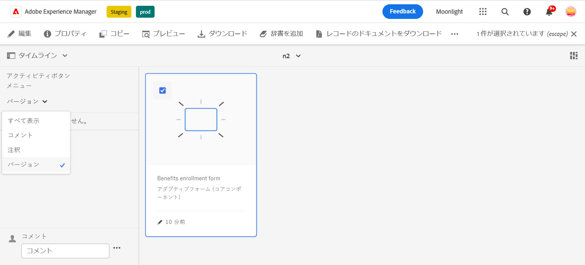
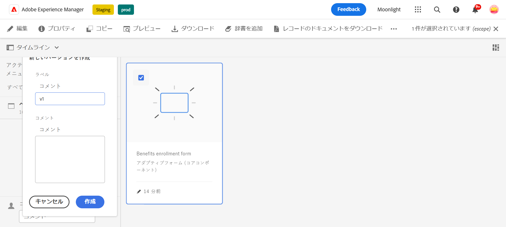
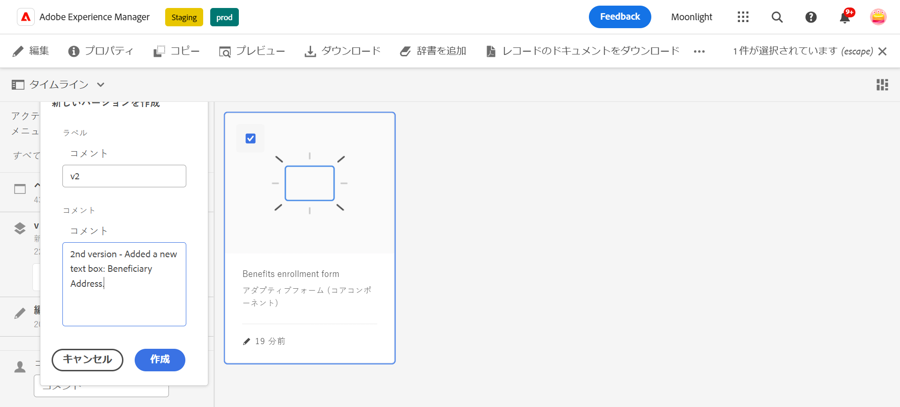
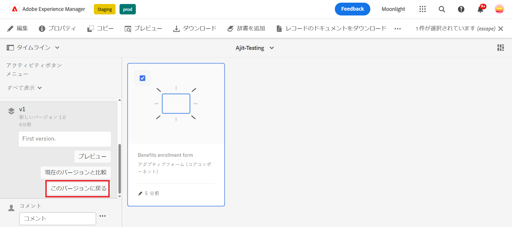
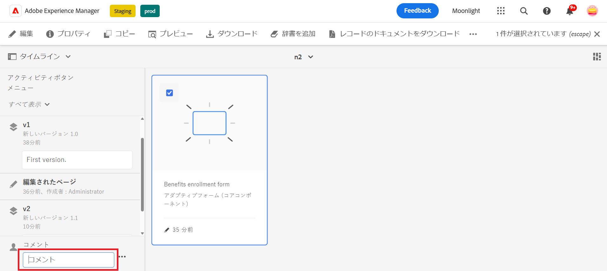
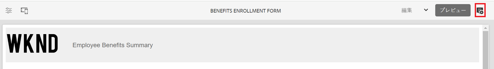
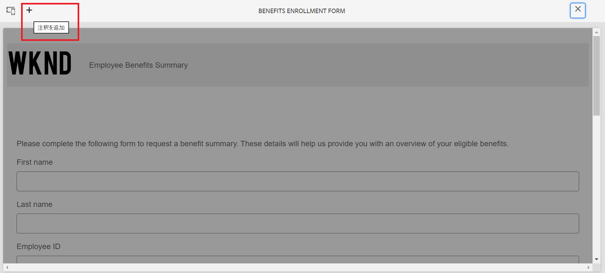
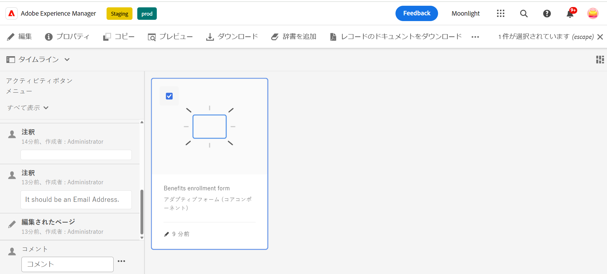

# アダプティブフォームのバージョン管理、レビューおよびコメント

<!--
 This feature is under the early adopter program. If you're interested in joining our early access program for this feature, send an email from your official address to aem-forms-ea@adobe.com to request access 
-->

 この機能はデフォルトでは有効になっていません。 公式アドレスからaem-forms-ea@adobe.comに書き込んで、機能へのアクセスをリクエストできます。

アダプティブフォームのコアコンポーネントを使用すると、フォーム作成者はフォームにバージョン管理、コメント、注釈を追加できます。 これらの機能を使用すると、複数のバージョンの作成と管理、コメントを介した共同作業、特定のフォームセクションへのメモの追加などが可能になり、フォームの作成作業が簡略化されます。

アダプティブフォームのバージョン管理、コメント、注釈の機能については、このビデオを参照してください。

>[!VIDEO](https://video.tv.adobe.com/v/3463265)

## 前提条件 {#prerequisite-versioning}

アダプティブフォームでバージョン管理機能、コメント機能、注釈機能を使用するには、AEM 6.5 Formsで [ アダプティブフォームのコアコンポーネント ](https://experienceleague.adobe.com/ja/docs/experience-manager-65/content/forms/adaptive-forms-core-components/enable-adaptive-forms-core-components) が有効になっていることを確認してください。

## アダプティブフォームのバージョン管理 {#adaptive-form-versioning}

アダプティブフォームのバージョン管理は、フォームにバージョンを追加するのに役立ちます。フォーム作成者は、フォームの複数のバージョンを簡単に作成し、最終的にビジネス目標に適したバージョンを使用できます。さらに、フォームユーザーは、フォームを以前のバージョンに戻すこともできます。また、作成者は、フォームの 2 つのバージョンをプレビューして比較することが容易になるので、UI の観点からフォームをより適切に分析できます。各アダプティブフォームのバージョン管理機能について詳しく見ていきましょう。

### フォームのバージョンの作成 {#create-a-form-version}

フォームのバージョンを作成するには、次の手順に従います。

1. AEM Forms環境で、**[!UICONTROL フォーム]**/]**2}Formsおよびドキュメント } に移動し、** フォーム **を選択します。**[!UICONTROL 
1. 左パネルの選択ドロップダウンから、「**[!UICONTROL バージョン]**」を選択します。
   
1. 左下のパネルにある **3 つのドット**&#x200B;をクリックし、「**[!UICONTROL バージョンとして保存]**」をクリックします。
1. フォームバージョンにラベルを指定します。コメントを通じてフォームに関する情報を追加することもできます。
   

### フォームのバージョンの更新 {#update-a-form-version}

フォームを編集および更新したら、新しいバージョンをフォームに追加します。 最後の節で示した手順に従って、画像に示すようにフォームの新しいバージョンに名前を付けます。

### フォームのバージョンを元に戻す {#revert-a-form-version}

フォームのバージョンを以前のバージョンに戻すには、フォームのバージョンを選択し、「**[!UICONTROL このバージョンに戻る]**」をクリックします。

### フォームのバージョンの比較 {#compare-form-versions}

フォーム作成者は、プレビュー目的で 2 つの異なるバージョンのフォームを比較できます。バージョンを比較するには、フォームのバージョンを選択し、「**[!UICONTROL 現在のバージョンと比較]**」をクリックします。プレビューモードで 2 つの異なるフォームのバージョンが表示されます。

## コメントの追加 {#add-comments}

レビューとは、1 人以上のレビュー担当者に対してフォームへのコメントを許可するメカニズムです。フォームユーザーは誰でもフォームにコメントしたり、コメントを通じてフォームをレビューしたりできます。フォームにコメントするには、「**[!UICONTROL フォーム]**」を選択し、フォームに&#x200B;**[!UICONTROL コメント]**&#x200B;を追加します。

>[!NOTE]
> 前述のように、アダプティブフォームのコアコンポーネントでコメントを使用すると、フォーム機能 [ フォームへのレビュー担当者の追加 ](/help/forms/using/create-reviews-forms.md) が無効になります。

## 注釈の追加 {#adaptive-form-annotations}

多くの場合、フォームグループユーザーは、レビュー目的（特定のタブやフォームのコンポーネントなど）でフォームに注釈を追加する必要があります。 このような場合、作成者は注釈を使用できます。
フォームに注釈を追加するには、次の手順を実行します。

1. **[!UICONTROL 編集]**&#x200B;モードでフォームを開きます。

1. 画像に示すように、右上のパネルにある&#x200B;**追加アイコン**をクリックします。
   

1. 次に、画像で示されているように左上のレールにある **追加アイコン** をクリックして、注釈を追加します。
   

1. これで、コメントを追加したり、複数のカラーでスケッチを描画してフォームコンポーネントを作成したりできます。

1. フォームに追加されたすべての注釈を表示するには、フォームを選択すると、画像に示すように、左側のパネルに注釈が追加されます。

   

## 関連トピック

* [アダプティブ Formsのコアコンポーネントの比較](/help/forms/using/compare-forms-core-components.md)
