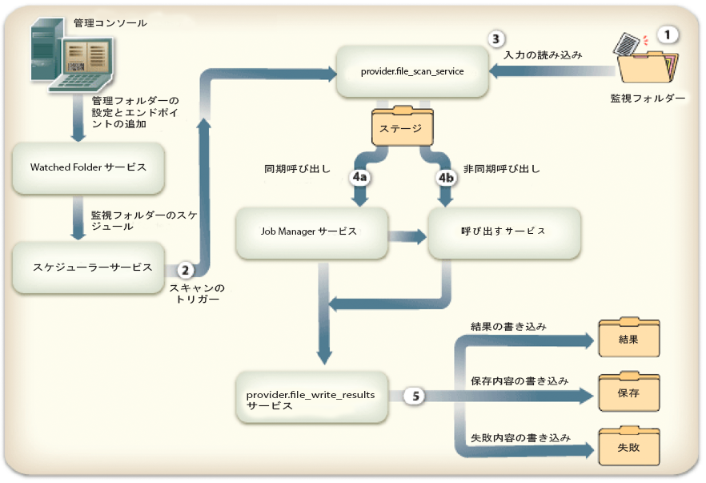
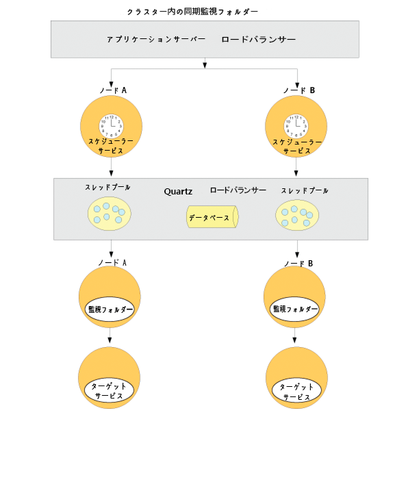
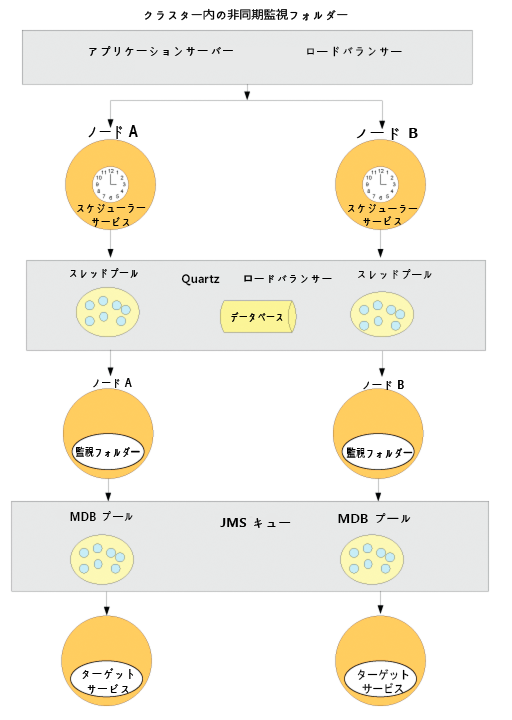

# 監視フォルダーエンドポイントの設定 {#configuring-watched-folder-endpoints}

管理者は、*監視フォルダー*&#x200B;と呼ばれるネットワークフォルダーを設定できます。ユーザーがファイル（PDF ファイルなど）を監視フォルダーに配置すると、設定済みのサービス操作が呼び出され、ファイルが操作されます。サービスが指定の操作を実行した後に、変更されたファイルが指定の出力フォルダーに保存されます。

## Watched Folder サービスの設定 {#configuring-the-watched-folder-service}

監視フォルダーエンドポイントを設定する前に、Watched Folder サービスを設定します。Watched Folder サービスの設定パラメーターには、2 つの用途があります。

* すべての監視フォルダーエンドポイントに共通する属性を設定すること
* すべての監視フォルダーエンドポイントで使用されるデフォルト値を指定すること

Watched Folder サービスを設定した後、ターゲットのサービス用に監視フォルダーエンドポイントを追加します。エンドポイントを追加するときには、設定済みの Watched Folder サービスの入力フォルダーにファイルまたはフォルダーが配置されている場合に呼び出すサービス名や操作名など、値をいくつか設定します。Watched Folder サービスの設定について詳しくは、[Watched Folder サービスの設定](/help/forms/using/admin-help/configure-service-settings.md#watched-folder-service-settings)を参照してください。

## 監視フォルダーの作成 {#creating-a-watched-folder}

次の 2 つの方法で、監視フォルダーを作成できます。

* 監視フォルダーエンドポイントを設定するには、親ディレクトリの「パス」ボックスにフルパスを入力し、作成する監視フォルダーの名前を付けます。例えば、次のように入力します。
   `  C:\MyPDFs\MyWatchedFolder`MyWatchedFolder フォルダーはもともと存在していないので、AEM Forms は指定した場所にこのディレクトリを作成しようとします。

* 監視フォルダーエンドポイントを設定する前に、ファイルシステムでフォルダーを作成し、「パス」ボックスにフルパスを入力します。

クラスター環境では、監視フォルダーとして使用されるフォルダーは、ファイルシステムまたはネットワークでアクセス可能および書き込み可能で、共有されている必要があります。この場合、クラスターの各アプリケーションサーバーインスタンスは同じ共有フォルダーにアクセスできる必要があります。

Windows でアプリケーションサーバーがサービスとして実行されている場合、アプリケーションサーバーは、次のいずれかの方法で共有フォルダーへの適切なアクセス権が設定された状態で起動されている必要があります。

* アプリケーションサーバーサービスの「ログオン」**パラメーター**&#x200B;を設定し、共有監視フォルダーへの適切なアクセス権を持つ特定のユーザーとして起動します。
* アプリケーションサーバーサービスの「ローカルシステムアカウント」オプションで「デスクトップとの対話をサービスに許可」を設定します。このオプションを使用する場合、共有監視フォルダーがすべてのユーザーによりアクセス可能および書き込み可能である必要があります。

## 監視フォルダーの連結 {#chaining-together-watched-folders}

複数の監視フォルダーを連結して、ある監視フォルダーの結果ドキュメントを次の監視フォルダーの入力ドキュメントにすることができます。監視フォルダーごとに、別々のサービスを呼び出すことができます。この方法で監視フォルダーを設定すると、複数のサービスを呼び出すことができます。例えば、1 つの監視フォルダーでは PDF ファイルを Adobe PostScript® に変換し、別の監視フォルダーでは PostScript ファイルを PDF/A 形式に変換することができます。そのためには、最初のエンドポイントで定義されている監視フォルダーの結果&#x200B;**&#x200B;フォルダーを、次のエンドポイントで定義されている監視フォルダーの入力&#x200B;**&#x200B;フォルダーに設定します。

そうすると、最初の変換処理からの出力は、\path\result に送られます。2 回目の変換処理に対する入力は \path\result になり、2 回目の変換処理からの出力は \path\result\result（または 2 回目の変換処理用に「結果フォルダー」ボックスで定義したディレクトリ）に送られます。

## ユーザーによる監視フォルダーの操作方法 {#how-users-interact-with-watched-folders}

監視フォルダーエンドポイントが 1 つの場合、ユーザーは入力ファイルまたはフォルダーをデスクトップから監視フォルダーにコピーまたはドラッグすることによって、サービス操作を呼び出すことができます。ファイルは、到着した順に処理されます。

監視フォルダーエンドポイントが複数の場合、ジョブに必要な入力ファイルが 1 つだけのときは、監視フォルダーのルートにそのファイルをコピーできます。

ジョブに複数の入力ファイルが含まれる場合、ユーザーは、すべての必要なファイルを含む監視フォルダー階層の外部にフォルダーを作成する必要があります。この新しいフォルダーに入力ファイルを含めます（プロセスが必要とする場合は、DDX ファイルも含めます）。ジョブフォルダーを構築したら、ユーザーはそのジョブフォルダーを監視フォルダーの入力フォルダーにコピーする必要があります。

>[!NOTE]
>
>アプリケーションサーバーには監視フォルダー内のファイルを削除する権限を付与してください。AEM Forms がスキャン済みファイルを入力フォルダーから削除できない場合、関連付けられたプロセスが無制限に呼び出されます。

## 監視フォルダーの出力 {#watched-folder-output}

入力が 1 つのフォルダーであり、出力が複数のファイルで構成されている場合、AEM Forms では、入力フォルダーと同じ名前が付けられた出力フォルダーが作成され、そのフォルダーに出力ファイルがコピーされます。Output プロセスからの出力などのキーと値のペアを含むドキュメントマップで出力が構成されている場合、キーは出力ファイル名として使用されます。

エンドポイントプロセスによって生成される出力ファイル名には、英字、数字およびファイル拡張子の前のピリオド（.）以外の文字を含めることはできません。それ以外の文字は、AEM Forms によって 16 進数値に変換されます。

クライアントアプリケーションでは、監視フォルダーの結果フォルダーから結果ドキュメントを取得します。プロセスエラーは監視フォルダーの失敗フォルダーに記録されます。

## 監視フォルダーの仕組み {#how-watched-folder-works}

監視フォルダーモジュールには、次のサービスが含まれています。

* Watched Folder サービス
* provider.file_scan_service
* provider.file_write_results_service

上記のサービスに加えて、監視フォルダーには、ジョブをスケジュールするためのスケジューラーサービスや、ターゲットサービスの非同期呼び出しに対応する Job Manager サービスなど、他のサービスにも依存します。

### Watched Folder による呼び出し要求の処理方法 {#how-watched-folder-processes-an-invocation-request}

Watched Folder サービスでは、エンドポイントの作成、更新および削除を処理します。管理者がエンドポイントを作成すると、エンドポイントは指定の繰り返し間隔または Cron 形式に基づいてスケジューラーサービスによってトリガーされるようにスケジュールされます。

次の図は、監視フォルダーによる呼び出し要求の処理方法を示しています。

監視フォルダーを使用してサービスを呼び出すプロセスは次のとおりです。

1. クライアントアプリケーションでは、ファイルやフォルダーを監視フォルダーの入力フォルダーに配置します。
1. ジョブスキャンが発生すると、スケジューラーサービスによって provider.file_scan_service が呼び出され、入力フォルダー内のファイルまたはフォルダーが処理されます。
1. provider.file_scan_service で次のタスクが実行されます。

   * 「ファイルパターンを含める」設定に一致するファイルまたはフォルダーがないか入力フォルダーをスキャンし、「ファイルパターンを除外」設定に一致するファイルまたはフォルダーを除外します。最も古いファイルまたはフォルダーが最初に取得されます。待機時間より古いファイルやフォルダーも取得されます。1 回のスキャンで処理されるファイルまたはフォルダーの数は、バッチサイズによって決まります。ファイルパターンについて詳しくは、[ファイルパターンについて](configuring-watched-folder-endpoints.md#about-file-patterns)を参照してください。バッチサイズの設定について詳しくは、[Watched Folder サービスの設定](/help/forms/using/admin-help/configure-service-settings.md#watched-folder-service-settings)を参照してください。
   * 処理対象のファイルまたはフォルダーを取得します。処理対象のファイルまたはフォルダーが完全にダウンロードされない場合は、次回のスキャンで取得します。フォルダーが完全にダウンロードされた状態にするには、管理者は「ファイルパターンを除外」設定を使用して名前付きのフォルダーを作成する必要があります。そのフォルダーにファイルをすべて含めた後、フォルダーの名前を「ファイルパターンを含める」に指定したパターンに合うように変更します。この手順によって、サービスを呼び出すために必要なすべてのファイルがこのフォルダーに含まれるようになります。フォルダーが完全にダウンロードされていることを確認する方法について詳しくは、[監視フォルダーのヒントとテクニック](configuring-watched-folder-endpoints.md#tips-and-tricks-for-watched-folders)を参照してください。
   * 処理対象として選択したファイルまたはフォルダーをステージフォルダーに移動します。
   * エンドポイント入力パラメーターマッピングに基づいて、ステージフォルダー内のファイルやフォルダーを適切な入力に変換します。入力パラメーターのマッピングの例については、[監視フォルダーのヒントとテクニック](configuring-watched-folder-endpoints.md#tips-and-tricks-for-watched-folders)を参照してください。

1. エンドポイントに設定されているターゲットのサービスが、同期または非同期で呼び出されます。ターゲットのサービスを呼び出すには、エンドポイント用に設定されているユーザー名およびパスワードを使用します。

   * 同期呼び出しでは、ターゲットサービスを直接呼び出し、応答を直ちに処理します。
   * 非同期呼び出しでは、ターゲットサービスは Job Manager サービス経由で呼び出されます。Job Manager サービスは要求をキューに配置します。続いて Job Manager サービスは、provider.file_write_results_service を呼び出して結果を処理します。

1. provider.file_write_results_service は、ターゲットサービス呼び出しの応答または失敗を処理します。処理が正常に終了すると、その出力がエンドポイントに設定された結果フォルダーに保存されます。正常終了時に結果を保存するようにエンドポイントが設定されている場合、provider.file_write_results_service はソースも保存します。

   ターゲットサービス呼び出しが失敗すると、provider.file_write_results_service は失敗の理由を failure.log ファイルに記録し、そのファイルを失敗フォルダーに配置します。失敗フォルダーは、エンドポイントの設定パラメーターに基づいて作成されます。また、エンドポイント設定に「エラー時に保存」オプションを設定している場合も、provider.file_write_results_service はソースファイルを失敗フォルダーにコピーします。失敗フォルダーからファイルを回復する方法について詳しくは、[失敗ポイントおよび回復](configuring-watched-folder-endpoints.md#failure-points-and-recovery)を参照してください。

## 監視フォルダーエンドポイントの設定 {#watched-folder-endpoint-settings}

監視フォルダーエンドポイントを設定するには、次の設定を使用します。

**名前：** （必須）エンドポイントを識別します。 &lt; は含めないでください。含めると、Workspace に表示される名前の一部が省略されます。エンドポイント名として URL を入力する場合は、RFC1738 で指定された構文規則に準拠していることを確認します。

**説明：** エンドポイントの説明。 &lt; は含めないでください。含めると、Workspace に表示される説明の一部が省略されます。

**パス：** （必須）監視フォルダーの場所を指定します。 クラスター環境では、クラスター内のすべてのコンピューターからアクセスできる共有ネットワークフォルダーを指定する必要があります。

**非同期：** 呼び出しの種類を非同期型または同期型として識別します。 デフォルト値は「asynchronous」（非同期）です。長期間有効なプロセスでは非同期を使用し、一過性のプロセスまたは短期間のみ有効なプロセスでは同期を使用することをお勧めします。

**Cron式:** Cronフォルダーを使用して監視式ーをスケジュールする必要がある場合は、Cronーを入力します。式 これを設定すると、「繰り返し間隔」は無視されます。

**繰り返し間隔：** 監視フォルダーをスキャンして入力を求める間隔（秒）です。 「ジョブ数を制限」が有効になっていない場合は、「繰り返し間隔」を平均的なジョブを処理する時間よりも大きい値に設定する必要があります。そうしないと、システムが過負荷の状態になる可能性があります。デフォルト値は 5 です。詳しくは、「バッチサイズ」の説明を参照してください。

**繰り返し回数：** 監視フォルダーがフォルダーまたはディレクトリをスキャンする回数。 -1 を指定すると、無限にスキャンされます。デフォルト値は -1 です。

**スロットル：** このオプションを選択すると、AEM formsで同時に処理できる監視フォルダーのジョブ数が制限されます。 ジョブの最大数は、バッチサイズ値によって決まります（「ジョブ数の制限について」を参照）。

**ユーザー名：** （必須）監視フォルダーからユーザーサービスを呼び出すときに使用されるターゲットー名です。 デフォルト値は「SuperAdmin」です。

**ドメイン名：** （必須）ユーザーのドメイン。 デフォルト値は「DefaultDom」です。

**バッチサイズ：** 1回のスキャンで取得されるファイルまたはフォルダーの数。 この設定を使用して、システムが過負荷の状態になるのを防ぎます。一度にスキャンするファイル数が多すぎる場合、クラッシュする可能性があります。デフォルト値は 2 です。

「繰り返し間隔」設定と「バッチサイズ」設定では、監視フォルダーがスキャンごとに何個のファイルを取得するかを指定します。監視フォルダーは、Quartz スレッドプールを使用して入力フォルダーをスキャンします。スレッドプールは他のサービスと共有されます。スキャンの間隔が小さいと、スレッドによって入力フォルダーが頻繁にスキャンされます。ファイルが頻繁に監視フォルダーに配置される場合は、スキャンの間隔を小さくする必要があります。ファイルが頻繁には配置されない場合は、他のサービスがスレッドを使用できるように、スキャンの間隔を大きくします。

配置されるファイル数が多い場合は、バッチサイズを大きくします。例えば、監視フォルダーエンドポイントによって呼び出されるサービスが 1 分間に 700 個のファイルを処理でき、これと同じ速度でユーザーが入力フォルダーにファイルを配置するとします。このとき、「バッチサイズ 」を 350 に、「繰り返し間隔 」を 30 秒に設定すると、過度に頻繁に監視フォルダーをスキャンするコストを発生させることなく、監視フォルダーのパフォーマンス向上につなげることができます。

ファイルが監視フォルダーに配置されると監視フォルダーはファイルを入力内に一覧化するので、スキャンが毎秒行われているとパフォーマンスが低下する可能性があります。スキャンの間隔を大きくすると、パフォーマンスが向上する可能性があります。配置されるファイルの量が少ない場合は、それに従って「バッチサイズ 」と「繰り返し間隔 」を調整します。例えば、毎秒 10 個のファイルが配置される場合は、「繰り返し間隔 」を 1 秒に、「バッチサイズ 」を 10 に設定します。

**Wait Time:** フォルダーまたはファイルの作成後にスキャンを実行するまでの待機時間（ミリ秒）です。 例えば、待機時間が 3,600,000 ミリ秒（1 時間）のときに、1 分前にファイルが作成されたとすると、59 分以上が経過した後でこのファイルが取得されます。デフォルト値は 0 です。

この設定は、ファイルまたはフォルダーを入力フォルダーにコピーする処理を確実に完了するために役立ちます。例えば、処理するファイルのサイズが大きく、ファイルのダウンロードに10分かかる場合は、待機時間を10&amp;ast;60 &amp;ast;1000ミリ秒に設定します。 この設定により、ファイルが作成されてから 10 分が経過していない場合は、監視フォルダーはそのファイルをスキャンしなくなります。

**Exclude File Pattern:** セミコロン **;** 区切り形式のリスト。監視フォルダーがスキャンおよび取得の対象とするファイルやフォルダーを決定する際に使用します。 このパターンに当てはまるファイルまたはフォルダーは、スキャンの対象外となります。

この設定は、複数のファイルが存在するフォルダーが入力に使用される場合に便利です。フォルダーの内容を、監視フォルダーの取得対象となる名前のフォルダーにコピーすることができます。これにより、フォルダーが入力フォルダーに完全にコピーされる前に監視フォルダーがフォルダーを取得することを回避できます。

次のように、除外するファイルパターンを指定できます。

* 特定のファイル拡張子を持つファイル；例えば、&amp;ast;.dat, &amp;ast;.xml, &amp;ast;.pdfのように指定します。
* data.&amp;ast;の場合、 *data1*、 *data2*&#x200B;などの名前を持つファイルやフォルダが除外されます。
* 次のような名前および拡張子が混在する式に一致するファイル。

   * Data[0-9][0-9][0-9].[dD][aA]&#39;port&#39;
   * &amp;ast;.[dD][Aa]&#39;port&#39;
   * &amp;ast;.[Xx][Mm][Ll]

ファイルパターンについて詳しくは、「[ファイルパターンについて](configuring-watched-folder-endpoints.md#about-file-patterns)」を参照してください。

**ファイルパターンを含む：** （必須）セミコロン **;** 区切り形式のリスト。監視フォルダーでスキャンおよび取得するフォルダーとファイルを決定する際に使用されるパターンです。 例えば、「ファイルパターンを含む」がinput&amp;ast；の場合、input&amp;ast；に一致するすべてのファイルとフォルダー拾い上げられます。 input1、input2 などの名前を持つファイルおよびフォルダーが含まれます。

デフォルト値は&amp;ast；です。およびは、すべてのファイルとフォルダを示します。

次のように、含めるファイルパターンを指定できます。

* 特定のファイル拡張子を持つファイル；例えば、&amp;ast;.dat, &amp;ast;.xml, &amp;ast;.pdfのように指定します。
* data.&amp;ast; would include files and folders named *data1*, *data2*, and so on.
* 次のような名前および拡張子が混在する式に一致するファイル。

   * Data[0-9][0-9][0-9].[dD][aA]&#39;port&#39;
   * &amp;ast;.[dD][Aa]&#39;port&#39;
   * &amp;ast;.[Xx][Mm][Ll]

ファイルパターンについて詳しくは、「[ファイルパターンについて](configuring-watched-folder-endpoints.md#about-file-patterns)」を参照してください。

**結果フォルダ：** 保存した結果が保存されるフォルダーです。 結果がこのフォルダーに表示されない場合は、失敗フォルダーを確認してください。読み取り専用ファイルは処理されず、失敗フォルダーに保存されます。絶対パスまたは相対パスを次のファイルパターンを使用して指定できます。

* %F = ファイル名プレフィックス
* %E = ファイル拡張子
* %Y = 年（4 桁表記）
* %y = 年（下 2 桁）
* %M = 月
* %D = 日（1～31）
* %d = 日（通日）
* %H = 時（24 時間）
* %h = 時（12 時間）
* %m = 分
* %s = 秒
* %l = ミリ秒
* %R = 乱数（0～9）
* %P = プロセス ID またはジョブ ID

For example, if it is 8 PM on July 17, 2009 and you specify `C:/Test/WF0/failure/%Y/%M/%D/%H/`, the result folder is `C:/Test/WF0/failure/2009/07/17/20`.

絶対パスではなく相対パスを指定すると、結果フォルダーは監視フォルダーの中に作成されます。デフォルト値は「result/%Y/%M/%D/」であり、監視フォルダー内の結果フォルダーです。ファイルパターンについて詳しくは、[ファイルパターンについて](configuring-watched-folder-endpoints.md#about-file-patterns)を参照してください。

>[!NOTE]
>
>結果フォルダーのサイズを小さくすればするほど、監視フォルダーのパフォーマンスが向上します。例えば、監視フォルダーの推定負荷が 1 時間に 1000 個のファイルである場合、1 時間ごとに新しいサブフォルダーが作成されるように `result/%Y%M%D%H` のようなパターンを使用します。これよりも負荷が小さい場合（例えば、1 日に 1000 個のファイル）、`result/%Y%M%D` のようなパターンを使用することもできます。

**フォルダを保存：** 正常にスキャンおよび取得されたファイルが保存される場所。 相対パス、絶対パスまたは null のディレクトリパスを指定できます。「結果フォルダー」で説明したファイルパターンを使用できます。デフォルト値は「preserve/%Y/%M/%D/」です。

**失敗フォルダ：** 失敗ファイルが保存されるフォルダーです。 この場所は、常に監視フォルダーからの相対パスで指定します。「結果フォルダー」で説明したファイルパターンを使用できます。

読み取り専用ファイルは処理されず、失敗フォルダーに保存されます。

デフォルト値は「failure/%Y/%M/%D/」です。

**失敗時に保存：** サービスで操作の実行に失敗した場合に入力ファイルを保持します。 デフォルト値は true です。

**重複ファイル名を上書き：** 「True」に設定すると、結果フォルダーと保存用フォルダー内のファイルが上書きされます。 「False」に設定すると、ファイル名とフォルダー名の最後に数字のインデックスが付加されます。デフォルト値は False です。

**パージ期間：** （必須）結果フォルダー内のファイルとフォルダーがこの値より古い場合、それらは削除されます。 この値の単位は日です。この設定は、結果フォルダーに常に空き容量があるようにする場合に役立ちます。

-1 を指定すると、結果フォルダーの削除は行われません。デフォルト値は -1 です。

**操作名：** （必須）監視リストーエンドポイントに割り当てることができる操作のエンドポイントです。

**Input Parameter Mappings:** サービスと操作の処理に必要な入力を設定するために使用します。 使用できる設定は、監視フォルダーエンドポイントを使用するサービスによって異なります。入力には、次の 2 つの種類があります。

**リテラル：** 監視フォルダーは、フィールドに入力された値を表示どおりに使用します。 すべての基本 Java 型がサポートされます。例えば、String、long、int および Boolean などの入力が使用される API の場合、文字列は適切な型に変換され、サービスが呼び出されます。

**変数：** 入力された値は、監視フォルダーが入力を選択する際に使用するファイルパターンです。 例えば、入力ドキュメントーがPDFファイルである必要があるencrypt passwordサービスの場合、&amp;ast;.pdfをファイルパターンとして使用できます。 監視フォルダーでこのパターンに一致するすべてのファイルが取得され、各ファイルに対するサービスが呼び出されます。変数の使用時は、すべての入力ファイルがドキュメントに変換されます。Document を入力型として使用する API のみがサポートされます。

**出力パラメーターのマッピング：** サービスと操作の出力を設定するために使用します。 使用できる設定は、監視フォルダーエンドポイントを使用するサービスによって異なります。

監視フォルダーの出力は、1 つのドキュメント、ドキュメントのリストまたはドキュメントのマップになります。その後、「出力パラメーターのマッピング」で指定されたパターンを使用して、これらの出力ドキュメントが結果フォルダーに保存されます。

>[!NOTE]
>
>結果が一意の出力ファイル名になる名前を指定すると、パフォーマンスが向上します。For example, consider the case where the service returns one output document and the Output Parameter Mapping maps it to `%F.%E` (the file name and extension of the input file). この場合、ユーザーが 1 分ごとに同じ名前のファイルを配置したときに、結果フォルダーが `result/%Y/%M/%D` に設定されており、「重複したファイル名を上書き」設定が無効になっていると、監視フォルダーは重複したファイル名を解決しようとします。この重複したファイル名を解決するプロセスが、パフォーマンスに影響を与えることがあります。In this situation, changing the Output Parameter Mapping to `%F_%h_%m_%s_%l` to add hours, minutes, seconds, and milliseconds to the name, or ensuring that dropped files have unique names may improve performance.

## ファイルパターンについて {#about-file-patterns}

管理者は、サービスを呼び出すことができるファイルのタイプを指定できます。監視フォルダーごとに複数のファイルパターンを作成できます。ファイルパターンは、次のファイルプロパティのいずれかになります。

* 特定のファイル名拡張子を持つファイル；例えば、&amp;ast;.dat, &amp;ast;.xml, &amp;ast;.pdf,;
* data.&amp;ast;
* 次のような名前および拡張子が混在する式に一致するファイル。

   * Data[0-9][0-9][0-9].[dD][aA]&#39;port&#39;
   * &amp;ast;.[dD][Aa]&#39;port&#39;
   * &amp;ast;.[Xx][Mm][Ll]

結果を保存する出力フォルダーのファイルパターンを定義できます。出力フォルダー（結果、保存および失敗）には、次のファイルパターンのいずれでも指定できます。

* %Y = 年（4 桁表記）
* %y = 年（下 2 桁）
* %M = 月
* %D = 日（1～31）
* %d = 日（通日）
* %h = 時
* %m = 分
* %s = 秒
* %R = 乱数（0～9）
* %J = ジョブ名

For example, the path to the result folder may be `C:\Adobe\Adobe_Experience_Manager_forms\BarcodedForms\%y\%m\%d`.

出力パラメーターのマッピングでは、さらに次のパターンを指定できます。

* %F = ソースファイル名
* %E = ソースファイル拡張子

出力パラメーターのマッピングパターンが「File.separator」（つまり、パスセパレーター）で終わる場合、フォルダーが作成され、コンテンツがそのフォルダーにコピーされます。パターンが「File.separator」で終わらない場合、コンテンツ（結果ファイルまたはフォルダー）がその名前で作成されます。出力パラメーターのマッピングについて詳しくは、[監視フォルダーのヒントとテクニック](configuring-watched-folder-endpoints.md#tips-and-tricks-for-watched-folders)を参照してください。

## ジョブ数の制限について {#about-throttling}

監視フォルダーエンドポイントのジョブ数の制限が有効な場合、同時に処理できる監視フォルダーのジョブ数は制限されます。ジョブの最大数はバッチサイズ値によって決まり、監視フォルダーエンドポイントでも設定できます。ジョブ数の制限に達すると、監視フォルダーの入力ディレクトリにドキュメントが入ってもポーリングされません。また、このようなドキュメントは、他の監視フォルダージョブが完了し、別のポーリングが実施されるまで、入力ディレクトリに残ります。同期処理の場合、ジョブが単一のスレッドで連続処理されたとしても、1 回のポーリングで処理された全ジョブがジョブ数の制限に含められます。

>[!NOTE]
>
>ジョブ数の制限がクラスターに合わせて調整されることはありません。ジョブ数の制限が有効である場合、クラスター全体で同時に処理するジョブの数がバッチサイズに指定されている数を超えることはありません。この制限はクラスター全体に及ぶものであり、クラスターの各ノードに固有のものではありません。例えば、バッチサイズが 2 の場合、単一のノードがジョブを 2 つ処理するとジョブ数の制限に達するため、どちらかのジョブが完了するまで他のノードは入力ディレクトリをポーリングしません。

### ジョブ数制限の仕組み {#how-throttling-works}

監視フォルダーは、繰り返し間隔ごとに入力フォルダーをスキャンし、バッチサイズに指定されている数だけファイルを取得し、そのファイルごとにターゲットのサービスを呼び出します。例えば、バッチサイズがスキャンごとに 4 である場合、監視フォルダーはファイルを 4 つ取得し、呼び出し要求を 4 つ作成し、ターゲットのサービスを呼び出します。これらの要求が完了する前に、監視フォルダーを呼び出すと、前回の 4 つのジョブが完了しているかどうかに関係なく、再度 4 つのジョブを開始します。

ジョブ数の制限を有効にすると、前回のジョブが完了していない場合には、監視フォルダーが新たにジョブを呼び出さないようになります。監視フォルダーは、進行中のジョブを検出し、バッチサイズから進行中のジョブを差し引いた値に基づいて新しいジョブを処理します。例えば、2 回目の呼び出しを実行したとき、完了したジョブの数が 3 つで、まだ進行中のジョブが 1 つある場合、監視フォルダーはジョブを 3 つのみ呼び出します。

* 監視フォルダーは、ステージフォルダーに存在しているファイルの数に基づいて進行中のジョブがいくつあるかを判断します。ステージフォルダーにファイルが未処理のまま残っている場合、監視フォルダーはそれ以上ジョブを呼び出しません。例えば、バッチサイズが 4 で、3 つのジョブが停止している場合、監視フォルダーは以降の呼び出しでジョブを 1 つのみ呼び出します。ステージフォルダーにファイルが未処理のまま残る原因として、いくつかのシナリオが考えられます。ジョブが停止している場合、管理者は forms ワークフローの管理ページでプロセスを終了できるため、監視フォルダーはステージフォルダーからファイルを移動することができます。
* 監視フォルダーがジョブを呼び出す前に forms サーバーがダウンした場合は、管理者がステージフォルダーからファイルを移動できます。詳しくは、[失敗ポイントおよび回復](configuring-watched-folder-endpoints.md#failure-points-and-recovery)を参照してください。
* サービスが正しい順序で開始されず、Job Manager サービスのコールバックが発生したとき、 forms サーバーが動作している一方で監視フォルダーが動作していない場合は、管理者がステージフォルダーからファイルを移動できます。詳しくは、[失敗ポイントおよび回復](configuring-watched-folder-endpoints.md#failure-points-and-recovery)を参照してください。

## パフォーマンスおよびスケーラビリティ {#performance-and-scalability}

監視フォルダーは、1 つのノードにフォルダーを最大 100 個まで提供できます。監視フォルダーのパフォーマンスは、forms サーバーのパフォーマンスによって決まります。非同期呼び出しの場合、パフォーマンスはシステム負荷および Job Manager キューにあるジョブに左右される割合が高くなります。

監視フォルダーのパフォーマンスを高めるには、クラスターにノードを追加します。監視フォルダージョブが、Quartz スケジューラーのほか、非同期要求の場合には Job Manager サービスによって、各クラスターノードに分散されます。すべてのジョブがデータベースに保存されます。

監視フォルダーによるジョブスケジュールの作成、取り消しおよび再作成は、スケジューラーサービスに依存しています。スケジューラーサービススレッドプールを共有するサービスにはこのほか、イベント管理サービス、User Manager サービス、電子メールプロバイダーサービスなどがあります。このことが、監視フォルダーのパフォーマンスに影響を与えることがあります。これらのサービスが一斉にスケジューラーサービススレッドプールの使用を開始した場合には、このスレッドプールの調整が必要になります。

## クラスターの監視フォルダー {#watched-folders-in-a-cluster}

クラスターでは、Quartz スケジューラーおよび Job Manager サービスによって、監視フォルダーのロードバランシングおよびフェイルオーバーを実現しています。Quartz クラスターの動作について詳しくは、[Quartz のドキュメント](https://www.quartz-scheduler.org/documentation)を参照してください。

監視フォルダーは、ポーリングごとに主に次の 3 つのタスクを実行します。

* フォルダーのスキャン
* ターゲットサービスの呼び出し
* 結果の処理

ロードバランシングおよびフェイルオーバーの動作は、監視フォルダーが同期呼び出し用に設定されているのか、それとも非同期呼び出し用に設定されているのかによって異なります。

### クラスターの同期監視フォルダー {#synchronous-watched-folder-in-a-cluster}

同期呼び出しの場合、Quartz ロードバランサーによって、どのノードがポーリングイベントを取得するかが決まります。ポーリングイベントを取得したノードが、フォルダーのスキャン、ターゲットのサービスの呼び出し、結果の処理のいずれのタスクも実行します。

同期呼び出しの場合、あるノードが失敗すると、Quartz スケジューラーは新しいポーリングイベントを他のノードに送信します。失敗したノードで開始された呼び出しは失われます。失敗したジョブに関連付けられているファイルを回復する方法について詳しくは、[失敗ポイントおよび回復](configuring-watched-folder-endpoints.md#failure-points-and-recovery)を参照してください。

### クラスターの非同期監視フォルダー {#asynchronous-watched-folder-in-a-cluster}

非同期呼び出しの場合、Quartz ロードバランサーによって、どのノードがポーリングイベントを取得するかが決まります。ポーリングイベントを取得したノードは、要求を Job Manager サービスキューに配置して、入力フォルダーのスキャンおよびターゲットサービスの呼び出しを行います。続いて Job Manager サービスロードバランサーが、呼び出し要求を処理するノードを決定します。ノード A が呼び出し要求を作成したノードであっても、ノード B が要求を処理することになる場合があります。また、呼び出し要求を開始したノードが、要求も処理することになる場合があります。

非同期呼び出しの場合、あるノードが失敗すると、Quartz スケジューラーは新しいポーリングイベントを他のノードに送信します。失敗したノードで作成された呼び出し要求は、Job Manager サービスキューにあり、他のノードに送信されて処理されることになります。呼び出し要求が作成されていないファイルはステージフォルダーに残ります。失敗したジョブに関連付けられているファイルを回復する方法について詳しくは、[失敗ポイントおよび回復](configuring-watched-folder-endpoints.md#failure-points-and-recovery)を参照してください。

## 失敗ポイントおよび回復 {#failure-points-and-recovery}

ポーリングイベントごとに、監視フォルダーは入力フォルダーをロックし、「ファイルパターンを含める」に一致するファイルをステージフォルダーに移動してから、入力フォルダーのロックを解除します。ロックは、2 つのスレッドが同じファイルを取得して同時に処理することを防ぐために必要となります。このような状況が発生する可能性は、繰り返し間隔を短くし、バッチサイズを大きくしていると高くなります。ファイルがステージフォルダーに移動されると、入力フォルダーのロックが解除され、他のスレッドが入力フォルダーをスキャンできるようになります。この手順により、あるスレッドがファイルを処理している間に他のスレッドがスキャンを実行できるため、高いスループットを実現できます。

ファイルがステージフォルダーに移動すると、ファイルごとに呼び出し要求が作成され、ターゲットのサービスが呼び出されます。監視フォルダーがステージフォルダー内のファイルを回復できない場合があります。

* 監視フォルダーが呼び出し要求を作成する前にサーバーがダウンした場合、ステージフォルダー内のファイルはステージフォルダーに残り、回復されません。
* 監視フォルダーがステージフォルダー内のファイルごとに呼び出し要求を正常に作成した後でサーバーがクラッシュした場合、呼び出しタイプに基づいて動作が次の 2 つに分かれます。

**同期：**&#x200B;監視フォルダーがサービスを同期的に呼び出すように設定されている場合、ステージフォルダー内のファイルはすべて未処理のままステージフォルダーに残ります。

**非同期：**&#x200B;この場合、監視フォルダーは Job Manager サービスに依存します。Job Manager サービスが監視フォルダーをコールバックした場合、ステージフォルダー内のファイルは呼び出しの結果に基づいて保存フォルダーまたは失敗フォルダーに移動されます。Job Manager サービスが監視フォルダーをコールバックしない場合、ファイルは未処理のままステージフォルダーに残ります。この状況が発生するのは、Job Manager がコールバックしようとしたときに監視フォルダーが動作していない場合です。

### ステージフォルダーに未処理のまま残っているソースファイルの回復 {#recovering-unprocessed-source-files-in-the-stage-folder}

監視フォルダーでステージフォルダー内のソースファイルを処理できない場合、未処理のファイルを回復できます。

1. アプリケーションサーバーまたはノードを再起動します。
1. （オプション）監視フォルダーが新しい入力ファイルを処理できないようにします。この手順をスキップすると、どのファイルがステージフォルダーに未処理のまま残っているのかを判断するのが非常に難しくなります。監視フォルダーが新しい入力ファイルを処理できないようにするには、次のタスクのいずれかを実行します。

   * アプリケーションおよびサービスで、監視フォルダーエンドポイントに対する「ファイルパターンを含める」パラメーターを新しい入力ファイルのいずれにも一致しない値に変更します（例えば、「`NOMATCH`」と入力します）。
   * 新しい入力ファイルを作成しているプロセスを休止します。
   AEM Forms がすべてのファイルを回復して処理するまで待機します。ファイルの大多数は回復され、新しい入力ファイルは正しく処理されます。監視フォルダーがファイルを回復し、処理するまでの待機時間の長さは、呼び出す操作の長さおよび回復するファイルの数によって異なります。

1. 処理できないファイルを特定します。適切な待機時間が経過し、前の手順を完了した上、ステージフォルダーに未処理のファイルが残っている場合は、次の手順に進みます。

   >[!NOTE]
   >
   >ステージディレクトリのファイルの日付およびタイムスタンプを確認できます。ファイルの数および通常の処理時間から、どのファイルが古く、停止していると考えられるかを判断できます。

1. ステージディレクトリから入力ディレクトリに未処理のファイルをコピーします。
1. 手順 2 で監視フォルダーが新しい入力ファイルを処理できないようにした場合は、「ファイルパターンを含める」を前の値に戻すか、または無効にしたプロセスを再度有効にします。

## 監視フォルダーのセキュリティに関する考慮事項 {#security-considerations-for-watched-folders}

どの監視フォルダーにも、ユーザー名およびパスワードが設定されています。この資格情報は、サービスを呼び出すときに使用されます。共有フォルダーは監視フォルダーの所有者に限ってアクセスを許可するように、基礎となるセキュリティファイルシステムで保護されており、監視フォルダーはこうした状況に依存しています。

## 監視フォルダーのヒントとテクニック {#tips-and-tricks-for-watched-folders}

ここでは、監視フォルダーエンドポイントを設定する際のヒントとテクニックを示します。

* Windows で、画像ファイルを処理するための監視フォルダーがある場合、「ファイルパターンを含める」オプションまたは「ファイルパターンを除外」オプションに値を指定して、Windows により自動生成される Thumbs.db ファイルが監視フォルダーによってポーリングされないようにする必要があります。
* Cron 形式を指定した場合、繰り返し間隔は無視されます。Cron 形式の使用方法は、Quartz オープンソースジョブスケジュールシステムのバージョン 1.4.0 に基づきます
* バッチサイズは、監視フォルダーの各スキャンで取得するファイルまたはフォルダーの数です。バッチサイズを 2 に設定している場合、10 個のファイルまたはフォルダーが監視フォルダーの入力フォルダーに入っても、各スキャンではそのうち 2 個のみが取得されます。繰り返し間隔に指定されている時間の経過後に発生する次回のスキャンでは、次の 2 ファイルが取得されます。
* ファイルパターンには正規表現を指定できるほか、ワイルドカードパターンもサポートされます。監視フォルダーは、&amp;ast；などのワイルドカードパターンをサポートするように正規式を変更します。&amp;ast;または&amp;ast;.pdf。 このようなワイルドカードパターンは、正規表現ではサポートされていません。
* 監視フォルダーは、入力フォルダーをスキャンして入力の有無を調べますが、ソースファイルまたはソースフォルダーの処理を開始する前に、ソースファイルやソースフォルダーが完全に入力フォルダーにコピーされているかどうかを認識しません。ソースファイルやソースフォルダーを完全に監視フォルダーの入力フォルダーにコピーしてから、ソースファイルまたはソースフォルダーを取得するようにするには、次のタスクを実行します。

   * 待機時間、つまり最後に変更されてから監視フォルダーが待機する時間（ミリ秒単位）を使用します。処理するファイルが大きい場合は、この機能を使用します。例えば、ファイルのダウンロードに10分かかる場合は、待機時間を10&amp;ast;60&amp;ast;1000ミリ秒と指定します。 これで、監視フォルダーは生成されてから 10 分経っていないファイルを取得しないようになります。
   * 「ファイルパターンを除外」および「ファイルパターンを含める」を使用します。For example, if the exclude file pattern is `ex*` and the include file pattern is `in*`, Watched Folder will pick up the files that start with &quot;in&quot; and will not pick up the files that start with &quot;ex&quot;. 大きなファイルまたはフォルダーをコピーするには、まず「ex」で始まるようにファイルまたはフォルダーの名前を変更します。「ex」という名前のファイルまたはフォルダーが監視フォルダーに完全にコピーされたら、名前を「in&amp;ast;」に変更します。

* クリア期間を使用して、結果フォルダーを空にしておきます。監視フォルダーは、クリア期間に設定されている期間よりも古いファイルをすべてクリーンアップします。期間は日単位です。
* 監視フォルダーエンドポイントを追加した場合、操作名を選択すると、入力パラメーターのマッピングが入力されます。操作を入力するたびに、入力パラメーターのマッピングフィールドが 1 つ生成されます。ここでは、入力パラメーターのマッピングの例をいくつか示します。

   * `com.adobe.idp.Document` 入力の場合：サービス操作の入力タイプが `Document` である場合、マッピングの種類を `Variable` に指定できます。監視フォルダーは、入力パラメーター用に指定されているファイルパターンに基づいて監視フォルダーの入力フォルダーから入力を取得します。If the administrator specifies `*.pdf` as the parameter, each file that has an extension of .pdf will be picked up, converted to `com.adobe.idp.Document`, and the service invoked.
   * For `java.util.Map` input: If the service operation has an input of type `Map`, the administrator can specify the mapping type as `Variable` and enter a mapping value with a pattern like `*.pdf`. 例えば、サービスが 1.pdf や 2.pdf など入力フォルダー内のファイルを表す 2 つの `com.adobe.idp.Document` オブジェクトのマップを必要としているとします。監視フォルダーは、キーがファイル名で、値が `com.adobe.idp.Document` であるマップを作成します。
   * For `java.util.List` input: If the service operation has an input of type List, the administrator can specify the mapping type as `Variable` and enter a mapping value with a pattern like `*.pdf`. PDF ファイルが入力フォルダーに入ると、監視フォルダーは PDF ファイルを表す `com.adobe.idp.Document` オブジェクトのリストを作成し、ターゲットのサービスを呼び出します。
   * `java.lang.String` の場合：管理者にはオプションが 2 つ用意されています。まず、管理者はマッピングの種類をに指定し、マッピ `Literal` ングの値を文字列として入力できます。例えば、監視フォルダーは `hello.` 文字列を使用してサービスを呼び出しま `hello`す。 Second, the administrator can specify the mapping type as a `Variable` and enter a mapping value with a pattern like `*.txt`. 後者の場合、拡張子が .txt のファイルは、サービスを呼び出す文字列となるドキュメントとして読み込まれます。
   * Java プリミティブ型：マッピングの種類を `Literal` に指定し、値を指定できます。監視フォルダーは、指定の値でサービスを呼び出します。

* 監視フォルダーはドキュメントを扱えるようになっています。The supported outputs are `com.adobe.idp.Document`, `org.w3c.Document`, `org.w3c.Node`, as well as a list and map of these types. それ以外のタイプを使用すると、失敗した出力が失敗フォルダーに記録されることになります。
* 結果が結果フォルダーにない場合は、失敗フォルダーを調べて出力が失敗していないかどうかを確認してください。
* 監視フォルダーは、非同期モードで使用した場合に最も有効に機能します。非同期モードでは、監視フォルダーはキューに呼び出し要求を配置し、コールバックします。キューは非同期に処理されます。非同期オプションを設定しないと、監視フォルダーは同期的にターゲットのサービスを呼び出すため、プロセスエンジンはサービスが要求を完了し、結果が生成されるまで待機します。ターゲットのサービスが要求を処理するのに長い時間がかかる場合、監視フォルダーはタイムアウトエラーを受け取ることがあります。
* 読み込みおよび書き出し操作用の監視フォルダーの作成では、ファイル拡張子を抽象化できません。監視フォルダーを使用して Form Data Integration サービスを呼び出すときに、出力ファイルの拡張子の種類が、ドキュメントオブジェクトタイプで意図している出力形式と一致しないことがあります。例えば、書き出し操作を呼び出す監視フォルダーに対する入力ファイルが、データを含む XFA フォームの場合、出力は XDP データファイルである必要があります。正しいファイル拡張子が設定された出力ファイルを取得するため、出力パラメーターマッピングでその拡張子を指定できます。この例では、出力パラメーターマッピングに %F.xdp を使用できます。
* 監視フォルダーは、まだフォルダーに完全にコピーされていない入力ファイルを処理することがあります。Windows とは異なり、UNIX ではファイルのロックは必須ではありません。このため、ファイルが監視フォルダーにコピーされているとき、ファイルのコピーが完了するのを待たずに監視フォルダーによってファイルがステージに移動される場合があります。その結果、入力ファイルの一部のみしか処理されません。現時点では 2 つの対処方法があります。

   * 対処方法 1

      1. 「ファイルパターンを除外」に、temp&amp;ast;.psなどのパターンを指定します。
      1. tempで始まるファイル（temp1.psなど）を監視フォルダーにコピーします。
      1. ファイルが監視フォルダーに完全にコピーされたら、「ファイルパターンを含める」で指定したパターンに対応するようにファイル名を変更します。 すると、監視フォルダーによって完全なファイルがステージに移動されます。
   * 対処方法 2

      ファイルを監視フォルダーにコピーするのに要する最大時間がわかっている場合は、その時間を「待機時間」に秒単位で指定します。監視フォルダーは、指定された時間だけ待機してから、ファイルをステージに移動します。

      Windows では、1 つのスレッドでファイルの書き込みが行われるときにはファイルがロックされるので、ファイルについてはこのような問題は発生しません。ただし、Windows でもフォルダーについては同じ問題が発生します。フォルダーの場合は、対処方法 1 の手順に従う必要があります。

* 監視フォルダーの保存用フォルダー名のエンドポイント属性が null のディレクトリパスに設定されていると、通常は空になるステージングディレクトリが空になりません。このディレクトリには、処理済みのファイルと一時フォルダーが含まれています。

## 監視フォルダーに関するサービス固有の推奨事項 {#service-specific-recommendations-for-watched-folders}

どのサービスについても、監視フォルダーが処理対象の新しいファイルおよびフォルダーを取得する数が AEM Forms サーバーで処理できるジョブの数を超えないように、監視フォルダーのバッチサイズおよび繰り返し間隔を調整する必要があります。実際に使用するパラメーターは、設定している監視フォルダーの数、監視フォルダーを使用しているサービスの種類、ジョブによるプロセッサーの使用率によって決まります。

### Generate PDF サービスの推奨事項 {#generate-pdf-service-recommendations}

* Generate PDF サービスでは、次に挙げるファイルタイプのファイルを一度に 1 つだけ変換できます。Microsoft Word、Microsoft Excel、Microsoft PowerPoint、Microsoft Project、AutoCAD、Adobe Photoshop®、Adobe FrameMaker®、Adobe PageMaker® の各ファイルです。いずれも長時間続くジョブなので、バッチサイズを低く設定しておいてください。また、クラスターに含めるノードを増やした場合は、繰り返し間隔を長くしてください。
* PostScript（PS）、Encapsulated PostScript（EPS）および画像ファイルタイプの場合、Generate PDF サービスでは複数のファイルを並行して処理できます。サーバーの容量およびクラスター内のノード数に応じて、セッション Bean プールサイズを慎重に調整してください（この値で並行して実行できる変換処理の数が決まります）。次に、変換しようとしているファイルタイプのセッション Bean プールサイズに等しくなるまでバッチサイズの値を増やします。ポーリング頻度は、クラスターのノード数によって決まります。ただし、Generate PDF サービスはこの種のジョブをきわめて迅速に処理するので、繰り返し間隔を 5 や 10 など低い値に設定してもかまいません。
* Generate PDF サービスでは OpenOffice ファイルを一度に 1 つしか変換できないものの、変換はきわめて高速に行われます。PS、EPS およびイメージの変換で説明した上述のロジックは、OpenOffice の変換にも当てはまります。
* クラスターで負荷を均等に分散するには、バッチサイズを低く抑えたまま、繰り返し間隔を増やします。

### Barcoded Forms サービスの推奨事項 {#barcoded-forms-service-recommendations}

* バーコードフォーム（小さいファイル）の処理で最良のパフォーマンスを得るには、バッチサイズに `10`、繰り返し間隔に `2` を入力します。
* 数多くのファイルが入力フォルダーに配置されていると、*thumbs.db* という隠しファイルに関するエラーが発生することがあります。It is therefore recommended that you set the Include File Pattern for the include files to the same value specified for the input Variable (for example, `*.tiff`). これで、監視フォルダーが DB ファイルを処理できないようになります。
* Barcoded Forms サービスは通常 1 つのバーコードを処理するのに約 0.5 秒かかるので、通常はバッチサイズを `5`、繰り返し間隔を`2` とすれば十分です。
* 監視フォルダーは、プロセスエンジンがジョブを終了するのを待たずに、新しいファイルまたはフォルダーを取得します。プロセスエンジンは、監視フォルダーのスキャンおよびターゲットサービスの呼び出しを続けます。この動作がプロセスエンジンの負荷を増大させ、リソースの問題およびタイムアウトが発生することがあります。繰り返し間隔およびバッチサイズを使用して、監視フォルダーの入力を制限するようにしてください。監視フォルダーを増やしたり、エンドポイントでジョブ数の制限を有効にしたりする場合は、繰り返し間隔を長くし、バッチサイズを小さくすることができます。ジョブ数の制限について詳しくは、[ジョブ数の制限について](configuring-watched-folder-endpoints.md#about-throttling)を参照してください。
* 監視フォルダーは、ユーザー名およびドメイン名に指定されているユーザーとして動作します。直接呼び出す場合やプロセスが短期間のみ有効である場合、監視フォルダーはこのユーザーとしてサービスを呼び出します。長期間有効なプロセスは、システムコンテキストで呼び出されます。管理者は、監視フォルダーのオペレーティングシステムポリシーを設定して、アクセスを許可するユーザーおよび拒否するユーザーを決めることができます。
* 結果フォルダー、失敗フォルダーおよび保存用フォルダーを編成するには、ファイルパターンを使用します（[ファイルパターンについて](configuring-watched-folder-endpoints.md#about-file-patterns)を参照）。

* 監視フォルダーでは、Quartz スケジューラーを利用して監視フォルダーをスキャンします。Quartz スケジューラーには、監視フォルダーをスキャンするためのスレッドプールがあります。監視フォルダーの繰り返し間隔をきわめて小さくし（5 秒未満）、バッチサイズを大きくしている（3 以上）場合、競合状態が発生することがあります。競合状態が発生すると、1 つのファイルが 2 つの Quartz スレッドによって取得されます。

   * そのうちの 1 つのスレッドは、正しくファイルを探し、そのファイルでターゲットのサービスを呼び出します。
   * もう 1 つのスレッドはファイルを確認しますが、ファイルが有効であるかどうかを調べようとすると（ファイルを読み書きしようとすると）失敗し、ファイルが読み取り専用なので処理できないことを示すエラーが発生します。このような状態になるのは、繰り返し間隔が短く、バッチサイズが大きい場合に限られます。

