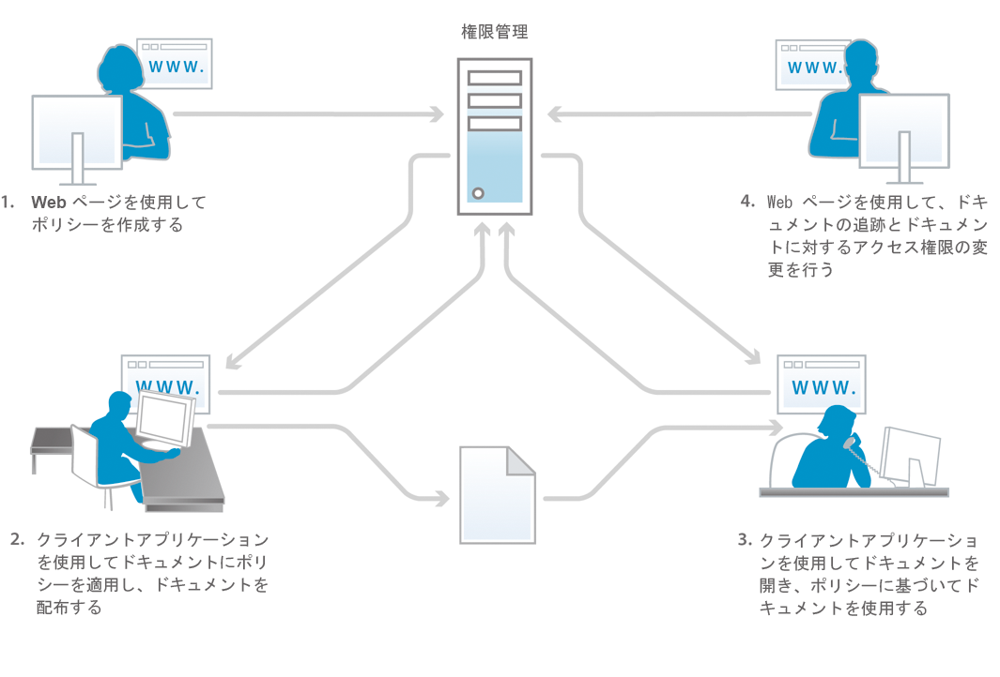
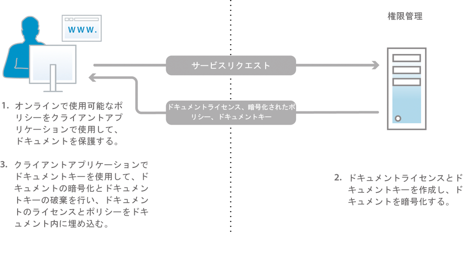
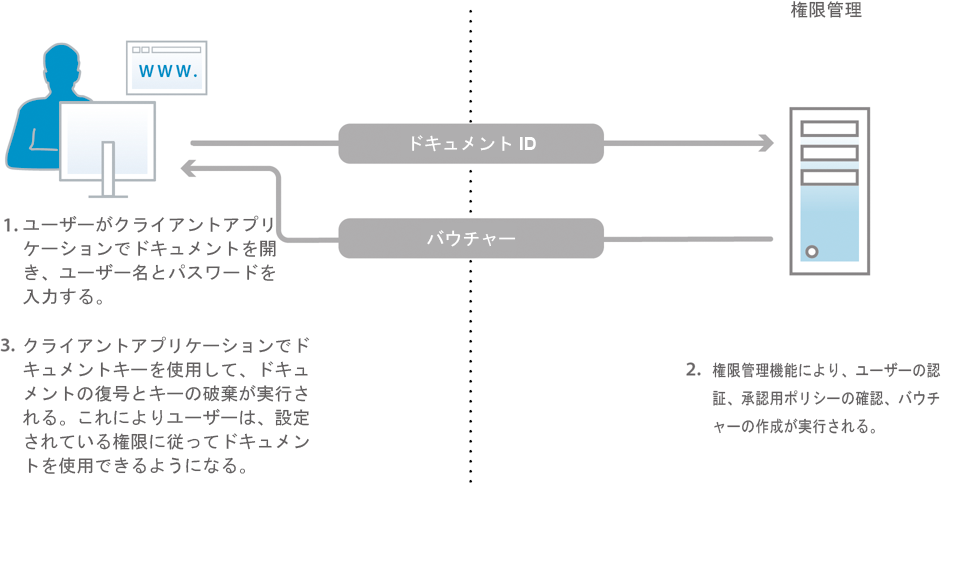

# Document Security について {#about-document-security}

Document Security を使用して、許可されたユーザーだけがドキュメントを使用するように指定できます。Document Security を使用すると、サポートされる形式で保存した情報を安全に配布できます。以下のファイル形式がサポートされます。

* Adobe PDF ファイル
* Microsoft® Word、Excel および PowerPoint ファイル

ポリシーでサポートされるファイルタイプを保護する方法について詳しくは、[詳細なDocument Security情報](https://www.adobe.com/go/learn_aemforms_doc_security_65)を参照してください。

Document Security を使用すると、事前定義の機密設定を簡単に作成および保存し、ドキュメントに適用できます。自分の管理の範囲を超えて情報が広がることを回避するために、ドキュメントの配布後に、ドキュメントの受信者によるドキュメントの使用方法を監視および制御することもできます。

ドキュメントを保護するには、ポリシーを使用します。*ポリシー*&#x200B;は、機密設定および許可されたユーザーの一覧を含む情報の集合です。ポリシーに指定する機密設定によって、ポリシーを適用したドキュメントを受信者が使用できる方法が決まります。例えば、テキストの印刷やコピー、テキストの編集、または保護されたドキュメントへの署名や注釈の追加を実行できるかどうかを指定することができます。

Document Security ユーザーが、エンドユーザーの Web ページを使用してポリシーを作成します。管理者は、Document Security Web ページを使用して、許可されたすべてのユーザーに提供される共有ポリシーのポリシーセットを作成します。

ポリシーは Document Security に保存されますが、クライアントアプリケーションを使用してドキュメントに適用します。PDF ドキュメントへのポリシーの適用方法について詳しくは、*Acrobat のヘルプ*&#x200B;を参照してください。Microsoft® Officeなどの他のアプリケーションを使用してポリシーを適用する方法については、『Acrobat Reader DC Extensionsヘルプ&#x200B;*』を参照してください。*

ドキュメントにポリシーを適用すると、ドキュメントに含まれる情報は、ポリシーで指定されている機密設定で保護されます。また、PDF ドキュメント内のファイル（テキスト、オーディオまたはビデオ）が、機密設定で保護されます。ポリシーで保護されたドキュメントを、ポリシーで許可された受信者に配布できます。

**ドキュメントのアクセス制御および監査**

ポリシーを使用してドキュメントを保護すると、ドキュメントを配布した後も、そのドキュメントを引き続き制御できます。ドキュメントの監視、ポリシーの変更、ドキュメントへのユーザーアクセスの禁止、およびドキュメントに適用されるポリシーの切り替えを行うことができます。

Document Security を通じて、ポリシーで保護されたドキュメントを監視したり、許可されたユーザーや許可されていないユーザーがドキュメントを開こうとするなどのイベントを追跡したりできます。

**コンポーネント**

Document Security は、サーバーとユーザーインターフェイスで構成されます。

**サーバー：**&#x200B;中心のコンポーネントです。Document Security では、ユーザー認証、ポリシーのリアルタイム管理、機密性の適用などのトランザクションをサーバーから実行します。サーバーは、ポリシー、監査レコードおよび他の関連情報の中央リポジトリとしての役割も果たします。

**Web ページ：**&#x200B;インターフェイスです。ポリシーの作成、ポリシーで保護されたドキュメントの管理およびポリシーで保護されたドキュメントに関連するイベントの監視に使用します。管理者は、ユーザー認証、監査、招待ユーザーへの通知などのグローバルオプションを設定したり、招待ユーザーのアカウントを管理することができます。

この図の各手順は次のとおりです。

1. ドキュメント所有者が、Web ページを使用してポリシーを作成します。ドキュメント所有者は、自分だけがアクセスできる個人用ポリシーを作成できます。管理者およびポリシーセットコーディネーターは、許可されたユーザーがアクセスできるポリシーセット内に共有ポリシーを作成できます。
1. ドキュメント所有者はポリシーを適用し、ドキュメントを保存および配布します。ドキュメントは、ネットワークフォルダーまたは Web サイトを通じて電子メールで配布できます。
1. 受信者は、適切なクライアントアプリケーションでドキュメントを開きます。受信者は、そのポリシーに従ってドキュメントを使用できます。
1. ドキュメント所有者、ポリシーセットコーディネーターまたは管理者は、Web ページを使用して、ドキュメントを追跡し、ドキュメントへのアクセスを変更することができます。

## Document Security ユーザーについて {#about-document-security-users}

Document Security では、様々な種類のユーザーがそれぞれ異なるタスクを実行します。

* システム管理者などの IS（情報システム）担当者は、Document Security をインストールおよび設定します。サーバー、Web ページ、ポリシーおよびドキュメントのグローバル設定を行うこともあります。

   これらの設定には、例えば、ベース Document Security URL、監査とプライバシー通知、招待ユーザーの登録通知、デフォルトのオフラインリース期間などが含まれます。

* Document Security 管理者は、ポリシーとポリシーセットを作成し、ポリシーで保護されたユーザーのドキュメントを必要に応じて管理します。また、招待ユーザーアカウントを作成したり、システム、ドキュメント、ユーザー、ポリシー、ポリシーセット、カスタムイベントを監視します。システム管理者と協力して、グローバルサーバー、Web ページおよびポリシー設定を行うこともあります。

   管理者は、管理コンソールの User Management 領域で、以下に示すロールをユーザーにアサインすることができます。これらのロールをアサインされたユーザーは、管理コンソールの Document Security ユーザーインターフェイス領域でタスクを実行します。

   **Document Security 上級管理者**

   このロールを持つユーザーは、管理コンソールのすべての Document Security 設定にアクセスできます。このロールに関連付けられている権限は以下のとおりです。

   * 設定の管理
   * ポリシーの管理
   * ポリシーセットの管理
   * ドキュメントの管理
   * ドキュメント発行者の管理
   * 招待ユーザーおよびローカルユーザーを管理します
   * イベントの表示
   * 委任
   * 外部ユーザーの招待

   **Document Security 管理者**

   このロールを持つユーザーは、管理コンソールの Document Security セクションの設定ページを使用して、Document Security サーバーを設定できます。このロールに関連付けられている権限は、設定の管理です。

   >[!NOTE]
   >
   >このロールを持つユーザーが管理コンソールにログインして設定関連の情報を編集するには、管理コンソールユーザーロールも必要です。

   **Document Security ポリシー設定管理者**

   このロールを持つユーザーは、管理コンソールの Document Security セクションを使用して、他のユーザーのポリシーを編集したり、ポリシーセットを作成、編集および削除したりできます。ポリシーセット管理者は、ポリシーセットを作成するときにポリシーセットコーディネーターをそのポリシーセットに割り当てることができます。このロールに関連付けられている権限は以下のとおりです。

   * ポリシーの管理
   * ポリシーセットの管理
   * ドキュメントの管理
   * ドキュメント発行者の管理
   * イベントの表示
   * 委任

   >[!NOTE]
   >
   >このロールを持つユーザーが管理コンソールにログインして設定関連の情報を編集するには、管理コンソールユーザーロールも必要です。

   **Document Security招待ユーザーとローカルユーザーを管理**

   このロールを持つユーザーは、すべての招待ユーザーとローカルユーザーの管理に必要なタスクを、関連する Document Security Web ページで実行できます。このロールに関連付けられている権限は以下のとおりです。

   * 招待ユーザーおよびローカルユーザーを管理します
   * 外部ユーザーの招待
   * エンドユーザー Web ページへのアクセス

   >[!NOTE]
   >
   >このロールを持つユーザーが管理コンソールにログインして設定関連の情報を編集するには、管理コンソールユーザーロールも必要です。

   **Document Security ユーザーの招待**

   このロールを持つユーザーは、ユーザーを招待できます。このロールに関連付けられている権限は以下のとおりです。

   * 外部ユーザーの招待
   * エンドユーザー Web ページへのアクセス

   **Document Security エンドユーザー**

   このロールを持つユーザーは、Document Security エンドユーザー Web ページにアクセスできます。このロールを管理者に割り当て、管理者がエンドユーザーのページを使用してポリシーを作成できるようにすることができます。このロールに関連付けられている権限は、エンドユーザー Web ページへのアクセスです。

* 有効な Document Security アカウントを持つ組織内のユーザーは、独自のポリシーの作成、ポリシーによるドキュメントの保護、ポリシーで保護されたドキュメントの追跡と管理、および自分のドキュメントに関連するイベントの監視を行います。
* ポリシーセットコーディネーターは、ドキュメントの管理、イベントの表示および他のポリシーセットコーディネーターの管理（権限に基づく）を行います。管理者が、特定のポリシーセットのポリシーセットコーディネーターとしてユーザーを指定します。
* ビジネスパートナーなどの組織外のユーザーは、Document Security ディレクトリに含まれている場合、管理者によって専用のアカウントが作成された場合、または自動電子メール招待プロセスを通じて Document Security に登録された場合に、ポリシーで保護されたドキュメントを使用できます。管理者が指定するアクセス設定に応じて、招待ユーザーは、ドキュメントにポリシーを適用したり、ポリシーを作成、変更および削除したりすることができます。また、他の外部ユーザーを招待して、ポリシーで保護されたドキュメントを使用させることもできます。
* 開発者は、AEM Forms SDKを使用して、カスタムアプリケーションをDocument Securityと統合します。

Document Security 管理者は、User Management の次の権限を使用して、カスタムロールを作成できます。

* Document Security 設定の管理
* Document Security 招待ユーザーおよびローカルユーザーの管理
* Document Security ポリシーセットの管理
* Document Security ポリシーセットの管理
* Document Security サーバーイベントの表示
* Document Security ポリシー所有者の変更

## ポリシーおよびポリシーで保護されたドキュメント {#policies-and-policy-protected-documents}

*ポリシー*&#x200B;では、機密設定、およびポリシーが適用されるドキュメントにアクセスできるユーザーのセットを定義します。ポリシーによって、ドキュメントに関する権限を動的に変更することもできます。ポリシーによって、ドキュメントを保護するユーザーに、機密設定の変更、ドキュメントのアクセス権限の失効またはポリシーの切り替えを行う権限を付与します。

ポリシー保護を PDF ドキュメントに適用するには、Adobe Acrobat® Pro および Acrobat Standard を使用します。ポリシー保護は、適切なAcrobat Reader DC Extensionsがインストールされたクライアントアプリケーションを使用して、Microsoft® Word、Excel、PowerPointファイルなど、他のファイルタイプに適用できます。

### ポリシーの使用 {#how-policies-work}

ポリシーは、許可されたユーザーおよびドキュメントに適用される機密設定に関する情報で構成されます。組織内の人およびアカウントを持っている組織外の人がユーザーになることができます。管理者がユーザー招待機能を有効にしている場合は、新しいユーザーをポリシーに追加することができます。この場合、登録招待用の電子メールプロセスが開始されます。

ポリシーの機密設定によって、受信者がドキュメントをどのように使用できるかが決まります。例えば、テキストの印刷やコピー、変更、または保護されたドキュメントへの署名や注釈の追加を実行できるかどうかを指定することができます。同じポリシーで、特定のユーザーに対して異なる機密設定を指定することもできます。

>[!NOTE]
>
>ポリシーを通じて適用される機密設定は、Acrobat でパスワードまたは証明書セキュリティオプションを使用して PDF ドキュメントに適用された設定よりも優先されます（詳しくは、Acrobat のヘルプを参照）。

ユーザーと管理者は、Document Security Web ページを使用してポリシーを作成します。ドキュメントに適用されるのは、一度に 1 つのポリシーだけです。以下のいずれかの方法でポリシーを適用できます。

* Acrobat または他のクライアントアプリケーションでドキュメントを開き、ドキュメントを保護するためのポリシーを選択します。
* Microsoft® Outlookでドキュメントを電子メールの添付ファイルとして送信します。 この場合は、ポリシーのリストからポリシーを選択するか、Acrobat がデフォルトの機密設定のセットで作成する自動生成ポリシーを選択して、電子メールの受信者に対してのみドキュメントを保護します。

ポリシーをドキュメントから削除するには、クライアントアプリケーションを使用します。

この図の各手順は次のとおりです。

1. ドキュメント所有者は、サポートされているクライアントアプリケーションのドキュメントを、オンラインでの使用を許可するポリシーで保護します。
1. Document Security によって、ドキュメントライセンスとドキュメントキーが作成され、ポリシーが暗号化されます。ドキュメントライセンス、暗号化されたポリシーおよびドキュメントキーはクライアントアプリケーションに返されます。
1. ドキュメントがドキュメントキーを使用して暗号化され、ドキュメントキーは破棄されます。ドキュメントには、ライセンスとポリシーが埋め込まれています。これらのタスクはサポートされるクライアントアプリケーションで実行されます。

ドキュメントにポリシーを適用する場合、PDF ドキュメントに含まれるすべてのファイル（テキスト、オーディオまたはビデオ）をはじめ、ドキュメントに含まれる情報は、ポリシーで指定されている機密設定で保護されます。Document Security によってライセンスと暗号化情報が生成され、ドキュメントに埋め込まれます。ドキュメントを配布すると、それを開こうとする受信者が Document Security によって認証され、ポリシーで指定されている権限に従ってその受信者のアクセスが許可されます。

オフラインでの使用が有効になっている場合、受信者は、ポリシーで保護されたドキュメントを、ポリシーで指定される期間、オフライン（アクティブなインターネット接続やネットワーク接続がない状態）で使用することもできます。

### ポリシーで保護されたドキュメントの動作方法 {#how-policy-protected-documents-work}

ポリシーで保護されたドキュメントを開いて使用するには、ポリシーに自分の名前が受信者として含まれている必要があり、さらに有効な Document Security アカウントを保持している必要があります。PDF ドキュメントの場合は、Acrobat または Adobe Reader® が必要です。その他のファイルタイプの場合は、Acrobat Reader DC Extensionsがインストールされたファイルに適したアプリケーションが必要です。

ポリシーで保護されたドキュメントを開こうとすると、Acrobat、Adobe Reader、またはAcrobat Reader DC ExtensionsがDocument Securityに接続し、認証がおこなわれます。 その後、ログオンに進むことができます。ドキュメントの使用が監査されている場合は、通知メッセージが表示されます。Document Security は、付与されるドキュメント権限を判別した後、ドキュメントの復号化を管理します。この後で、ユーザーはポリシーの機密設定に従ってドキュメントを使用できるようになります。

この図の各手順は次のとおりです。

1. ドキュメントユーザーが、サポートされているクライアントアプリケーションでドキュメントを開きます。このとき、サーバーによって認証が行われます。ドキュメント ID が Document Security サーバーに送信されます。
1. Document Security でユーザーが認証され、認証用のポリシーが確認され、バウチャーが作成されます。バウチャー（ドキュメントキーと権限を含む）は、クライアントアプリケーションに送り返されます。
1. ドキュメントはドキュメントキーを使用して解読され、ドキュメントキーは破棄されます。ドキュメントはポリシーの機密設定に従って使用できるようになります。これらのタスクはサポートされるクライアントアプリケーションで実行されます。

以下の条件のもとで、ドキュメントを使用し続けることができます。

* 無期限またはポリシーで指定される有効期間内。
* 管理者またはポリシーを適用したユーザーが、ドキュメントのアクセス権限を失効するか、ポリシーを変更するまで。

ポリシーでオフラインアクセスが許可されている場合は、ポリシーで保護されたドキュメントをオフライン（インターネット接続やネットワーク接続がない状態）で使用することもできます。最初に Document Security にログインして、ドキュメントを同期する必要があります。その後、ポリシーで指定されているオフラインリース期間の間、ドキュメントを使用できます。

オフラインリース期間が終了した場合は、オンラインにしてポリシーで保護されたドキュメントを開くか、クライアントアプリケーションのコマンドを使用して、ドキュメントを Document Security と再び同期させる必要があります(詳しくは、*Acrobatのヘルプ*&#x200B;または適切な&#x200B;*Acrobat Reader DC Extensionsのヘルプ*&#x200B;を参照してください)。

ポリシーで保護されたドキュメントを「保存」メニューコマンドまたは「別名で保存」メニューコマンドを使用して保存すると、新しいドキュメントにポリシーが自動的に適用および実行されます。新しいドキュメントを開くなどのイベントも監査されて、元のドキュメントで記録されます。

## ポリシーセット {#policy-sets}

ポリシーセット&#x200B;**&#x200B;は、ある共通の目的を持つ一群のポリシーをグループ化するために使用します。作成されたポリシーセットは、システム内のユーザーのサブセットに対して提供されます。

それぞれのポリシーセットには、1 人以上のポリシーセットコーディネーターを設定できます。ポリシーセットコーディネーターは、管理者、または権限を持つユーザーです。 一般に、*ポリシーセットコーディネーター*&#x200B;には、特定のポリシーセット内に最も効果的なポリシーを作成できる組織内の専門家を指定します。

ポリシーセットコーディネーターは、以下のタスクを実行できます。

* 新しいポリシーの作成
* ポリシーセット内のポリシーの編集と削除
* ポリシーセット設定の編集
* ポリシーセットコーディネーターの追加と削除
* ポリシーセットに含まれるポリシーまたはドキュメントのポリシーイベントとドキュメントイベントの表示
* ドキュメントへのアクセス権限の取り消し
* ドキュメントのポリシーの切り替え

>[!NOTE]
>
>`getAllPolicysetnames()` APIを使用して、データベースから最大1,000個のポリシーセット名を取得できます。

管理者および権限を持つポリシーセットコーディネーターは、Document Security の管理 Web ページを使用して、ポリシーセットを作成および削除します。

通常、ポリシーセットを使用できるユーザーの数は制限されています。この制限は、ドメイン内のどのユーザーやグループがドキュメントを保護するためにポリシーセットのポリシーを使用できるのかを指定することにより行います。

Document Security のインストール時に、*グローバルポリシーセット*&#x200B;と呼ばれるデフォルトのポリシーセットが作成されます。ソフトウェアをインストールした管理者が、このポリシーセットを管理します。

## ベストプラクティス {#best-practices}

ポリシーは、様々なドキュメントに適用できる、再利用可能な権限とユーザーグループのセットです。 保護されたドキュメント用。 これらのポリシーにより、許可された機能を使用できるのは、許可されたユーザーのみになります。 部門内の様々なユーザーの役割やドキュメントの増加に伴い、ポリシーやポリシーセットの数が増加すると予想されます。 以下に、ポリシーを作成および管理するための考慮事項とベストプラクティスを示します。

* **再利用可能なポリシーの作成：** Adobeでは、様々なドキュメントにわたってポリシーを再利用することをお勧めします。これにより、ポリシーの数を最小限に抑え、最適なパフォーマンスを提供し、ポリシーの管理を容易にできます。 再利用可能なポリシーを作成するには：

1. 部門レベルおよび組織レベルでアクセス制御要件を特定し、定義します。

1. ユーザーグループを作成し、これらのグループにユーザーを追加します。

1. ポリシーセットを作成します。 

1. ポリシーセットを開き、ポリシーを作成します。 ユーザーグループを追加し、ポリシーの機密性（アクセス制御）設定を設定します。

個々のユーザーではなくポリシーにユーザーグループを追加します。 これにより、多数のユーザーに対するポリシーの管理と適用が容易になります。

* **カスタムポリシーセットの作成：** ポリシーセットは、複数のポリシーを1つの管理可能なエンティティに組み合わせます。組織または部門のカスタムポリシーセットを作成し、それらを使用して関連するポリシーをグループ化し、システム内のユーザーのサブセットで使用できるようにします。

   ポリシーセットを使用すると、組織または部門の特定のユーザーに関連するポリシーを割り当て、管理しやすくなります。 たとえば、財務部門と人事部門の個別のポリシーセットを使用すると、関連するポリシーを容易に管理し、対応する部門に指定されたドキュメントに適用できます。

* **外部の認証者を使用して、動的に権限を適用する：** 外部の認証者を使 [用し](https://help.adobe.com/en_US/livecycle/11.0/ProgramLC/WS624e3cba99b79e12e69a9941333732bac8-6f26.2.html) て、外部の条件に基づいて権限を評価し、動的に適用できます。権限が外部条件に基づいて動的に評価される場合、次の操作を実行できます。

   * 組織内のドキュメントに対して一元的なアクセス制御を提供します。

   * ポリシーで保護されたドキュメントにユーザーがアクセスできるかどうかを動的に判断することで、ポリシーで保護されたドキュメントへのアクセスを制御します。 例えば、は、ユーザーがポリシーで保護されたドキュメントを印刷できるかどうかを動的に決定します。

   * 標準のポリシー評価プロセスに加えて、コンテンツ管理システムで使用されるアクセス制御メカニズムを使用します。 例えば、ユーザーがポリシーで保護されたドキュメントを印刷できるかどうかを判断する場合は、標準のポリシー評価プロセスと、コンテンツ管理システムで使用されるアクセス制御メカニズムを使用できます。
   Document Securityポリシーの評価プロセスを外部の承認ハンドラーで完全に置き換えることは可能ですが、外部の承認ハンドラーをポリシー評価プロセスと組み合わせて使用することをお勧めします。 その結果、ドキュメントアクセスは、コンテンツ管理システムで使用するのと同じ制御メカニズムで制御できます。 例えば、Document Securityサービスは、ユーザーがポリシーで保護されたドキュメントを印刷できるかどうかを判断する際に、標準のポリシー評価プロセスと、コンテンツ管理システムで使用されるアクセス制御メカニズムを使用します。 詳しくは、[外部認証ハンドラーの作成](https://help.adobe.com/en_US/livecycle/11.0/ProgramLC/WS624e3cba99b79e12e69a9941333732bac8-6f26.2.html)を参照してください。

* **ポリシーセットを制限された数に保つ：** いくつかの要因が、ポリシーおよびポリシーセットの継続的な増加につながります。一般的な要因は次のとおりです。

   * 一定期間における組織内のユーザーの役割、部門、ドキュメントの増加。
   * 組織の部門は単独で作業し、部門固有のポリシーを厳格に管理します。 組織内で同じポリシーが作成されます。

   Adobeでは、ポリシーおよびポリシーセットの数を最小限に抑えることをお勧めします。 ポリシーとポリシーセットを容易に管理し、パフォーマンスを向上させます。 数を最小限に抑えるには、次の手順に従います。

   * 再利用可能なポリシーを作成します。 これらは複数の部門で共有できます。
   * 一部のポリシーが各部門の個々のポリシー・セットではなく複数の部門に適用される場合は、組織全体のポリシー・セットの作成を検討します。
   * ポリシーセット内のグループ関連ポリシー。 各ポリシーに個別のポリシーセットを作成しないでください。
   * 外部の認証者を使用して、ユーザー権限を動的に制御します。

   >[!NOTE]
   >
   > [getAllPolicysetnames()](https://helpx.adobe.com/experience-manager/6-5/forms/programlc/javadoc/com/adobe/livecycle/rightsmanagement/client/PolicyManager.html) APIを使用して、最大1,000個のポリシーセット名を取得できます。 APIは内部的に、API呼び出し元がドキュメント発行者権限を持つ最大1,000個のポリシーを取得し、取得したポリシーに関連付けられた一意のポリシーセット名のリストを作成して返します。 例えば、APIが1,000個のポリシーを取得し、取得したポリシーが合計200個のポリシーセットに関連付けられている場合、APIは200個のポリシーセット名のみを返します。
