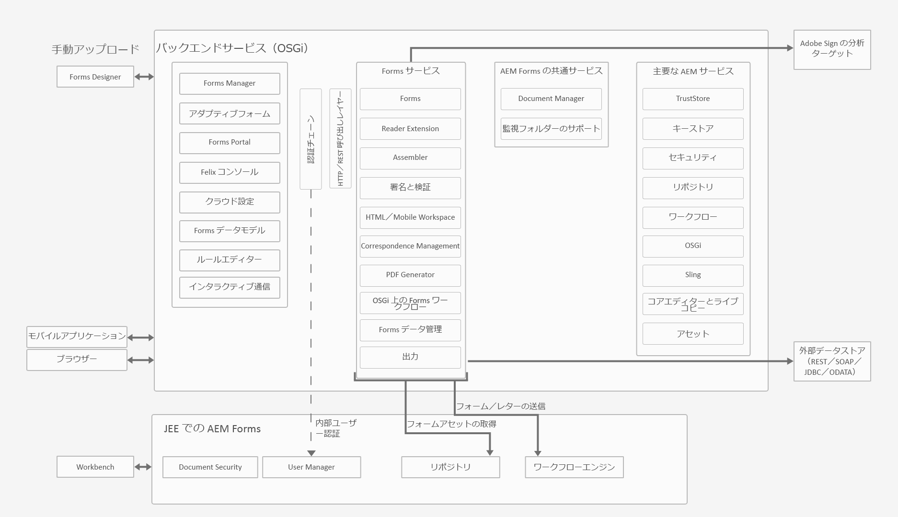
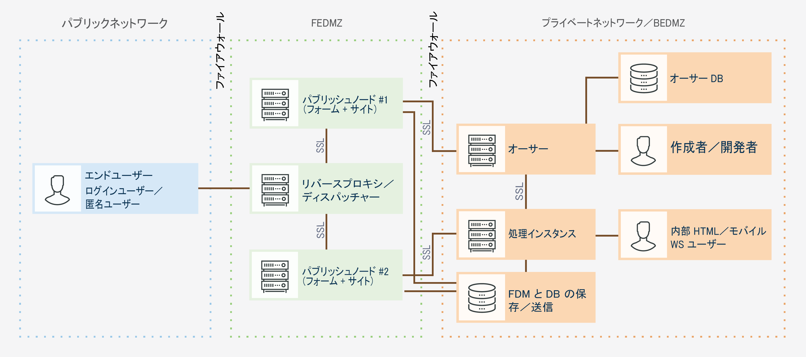
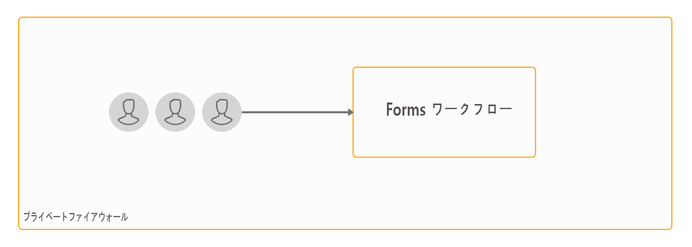
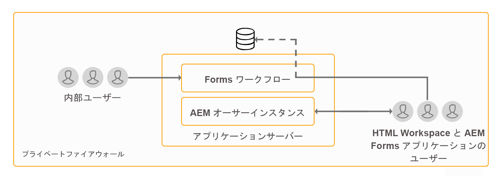
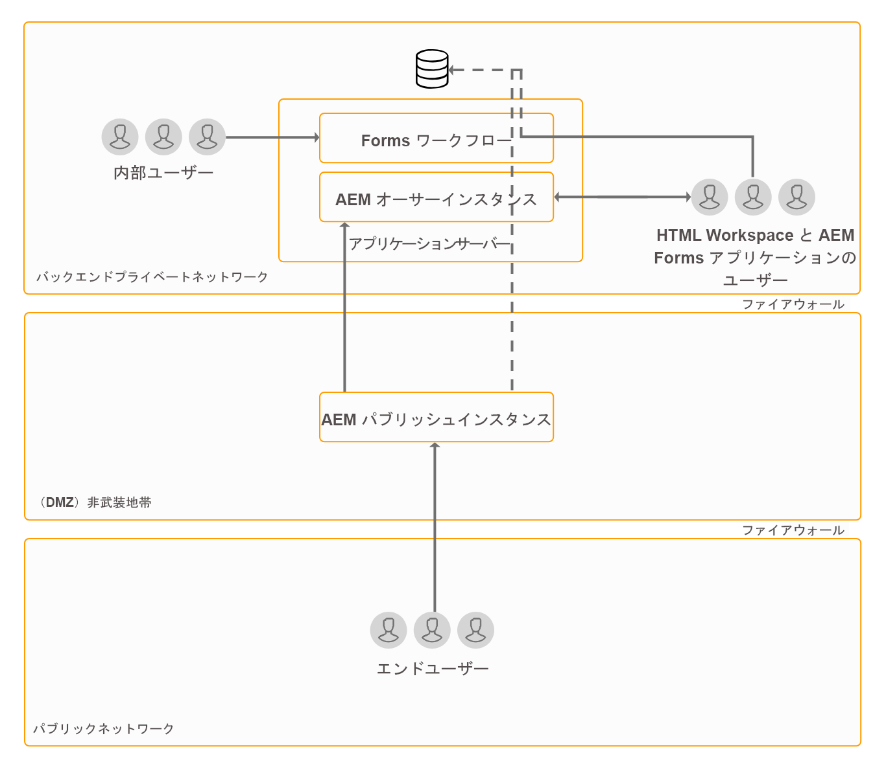
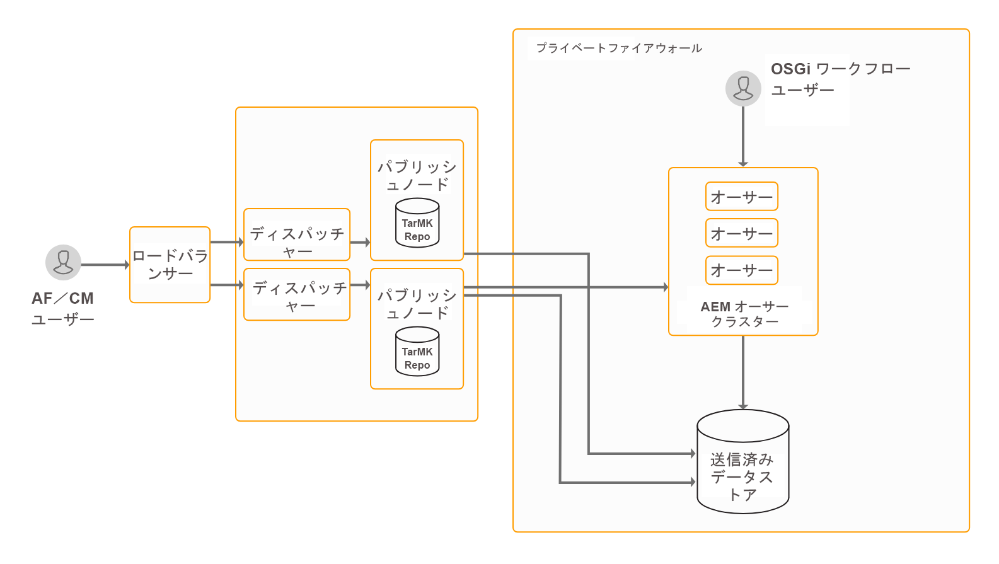
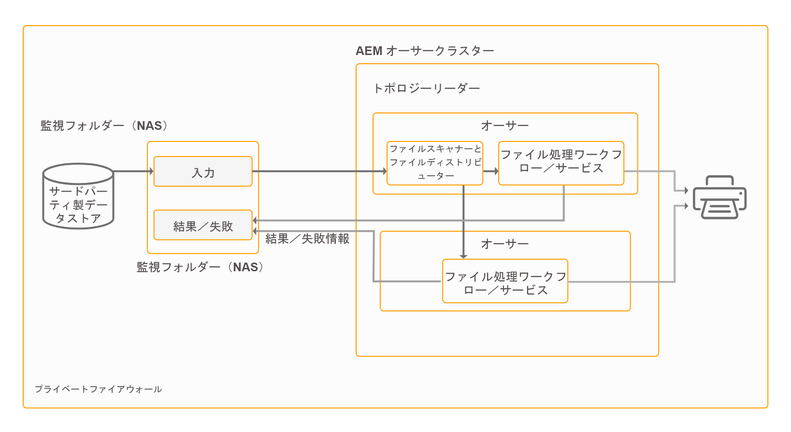
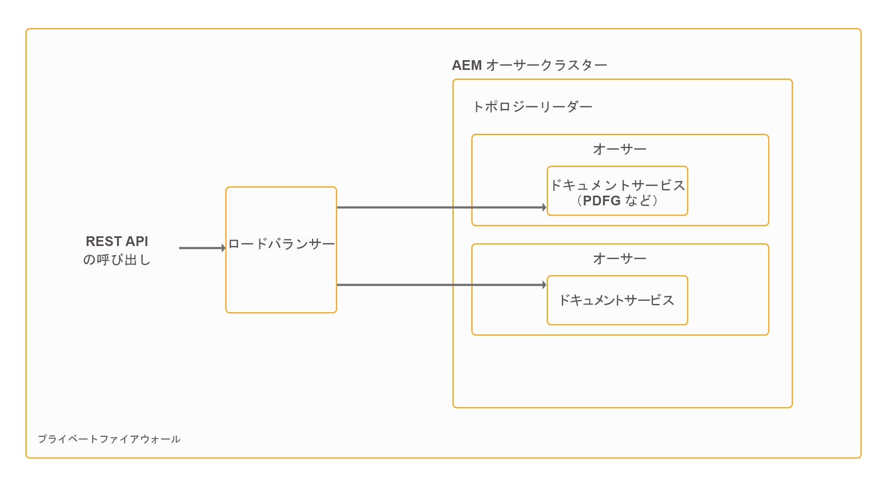

# AEM Forms のアーキテクチャとデプロイメントトポロジー {#architecture-and-deployment-topologies-for-aem-forms}

## アーキテクチャ {#architecture}

AEM Formsは、AEMパッケージとしてAEMにデプロイされるアプリケーションです。 このパッケージは、AEM Formsアドオンパッケージと呼ばれます。 AEM Formsアドオンパッケージには、AEM OSGiコンテナにデプロイされるサービス（APIプロバイダー）と、AEM Slingフレームワークで管理されるサーブレットまたはJSP（フロントエンドとREST APIの両方の機能を提供）の両方が含まれています。 次の図は、このセットアップを示しています。

AEM Forms のアーキテクチャには、次のコンポーネントが含まれています。

* **AEM のコアサービス:** 組み込みアプリケーションに対して提供される AEM の基本サービス。これらのサービスには、JCR準拠のコンテンツリポジトリ、OSGIサービスコンテナ、ワークフローエンジン、Trust Store、キーストアなどが含まれます。 これらのサービスは AEM Forms アプリケーションで使用できますが AEM Forms パッケージには含まれていません。これらのサービスはAEMスタック全体の不可欠な要素であり、様々なAEM formsコンポーネントはこれらのサービスを使用します。
* **** Formsサービス：PDFドキュメントの作成、アセンブリ、配布、アーカイブなど、フォーム関連の機能を提供し、電子署名を追加してドキュメントへのアクセスを制限し、バーコードフォームをデコードします。 これらのサービスは、AEMに共にデプロイされたカスタムコードによって、一般に利用できます。
* **Web レイヤー：**&#x200B;共通のサービスおよびフォームのサービス上に構築された JSP またはサーブレットで、次の機能を提供します。

   * **フロントエンドのオーサリング：**&#x200B;フォームのオーサリングと管理に使用されるユーザーインターフェイス。
   * **フォームのレンダリングおよび送信のフロントエンド**：AEM Forms のエンドユーザー向けユーザーインターフェイス（行政機関の Web サイトにアクセスするユーザー向けのユーザーインターフェイスなど）。これにより、フォームのレンダリング（Webブラウザーでの表示フォーム）と送信機能が提供されます。
   * **** REST API：JSP および サーブレットにより、モバイル SDK フォームなど、HTTP ベースのクライアントによるリモートでの利用向けにフォームサービスのサブセットがエクスポートされます。

**** OSGi上のAEM Forms:OSGi上のAEM Forms環境は、標準のAEM AuthorまたはAEM PublishとAEM formsパッケージをデプロイしたものです。 You can run AEM Forms on OSGi in a [single server environment, Farm, and clustered setups](/help/sites-deploying/recommended-deploys.md). クラスター設定は、AEM作成者インスタンスでのみ使用できます。

**** JEE上のAEM Forms:JEE上のAEM formsは、JEEスタック上で実行されるAEM Formsサーバーです。 AEM formsアドオンパッケージを含むAEM authorと、アプリケーションサーバー上で実行される単一のJEEスタックに同時にデプロイされる追加のAEM Forms JEE機能があります。 JEE上のAEM Formsは、シングルサーバーおよびクラスター環境で実行できます。 JEE上のAEM Formsは、Document Security、Process Managementを実行する場合と、LiveCycleのお客様がAEM Formsにアップグレードする場合にのみ必要です。 JEE上のAEM Formsを使用する場合の追加シナリオを次に示します。

* **** HTML workspaceのサポート（HTML Workspaceを使用するお客様向け）:JEE上のAEM Formsでは、処理インスタンスを使用したシングルサインオンを有効にし、処理インスタンスでレンダリングされた特定のアセットを提供し、HTML Workspace内でレンダリングされたフォームの送信を処理します。
* **高度なフォーム/インタラクティブ通信データ処理**:高度なプロセス管理機能が必要な複雑な場合は、JEE上のAEM Formsを使用して、フォーム/インタラクティブ通信データの追加処理（および結果を適切なデータストアに保存）を行うことができます。

JEE上のAEM Formsには、AEMコンポーネントに対して次のサポートサービスも含まれています。

* **** 統合されたユーザー管理：JEE上のAEM FormsのユーザーがOSGi上のAEM formsユーザーとして認識され、OSGiユーザーとJEEユーザーの両方でSSOを有効にするのに役立ちます。 これは、OSGi上のAEM formsとJEE上のAEM Formsの間のシングルサインオンが必要なシナリオ（例えば、HTML Workspace）で必要になります。
* **** アセットのホスティング：JEE上のAEM Formsは、OSGi上のAEM Forms上でレンダリングされたアセット（例えば、HTML5フォーム）を提供できます。

AEM Formsオーサリングユーザーインターフェイスは、レコードのドキュメント(DOR)、PDFフォーム、およびHTML5フォームの作成をサポートしていません。 このようなアセットは、スタンドアロンのForms Designerアプリケーションを使用してデザインされ、AEM Forms Managerに個別にアップロードされます。 また、JEE上のAEM Formsでは、フォームをアプリケーション（AEM Forms Workbench内）アセットとしてデザインし、JEEサーバー上のAEM Formsにデプロイすることもできます。

OSGi上のAEM FormsとJEE上のAEM Formsには、両方ともワークフロー機能があります。 JEE上のAEM Formsの本格的なProcess Management機能をインストールする必要なく、OSGi上のAEM formsの様々なタスクの基本的なワークフローを迅速に構築し、デプロイできます。 OSGi上のAEM Formsでのフォーム [中心のワークフローの機能と、JEE上のAEM FormsのProcess Management機能には、いくつかの違いがあります](/help/forms/using/capabilities-osgi-jee-workflows.md)。 OSGi上のAEM Formsでのフォーム中心のワークフローの開発と管理では、使い慣れたAEM WorkflowとAEM Inboxの機能を使用します。

## 用語 {#terminologies}

以下の図は、AEM Forms の一般的なデプロイメント環境で使用される AEM Forms サーバーの様々な設定とそのコンポーネントを示しています。

**オーサーインスタンス：**&#x200B;オーサーインスタンスは、標準の作成者実行モードで稼働する AEM Forms サーバーです。オーサーインスタンスは、OSGi 環境内の JEE 上の AEM Forms にすることも、OSGi 環境内の AEM Forms にすることもできます。このインスタンスは、内部ユーザー、フォームとインタラクティブ通信の設計者、開発者が使用するためのインスタンスです。このインスタンスでは、次の機能を使用することができます。

* **フォームとインタラクティブ通信の作成機能と管理機能：**&#x200B;設計者と開発者は、アダプティブフォームとインタラクティブ通信の作成と編集を行うことができます。また、外部で作成されたフォーム（Adobe Forms Designer で作成されたフォームなど）をアップロードしたり、こうしたアセットを Forms Manager コンソールを使用して管理したりすることができます。
* **フォームとインタラクティブ通信の発行機能：**&#x200B;オーサーインスタンス上でホストされるアセットをパブリッシュインスタンスに発行して、ランタイム操作を実行することができます。AEM の複製機能を使用して、アセットが発行されます。すべてのオーサーインスタンス上で、発行済みフォームを処理インスタンスに手動でプッシュするための複製エージェントを設定し、受信したフォームをパブリッシュインスタンスに対して自動的に複製するための、「*受信時*」トリガーが有効になっている複製エージェントを処理インスタンス上で設定することをお勧めします。

**** 公開：発行インスタンスは、標準の発行実行モードで実行されるAEM Formsサーバーです。 パブリッシュインスタンスは、フォームベースのアプリケーションを使用するエンドユーザー向けのインスタンスです。例えば、公開されている Web サイトにアクセスしてフォームを送信するユーザーなどが、このインスタンスを使用します。このインスタンスでは、次の機能を使用することができます。

* エンドユーザー用のフォームのレンダリングと送信を行う機能。
* 送信済みフォームの未加工データを処理インスタンスに転送してさらに処理を行い、最終的な記録システムに保存する機能。この機能は、AEM Forms に付属するデフォルトの実装で AEM の逆複製機能を使用して実行されます。代替処理として、最初にフォームデータをローカルに保存するのではなく、フォームデータを処理インスタンスに直接プッシュすることもできます（逆複製を行うには、最初にフォームデータをローカルに保存しておく必要があります）。Customers having concerns about storage of potentially sensitive data on publish instances can go in for this [alternative implementation](/help/forms/using/configuring-draft-submission-storage.md), since processing instances typically lie in a more secure zone.
* インタラクティブな通信とレターのレンダリングと送信：インタラクティブな通信とレターがパブリッシュインスタンスでレンダリングされ、対応するデータが処理インスタンスに送信されて保存と後処理が行われます。 このデータをパブリッシュインスタンス上のローカルの場所に保存して、処理インスタンスに対してこのデータを逆複製することも、このデータをパブリッシュインスタンスに保存することなく、処理インスタンスに直接プッシュすることもできます（デフォルトのオプションは逆複製です）。セキュリティを意識している顧客の場合は、処理インスタンスに直接プッシュするオプションを使用することをお勧めします。

**** 処理：作成者実行モードで実行され、ユーザーがForms Managerグループに割り当てられていないAEM Formsのインスタンス。 JEE上のAEM FormsまたはOSGi上のAEM Formsは、処理インスタンスとしてデプロイできます。 ユーザーは、フォームの作成と管理のアクティビティが処理インスタンスで実行されず、作成者インスタンスでのみ実行されるように割り当てられません。 処理インスタンスでは、次の機能を使用することができます。

* **** 発行インスタンスから到着する生のフォームデータの処理：これは、主に、データの受信時にトリガーされるAEMワークフローを介した処理インスタンスで実行されます。 ワークフローでは、あらかじめ用意されている「フォームデータモデル」の手順を使用して、データまたはドキュメントを適切なデータストアにアーカイブできます。
* **フォームデータを安全な場所に保存する機能：**&#x200B;処理インスタンスには、ファイアウォールの背後に配置されたリポジトリが用意されています。このリポジトリを使用して、ユーザーから隔離された未加工のフォームデータが保存されます。作成者インスタンス上のフォーム開発者も、発行インスタンス上のエンドユーザーも、このリポジトリにアクセスできません。

   >[!NOTE]
   >
   > アドビでは、AEMリポジトリを使用する代わりに、最終処理済みのデータを保存する場合は、サードパーティのデータストアを使用することをお勧めします。

* **** 発行インスタンスから到着する通信データの保存と後処理：AEMワークフローは、対応するレター定義のオプションの後処理を実行します。 AEM ワークフローで、最終的な処理済みデータを、適切な外部データストアに保存することができます。

* **HTML Workspaceホスティング**:処理インスタンスは、HTML Workspaceのフロントエンドをホストします。 HTML workspaceは、レビュープロセスと承認プロセスに関連付けられたタスク/グループ割り当てのUIを提供します。

処理インスタンスは、作成者実行モードで実行するように設定されます。理由は次のとおりです。

* 作成者実行モードの場合、パブリッシュインスタンスの未加工のフォームデータを逆複製することができます。デフォルトのデータストレージハンドラーには逆複製機能が必要です。
* 発行インスタンスから到着する生のフォームデータを処理する主な手段であるAEM Workflowは、作成者スタイルのシステムで実行することをお勧めします。

## JEE 上の AEM Forms の物理的なトポロジーの例 {#sample-physical-topologies-for-aem-forms-on-jee}

以下に推奨するJEE上のAEM Formsトポロジは、主にLiveCycleまたはJEE上のAEM Formsの以前のバージョンからアップグレードするお客様向けです。 新規インストールの場合は、OSGiでのAEM formsの使用をお勧めします。 JEE上のAEM Formsの新規インストールは、Document SecurityおよびProcess Management機能の使用にのみ推奨されます。

### ドキュメントサービスまたはドキュメントセキュリティ機能を使用するためのトポロジー {#topology-for-using-document-services-or-document-security-capabilities}

ドキュメントサービスまたはドキュメントセキュリティ機能だけを使用する場合は、以下のようなトポロジーを構成することをお勧めします。このトポロジでは、AEM Formsの単一のインスタンスを使用することをお勧めします。 必要に応じて、AEM Formsサーバーのクラスターまたはファームを作成することもできます。 このトポロジは、ほとんどのユーザーがプログラムでAEM Formsサーバーの機能にアクセスし、ユーザーインターフェイスを介した介入が最小限の場合に推奨されます。 このトポロジは、ドキュメントサービスのバッチ処理操作で役立ちます。 例えば、出力サービスを使用して、編集不可の PDF ドキュメントを毎日数百件作成するような場合に、このトポロジーを構成することをお勧めします。

ただし、AEM Formsでは、すべての機能を1つのサーバーから設定および実行できます。ただし、実稼働環境では、特定の機能に対して、容量計画、ロードバランシング、専用サーバーの設定を行う必要があります。 例えば、PDF Generatorサービスを使用して1日に数千ページを変換し、電子署名を追加してドキュメントへのアクセスを制限する環境では、PDF Generatorサービスと電子署名機能用に別々のAEM Formsサーバーを設定します。 これにより、パフォーマンスが最適化され、各サーバーを個別にスケーリングできるようになります。

### Topology for using AEM Forms process management {#topology-for-using-aem-forms-process-management}

AEM Formsのプロセス管理機能の使用を計画しているAEM Formsのお客様、例えば、HTML Workspaceは、次に示すトポロジと類似したトポロジを持つことができます。 JEE上のAEM Formsサーバーは、単一のサーバー設定またはクラスター設定にすることができます。

LiveCycle ES4からアップグレードする場合、このトポロジは、JEE上のAEM Formsに組み込みのAEM authorを追加する点を除き、LiveCycleに既に存在するものと密接に関連します。 また、アップグレードを実行する場合も、クラスタリング要件は変わりません。クラスター環境でAEM Formsを使用していた場合は、AEM 6.5 Formsでも同じことを続行できます。 HTML Workspaceを使用するためにJEEのAEM Formsを新規インストールする場合は、JEE環境に組み込まれたAEM作成者インスタンスを実行する必要があります。

フォームデータストアは、フォームとインタラクティブ通信の最終処理データを保存するために使用されるサードパーティのデータストアです。 このデータストアは、このトポロジーにおけるオプションの構成要素です。また、必要に応じて、処理インスタンスを設定し、そのリポジトリを最終的な記録システムとして使用することもできます。

このトポロジは、後処理、アダプティブフォーム、HTML5フォーム、およびインタラクティブ通信機能を使用せずに、プロセス管理機能(HTML Workspace)用にJEE上のAEM Formsを使用するお客様に推奨されます。

### アダプティブフォーム、HTML5フォーム、インタラクティブ通信機能を使用するためのトポロジ {#topology-for-using-adaptive-forms-html-forms-interactive-communication-capabilities}

アダプティブフォーム、HTML5 フォーム、PDF フォームなど、AEM Forms のデータ取得機能を使用する場合は、以下のようなトポロジーを構成することをお勧めします。このトポロジは、AEM Formsのインタラクティブ通信機能を使用する場合にも推奨されます。

上記の推奨トポロジに対して、次の変更/カスタマイズを行うことができます。

* HTML WorkspaceおよびAEM Formsアプリケーションを使用するには、AEMの作成者または処理インスタンスが必要です。 外部の AEM オーサーサーバーを追加でセットアップする代わりに、JEE サーバー上の AEM Forms に組み込まれた AEM オーサーインスタンスを使用することができます。
* AEM作成者インスタンスまたは処理インスタンスは、OSGi、アダプティブフォーム、フォームポータル、およびインタラクティブ通信のフォーム中心のワークフローでのみ必要です。
* 対話型通信エージェントUIは、通常、組織内で実行されます。 したがって、エージェントUI用のパブリッシュサーバをプライベートネットワーク内に保持できます。
* JEEサーバー上のAEM Formsに組み込まれたOSGi上のAEM formsは、フォーム中心のワークフローをOSGiおよび監視フォルダーで実行することもできます。

## OSGi 上の AEM Forms を使用する場合の物理的なトポロジーの例 {#sample-physical-topologies-for-using-aem-forms-on-osgi}

### Topology for data capture, interactive communication, Form-Centric Workflow on OSGi capabilities {#topology-for-data-capture-interactive-communication-form-centric-workflow-on-osgi-capabilities}

アダプティブフォーム、HTML5 フォーム、PDF フォームなど、AEM Forms のデータ取得機能を使用する場合は、以下のようなトポロジーを構成することをお勧めします。インタラクティブ通信機能と OSGi 上のフォームベースワークフロー機能を使用する場合も、このトポロジーを構成することをお勧めします。例えば、ビジネスプロセスワークフローで AEM インボックスと AEM Forms アプリケーションを使用する場合などです。

### オフラインのバッチ処理で監視フォルダー機能を使用する場合のトポロジー {#topology-for-using-watched-folder-capabilities-for-offline-batch-processing}

バッチ処理で監視フォルダーを使用する場合は、以下のようなトポロジーを構成することをお勧めします。トポロジにはクラスター環境が表示されますが、負荷に応じて単一のインスタンスまたはAEM Formsサーバーのファームを使用することにします。 このトポロジーの場合、サードパーティ製のデータソースを、専用の記録システムとして使用することになります。このデータソースが、監視フォルダーの入力元になります。以下の図では、出力が印刷ファイル形式になっていますが、出力内容をファイルシステムに保存することも、電子メールで送信することもできます。また、別の方法で出力を使用することもできます。

### API ベースのオフライン処理でドキュメントサービス機能を使用する場合のトポロジー {#topology-for-using-document-services-capabilities-for-offline-api-based-processing}

ドキュメントサービス機能だけを使用する場合は、以下のようなトポロジーを構成することをお勧めします。このトポロジーでは、OSGi サーバー上で AEM Forms のクラスターを使用することをお勧めします。多くのユーザーが API を使用して AEM Forms サーバーの機能にアクセスし、ユーザーインターフェイス上ではほとんど操作を実行しない場合は、このトポロジーを構成することをお勧めします。複数のソフトウェアクライアントを使用する場合は、このトポロジーを構成すると非常に便利です。例えば、PDF Generator サービスを使用する複数のクライアントにより、オンデマンドで PDF ドキュメントを作成するような場合です。

AEM Forms では、設定されたすべての機能を 1 台のサーバーで実行できますが、運用規模の計画、負荷分散、特定の機能を実行するための専用サーバーのセットアップを、実稼働環境で行う必要があります。例えば、PDF Generator サービスを使用して、1 日に数千のページと複数のアダプティブフォームをデータ取得用に変換する環境の場合、PDF Generator サービスとアダプティブフォームの機能を実行するための AEM Forms サーバーを個別にセットアップする必要があります。これにより、パフォーマンスが最適化され、各サーバーを個別にスケーリングできるようになります。

