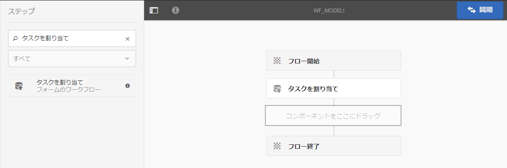
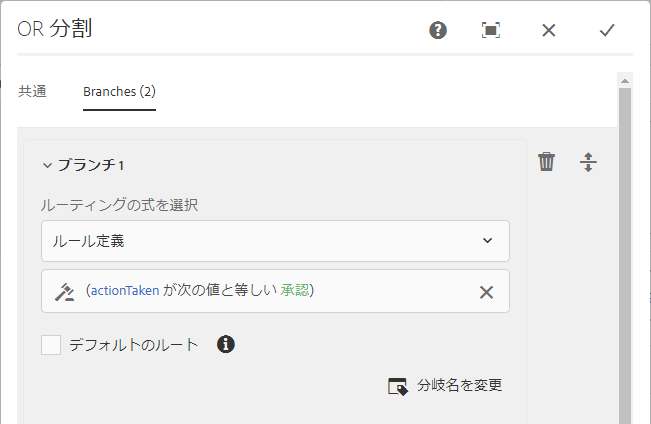
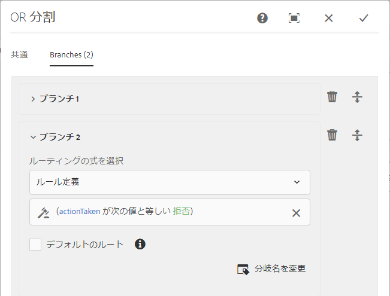

# OSGi 上の Forms 中心のワークフロー{#forms-centric-workflow-on-osgi}

企業は、膨大な数のフォーム、様々なバックエンドシステム、オンラインやオフラインのデータソースからデータを収集します。また、状況に応じて様々なユーザーがレビューや承認プロセスを繰り返し実施する必要があります。

内部および外部オーディエンスのレビューや承認プロセスと併せて、大規模な組織や事業では反復タスクを実施しています。例えば、PDF ドキュメントの別フォーマットへの変換などを行います。これらのタスクは、手動で行うと多くの時間とリソースを要します。企業には、ドキュメントに電子署名する法的要件が課せられます。またフォームのデータを今後使用するために事前に定義されたフォーマットでアーカイブする必要があります。 

## OSGi 上の Forms 中心のワークフローの導入 {#introduction-to-forms-centric-workflow-on-osgi}

AEM ワークフローを使用することで、アダプティブフォームベースのワークフローをすばやく構築することができます。これらのワークフローをレビューや承認、ビジネスプロセスフローに使用して、ドキュメントサービスを開始したり、Adobe Sign 署名ワークフローと統合したり、また類似の操作を行うことができます。例えば、クレジットカードの申し込み処理や従業員の休暇申請の承認ワークフローを実行し、フォームを PDF ドキュメントに保存できます。さらに、これらのワークフローは組織内やネットワークファイアウォール全体で使用することができます。

OSGi 上の Forms 中心のワークフローにより、OSGi スタック上の様々なタスクに対するワークフローをすばやく作成してデプロイすることができます。完全な Process Management 機能を JEE スタックにインストールする必要はありません。ワークフローの開発と管理では、従来の AEM ワークフロー機能と AEM インボックス機能が使用されます。ワークフローにより、複数のソフトウェアシステム、ネットワーク、部門、組織にわたる実際のビジネスプロセスを自動化するための基礎が構築されます。

これらのワークフローは一度設定すると、手動でトリガーして定義済みプロセスを完了することも、ユーザーによるフォームまたは [Correspondence Management](/help/forms/using/cm-overview.md) レターの送信時にワークフローをプログラムで実行することもできます。この拡張 AEM ワークフロー機能により、2 つの類似した機能を AEM Forms で使用することができます。デプロイメントを計画する際に、どちらの機能を使用するかを決める必要があります。See a [comparison](../../forms/using/capabilities-osgi-jee-workflows.md) of the Forms-centric AEM Workflows on OSGi and Process Management on JEE. Moreover, for the deployment topology see, [Architecture and deployment topologies for AEM Forms](/help/forms/using/aem-forms-architecture-deployment.md).

OSGi 上の Forms 中心のワークフローは、[AEM インボックス](/help/sites-authoring/inbox.md)を拡張し、AEM ワークフローエディターに追加のコンポーネント（ステップ）を提供することで、AEM Forms 中心のワークフローをサポートします。拡張 AEM インボックスは、[AEM Forms ワークスペース](../../forms/using/introduction-html-workspace.md)と同様の機能を持ちます。人間中心のワークフロー（承認やレビューなど）とともに AEM ワークフローを使用して、[ドキュメントサービス](/help/sites-developing/workflows-step-ref.md)に関する操作（PDF の生成など）と、Adobe Sign による電子署名処理を自動化することができます。

すべてのAEM Formsワークフローの手順で、変数の使用がサポートされます。 変数を使用すると、ワークフローステップで、実行時に複数のステップにわたってメタデータを保持および渡すことができます。 様々なタイプの変数を作成して、様々なタイプのデータを保存できます。また、同じ型の関連データの複数のインスタンスを格納する変数コレクション（配列）を作成することもできます。 一般に、変数または変数のコレクションを使用するのは、変数が保持する値に基づいて決定する必要がある場合、またはプロセスで後で必要になる情報を保存する場合です。これらのフォーム中心のワークフローコンポーネント（手順）での変数の使用について詳しくは、「 [OSGi上のフォーム中心のワークフロー — 手順リファレンス」を参照してください](../../forms/using/aem-forms-workflow-step-reference.md)。 変数の作成と管理について詳しくは、「AEM変数での変 [数」を参照してください](../../forms/using/variable-in-aem-workflows.md)。

次の図は、OSGi 上の Forms 中心のワークフローを作成、実行、監視するためのエンドツーエンドの手順を示します。

## 事前準備 {#before-you-start}

* ワークフローは、実世界のビジネスのプロセスを表すものです。実世界のビジネスプロセスを維持し、そのビジネスプロセスの参加者のリストを準備しましょう。また、ワークフローの作成を開始する前にコラテラル（アダプティブフォーム、PDF ドキュメントなど）を準備しましょう。
* ワークフローには複数のステージが含まれることがあります。これらのステージは、AEM インボックスに表示され、ワークフローの進捗のレポートに役立てられます。ビジネスプロセスを論理ステージに分割します。
* AEM ワークフローのタスクの割り当て手順で、電子メール通知をユーザーまたは担当者に送信するように設定することができます。これにより、[電子メール通知を有効にする](#configure-email-service)ことができます。
* ワークフローでは、電子署名に Adobe Sign も使用することができます。ワークフローで Adobe Sign を使用する予定がある場合、ワークフローで使用する前に [AEM Forms 用の Adobe Sign の設定](../../forms/using/adobe-sign-integration-adaptive-forms.md)を行う必要があります。

## ワークフローモデルを作成する {#create-a-workflow-model}

ワークフローモデルは、ビジネスプロセスのロジックとフローで構成されます。これは、ステップの連続で構成されます。これらのステップは、AEM のコンポーネントです。必要に応じて、ワークフローステップをパラメーターやスクリプトを使用してさらに機能性や制御が高くなるように拡張することができます。初期状態で使用できる AEM ステップに加えて、AEM Forms はいくつかのステップを提供しています。AEM と AEM Forms のステップの詳細なリストについては、「[AEM ワークフローステップのリファレンス](/help/sites-developing/workflows-step-ref.md)」と「[OSGi 上の Forms 中心のワークフロー - ステップのリファレンス](../../forms/using/aem-forms-workflow.md)」を参照してください。

AEM には、提供されているワークフローステップを使用してワークフローモデルを作成するための直感的なユーザーインターフェイスが用意されています。ワークフローモデルを作成するためのステップごとの手順については、「[ワークフローモデルの作成](/help/sites-developing/workflows-models.md)」を参照してください。次の例では承認およびレビューワークフローでワークフローモデルを作成するためのステップごとの手順が示されています。

>[!NOTE]
>
>ワークフローモデルを作成または編集するには、workflow-editor グループのメンバーである必要があります。

### 承認およびレビューワークフローのモデルの作成 {#create-a-model-for-an-approval-and-review-workflow}

承認およびレビューワークフローは、判断に人間の介入を必要とするタスクに使用されます。次の例では、金融機関本部で記入される住宅ローン申し込み用のワークフローモデルを作成します。アプリケーションが記入されると、承認に送信されます。その後、承認された申込書がAdobe Signを使用して電子署名の申込者に送信されます。

サンプルは、下記に添付されたパッケージとしてご利用いただけます。パッケージマネージャーを使ってサンプルをインポートしてインストールします。また、申込みのワークフローモデルを手動で作成するには、次の手順を実行します。

この例では、金融機関本部で記入される住宅ローン申し込みのためのワークフローモデルを作成します。アプリケーションが記入されると、承認に送信されます。その後、承認されたアプリケーションはお客様に送信され、Adobe Sign を使用した電子署名が求められます。パッケージマネージャーを使ってサンプルをインポートしてインストールできます。

[ファイルを入手](assets/example-mortgage-loan-application.zip)

1. ワークフローモデルコンソールを開きます。The default URL is `https://[server]:[port]/libs/cq/workflow/admin/console/content/models.html/etc/workflow/models`
1. 「**作成**」を選択してから、「**モデルを作成**」を選択します。ワークフローモデルを追加ダイアログが表示されます。
1. 「**タイトル**」と「**名前**」（オプション）を入力します。例えば、住宅ローン申し込みと入力します。「**完了**」をタップします。
1. Select the newly created workflow model and tap **Edit**. 」をクリックします。これで、ワークフローステップを追加してビジネスロジックを構築できます。新しいワークフローモデルを初めて作成する場合、次のものが含まれます。

   * フローの開始ステップと終了ステップ。これらのステップは、ワークフローの始まりと終わりを表します。これらのステップは必須で、編集または削除できません。
   * 手順1という名前の参加者の手順の例です。 このステップは、作業項目を管理者ユーザーに割り当てるように設定されています。このステップを削除します。

1. 電子メール通知を有効にします。OSGiでフォーム中心のワークフローを設定し、ユーザーまたは担当者に電子メール通知を送信できます。 電子メール通知を有効にするには、以下の設定を実行します。

   1. Go to AEM configuration manager at `https://[server]:[port]/system/console/configMgr`.
   1. **[!UICONTROL Day CQ 電子メールサービス]**&#x200B;の設定を開きます。「**[!UICONTROL SMTP サーバーのホスト名]**」、「**[!UICONTROL SMTP サーバーポート]**」、「**[!UICONTROL 送信元アドレス]**」フィールドの値を指定します。「**[!UICONTROL 保存]**」をクリックします。
   1. 「**[!UICONTROL Day CQ Link Externalizer]**」の設定を開きます。「**[!UICONTROL ドメイン]**」フィールドで、ローカルインスタンス、オーサーインスタンス、発行インスタンスの実際のホスト名 / IP アドレスとポート番号を指定します。「**[!UICONTROL 保存]**」をクリックします。

1. ワークフローステージを作成します。ワークフローには複数のステージが含まれることがあります。これらのステージは、AEM インボックスに表示され、ワークフローの進捗をレポートします。

   To define a stage, tap the  icon to open workflow model properties, open the **Stages** tab, add stages for the workflow model, and tap **Save &amp; Close**. 住宅ローン申し込みのサンプルでは、ローン申請、ローン申請ステータス、署名予定ドキュメント、署名済みローンドキュメントのステージを作成します。

1. Drag-and-drop the **Assign Task** steps browser to the workflow model. これをモデルの最初のステップにします。

   タスクの割り当てコンポーネントは、ワークフローの作成したタスクをユーザーまたはグループに割り当てます。このコンポーネントにより、タスクの割り当てだけでなく、タスクで使用するアダプティブフォームや非インタラクティブ PDF を指定することもできます。アダプティブフォームは、ユーザーからの入力を受け取るために必要です。また、非インタラクティブ PDF または読み取り専用のアダプティブフォームは、レビュー専用のワークフローに使用されます。

   また、タスクの動作を制御するためにステップを使用することもできます。例えば、レコードの自動ドキュメントの作成、特定のユーザーまたはグループへのタスクの割り当て、送信されたデータのパス、事前に入力されるデータのパス、デフォルトのアクションを制御できます。For detailed information about the options of the assign task step, see [Forms-centric workflow on OSGi - Step Reference](../../forms/using/aem-forms-workflow.md) document.

   

   住宅ローンのサンプルでは、読み取り専用のアダプティブフォームを使用してタスクの割り当て手順を設定し、タスクの完了後に PDF ドキュメントを表示します。また、ローン申請を承認できるユーザーグループも選択します。「**アクション**」タブで、「**送信**」オプションを無効にします。Stringデータ型 **の** actionTaken **変数を作成し、その変数を「** Route Variable」として指定します。 例えば、actionTaken のように指定します。また、承認と拒否のルートを追加します。ルートは、AEM インボックスでは別のアクション（ボタン）として表示されます。ワークフローでは、ユーザーがタップした操作（ボタン）に基づいてブランチが選択されます。

   セクションの始めに示すサンプルパッケージを読み込むことにより、サンプルの住宅ローン申し込みに設定されているタスクの割り当て手順のすべてのフィールドの値セットを入手できます。

1. OR 分割コンポーネントをステップブラウザーからワークフローモデルにドラッグアンドドロップします。OR 分割は、ワークフロー内に分割を作成し、以降は 1 つのブランチだけがアクティブになります。これを使用すると、ワークフローに条件付き処理パスを導入できます。必要に応じて、各ブランチにワークフローステップを追加できます。

   ブランチのルーティング式は、ルール定義、ECMAスクリプトまたは外部スクリプトを使用して定義できます。

   式エディタを使用して、ブランチ1とブランチ2のルーティング式を作成します。 これらのルーティング式は、AEM Inboxのユーザーアクションに基づいて分岐を選択するのに役立ちます。

   **ルーティング式2**

   When a user taps **Approve** in AEM Inbox, Branch 1 is activated.

   

   **ルーティング式2**

   When a user taps **Reject** in AEM Inbox, Branch 2 is activated.

   

   変数を使用したルーティング式の作成について詳しくは、「AEM Forms [ワークフローの変数」を参照してくださ](../../forms/using/variable-in-aem-workflows.md)い。

1. その他のワークフローステップを追加し、ビジネスロジックを構築します。

   住宅ローンのサンプルでは、以下の画像に示すように、1 つのレコードのドキュメント、2 つのタスクの割り当て手順、1 つのドキュメントの署名ステップをモデルのブランチ 1 に追加します。タスクの割り当て手順の 1 つは&#x200B;**申請者の署名予定ローンドキュメント**&#x200B;の表示と送信に使用し、もう 1 つは、**署名済みドキュメント**&#x200B;の表示に使用します。また、ブランチ 2 にタスクの割り当てコンポーネントも追加します。ユーザーがAEMの受信トレイで「拒否」をタップすると、アクティブになります。

   サンプルの住宅ローン申し込みに設定されているタスクの割り当て手順、レコードのドキュメント手順、ドキュメントの署名手順のすべてのフィールドの値セットは、セクションの始めに示す場所からダウンロードできます。

   ワークフローモデルが準備できました。ワークフローを様々な方法で起動することができます。詳しくは、「[OSGi 上での Forms 中心のワークフローの起動](#launch)」を参照してください。

   

## Forms ベースのワークフローアプリケーションの作成 {#create-a-forms-centric-workflow-application}

アプリケーションは、ワークフローに関連付けられているアダプティブフォームです。インボックス経由でアプリケーションが送信されると、関連するワークフローが起動します。AEM インボックス および AEM Forms アプリケーションで、フォームワークフローをアプリケーションとして使用できるようにするには、以下の手順でワークフローアプリケーションを作成します。

>[!NOTE]
>
>ワークフローアプリケーションを作成して管理するには、fd-administrator グループのメンバーである必要があります。

1. On your AEM author instance, go to  > **[!UICONTROL Forms]**> **[!UICONTROL Manage Workflow Application]** and taps **[!UICONTROL Create]**.
1. In the Create Workflow Application window, provide inputs for the following fields, and taps **Create**. 新しいアプリケーションが作成され、ワークフローアプリケーション画面にリストされます。

<table>
 <tbody>
  <tr>
   <td>フィールド</td>
   <td>説明</td>
  </tr>
  <tr>
   <td>タイトル</td>
   <td>タイトルは AEM インボックスに表示され、ユーザーがアプリケーションを選択するのに役立ちます。タイトルは、内容が分かりやすいものにしてください。例えば、預金口座開設アプリケーションのようにします。  </td>
  </tr>
  <tr>
   <td>名前 </td>
   <td>アプリケーションの名前を指定します。英数字、ハイフン、アンダースコア以外の文字はすべてハイフンで置き換えられます。 </td>
  </tr>
  <tr>
   <td>説明</td>
   <td>説明は、AEM インボックスに表示されます。アプリケーションに関する詳細な情報を説明フィールドに入力します。例えば、アプリケーションの目的を入力します。  </td>
  </tr>
  <tr>
   <td>アダプティブフォーム</td>
   <td>
アダプティブフォームのパスを指定します。ユーザーがアプリケーションを起動すると、指定したアダプティブフォームが表示されます。
 
<strong>注意</strong>：ワークフローアプリケーションは、1 ページを超えたり Apple iPad でスクロールを必要としたりするフォームや PDF ドキュメントをサポートしません。アプリケーションをApple iPadで開き、アダプティブフォームまたはPDFドキュメントが1ページより長い場合、2ページ目のフォームフィールドとコンテンツは失われます。
 </td>
  </tr>
  <tr>
   <td>アクセスグループ</td>
   <td>
グループを選択します。アプリケーションは、選択されたグループのメンバーにのみ AEM インボックスで表示されます。アクセスグループオプションを使用すると、ワークフローユーザーグループのすべてのグループを選択することができます。 
   </td>
  </tr>
  <tr>
   <td>事前入力サービス</td>
   <td>アダプティブフォームの<a href="../../forms/using/prepopulate-adaptive-form-fields.md#aem-forms-custom-prefill-service" target="_blank">事前入力サービス</a>を選択します。  </td>
  </tr>
  <tr>
   <td>ワークフローモデル</td>
   <td>アプリケーションの<a href="../../forms/using/aem-forms-workflow.md#create-a-workflow-model">ワークフローモデル</a>を選択します。ワークフローモデルは、ビジネスプロセスのロジックとフローで構成されます。 </td>
  </tr>
  <tr>
   <td>データファイルのパス</td>
   <td>crx-repository のデータファイルのパスを指定します。パスは、アダプティブフォームのペイロードに対する相対パスとなり、データファイルの名前が含まれます。必ず拡張子を含む完全なファイル名を指定してください（該当する場合）。例えば、[payload]/data.xml のようになります。 </td>
  </tr>
  <tr>
   <td>添付ファイルのパス</td>
   <td>crx-repository の添付ファイルフォルダーのパスを指定します。添付ファイルのパスは、ペイロードの場所に対する相対パスです。例えば、[payload]/data.xml のようになります。 </td>
  </tr>
  <tr>
   <td>レコードのドキュメントのパス</td>
   <td>crx-repository のレコードファイルのドキュメントのパスを指定します。パスは、アダプティブフォームのペイロードの場所に対する相対パスです。必ず拡張子を含む完全なファイル名を指定してください（該当する場合）。例えば、[payload]/DOR/creditcard.pdf のようになります。</td>
  </tr>
 </tbody>
</table>

## OSGi 上での Forms 中心のワークフローの起動 {#launch}

Forms 中心のワークフローは、次のように起動またはトリガーできます。

* [AEM インボックスからのアプリケーションの送信](#inbox)
* [AEM Forms アプリケーションからのアプリケーションの送信](#afa)

* [アダプティブフォームの送信](#af)
* [監視フォルダーの使用](#watched)

* [インタラクティブ通信またはレターの送信](#letter)

### AEM インボックスからのアプリケーションの送信 {#inbox}

作成したワークフローアプリケーションは、インボックスでアプリケーションとして使用できます。workflow-users グループのメンバーであるユーザーは、関連するワークフローをトリガーするアプリケーションを入力して送信できます。For information about using AEM Inbox to submit applications and manage tasks, see [Manage Forms applications and tasks in AEM Inbox](../../forms/using/manage-applications-inbox.md).

### AEM Forms アプリケーションからのアプリケーションの送信 {#afa}

AEM Forms アプリケーションは、AEM Forms サーバーと同期されます。アカウントで AEM Forms アプリケーションを使用して、フォームデータ、タスク、ワークフローアプリケーション、保存済み情報（ドラフト、テンプレート）を変更することができます。For more information, see [AEM Forms app](/help/forms/using/aem-forms-app.md) and related articles.

### アダプティブフォームの送信 {#af}

アダプティブフォームの送信アクションを、アダプティブフォームの送信時にワークフローを開始するように設定することができます。アダプティブフォームでは、**AEM ワークフローを起動**&#x200B;送信アクションにより、アダプティブフォームの送信時にワークフローが開始するようにできます。送信アクションについて詳しくは、「[送信アクションの設定](../../forms/using/configuring-submit-actions.md)」を参照してください。AEM Forms アプリケーションを使用してアダプティブフォームを送信するには、アダプティブフォームのプロパティで「AEM Forms アプリケーションと同期」オプションを有効にします。

アダプティブフォームを設定して、ワークフローの同期、送信、トリガーを AEM Forms アプリケーションから実行することができます。詳しくは、「[フォームの操作](/help/forms/using/working-with-form.md)」を参照してください。

### 監視フォルダーの使用 {#watched}

管理者（fd-administrator グループのメンバー）はネットワークフォルダーを設定することにより、ユーザーがそのフォルダーにファイル（PDF ファイルなど）を配置すると、設定済みワークフローが実行されるようにすることができます。ワークフローが完了したら、結果のファイルを指定した出力フォルダーに保存できます。このようなフォルダーを[監視フォルダー](../../forms/using/watched-folder-in-aem-forms.md)と呼びます。監視フォルダーがワークフローを起動するよう設定するには、以下の手順を実行します。

1. On your AEM author instance, go to  **>**[!UICONTROL Forms]**> Configure Watched Folder.** 既に設定されている監視フォルダーのリストが表示されます。
1. 「**[!UICONTROL 新規]**」をタップします。フィールドのリストが表示されます。次のフィールドの値を指定して、ワークフローに監視フォルダーを設定します。

<table>
 <tbody>
  <tr>
   <td>フィールド</td>
   <td>説明</td>
  </tr>
  <tr>
   <td>名前</code></td>
   <td>監視フォルダーの名前を指定します。このフィールドは、英数字のみサポートします。</td>
  </tr>
  <tr>
   <td>パス</code></td>
   <td>監視フォルダーの物理的な位置を指定します。クラスター環境では、AEM クラスターノードからアクセスできる共有ネットワークフォルダーを指定します。</td>
  </tr>
  <tr>
   <td>次を使用してファイルを処理</code></td>
   <td>Select the Workflow </code>option. </code></td>
  </tr>
  <tr>
   <td>ワークフローモデル</code></td>
   <td>ワークフローモデルを選択します。  </td>
  </tr>
  <tr>
   <td>出力ファイルパターン</code></td>
   <td>出力ファイルと出力ディレクトリのディレクトリ構造を指定します。<a href="/help/forms/using/admin-help/configuring-watched-folder-endpoints.md" target="_blank">出力ファイルと出力ディレクトリのパターン</a>を指定することもできます。</td>
  </tr>
 </tbody>
</table>

1. 「**詳細設定**」をタップします。Specify a value for the following field and taps **Create**. ワークフローを起動するように監視フォルダーを設定することができます。現在は、ファイルが監視フォルダーの入力ディレクトリに配置されるたびに、指定したワークフローがトリガーされます。

   | フィールド | 説明 |
   |---|---|
   | ペイロードマッパーフィルター | 監視フォルダーを作成すると、crx-repository にフォルダー構造を作成します。このフォルダー構造はワークフローへのペイロードとして使用されます。AEM ワークフローをマッピングして監視フォルダー構造からの入力を受け入れるようにするスクリプトを記述することができます。初期設定済みの実装を使用することができ、ペイロードマッパーフィルターにリストされます。カスタムの実装がない場合は、デフォルトの実装を選択します。 |

   「詳細設定」タブには多数のフィールドが含まれています。これらのほとんどのフィールドにはデフォルトの値が指定されています。すべてのフィールドについて詳しくは、「[監視フォルダーの作成または設定](/help/forms/using/admin-help/configuring-watched-folder-endpoints.md)」の記事を参照してください。

### インタラクティブ通信またはレターの送信 {#letter}

インタラクティブな通信またはレターの送信時に、OSGi上でフォーム中心のワークフローを関連付けて実行できます。 Correspondence Managementワークフローは、インタラクティブな通信とレターの後処理に使用されます。 例えば、最終的なレターの送信、印刷、Fax、アーカイブでワークフローが使用されます。詳しい手順については、「[インタラクティブ通信とレターの後処理](../../forms/using/submit-letter-topostprocess.md)」を参照してください。

## 追加設定 {#additional-configurations}

### 電子メールサービスの設定 {#configure-email-service}

AEM ワークフローの「タスクを割り当て」ステップと「電子メールを送信」ステップを使用して、電子メールを送信することができます。電子メールを送信するために必要な電子メールサーバーと各種の設定を指定するには、以下の手順を実行します。

1. Go to AEM configuration manager at `https://[server]:[port]/system/console/configMgr`.
1. **[!UICONTROL Day CQ 電子メールサービス]**&#x200B;の設定を開きます。「**[!UICONTROL SMTP サーバーのホスト名]**」、「**[!UICONTROL SMTP サーバーポート]**」、「**[!UICONTROL 送信元アドレス]**」フィールドの値を指定します。「**[!UICONTROL 保存]**」をクリックします。
1. 「**[!UICONTROL Day CQ Link Externalizer]**」の設定を開きます。「**[!UICONTROL ドメイン]**」フィールドで、ローカルインスタンス、オーサーインスタンス、発行インスタンスの実際のホスト名 / IP アドレスとポート番号を指定します。「**[!UICONTROL 保存]**」をクリックします。

### ワークフローインスタンスの削除 {#purge-workflow-instances}

ワークフローインスタンスの数を最小限に抑えるとワークフローエンジンのパフォーマンスが向上します。このため、完了したまたは実行中のワークフローインスタンスをリポジトリから定期的に削除できます。詳しくは、「ワークフローインスタンスの [定期的な削除」の「ワークフローインスタンス](/help/sites-administering/workflows-administering.md#regular) の削除」を参照してください。
