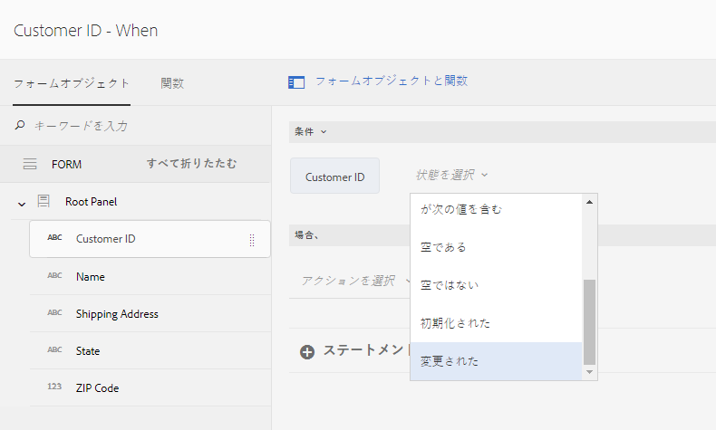
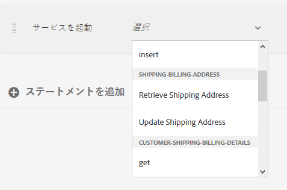

# チュートリアル：アダプティブフォームのフィールドにルールを適用する {#tutorial-apply-rules-to-adaptive-form-fields}


これは、[最初のアダプティブフォームを作成する](/help/forms/using/create-your-first-adaptive-form.md)シリーズを構成するチュートリアルです。チュートリアル内のユースケースを理解して実際に操作できるように、このシリーズのチュートリアルを最初から順に学習することをお勧めします。

## このチュートリアルについて {#about-the-tutorial}

ルールを作成して、インタラクティブ機能、ビジネスロジック、スマート検証機能をアダプティブフォームに追加することができます。アダプティブフォームには、ルールエディターが組み込まれています。ルールエディターには、ガイドツアー機能に類似したドラッグアンドドロップ機能が用意されています。このドラッグアンドドロップ機能は、ルールを作成するための最も効率的で簡単な方法です。ルールエディターには、自分のコーディング技術を試してみたいユーザーや、より複雑なコードを作成したいと考えているユーザーのために、コードウィンドウが用意されています。

ルールエディターの詳細については、[アダプティブフォームのルールエディタ－](/help/forms/using/rule-editor.md)を参照してください。

このチュートリアルを終了すると、ルールを作成して以下の操作を実行できるようになります。

* フォームデータモデルサービスを呼び出して、データベースからデータを取得する
* フォームデータモデルサービスを呼び出して、データベースにデータを追加する
* 検証チェック処理を実行して、エラーメッセージを表示する

このチュートリアルの各セクションの最後にあるインタラクティブな GIF 画像で、作成するフォームの機能をその場で確認することができます。

## 手順 1：データベースから顧客レコードを取得する {#retrieve-customer-record}

[フォームデータモデルの作成](/help/forms/using/create-form-data-model.md)チュートリアルでフォームデータモデルを作成しましたが、ここでは、ルールエディターを使用してそのフォームデータモデルサービスを呼び出し、データを取得してデータベースに情報を追加します。

すべての顧客に一意の顧客 ID 番号が割り当てられているため、特定の顧客に関連する顧客データをデータベース内で特定することができます。以下の手順では、顧客 ID を使用して、データベースから情報を取得します。

1. アダプティブフォームを編集用に開きます。

   [http://localhost:4502/editor.html/content/forms/af/change-billing-shipping-address.html](http://localhost:4502/editor.html/content/forms/af/change-billing-shipping-address.html)

1. 「**[!UICONTROL 顧客 ID]**」フィールドをタップし、「**[!UICONTROL ルールを編集]**」アイコンをタップします。ルールエディターウィンドウが表示されます。
1. 「**[!UICONTROL + 作成]**」アイコンをタップしてルールを追加します。ビジュアルエディターが表示されます。

   ビジュアルエディターでは、**[!UICONTROL WHEN]**&#x200B;ステートメントがデフォルトで選択されています。 また、ルールエディターの起動元となるフォームオブジェクト（この場合は&#x200B;**[!UICONTROL 顧客ID]**）は、 **[!UICONTROL WHEN]**&#x200B;ステートメントで指定されます。

1. 「**[!UICONTROL 状態を選択]**」ドロップダウンをタップし、「**[!UICONTROL 変更済み]**」を選択します。

   

1. 「**[!UICONTROL THEN]**」ステートメントの「**[!UICONTROL アクションの選択]**」ドロップダウンで「**[!UICONTROL サービスの呼び出し]**」を選択します。
1. 「**[!UICONTROL 選択]**」ドロップダウンで「**[!UICONTROL 発送先住所を取得]**」サービスを選択します。
1. 「フォームオブジェクト」タブの「**[!UICONTROL 顧客ID]**」フィールドを「**[!UICONTROL オブジェクトをドロップするか、**[!UICONTROL  INPUT ]**」ボックスの「]**」フィールドを選択します。

   

1. 「フォームオブジェクト」タブの「**[!UICONTROL 顧客ID、名前、配送先住所、都道府県、郵便番号]**」フィールドを「**[!UICONTROL OUTPUT]**」ボックスの「**[!UICONTROL オブジェクトをドロップするか、「]**」フィールドを選択します。

   

   「**[!UICONTROL 完了]**」をクリックして、ルールを保存します。ルールエディターウィンドウで、「**[!UICONTROL 閉じる]**」をタップします。

1. アダプティブフォームのプレビューを表示します。「**[!UICONTROL 顧客 ID]**」フィールドに ID を入力します。これで、データベース内の顧客情報をフォームに取り込むことができます。

   

## 手順 2：更新後の顧客住所をデータベースに追加する {#updated-customer-address}

データタベースから顧客情報を取得したら、出荷先住所、都道府県、郵便番号を変更します。ここでは、フォームデータモデルサービスを呼び出し、顧客情報を変更してデータベースに保存する手順について説明します。

1. 「**[!UICONTROL 送信]**」フィールドを選択して「**[!UICONTROL ルールを編集]**」アイコンをタップします。ルールエディターウィンドウが表示されます。
1. **[!UICONTROL 送信 — クリック]**&#x200B;ルールを選択し、**[!UICONTROL 編集]**&#x200B;アイコンをタップします。 送信ルールを編集するオプションが表示されます。

   

   「WHEN」オプションでは、「**[!UICONTROL 送信]**」と「**[!UICONTROL 」がクリックされた場合に、「]**」のオプションが既に選択されています。

   

1. 「**[!UICONTROL THEN]**」オプションで「**[!UICONTROL + ステートメントを追加]**」オプションをタップします。「**[!UICONTROL アクションの選択]**」ドロップダウンで「**[!UICONTROL サービスの呼び出し]**」を選択します。
1. 「**[!UICONTROL 選択]**」ドロップダウンで「**[!UICONTROL 出荷先住所の更新]**」を選択します。

   

   

1. **[!UICONTROL 配送先住所、都道府県、郵便番号]**&#x200B;フィールドを[!UICONTROL フォームオブジェクト]タブから&#x200B;**[!UICONTROL Dropオブジェクトの対応する.property（customerdetails .shippingAddressなど）にドラッグ&amp;ドロップするか、**[!UICONTROL  INPUT&lt;a7の&#x200B;]**フィールドを選択します。/>ボックスに置き換えます。]** tablenameのプレフィックスが付いたすべてのフィールド（この使用例ではcustomerdetailsなど）が、更新サービスの入力データとして機能します。 これらのフィールドで指定された値は、すべてデータソース内で更新されます。

   >[!NOTE]
   >
   >**[!UICONTROL 名前]**&#x200B;および&#x200B;**[!UICONTROL 顧客ID]**&#x200B;フィールドを対応するtablename.property（例えば、customerdetails.name）にドラッグ&amp;ドロップしないでください。 これにより、誤って顧客の名前とIDを更新するのを防ぐことができます。

1. 「フォームオブジェクト」タブの「**[!UICONTROL 顧客 ID]**」フィールドをドラッグし、「**[!UICONTROL 入力]**」ボックスの「id」フィールドにドロップします。tablenameが付いていないフィールド（この使用例ではcustomerdetailsなど）は、更新サービスの検索パラメーターとして機能します。 この使用例の&#x200B;**[!UICONTROL id]**&#x200B;フィールドは、**customerdetails**&#x200B;テーブル内のレコードを一意に識別します。
1. 「**[!UICONTROL 完了]**」をクリックして、ルールを保存します。ルールエディターウィンドウで、「**[!UICONTROL 閉じる]**」をタップします。
1. アダプティブフォームのプレビューを表示します。顧客の詳細情報を取得し、発送先住所を変更してフォームを送信します。同じ顧客の詳細情報をもう一度取得すると、更新された発送先住所が表示されます。

## 手順 3：（オプション）コードエディターを使用して検証処理を実行し、エラーメッセージを表示する {#step-bonus-section-use-the-code-editor-to-run-validations-and-display-error-messages}

フォームにデータが正しく入力されているかどうかを確認するには、そのフォーム上で検証処理を実行する必要があります。データが正しく入力されていない場合は、エラーメッセージが表示されます。例えば、存在しない顧客 ID がフォームに入力されている場合は、エラーメッセージが表示されます。

アダプティブフォームには、検証機能が組み込まれたコンポーネントがいくつか用意されています（共通のユースケースで使用できる電子メールや数値フィールドなど）。高度なユースケース（データベースからレコードが 1 件も返されなかった場合にエラーメッセージを表示するなど）の場合は、ルールエディターを使用します。

次の手順は、フォームに入力した顧客IDがデータベースに存在しない場合にエラーメッセージを表示するルールを作成する方法を示しています。 また、このルールは、フォーカスを移し、**[!UICONTROL 顧客ID]**&#x200B;フィールドをリセットします。 このルールでは、フォームデータモデルサービス](/help/forms/using/invoke-form-data-model-services.md)のdataIntegrationUtils APIを使用して、データベースに顧客IDが存在するかどうかを確認します。[

1. 「**[!UICONTROL 顧客ID]**」フィールドをタップし、「`Edit Rules`」アイコンをタップします。 [!UICONTROL ルールエディター]ウィンドウが開きます。
1. 「**[!UICONTROL + 作成]**」アイコンをタップしてルールを追加します。ビジュアルエディターが表示されます。

   ビジュアルエディターでは、**[!UICONTROL WHEN]**&#x200B;ステートメントがデフォルトで選択されています。 また、ルールエディターの起動元となるフォームオブジェクト（この場合は&#x200B;**[!UICONTROL 顧客ID]**）は、 **[!UICONTROL WHEN]**&#x200B;ステートメントで指定されます。

1. 「**[!UICONTROL 状態を選択]**」ドロップダウンをタップし、「**[!UICONTROL 変更済み]**」を選択します。

   

   「**[!UICONTROL THEN]**」ステートメントの「**[!UICONTROL アクションの選択]**」ドロップダウンで「**[!UICONTROL サービスの呼び出し]**」を選択します。

1. **[!UICONTROL ビジュアルエディター]**&#x200B;から&#x200B;**[!UICONTROL コードエディター]**&#x200B;に切り替えます。切り替え用コントロールは、ウィンドウの右側にあります。コードエディターが開き、以下のようなコードが表示されます。

   

1. 「input」変数セクションのコードを以下のように変更します。

   ```javascript
   var inputs = {
       "id" : this
   };
   ```

1. `guidelib.dataIntegrationUtils.executeOperation (operationInfo, inputs, outputs)`セクションを次のコードに置き換えます。

   ```javascript
   guidelib.dataIntegrationUtils.executeOperation(operationInfo, inputs, outputs, function (result) {
     if (result) {
         result = JSON.parse(result);
       customer_Name.value = result.name;
       customer_Shipping_Address = result.shippingAddress;
     } else {
       if(window.confirm("Invalid Customer ID. Provide a valid customer ID")) {
             customer_Name.value = " ";
            guideBridge.setFocus(customer_ID);
       }
     }
   });
   ```

1. アダプティブフォームのプレビューを表示します。正しくない顧客 ID を入力して、エラーメッセージが表示されることを確認します。

   
